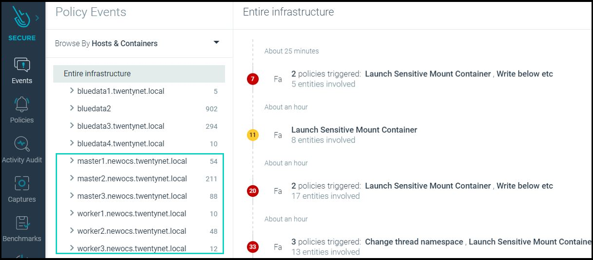
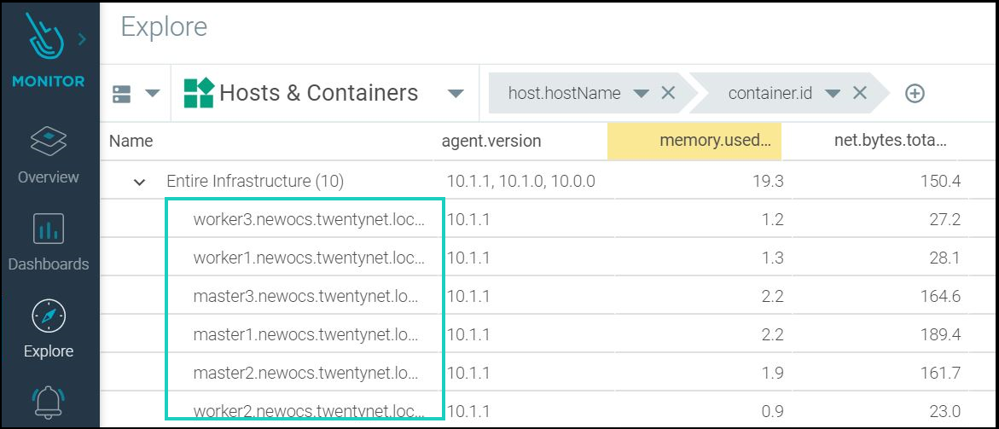

# HPE Deployment Guide for integrating Sysdig (sysdig SaaS model for secure and monitor) agents with Red Hat OpenShift Container Platform

##### Description

This repo contains Ansible plays and scripts to automate the installation of sysdig agents over the Red Hat OpenShift 4.x nodes.

Contents of the repo are:

**playbooks:** This folder contains the playbook required for sysdig agent installtion over ocp 4.x.

**roles:** This folder contains a role called "sysdig-agent-deploy-ocp" which is responsible for performing the actions required for sysdig agent integration.

**hosts:** This is the host file which will be used by OpenShift installer machine to reference hosts during sysdig agent deployment.

**secrets.yml:** This file contains sensitive information about the sysdig SaaS platform access details and Red Hat OpenShift Cluster access details.

##### Prerequisites
 
 - Ansible engine with Ansible 2.9.x and Python  3.6.x

 - Red Hat OpenShift 4.x is up and running. 
 
 - User has SaaS based access to Sysdig Secure and Sysdig Monitor for the purpose of Container Security.
 
 - User has "admin rights and privilege" for Sysdig Secure and Sysdig Monitor.
 
 - User has valid access token that is given by Sysdig and is specific to their credentials on Sysdig SaaS platform.
 
 - User has updated the kernel to make sure on all the nodes have same kernel version. Information regading this can be found by logging into sysdig monitor account. Then go to setting and under Agent Installation you will find instructions to install the kernel headers.
 
 - Enable passwordless ssh from Openshift installer machine to itself (Openshift installer machine or localhost)
   - Create passwordless ssh to installer VM by generating the ssh key
     ```
	 # ssh-keygen
	 ```
	 Note: press enter to overwrite the id_rsa.pub file and also press enter for empty password
	 
   - Copy the ssh key to id_rsa.pub file using following command
     ```
	 # ssh-copy-id -i ~/.ssh/id_rsa.pub nonrootusername@ansible_engine_machine_ip
	 ```


##### Software requirements 
| Software          | Version |
|--|--|
| HPE OneView	    | 5 |
| Sysdig SaaS Agent | 10.1.1 |


##### Input Files
 - Playbook for Sysdig SaaS integration with RedHat OpenShift Container Platform are available under BASE_DIR/platform/security-sysdig/
   Note: BASE_DIR is defined and set in installer machine section of the deployment guide
   
 - It is mandatory to update all the inputs  files (hosts, secrets.yml, sysdig-agent-configmap.yaml) with appropriate values before running the playbook available in this repository.
	
	- Input file name: hosts
	    1. This file is an inventory of host details
		2. This file is available under BASE_DIR/platform/security-sysdig/
	    3. Specify the ansible engine machine IP as the value of the variable.
        ```
        # [ocp_installer_machine_ip]
        ```
	
	- Input file name: sysdig-agent-configmap.yaml
	    1. This file is available under BASE_DIR/platform/security-sysdig/roles/sysdig-agent-deploy-ocp/files/
		2. Provide the Sysdig SaaS Platform Address and Port Number along with RedHat OpenShift Cluster name
		```
		# collector: <sysdig_saas_collector_address>
        # collector_port: <collector_port>
        # k8s_cluster_name:  <replace_with_ocp_cluster_name>
		```
	
	- Input file name: secrets.yml
	    1. This file is available under BASE_DIR/platform/security-sysdig/
		2. Provide value of project name for sysdig integration with OCP. This project will be created in OpenShift.
	    3. Provide the access key/token value. This value you need to get from user setting by logging into either sysdig secure or sysdig monitor GUI
		4. Provide RedHat Openshift username and password to login
		```
		projectname: <sysdig_project_name>
		accesskeyval: <sysdig_saas_access_key>
		ocpuser: <RedHat_OpenShift_User_Name>
		ocppassword: <RedHat_OpenShift_User_Password>
		```
	- Input file name: sysdig-agent-deployment.yaml
	    1. This file is available under BASE_DIR/platform/security-sysdig/playbooks/
		2. Update the KUBECONFIG and oc command path
	    ```
		KUBECONFIG: <replace_with_kubeconfig_path>
        PATH: <replace_with_ocp_installation_dir_path>:{{ ansible_env.PATH }}
		```
		
##### How to Use

- Execute the following commands from the ansible installer VM in the python virtual environment as a non root user.
    ```
    # cd BASE_DIR/platform/security-sysdig/
    # ansible-playbook -i hosts playbooks/sysdig-agent-deployment.yaml --ask-vault-pass
    ```
	**Note**
  * BASE_DIR is defined and set in installer machine section in deployment guide
  * The default password for the Ansible vault file is **changeme**

- Verification of after successful execution of the playbook. Run the command listed below to get the sysdig pods information
  ```
  # oc get pods | grep sysdig-agent
  ```
  
  Output of above command should show you all sysdig pods in running state. 
  ```
  sysdig-agent-2ljgw   1/1     Running   0          42m
  sysdig-agent-cdxtc   1/1     Running   0          42m
  sysdig-agent-frr7k   1/1     Running   0          42m
  sysdig-agent-gkcmk   1/1     Running   0          42m
  sysdig-agent-pzrvr   1/1     Running   2          42m
  sysdig-agent-qv6qh   1/1     Running   0          42m
  ```
  
  Note: Number of sysdig pods ahould be equal to number of nodes that user sees after running the following command:
  ```
  # oc get nodes
  ```
  
  Output of above command shows number of nodes in the RedHat OpenShift Cluster
  ```
  NAME                             STATUS   ROLES    AGE   VERSION
  master1.newocs.twentynet.local   Ready    master   64d   v1.17.1
  master2.newocs.twentynet.local   Ready    master   64d   v1.17.1
  master3.newocs.twentynet.local   Ready    master   64d   v1.17.1
  worker1.newocs.twentynet.local   Ready    worker   64d   v1.17.1
  worker2.newocs.twentynet.local   Ready    worker   64d   v1.17.1
  worker3.newocs.twentynet.local   Ready    worker   64d   v1.17.1
  ```

  Note: If you see a pod on pending state then there might be a possibility that underlying OCP node is not functional.

- Login to Sysdig Secure and under Policy Events --> Hosts and Containers --> user will find all the node that are part of your RedHat OpenShift infra and this shows sysdig agents are successfully installed and security checks are being run on all those nodes.
  
  

- Login to Sysdig Monitor and under Explore --> Hosts and Containers --> user will find all the node that are part of your RedHat OpenShift infra and this shows sysdig agents are successfully installed and monitoring on all those nodes.

  
