---
---

# Red Hat OpenShift Container Platform on HPE Synergy and HPE 3PAR Fibre Channel with VMware Virtualization

# Overview

This document describes the steps required to create a Red Hat OpenShift
Container Platform environment running on HPE Synergy and HPE 3PAR
StoreServ Storage, using VMware vSphere as the hypervisor and
virtualization management layer. It is meant to be used in conjunction
with files and Ansible playbooks found at
<https://github.com/HewlettPackard/hpe-solutions-openshift/tree/3.11/synergy/scalable/3par-vsphere/fc>
.

Hewlett Packard Enterprise plans to update this document over time with
enhancements to deployment methodologies as well as new software
versions, features and functions. It is recommended that the user review
this document along with the installation process described by Red Hat
at <https://docs.openshift.com/container-platform/3.11/install/> in its
entirety and understand all prerequisites prior to installation.

# Solution Layout

Figure 1 provides a conceptual view of the overall architecture.
OpenShift masters and Load Balancer nodes are deployed as virtual
machines (VMs) running on three (3) HPE Synergy 480 Gen10 Compute
Modules running VMware vSphere Virtualization host, and managed by
VMware vCenter Server appliance. Red Hat OpenShift infrastructure
functions are deployed on physical worker nodes running Red Hat
Enterprise Linux 7.6. While the figure shows three (3) workers within
the cluster, as the workload and number of container pods grow, the
solution can scale to accommodate new performance requirements.

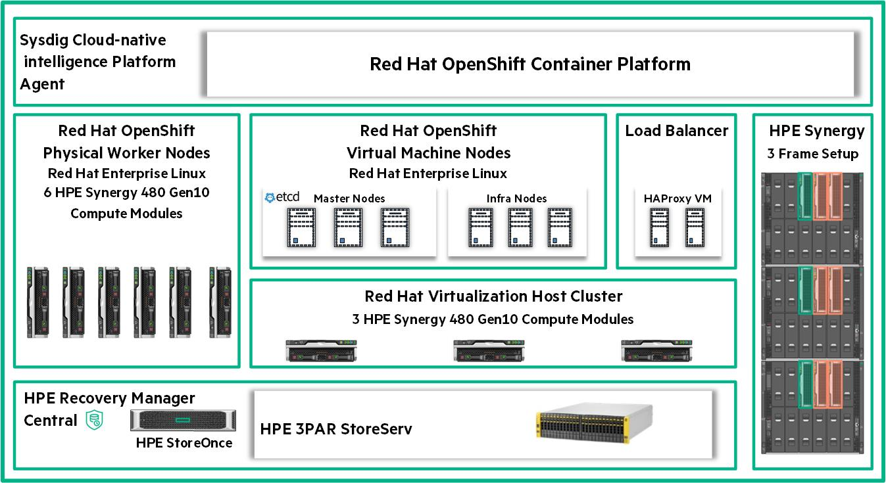

**Figure 1.** Solution layout

**NOTE**

Scripts and files provided as part of the hpe-solutions-openshift
repository are examples of how to configure your infrastructure. It is
expected that the user will need to adapt them to work in the deployment
environment.

# Solution Design

Figure 2 below highlights the overview of the solution design from a
layout and data storage perspective. For detailed descriptions of the
components used to create this solution consult the sections following
this overview.

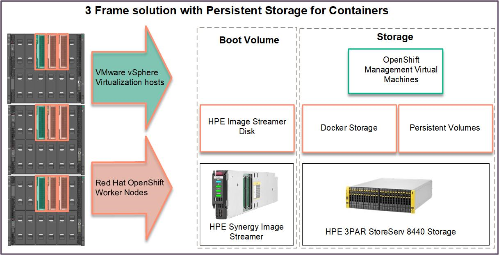

**Figure 2.** Solution design by function and storage type

**NOTE**

Containers and images are created and stored in Docker storage backend.
This is ephemeral and separate for persistent storage allocated to meet
the needs of your application. Docker Storage in Figure 3 refers to this
ephemeral storage. For more information, visit
<https://docs.openshift.com/container-platform/3.11/install/host_preparation.html#configuring-docker-storage>

Figure 3 shows the logical design of the solution including where
volumes are attached and virtual machines are running in a Fibre Channel
based deployment.

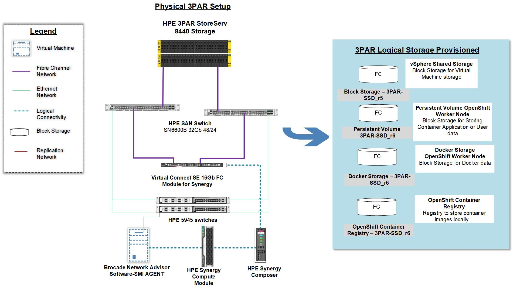

**Figure 3.** Logical layout of the solution stack

Figure 4 describes the physical network layout within the environment
and includes the network utilized by Image Streamer to deploy vSphere
Virtualization Hosts and the physical worker nodes.


**Figure 4.** Physical network layout within the OpenShift solution

There are five (5) networks defined in this solution. The five networks
are:

- **Synergy Management Network -** This network is specific to the
requirements of HPE Synergy.

- **Management Network -** This network facilitates the management of
hardware and software interfaces by IT.

- **Data center Network -** This network is a public access network used
to connect end-users to applications.

- **Storage Network -** Fibre Channel network A and B provide redundant,
multipath connectivity to SAN resources within the solution.

- **Deployment Network -** This network is for Image streamer to provide
boot volume to the vSphere virtualization nodes and RHEL Worker nodes.

# Solution creation process

Figure 5 shows the flow of the installation process adopted in this
document. For readability, a high-resolution copy of this image is
located at,
<https://github.com/HewlettPackard/hpe-solutions-openshift/tree/3.11/synergy/scalable/3par-vsphere/fc>
. It is recommended that the user download and review this
high-resolution image prior to proceeding.

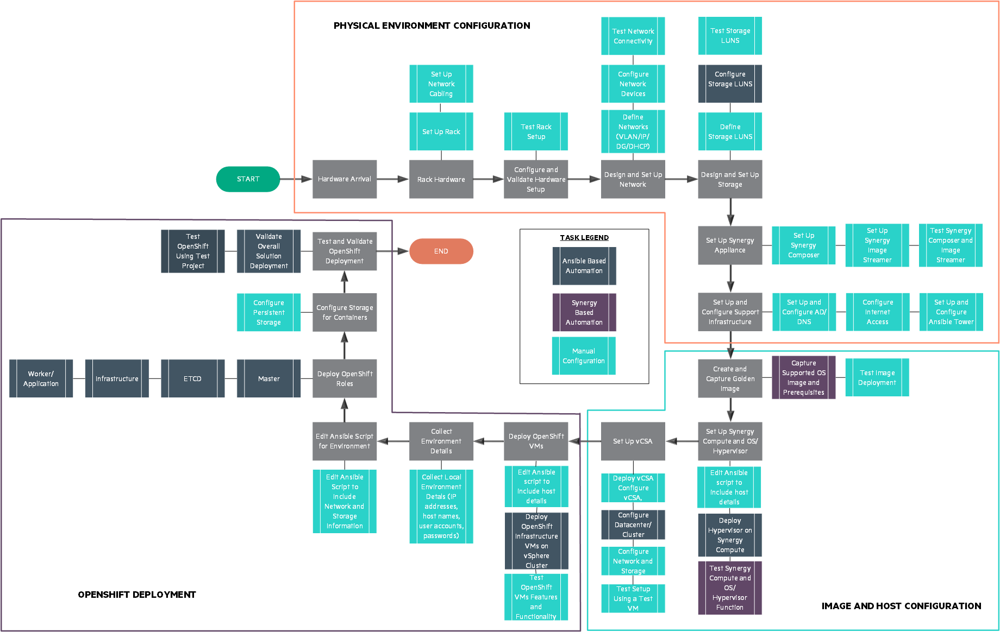

**Figure 5.** Solution creation flow diagram

# Sizing details for Red Hat OpenShift Container Platform deployment

Sizing for a Red Hat OpenShift Container Platform environment varies
depending on the requirements of the organization and type of
deployment. This section recommends the sizing details for Red Hat
OpenShift Container Platform, host requirements and cluster sizing.

## OpenShift roles sizing details

The following role-based sizing guidance was followed during the
creation of the solution:

### Master nodes

Master nodes should have the following minimums:

- vCPU -- 4

- RAM -- 16GB

- Disk storage

-- /var -- 40GB

-- /usr/local/bin -- 1GB

-- Temporary directory -- 1GB

**NOTE**

For every **additional 1000 pods**, master nodes should be configured
with an additional 1 vCPU and 1.5GB of RAM.

### Worker nodes

Worker nodes should have the following minimums:

- vCPU -- 1

- RAM -- 8GB

- Disk storage

-- /var -- 15GB

-- /usr/local/bin -- 1GB

-- Temporary directory -- 1GB

**NOTE**

Require a minimum of 15GB of unallocated space for Docker's storage back
end for running containers. Sizing for worker nodes is ultimately
dependent on the container workloads and their CPU, memory, and disk
requirements.

### etcd

etcd nodes should have the following minimums:

- vCPU -- 4

- RAM -- 24GB

- Disk storage -- 20GB

- No. of etcd nodes -- 3

### **Load balancer**

It is recommended to use commercially available load balancer software
for enterprise deployments. This solution was developed using HA Proxy,
an open source solution with two (2) virtual machines to serve the
function of load balancing. Hewlett Packard Enterprise has published a
separate deployment guide in conjunction with F5 Networks, which
documents how to integrate enterprise load balancing into this solution.

### **Infrastructure nodes**

When running EFK stack on infrastructure nodes, 2 vCPU and 24GB RAM is
recommended for optimal performance.

## Red Hat OpenShift Container Platform cluster sizing

The number of application nodes in an OpenShift cluster depends on the
number of pods that an organization is planning on deploying. Red Hat
OpenShift Container Platform can support the following:

- Maximum of 2000 nodes per cluster

- Maximum of 150,000 pods per cluster

- Maximum of 250 pods per node

- Maximum pods per CPU core is the number of pods per node

To determine the number of nodes required in a cluster, estimate the
number of pods the organization is planning on deploying and divide by
the maximum number of pods per node.

For example, if the organization plans to deploy 5000 pods,
then the organization should deploy a minimum of 20 application nodes
with 250 pods per node.

```

(5000 / 250 = 20)

```

In this environment with a default configuration of six (6) physical
application nodes, the Red Hat OpenShift cluster should be expected to
support 1500 pods.

```

250 pods x 6 nodes = 1500 pods
```

For more information about Red Hat OpenShift Container Platform sizing,
refer to the Red Hat OpenShift Container Platform product documentation
at,
<https://docs.openshift.com/container-platform/3.11/scaling_performance/index.html>
, and
<https://access.redhat.com/documentation/en-us/openshift_container_platform/3.11/html-single/scaling_and_performance_guide/index>
.

# Prerequisites

This section highlights the prerequisites for the solution.

## Software versions

Table 1 describes the versions of important software utilized in the
creation of this solution. The user should ensure that they download or
have access to this software. Also ensure that appropriate subscriptions
and licensing are in place to use within the planned timeframe.

Table 1. Major software versions used in solution creation

| **Component**  | **Header**  |
|---------|---------|
| Red Hat Enterprise Linux Server | 7.6 |
| VMware ESXi | 6.7.0-Update1-11675023-HPE |
| VMware vCenter Server Appliance | 6.7.0-11338176 |
| Red Hat OpenShift Container Platform | 3.11 |

## Deployment environment

This document is built with the assumptions about services and networks
available within the implementation environment. This section discusses
those assumptions and wherever applicable, it provides details on how
they should be configured. If a service is optional, it is noted in the
description.

### Services

Table 2 disseminates the services utilized in the creation of this
solution and provides a high-level explanation of their function and
whether or not they are required.

Table 2. Services used in the creation of this solution

| **Service** | **Required/Optional** | **Description/Notes** |
| --------------------- | --------------------- | ------------------------------------------------------------ |
| DNS | Required | Provides name resolution on management and data center networks, optionally on iSCSI networks. |
| DHCP | Required | Provides IP address leases on PXE, management and usually for data center networks. Optionally used to provide addresses on iSCSI networks. |
| NTP | Required | Required to ensure consistent time across the solution stack. |
| Active Directory/LDAP | Optional | May be used for authentication functions on various networks, including providing LDAP functionality.|
| Ansible Engine | Required | Provides the platform to build and deploy automation playbooks. |

#### DNS

Name services must be in place for management and data center networks.
Once host becomes active, ensure that both forward and reverse lookups
are working on the management and data center networks.

The following host entries must be made in the appropriate domains:

- vSphere virtualization hosts

- vCenter server appliance

- Management nodes

-- Master

-- Infrastructure

-- Load balancer

- RHEL worker nodes

#### NTP

A Network Time Protocol (NTP) server should be available to hosts within
the environment.

#### User laptop

A laptop system with the ability to connect to various components within
the solution stack is required.

### Ansible Engine

This document assumes that an RHEL 7.6 server is available within the
deployment environment for utilizing as an Ansible Engine and is
accessible to the user.

Login to the Ansible Engine and perform the following steps:

1) Register the server with the Red Hat Customer Portal using the
following command.

```

# subscription-manager register --username=**<red hat subscription
username>** --password **=<red hat subscription password>>**
--auto-attach

```

2) Pull the latest subscription data from the Red Hat subscription
manager using the following command.

```

# subscription-manager refresh

```

3) Find an available subscription pool for virtual system that provides
the OpenShift Container Platform channels using the following command.

```

# subscription-manager list --available --matches '*OpenShift*'

```

4) Attach a pool ID for a subscription that provides entitlement for
OpenShift Container Platform.

```

# subscription-manager attach --pool=<pool_id>

```

5) Disable all the repositories using the following command.

```

# subscription-manager repos --disable="*"

```

6) Enable repositories using the following commands.

```

# subscription-manager repos --enable rhel-7-server-extras-rpms

# subscription-manager repos --enable rhel-7-server-rpmsthe following

# subscription-manager repos --enable rhel-7-server-ose-3.11-rpms

# subscription-manager repos --enable rhel-7-server-ansible-2.6-rpms

```

**NOTE**

This solution is developed using **Python 3.6.x** along with **Ansible
2.7.2.**

### Install Python and Ansible

The following steps should be taken to assist in the installation of the
appropriate Python and Ansible versions.

1) Install Python 3.6.x using the following command.

```

# yum -y install rh-python36

```

2) Enable the Python 3.6.x environment using the following command.

```

# scl enable rh-python36 bash

```

3) Create a new virtual environment for deploying this solution with
the following command.

```

# python3 -m venv **<virtual environment name>**

```

4) Activate the virtual environment.

```

# source **<virtual environment name>/bin/activate**

```

5) **Install** Ansible 2.7.2 with the following command.

```

# python3 -m pip install ansible==2.7.2

```

### Clone required repositories

This solution utilizes multiple Python and Ansible repositories. This
section lists the steps to clone and install the repos.

1) Execute the following commands from the Ansible engine to clone the
repositories.

```

# cd /etc/ansible

# git clone --b 3.11
<https://github.com/HewlettPackard/hpe-solutions-openshift.git>

```

2) oneview-ansible is the Ansible Module for HPE OneView which utilizes
the Python SDK to enable infrastructure as a code.

a) Clone the repository found at
<https://github.com/HewlettPackard/oneview-ansible/>

b) Navigate to the directory oneview-ansible on the Ansible Engine and
execute the following commands.

```

# cd <path to oneview-ansible>

# pip install --r requirements.txt

```

c) Export the path of **oneview-ansible/library** and
**oneview-ansible/library/module_utils** to the environment variables
*ANSIBLE_LIBRARY* and *ANSIBLE_MODULE_UTILS* using the following
commands.

```

# export ANSIBLE_LIBRARY=<absolute path to /oneview-ansible/library>

# export ANSIBLE_MODULE_UTILS=<absolute path to
/oneview-ansible/library/module_utils>

```

3) pyVmomi is the Python SDK for the VMware vSphere API that allows
managing ESX, ESXi, and vCenter. Execute the following command from the
Ansible Engine.

```

# pip install pyVmomi

```

# Physical environment configuration

## Overview

This section describes the configuration deployed for this solution in
detail. At a high level, Hewlett Packard Enterprise and Red Hat deployed
the following:

- Three (3) HPE Synergy 12000 Frames with HPE Virtual Connect SE 40Gb F8
Modules for Synergy

- Two (2) HPE Synergy Composer

- Two (2) HPE Synergy Image Streamer

- Two (2) HPE FlexFabric (FF) 5945 switches

- HPE 3PAR StoreServ 8440 Array serving as primary storage

- Two (2) HPE SN6600B Fibre Channel switches

- Nine (9) HPE Synergy 480 Gen10 Compute Modules, with three (3)
virtualized hosts running the required Red Hat OpenShift infrastructure
and management software and six (6) bare metal hosts dedicated as worker
nodes

Figure 6 shows the physical configuration of the racks used in this
solution.

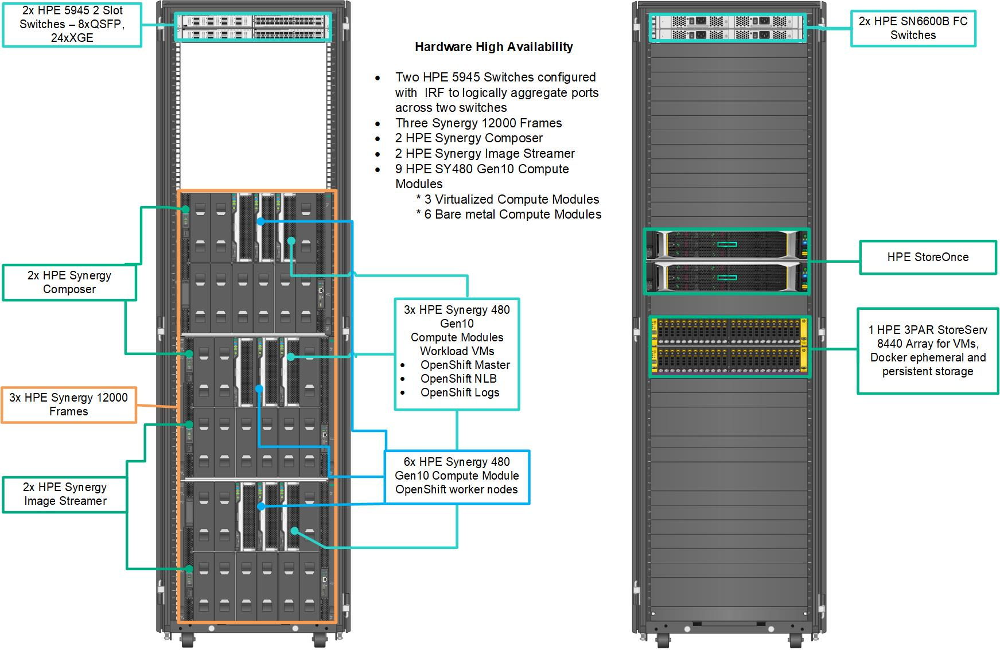

**Figure 6.** Physical layout of the compute within the solution

This configuration is based on the design guidance of an HPE Converged
Architecture 750 which offers an improved time to deployment and tested
firmware recipe. The recipe can be found at
<http://h17007.www1.hpe.com/us/en/enterprise/integrated-systems/info-library/index.aspx?cat=convergedsystems&subcat=cs750>
. It is recommended that the user utilize the latest available matrix.

The user also has the flexibility of customizing the HPE components
throughout this stack according to their unique IT and workload
requirements or building with individual components.

**Table 3** . Components utilized in the creation of this solution.

| **Component** | **Quantity** | **Description** |
| ------------- | ------------ | --------------- |
| HPE Synergy 12000 Frame | 3 | Three (3) HPE Synergy 12000 Frames house the infrastructure used for the solution |
| HPE Virtual Connect 40Gb SE F8 Module | 2 | Two (2) HPE Virtual Connect 40Gb SE F8 Modules provide network connectivity into and out of the frames |
| HPE Synergy 20Gb Interconnect Link Module | 4 | Four (4) HPE Synergy 20Gb Interconnect Link Modules carry traffic between frames in the solution |
| HPE Virtual Connect SE 16Gb FC Module for Synergy | 2 | Two (2) HPE Virtual Connect SE 16GB FC Modules for Synergy per HPE Synergy 12000 Frame provide connectivity to external Fibre channel switching |
| HPE Synergy Image Streamer | 2 | Provides OS volumes to OpenShift worker nodes |
| HPE SN6600B Fibre Channel Switches | 2 | Provides connectivity from the Synergy infrastructure to the HPE 3PAR StoreServ SAN |
| HPE Synergy 480 Gen10 Compute Module | 9 | Three (3) virtualized and six (6) bare metal hosts as described later in this document |
| HPE FlexFabric 5945 2-Slot Switch | 2 | Each switch contains one (1) each of the modules that appear below |
| HPE 5930 24p SFP+ and 2p QSFP+ Module | 2 | One module per HPE FlexFabric 2-Slot Switch |
| HPE 5930 8-port QSFP+ Module | 2 | One module per HPE FlexFabric 2-Slot Switch |
| HPE Synergy Composer | 2 | Core configuration and lifecycle management for the Synergy components |
| HPE 3PAR StoreServ 8440 Storage | 1 | Single array for virtual machines, Docker storage and persistent volumes. Array configuration, drive selection and overall capacity should be based on the requirements within the installation environment. |

## Cabling the HPE Synergy 12000 Frame, HPE Virtual Connect 40Gb SE F8 Modules for Synergy and HPE Synergy VC SE 16GB FC Modules

This section shows the physical cabling between frames as well as the
physical connectivity between the switching. It is intended to provide
an understanding of how the infrastructure was interconnected during
testing and a guide for the user to base their configuration. Figure 7
shows the cabling of the HPE Synergy Interconnects, HPE Synergy Frame
Management, HPE Synergy Management, and HPE Intelligent Resilient Fabric
(IRF) connections. These connections handle east-west network
communication as well as management traffic within the solution.

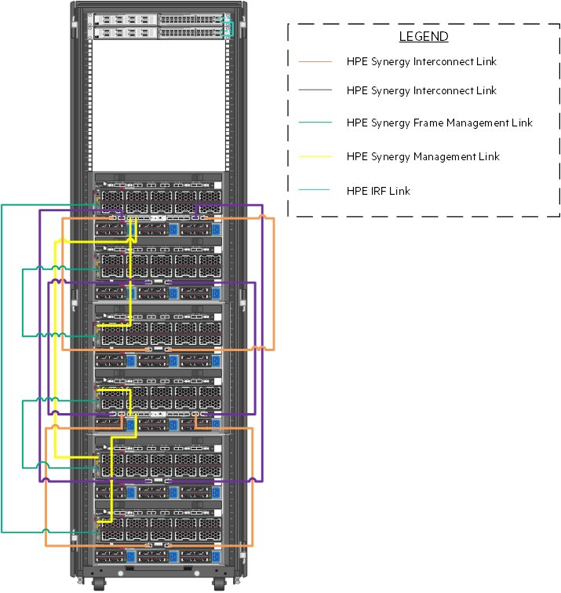

**Figure 7.** Cabling of the management and inter-frame communication
links within the solution

Figure 8 shows the cabling of the Synergy frames to the network
switches. The specific networks contained within the Bridge-Aggregation
Groups are described in more detail later in this section. At the lowest
level, there are four (4) 40GbE connections dedicated to carrying
redundant, production network traffic on a single Bridge-Aggregation
Group to the first layer switch where it is further distributed.

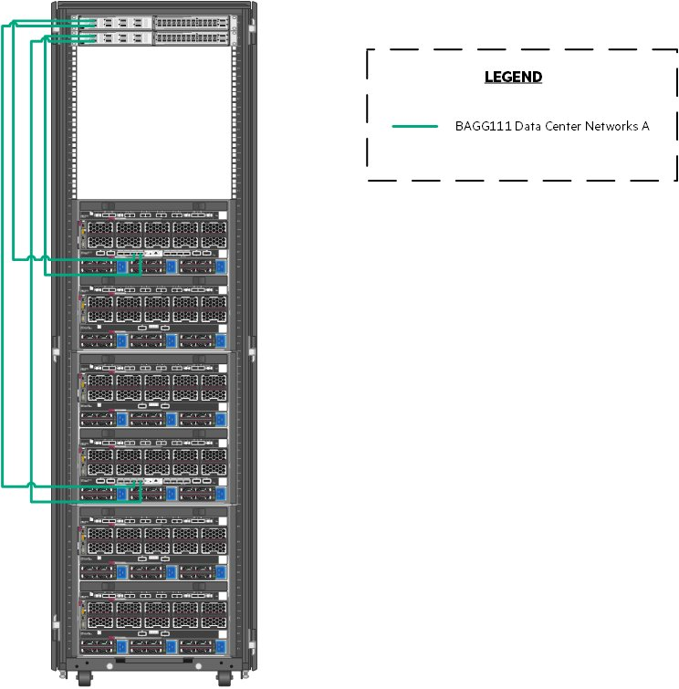

**Figure 8.** Cabling of the HPE Synergy 12000 Frames to the HPE
FlexFabric 5945 switches.

Table 4 explains the cabling of the Virtual Connect interconnect modules
to the HPE FlexFabric 5945 switching.

**Table 4.** Uplink set mapping.

| **Uplink set** | **Synergy source** | **Switch destination** |
| -------------- | ------------------ | ---------------------- |
| Network | Enclosure 1 Port Q3 | FortyGigE1/1/1 |
| Network | Enclosure 1 Port Q4 | FortyGigE2/1/1 | |
| Network | Enclosure 2 Port Q3 | FortyGigE1/1/2 | |
| Network | Enclosure 2 Port Q4 | FortyGigE2/1/2 | |

## Configuring the solution switching

The solution described in this document utilized HPE FlexFabric 5945
switches. The HPE FlexFabric 5945 switches are configured as per the
configuration parameters below. The switches should be configured with
an HPE Intelligent Resilient Framework (IRF). To understand the process
of configuring IRF, consult the HPE FlexFabric 5940 Switch Series
Installation Guide at,
<https://support.hpe.com/hpsc/doc/public/display?sp4ts.oid=null&docLocale=en_US&docId=emr_na-c05212026>
. This guide may also be used to understand the initial installation of
switching as well as creation of user accounts and access methods. The
remainder of this section assumes that the switch has been installed,
configured for IRF, hardened, and is accessible over SSH.

**NOTE**

The user may choose to utilize end of row switching to reduce switch and
port counts in the context of the solution. If end of row switching is
the approach, then this section should be used as guidance for how to
route network traffic outside the HPE Synergy Frames.

### Switch cabling

Table 5 is a map of source ports to ports on the HPE FlexFabric 5945
switches.

**Table 5.** Source port to destination port mapping.

| **Source Port** | **Switch Port** |
| --------------- | --------------- |
| Virtual Connect Frame U30, Q3 | FortyGigE1/1/1 |
| Virtual Connect Frame U30, Q4 | FortyGigE2/1/1 |
| Virtual Connect Frame U30, Q5 | FortyGigE1/1/5 |
| Virtual Connect Frame U30, Q6 | FortyGigE1/1/6 |
| Virtual Connect Frame U40, Q3 | FortyGigE1/1/2 |
| Virtual Connect Frame U40, Q4 | FortyGigE2/1/2 |
| Virtual Connect Frame U40, Q5 | FortyGigE2/1/5 |
| Virtual Connect Frame U40, Q6 | FortyGigE2/1/6 |
| To Upstream Switching | Customer Choice |

It is recommended that the installer log on to the switch
post-configuration and provide a description for each of these ports.

### Network definitions

Table 6 defines the Ethernet networks configured using HPE Synergy
Composer in the creation of this solution. These networks should be
defined at both the first layer switch as well as within Composer. This
solution utilizes unique VLANs for the Data Center and Solution
Management segments. Actual VLANs and network counts will be determined
by the requirements of your production environment.

**Table 6.** Networks used in this solution

| **Network Function** | **VLAN Number** | **Bridge Aggregation Group** |
| -------------------- | --------------- | ---------------------------- |
| Solution_Management | 1193 | 111 |
| Data_Center | 2193 | 111 |
| Deployment | 100 | | NA |

To add these networks to the switch configuration, log on to the console
over SSH and run the following commands.

```

# sys

# vlan 500 1193 2193

```

For each of these VLANs perform the following steps.

```

# interface vlan-interface ####

# name VLAN Name per table above

# description Add text that describes the purpose of the VLAN

# quit

```

It is strongly recommended that the installer configure a dummy VLAN on
the switches and assign unused ports to that VLAN.

The switches should be configured with separate bridge aggregation
groups for the different links to the HPE Synergy frame connections. To
configure the three (3) bridge-aggregation groups and ports as described
in the tables 6, run the following commands.

For the data center and management VLANs run the following commands.

```

# interface Bridge-Aggregation111

# link-aggregation mode dynamic

# description <FrameNameU30>-ICM

# quit

# interface range name <FrameNameU30>-ICM interface
Bridge-Aggregation111

# quit

# interface range FortyGigE 1/1/1 to FortyGigE 1/1/2 FortyGigE 2/1/1 to
FortyGigE 2/1/2

# port link-aggregation group 111

# quit

# interface range name <FrameNameU30>-ICM

# port link-type trunk

# undo port trunk permit vlan 1

# port trunk permit vlan 500 1193 2193

# quit

```

When configuration of the switches is complete save the state and apply
it by typing **save** and following the prompts.

## HPE Synergy 480 Gen10 Compute Modules

This section describes the connectivity of the HPE Synergy 480 Gen10
Compute Modules used in the creation of this solution. The HPE Synergy
480 Gen10 Compute Modules, regardless of function, were all configured
identically. Table 7 describes the individual components. Server
configuration, including processor selection and memory capacity should
be based on customer needs and the configuration used in the creation of
this solution may not align with the requirements of any given
production implementation.

**Table 7.** Host configuration

| **Component** | **Quantity** |
| ------------- |------------- |
| HPE Synergy 480/660 Gen10 Intel, Xeon, -Gold 5218 (2.3GHz/16-core/125W) FIO Processor Kit | 2 per server |
| HPE 16GB (1x16GB) Single Rank x4 DDR4-2933 CAS-21-21-21 Registered Smart Memory Kit | 24 per server |
| HPE Synergy 3820C 10/20Gb Converged Network Adapter | 2 per server |
| HPE Synergy 3530C 16G Fibre Channel Host Bus Network Adapter | 2 per server |
| HPE Smart Array P204i-c SR Gen10 12G SAS controller | 1 per server |
| HPE 1.92TB SATA 6GB Mixed Use SFF (2.5in) 3yr Warranty Digitally Signed Firmware SSD | 2 per management host |

### Virtualized master hosts

The solution calls for the installation of VMware vSphere Virtualization
version 6.7 (ESXi) on three (3) HPE Synergy 480 Gen10 Compute Modules.
These hosts house the required master nodes and load balancers for the
solution. These components are installed as virtual machines which
consolidates the infrastructure within the solution stack compared to
physical hosts. Figure 9 below highlights the connectivity of these
hosts. Networks that are carried on the bridge aggregation group are
shown in Table 6 earlier in this document.

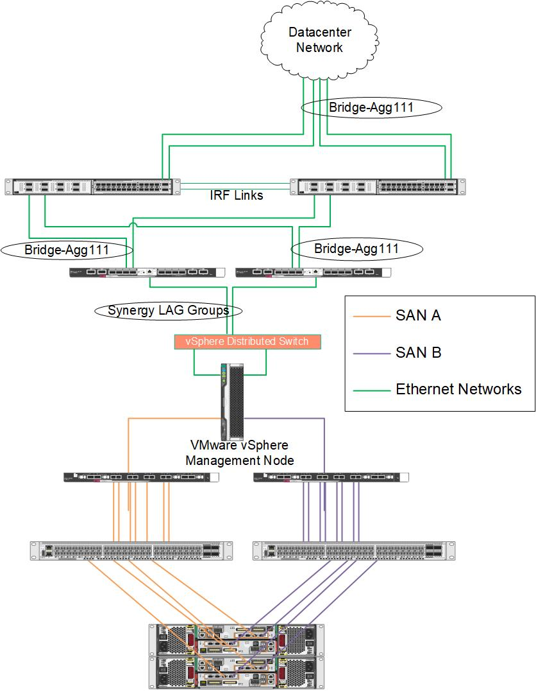

**Figure 9.** VMware vSphere virtualization host connectivity

**Note**

The HPE custom ISO for VMware vSphere 6.7 should be used to create the
golden image that will be used to boot the virtualization hosts in the
solution.

Each host is presented with access to a shared, 3TB storage volume that
houses the virtual machines used in the solution. Figure 2 and Figure 14
in this document provide more information about this relationship.
Volume sizes are flexible based on implementation requirements.

### Bare metal worker nodes

Six (6) HPE Synergy 480 Gen10 Compute Modules are deployed as Red Hat
OpenShift worker nodes and run Red Hat Enterprise Linux Server version
7.6 as their operating system. Figure 10 below highlights the
connectivity of these hosts. As with the virtualization hosts, refer to
Table 6 in this document for an explanation of networks carried on each
individual bridge aggregation group.

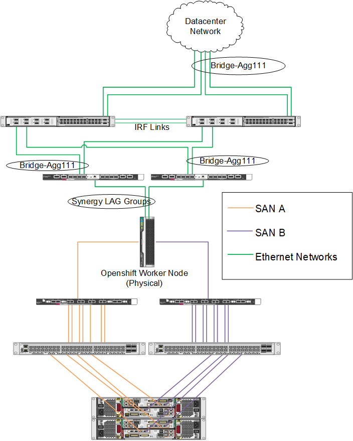

**Figure 10.** Red Hat OpenShift worker node network connectivity

## HPE Synergy Composer

At the core of the management of the Synergy environment is HPE Synergy
Composer. A pair of HPE Synergy Composers are deployed across frames to
provide redundant management of the environment for both initial
deployment and changes over the lifecycle of the solution. HPE Synergy
Composer is used to configure the environment prior to the deployment of
the operating systems and applications.

This section walks through the process of installing and configuring the
HPE Synergy Composer.

### Configure the HPE Synergy Composer via VNC

To configure HPE Synergy Composer with the user laptop, follow these
steps:

1) Configure the user laptop physical NIC with the IP address
*192.168.10.2/24*. No gateway is required.

2) Connect a CAT5e cable from the laptop NIC to the laptop port on the
front of a Synergy Composer.

3) Once connected, open a browser and point it to
http://192.168.10.1:5800. This will open the HPE Synergy Console on the
user laptop.

4) Once the console comes up select **Connect** to start HPE OneView for
Synergy.

5) Select **Hardware Setup** and enter the following information when
prompted. Note that this solution places the HPE Synergy Composers on
the management network. Pre-populating DNS with IP information is
recommended.

a. Appliance host name:**Fully qualified name of the HPE Synergy
Composer**

b. Address assignment: **Manual**

c. IP address: **Enter an IP address on the management network**

d. Subnet mask:**Enter the subnet mask of the management network**

e. Gateway address: **Enter the gateway for the network**

f. Maintenance IP address 1:**Enter a maintenance IP address on the
management network**

g. Maintenance IP address 2: **Enter a secondary maintenance IP
address on the management network**

h. Preferred DNS server: **Enter the DNS server**

i. IPv6 Address assignment: **Unassign**

6) Once all information has been entered click **OK** to proceed. This
will start a hardware discovery process which may take some time to
complete. Once the process has finished, check for issues and correct
them. The HPE Synergy Frame setup and installation guide available at,
<https://www.hpe.com/info/synergy-docs> offers suggestions to fix common
issues.

7) Select the **OneView** menu at the top of the screen and select
**Settings** and then click **Appliance**. Validate that both appliances
are connected and show a green checkmark.

### Configure appliance credentials

Log into the **HPE OneView** **for Synergy appliance**. At first login
you will be asked to define credentials for the Administrator user. To
do this, accept the **EULA** and in the *HPE OneView Support* box ensure
that *Authorized Service* is **Enabled.** Login as **Administrator**
with the password **admin**. You will be prompted to enter a new
password.

### Configure solution firmware

This solution adheres to the firmware recipe specified in the HPE
Converged Solutions 750 specifications which can be found in the CS750
Firmware and Software Compatibility Matrix. The solution used the
firmware recipe from June 2018.

1) Select the **OneView** menu and select **Settings.**

2) Under *Appliance* select **Update** **Appliance** and **update**
**Composer.**

3) Once the update process completes, validate that both Composer
modules are connected and there is a green checkmark.

### Solution configuration

The user should utilize the Synergy guided setup to complete the
following solution configuration details.

#### NTP

Configure the use of a Network Time Protocol server in the environment.

#### Create additional users

It is recommended that the installer create a read-only user and an
Administrator account with a different username than Administrator.

#### Firmware

Upload a firmware bundle based on the HPE Converged Solutions 750
recipe. Once the bundle starts uploading you can proceed to additional
steps without disrupting the upload.

#### Create an IP Pool on the management network

Follow the guidance to create an IP pool on the management network. This
IP pool will provide IP addresses to management IPs and HPE device iLOs
within the solution. Ensure that the pool is enabled prior to
proceeding.

#### Create an IP Pool for the HPE Synergy Image Streamer deployment network

The addresses created in this pool will be used for the iSCSI boot
network of HPE Image Streamer. The HPE Image Streamer targets and
compute module initiators will receive their IP addresses from this
pool.

#### Configure Ethernet networks

As explained in the Network Configuration portion of the switch
configuration section of this document, the solution utilizes at least
three (3) network segments. Use the *Create networks* section of the
*Guided Setup* wizard to define the networks shown in Table 8 at a
minimum. Your VLAN values will generally differ from those described
below.

Table 8. Networks defined within HPE Synergy Composer for this solution

| **Network Name** | **Type** | **VLAN Number** | **Purpose** |
| ---------------- | -------- | --------------- | ----------- |
| Management | Ethernet | 1193 | Solution management, Migration |
| Data_Center | Ethernet | 2193 | Application, authentication and other user networks |

The management network should be associated with the management network
IP pool of the user specified in the prior step. The user should create
any additional required networks for the solution.

#### Create Logical Interconnect Groups

Within Composer use the *Guided Setup* to create a Logical Interconnect
Group with a single uplink set defined. For this solution the uplink set
was named Network and carries all outbound networks defined for the
solution. The ports used for outbound connectivity are Enclosure 1,
Interconnect Bay 3, Ports Q3 and Q4 and Enclosure 2, Interconnect Bay 6,
Ports Q3 and Q4. Each uplink is a 40GbE link.

#### Create enclosure group

1) From the *Guided Setup* choose **Create enclosure group**.

2) Provide a name and enter the number of frames.

3) Choose **Use address pool** and utilize the management pool defined
earlier.

4) Use the Logical Interconnect Group from the prior step in the
creation of the Enclosure Group.

5) Select **Create** when ready.

#### Create logical enclosure

Use the Guided Setup to create a logical enclosure making use of all
three (3) enclosures. Select the firmware you uploaded earlier as a
baseline. It can take some time for the firmware to update across the
solution stack. Ensure that firmware is in compliance with the baseline
by selecting **Actions** and then **Update Firmware**. Click
**Cancel** to exit.

# Solution storage

HPE 3PAR StoreServ 8440 Storage provides shared and dedicated storage
for a variety of purposes within this solution including housing virtual
machines and persistent volumes. Figure 11 shows the cabling of the HPE
Synergy 12000 frames to the HPE Fibre Channel switching utilized in this
solution.


**Figure 11.** Cabling of the HPE Synergy interconnects and HPE SN6600B
switching

Table 9 below describes the cabling from the HPE Synergy 12000 Frames to
the HPE SN6600B Fibre Channel switches.

**Table 9.** Cabling between HPE Synergy and HPE SN6600B switching

| **Source Port (Frame)** | **Destination Port (Switch)** |
| ----------------------- | ----------------------------- |
| Frame 1, ICM 2, Port 1 | SAN Switch A, Port 10 |
| Frame 1, ICM 2, Port 2 | SAN Switch A, Port 11 |
| Frame 1, ICM 2, Port 3 | SAN Switch A, Port 16 |
| Frame 1, ICM 2, Port 4 | SAN Switch A, Port 17 |
| Frame 1, ICM 5, Port 1 | SAN Switch B, Port 10 |
| Frame 1, ICM 5, Port 2 | SAN Switch B, Port 11 |
| Frame 1, ICM 5, Port 3 | SAN Switch B, Port 16 |
| Frame 1, ICM 5, Port 4 | SAN Switch B, Port 17 |
| Frame 2, ICM 2, Port 1 | SAN Switch A, Port 14 |
| Frame 2, ICM 2, Port 2 | SAN Switch A, Port 15 |
| Frame 2, ICM 2, Port 3 | SAN Switch A, Port 20 |
| Frame 2, ICM 2, Port 4 | SAN Switch A, Port 21 |
| Frame 2, ICM 5, Port 1 | SAN Switch B, Port 14 |
| Frame 2, ICM 5, Port 2 | SAN Switch B, Port 15 |
| Frame 2, ICM 5, Port 3 | SAN Switch B, Port 20 |
| Frame 2, ICM 5, Port 4 | SAN Switch B, Port 21 |
| Frame 3, ICM 2, Port 1 | SAN Switch A, Port 18 |
| Frame 3, ICM 2, Port 2 | SAN Switch A, Port 19 |
| Frame 3, ICM 2, Port 3 | SAN Switch A, Port 22 |
| Frame 3, ICM 2, Port 4 | SAN Switch A, Port 23 |
| Frame 3, ICM 5, Port 1 | SAN Switch B, Port 18 |
| Frame 3, ICM 5, Port 2 | SAN Switch B, Port 19 |
| Frame 3, ICM 5, Port 3 | SAN Switch B, Port 22 |
| Frame 3, ICM 5, Port 4 | SAN Switch B, Port 23 |

Table 10 describes the connectivity of the HPE 3PAR StoreServ 8440
controllers to the HPE SN6600B SAN switching.

**Table 10.** HPE 3PAR StoreServ 8440 Controller to SAN

| **Source Port (HPE 3PAR)** | **Destination Port (Switch)** |
| -------------------------- | ----------------------------- |
| Node 0, S2P1 | SAN Switch A, Port 8 |
| Node 0, S2P2 | SAN Switch B, Port 8 |
| Node 1, S2P1 | SAN Switch A, Port 12 |
| Node 1, S2P2 | SAN Switch B, Port 12 |
| Node 2, S2P1 | SAN Switch A, Port 9 |
| Node 2, S2P2 | SAN Switch B, Port 9 |
| Node 3, S2P1 | SAN Switch A, Port 13 |
| Node 3, S2P2 | SAN Switch B, Port 13 |

Figure 12 describes the cabling of the HPE 3PAR StoreServ 8440 Storage
to the HPE Fibre Channel switching utilized in this solution.


**Figure 12.** Cabling of the HPE Synergy interconnects and HPE SN6600B
switching

Figure 13 describes the logical storage layout used in the solution. HPE
Synergy Image Streamer provides the boot disk for the bare metal worker
nodes as well as the virtualization hosts. The HPE 3PAR StoreServ 8440
Storage provides dedicated and shared volumes for other functions.

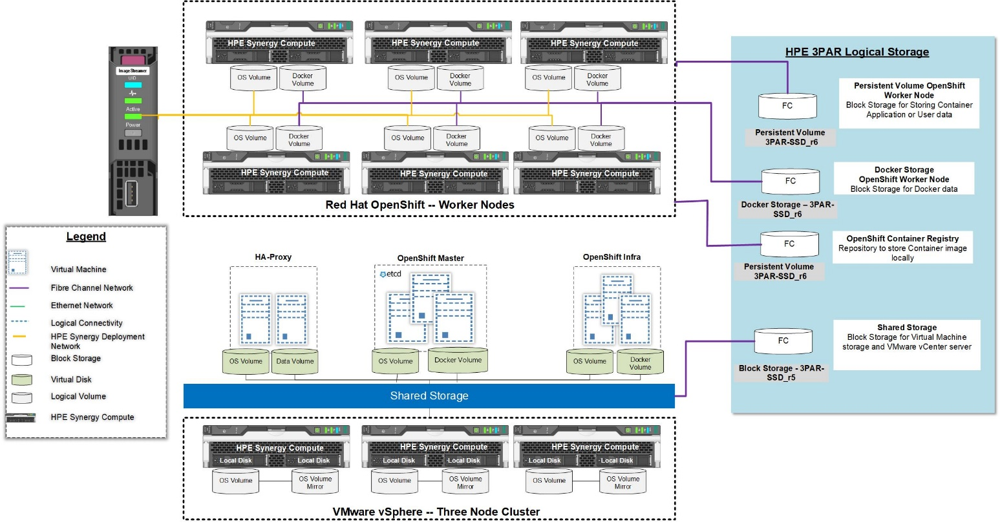

**Figure 13.** HPE 3PAR StoreServ solution logical layout

Information about storage volumes/disks is described in Table 11. The
user may choose to manually create and present these volumes or they may
use the Ansible resources specified after Table 11.

Table 11. Volumes and sources used in this solution

| **Volume/Disk Function** | **Quantity** | **Size** | **Source** | **Hosts** |
| Hypervisor | 3 | 40GB | HPE Image Streamer | ESXi hosts |
| Operating System | 6 | 40GB | HPE Image Streamer | OpenShift Worker Nodes |
| Virtual Machine Hosting | 1 | 3TB | HPE 3PAR StoreServ | ESXi hosts |
| Persistent Application Data | N | App Specific | HPE 3PAR StoreServ | OpenShift worker nodes |
| Docker Local Storage | 6 | 1TB | HPE 3PAR StoreServ | OpenShift worker nodes |
| OpenShift Container Registry | 1 | 1TB | HPE 3PAR StoreServ | Infrastructure node |

Prior to defining these volumes, the array must be initialized and
configured. Hewlett Packard Enterprise has provided resources to
automate the initialization and configuration of the array in the next
section.

## Initializing the HPE 3PAR StoreServ 8440 Storage

This section assumes that the HPE 3PAR StoreServ 8440 Storage was
ordered with a physical service processor or with a Virtual Service
Processor. VM is installed and functioning within the environment and is
available on the same network as HPE Synergy Composer. It also assumes
that a DHCP server is present on the network. The user should have the
serial number of the storage that is being installed.

**NOTE**

Ensure that information such as user credentials, network access details
and serial numbers referenced below are securely recorded for current
and future reference.

### Service Processor networking

To configure the Service Processor networking, use the following steps:

1) Either log into a physical Service Processor or access the console of
a Virtual Service Processor via the virtual console.

2) Log on as **setupusr** without a password.

3) When asked to configure the network, type **Y** and press **Enter**.

4) Confirm the network parameters that were handed to the Service
Processor by your DHCP server and if correct, type Y and then press
**Enter**. Ensure you note the IP address.

5) When prompted, press **Enter** to exit. You will now configure the
Service Processor (SP). Connect to the SP using the address
**https://<ip_address>/sp/SpSetupWizard.html**, and log on with the
user **setupusr** and no password.

6) At the *Welcome* screen click **Next**.

7) Enter the serial number of your HPE 3PAR StoreServ storage and select
**Generate SP ID**. Click **Next** when done.

8) On the Configure Service Processor Networking screen give the SP a
hostname, check **Enable DNS Support** and enter the domain name and DNS
server IP. Click **Next** when done.

9) Enter any proxy information for *Remote Support* and click **Next**.

10) Enter the appropriate information in the *System Support
Information* screen and click **Next**.

11) At the *Time and Region* screen select **Automatic** and enter the
**IP address** of your NTP server. Choose the appropriate *Time Zone*
and click **Next**.

12) When prompted, change the passwords and click **Next**.

13) Click **Next** at the summary screen after validating all
information.

14) Remote connectivity will be tested. In the event of a failed test,
ensure that the SP can speak outbound via HTTPS and that the proxy
information entered is correct.

### Storage system

The storage system itself can be configured by following the steps
below:

1) From the SP, select **Launch** next to the **Storage System Setup
Wizard** and accept the EULA. Click **Next**.

2) Confirm the serial number of your array and click **Next**.

3) At the *Configure Networking* screen you will need to enter a name
and network information for the array. Click **Next** when done.

4) Select **Copy time options from the Service Processor** and click
**Next**.

5) Create a password for the 3paradm user and click **Next**.

6) Verify the configuration information and click **Next**. This will
initialize and test the array and then add it to the SP. This process
can take an extended amount of time. Once all tests have passed, click
**Finish**.

Once complete, configure the Web services API and Common Information
Module (CIM).

1) Log onto the array via SSH as the 3paradm user. Use the IP address
set in step 18 of this list.

2) Run the following command to generate a self-signed certificate.

```

# createcert unified-server -selfsigned -keysize 2048 -days 1095 -CN
<fqdn of 3PAR> -SAN "DNS:<fqdn of 3PAR>, IP:<management IP of
3PAR>"

```

3) Answer **Yes** when prompted to continue creating the certificate.

4) Issue the following commands to start the WSAPI and CIM services.

```

# setcim -https enable

# startcim

# startwsapi

```

5) You can verify that the services are enabled and running by typing
the following commands.

```

# showcim

# showwsapi

```

### SAN Switch Configuration

This section assumes that the HPE 3PAR StoreServ Storage and HPE Synergy
Frame are cabled as outlined in Tables 9 and 10.

The following steps should be repeated on each SAN switch:

1) Connect via the serial port to the first SAN switch and open a
terminal session using **9600, 8, N** and **1** with **no flow
control**.

2) Log on as **admin** with the default password of ' **password'**.
Change the passwords for admin and user as prompted.

3) At the command line run the following commands to configure IP
addressing for the switch.

```

# switchname <hostname of switch>

# ipaddrset

```

4) When prompted, turn off DHCP and configure date and time information
for the switch.

```

# tstimezone ##

# date MMddhhmmyy

```

Where ## is the difference in the local time zone from GMT and where
MM is the 2-digit month, day is the 2-digit date, hh is the 2-digit hour
(24-hour format), mm is the 2-digit minute and yy is the year.

5) Configure the NTP Server with the following command.

```

# tsclockserver <ip address>

```

#### Configure the fabric and licensing

The user will need to configure fabric and licensing in the environment.

1) Run the following command to configure the fabric name.

```

# fabricname --set <san_a_fabricname>

```

2) Add any licenses by running the following command.

```

# licenseadd

```

3) Verify all ports that will be used have been enabled. If one has not,
run the following command.

```

# licenseport -reserve

```

4) Configure the Domain ID by typing the following.

```

# switchdisable

# configure

```

5) When prompted enter **yes** for Fabric parameters and assign a Domain
ID. Once entered, press **Control-D** to exit.

```

# switchenable

```

6) Reboot the switch to apply changes and repeat these steps on the
second switch.

**NOTE**

This document assumes two HPE SN6600B switches are present and wired as
per the information in Table 9 and Table 10.

#### ISL Trunk the Fibre Channel switches

1) Log in to each switch via SSH and use the **licenseshow** command to
verify that the trunk license has been applied

2) On switch 1 and switch 2 run the **portcfgpersistentdisable** to
disable the ports that will be used for ISL trunks

3) Run the **portcfgislmode** command and set the ports to mode 1 to
make them ready for ISL traffic

4) Enable the ISL trunk ports on the switches by running the
**portcfgpersistentenable** command

5) Run the **trunkshow** and **fabricshow** commands to verify that the
trunk ports are configured and that both switches display the correct
partner switch

#### Configure an active zone set

In order to allow HPE OneView for Synergy to manage the SAN fabric, the
user must create an active zone set.

1) To create a zone using the WWPN of node 0, slot 0, port 1 on the HPE
3PAR StoreServ 8440, obtain the WWPN by typing **switchshow** and check
the information on the switch port that 3PAR port N0:S0:P1 is connected.

2) Run the following commands to create the zone for this port.

```

# zonecreate <3PAR_1>_N0S0P1, "wwpn"

# cfgcreate solution_cfg, "<3PAR_1>_N0S0P1"

# cfgenable solution_cfg

```

3) Follow the prompts to enable the solution configuration.

4) Repeat these steps for the remaining SAN fabrics using the WWPN of
each 3PAR node, slot and port.

#### Configure the management server

This section assumes that a physical or virtual management server
running Microsoft Windows Server&reg; 2012 R2 is available and able to
communicate on the same network as the HPE B-series SAN switches and HPE
3PAR StoreServ storage. If it is not, the user should create this
management VM with the following settings.

-   Microsoft Windows Server 2012 R2
-   2 vCPU (or greater)
-   8GB RAM (or greater)
-   1x100GB HDD for OS and applications
-   1x200GB HDD for Media
- 1 Network Interface connected to the management network where the
storage resides

The management VM should have Microsoft IIS configured with the Web
Server role and WebDAV Publishing with Basic Authentication enabled.
Once the role is installed perform the following steps:

1) In *Server Manager* select **Tools** and then **Internet Information
Services (IIS) Manager**.

2) Select the **server name** and double-click **MIME Types**.

3) Select **Add** and enter the filename extension **.vib** as type
application/octet stream.

4) Click **OK.**

5) Repeat this process but substitute the filename extension **.iso**
for **.vib.**

6) Close the IIS Manager window.

Next the user will need to create a repository to house the Service Pack
for ProLiant (SPP) and HPE Synergy Release Set hotfix update files
associated with the HPE CA750 recipe.

1) From *File Explorer* navigate to the second HDD and create a folder
named **Media.**

2) Within the Media Folder create a folder named **SPP.**

3) Copy the SPP and HPE Synergy Release Set files to this folder.

4) Create a folder under *SPP* and name the folder **Hotfixes**. Copy
the SPP and/or HPE Synergy Release Set hotfix update files to this
folder.

5) In *Server Manager*, relaunch Internet Information Services Manager
as in Step 1 above.

6) Expand the hostname and then expand *Sites*.

7) Right-click the **Default Web Site** and select **Add Virtual
Directory**. Enter **Media** in the Alias field and select the **Media**
folder on the second drive for the Physical path. Click **OK** twice
when done.

8) From within *IIS Manager* ensure that the folders exist under Default
Web Site.

9) Select the Media folder and then double-click Directory Browsing and
ensure it is **Enabled.**

10) Select **Default Web Site** and double-click the**WebDAV Authoring
Rules** icon. Select**Enable WebDAV** in the *Actions Pane* and then
select **Add Authoring Rule**.

11) Select **All content** and **All users** radio button and then check
the **Read** box under permissions. Click **OK** to commit.

12) Select **WebDAV Settings** in the *Actions* pane and in the
*Property Behavior* section, ensure that the**Allow Anonymous Property
Queries** and**Allow Property Queries of Infinite Depth** are both set
to **True**. Select **Apply.**

13) Select the **Media** **directory** in the left pane and in the right
pane, double-click the **HTTP Response Headers** icon.

14) Select **Add** in the *Actions* pane and in the 'name' field enter
**MaxRepoSize**. In the value field, enter the size of the drive that
the Media folder was created on. In the case of this document you would
enter **200G**. Click **OK** when done.

15) Select the **server name** in the left pane and then in the
*Actions* pane select **Restart** to restart the web server.

The next step is to create an external HPE OneView for Synergy
repository. Follow the steps below:

1) Using Google Chrome, log onto the HPE Synergy Composer and navigate
to **OneView** -> **Settings.**

2) Select **Repository** and then select **'+'** to add a repository.

3) Name the repo **OneView** **Repo** and in the Webserver address field
enter **http://<ip_of_webserver>/media/SPP**.

4) Uncheck the **Requires** **Authentication** checkbox and select
**Add.**

#### Install HPE B-series SAN Network Advisor (BNA)

1) From the management VM, download the appropriate version of the HPE
B-series SAN Network Advisor and extract it.

2) Execute the **Windows\\installer.exe** file from inside the extracted
zip.

3) Follow the prompts and ensure that **Launch HPE B-Series SAN Network
Advisor Configuration** box is checked. Select **Done** on the last
screen.

4) Click **Next** when the window pops up and then select**No, don't
copy any data and settings**. Click **Next** again to proceed.

5) When prompted which package to use, select **SMI Agent Only.**

6) The user will auto-populate the VM hostname and IP address. Verify
they are correct and click **Next.**

7) When prompted for port configuration, change the following port
values.

a. Web Server Port: **9143**

b. SNMP Port: **9162**

8) Uncheck the **redirect HTTP Requests to HTTPS** box and then click
**Next.**

9) Click **Next** on the SMI Agent Configuration screen and select
**Small** for the SAN Network Size. Click **Next.**

10) Verify the server configuration summary and click **Next.**

11) Ensure the **Start SMI Agent** and**Start SLP** boxes are checked
and click **Finish**. The services may take some time to start.

#### Configure the SMI Agent

1) Point a web browser to the management server at
**https://<mgmt_vm_ip>:9143**.

2) Select the **JRE and MIB Files** and install JRE 1.8 for Windows
32-bit if needed.

3) Select the **Web Start the Configuration Tool** to launch the HPE
B-series SAN Network Advisor SMI Agent. Accept the security warning and
allow the Java program to run when prompted.

4) Log on using the credentials **Administrator/password.**

5) Select the **Fabric Discovery** link and accept any security
warnings.

6) **Add** all the zoned SAN switches in the solution to the agent using
each SAN switch name and IP address. Use the admin user with the
password you created earlier.

7) Select **Close.**

8) Select the **Users** link and accept the security warnings.

9) Select **Administrator** and then select **Edit**. Change the
Administrator password.

10) Click **OK** to close the window and then click **OK** to close the
application.

### Install and configure the HPE 3PAR SSMC

1) From within the Windows management station, install the HPE 3PAR
StoreServ Management Console by copying the media to the station and
running the **HPESSMC-*-win64.exe** user. Follow the onscreen prompts.

2) Use a web browser to connect to **https://<mgmt_vm_ip>:8443.**

3) Select **Set credential** and enter the**username** and **password**.
Select **Set** when done.

4) Install the HPE 3PAR Admin Tools by copying the media to the
management server, mounting it and executing
**cli\windows\\setup.exe**. Follow the prompts to install.

The user will need to add each array in the solution to the SSMC
Administrator Console.

5) Log on to the console and select **Actions** and then **Add.**

6) Under System DNS names or IP addresses **enter the IP or name** of
the 3PAR array. The username will be **3paradm** and the password is the
one the user created earlier. Select **Add**.

7) Once the array appears in the **NotConnected** state, select it and
select**Actions** and then **AcceptCertificate**. Select **Accept**
**and** **cache**. After a moment the array will show in the
**Connected** state.

8) Repeat these steps for any additional arrays within the solution.

### Create Common Provisioning Groups (CPGs)

CPGs are required within this solution. By default, HPE 3PAR StoreServ
arrays create a default set of CPGs.

1) Log on to the array as the 3PAR admin user using the SSMC.

2) Select **3PAR StoreServ -> Show all -> Common Provisioning
Groups.**

3) Select **Create** **CPG**. Provide a descriptive name and use
**RAID6**. The remaining default parameters are acceptable for this
solution.

4) Create a second CPG for snapshots.

### Configure HPE OneView for Synergy to manage HPE 3PAR StoreServ resources

#### Add a SAN Manager to HPE OneView for Synergy

1) From the HPE OneView for Synergy interface, select**OneView** and
then **SAN** **manager.**

2) Select **Add SAN manager** and use the following values when
prompted. Select **Add** when the values have been filled in.

a. SAN manager type: **Brocade** **Network Advisor**

**b.** IP address of hostname: **<mgmt._vm_fqdn>**

c. Port: **5989**

d. User name: *Administrator*

**e.** Password: *<bna_administrator_password>*

3) Select **One View** and then select **SANs**.

4) Select the **SAN switch hostname**, hover over**Zoning** **Policy**
and select **Edit**. Click **OK** when done. For zoning parameters, use
the following values.

a. Automate zoning: **Yes**

**b.** Zone layout: **Single initiator / single storage system**

c. Zone name format: **server profiles _ server profile connection _
storage system _ storage system port group**

d. Check **Update zone names as referenced resources are renamed**

e. Create aliases: **Yes**

f. Manage pre-existing aliases: **No**

g. Initiator alias format: **Initiator _ server profile _ server
profile connection**

h. Check **Update initiator** aliases as referenced resources are
renamed

i. Target alias format: **Target _ storage system _ storage** system
port

j. Check **Update target aliases and target group aliases** **as
referenced resources are renamed**

k. Create target group aliases: **Yes**

**l.** Target group alias format:**TargetGroup _ storage system _
storage** **system port group**

5) Repeat the steps above for each SAN in **OneView**.

#### Associate SAN networks with fabrics

1) Select **OneView** and then **Networks.**

2) Select **SAN_A** and then choose **Actions -> Edit.**

3) In the Associated SAN field select the hostname of **SAN switch 1**
and click **OK.**

4) Repeat these steps for **SAN_B** and associate it with the
**hostname** of the second switch.

5) Verify that the *Expected Network* is set to the correct SAN network
for each port on the HPE 3PAR StoreServ storage. In the event of an
error, check the wiring and previously entered settings and correct
them.

6) Enter in the *Port Group name* and assign every pair of *peer
persistence ports* to the same Port Group.

#### Import and configure the HPE 3PAR StoreServ Storage

1) Select **OneView** and then choose **Storage Systems**.

2) Choose **Add Storage Systems** and enter the information for your
array. Select **Connect** and ensure the storage shows up correctly.

3) If needed, select a domain under the Storage domain dropdown.

4) For Storage Pools, check the **Manage** checkbox for all of your
previously created CPGs. Select **Add**.

# Preparing the deployment environment

This section discusses steps that need to be taken to prepare the
environment for hardware deployment and software installation.

## Edit the OpenShift inventory file

Prior to configuring the compute modules, the installer should retrieve
the required Ansible plays and files from GitHub by running the
following command on the Ansible Engine host and review the inventory
files carefully.

```

# cd /etc/ansible

# git clone
<https://github.com/HewlettPackard/hpe-solutions-openshift.git>

```

This will place the inventory file at
*/etc/ansible/hpe-solutions-openshift
/synergy/scalable/3par-vsphere/fc/hosts* *.* Using the examples found in
the sample file, alter the appropriate sections to ensure that the
information within the file accurately reflects the information in the
deployment environment.

## Ansible Vault

A preconfigured Ansible Vault file is provided with the solution. Run
the following command to edit the vault to match the deployment
environment.

```

# ansible-vault edit
/etc/ansible/hpe-solutions-openshift/synergy/scalable/3par-vsphere/fc/vault_pass.yml

```

**NOTE**

The default password for the vault is *changeme.*

# Compute Module configuration

This section describes the configuration of the hosts and is separated
into sections that disseminate universal configuration parameters,
options for virtualized hosts, and options for bare metal hosts.
Required configuration steps are outlined. These may be in the form of
pointers to code or command line options. It is up to the person who is
installing to decide how to reach the desired end state.

Server Profiles are used to configure the personality of the compute
resources. A Server Profile allows a set of configuration parameters,
including firmware recipe, network and SAN connectivity, BIOS tuning,
boot order configuration, local storage configuration and more to be
templated. These templates are key to delivering the "infrastructure as
code" capabilities of the HPE Synergy platform. For the purpose of this
solution, a template is used to define virtualized management nodes.

**Warning**

During host deployment, ensure that adapter names and functions are
accurately recorded for the installation environment as variations in
the installation procedures may result in different adapter functions
than what is represented in the following sections. This will result in
the failure of some default automated configuration steps.

## Management Hosts

Management nodes will be deployed and customized using HPE Synergy Image
Streamer while ensuring that the required storage volumes are created
and attached. This section outlines the steps required to install the
host. At a high level, these steps can be described as follows:

1) Download the artifacts for *HPE Image Streamer* from the *HPE GitHub
site.*

2) Add the artifact bundles to *HPE Image Streamer.*

3) Create a *Server Profile* with an empty volume.

4) Install the hypervisor.

5) Capture the ESXi base golden image.

6) Delete the empty volume Server Profile.

7) Add ESXi golden image to the deployment plan.

8) Create the HPE 3PAR StoreServ storage volume.

9) Deploy the ESXi hosts using the golden image.

10) Utilize the virtualized hosts.

11) Create the VMware vCenter Server Appliance.

### Download the artifacts for HPE Synergy Image Streamer

The VMware ESXi 6.7 artifact bundle for HPE Image Streamer can be downloaded
at,
<https://github.com/HewlettPackard/image-streamer-esxi/blob/v5.0/artifact-bundles/HPE-ESXi-6.7-2019-07-24-v5.0.zip>
. Sample foundation artifact bundles can be downloaded from,
<https://github.com/HewlettPackard/image-streamer-tools/tree/v5.0/foundation/artifact-bundles>
.

### Add the artifact bundles to HPE Image Streamer

1) From the HPE Image Streamer interface, navigate to the *Artifact
Bundles* page.

2) From the *Actions* menu, click **Add** button to add the downloaded
VMware ESXi artifact bundle. If not already present, add the sample
foundation bundle.

3) From the *Actions* menu, click **Extract** to extract the artifacts
from each uploaded bundle.

### Create a Server Profile with an empty volume

The HPE Synergy Image Streamer deployment process is initiated from
within the HPE Synergy Composer interface through the Server Profile
creation process.

1) Log into **HPE OneView**.*

2) From the **OneView** drop-down, select **Server Profiles.**

3) Select **+ Create profile**.

4) Provide the values for the following parameters.

a. Name: **Provide a unique name**

b. Server profile template: **None**

c. Server Hardware: **Select any available server from drop-down**

d. Enclosure Group: **<Enclosure Group name>**

e. Affinity: **Device Bay**

f. OS deployment plan: From the drop-down, select the **HPE -
Foundation 1.0 - create empty OS Volume OS build plan**.

g. Volume Size: **40960 MiB**

h. Configure the Connections.

i. Deployment Network A, Deployment VLAN 100, 1Gb/s iSCSI primary

ii. Deployment Network B, Deployment VLAN 100, 1Gb/s iSCSI secondary

iii. Management_A, Management VLAN 1193

iv. Management_B, Management VLAN 1193

v. Datacenter_A, Datacenter VLAN 2193

vi. Datacenter_B, Datacenter VLAN 2193

vii. SAN_A, Fibre Channel A, Fabric attach

viii. SAN_B, Fibre Channel B, Fabric attach

j. Enable the Manage boot mode and configure the following values.

i. Boot mode: **UEFI optimized**

ii. Secure boot: **Disabled**

iii. PXE boot policy: **Auto**

5) Click **Create**.

### Install the hypervisor

1) In the HPE OneView interface, navigate to the Server Profiles and
select the **ESXi-empty-volume** Server Profile created earlier.

2) Select **Actions > Launch Console.**

3) On the Remote Console window, choose **Virtual Drives > Image File**
**CD-ROM/DVD** from the iLO options menu.

4) Navigate to the **ESXI 6.7 .iso** file located on the installation
system.

5) Select the image and click **Open**.

6) If the server is in the powered off state, power on the server by
choosing **Power Switch > Momentary Press**.

7) During boot, press F11 to navigate to the Boot Menu and select **iLO
Virtual USB 3: iLO** Virtual CD-ROM.

8) When the ESXi installation media has finished loading, proceed
through the VMware user prompts. For Storage Device, select the 40GiB OS
volume created on the Image Streamer during Server Profile creation and
set the *root password*.

9) Once the OS installation is complete, navigate to the Power Switch in
the iLO options menu bar and select the momentary press from the
drop-down menu to power off the server.

### Capture the ESXi base golden image

1) From the top-left corner of HPE Synergy Image Streamer UI, navigate
to Image Streamer > **Golden Images**. Select **Create** Golden Image.
Enter the following details as illustrated in Figure 14.

a. Name: **< Provide a name for the golden image >**

b. OS volume: **<OS volume associated with the ESXi-empty-volume
Server Profile >**

c. OS Build Plan: From the drop-down list, select **HPE - Foundation 1.0
- capture OS Volume as is OS** build plan.

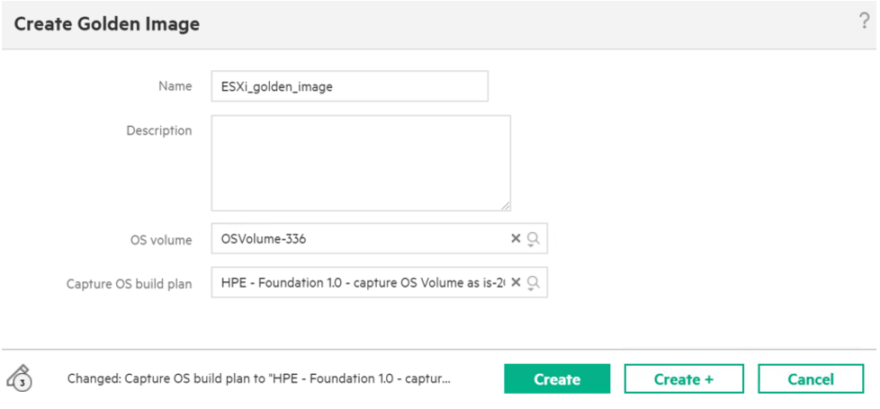

**Figure 14.** Create golden image

2) Click **Create**.

### Delete the ESXi empty volume Server Profile

1) On the HPE Synergy OneView webpage, choose **OneView > Server
Profiles**.

2) Select the ESXi-empty-volume Server Profile and choose **Actions >
Power Off**.

3) With the ESXi-empty-volume Server Profile selected, choose **Actions
> Edit**.

4) Unassign the assigned server hardware and wait until the task
completes.

5) With the ESXi-empty-volume Server Profile selected, choose Actions >
**Delete**.

6) Select **Yes, Delete**.

### Add the ESXi golden image to the Deployment Plan

1) From the top-left corner of HPE Synergy Image Streamer UI, choose
Image Streamer > **Deployment Plans**.

2) Choose **Create** **Deployment Plan.**

3) Provide the values for the following parameters as illustrated in
Figure 15.

a. OS build plan: From the drop-down menu, select **HPE - ESXi 6.7 -
deploy with multiple management NIC HA config - 2019-07-24** as the OS
build plan

b. SSH: **enabled**

c. Password: **<leave blank>**

d. ManagementNIC: **n/a**

e. HostName: **<leave blank>**

f. DomainName: **<management network domain name>**

g. Golden Image: From the drop-down menu, select the **ESXI 6.7 golden
image** that was created in the prior section.

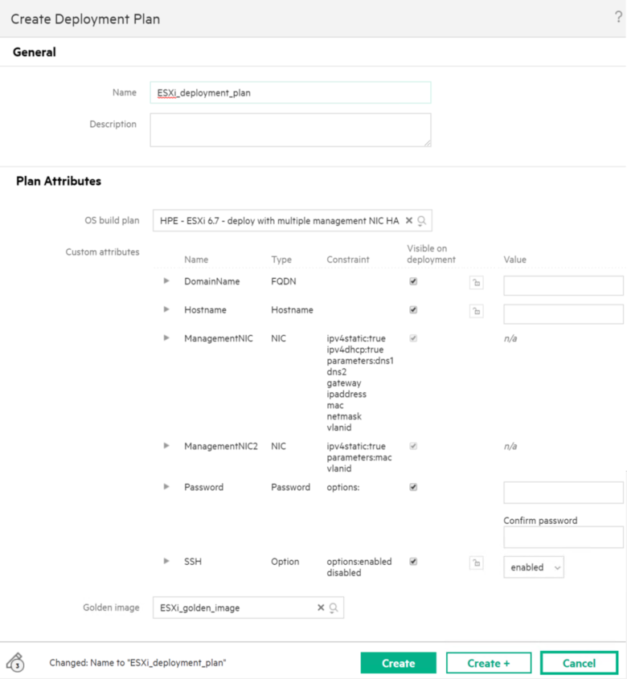

**Figure 15.** Create Deployment Plan

4) Click **Create.**

### Create the HPE 3PAR StoreServ volume

The virtualization hosts require a volume for hosting the virtual
machines. For this deployment a 3TB volume will be created and shared
among the virtualization hosts. A volume is carved out of the HPE 3PAR
StoreServ Storage system and is associated with each of the hosts
through the Server Profiles. The following list illustrates the steps to
create the volume.

1) From HPE OneView, choose **Storage > Volume**.

2) Select **Create Volume** and provide the following values. Figure 16
depicts the sample values provided.

a. In the *General* section, complete the following:

i. Name: **< Provide a** **name** **of the volume >**

ii. Volume template: **None**

iii. Storage pool: **< Provide the storage pool of the 3PAR >**

b. Under *Volume Properties* enter the following:

i. Capacity: **3120 GiB**

ii. Sharing: **Shared**

c. In the *Advanced* section enter the following:

i. Provisioning: **Thin**

ii. Storage Snapshot Pool: Select the appropriate Snapshot storage pool.

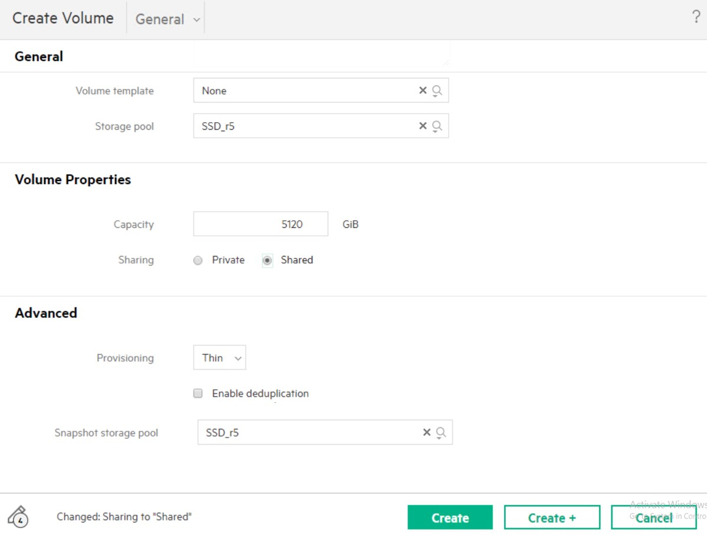

**Figure 16.** Creating volume in OneView

3) Click **Create**.

### Deploy the golden image

The virtualization hosts are deployed via a Server Profile using the
golden image and Deployment Plan created in the previous steps. The
consistency and repeatability of the virtualization hosts is achieved
using the Server Profile Template.

The playbooks *ServerProfileTemplate.yml* and *ServerProfile.yml* *and
inventory files* located at
*/etc/ansible/hpe-solutions-openshift/synergy/scalable/3par-vsphere/fc/DeployESXiHosts,*
create the Server Profile Template and Server Profile respectively.

In the hosts file under the *servers* section, add the enclosure serial
number with the bay number of the server hardware, name, IP address, and
hostname, and type which needs be assigned for the servers utilized as
the virtualization hosts. Assign one of the servers among them under the
Server Profile Template section as shown below.

```

[servers]

"2S1721PK4K, bay 5" name=ESXI_01 ip=10.0.x.x hostname=vspherehost01
type="SY 480 Gen10 4"

"MXQ73007JR, bay 11" name=ESXI_02 ip=10.0.x.x hostname=vspherehost02
type="SY 480 Gen10 2"

"MXQ73007JQ, bay 5" name=ESXI_03 ip=10.0.x.x hostname=vspherehost03
type="SY 480 Gen10 3"

[server_profile_template]

"2S1721PK4K, bay 5" type="SY 480 Gen10 4"

```

To create the Server Profile Template and the Server Profile, the
*HostVariables.yaml* file needs to be edited according to the
environment. This file is located at,
/etc/ansible/hpe-solutions-openshift/synergy/scalable/3par-vsphere/fc/DeployESXiHosts.

Enter the configuration details of the HPE OneView, Image Streamer,
network connections, IP address details, enclosure group name, server
hardware name, server hardware type and path to the template files for
both the Server Profile Template and Server Profile. A sample file is
shown below. This file should be edited to match the installation
environment.

```

deployment_network_name: Deployment

management_network_name: TenNet

SAN_A_network_name: Fibre_Channel_A

SAN_B_network_name: Fibre_Channel_B

datacenter_network_name: TwentyNet

dns_ip: 10.0.x.x

gateway: 10.0.x.x

subnet_mask: 255.255.0.0

domain_name: tennet.local

enclosure_group_name: Enclosure_Group

deployment_plan_name: ESXi_deployment_plan

server_profile_template_name: vsphere_template

```

Update the OneView IP address and credentials and the Image Streamer IP
address in the *OneViewConfig.json.* It is recommended to follow the
same structure as shown in the example below.

```

{

"ip": "10.0.x.x",

"credentials":{

"userName": "your username",

"password": "your password"

},

"image_streamer_ip": "10.0.x.x",

"api_version": 1000

}

```

Once the host file, *OneViewConfig.json* and variable files are updated
with the appropriate values, execute the following commands from the
Ansible Engine to create the Server Profile Template and Server Profile.

```

*# cd
/etc/ansible/hpe-solutions-openshift/synergy/scalable/3par-vsphere/fc/DeployESXiHosts*

*# ansible-playbook --i hosts ServerProfileTemplate.yml*

*# ansible-playbook --i hosts ServerProfileWithoutVolume.yml*

```

### Update the hosts with the SAN storage volume

1) From HPE OneView, navigate to the Server Profiles section and select
the Server Profile to which the volume needs to be attached.

2) Scroll down to **SAN Storage** and select **Manage SAN Storage** and
then from the Host OS type drop-down, choose **VMware (ESXi)**.

3) Click **Add volume** **as in Figure 17.**

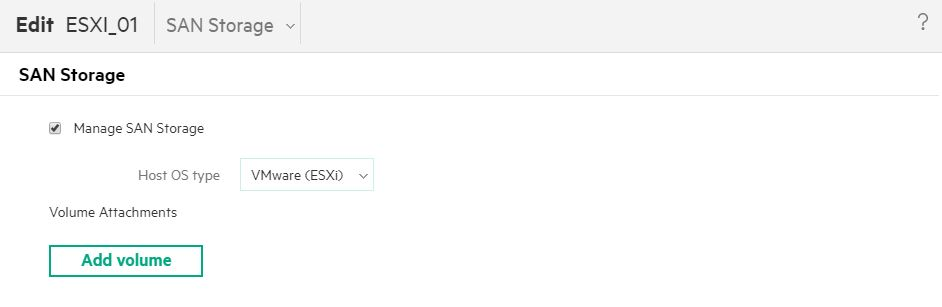

**Figure 17.** Server Profile Add volume screen.

4) Provide the values to the parameters listed below, as illustrated in
the Figure 18.

a. Type: From the drop-down menu, select **Existing volume**.

b. Attach Volume: From the drop-down menu, select the **volume** that
was created earlier for the vSphere hosts.

c. Boot: From the drop-down menu, select **Not bootable.**

d. LUN: **Select** **Auto.**

e. Storage Paths: Add the appropriate storage paths.

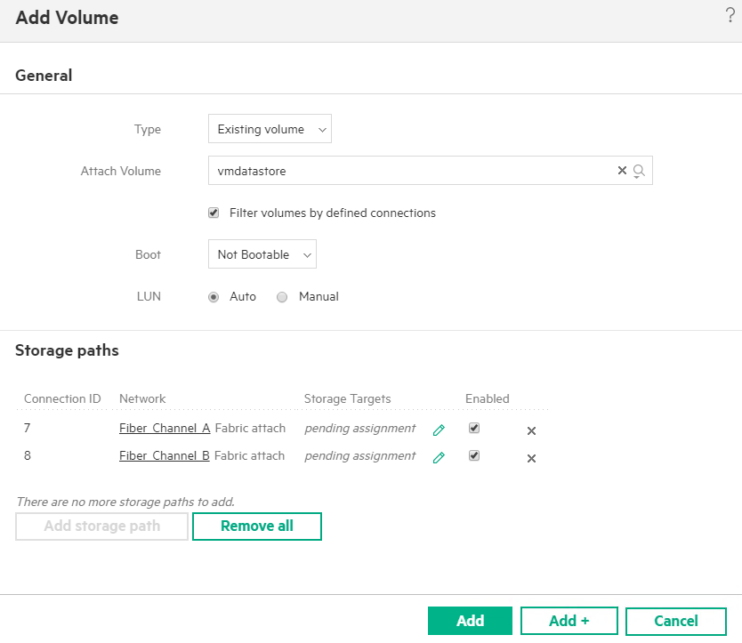

**Figure 18.** Add SAN storage in the Server Profile

5) Click **Add** to attach the volume to the Server Profile.

6) Once the SAN storage volume is added to the Server Profile, click
**OK** to update the save to updated Server Profile.

7) Repeat the process for each host.

### Finalize the virtualization platform

Power on the server hardware and wait for the configuration process to
complete. It will take a few minutes after which the server hardware
will be ready to be used.

**NOTE**

To validate success, log into each of the ESXi hosts and ensure that the
NIC for the management network is enabled and no other network interface
cards are enabled.

## VMware vCenter Server Appliance

In this solution, VMware vCenter Server Appliance (vCSA) is used to
manage the virtualized environment. This section illustrates the
deployment of the vCSA. If a vCSA is available in your environment, this
step can be skipped.

### Pre-requisites

A DNS entry for the vCenter hostname should exist and be resolvable.

### Procedure

The installation of the vCSA is a two-stage process.

-   Deployment
-   Configuration

### Deploy the appliance

1) Navigate to the location of the vCSA iso image file and double-click
to open it.

2) Depending on the OS, navigate to the**vcsa-ui-installer/<OS type>**
folder and run the *installer.exe*.

3) Select **Install** to proceed with the installation of a new vCenter
Server Appliance.

4) Accept the End User License Agreement and then click **Next**.

5) Select the Deployment Type as vCenter server with an Embedded
Platform Service Controller and click **Next**.

6) Provide the root credentials of the vSphere host where the vCSA is to
be installed. Click **Next**.

7) Accept the SSL certificate from the selected host.

8) Enter a unique name for the vCSA and provide the password in the Set
root password field and click **Next**.

9) Based on your environment, provide the Deployment Size and the
Storage Size. Click **Next**.

10) Select the Datastore of the host which needs to be used and click
**Next**.

11) Configure the network settings and click **Next** and provide the
values for the following parameters.

a) IP address: **< IP address for the vCSA >**

b) Domain name: Domain name of the management network of the vCSA

c) FQDN: Fully-qualified domain name of the vCSA

d) Subnet mask: Subnet mask

e) DNS server: IP address for the DNS server

12) Click **Finish** to start the installation. The vCSA will be
deployed on the specified host.

13) Once installation is successfully completed, click **Continue** to
move to the configuration process.

#### Configure the vCSA

1) When the installation screen is displayed, click **Next** to begin
the configuration process.

2) Specify the NTP Server and enable the SSH access. Click **Next**.
Enabling SSH is a must to enable smooth execution of Ansible playbooks.

3) Select the **Create** a new SSO domain option and provide the SSO
domain name and a unique SSO password then click **Next.**

4) Click **Finish** to finalize the deployment and then click **OK** to
proceed. This will start the configuration process.

5) Once the configuration process has executed successfully, the **vCSA
deployment is complete.**

### Accessing the vCSA

8. To access the appliance, type the address **https:// <vCenter Server
Appliance IP address>:443** in the browser and enter the root
credentials. Choose **Login**.

## Red Hat OpenShift worker hosts

The worker nodes will be deployed and customized using HPE Synergy Image
Streamer while ensuring that the required storage volumes are created
and attached. This section outlines the steps required to install the
host. At a high level, these steps can be described as:

1) Download the artifacts for HPE Image Streamer from the HPE GitHub
site.

2) Add the artifact bundles to HPE Image Streamer.

3) Build a worker node image.

4) Capture a Golden Image.

5) Copy and edit the NIC teaming plan script.

6) Copy and edit the OS Build Plan.

7) Create a Deployment Plan.

8) Create the Volume template and Volumes.

9) Deploy the hosts.

10) Post-deployment Ansible configuration.

### Download the artifacts for HPE Synergy Image Streamer

The foundation artifact bundle for HPE OneView 5.0 can be downloaded
from
<https://github.com/HewlettPackard/image-streamer-tools/tree/v5.0/foundation/artifact-bundles>
and Red Hat Enterprise Linux bundles for HPE Image Streamer can be
downloaded from
<https://github.com/HewlettPackard/image-streamer-rhel/tree/v5.0/artifact-bundles>.

### Add the artifact bundles to HPE Image Streamer

1) From the HPE Image Streamer interface, navigate to the artifact
bundles page.

2) From the **Actions** menu, add the downloaded **RHEL artifact
bundle**. If not already present, add the sample foundation bundle.

3) From the **Actions** menu, select **Extract** to extract the
artifacts from each downloaded bundle.

### Prepare the compute module for the installation of the Operating System

1) Attach a Red Hat Enterprise Linux version 7.6 Server ISO image to the
iLO via virtual media, select the **Action** menu and then **Launch
Console**.

2) When the console launches, select **VirtualDrives** and then Image
File **CD**- **ROM/DVD**. Browse to the location where your ISO resides
and select it.

### Build a worker node image

In order to create a worker node image, follow the steps below:

1) Create a temporary Server Profile and attach it to a host. Adjust the
following settings.

a. Create a 40GB Image Streamer volume that will be used to install RHEL
by selecting **HPE-Create Empty volume** from the OS deployment plan
dropdown.

b. Configure the connections:

i. Deployment Network A, Deployment VLAN 100, 1Gb/s iSCSI primary

ii. Deployment Network B, Deployment VLAN 100, 1Gb/s iSCSI secondary

iii. Management_A, Management VLAN, 4Gb/s

iv. Management_B, Management VLAN, 4Gb/s

v. Datacenter_A, Datacenter VLAN, 15Gb/s

vi. Datacenter_B, Datacenter VLAN, 15Gb/s

vii. SAN_A, Fibre Channel A, Fabric attach

viii. SAN_B, Fibre Channel B, Fabric attach

c. Boot settings

i. UEFI Optimized for Boot mode

ii. Secure boot disabled

iii. Manage boot order

iv. Primary boot device: Hard disk

2) Once complete, **Apply** the profile to a single host and select
**Create**.

3) From the Actions drop-down found on the Server Profile's OneView
page, select **Launch console**.

4) Attach the RHEL 7.6 image and select **Power Switch** and then
**Momentary Press.** When the screen shown in Figure 19 pops up, select
**Install Red Hat Enterprise Linux 7.6** and then press '**e'** on the
keyboard.

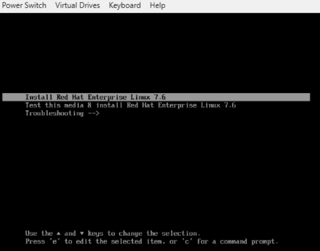

**Figure 19.** Selecting the OS to install

5) Append the following to the install kernel boot parameter as in
Figure 20. **rd.iscsi.ibft=1**

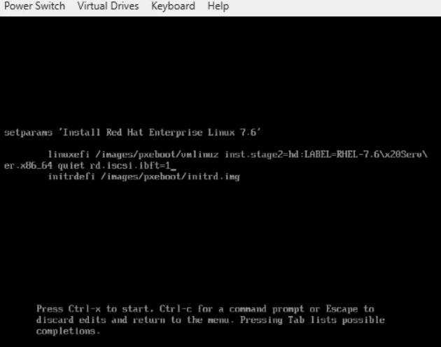

**Figure 20.** Editing the kernel boot parameter

6) Press **Ctrl-x** to continue the boot process.

7) When the user screen appears, ensure you select your local language,
set the **date and time, keyboard** layout and**language** **support**.
When done, select **Installation Destination.**

8) At the **Installation Destination** screen, select**Add a disk** and
then choose the **40** **GiB** **volume** from HPE Image Streamer as in
Figure 21. Click **Done** once the disk has been selected.


**Figure 21.** Image Streamer volume as seen within the Installation
Destination screen

9) Under **Other Storage Options**, select**I will configure
partitioning** and then **Done**.

10) At the **Manual Partitioning** screen, choose **select here to create them
automatically**. This will display a new Manual Partitioning screen.

11) Highlight the **/boot** partition and on the right side of the page
select **ext4** as the **File System**. Click **Update Settings.**

12) Highlight the **/** partition on the right side of the screen,
reduce the **Desired Capacity** to **18 GiB** and then choose **ext4**
as the File System. Click **Update Settings.**

13) Highlight the **swap** partition on the right side of the screen,
change **Desired Capacity** from 3000 MiB to **4096 MiB**. Click
**Update Settings.**

14) Click the '**+**' below the list of partitions. For **Mount Point**,
select **/var** from the dropdown and leave the **Desired Capacity**
blank. This will allow the **/var** partition to use all remaining
space.

15) At the Manual Partitioning screen, highlight the **/var** partition
and choose **/ext4** for the File System. Click **Update Settings**. The
screen should appear as in Figure 22.

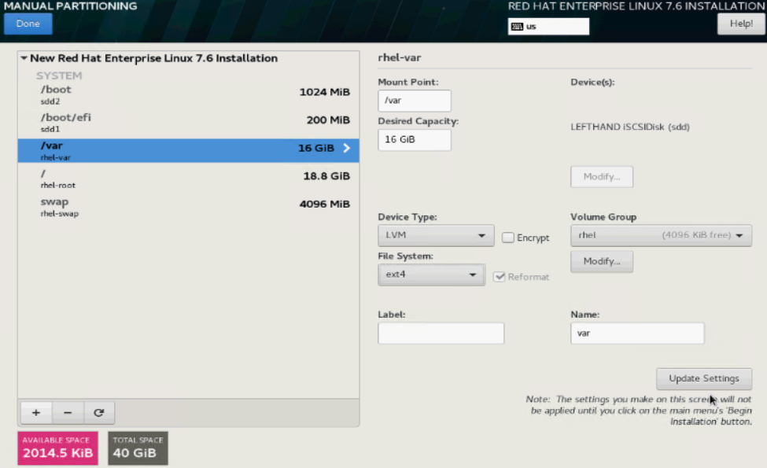

**Figure 22.** Customizing disk partitions

16) Once you have validated the file systems and partition sizes are
correct, Click **Done**.

17) When prompted, select **Accept Changes.**

18) Select the Network & Hostname link. At the resulting screen,
highlight **Ethernet (ens3f4)** and set it to '**ON**' in the descriptor
screen as in Figure 23. Provide a temporary hostname for the host and
click **Done.**


**Figure 23.** Customizing disk partitions

19) Select **Begin Installation**. Set a root password for the host. Do
not configure extra users and click **Done.**

20) Once the OS installation is complete you can choose to reboot the
host.

21) When the host completes rebooting, log on as *root* at the iLO
console.

22) Register the host, and attach the host pool with Red Hat by running
the following commands. You will be prompted for the Red Hat
subscription *username* and *password.*

```

# subscription-manager register

# subscription-manager --attach pool=<pool-id>

```

Repeat the second command for each pool.

23) Disable all repos and then re-enable only required repos by running
the following commands.

```

# subscription-manager repos --disable=*

# subscription-manager repos \\

--enable=rhel-7-server-rpms \\

--enable=rhel-7-server-extras-rpms \\

--enable=rhel-7-server-ose-3.11-rpms \\

--enable=rhel-7-fast-datapath-rpms

```

24) Install teamd by running the following command.

```

# yum install teamd --y

```

25) Update and reboot the host by running the following commands.

```

# yum update --y

# reboot

```

26) Once the host has restarted, log on as the root user and open the
appropriate firewall ports by running the following commands.

```

# firewall-cmd --add-port=3260/tcp --permanent

# firewall-cmd --add-port=4789/udp --permanent

# firewall-cmd --add-port=8053/udp --permanent

# firewall-cmd --add-port=8053/tcp --permanent

# firewall-cmd --add-port=443/tcp --permanent

# firewall-cmd --add-port=8443/tcp --permanent

# firewall-cmd --add-port=10250/tcp --permanent

# firewall-cmd --add-port=53/tcp --permanent

# firewall-cmd --add-port=53/udp --permanent

# firewall-cmd --reload

```

27) Verify your settings by running the following command.

```

# firewall-cmd --list-all

```

28) Create the following directories.

```

# mkdir /boot/efi/EFI/HPE

# mkdir --p /boot/efi/EFI/HPE/isdeploy

# mkdir --p /boot/efi/EFI/HPE/isdeploy/scripts

# mkdir --p /boot/efi/EFI/HPE/isdeploy/tmp

# mkdir --p /boot/efi/EFI/HPE/isdeploy/data

```

29) Modify /etc/rc.d/rc.local. Add the line sh
*/boot/efi/EFI/HPE/isdeploy/HPE-ImageStreamer.bash* as below.

```

# vi /etc/rc.d/rc.local

```

30) Change permission of the rc.local file.

```

# chmod 755 /etc/rc.d/rc.local

```

31) Ensure you remove subscriptions from the host and unregister it.
When done, gracefully shut down the host.

```

# subscription-manager unregister

# shutdown -h now

```

### Capture a golden image from the compute module

Utilize the build plan *HPE - Foundation 1.0 - capture OS Volume as
is-2017-03-24* to capture the golden image from the host just created.
To do this, follow these steps:

1) From within the HPE OneView interface, highlight the Server Profile
and scroll in the right window until you see the **OS volume** listed
under OS Deployment. Record the ID of the volume below.

2) From the OneView drop-down select **OS Deployment Servers** and
launch the Image Streamer UI by selecting the link shown in Figure 24.
The IP address will be specific to the install environment.

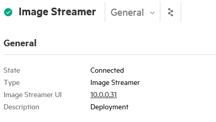

**Figure 24.** Image Streamer launch link within HPE OneView.

3) From within the HPE Image Streamer UI, select**golden image** and
then **Create** **Golden Image**. Fill in the information as in the
example in Figure 25 and then click **Create**.

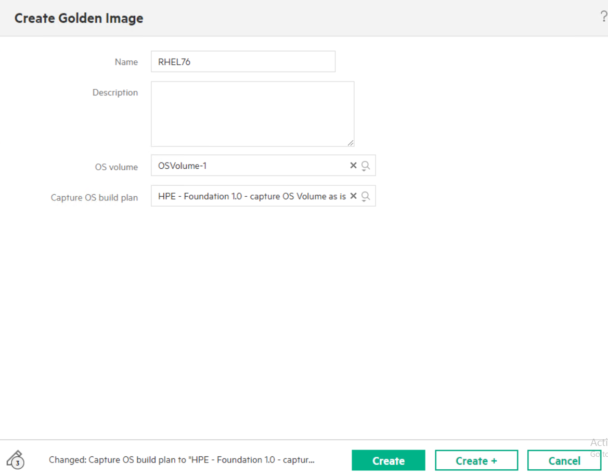

Figure **25**. Capture screen for golden images

Once the image has been successfully captured, return to the HPE OneView
interface and delete the Server Profile from the host you used to
capture the golden image. You can ignore the warning that the volume
will be deleted. This is deleting the original volume that was used to
install the Operating System. The newly created golden image will remain
intact.

### Copy and edit the OS build plan

1) From within the Image Streamer UI, select **OS build plan** from the
Image Streamer drop-down.

2) Select the
**HPE-RHEL7-EFI-personalize-and-configure-NIC-teamings-LVM-2019-06-07**
*build plan* and from the Actions menu select **Copy.**

3) Assign a **name** to the new plan. It is recommended to add the
current date or another unique identifier that will help to quickly
identify the copy being used.

4) Under Custom attributes, select **Team1NIC1** and select the **edit**
**icon**.

5) Check the box for Allow no network connection as shown in Figure 26
and click **OK**.


**Figure 26.** Edit custom attribute for OS build plan screen

6) Repeat this process for **Team1NIC2**.

7) Click **OK** when done.

### Create a deployment plan

The following steps should be used to create a deployment plan that will
be used to deploy the worker nodes.

1) Create a **deployment plan** from within the Image Streamer interface
by selecting **Image Streamer > Deployment Plans > Create Deployment
Plan** .

2) Assign a name to the **Deployment** **Plan**, provide a description
and then select the **OS build plan** you created in the prior step as
in Figure 27. This is the build plan the user created in the prior
section, so the name will be what the user assigned.

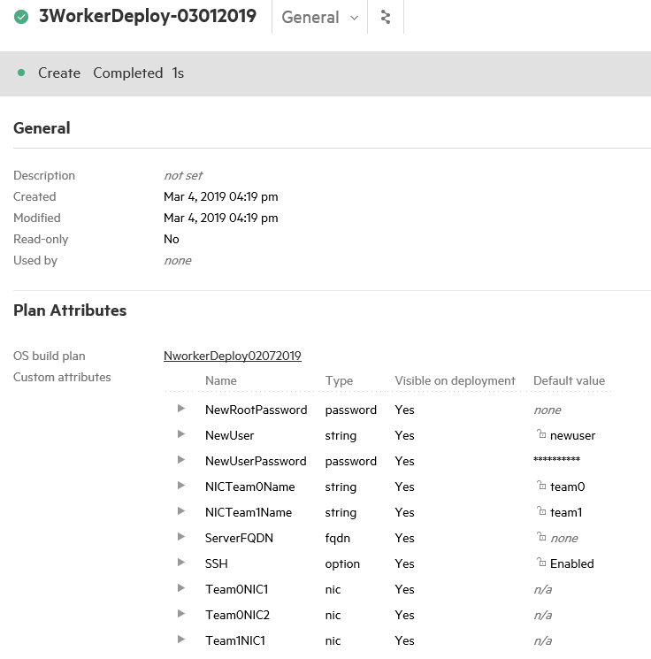

**Figure 27.** Create deployment plan screen within Image Streamer.

3) In the *Golden* *Image* dropdown, select the golden image created in
the **"Capture a Golden image from the compute module"** section in the
*Golden Image* drop-down.

4) Select **Create** to finish creating the deployment plan.

### Create the volume template and volume

Each worker node requires a volume for Docker local storage. These
volumes will be 80GB in size and are dedicated to individual hosts. The
following steps to create a volume template to satisfy the requirement
on all hosts.

1) Select the OneView drop-down and then select **Volume Templates**
from under the Storage header.

2) Select **+ Create Volume Template.**

3) Assign a **Name,** **Description** and **Storage pool**. RAID 6 is
sufficient for Storage pool type.

4) For Capacity enter **80 GiB** and ensure **Private** is selected.

5) Under Advanced select **Thin for Provisioning** and select a
**Snapshot storage pool.**

6) Select **Create** when done.

7) The result appears in Figure 28.

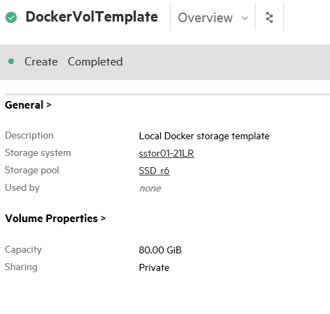

**Figure 28.** Volume template viewed from within HPE OneView

8) Follow the same steps to create a volume named **Docker-OCR** giving
it a size of **1000 GiB**. Ensure the volume is configured as
**Shared.**

### Deploy the hosts

The following are the steps to deploy the hosts.

1) From within HPE OneView, select **Create Server Profile Template**.

2) Assign the name and provide a description.

3) Select **Edit** under the General section and then select your **OS
deployment plan** from the drop-down.

4) Select the appropriate **Server hardware type** and **Enclosure
group**.

5) Under OS Deployment, select the **OS deployment plan** created above.

6) Scroll down to Connections and add in the same **networks** you
created in the Build a worker node image section of this doc.

7) Scroll down to SAN Storage and select**Manage SAN Storage** and then
select **RHEL Linux (5.x, 6.x, 7.x)** for the Host OS type.

8) Select **Add volume**, add a **name** and **description** and then
select **New volume** under type. Choose the **Docker volume template.**

9) Repeat step 8 above but choose the **Docker-OCR volume** to add to
the template.

#### The following processes should be repeated on each host.

1) Deploy a new **Server Profile** from your Server Profile Template to
each worker node.

2) Ensure that the Deployment Plan you created above is shown in the
dropdown of the OS Deployment portion of the Server Profile.

3) Fill in the remaining settings as in Figure 29 below, inserting your
own values. When done, **click** **Create.**

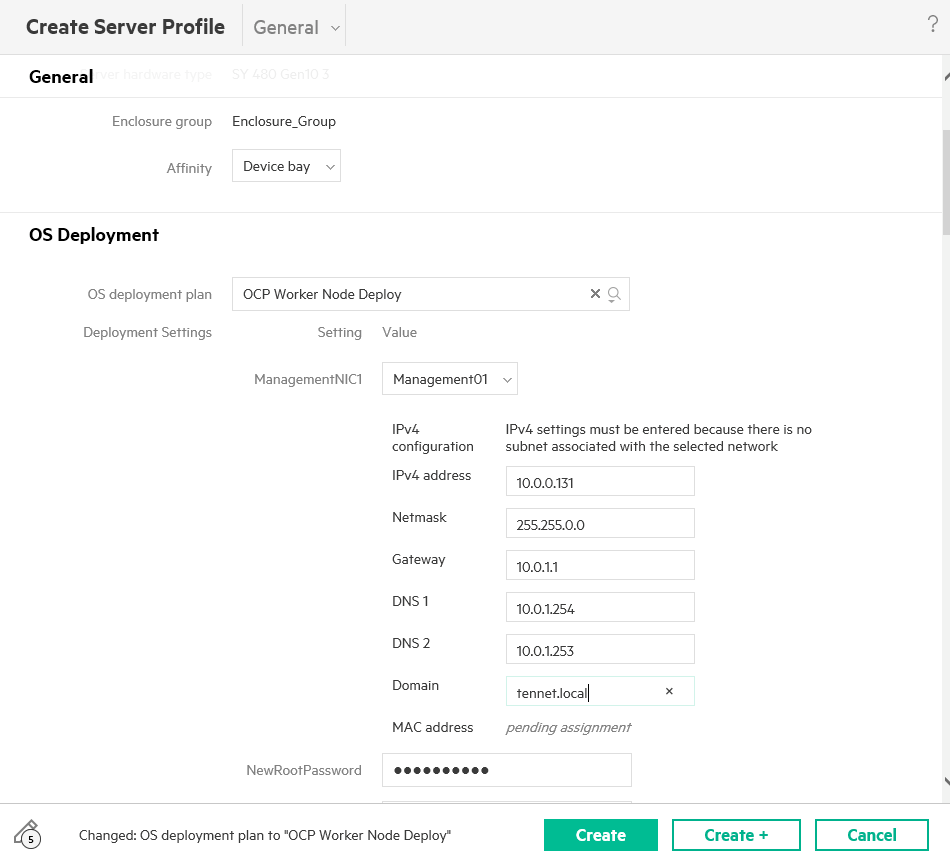

**Figure 29.** Create Server Profile

4) From within the HPE OneView interface, power on the host as the
profile completes and select **Launch console**.

5) Log into the host as the **root** **user.**

6) On the Ansible Engine host, copy each worker nodes SSH keys to the
known hosts file.

### Post-deployment configuration via Ansible playbooks

The remaining host configuration is handled via Ansible playbooks. This
section describes the plays within the context of the directory on the
Ansible Engine host at
*/etc/ansible/hpe-solutions-openshift/synergy/scalable/3par/fc*.

-   *Hosts* : this file contains the definition of the hosts that will
    be used within the solution, as well as variables and installation
    instructions.
-   *3workers.yaml* : this file is used to run the plays that register
    and update the host, as well as to create the user responsible for
    installing OpenShift.
-   *3workerconf.yaml* : this file is used to run the plays that
    configure the Docker environment, start services, configure the
    network connections for the host, and bring up the networks.

The user should configure variables within the hosts file and within the
individual variable files on a per role basis prior to running the play.

#### Running the roles

1) From the Ansible Engine host, run the following commands to finalize
the deployment of the worker nodes.

```

# cd
/etc/ansible/hpe-solutions-openshift/synergy/scalable/3par-vsphere/fc/playbooks

# ansible-playbook -i hosts playbooks/3workers.yaml --ask-vault-pass
[*--e@vault_pass.yml*](mailto:–e@vault_pass.yml)

```

2) Once the play has completed and the hosts have restarted, SSH into
one of the worker nodes and run the following command.

```

# subscription-manager status

```

You should see a return that tells you the status is current.

3) From within the Ansible Engine host, run the following command.

```

# ansible-playbook -i hosts playbooks/3workerconf.yaml
--ask-vault-pass [*--e@vault_pass.yml*](mailto:–e@vault_pass.yml)

```

4) After the remote hosts reboot, run the following command from the
Ansible Engine host.

```

# ping <management Team IP>

```

# Configure the VMware management environment

This section describes the process to deploy Virtualized Management
nodes for Red Hat OpenShift Container Platform. This section outlines
the steps required to configure virtual machines to act as master nodes.
At a high level, these steps can be described as follows:

1) Create a Datacenter in the vCenter Server Appliance.

2) Create a Cluster for hosting the ESXi hosts.

3) Add the ESXi hosts into the Cluster.

4) Create a Datastore with the HPE 3PAR StoreServ volume.

5) Create a RHEL 7.6 VM Template.

6) Using RHEL 7.6 Template to create the Management VMs for the
OpenShift Container Platform installations.

## Pre-requisites

1) Ansible Engine should be installed and configured and capable of
communicating with all hosts within the solution.

2) VMware ESXi 6.7 is installed on at least three HPE Synergy 480 Gen10
Compute Modules.

3) vCenter Server Appliance should be configured and licensed.

## Create a Datacenter in the vCenter Server Appliance

A data center is a structure in VMware vCenter that houses the cluster
and hosts and associated configuration settings. To begin with, a data
center needs to be created.

In order to create the data center, the person who is installing will
need to edit the variables YAML file.

Using an editor, open the file
*/etc/ansible/hpe-solutions-openshift/synergy/scalable/3par-vsphere/fc/PrepareVCSA/vCenterVars.yaml*
and provide the vCenter hostname and credentials, vSphere hosts and
credentials, data center and cluster name. A sample variable file can be
found below. The user needs to modify it to suit the installation
environment.

```

vcenter_hostname: 10.0.x.x OR vcsa.tennet.local

vcenter_username: < vCSA_username >

vcenter_password: < vCSA_password >

datacenter_name: 3par_datacenter

cluster_name: 3par_cluster

esxi_01: 10.0.x.x

esxi_02: 10.0.x.x

esxi_03: 10.0.x.x

esxi_uname: < esxi_username >

esxi_pwd: < esxi_host_password >

```

Once the variable file is updated with the appropriate values, execute
the following command to create the data center.

```

# ansible-playbook
/etc/ansible/hpe-solutions-openshift/synergy/scalable/3par-vsphere/fc/PrepareVCSA/CreateDatacenter.yml

```

## Create a cluster for hosting the ESXi hosts

A cluster within vCenter is a pool of ESXi hosts which supports the
application features such as high availability and distributed resource
scheduling. These provide enhanced reliability to the VMs deployed
within the cluster. Execute the following command to create a cluster
within the vCSA.

```

# ansible-playbook
/etc/ansible/hpe-solutions-openshift/synergy/scalable/3par-vsphere/fc/PrepareVCSA/CreateCluster.yml

```

## Add the ESXi hosts into the Cluster

Once the cluster is created in the vCSA, it is necessary to add the
vSphere hosts into the cluster. Execute the following command to add the
hosts into the cluster.

```

# ansible-playbook
/etc/ansible/hpe-solutions-openshift/synergy/scalable/3par-vsphere/fc/PrepareVCSA/AddHostsToCluster.yml

```

## Create a datastore

A datastore needs to be formatted to host the VMs that will make up the
management layer of Red Hat OpenShift Container Platform. From within
vCenter, rescan the HBAs on the host. This should allow the 3120GB
datastore created earlier to become available to the hosts. From one
host select to create a datastore using this volume. Once created,
rescan the HBAs on the remaining two virtualization hosts.

# Red Hat OpenShift Management VMs

## Creating a RHEL 7.6 VM template

In this solution, Hewlett Packard Enterprise uses a VM template running
RHEL version 7.6 with VMware tools installed. The following are the
steps to create a VM template:

1) Create a VM with RHEL 7.6 OS.

2) Convert the VM to a template.

### Create a VM with RHEL 7.6 Operating System

A virtual machine with a minimum configuration as follows needs to be
created and converted into a template which will be utilized later to
deploy the management virtual machines.

- CPU - 4 CPU
- Memory - 16GB
- Hard Disk - 2x 50GB Hard Disks.
- Operating System - Red Hat Enterprise Linux 7.6

The following are the steps to create the VM.

1) Log into vCenter using Web Client or vSphere Client and select one of
the ESXi hosts. Right-click to find the **New Virtual Machine** to open
the wizard to create a new Virtual Machine.

2) In *Select a creation type page*, select **Create** **a new virtual
machine** and click **Next**.

3) Enter a unique name for the VM and select the *Datacenter* in which
to deploy the VM. Click **Next**.

4) Select the *Cluster* on which the VM can be deployed. Click **Next**.

5) Select the *Datastore* for the VM. Click **Next**.

6) In the *Select compatibility* page, select **ESXI 6.7 and later**.
Click **Next**.

7) In the *Select a Guest OS* page, choose the*Guest OS family* as
**Linux** and*Guest OS Version* as**Red Hat Enterprise Linux 7 (64
bit)**. Click **Next**.

8) In the Customize hardware page, configure the virtual hardware as
follows and click **Next**.

-   CPU - **4 CPU**
-   Memory - **16GB**
-   Hard Disk **-- 2x 50GB** **Hard Disks**.
-   Operating System -- **Red Hat Enterprise Linux 7.6**

9) Review the virtual machine configuration before deploying the virtual
machine and click **Finish** to complete the New Virtual Machine wizard.

### Install Red Hat Enterprise Linux 

Once the new VM is created, install RHEL 7.6 to complete the creation
procedure. The following steps outline the process of RHEL guest
operating system installation.

1) Launch the virtual console of the newly created VM and select
**Install Red Hat Enterprise Linux 7.6**.

2) Select the desired language and click **Continue.**

3) In the *Installation Summary* page, configure the following:

I.  Select **Date & Time** and choose the system location and click
    **Done**.
II. Select **Keyboard** and choose the language. Click **Done.**
III. Select **Software** **Selection** and choose the desired software
    configuration. Click **Done.**
IV. Select **Installation Destination** and choose the internal disk.
    Click **Done.**
V.  Select **Network & Hostname**, configure the networking and hostname
    of the virtual machine. Click **Done**.

4) Once the configuration steps in the *Installation Summary* page are
completed, select **Begin Installation**.

5) Set a root password for the host. Do not configure extra users and
click **Done.**

6) Once the OS installation is complete, choose to **Reboot** the host
and wait for it to restart.

7) Once the host is rebooted, login with the root credentials.

8) Register the host, and attach the host pool with Red Hat by running
the following commands. You will be prompted for the Red Hat
subscription *username* and *password*.

```

# subscription-manager register

# subscription-manager --attach pool=<pool-id>

```

Repeat the second command for each pool.

9) Disable all repos and then re-enable only the required repos by
running the following commands.

```

# subscription-manager repos --disable=*

# subscription-manager repos --enable=rhel-7-server-rpms

# subscription-manager repos --enable=rhel-7-server-extras-rpms

# subscription-manager repos --enable=rhel-7-server-ose-3.11-rpms

# subscription-manager repos --enable=rhel-7-fast-datapath-rpms

```

10) Update and reboot the host by running the following command.

```

# yum update --y

```

11) Install VMware tools in the host by performing the following
actions.

a. Download the VMware tools .zip file from the VMware site at
<https://my.vmware.com/web/vmware/details?downloadGroup=VMTOOLS1032&productId=742>.

b. Unzip the VMware tools file, navigate to the vmtools directory and
find the Linux disc image file.

```

unzip <vmware tools zip file>

cd <path to vmtools directory>

```

c. Mount the CD image of VMware tools to the VM by executing the
following commands.

```

mkdir -p /mnt/cd /tmp/vmware

mount -o loop /dev/sr0 /mnt/cd

```

d. Copy the VMware tools archive, from the mounted CD to local partition
by executing the following command.

```

cp /mnt/cd/< VMware tools tar.gz filename> /tmp/vmware

```

e. Extract the content of the VMware tools by executing the following
commands.

```

cd /tmp/vmware/

tar zxvf <VMware tools tar.gz filename>

```

f. Uninstall open-vm-tools and ensure dependency packages
*policycoreutils-python* exists by executing the following commands.

```

yum remove open-vm-tools

yum install policycoreutils-python

```

g. Install VMware tools by executing the following commands.

```

cd vmware-tools-distrib/

perl vmware-install.pl -d --f

```

h. Confirm the service is up and running by executing the following
command.

```

systemctl status vmware-tools

```

12) Unregister the host by running the following command.

```

# subscription-manager unregister

```

**NOTE**

VMware tools are necessary for the smooth execution of the Ansible
playbooks. Install VMware tools on the VM intended to be converted as a
template by following the steps listed in the Red Hat document at
<https://access.redhat.com/solutions/1447193>.

### Convert the VM to a template

It is necessary to convert the new virtual machine into a reusable
template. To do this follow these steps:

1) Log into vCSA and select the VM, to be converted to a Template.

2) If the VM is powered on, go to **Actions > Power > Power** **off**
the VM.

3) Go to Actions and select **Template> Convert to** **Template**
option as in Figure 30.

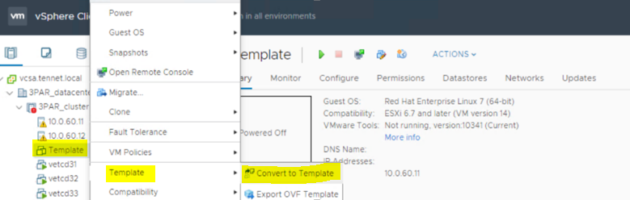

**Figure 30.** Console to convert VM into a template

### Deploy VMs from the template

In order to clone from the template and create VMs for OpenShift
deployment, the user will need to edit the variables YAML file. Using an
editor such as vi or nano, open the
file*/etc/ansible/hpe-solutions-openshift/synergy/scalable/3par-*
*vsphere/fc/DeployVMs/VirtualMachineVars.yaml.* The file will contain
information about the VMs, vCenter, hostnames, IPs, memory, and CPU. A
sample variable file is presented below. The installer will need to
update the variable file with the details to suit the needs of their
deployment environment.

```

#This is the variable file used to create VMs in vCenter Server
Appliance

vcenter_hostname: 10.0.x.x / vcsa.tennet.local

vcenter_username: < vCSA_username >

vcenter_password: < vCSA_password >

cluster_name: 3PAR_cluster

datacenter_name: 3PAR_datacenter

datastore_name: 3PAR_datastore

vmtemplate: 3PAR_template

# Disk size in GB/GiB

master_disk_size: 50

infra_disk_size: 50

etcd_disk_size:50

lb_disk_size: 50

# number of CPUs

master_cpu_size: 4

etcd_cpu_size: 4

infra_cpu_size: 4

lb_cpu_size: 2

# Memory in MB/MiB

master_memory_size: 16384

etcd_memory_size: 16384

infra_memory_size: 16384

lb_memory_size: 8192

master01_ip: 10.0.x.x

master02_ip: 10.0.x.x

master03_ip: 10.0.x.x

infra01_ip: 10.0.x.x

infra02_ip: 10.0.x.x

infra03_ip: 10.0.x.x

etcd01_ip: 10.0.x.x

etcd02_ip: 10.0.x.x

etcd03_ip: 10.0.x.x

lb01_ip: 10.0.x.x

lb02_ip: 10.0.x.x

master01_name: master01

master02_name: master02

master03_name: master03

infra01_name: infra01

infra02_name: infra02

infra03_name: infra03

lb01_name: lb01

lb02_name: lb02

subnet_mask: 255.255.0.0

gateway_address: 10.0.x.x

dns_server_address: 10.0.x.x

domain_name: "tennet.local"

network_name: "VM Network"

```

**NOTE**

Values for variables such as number of CPUs, memory, and disk size
provided in the *VirtualMachineVars.yml* should be greater than or equal
to the values of the corresponding variables provided while creating the
virtual machine template. Failing to follow this guideline will lead to
the failure of the playbook execution.

After editing the variable files execute the following command from
the Ansible Engine to deploy the management VMs.

```

# ansible-playbook /etc/ansible/hpe-solutions-openshift/synergy/scalable/3par-vsphere/fc/DeployVMs/DeployManagementVMs.yml

```

This playbook will create the following VMs in vCenter and
configures the IP address, DNS and domain name for each of them.

-   master01
-   master02
-   master03
-   etcd01
-   etcd02
-   etcd03
-   infra01
-   infra02
-   infra03
-   lb01
-   lb02

After the VMs are created, SSH into each of them and update
hostnames to their corresponding fully-qualified domain names with the
command listed below.

```

# hostnamectl set-hostname <fqdn as hostname of the virtual machine>

```

# Red Hat OpenShift deployment

This section describes the process to deploy Red Hat OpenShift version
3.11.

Prior to installation, ensure you have internet access and able to reach
the HPE GitHub site at <https://github.com/hewlettpackard>.

To validate internet connectivity, run the following command on the
Ansible Engine.

```

# curl <https://github.com/hewlettpackard>

```

## Ansible Vault

An Ansible Vault file is included and may be accessed at
*/etc/ansible/hpe-solutions-openshift/synergy/scalable/3par-vsphere/fc/vault_pass.yml.*

To edit the Ansible Vault password in *vault_pass.yml*, run the
following command.

```

# ansible-vault edit vault_pass.yml

```

Edit the file with values that match the installation environment. An
example appears below.

```

ansible_ssh_user: <AnsibleUserName>

ansible_ssh_pass: < Password>

rhsm_user: <RHSMUserName>

rhsm_pass: <YourPassword>

vault_rhsub_user: <YourUserName>

vault_rhsub_pass: <YourPassword>

# Subscription pool_id details

pool_ids_vms:

- Red Hat Cloud Infrastructure Subscription pool id for virtual machine

- 8 Red Hat Cloud Infrastructure Subscription pool id for virtual
machine

pool_ids_physical:

- Red Hat Cloud Infrastructure Subscription pool id for Physical
servers

- Red Hat Cloud Infrastructure Subscription pool id for Physical
servers

pool_ids_rhvh:

- Red Hat Virtualization Host Subscription pool id for Physical servers

pool_ids_rhel:

- Red Hat Enterprise Linux Subscription pool id

- Red Hat Enterprise Linux Subscription pool id

```

# OpenShift prerequisites

## Installation prerequisites for OpenShift on the virtual machines and worker nodes

The next play prepares the hosts for OpenShift installation. Two Ansible
roles *(roles/virtual-host-prepare/* and *roles/physical-host-prepare/)*
are available for preparing the management VM's and physical worker
nodes.

The containers and the images created in the process are stored in
Docker's storage back end. This storage is ephemeral and separate from
any persistent storage allocated to meet the needs of applications. The
default storage back end for Docker on RHEL 7 is a thin pool on the
loopback devices, which is not supported in production environments. As
a work around to this scenario, Hewlett Packard Enterprise used an
additional block device to create a thin pool device for Docker's local
storage.

Edit the hosts files and the files under the vars & roles, in a text
editor such as vi or nano and update the path to the second disk.

*/etc/ansible/hpe-solutions-openshift/synergy/scalable/3par-vsphere/fc/roles/virtual-host-prepare/vars/main.yml*

*/etc/ansible/hpe-solutions-openshift/synergy/scalable/3par-vsphere/fc/roles/physical-host-prepare/vars/main.yml*
.

For VMs created by running the '*DeployManagementVMs.yml*' play, the
default location of the second disk is *'/dev/vdb*' which is already
updated in the variable file available at
*roles/virtual-host-prepare/vars/main.yml*. The line in the file reads
as below.

```

*second_disk_vms: /dev/vdb*

```

For Physical worker nodes created as per the Red Hat OpenShift worker
nodes section, the default location of the second disk is
*/dev/mapper/mpatha* and it should be updated in the variable file
available at *roles/physical-host-prepare/vars/main.yml.* The line in
the file reads as below.

```

*second_disk_physical: /dev/mapper/mpatha*

```

**NOTE**

To find Pool IDs for the management and worker VMs, execute the
following command and look for the System Type: Virtual

```

# subscription-manager list --available --matches '*OpenShift*'

```

The host prepare plays are *physical-hostprepare.yml* and
*virtual-hostprepare.yml* and are located at /
*etc/ansible/hpe-solutions-openshift/synergy/scalable/3par/playbooks* .
They accomplish the following:

1) Disables the firewall for the OpenShift installation. This will be
re-enabled post-install.

2) Creates a user group with passwordless sudo rights.

3) Creates a sudo user and adds the user to the passwordless sudo group.

4) Uploads the public SSH key to allow secure access without
credentials.

5) Registers the host using Subscription Manager.

6) Enables the required repos.

7) Installs the basic utilities.

8) Performs a yum update to ensure the latest patches and updates are
applied.

9) Installs Red Hat OpenShift related packages.

10) Installs the latest version of Docker which should be 1.13-94 or
above.

11) Configures Docker local storage.

To prepare the management VM's, execute the following command on the
Ansible Engine host.

```

# cd
etc/ansible/hpe-solutions-openshift/synergy/scalable/3par-vsphere/fc

# ansible-playbook --i hosts virtual-hostprepare.yml --ask-vault-pass
<-e@vault_pass.yml>

```

To prepare physical worker nodes, execute the following command on the
Ansible Engine host.

```
# ansible-playbook --i <path of hosts>/hosts physical-hostprepare.yml
--ask-vault-pass <-e@vault_pass.yml>
```

### Deployment prerequisites for OpenShift on the virtual machines and worker nodes

In order to utilize the scripts and procedures documented in this
deployment section, certain prerequisites must be met. The prerequisites
are:

- Ansible Engine should be installed and configured and capable of
communicating with the hosts within this solution.

- VMware vSphere Virtualization Host is installed on three (3) HPE
Synergy 480 Gen10 Compute Modules.

- VMware vCenter is configured within the solution environment.

- VMware vSphere hosts have been added to vCenter within the correct
cluster.

- Both storage and networking are configured within vCenter.

- An appropriate data center and cluster have been created within
vCenter.

- DNS entries should exist for all Red Hat OpenShift Container Platform
virtual and physical hosts.

- All worker nodes should have storage configured.

- A user should be created in Active Directory (AD) for authentication
and the user's AD values should be recorded.

## Authentication

In Red Hat OpenShift Container Platform, master includes a built-in
Oauth 2.0 server. Users obtain OAuth access tokens to authenticate
themselves to the API. When a user requests a new OAuth token, the OAuth
server uses the configured identity provider to determine the identity
of the person making the request. It then determines what user that
identity maps to, creates an access token for that user, and returns the
token for use.

In this solution, identity provider with OAuth can be implemented with
LDAP or htpass. As a best practice, this solution configures the
identity provider during the cluster installation.

### LDAP

LDAP user authentication is the process of validating user credentials
with a directory server such MS Active Directory, OpenLDAP and so on.
LDAP directories are standard technology for storing user, group and
permission information and serving that to applications in the
enterprise.

To implement OAuth using LDAP, a user should be created in Active
Directory (AD) for authentication and the user AD values should be known
and the following line is to be included in the inventory file used for
the Red Hat OpenShift Container Platform installation.

```

# LDAP authentication\
#openshift_master_identity_providers=[{'name':
'my_ldap_provider', 'challenge': 'true', 'login': 'true',
'kind': 'LDAPPasswordIdentityProvider', 'attributes': {'id':
['dn'], 'email': ['mail'], 'name': ['cn'],
'preferredUsername': ['uid']}, 'bindDN': '', 'bindPassword':
'', 'insecure': 'false', 'url':
'ldap://ldap.example.com:389/ou=users,dc=example,dc=com?uid'}]

```

### Htpasswd

htpasswd is used to create and update the flat-files used to store user
credentials for authentication of HTTP users.

The htpasswd file contains username in plain text (unencrypted) and a
hashed (encrypted) password. Each line contains a username and a
password separated by a colon ":". The password is hashed using a
complex algorithm. The htpasswd generator used in this solution uses MD5
encryption algorithm.

In case htpasswd is used for authentication:

- An htpasswd file should be created. htpasswd file can be created using
the tool available at <http://www.htaccesstools.com/htpasswd-generator/>

- Save the file to /etc/oshift-hash-pass.htpasswd and refer this file in
the identity provider section under OpenShift variables in the host
file.

- Include the following line in the inventory used for the Red Hat OpenShift Container Platform installation.

```

# htpasswd auth
openshift_master_identity_providers=[{'name': 'htpasswd_auth',
'login': 'true', 'challenge': 'true', 'kind':
'HTPasswdPasswordIdentityProvider'}]

# Defining htpasswd path
#openshift_master_htpasswd_file=<path to local pre-generated
htpasswd file>

```

With OAuth, authorization to external application is easier and it
enables using a single account to authenticate multiple applications
like internal container registry, Jenkins, Prometheus etc, which in turn
makes permission management faster and better.

**NOTE**

To create a user in Active Directory that can be used to authenticate
via LDAP, refer to the document
<https://support.microsoft.com/en-in/help/324753/how-to-create-an-active-directory-server-in-windows-server-2003>
.

**NOTE**

When htpasswd is used for authentication rather than LDAP, an htpasswd
file should be created. Tools to accomplish this task are available at,
<http://www.htaccesstools.com/htpasswd-generator/> . Generate a file and
save it to /etc/oshift-hash-pass.htpasswd and refer to this in the
identity provider section of the OpenShift variables in the host file.
An example appears below.

```

# openshift_master_identity_providers=[{'name':
'htpasswd_auth', 'login': 'true', 'challenge': 'true', 'kind':
'HTPasswdPasswordIdentityProvider',}]

```

### Generate a Key

On the Ansible Engine host, run the following command to generate a
local certificate.

```

# ssh-keygen -t rsa

```

This will create a key file and store it under the installation user's
home directory at *\~/.ssh/id_rsa.pub.*

**NOTE**

Installation of Red Hat OpenShift Container Platform 3.11 requires
Ansible version 2.6. For deactivating the virtual environment and
installing Ansible 2.6, execute the following commands.

```

# deactivate

# yum install ansible

```

## Installing openshift-ansible

The following Ansible playbooks will deploy Red Hat OpenShift Container
Platform on the machines that have been created and configured by the
previous Ansible playbooks. In order to retrieve the *openshift-ansible*
playbooks from the 'Red Hat OpenShift Container Platform 3.11 repo, run
the following command.

```

# yum install openshift-ansible

```

The variables for the OpenShift deployment are maintained in the Ansible
inventory file, in this example that file is */etc/ansible/hosts* *.*
Review the sample hosts file provided in the GitHub repository for this
solution located at
<https://github.com/HewlettPackard/hpe-solutions-openshift/tree/master/synergy/scalable/3par-vsphere/fc>
.

## Cluster Deployment

From the Ansible Engine, run the *prerequisites.yml*
and*deploycluster.yml* playbooks that are located in
*/usr/share/ansible/openshift-ansible/playbooks/* on the Ansible host.

```

*# cd /usr/share/ansible/openshift-ansible/playbooks/*

*# ansible-playbook -i
/etc/ansible/hpe-solutions-openshift/synergy/scalable/3par/hosts
prerequisites.yml*

*# ansible-playbook --i
/etc/ansible/hpe-solutions-openshift/synergy/scalable/3par/hosts
deploy_cluster.yml*

```

When the deployment has finished the user can access the OpenShift login
page as shown in Figure 31 below. Use the credentials provided in the
htpasswd file or the AD user based on the authentication option
configured. The URL will be
[*https://openshift-master:8443*](https://openshift-master:8443) *.*

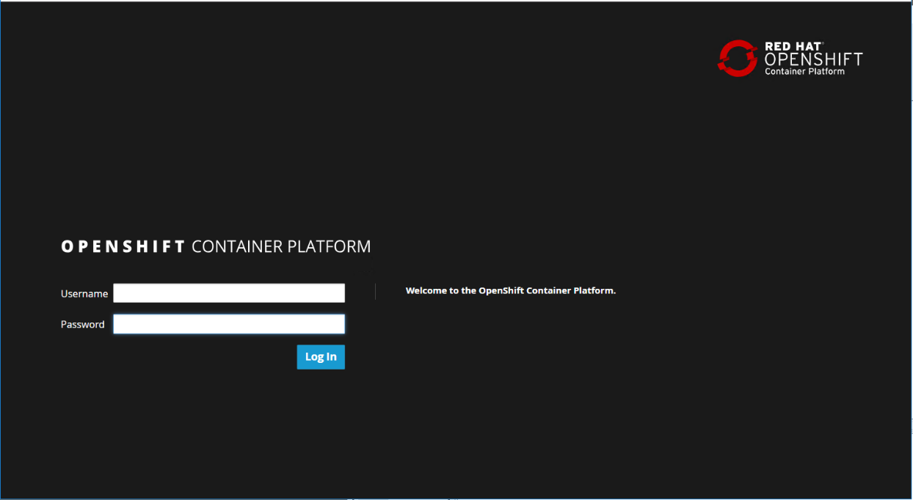

**Figure 31.** OpenShift User Interface

### Final layout

Figure 32 shows the final VM layout once OpenShift has been deployed.
Validate that your environment aligns to this design. Worker node counts
may vary as the solution supports between three (3) and n nodes.

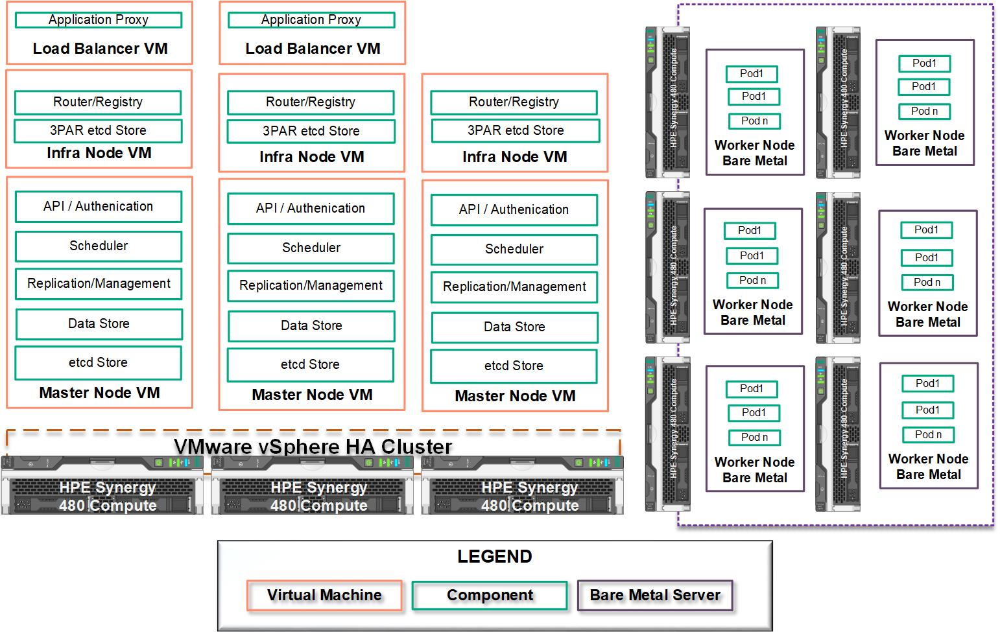

**Figure 32.** Final OpenShift layout post deployment

# Configuring persistent storage connectivity

This section will guide the installer through the process of configuring
connectivity for persistent storage. It is recommended for the installer
to check <https://github.com/hpe-storage/python-hpedockerplugin> for the
latest supported version and instructions related to OpenShift 3.11.

## Clone HPE 3PAR Docker plugin repo

This repo installs the HPE 3PAR Volume plugin for Docker for OpenShift
environments.

Ansible is installed by default on the master nodes within the solution.
This section focuses on cloning repos and running commands from one of
the master nodes. Choose the master nodes to use for cloning and
configuring the HPE 3PAR Docker plugin, log onto the system over SSH or
at the console and run the following commands.

```

# cd /etc/ansible

# git clone
<https://github.com/hpe-storage/python-hpedockerplugin/tree/master/ansible_3par_docker_plugin>

```

The HPE 3PAR Docker volume plugin installer deploys a separate etcd
cluster on the master nodes alongside the built-in OpenShift/Kubernetes
etcd instance. This is done to store the Docker and HPE 3PAR volume
metadata in order to prevent tainting the OpenShift/Kubernetes etcd
instance. The appropriate etcd ports have been modified in order to
eliminate conflicts.

The following steps assist in the deployment of the plugin and the
supported environment:

1. Edit the HPE 3PAR Docker volume plugin host file using a vi editor to
match your environment.

```

# vim /etc/ansible/ansible_3par_docker_plugin/hosts

[all]

oshift-fc-m1.tennet.local ## Master Node

oshift-fc-m2.tennet.local ## Master Node

oshift-fc-m3.tennet.local ## Master Node

oshift-fc-worker01.tennet.local ## Worker node

oshift-fc-worker02.tennet.local ## Worker node

oshift-fc-worker03.tennet.local ## Worker node

oshift-fc-worker04.tennet.local ## Worker node

oshift-fc-worker05.tennet.local ## Worker node

oshift-fc-worker06.tennet.local ## Worker node

[masters]

oshift-fc-m1.tennet.local

oshift-fc-m1.tennet.local

oshift-fc-m1.tennet.local

[workers]

oshift-fc-worker01.tennet.local ## Worker node

oshift-fc-worker02.tennet.local ## Worker node

oshift-fc-worker03.tennet.local ## Worker node

oshift-fc-worker04.tennet.local ## Worker node

oshift-fc-worker05.tennet.local ## Worker node

oshift-fc-worker0.tennet.local ## Worker node

[etcd]

oshift-fc-m1.tennet.local

oshift-fc-m2.tennet.local

oshift-fc-m3.tennet.local

```

2. The user should read the README.md file found at,
[README file](https://github.com/hpe-storage/python-hpedockerplugin/tree/master/ansible_3par_docker_plugin)
and follow the instructions within the file. Once the required files are
updated, run the following command on the Ansible Engine to create the
etcd cluster and configure the HPE 3PAR Docker plugin.

```

# ansible-playbook -i hosts /install_hpe_3par_volume_driver.yml

```

3. After running the Ansible playbook, restart the OpenShift node
services by running the following command.

```

# systemctl restart atomic-openshift-node

```

## Validate persistent volume configuration

The master nodes used for persistent volume configuration has the sample
folder that contains descriptor files, to create a storage class, a PVC
and a Minio pod to validate the deployment. The files are:

- sc_example.yml -- Descriptor file for creating a storage class.

- pvc_example.yml -- Descriptor file for creating a persistent volume
claim.

- pod_example.yml -- Descriptor file for creating a Minio pod that uses
the persistent volume claim.

To create the storage class, PVC and Minio pod are used to validate
functionality by running the following commands.

```

# oc create -f
/etc/ansible/ansible_3par_docker/sample/sc_example.yml

# oc create -f
/etc/ansible/ansible_3par_docker/sample/pvc_example.yml

# oc create -f
/etc/ansible/ansible_3par_docker/sample/pod_example.yml

# oc get pods |grep 'pod-chris*|Running'

```

A success message should appear validating the deployment.

## Deploy the registry with persistent storage

An integrated Docker registry is created along with the OpenShift
installation. This Docker registry pod will be running in the namespace
'default'. Running the following play on the master nodes will check if
the Docker registry is running and, if it is not, will create an
integrated Docker registry. If the Docker registry is running with an
ephemeral volume, this play will create a PVC and attach the persistent
volume to the registry pod.

```

# ansible-playbook -i
/etc/ansible/hpe-solutions-openshift/synergy/scalable/3par-vsphere/fc/hosts
/etc/ansible/hpe-solutions-openshift/synergy/scalable/3par-vsphere/fc/playbooks/validate-deployment.yaml

```

The following message confirms the success of the deployment.

```

"msg": "Successfully deployed Docker Registry with Persistent
Storage, Registry pod name < Name of the Registry Pod>

```

# Prometheus cluster monitoring

To enable Prometheus cluster monitoring, use the inventory variables and
playbook shown below. This uses persistent storage to record metrics to
a persistent volume and can survive a pod being restarted or recreated.

To configure the Prometheus cluster with persistent storage, follow the
steps below:

1) Add the following parameters to the host file under '[OSEv3:vars]'
section.

```

openshift_cluster_monitoring_operator_install=true

openshift_cluster_monitoring_operator_node_selector={"node-role.kubernetes.io/infra":
"true"}

openshift_cluster_monitoring_operator_prometheus_storage_enabled=true

openshift_cluster_monitoring_operator_alertmanager_storage_enabled=true

openshift_cluster_monitoring_operator_prometheus_storage_capacity=100Gi

openshift_cluster_monitoring_operator_alertmanager_storage_capacity=20Gi

openshift_cluster_monitoring_operator_prometheus_storage_enabled=true

openshift_cluster_monitoring_operator_alertmanager_storage_enabled=true

```

2) Run the following play to install Prometheus monitoring.

```

# ansible-playbook -i hosts
/usr/share/ansible/openshift-ansible/playbooks/openshift-monitoring/config.yml
--ask-vault-pass <-e@vault_pass.yml>

```

**NOTE**

You can also deploy Prometheus cluster monitoring, along with the
OpenShift Container Platform deployment using the
'*deploy_cluster.yml'* play. However, the PVC for the persistent
storage will not be created until the HPE 3PAR Docker plugin is
configured and storage class is created. It is recommended to run the
Prometheus cluster monitoring play separately after installing OpenShift
Container Platform.

# Elasticsearch, Fluentd and Kibana

## Aggregating container logs using Elasticsearch, Fluentd and Kibana

The Elasticsearch + Fluentd + Kibana (EFK) stack should be deployed in
order to aggregate logs from hosts and applications for a range of
OpenShift Container Platform services.

To aggregate container logs using EFK with Persistent Elasticsearch
Storage, follow the steps below:

1) Add the following parameters to the host file under '[OSEv3:vars]'
section.

```

openshift_logging_install_logging=true

openshift_logging_es_pvc_dynamic=true

openshift_logging_es_pvc_size=200Gi

openshift_logging_elasticsearch_storage_type=pvc

openshift_logging_es_pvc_prefix=oc-efk-log

openshift_logging_es_cluster_size=3

openshift_logging_es_nodeselector={"node-role.kubernetes.io/infra":
"true"}

openshift_logging_kibana_nodeselector={"node-role.kubernetes.io/infra":
"true"}

openshift_logging_curator_nodeselector={"node-role.kubernetes.io/infra":
"true"}

openshift_logging_fluentd_nodeselector={"node-role.kubernetes.io/infra":
"true"}

openshift_logging_es_number_of_replicas=3

openshift_logging_es_allow_external=true

openshift_logging_es_hostname=ses.router.tennet.local

openshift_logging_kibana_hostname=kibana.router.tennet.local

```

2) Run the following play to install EFK stack.

```

# ansible-playbook -i hosts
/usr/share/ansible/openshift-ansible/playbooks/openshift-logging/config.yml
--ask-vault-pass <-e@vault_pass.yml>

```

**NOTE**

You can also deploy EFK stack, along with the OpenShift Container
Platform deployment using the *'deploy_cluster.yml'* play. However, the
PVC for the Persistent Elasticsearch Storage will not be created until
HPE 3PAR Docker plugin is configured and storage class is created. It is
recommended to run the EFK stack play separately after installing
OpenShift Container Platform.

# Validate OpenShift deployment

OpenShift deployment can be validated through the following validation
steps.

## Command Line validation

1) Log into the console or ssh into the *master01* virtual machine and run
the *oc get nodes* command to ensure all nodes have a status of *Ready*.
A sample output is shown below for reference.

```

# oc get nodes

NAME STATUS ROLES AGE VERSION

oshift-fc-worker01.tennet.local Ready compute 18h v1.10.0+b81c8f8

oshift-fc-worker02.tennet.local Ready compute 18h v1.10.0+b81c8f8

oshift-fc-worker03.tennet.local Ready compute 18h v1.10.0+b81c8f8

oshift-fc-worker04.tennet.local Ready compute 18h v1.10.0+b81c8f8

oshift-fc-worker05.tennet.local Ready compute 18h v1.10.0+b81c8f8

oshift-fc-worker06.tennet.local Ready compute 18h v1.10.0+b81c8f8

oshift-fc-infra01.tennet.local Ready infra 18h v1.10.0+b81c8f8

oshift-fc-infra02.tennet.local Ready infra 18h v1.10.0+b81c8f8

oshift-fc-infra03.tennet.local Ready infra 18h v1.10.0+b81c8f8

oshift-fc-master01.tennet.local Ready master 19h v1.10.0+b81c8f8

oshift-fc-master02.tennet.local Ready master 19h v1.10.0+b81c8f8

oshift-fc-master03.tennet.local Ready master 19h v1.10.0+b81c8f8

```

2) Run the *oc get pod* command. This command will display the running
pods in the default project.

```

# oc get pod

NAME READY STATUS RESTARTS AGE

docker-registry-1-2z8q5 1/1 Running 0 22h

registry-console-1-mqdcl 1/1 Running 0 22h

router-1-7zx4m 1/1 Running 0 22h

router-1-gd6jw 1/1 Running 0 22h

router-1-gmkg2 1/1 Running 0 22h

```

## Administrator login and cluster admin role

1) From the master0 node, login as the default system admin account as
shown below.

```

# oc login -u system:admin

```

2) Once logged in, the system will display the projects that you have
the access. The user should have access to the following projects and
can switch between them.

```

'oc project <projectname>':

app-storage

* default

kube-public

kube-system

management-infra

openshift

openshift-infra

openshift-logging

openshift-node

openshift-sdn

openshift-web-console

test2

Using project "default".

```

## Grant the cluster admin role to a user

While logged in as the system admin, you can assign the cluster
admin role to a user as shown below. This will allow access to the
cluster console.

```

*# oc adm policy add-cluster-role-to-user cluster-admin <username>*

```

**NOTE**

Assigning the cluster-admin role is not required to deploy applications.

## Validating Prometheus cluster monitoring

1) After successful installation of Prometheus monitoring, log into the
Grafana web console using the route which generates a URL for Grafana,
as shown in Figure 33.

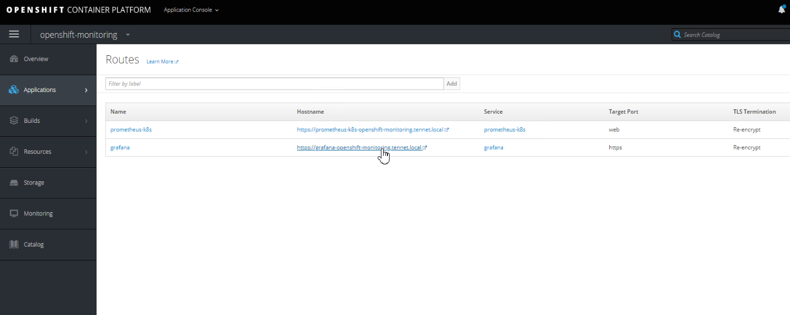

**Figure 33.** Grafana route

2) Select **Login with OpenShift** to log into the console using the
OpenShift Container Platform admin login credentials created while
installing OpenShift Container Platform. Figure 34 shows the home
dashboard of the OpenShift Container Platform admin.


**Figure 34.** Grafana home page

3) From the left navigation pane, select **Configuration** and then
**Data Sources**. You should see a Prometheus data source as in Figure 35.

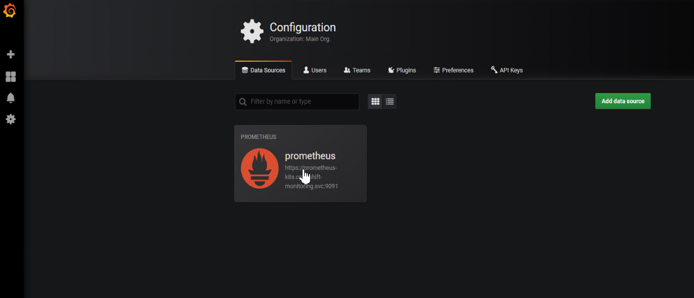

**Figure 35.** Prometheus data source

## Validating Elasticsearch, Fluentd and Kibana

1) Create a custom dashboard or import a dashboard (.json format) to view
OpenShift Container Platform statistics.

2) After successful installation of the EFK stack, log into the Kibana
web console using the Kibana hostname provided in the host file,
accessible at *https://<kibana hostname>.*

3) Select **Login with OpenShift** to log into the console using the
OpenShift Container Platform admin login credentials created while
installing OpenShift Container Platform.

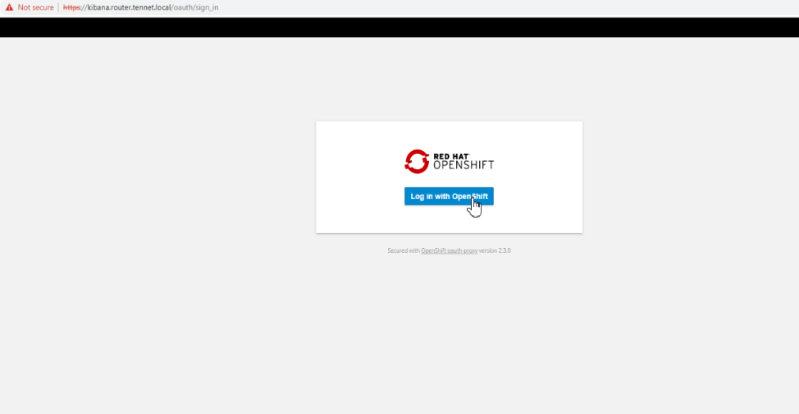

**Figure 36.** Kibana login

The OpenShift Container Platform logs are viewable from the Kibana
dashboard as in Figure 37.

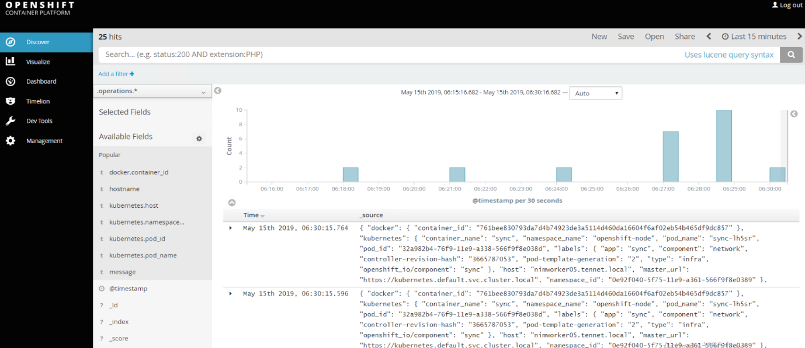

**Figure 37.** Kibana dashboard

# Ansible OpenShift deployment removal

This Ansible play removes the Red Hat OpenShift Container Platform
deployment. It is a two-step process that requires uninstalling the
application followed by unregistering the Red Hat OpenShift components
and deleting any deployed VMs.

## Uninstall OpenShift

This step should be run from the Ansible Engine that is located outside
of the Red Hat OpenShift Container Platform environment. Run the
following playbook.

```

# ansible-playbook -i hosts
/usr/share/ansible/openshift-ansible/playbooks/adhoc/uninstall.yml

```

## Unregister OpenShift components and delete deployed VMs

To unregister the components and delete the deployed VMs, run the
following playbook.

```

# ansible-playbook -i
/etc/ansible/hpesolutions-openshift/synergy/scalable/3par-vsphere/fc/DeployVMs/DeleteVM.yml

```

## Uninstall the storage plugin

This step assumes that you are in the root folder where the playbooks
reside, on the master nodes Ansible Engine instance. Run the following
playbook to uninstall the storage plugin.

```

# ansible-playbook -i hosts
/etc/ansible/ansible_3par_docker/uninstall/uninstall_hpe_3par_volume_driver.yml

```

# Red Hat OpenShift Container Platform security

While IT organizations are turning into cloud-native, to satisfy market
needs, they additionally face many of the following security challenges
while adhering to essential security principles. The security challenges
are:

- It is challenging to assess the compliance posture of containers and
Kubernetes environments.

- There is a frequent lack of visibility into container infrastructure
and security incidents at runtime.

- There is a lack of ability to inspect a container's activity after it
is gone.

- As the number of images in the registry increases, it becomes more
important to quickly identify critical vulnerabilities within images.

- Keeping track of secrets and credentials exposed by an image, among
thousands of images is complex and time consuming.

- Identifying if an image is exposing any blacklisted ports and it is
important to stop a hacker from gaining entry through a back door.

- Tracking the licenses and their types that are used by an image is
complex.

- Performing a compliance check on each container to identify any
violations that is critical.

- Regular health checks must be performed on containers.

To address the container security challenges, this document proposes
following two solutions to secure and monitor Red Hat OpenShift
Container Platform. The first solution uses the "Kube-bench" utility to
secure and monitor the Red Hat OpenShift Container Platform. For the
second solution, Hewlett Packard Enterprise and Sysdig have collaborated
to secure the solution stack using the Sysdig cloud deployment model for
Sysdig Secure and Sysdig Monitor.

## Automated deployment of the Kube-Bench utility on the Red Hat OpenShift Container Platform

This section of the document describes how to assess the security
posture of OpenShift using the automated CIS Kubernetes benchmark with
the kube-bench utility. The kube-bench is a go application that checks
whether Kubernetes is deployed securely by running the checks documented
in the [CIS Kubernetes
benchmark](https://www.cisecurity.org/benchmark/kubernetes/) . It helps
to deliver:

- Faster time to production with Red Hat OpenShift Container Platform.
- Increased operational efficiency with HPE Composable Infrastructure.
- Rapid and automated security checks.
- Simplified compliance for entire solution.

To install kube-bench, use the repository that was cloned from
<https://github.com/hewlettpackard/hpe-solutions-openshift> . This repo
contains Ansible plays and scripts to automate the installation and
running of kube-bench.

### Contents of the repo

-   **playbooks:** This folder contains the playbooks required for
    kube-bench installation.
-   **roles:** This folder contains a role called "
    **kube-bench-deploy-ocp**" which is responsible for performing the
    actions required for kube-bench integration.
-   **hosts:** This is the host file which will be used by Ansible
    Engine to reference hosts during kube-bench deployment. Update the
    master nodes, worker nodes and infrastructure nodes with the
    complete host names in this file.
-   **site.yaml:** This file will import the playbook
    "*kube-bench-deployment.yaml* " which defines the workflow for
    kube-bench integration.

### Prerequisites

The following prerequisites should be met prior to installation.

- Red Hat OpenShift Container Platform 3.11 should be up and running.

- All the nodes in the Red Hat OpenShift Container Platform 3.11
deployment should have Red Hat Enterprise Linux 7.6 deployed.

- The user should have access to the internet to clone the public GitHub
repositories for kube-bench and Golang on each node of the OpenShift
Container Platform.

### Custom attributes/variable files and plays

Each playbook has a role associated with it. Each role has a set of
tasks under the "task" folder. This file contains the automated steps
for Golang, kube-bench, running kube-bench and storing results back to
the Ansible Engine node.

```

security-kube-bench/roles/kube-bench-deploy-ocp/tasks/main.yml

```

### Using the playbooks

1) Edit the hosts file to suit the installation environment. In the
hosts file, provide the IP address or fully qualified domain name (FQDN)
of the master, infrastructure and work nodes as an example shown in
Figure 38.

```

# cd /etc/ansible/hpe-solutions-openshift/synergy/scalable/3par-vsphere/fc/security-kube-bench

# vi hosts

```

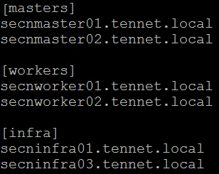

**Figure 38.** Shows the hosts file entries

2) Once the host file is edited, run the play using the following
command.

```

# ansible-playbook -i hosts site.yml

```

3) Once the playbook has completed, browse the *"/tmp/"* directory on
the Ansible Engine and ensure that all of the log files generated from
each of the masters, workers and infrastructure nodes specified in the
hosts file are available in the directory. Figure 39 shows an example
directory listing.


**Figure 39.** Log files on the Ansible Engine

##### Output

The number of log files located under */tmp/* will be equal to the
number of nodes specified in the hosts file. Each log file lists the
details of the CIS benchmark rules against which each of master,
infrastructure and worker node is tested. Figure 40 provides an example
of the log files.

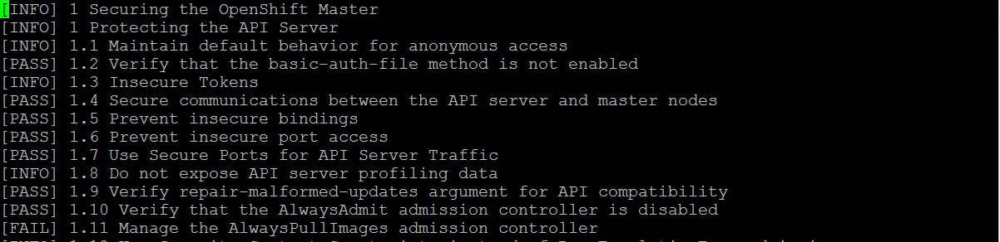

**Figure 40.** Log file example for an OpenShift master nodes

For each failed test, a set of remediation steps is listed in the logs.
Figure 41 shows an example of remediation steps.

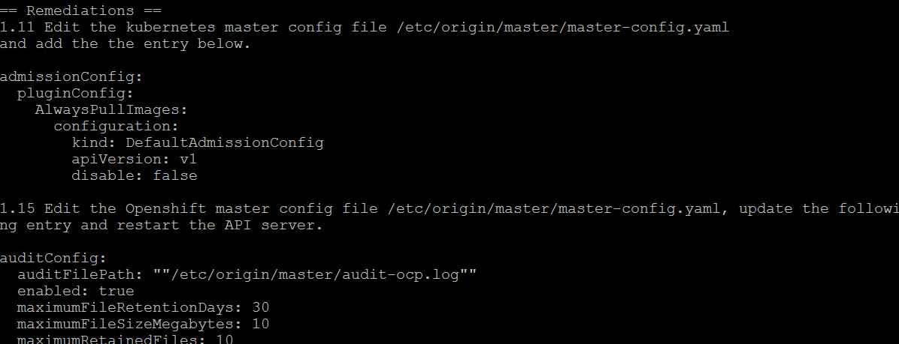

**Figure 41.** Remediation steps

The end of each log file shows a summary of results as shown in Figure
42.


**Figure 42.** Summary of the results

## Automated deployment of the Sysdig agent on the Red Hat OpenShift Container Platform

This section describes how to install Sysdig agents in an automated way
within the context of the solution. Sysdig agents can be installed on a
wide array of Linux hosts. The assumption here is that a user will run
the Sysdig agent as a pod which then enables the Sysdig agent to
automatically detect and monitor Red Hat OpenShift Container Platform.

Hewlett Packard Enterprise used the Sysdig DaemonSet to deploy the
Sysdig agents on all of the nodes in the cluster. A DaemonSet ensures
that all OpenShift nodes run a copy of a pod. As nodes are added to the
cluster, pods are added to the newly introduced nodes. As nodes are
removed from the cluster, those pods are in turn garbage collected.
Deleting a DaemonSet will clean up the pods it created. This DaemonSet
internally runs three kinds of daemons on every node. The three kinds of
daemons are:

-   Cluster storage daemon
-   Logs collection daemon
-   Monitoring daemon

Once these daemons are deployed on OpenShift nodes, the Sysdig Monitor
automatically begins monitoring all of the hosts, applications, pods,
and services and automatically connects to the OpenShift API server to
pull relevant metadata about the environment. If licensed, Sysdig Secure
launches with default policies that a user can view and configure to
suit their needs.

To install Sysdig agents on the Red Hat OpenShift Container Platform
nodes, use the

repository located at the HPE OpenShift solutions GitHub at

<https://github.com/hewlettpackard/hpe-solutions-openshift> . This
repository contains

Ansible plays and scripts to automate installation.

### Contents of the repo

-   **Playbooks:** This folder contains the playbooks required for
    Sysdig agent installation.
-   **Roles:** This folder contains a role called
    "sysdig-agent-deploy-ocp" which is responsible for performing the
    actions required for Sysdig agent integration.
-   **Hosts:** This is the host file which will be used by the Ansible
    Engine to reference hosts during Sysdig agent deployment. Provide
    the OpenShift Container Platform master nodes complete host name in
    this file.
-   **site.yaml:** In this file, the playbook
    *sysdig-agent-deployment.yaml* is imported. This file defines
    the entire workflow for Sysdig integration.

### Prerequisites

In order to successfully deploy Sysdig agents on the OpenShift Container
Platform

nodes, the installation user should have the following prerequisites.

- Red Hat OpenShift Container Platform 3.11 should be up and running.

- Worker nodes in the Red Hat OpenShift Container Platform deployment
can be virtual or physical running RHEL 7.6.

- The installation user should have SaaS based access to Sysdig Secure
and Sysdig Monitor for the purpose of container security.

- The installation user should have admin rights and privileges for
Sysdig Secure and Sysdig Monitor.

- Sysdig agents with version 0.90.3 are deployed on OpenShift Container
Platform.

- The user should have a valid access token that is given by Sysdig and
is specific to their credentials on Sysdig Monitor and Sysdig Secure.

- The installation user should have updated the kernel to make sure all
RHEL nodes are running the same kernel version. Run the following
command to install kernel headers on master, infrastructure and worker
nodes.

```

*yum -y install kernel-devel-$(uname -r)*

a

### Custom attributes\\variable files and plays

Each playbook has a role associated with it. Each role has a set of
tasks under the *"task"* folder and variables under the *"var*"
folder. These variable values need to be defined by the user according
to the user's environment before running the plays. Alter the following
files:

-   **sysdig-agent-deploy-ocp/vars/main.yml:** This file will be used
    during Sysdig agent deployment to OpenShift and contains Sysdig
    related variables.
-   **sysdig-agent-deploy-ocp/tasks/main.yml:** This file contains the
    actual Sysdig agent installation steps.
-   **sysdig-agent-deploy-ocp/files/sysdig-agent-configmap.yaml**
    **:** This file is provided by Sysdig and handles the Sysdig
    software related configurations.
-   **sysdig-agent-deploy-ocp/files/sysdig-agent-daemonset-redhat-openshift.yaml**
    **:** This file is provided by Sysdig and handles the Sysdig daemon
    related configurations.

```

### How to use playbooks

This section describes the steps that need to be performed to use the
playbooks. Once the required repository is cloned to the Ansible Engine
host, navigate to following path on the cloned directory.

```

# cd /etc/ansible/hpe-solutions-openshift/synergy/scalable/3par-vsphere/fc/security-sysdig

```

Update the variables in the following files:

1) hosts

a. Provide the master nodes (only 1 master node is required), fully
qualified domain name (FQDN), or IP address under [master]. All the
Sysdig specific files will be copied to this master node.

b. Edit the file *roles/sysdig-agent-deploy-ocp/vars/main.yml*.

c. Provide a value for the project name for Sysdig integration with
OpenShift under the "*projectname*" variable.

d. Provide the Sysdig access *key/token* value. This value is retrieved
from the user setting by logging into either Sysdig Secure or Sysdig
Monitor GUI and is found in the "*accesskeyval*" variable.

2) Edit the file *roles/sysdig-agent-deploy-ocp/files/sysdig-agent-configmap.yaml*.

a. Enter "OpenShift" as the **cluster type**.

b. Enter the **Sysdig Collector address** and **port**. Check with the
Sysdig team to know which collector is accessible in your environment
and over which port.

c. It is recommended to access Sysdig collector over Secure Socket Layer
(SSL). For both the keys "ssl" and "ssl certificate validate" set the
value as "true".

d. Set the variable related to the underlying Kubernetes deployment that
is OpenShift in this solution to true.

e. Enter the cluster name of the OpenShift cluster.

3) Run the play using following command.

```

# ansible-playbook -i hosts site.yml

```

4) To verify the deployment, log into the master node that is mentioned
in the hosts file and type the following command.

```

# oc get pods

```

This command will output all Sysdig agent names running on each of the
nodes within your OpenShift cluster as shown in Figure 43. If you see a
pod with a pending status, then there might be a possibility that the
underlying OpenShift node is not functional.

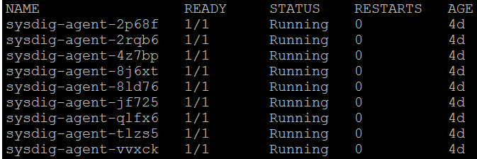

**Figure 43.** Sysdig agents running on OpenShift nodes

5) Check the number of nodes that are currently up and running in the
OpenShift Container Platform deployment using the command *"oc get
nodes"* as shown in Figure 44.

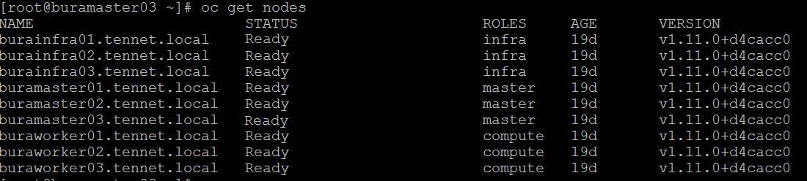

**Figure 44.** OpenShift nodes information

6) From the Sysdig Secure web interface, click on the icon named
**POLICY EVENTS** and you will see the web interface for the *Policy
Events* tab. On the *Policy Events* tab, click the **Groupings** ***
drop-down list and select **Entire Infrastructure**. The user with
administrative privileges should be able to see all of the OpenShift
nodes as shown in Figure 45.


**Figure 45.** OpenShift cluster in Sysdig Secure

7) From the Sysdig Monitor web interface, click on the icon named
**EXPLORE** and you will see the web interface for the **Explore** tab.
On the Explore tab, click the **Data Source** (two rectangles) drop-down
menu and select the data source named **Sysdig** **Agents** from the
drop-down list. Then open the **Groupings** drop-down list and select
**Clusters and Nodes**. The user with administrative privileges should
be able to see all of the OpenShift nodes as shown in Figure 46.

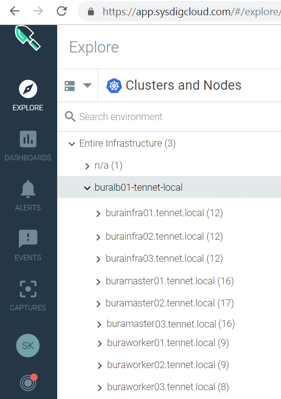

**Figure 46.** OpenShift cluster in Sysdig Monitor

**NOTE**

For an explanation of host requirements for agent installation, refer
to
<https://sysdigdocs.atlassian.net/wiki/spaces/Platform/pages/192151570/Host+Requirements+for+Agent+Installation>

- It is recommended to use port 6443 for transferring and receiving data
over Secure Sockets Layer/ Transport Layer Security (SSL/TLS) protocol.
Sysdig agents transfer data to Sysdig Cloud over HTTPS that encrypts and
decrypts the requests as well as the responses that are returned by the
Sysdig Cloud.

- The OpenShift cluster name can be found by using the command "oc
config view" from any master node.

8) From the Sysdig Monitor web interface, click on the icon
named**EXPLORE**. On the Explore tab, click the **Data Source** (two
rectangles) drop-down menu and select the data source named **Sysdig
Agents** from the drop-down list. Open the**Groupings** drop-down list
and select **Deployment and Pods**. A user with administrative
privileges should be able to see all the agents and their details as
shown in Figure 47.


**Figure 47.** Sysdig agents running on the OpenShift cluster

# Installing Istio service mesh

## Overview

Istio service mesh simplifies the management of a distributed micro
services architecture, controls the flow of traffic and application
program interface (API) calls between services and allows secure service
communications (security). These include authentication, authorization,
rate limiting, and a distributed web application firewall for both
ingress and egress.

## Prerequisites

From the Ansible Engine, run the following commands. These will
configure the master, infrastructure and worker nodes with the
prerequisites required for the installation of Istio service mesh.

```
# cd /etc/ansible/Openshift-Synergy-RA/synergy/scalable/<vsphere>

# ansible-playbook playbooks/istio_prereqisites.yml
```

## Installing service mesh

Installing the service mesh involves the following tasks:

- Installing the operator.
- Creating and managing a custom resource definition file.

### Installing the operators

The Istio service mesh installation process introduces an operator to
manage the installation of the control plane within the istio-operator
namespace. This operator defines and monitors a custom resource related
to the deployment, update, and deletion of the control plane.

Starting with Red Hat OpenShift Service Mesh 0.12.TechPreview, the user
must install the Jaeger Operator and the Kiali Operator before the Red
Hat OpenShift Service Mesh Operator installs the control plane.

#### Installing the Jaeger operator

As on-the-ground microservice practitioners are quickly realizing, the
majority of operational problems that arise when moving to a distributed
architecture are ultimately grounded in two areas, networking and
observability. It is simply an order of magnitude, larger problem to
network, and debug a set of intertwined distributed services versus a
single monolithic application.

Install the Jaeger Operator for the Red Hat OpenShift Service Mesh
Operator in the master nodes which will enable the installation of the
control plane. To do this, SSH into the master node and log into the
OpenShift with the OpenShift user credentials given in the htpasswd or
LDAP. Once login is successful, execute the following commands to
install Jaeger operator.

```
# create the project for the jaeger operator

# oc new-project observability

# oc create -n observability -f
<https://raw.githubusercontent.com/jaegertracing/jaeger-operator/v1.13.1/deploy/crds/jaegertracing_v1_jaeger_crd.yaml>

# oc create -n observability -f
<https://raw.githubusercontent.com/jaegertracing/jaeger-operator/v1.13.1/deploy/service_account.yaml>

# oc create -n observability -f
<https://raw.githubusercontent.com/jaegertracing/jaeger-operator/v1.13.1/deploy/role.yaml>

# oc create -n observability -f
<https://raw.githubusercontent.com/jaegertracing/jaeger-operator/v1.13.1/deploy/role_binding.yaml>

# oc create -n observability -f
<https://raw.githubusercontent.com/jaegertracing/jaeger-operator/v1.13.1/deploy/operator.yaml>
```

#### Installing the Kiali Operator

Kiali is an observability console for Istio with service mesh
configuration capabilities. It helps you to understand the structure of
your service mesh by inferring the topology and also provides the health
status of your mesh. Kiali provides detailed metrics, and a basic
Grafana integration is available for advanced queries. Distributed
tracing is provided by integrating Jaeger.

The Kiali Operator for the Red Hat OpenShift Service Mesh Operator must
be installed in the master nodes which allows the installation of
control plane. Execute the following command on the master node to
install the Kiali Operator.

```

# bash <(curl -L https://git.io/getLatestKialiOperator)
--operator-image-version v1.0.0 --operator-watch-namespace '**'
--accessible-namespaces '**' --operator-install-kiali false

```

#### Installing the Red Hat OpenShift Service Mesh operator

Create new namespaces from the master node by running the following
commands.

```

# oc new-project istio-operator

# oc new-project istio-system

```

Run the following command from the master node to install the Red Hat
OpenShift Service Mesh Operator.

```

# oc apply -n istio-operator -f
<https://raw.githubusercontent.com/Maistra/istio-operator/maistra-0.12/deploy/servicemesh-operator.yaml>

```

### Verify the Istio Operator installation

There are two methods that can be used to validate that the operator
installed correctly.

The methods are:

- Validation of Istio Operator installation via the command-line

- Validation of Istio Operator installation through the console

#### Validation of Istio operator installation via the command-line

Run this command from the master node to verify that the operator is
installed correctly.

```

# oc get pods -n istio-operator

NAME READY STATUS RESTARTS AGE

istio-operator-5cd6bcf645-fvb57 1/1 Running 0 1h

```

#### Validation of Istio Operator installation through the console

Login to OpenShift web console and select **istio-operator** from **My
Projects** section to view the Istio Operator overview. Figure 48 shows
the Istio Operator within the OpenShift web console.

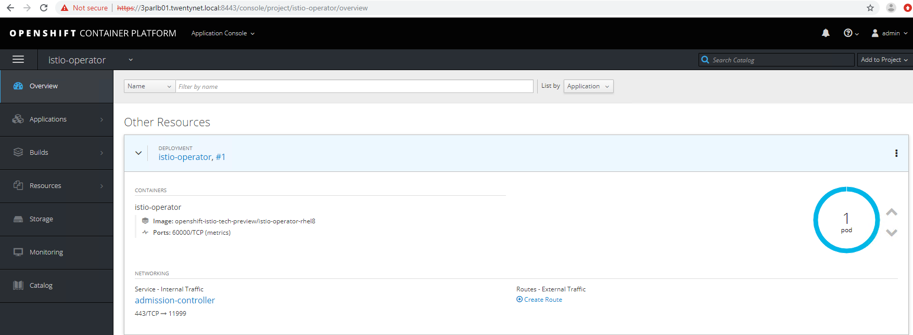

**Figure 48.** Istio Operator viewed from the OpenShift web console

### Creating a custom resource definition

To deploy the service mesh control plane, the user must deploy a custom
resource. A custom resource enables the introduction of custom APIs into
a Kubernetes project or cluster. Create a custom resource yaml file to
define the project parameters and the object. This example custom
resource yaml file contains all of the supported parameters and deploys
Red Hat OpenShift Service Mesh 0.12.TechPreview images based on Red Hat
Enterprise Linux (RHEL).

1) Execute the following command from the master node to change to the
istio-system namespace.

```

# oc project istio-system

```

2) Now using the project *"istio-system"* on the server
https://<openshift-master FQDN>, create a custom resource definition
file named *istio-installation.yaml*.

3) Execute the following command from the master node to deploy the control
plane.

```

# oc create -f istio-installation.yaml -n istio-system

```

4) Execute the following command from the master node to watch the progress
of the pods during the installation process. Figure 49 shows the status
of Istio installation.

```

# oc get pods -n istio-system -a

```

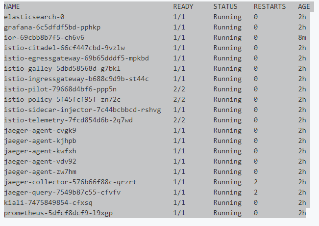

**Figure 49.** Status of Istio installation.

5) Log into the OpenShift web console through the URL
https://<openshift-master FQDN>:8443 to check the pods. Figure 50
shows the Istio pods and their status.

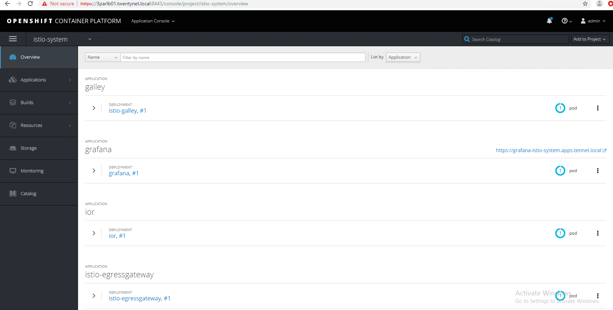

**Figure 50.** OpenShift web console showing Istio pods and their status

Deploying an application
------------------------

### Applying the master-config patch

It is necessary to apply the following patch to the master(s) on the
master configuration file */etc/origin/master/master-config.yaml* *to
enable* *MutatingAdmissionWebhook* and *ValidatingAdmissionWebhook*.

The following steps need to be performed in order to apply the patch.

1) Create a directory for Istio as follows.

```

# mkdir <istio directory name>

# cd <istio directory name>

```

2) Execute the following commands from within the Istio directory
created in step 1.

```

# wget
<https://raw.githubusercontent.com/Maistra/openshift-ansible/maistra-0.4/istio/master-config.patch>

```

3) Execute the following command to copy the *master-config.yml* file to
*master-config.yaml.prepatch* which was created during step 2.

```

# cp -p /etc/origin/master/master-config.yaml
/etc/origin/master/master-config.yaml.prepatch

```

4) Execute the following command to apply the patch for services and
copying to *master-config.yaml*

```

# oc ex config patch /etc/origin/master/master-config.yaml.prepatch -p
"$(cat ./master-config.patch)" >
/etc/origin/master/master-config.yaml

```

**NOTE**

If you have multiple master nodes, repeat this on each master node.

5) Execute the following command and verify the patch on the master
node. The master-config file should show the webhooks as shown below.

```

# cat /etc/origin/master/master-config.yaml

admissionConfig:

pluginConfig:

....

....

MutatingAdmissionWebhook:

configuration:

apiVersion: apiserver.config.k8s.io/v1alpha1

kind: WebhookAdmission

kubeConfigFile: /dev/null

ValidatingAdmissionWebhook:

configuration:

apiVersion: apiserver.config.k8s.io/v1alpha1

kind: WebhookAdmission

kubeConfigFile: /dev/null

```

6) Restart the master(s) by executing the following command.

```

# /usr/local/bin/master-restart api

# /usr/local/bin/master-restart controllers

```

### Installing the bookinfo application

1) Execute the following command from the master node to create a
project named *bookinfo* for the bookinfo application.

```

# oc new-project bookinfo

```

2) Update the Security Context Constraints (SCC) by adding the service
account used by bookinfo to the anyuid and privileged SCCs in the
"bookinfo" namespace. Execute following commands in the master node to
update the services.

```

# oc adm policy add-scc-to-user anyuid -z default -n bookinfo

# oc adm policy add-scc-to-user privileged -z default -n bookinfo

```

3) Deploy the bookinfo application in the "bookinfo" namespace by
applying the *bookinfo.yml* file. Create a file *bookinfo.yml* with the
below content. Execute the following command from the master node to
deploy the bookinfo application.

```

# oc create --f bookinfo.yml

```

4) To validate the installation, log into the OpenShift web console with
the URL https://<openshift-master FQDN>:8443 as shown in Figure 51.

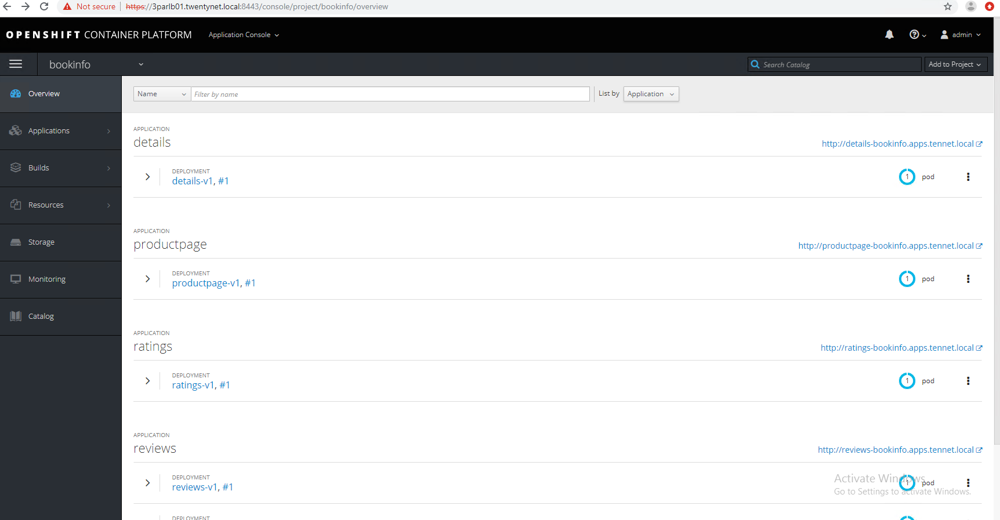

**Figure 51.** Bookinfo installation status within OpenShift web
console.

### Create the routes for the bookinfo application

Create DNS entries in the DNS server with **infrastructure IP address**
for any add-on services utilized in the solution such as Grafana, Kiali,
Prometheus etc. Sample DNS entries are shown in Figure 52.

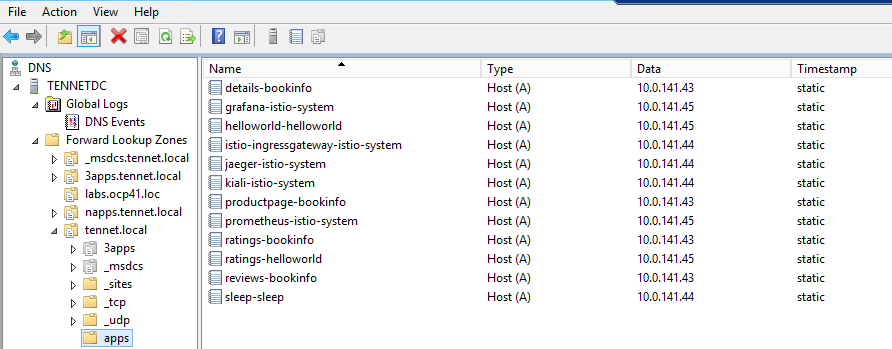

**Figure 52.** Sample DNS entries for the applications

### Services provided by service mesh

Once the applications are added into the DNS server the application can
be accessed through the OpenShift route. The access services provided by
the service mesh is as follows.

1) Login to OpenShift web console.

2) Select the application present within **My Project**.

3) To access the routes, click the application URL. Sample routes for
the bookinfo application are shown in Figure 53.

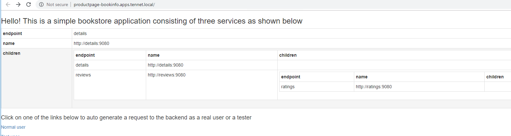

**Figure 53.** routes in the Istio-system project

Figure 54 shows accessing the Kiali homepage within the OpenShift
web console.

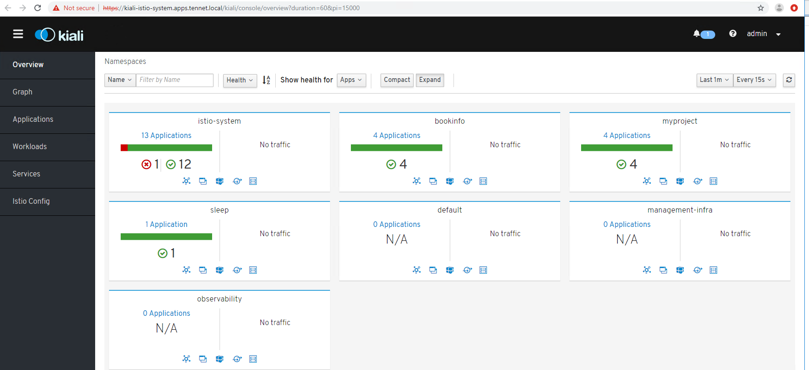

**Figure 54.** Accessing Kiali homepage within OpenShift web console
using service mesh

Grafana allows the user to query, visualize, alert on, and understand
the metrics, no matter where they are stored. Figure 55 shows accessing
the Grafana homepage within the OpenShift web console using service
mesh.


**Figure 55.** Accessing Grafana homepage within OpenShift web console
using service mesh

Figure 56 shows accessing Prometheus homepage within OpenShift web
console using service mesh.

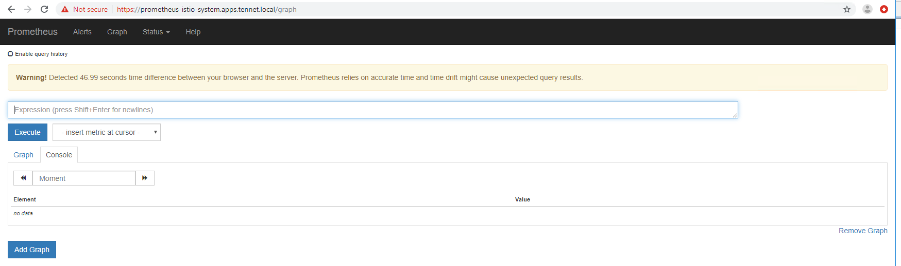

**Figure 56.** Accessing Prometheus homepage within OpenShift web
console using service mesh

# Physical worker node labelling in OpenShift

Kubernetes allows worker nodes to be labelled with the capabilities of
the underlying host. This labelling facilitates enhanced scheduling
capabilities. For example, a node with GPU capabilities that is labelled
would be used to schedule GPU dependent applications, while nodes
without the label could be ignored. Hewlett Packard Enterprise has
created examples of how to utilize the HPE Proliantutils project to
perform node labelling in an automated fashion.

To label the physical worker nodes use the repository located at the HPE
OpenShift Solutions GitHub at,
<https://github.com/hewlettpackard/hpe-solutions-openshift> . This
repository contains Ansible plays and scripts to automate installation.

## About the repository

-   **playbooks:** This folder contains the playbook required for
    getting the physical worker node properties and label the node with
    those properties in OpenShift Container Platform 3.11.
-   **roles:** This folder contains two roles listed below:

-- *get-phy-worker-props* - this will get physical worker node
hardware properties.

-- *node-labels-physical-worker* - this will label the physical
worker node using the discovered hardware properties.

-   **hosts** : This is the host file which will be used by the Ansible
    Engine to reference hosts during the node labelling process. The
    installer should update this file with their OpenShift Container
    Platform 3.11 environment details.
-   **site.yaml:** This file imports the playbooks
    "*get-node-properties.yaml*" and "*node labels.yaml*" that
    control the workflow for node labelling. The installer should update
    the "*secrets.yml*" file with required information about the
    infrastructure.

## Prerequisites

In order to successfully perform physical worker node labelling on the
OpenShift Container Platform nodes ensure that the following
prerequisites are met.

1) Red Hat OpenShift Container Platform 3.11 is up and running.

2) All nodes in the Red Hat OpenShift Container Platform 3.11 deployment
are running RHEL 7.6.

3) There is a common username and password across all the iLOs
associated with the physical worker nodes.

4) The Python module named "*ansible*" should be installed on an
Ansible Engine using the following command.

```

# pip install ansible

```

5) Check the version of Python module named "*ansible*" using the
following command.

```

# pip freeze | grep ansible

```

6) Output of this command should give the Python module named "
*ansible*" version.

```

# ansible==2.8.5

```

7) The installer should install the Python module named *proliantutils*
on an Ansible Engine using the following command.

```

# pip install proliantutils

```

8) Then check the version of Python module named *proliantutils* using
the following command.

```

# pip freeze | grep proliantutils

```

9) Output of this command should give the Python module named
*proliantutils* version.

```

# proliantutils==2.9.1

```

### How to use playbooks

Follow these steps to utilize the playbooks:

1) From the Ansible Engine command prompt, browse to the following
directory.

```

# cd
/etc/ansible/hpe-solutions-openshift/synergy/scalable/3par-fc/iscsi/node-labelling

```

2) Update the file named *"hosts"*, which is the inventory file with all
the required information based on your OpenShift setup.

```

# Provide iLO IPs of all the physical worker node that you want to
label within OCP 3.11

[phy-workers-iloip]

10.0.x.x

# Provide the fully qualified domain name of all the physical worker
nodes that you want to label

[phy-worker-fqdn]

Offline-worker01.twentynet.local

# Provide the fully qualified domain name of the master node within
your OpenShift 3.11 set-up

[master]

offline-m01.twentynet.local ansible_user=root
ansible_ssh_pass=Password!234

```

3) Now update the file named "*secret.yml*", which is the vault file,
with all the required information based on your OpenShift
implementation. Open the *secret.yml* using following command:

```

ansible-vault edit secret.yml

```

4) As mentioned in the prerequisites, the installer should set a common
username and password for all iLOs on the physical worker nodes that
need to be labelled. Update only the following fields in the
*secret.yml* file.

```

# physical worker iLO credentials

ilo_username: username

ilo_password: password

```

5) Run the playbook using the following command:

```

ansible-playbook -i hosts site.yml -e@secret.yml

```

6) To validate the success of the play, log into one of the master nodes
using ssh and type the command listed below to get the label of the
physical node.

```

oc get node physicalworker_fully_qualified_domain_name
--show-labels

```

The output of the command should show you the label of the physical
worker node.

```

NAME STATUS ROLES AGE VERSION LABELS

physicalworker_FQDN Ready compute 1d v1.11.0+d4cacc0
beta.kubernetes.io/arch=amd64,beta.kubernetes.io/os=linux,boot_mode_uefi=true,cpu_vt=true,kubernetes.io/hostname=offline-worker01.twentynet.local,node-role.kubernetes.io/compute=true,pci_gpu_devices=1

```

# Data protection for Red Hat OpenShift

Containers have dramatically increased in popularity as organizations
recognize the benefits with respect to both time and resource
efficiency. Applying traditional data protection strategies to
containerized applications will not work. The goals of this solution
with regards to data protection are to:

- Highlight the importance of protecting each component within an
OpenShift cluster including persistent volumes in order to restore in
case of corruption or system failures.

- Demonstrate HPE's approach to persistent volume backup using HPE
Recovery Manager Central (RMC) software with the HPE 3PAR StoreServ
snapshot feature and HPE StoreOnce.

HPE StoreOnce is used as a backup target for backing up OpenShift
Container Platform components including persistent volumes. For the
backup of the configuration files, create an HPE StoreOnce NAS share and
export it to the OpenShift nodes. Optionally, for high availability, the
NAS share can be replicated to a remote HPE StoreOnce.

At a high level, persistent volume protection is accomplished by using
RMC to initiate a crash consistent snapshot at the volume level. Using
the RMC express protect feature, the snapshot is then moved to the HPE
StoreOnce catalyst store. As it is moved to a backup appliance, data can
be stored for archival purposes as well. In this scenario, there is no
external data mover involved, so either HPE StoreOnce or RMC acts as the
data mover. This reduces the cost and complexity of the solution. HPE
3PAR StoreServ Storage also supports replication of the volume to a
remote array which can be used to reduce the RPO/RTO requirements.
RPO/RTO can be further reduced with peer persistent (active/active)
replication.

**NOTE**

The information in this section is taken from
<https://docs.openshift.com/container-platform/3.11/day_two_guide/environment_backup.html>
. Refer to this webpage for the latest version of the OpenShift
documentation and for any updates to this procedure.

## OpenShift Container Platform components

This section disseminates the components that need to be protected or
backed up within a Red Hat OpenShift Container Platform cluster. Hewlett
Packard Enterprise plans to update this section with new information
over time.

A backup should be taken before any upgrade or modifications. It is
recommended to perform periodic backup to make sure you have the most
recent configuration available in the event of a failure. An OpenShift
Container Platform backup involves taking backup of current state to
external storage at the cluster level. This means creating individual
backups of the master, worker, infrastructure node components, etcd data
base and configurations, and persistent storage.

In Red Hat OpenShift Container Platform, all of the components are
treated as objects and are stored in files. This means that creating a
configuration backup is equivalent to taking file level backups.

### Master node

The master node is responsible for maintaining the desired state of a
cluster. It is recommended to perform a master node backup before you
make any modifications to the OpenShift Container Platform
infrastructure. In high availability environments, make sure to perform
the backup on all master nodes.

### etcd

When you backup etcd, you need to take a backup of the configuration and
data.

etcd configurations are stored in the */etc/etcd* directory on hosts
where etcd instances are running. Unlike other configurations, etcd
configurations are unique across etcd instances. etcd data can be backed
up using the etcd snapshot save command.

### Worker node

The nature of worker nodes are that any specific configuration
pertaining to running pods are replicated over the nodes in case of a
failover. They typically do not contain data that is necessary to run an
environment. In an HPE 3PAR StoreServ Storage OpenShift Container
Platform deployment where storage is connected over Fibre Channel, the
worker node is responsible for hosting the registry pods. These pods are
deployed with a volume from the HPE 3PAR StoreServ Storage volume. Apart
from running pods, worker nodes contain certificates, which are
generated during installation, services, authorization files and more.

### Infrastructure node

The infrastructure node is responsible for hosting the router pods.
These pods are replicated over other nodes in case of a failover. They
typically do not contain data that is necessary to run the environment.

Registry certificates must be backed up from all the infra nodes.

### Persistent storage

Containers were designed to run stateless applications. So in the early
days of containers, there was no need for persistent storage. But then
the enterprises started adopting containers at scale and the demand to
run stateful applications within the containers increased. Once
persistent data is present, a need is created for persistent storage.
Backing up and protecting this data becomes very important.

For persistent volume level backups, traditional agent-based backup
software won't work natively with a container orchestrator such as
Kubernetes. Backup schemes need to be consumed as a data protection
service from the underlying container-aware storage such as HPE 3PAR
StoreServ Storage. Using HPE RMC Express Protect Backup, a
crash-consistent snapshot-based persistent volume backup can be taken
directly to HPE StoreOnce.

Using the HPE 3PAR Docker Storage plugin feature, you can create
replicated volumes. The HPE 3PAR StoreServ Storage plugin extends
Docker's volume to create command interface via optional parameters in
order to make it possible. The HPE 3PAR StoreServ Storage plugin assumes
that an already working 3PAR Remote Copy setup is present. The plugin
has to be configured with the details of this setup.

# Backup OpenShift node components

To protect the OpenShift nodes, it is recommended to take a backup of
any important configuration files to HPE StoreOnce Storage. Before
backing up the configuration, create a NAS share dedicated as backup
target, as explained in the following steps.

1) Log into the HPE StoreOnce Administration web GUI and navigate to
**Data Services > NAS Shares** and then select Create Share as in
Figure 57.

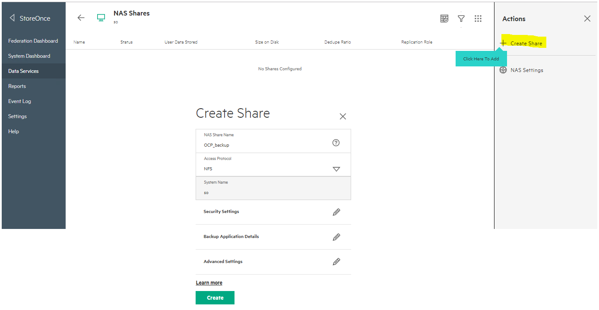

**Figure 57.** Creating a new NAS share in HPE StoreOnce

2) Create a name for the share and then select the access protocol by
selecting **NFS**. Select the application details (if any) and then
select the data type as **file**. Click **Create** to finalize.

3) To mount the NAS share, provide **access** to the servers as in
Figure 58.

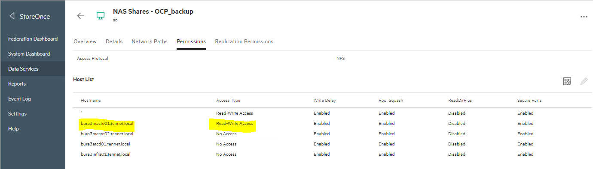

**Figure 58.** HPE StoreOnce NAS share access details

4) Mount the NAS share on any server on the network. For demonstrating
we have mounted it on the master node with the following command.


```
# mount 10.0.20.xx:/nas/OCP_backup /StoreOnce_vol
```


## Master node backup

To create a backup of the important configuration files on the master
node, run the following commands using the mount point created above.

```

# MYBACKUPDIR=/backup/$(hostname)/$(date +%Y%m%d)

# mkdir -p ${MYBACKUPDIR}/etc/sysconfig

# cp -r /etc/origin ${MYBACKUPDIR}/etc

# cp -r /etc/sysconfig/ ${MYBACKUPDIR}/etc/sysconfig/

# cp -r /etc/sysconfig/{iptables,docker-*}
${MYBACKUPDIR}/etc/sysconfig/

# cp -r /etc/dnsmasq* /etc/cni ${MYBACKUPDIR}/etc/

# rpm -qa | sort | sudo tee $MYBACKUPDIR/packages.txt

# cp -r /etc/docker/certs.d/
${MYBACKUPDIR}/docker-registry-certs-$(hostname)

# tar -zcvf /backup/$(hostname)-$(date +%Y%m%d).tar.gz $MYBACKUPDIR

```

## etcd backup

The etcd backup process is comprised of two different procedures. The
two procedures are:

- etcd configuration backup including the required etcd configuration
and certificates.

-   etcd data backup.

### etcd configuration backup

The etcd configuration files to be preserved are all stored in the
*/etc/etcd* directory of the instances where etcd is running. This
includes the etcd configuration file *(/etc/etcd/etcd.conf*) and the
required certificates for cluster communication. Take a backup of the
configurations from all etcd members of the cluster, by running the
following commands.

```

# mkdir -p ${MYBACKUPDIR}/etcd-config

# cp -R /etc/etcd/ ${MYBACKUPDIR}/etcd-config

```

### etcd data backup

1) Before taking a backup, ensure that the OpenShift Container Platform
API service is running, connectivity with the etcd cluster (port
2379/tcp) is working, and proper certificates are available to connect
to the etcd cluster. To cross-check the above services, run the
following command, using etcd API version V3.

```

# etcdctl2 cluster-health

# etcdctl3 member list

# etcdctl3 endpoint health

```

2) Using the etcd v3 API, take a snapshot from a live member with the
etcdctl3 snapshot command.

```

# mkdir -p ${MYBACKUPDIR}/etcd-data

# etcdctl3 snapshot save <etcd_snapshot1.db>

```

3) Create the backup by copying the etcd db directory using the
following command.

```

# cp -r /var/lib/etcd/ ${MYBACKUPDIR}/etcd-data

```

4) Create the tar file as follows.

```

# tar -zcvf /backup/$(hostname)-$(date +%Y%m%d).tar.gz $MYBACKUPDIR

```

5) Copy the tar file to the HPE StoreOnce NAS share mount point at the
master server by running the following command.

```
# scp --aR /backup/$(hostname)-$(date +%Y%m%d).tar.gz
<user>@<master>:/StoreOnce_vol 
```

## Worker node backup

To create a backup of the important configuration files on the worker
nodes run the following commands.

```

# MYBACKUPDIR=/backup/$(hostname)/$(date +%Y%m%d)

# sudo mkdir -p ${MYBACKUPDIR}/etc/sysconfig

# sudo cp -r /etc/origin ${MYBACKUPDIR}/etc

# sudo cp -r /etc/sysconfig/atomic-openshift-node
${MYBACKUPDIR}/etc/sysconfig/

# sudo mkdir -p ${MYBACKUPDIR}/etc/sysconfig

# sudo cp -r /etc/sysconfig/{iptables,docker-*} ${MYBACKUPDIR}/etc/sysconfig/

# sudo cp -r /etc/dnsmasq* /etc/cni ${MYBACKUPDIR}/etc/

# rpm -qa | sort | sudo tee $MYBACKUPDIR/packages.txt

# cp -r /etc/docker/certs.d/ ${MYBACKUPDIR}/docker-registry-certs-$(hostname)

# tar -zcvf /backup/$(hostname)-$(date +%Y%m%d).tar.gz $MYBACKUPDIR
```

Copy the tar file to the HPE StoreOnce NAS share mount point at the
master server with the following command.

```
# sudo scp --aR /backup/$(hostname)-$(date +%Y%m%d).tar.gz <user>@<master>:/StoreOnce_vol
```

## Infrastructure node backup

To create a backup of certificate files, copy it to the appropriate
mount point, run the following commands.

```
# MYBACKUPDIR=/backup/$(hostname)/$(date +%Y%m%d)

# mkdir -p ${MYBACKUPDIR}/etc/docker

# cp -R /etc/docker/certs.d ${MYBACKUPDIR}/etc/docker/certs-$(date +%Y%m%d)

# tar -zcvf /backup/$(hostname)-$(date +%Y%m%d).tar.gz $MYBACKUPDIR

```

Copy the tar file to the HPE StoreOnce NAS share mount point at the
master server using the following command.


```
# scp --aR /backup/$(hostname)-$(date +%Y%m%d).tar.gz <user>@<master>:/StoreOnce_vol
```

## Ansible playbook for backup

Use the following Ansible play to take backups of master, worker, and
infrastructure nodes and move the data to the HPE StoreOnce NAS share.
To retrieve and run the play, use the following commands.

```
# cd /etc/ansible/hpe-solutions-openshift/synergy/scalable/3par-vsphere/fc/bura

# ansible-playbook -i hosts site.yaml
```

## Persistent storage

When utilizing the native storage capability to take crash consistent
snapshots of a persistent volume, that volume can be restored to a point
in time snapshot, in case the PV is corrupted. This solution makes use
of HPE RMC and HPE 3PAR StoreServ Storage's snapshot capability to take
crash consistent snapshots of persistent volumes. These volumes can be
restored to a point in time, either from the array snapshot or from the
HPE RMC express protect backup available on the HPE StoreOnce in the
event that the PV is corrupted. Even if the persistent volume is deleted
at the container level, the volume will still be available to restore
from HPE RMC.

# HPE 3PAR StoreServ Volume Express Protection

Array-based snapshots and replication provide fast, non-disruptive
point-in-time copies of your data. But snapshots alone cannot deliver
comprehensive backup as they have retention limitations and a dependency
on the underlying storage system. The snapshots will be lost if the
storage system fails.

The HPE RMC Express Protect feature allows you to back up snapshots
directly from HPE 3PAR StoreServ Storage to HPE StoreOnce. In this case,
either the HPE RMC appliance or the HPE StoreOnce itself will act as a
data mover, reducing the cost and complexity of the architecture.

HPE RMC leverages the snapshot differential technology in HPE 3PAR
StoreServ Storage ensuring that only changed blocks are sent to the
StoreOnce backup system. This reduces both network traffic and storage
usage which lowers costs. Every backup completes at the speed of an
incremental data transfer but is stored as a synthetic full backup. This
makes application recovery faster and more efficient.

Configuring an express protection for a persistent volume created using
HPE StoreServ array using HPE RMC and HPE StoreOnce is explained in the
subsequent sections.

## RMC Express Protect

Before you configure express protect backup in RMC, you need to add the
HPE 3PAR StoreServ Storage and HPE StoreOnce to RMC. Make sure to have
proper zoning configured on the SAN switch between the HPE 3PAR
StoreServ Storage and the data mover to mount the volumes. In this case,
the data mover can either be HPE RMC or HPE StoreOnce.

1) Log into the **RMC portal and n**avigate to the **Recovery Manager
Central** drop-down.

2) On the Configure tab, select **Storage Devices**. A list of available
storage devices appears as in Figure 59.

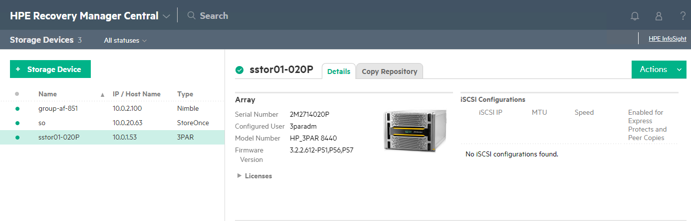

**Figure 59.** HPE Recovery Manager Central - storage devices window

3) Click **Storage Device** and add **3PAR** **and** **StoreOnce** as in
Figure 60.


**Figure 60.** Adding storage devices in HPE Recovery Manager Central

4) Navigate to the **Recovery Manager Central** drop-down.

5) On the Protect tab, select **Volumes.**

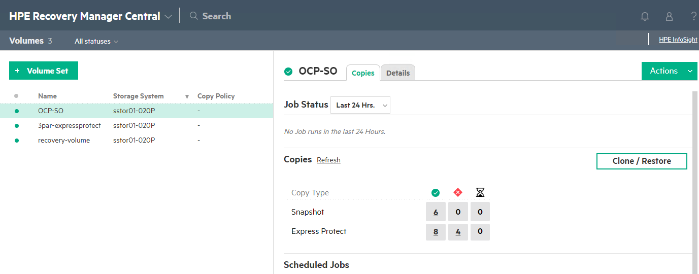

**Figure 61.** HPE Recovery Manager Central - volume set window

6) Click **Volume Set.** A new window to create a volume set appears.


**Figure 62.** HPE Recovery Manager Central - volume set creation screen

7) Provide the details of the volume set, select the storage system, and
then select the volumes. **Click** **Add** to create a volume set as in
Figure 63. Before protecting the volume set, add the copy policies under
the HPE Recovery Manager Central drop-down and select the appropriate
Snapshot and Express Protect schedules and HPE StoreOnce repository.
Create the copy policy based on the business SLA requirement.


**Figure 63.** HPE Recovery Manager Central - creating copy policy

8) Select the **volume set** and from the**Actions** drop-down list,
select **Add Protection** as in Figure 64.

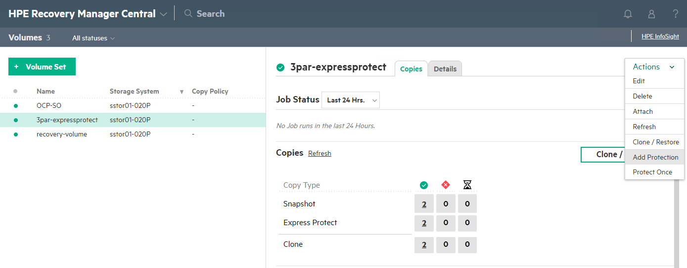

**Figure 64.** HPE Recovery Manager Central - adding protection

9) From the **Add Protection** window, select the previously created
copy policy and click **Select** as in Figure 65.

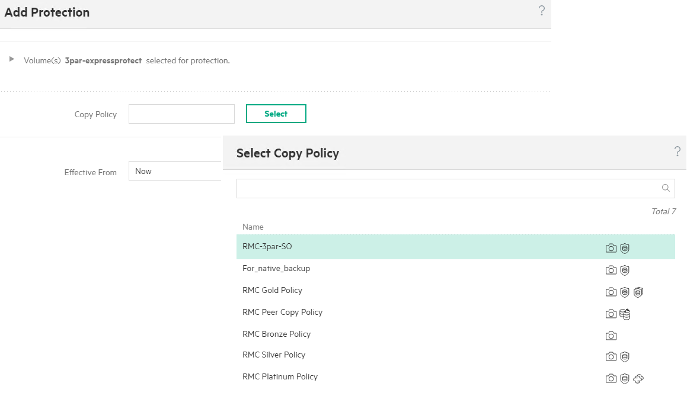

**Figure 65.** HPE Recovery Manager Central - selecting copy policy

10) Select the **Protect Once** option for the created volume set. From
the *Protection Type* drop-down list, select **Express Protect** as in
Figure 66.

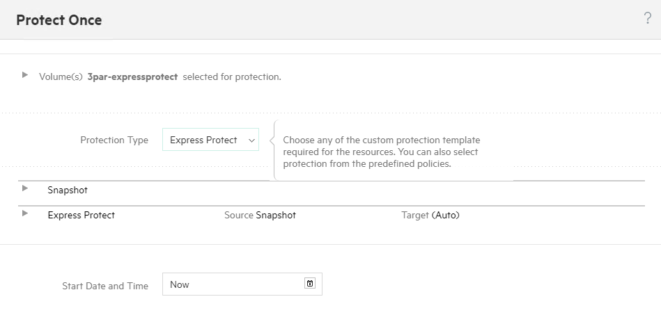

**Figure 66.** HPE Recovery Manager Central - protecting the volume set

11) View the progress/status on the Activities tab under the HPE
Recovery Manger Central drop-down as in Figure 67.

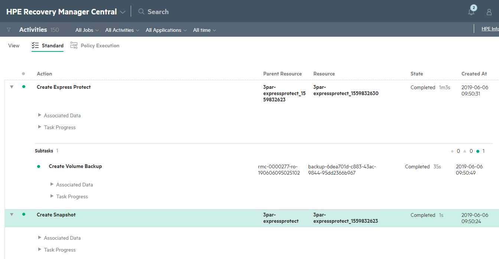

**Figure 67.** HPE Recovery Manager Central activities window

12) The backup & restore report from HPE StoreOnce Management GUI can be
accessed by navigating to *Reports* on the home page. Figure 68 shows
the backup/restore reports

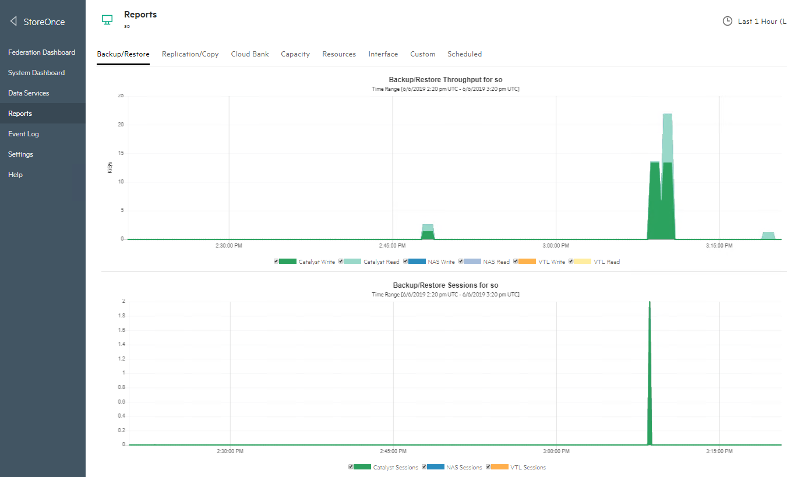

**Figure 68.** HPE StoreOnce backup/restore reports tab

# Restoring OpenShift Container Platform components from a backup

It is important to restore the OpenShift Container Platform components
in case of a system failure or corruption and to ensure the nodes are in
a previous working state.

## Master node

Restore means recreating the components from the point in time the
backup is available. In the case where a master host is corrupted or
failed due to system error, reinstall the master host, copy the
important configuration files, and then restart the OpenShift Container
Platform services.

If you are restoring to a master which is behind a highly available load
balancer pool, restarting the OpenShift Container Platform service may
cause downtime. Make sure you remove the master from the pool, restart
the service, and then add it back to the load balancer pool.

If you are recreating a master after the system failure, apply the
backup, reboot, and then add the master to the cluster.

For restoring the master node or only restoring certain files, mount the
NAS backup share from the HPE StoreOnce to the node and copy the
required files to the desired location. When complete, restart the
services. An example appears below.

```

# mount <StoreOnce IP address>:/nas/OCP_backup /StoreOnce_vol

# tar -xvf /StoreOnce_vol/$(hostname)-$(date +%Y%m%d).tar.bz2

# cp /StoreOnce_vol/$(hostname)/$(date
+%Y%m%d)/origin/master/master-config.yaml
/etc/origin/master/master-config.yaml

# systemctl restart atomic-openshift-master-api

# systemctl restart atomic-openshift-master-controllers

```

**NOTE**

Restart the server for replacing the IP tables, if required.

etcd
----

If the etcd configuration is corrupted or lost, restore the file from
the backup and restart the service.

If the etcd data is corrupted and you want to restore from the snapshot,
this can be performed on a single etcd node. After that, add the rest of
the etcd nodes to the cluster.

### etcd configuration

If an etcd host has become corrupted and the /etc/etcd/etcd.conf file is
lost, restore it using:

```

# cp /StoreOnce_vol/backup/$(hostname)/$(date
+%Y%m%d)/etcd-config/etcd.conf /etc/etcd/etcd.conf

# restorecon -Rv /etc/etcd/etcd.conf

```

### Restore etcd data

1) Stop all etcd services by removing the etcd pod definition and
rebooting the host.

```

# mkdir -p /etc/origin/node/pods-stopped

# mv /etc/origin/node/pods/* /etc/origin/node/pods-stopped/

# reboot

```

2) To ensure the proper backup is restored, delete the etcd directories.

```

# mv /var/lib/etcd /var/lib/etcd.old

# mkdir /var/lib/etcd

# restorecon -Rv /var/lib/etcd/

```

3) Restore a healthy backup data file to each of the etcd nodes. Perform
this step on all etcd hosts. To restore etcd v3 data, perform the
following commands.

```

# cp -R /StoreOnce_vol/backup/$(hostname)/$(date
+%Y%m%d)/etcd-data/* /var/lib/etcd/

# mv /var/lib/etcd/db /var/lib/etcd/member/snap/db

# chcon -R --reference /StoreOnce_vol/backup/$(hostname)/$(date
+%Y%m%d)/etcd-data/* /var/lib/etcd/

```

4) Run the etcd service on each host, forcing a new cluster.

```

# mkdir -p /etc/systemd/system/etcd.service.d/

# echo "[Service]" > /etc/systemd/system/etcd.service.d/temp.conf

# echo "ExecStart=" >> /etc/systemd/system/etcd.service.d/temp.conf

# sed -n '/ExecStart/s/"$/ --force-new-cluster"/p'
/usr/lib/systemd/system/etcd.service \\ >>
/etc/systemd/system/etcd.service.d/temp.conf

# systemctl daemon-reload

# master-restart etcd

```

5) Check the cluster health status.

``` # etcdctl2 cluster-health ```

6) Restart the etcd service in cluster mode by running the following
commands.

```

# rm -f /etc/systemd/system/etcd.service.d/temp.conf

# systemctl daemon-reload

# master-restart etcd

```

7) Check for health status and the member list.

```

# etcdctl2 cluster-health

# etcdctl2 member list

```

## Worker node

In case a worker node host is corrupted or failed due to a system error,
reinstall the worker node the way you did initially, copy the important
configuration files, and then restart the OpenShift Container Platform
services.

If you are recreating a worker node after the system failure, apply the
backup, reboot, and then add the worker to the cluster.

For restoring the worker node or only restoring certain files, mount the
NAS backup share from HPE StoreOnce to the node and copy the files to
the desired location and restart the service:

```

# mount <StoreOnce IP address>:/nas/OCP_backup /StoreOnce_vol

# tar xvjf /StoreOnce_vol/$(hostname)-$(date +%Y%m%d).tar.bz2

# cp /StoreOnce_vol/$(hostname)/$(date
+%Y%m%d)/etc/origin/node/node-config.yaml
/etc/origin/node/node-config.yaml

# systemctl restart atomic-openshift-node

```

**NOTE**

If you are restoring files to a running worker node, restarting services
may cause downtime.

## Persistent volumes

When utilizing the native storage capability to take crash consistent
snapshots of a persistent volume, that volume can be restored from a
point in time snapshot in case the PV is corrupted. This solution makes
use of RMC and HPE 3PAR StoreServ Storage snapshot capability to take
crash consistent snapshots of persistent volumes. These volumes can be
restored to a point in time either from the array snapshot or from the
express protect backup available on the HPE StoreOnce in the event that
the PV is corrupted. Even if the persistent volume is deleted at the
container level, the volume will still be available to restore from RMC.

**NOTE**

Prior to proceeding with restoring, ensure that the replica set count is
set to zero, for the pods using persistent volumes.

To restore the persistent volume (PV) to a point in time, perform the
following steps.

1) Log into the **Recovery Manager Central** (RMC) portal.

2) Navigate to the **Recovery Manager Central** drop-down list, and
**select** **Volumes > Volume Set > Clone / Restore** as in Figure 69.

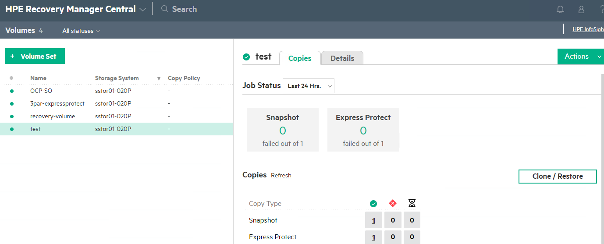

**Figure 69.** HPE RMC clone/restore option for the volume set

3) Once you select the *Clone/Restore* option, a window is displayed.
Select **Restore**. Before you proceed with this step, make sure the
replica count is set to zero using the deployment API object in the
OpenShift console.

**NOTE**

Setting the replica count to zero for the pods causes downtime for the
application.

4) At the OpenShift console, navigate to **Project****,** select
**Deployment Configuration**, select the down arrow on the right side to
scale down the replica count, and accept the scale down confirmation as
in Figure 70.

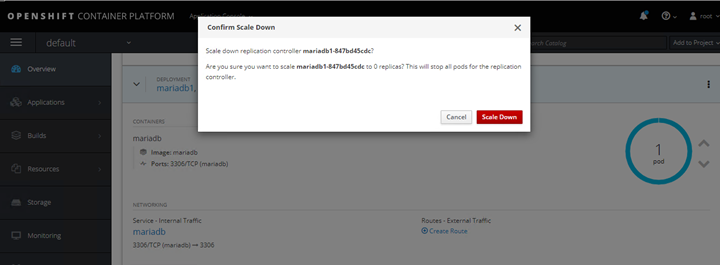

**Figure 70.** Red Hat OpenShift Container Platform console scaling down
the replica set to zero

5) Optionally, run the following command to scale down the replica set.

```

# kubectl scale --replicas=0 -f deployment.yaml

```

6) Proceed with the *Restore* from the RMC GUI using the console as in
Figure 71.


**Figure 71.** HPE RMC clone/restore option for the volume set

7) Select the date/time and the backup either from snapshot or from the
express protect backup and click **Next** as in Figure 72.


**Figure 72.** HPE RMC Restore available copies with selected date

8) Select the **volume** to be restored and click **Restore** as in
Figure 73.


**Figure 73.** HPE RMC clone/restore option for the volume set

This operation overwrites the data on the volume being restored. After
the restore is completed, change the replica count to your choice and
check the PV and the data.

# HPE 3PAR StoreServ Storage replication

## Supported storage replication method using HPE FlexVolume plugin

The HPE 3PAR FlexVolume plugin for Docker supports two storage
replication methods. The two methods are:

-   Active/Passive replication
-   Peer Persistence replication

Both methods require setting up HPE 3PAR remote copy before configuring
replication between arrays.

## Setting up HPE 3PAR remote copy configurations over Fibre Channel

Figure 74 presents a high-level flow diagram for configuring HPE 3PAR
remote copy between two HPE 3PAR systems.

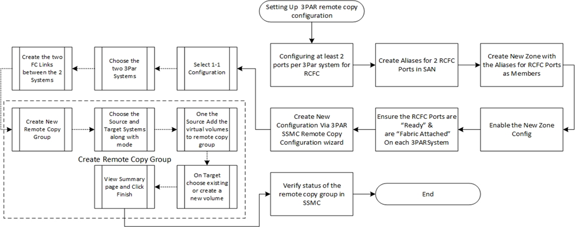

**Figure 74.** Setting up HPE 3PAR remote copy configurations over Fibre
Channel

Follow the steps below to complete the setup process.

1) The two ports on each HPE 3PAR system are cabled to the SAN switches
as shown in Figure 75.

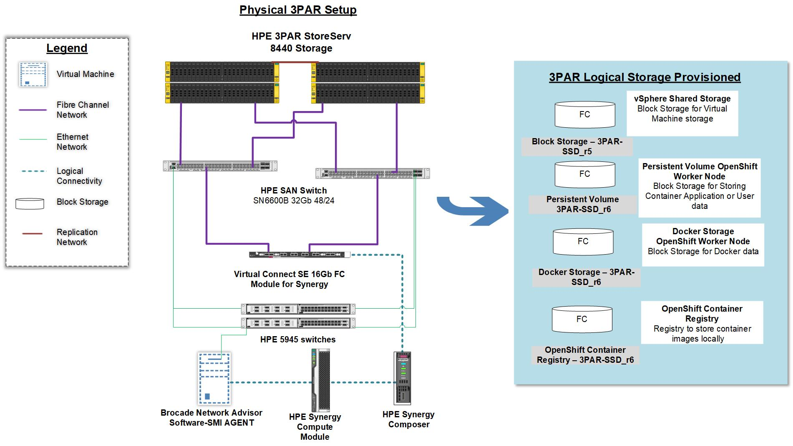

**Figure 75.** Logical layout of storage

2) From the HPE 3PAR Management Console SSMC, configure the ports for
RCFC.

3) Create appropriate aliases within the Fibre Channel switch by copying
the port WWNs from the HPE 3PAR RCFC ports.

4) Using the RCFC aliases on SAN, create an exclusive zone.

5) Enable the zones on the SAN switches and verify that the state of the
RCFC ports are as shown in Figure 76 below.

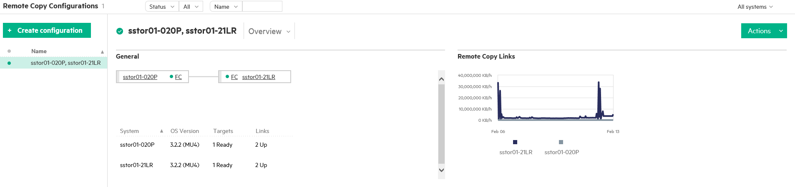

**Figure 76.** RCFC link state

For more information refer to, [*HPE 3PAR Remote Copy
Software*](https://h20628.www2.hp.com/km-ext/kmcsdirect/emr_na-c03618143-21.pdf)
- Setting up Remote Copy over Fibre Channel.

**NOTE**

Each pair of RCFC ports that support an RCFC link must exist in an
exclusive zone. Fabric zones cannot be shared.

If HPE 3PAR volume plug-in for Docker V2.1 is used for remote copy
process with OpenShift configuration, then use either SSMC or CLI on
target 3PAR replication system for manual creation of new volume for
container persistent volume remote copy.

To do this, follow these steps.

1) Setup and configure two (2) HPE 3PAR systems for remote copy using
either the HPE 3PAR CLI or SSMC. For more information refer to the [HPE
3PAR Remote Copy Software User
Guide](https://h20628.www2.hp.com/km-ext/kmcsdirect/emr_na-c03618143-21.pdf)
.

2) Once the Remote copy group has been successfully configured, you can
verify its status through SSMC as shown in Figure 77.

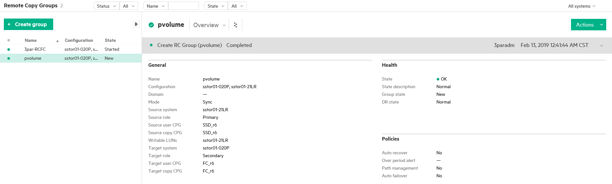

**Figure 77.** Remote copy group

### Active/Passive replication (Disruptive)

With Active/Passive replication, only one array is in active state
serving the VLUNs of a given replicated volume at any point in time.
With this scenario the remote copy group (RCG) is failed over manually
via the HPE 3PAR Command Line Interface (CLI) to the secondary array at
which point the secondary array becomes active. However, the VLUNs of
the failed over volumes are still not exported by the secondary array to
the host. In order to trigger that, the container/pod running on the
host needs to be restarted.

In order to use Active/Passive replication, the remote copy
configuration must be configured and run between the arrays.

Figure 78 showcases the HPE 3PAR StoreServ logical storage volumes that
are recommended for remote copy within the Red Hat OpenShift Platform on
HPE Synergy solution. The persistent volumes, for either all containers
or just for specific container storage, can be secured.

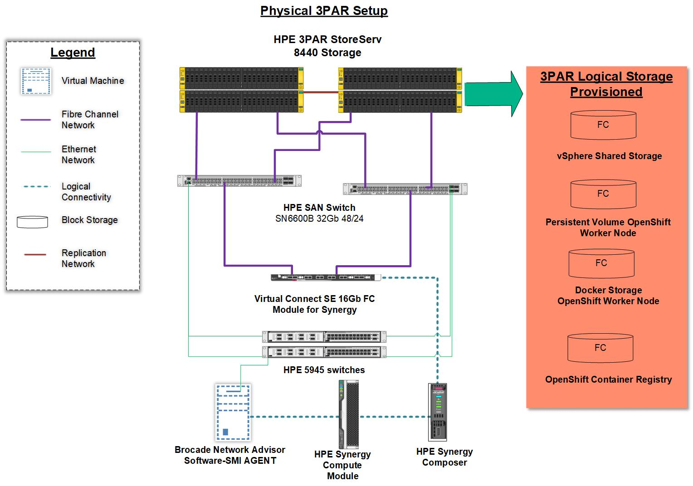
====
**Figure 78.** Logical layout of the solution stack

### Failover a remote copy group

Currently, there is no native OpenShift command to failover a replicated
volume, this must be done from within the HPE 3PAR CLI or StoreServ
Management Console (SSMC). Use the following steps to failover a volume
from the primary to secondary array using SSMC:

1) In SSMC select **Remote Copy Groups** as in Figure 79.


**Figure 79.** HPE 3PAR SSMC menu

2) Select the group that is to be stopped and then select **Stop** from
the *Actions* menu as in Figure 80

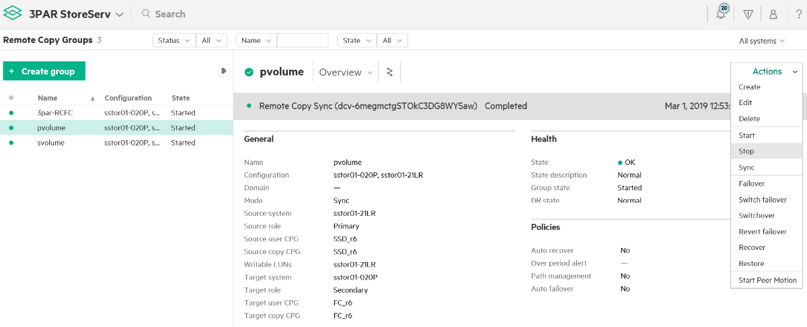

**Figure 80.** Stop remote copy group action

3) A new window opens showing the groups to be stopped. Click**Stop**
and then confirm by selecting **Yes, stop** as in Figure 81.

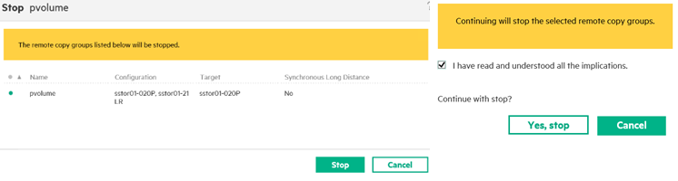

**Figure 81.** Stop remote copy group

4) Once the remote copy group has stopped, proceed with the failover by
selecting **Failover** from the Actions menu as in Figure 82.


**Figure 82.** Failover remote copy group

5) A new window opens with an alert as in Figure 83. Click **Failover**.

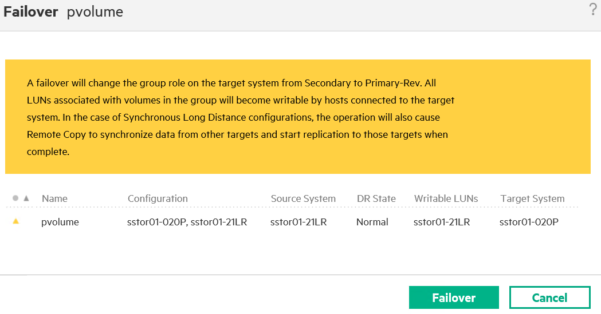

**Figure 83.** Failover remote copy group Info

6) Inspecting the relevant Docker volume will show output similar to
that shown in Figure 84.


**Figure 84.** Docker volume inspect

7) Within SSMC, recover the failed remote copy group volume by selecting
**Recover** from the Actions menu as in Figure 85.

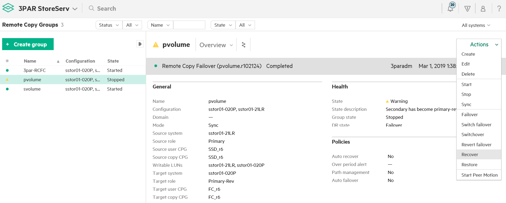

**Figure 85.** Recover remote copy group action

8) A new window opens with the details of the selected action. Select
**Recover** and then agree that you understand the implications before
selecting **Yes, recover** as shown in Figure 86.


**Figure 86.** Recover remote copy group info and confirmation

9) Ensure the remote copy group is started and inspect the relevant
Docker volume as in Figure 87 below.

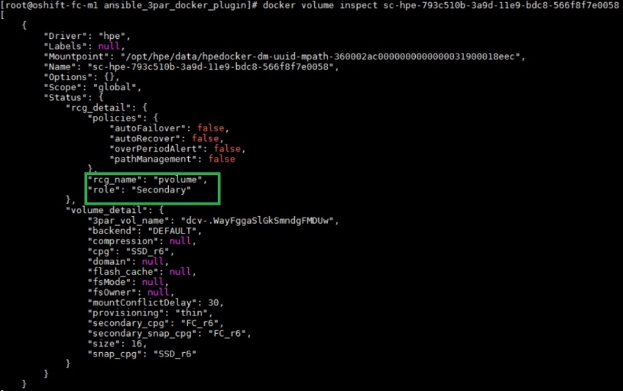

**Figure 87.** Docker volume inspect

10) Verify whether or not the volume is writeable as in Figure 88 below.

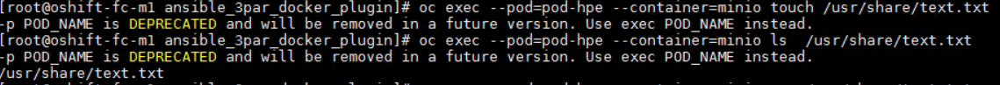

**Figure 88.** Verify that the volume is writeable

At this point, the volume has successfully failed over to the secondary
HPE 3PAR StoreServ Storage array.

### Failback workflow for Active/Passive based replication

Currently, there is no native OpenShift command to fail over a
replicated volume. This must be done from within the HPE 3PAR CLI or
SSMC. This document uses SSMC to fail back a volume from the secondary
array to the primary array.

1) In SSMC, select **Remote Copy Groups** as in Figure 89 below.

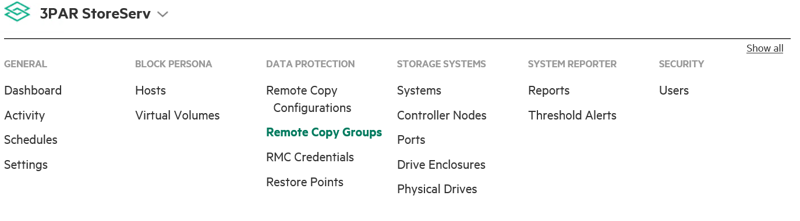

**Figure 89.** HPE 3PAR SSMC menu

2) From the *Actions* menu, select **Restore** as in Figure 90 below.

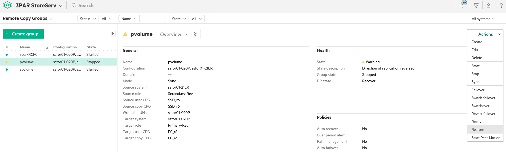

**Figure 90.** Selecting restore from the action menu

3) A new window opens with the details of the action. Select **Restore**
and then agree that you understand the implications and select **Yes,
restore** as in Figure 91.


**Figure 91.** Recover remote copy group info and confirmation

4) Ensure the remote copy group is started and inspect the relevant
Docker volume. The output should resemble as shown in Figure 92.

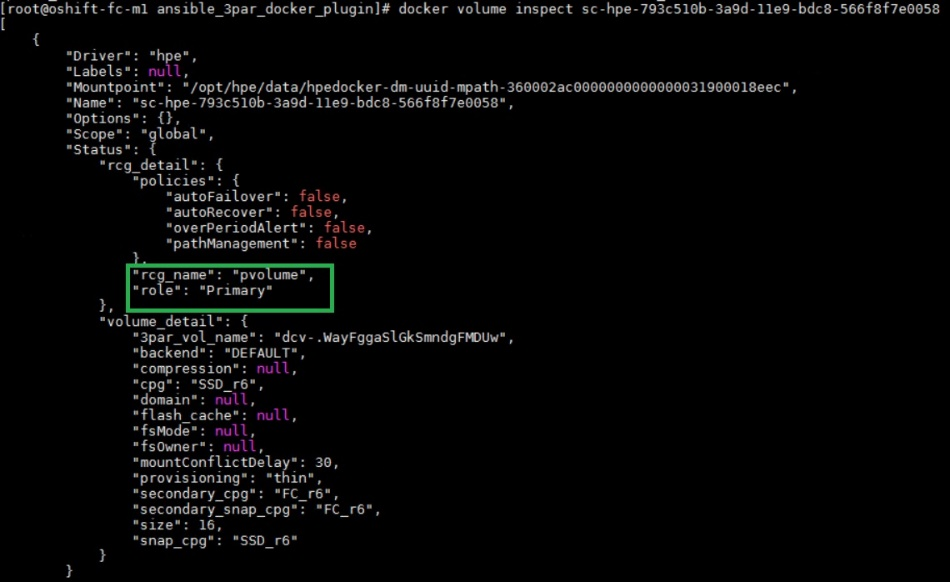

**Figure 92.** Verify persistent volume

The persistent volume has successfully failed back to the primary HPE
3PAR StoreServ Storage array.

### Configuring Active/Passive replication within the HPE 3PAR volume plugin for Docker

Refer to the following document to learn how to configure replication
using the HPE 3PAR volume plugin for Docker at,
<https://github.com/hpe-storage/python-hpedockerplugin/blob/master/docs/active-passive-based-replication.md>
.

### Peer Persistence Replication (Non-Disruptive)

HPE 3PAR Peer Persistence software enables HPE 3PAR systems located at
metropolitan distances to act as peers to each other. This presents a
nearly continuous storage system to the hosts that are connected to
them. This capability allows for the configuration of a
high-availability solution between two sites or data centers where
failover and failback remains completely transparent to the hosts and
applications running on those hosts. Compared to the traditional
failover models where the hosts must be restarted upon failover, the
Peer Persistence software allows hosts to remain online, serving their
business applications even when they switch from their original site to
the disaster recovery (DR) site. This results in an improved recovery
time compared to other methods. The Peer Persistence software achieves
this key enhancement by taking advantage of the Asymmetric Logical Unit
Access (ALUA) capability that allows paths to a SCSI device to be marked
as having different characteristics.

Using Peer Persistence, an OpenShift user mounts a replicated volume(s)
and then the HPE 3PAR Docker plugin creates VLUNs corresponding to the
replicated volume(s) on both of the arrays. However, the VLUN(s) is
served only by the active array with the other array being on standby
mode. When the corresponding RCG is switched over or the primary array
goes down, the secondary array takes over and makes the VLUN(s)
available. After switchover, the active array goes in standby mode while
the formerly secondary array becomes active. Figure 93 presents a
logical layout of Peer Persistence.

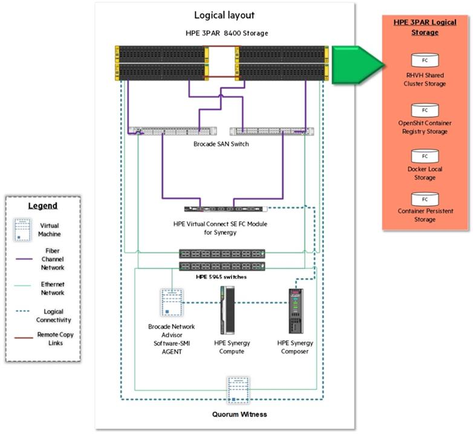

**Figure 93.** Peer Persistence logical layout

In order to use Peer Persistence replication, the following
prerequisites should be met.

- Remote copy is configured, up and running.

- A quorum witness is running with primary and secondary arrays
registered with it.

- A multipath daemon is running so that non-disruptive seamless mounting
of VLUN(s) on the host is possible.

#### Planned switchover workflow for Peer Persistence based replication

In the event of planned maintenance, a manual switchover can be
performed using the steps mentioned below. Currently, there is no native
OpenShift command to failover a replicated volume. Instead, this must be
done from within the HPE 3PAR CLI or SSMC.

The following steps use SSMC to switchover a volume from one array to
another:

1) From within SSMC, select **Remote Copy Groups** as in Figure 94.


**Figure 94.** HPE 3PAR SSMC menu

2) From the *Actions* menu, select **Switchover** as in Figure 95.


**Figure 95.** Selecting switchover from within the action Menu

3) A new window opens with the details of the action. Select
**Switchover** and then agree that you understand the implications and
select **Yes, switchover** as in Figure 96.


**Figure 96.** Switchover remote copy group information and confirmation

4) Ensure that the remote copy group is started and inspect the relevant
Docker volume. The output should appear similar to that shown in Figure
97.

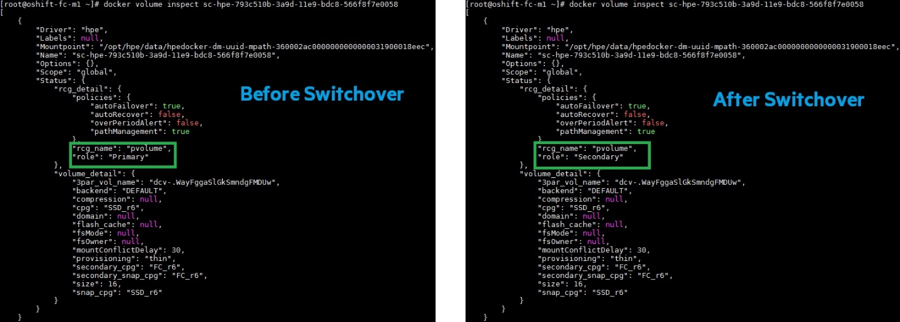

**Figure 97.** Docker volume inspect

5) Verify that the volume connected to the container is writeable as in
Figure 98.

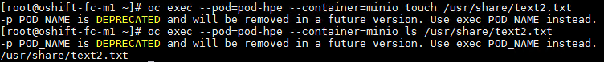

**Figure 98.** Verify persistent volume

### Configuring Peer Persistence (Non-Disruptive) replication within the HPE 3PAR volume plugin for Docker

Compared to Active/Passive configuration, the only discriminator with
Peer Persistence is the presence of a quorum_witness_ip sub-field
under replication_device field. Refer to the Peer Persistence based
replication document at,
<https://github.com/hpe-storage/python-hpedockerplugin/blob/master/docs/peer-persistence-based-replication.md>
in order to learn how to configure replication using the HPE 3PAR Volume
Plugin for Docker.

# Playbook variables

Table 12 describes the variables used with the DeployESXiHosts.

**Table 12.** Variables used in the Deploy ESXi hosts

| **Variable** | **Scope** | **Description** |
| ------------ | --------- | --------------- |
| config | OneView | Path to the config file with OneView and Image Streamer IP address and credentials. |
| Network Connections Name | | |
| deployment_network_name | | |
| management_network_name | | |
| SAN_A_network_name | | |
| SAN_B_network_name | | |
| datacenter_network_name | OneView | Names of the network connections utilized in the Server Profile |
| OneViewConfig.json | | |
| Ip | | |
| userName | | |
| password | | |
| image_streamer_ip | OneView | IP address and credentials of the OneView and the Image Streamer IP address |
| Network Details | | |
| dns_ip | | |
| gateway | | |
| subnet_mask | | |
| domain_name | OneView | Network Configuration details for the hosts |
| esxi_ip | OneView | IP address that needs to be assigned to the host |
| esxi_hostname | OneView | hostname that needs to be assigned to the host |
| enclosure_group_name | OneView | Name of the enclosure group where the server belongs to |
| deployment_plan_name | OneView | Name of the deployment plan which will be applied to the servers |
| server_hardware_name | OneView | Server Hardware name |
| server_profile_template_name: | OneView | Name that needs to be associated to the Server Profile Template |
| server_profile_name | OneView | Name that needs to be associated to the Server Profile |
| server_profile_template_file | OneView | Path of the template file utilized for the Server Profile Template creation |
| server_profile_file | OneView | Path of the template file utilized for the Server Profile creation |

Table 13 describes the variables used with the Prepare vCSA.

**Table 13.** Variables used in the Prepare VCSA

| **Variable** | **Scope** | **Description** |
| ------------ | --------- | --------------- |
| vcenter_hostname | vCSA | vCSA hostname/IP address |
| vcenter_username | vCSA | Username for the vCSA hosts |
| vcenter_password | vCSA | Password for the vCSA hosts |
| datacenter_name | vCSA | Datacenter within vCSA which will be used for template deployment |
| cluster_name | vCSA | Cluster within vCSA which will be used for template deployment |
| esxi_x | vCSA | vSphere host x's hostname |
| esxi_uname | vCSA | Username for the vSphere hosts |
| esxi_pwd | vCSA | Password for the vSphere hosts |

Table 14 describes the variables used in the deployment of the VMs.

**Table 14.** Variables used for deploying VMs
| **Variable** | **Scope** | **Description** |
| ------------ | --------- | --------------- |
| vcenter_hostname | vCSA | FQDN/IP address of the vCenter |
| vcenter_username | vCSA | Username for the vCSA host |
| vcenter_password | vCSA | Password for the vCSA host |
| datacenter_name | vCSA | Datacenter within vCSA which will be used for template deployment |
| cluster_name | vCSA | Compute Cluster within vCSA for the management VMs |
| <node>_name | vCSA | Name of the corresponding master, infra, etcd, lb VMs |
| <node>_fqdn | vCSA | FQDN of the corresponding master, infra, etcd, lb VMs |
| domain | vCSA | Domain name of the management network |
| subnet_mask | vCSA | Subnet mask |
| gateway_address | vCSA | Gateway IP address |
| dns_server_address | vCSA | DNS Server IP address |
| Ip | vCSA | IP address corresponding to the management and the data center networks |
| disk_size | | |
| master_disk_size | | |
| infra_disk_size | | |
| etcd_disk_size | | |
| lb_disk_size | vCSA | Disk size in GB/GiB for the master, infra, etcd and the lb VMs |
| cpu_size | | |
| master_cpu_size | | |
| infra_cpu_size | | |
| etcd_cpu_size | | |
| lb_cpu_size | vCSA | Number of vCPUs for the master, infra, etcd and the lb VMs |
| memory_size | | |
| master_memory_size | | |
| infra_memory_size | | |
| etcd_memory_size | | |
| lb_memory_size | vCSA | Memory size in MB/MiB for the master, infra, etcd and the lb VMs |

Table 15 describes the variables used during host preparation.

**Table 15.** Variables used during host preparation

| **Variable** | **Scope** | **Description** |
|------------- | --------- | --------------- |
| pool_ids_physical | Worker node | Red Hat subscription Pool ID for the worker node |
| pool_id_vms | Management node | Red Hat subscription Pool ID for the management node |
| second_disk_physical | Worker node | Path to the second disk |

Table 16 describes the variables associated with the 3PAR Docker Volume
plugin. The scope may be the Master node or all nodes and may be a value within an YML file or a file found within the directory structure of the node in question.

**Table 16.** 3PAR Docker Volume plugin variables

| **storage_config** | **Master** | **install_hpe_3par_volume_driver.yml** | **HPE 3PAR plugin driver type** |
| ------------------ | ---------- | -------------------------------------- | ------------------------------- |
| ssh_hosts_key_file | All | /etc/hpestorageplugin/hpe.conf | Location of known_hosts file. HPE 3PAR IP/FQDN must exist in known_hosts on all nodes. |
| host_etcd_ip_address | All | /etc/hpestorageplugin/hpe.conf | IP Address and port number of the etcd instance to use for storing volume meta data for setting up etcd client with cluster members give host_etcd_ip_address in this below format where each member's ip/port is given with comma as delimiter. For example, host_etcd_ip_address = 10.50.180.1:2379,10.50.164.1:2379,10.50.198.1:2379 Comment out host_etcd_port_number when specifying port with IP |
| host_etcd_port_number | All | /etc/hpestorageplugin/hpe.conf | etcd port used (Comment out if defined above. Default port: 2379 Port must be modified if another instance of etcd exists within environment to prevent conflicts i.e. 23790) |
| logging | All | /etc/hpestorageplugin/hpe.conf | Change logging level within plugin |
| hpe3par_debug | All | /etc/hpestorageplugin/hpe.conf | Enable to troubleshoot plugin |
| suppress_requests_ssl_warnings | All | /etc/hpestorageplugin/hpe.conf | Suppress SSL warnings in plugin |
| hpedockerplugin_driver (iSCSI) | All | /etc/hpestorageplugin/hpe.conf | iSCSI driver used for volume creation. DO NOT CHANGE DRIVER based upon variable storage_config |
| hpedockerplugin_driver (FC) | All | /etc/hpestorageplugin/hpe.conf | FC driver used for volume creation. DO NOT CHANGE DRIVER based upon variable storage_config |
| hpe3par_api_url | All | /etc/hpestorageplugin/hpe.conf | url for the HPE 3PAR API |
| hpe3par_username | All | /etc/hpestorageplugin/hpe.conf | Set the WSAPI SAN username |
| hpe3par_password | All | /etc/hpestorageplugin/hpe.conf | Set the WSAPI SAN password |
| san_ip | All | /etc/hpestorageplugin/hpe.conf | Set the HPE 3PAR IP address |
| san_login | All | /etc/hpestorageplugin/hpe.conf | Set the HPE 3PAR username |
| san_password | All | /etc/hpestorageplugin/hpe.conf | Set the HPE 3PAR password |
| hpe3par_cpg | All | /etc/hpestorageplugin/hpe.conf | Default CPG to use for volume creation |
| hpe3par_iscsi_chap_enabled | All | /etc/hpestorageplugin/hpe.conf | Enable Chap |
| hpe3par_iscsi_ips | All | /etc/hpestorageplugin/hpe.conf | Set the HPE 3PAR iSCSI IP addresses for multipath (comma separated) |
| use_multipath | All | /etc/hpestorageplugin/hpe.conf | Enable multipathing |
| hpe3par_snapcpg | All | /etc/hpestorageplugin/hpe.conf | CPG name used for snapshot creation. hpe3par_snapcpg is optional. If not provided, it defaults to hpe3par_cpg value |
| etcd_version | Master | properties/etcd_cluster_properties.yml | ETCD container version used for HPE 3PAR volume metadata within Docker environments |
| etcd_image | Master | properties/etcd_cluster_properties.yml | ETCD container image |
| etcd_client_port_1 | Master | properties/etcd_cluster_properties.yml | ETCD communication ports (modified from default 2379 to prevent conflicts with other etcd instances) |
| etcd_client_port_2 | Master | properties/etcd_cluster_properties.yml | ETCD communication ports (modified from default 4001 to prevent conflicts with other etcd instances) |
| etcd_peer_port | Master | properties/etcd_cluster_properties.yml | ETCD communication ports (modified from default 2380 to prevent conflicts with other etcd instances) |

# Change Tracker

| **Version 4.0** | **Release Date** | **Changes** |
| --------------- | ---------------- | ----------- |
| 4.0| 12/11/2019 | Initial Version |

# Links

- Red Hat, <https://www.redhat.com>

- Red Hat OpenShift Container Platform 3.11 Documentation,
<https://docs.openshift.com/container-platform/3.11/welcome/index.html>

- HPE Synergy, <https://www.hpe.com/info/synergy>

- HPE 3PAR StoreServ Storage, https://www.hpe.com/info/3PAR

- HPE Solutions for OpenShift GitHub,
    <https://github.com/hewlettpackard/hpe-solutions-openshift>

- HPE Synergy Image Streamer Artifacts used in this solution,
<https://github.com/HewlettPackard/image-streamer-reference-architectures/tree/master/RC-RHEL-OpenShift-Synergy>

- HPE FlexFabric 5945 switching, <https://h20195.www2.hpe.com/v2/getdocument.aspx?docname=a00047323enw>

- HPE Solutions for OpenShift GitHub, <https://github.com/hewlettpackard/hpe-solutions-openshift>

- HPE Synergy Image Streamer Artifacts used in this solution,
<https://github.com/HewlettPackard/image-streamer-reference-architectures/tree/master/RC-RHEL-OpenShift-Synergy>

To help us improve our documents, please provide feedback at hpe.com/contact/feedback.

&copy; Copyright 2019 Hewlett Packard Enterprise Development LP. The
information contained herein is subject to change without notice. The
only warranties for Hewlett Packard Enterprise products and services are
set forth in the express warranty statements accompanying such products
and services. Nothing herein should be construed as constituting an
additional warranty. Hewlett Packard Enterprise shall not be liable for
technical or editorial errors or omissions contained herein.

Red Hat is a registered trademark of Red Hat, Inc. in the United States
and other countries. Linux is the registered trademark of Linus Torvalds
in the U.S. and other countries. Intel and Xeon are trademarks of Intel
Corporation in the U.S. and other countries. Microsoft and Windows are
either registered trademarks or trademarks of Microsoft Corporation in
the United States and/or other countries. Ansible and Ansible Engine are
registered trademarks of Ansible, Inc. in the United States and other
countries. VMware, vSphere, vCenter are registered trademark of VMware,
Inc. in the United States and/or other jurisdictions.

OCP 3856, version 1.0, December 2019
