---
---

# HPE Deployment Guide for Red Hat OpenShift Container Platform on HPE Synergy with HPE 3PAR StoreServ Storage

# Overview

This document describes the steps required to create a Red Hat OpenShift
Container Platform environment running on HPE Synergy and HPE 3PAR
StoreServ Storage. It is intended to be used in conjunction with files
and Ansible playbooks found at,
[https://github.com/HewlettPackard/hpe-solutions-openshift/tree/master/synergy/scalable/3par-vsphere/iscsi](https://github.com/HewlettPackard/hpe-solutions-openshift/tree/master/synergy/scalable/nimble-vsphere)
. It is recommend that the user reviews this document along with
OpenShift 3.11 installation process as described by Red Hat at,
<https://docs.openshift.com/container-platform/3.11/install/> in its
entirety and understands all prerequisites prior to installation.

**NOTE**

Hewlett Packard Enterprise plans to update this document over time with
enhancements to deployment methodologies as well as new software
versions, features, and functions. Check for the latest document at,
[https://github.com/HewlettPackard/hpe-solutions-openshift/tree/master/synergy/scalable/3par-vsphere/iscsi](https://github.com/HewlettPackard/hpe-solutions-openshift/tree/master/synergy/scalable/nimble-vsphere)
**.**

If the installation of Red Hat OpenShift Container Platform 3.11 is to
be completed in disconnected mode, it is recommended to review the
**Disconnected Installation of Red Hat OpenShift Container** section in
this document in detail to properly understand the prerequisites and
procedure prior to the installation.

## Solution design

Figure 1 describes the configuration of Red Hat OpenShift Container
Platform on HPE Synergy with HPE 3PAR StoreServ Storage used to create
this document and the associated playbooks. The OpenShift master and
infrastructure nodes as well as the HAProxy load balancer are all
deployed as virtual machines (VMs) to optimize resource usage and
eliminate the need to allocate dedicated physical compute modules for
each individual component.

The three (3) HPE Synergy 480 Gen10 Compute Modules running VMware
vSphere provide both high availability (HA) and resources to support
initial workload deployments. As the workload and number of container
pods grow, the user can consider moving some or all of these services
from VMs to bare metal nodes for performance reasons.

Red Hat OpenShift Container Platform worker nodes are deployed on HPE
Synergy 480 Gen10 Compute Modules running Red Hat Enterprise Linux
(RHEL) 7.6 to optimize performance. Worker nodes can optionally be
virtualized.

The Ansible playbooks used to deploy the environment support a minimum
of three (3) physical worker nodes. However, the design can scale higher
as required and this document was created for a six (6) worker node
configuration.

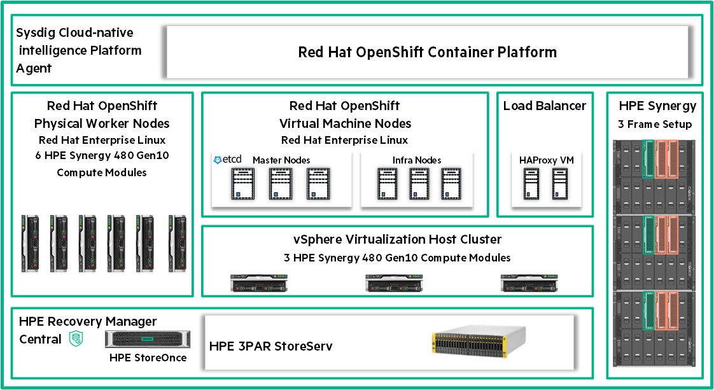

**Figure 1.** Solution layout

**NOTE**

The scripts and reference files provided in this document are examples
of how to build the infrastructure. They are not supported by Hewlett
Packard Enterprise or Red Hat.

It is expected that they will be modified by the user to align to the
deployment environment prior to installation

Figure 2 provides an overview of the layout and data storage design for
this solution. For detailed descriptions on each of the components used
in this solution, refer to the sections that follow hereafter.

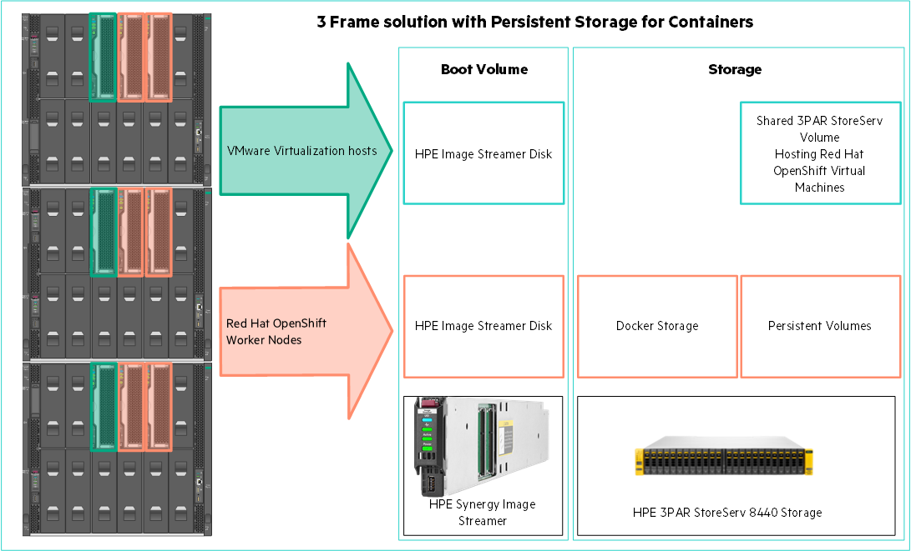

**Figure 2.** Solution design by function and storage type

**NOTE**

Containers and images are created and stored in the Docker storage
backend. This is ephemeral and separate from the persistent storage
allocated to meet the needs of the application(s). Docker storage in
Figure 2 refers to this ephemeral storage. For more information, visit
[https://docs.openshift.com/container-platform/3.11/install/host_preparation.html
-
configuring-docker-storage](https://docs.openshift.com/container-platform/3.11/install/host_preparation.html#configuring-docker-storage)
.

Figure 3 shows the logical design of the solution including volume
attach points and virtual machine locations.

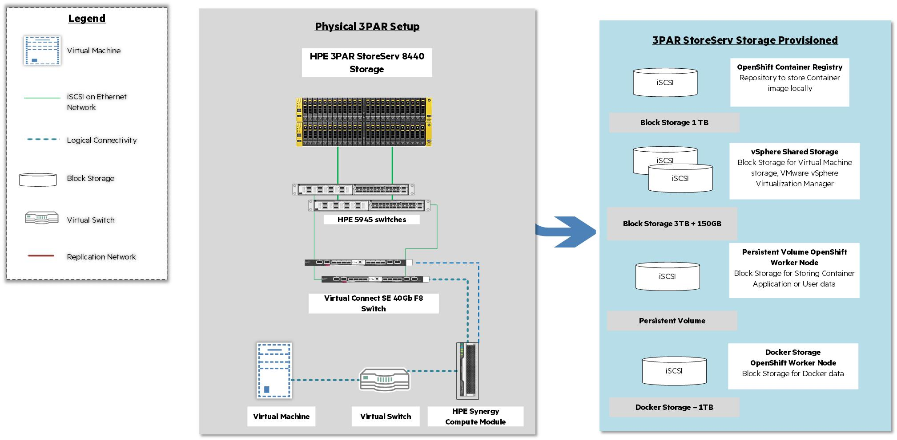

**Figure 3.** Logical layout of the solution stack

There are four networks defined in this solution. The four networks are:

-   **Synergy Management Network** - This network is specific to the
    requirements of HPE Synergy.
-   **Management Network** - This network facilitates the management of
    hardware and software interfaced by IT.
-   **Data center Network** - This network is a public access network
    used to connect end-users to applications.
-   **iSCSI Network** -- This network consists of two separate network
    segments that provide a redundant path for iSCSI storage traffic
    within the solution.

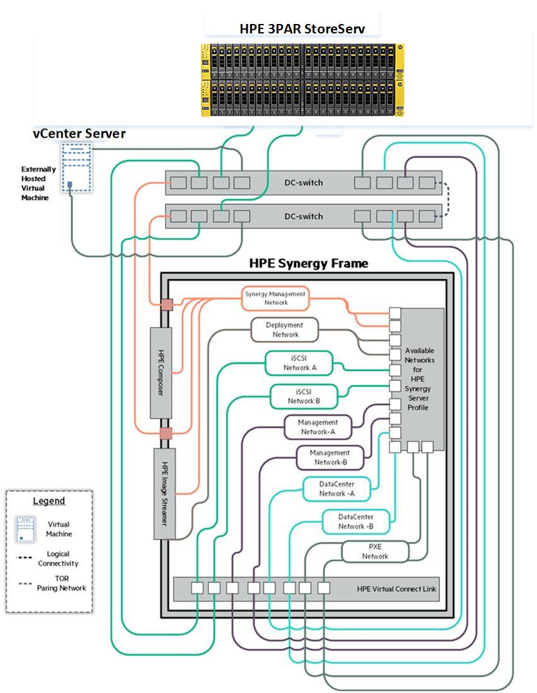

**Figure 4.** Physical network layout within the OpenShift solution

Figure 4 describes the physical network layout within the environment
and includes the network utilized by HPE Synergy Image Streamer to
deploy management and worker nodes.

## Solution creation process

Figure 5 shows the flow of the installation process and aligns with this
document.

**NOTE:**

For readability, a high-resolution copy of this image is located in the
<https://github.com/HewlettPackard/hpe-solutions-openshift/tree/master/synergy/scalable/3par-vsphere/iscsi>
. It is recommended that the user download and review this image prior
to proceeding.

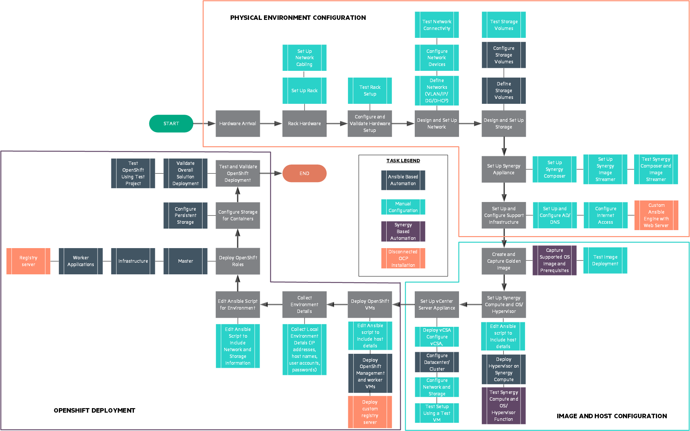

**Figure 5.** Solution creation process

# Sizing details for Red Hat OpenShift Container Platform deployment

Sizing a Red Hat OpenShift Container Platform environment varies
depending on the requirements of the organization and type of
deployment. This section discusses the sizing details for Red Hat
OpenShift Container Platform, host requirements and cluster sizing.

## OpenShift roles sizing details

The following role-based sizing guidance was followed during the
creation of the solution.

### Master node

Master nodes should have the following minimums:

-   vCPU -- 4
-   RAM -- 16GB
-   Disk storage

-- /var -- 40GB

-- /usr/local/bin -- 1GB

-- Temporary directory -- 1GB

**NOTE**

For every additional 1000 pods, master nodes should be configured with
an additional 1 vCPU and 1.5GB of RAM.

### Worker node

-   Worker nodes should have the following minimums:
-   vCPU -- 1
-   RAM -- 8GB
-   Disk storage

-- /var -- 15GB

-- /usr/local/bin -- 1GB

-- Temporary directory -- 1GB

A minimum of 15GB of unallocated space for Docker's storage back end for
running containers is required.

**NOTE**

Sizing for worker nodes is ultimately dependent on the container
workloads and their CPU, memory, and disk requirements.

### Infrastructure nodes

When running Elasticsearch, Fluentd and Kibana (EFK) on the
infrastructure nodes, 2 vCPUs and 24GB RAM is recommended for optimal
performance.

### Load balancer

It is recommended to use a commercially available load balancer for
enterprise deployments. This solution was developed using HAProxy, an
open source load balancing solution, with two (2) virtual machines to
serve the function of load balancing. Hewlett Packard Enterprise has
published a separate deployment guide in conjunction with F5 Networks
that documents how to integrate enterprise load balancing into this
solution which can be found at,
<https://github.com/HewlettPackard/hpe-solutions-openshift/tree/master/synergy/scalable/f5>
.

## Red Hat OpenShift Container Platform cluster sizing details

The number of worker nodes in an OpenShift cluster depends on the number
of pods that an organization is planning on deploying. Red Hat OpenShift
Container Platform 3.11 can support the following maximums:

- A maximum of 2000 nodes per cluster.
- A maximum of 150,000 pods per cluster.
- A maximum of 250 pods per node.
- A maximum pods per CPU core is the number of pods per node.

To determine the number of nodes required in a cluster, estimate the
number of pods the organization is planning on deploying and divide by
the maximum number of pods per node.

For example, if the organization plans to deploy 5000 pods, then the organization
should deploy a minimum of 20 application nodes with 250 pods per node.

```
(5000 / 250 =20).
```

In the test environment with a default configuration of six (6) physical
worker nodes, the Red Hat OpenShift cluster should be expected to
support 1500 pods.

```
(250 pods x 6 nodes = 1500 pods)
```

For more information about Red Hat OpenShift Container Platform sizing,
refer to the Red Hat OpenShift Container Platform product documentation
at,
<https://docs.openshift.com/container-platform/3.11/scaling_performance/index.html>
and
<https://access.redhat.com/documentation/en-us/openshift_container_platform/3.11/html-single/scaling_and_performance_guide/index>
.

# Prerequisites

Software versions
-----------------

Table 1 describes the versions of important software utilized in the
creation of this solution. The user should ensure that they download or
have access to this software. Also ensure that appropriate subscriptions
and licensing are in place to use within the planned timeframe.

**Table 1.** Major software versions used in solution creation

| **Component** | **Version** |
| ------------- | ----------- |
| Red Hat Enterprise Linux Server | 7.6 |
| VMware ESXi | 6.7.0-Update1-11675023-HPE |
| VMware vCenter Server Appliance | 6.7.0-11338176 |
| Red Hat OpenShift Container Platform | 3.11 |
| HPE 3PAR StoreServ Docker plugin | 3.1 |

**NOTE**

The latest sub-version should be installed.

## Deployment environment

This document is built with assumptions about services and networks
available within the implementation environment. This section discusses
those assumptions and, where applicable, provides details on how they
should be configured. If a service is optional, it is noted in the
description.

### Services

Table 2 disseminates the services utilized in the creation of this
solution and provides a high-level explanation of their function and
whether or not they are required.

**Table 2.** Infrastructure Services in this solution

| **Service** | **Required/Optional** | **Description/Notes** |
| --------------------- | ----------------- | --------------------------------- |
| DNS | Required | Provides name resolution on management and data center networks, optionally on iSCSI networks. |
| DHCP | Required | Provides IP address leases on management and usually for data center networks. Optionally used to provide addresses on iSCSI networks. |
| NTP | Required | Required to ensure consistent time across the solution stack. |
| Active Directory/LDAP | Optional | May be used for authentication functions on various networks. This solution utilizes local authentication but instructions are provided to enable LDAP. |

#### DNS

Name services must be in place for management and data center networks.
Once host is active, ensure that both forward and reverse lookups are
working on the management and data center networks.

The following host entries must be made in the appropriate domains:

-   vSphere virtualization hosts
-   vCenter server appliance
-   Management nodes

-- Master nodes

-- Infrastructure nodes

-- Load balancer(s)

-   RHEL worker nodes

#### NTP

A Network Time Protocol (NTP) server should be available to hosts within
the solution environment.

#### User laptop

A laptop system with the ability to connect to the various components
within the solution stack is required.

## Ansible Engine

This document assumes that an RHEL 7.6 server is available within the
deployment environment for utilizing as an Ansible Engine and is
accessible to the user.

Login to the Ansible Engine and perform the following steps:

1) Register the server with the Red Hat customer portal using the
following command.

```

# subscription-manager register --username=**<red hat subscription
username>** --password **=<red hat subscription password>**
--auto-attach

```

2) Pull the latest subscription data from the Red Hat subscription
manager using the following command.

```

*# subscription-manager refresh*

```

3) Find an available subscription pool for virtual system that provides
the OpenShift Container Platform channels using the following command.

```

*# subscription-manager list --available --matches '*OpenShift*'*

```

4) Attach a pool ID for a subscription that provides OpenShift Container
Platform.

```

*# subscription-manager attach --pool=<pool_id>*

```

5) Disable all the repositories using the following command.

```

*# subscription-manager repos --disable="*"*

```

6) Enable repositories using the following commands.

```

# subscription-manager repos --enable rhel-7-server-extras-rpms

# subscription-manager repos --enable rhel-7-server-rpms

# subscription-manager repos --enable rhel-7-server-ose-3.11-rpms

# subscription-manager repos --enable rhel-7-server-ansible-2.6-rpms

```

**NOTE**

This solution is developed using **Python 3.6.x** along with **Ansible
2.7.2.**

### Install Python and Ansible

The following steps should be taken to assist in the installation of the
appropriate Python and Ansible versions:

1) Install Python 3.6.x using the command.

```

# yum -y install rh-python36

```

2) Enable the **Python 3.6.x** environment using the command.

```

# scl enable rh-python36 bash

```

3) Create a **new virtual environment** for deploying this solution.

```

# python3 -m venv **<virtual environment name>**

```

4) **Activate** the virtual environment using the command.

```

# source **<virtual environment name>/bin/activate**

```

5) **Install** Ansible 2.7.2

```

# python3 -m pip install ansible==2.7.2

```

### Clone required repositories

This solution utilizes multiple Python and Ansible repositories. This
section lists the steps to clone and install the repositories.

1) Execute the following commands on the Ansible Engine host to download
the required repositories.

```

# cd /etc/ansible

# git clone --b 3.11
<https://github.com/HewlettPackard/hpe-solutions-openshift.git>

```

2) *oneview-ansible* is the Ansible module for HPE OneView which
utilizes the Python SDK to enable infrastructure as a code.

a) Clone the repository found at, <https://github.com/HewlettPackard/oneview-ansible/> .

b) Navigate to the downloaded repository oneview-ansible on the Ansible
Engine and execute the following commands.

```

# cd <path to oneview-ansible>

# pip install --r requirements.txt

```

c) Export the path of the **oneview-ansible/library** and
**oneview-ansible/library/module_utils** to the environment variables
*ANSIBLE_LIBRARY* and *ANSIBLE_MODULE_UTILS* using the following
commands.

```

# export ANSIBLE_LIBRARY=<absolute path to /oneview-ansible/library>

# export ANSIBLE_MODULE_UTILS=<absolute path to
/oneview-ansible/library/module_utils>

```

3) PyVmomi is the Python SDK for the VMware vSphere API that allows
managing ESX, ESXi, and vCenter. Execute the following command in the
Ansible Engine.

```

# pip install pyVmomi

```

# Physical environment configuration

## Overview

The configuration deployed for this solution is described in greater
detail in this section. At a high level, Hewlett Packard Enterprise and
Red Hat deployed the following:

- Three (3) HPE Synergy 12000 Frames with HPE Virtual Connect SE 40Gb F8 Modules for Synergy
- Two (2) HPE Synergy Composers
- Two (2) HPE Synergy Image Streamers
- Two (2) HPE FlexFabric (FF) 5945 switches
- HPE 3PAR StoreServ 8440 Array serving as primary storage
- Nine (9) HPE Synergy 480 Gen10 Compute Modules, with three (3) virtualized hosts running the required Red Hat OpenShift infrastructure and management software and six (6) bare metal or virtualized hosts
dedicated to worker nodes

*Figure 6* shows the physical configuration of the racks used in this
solution.

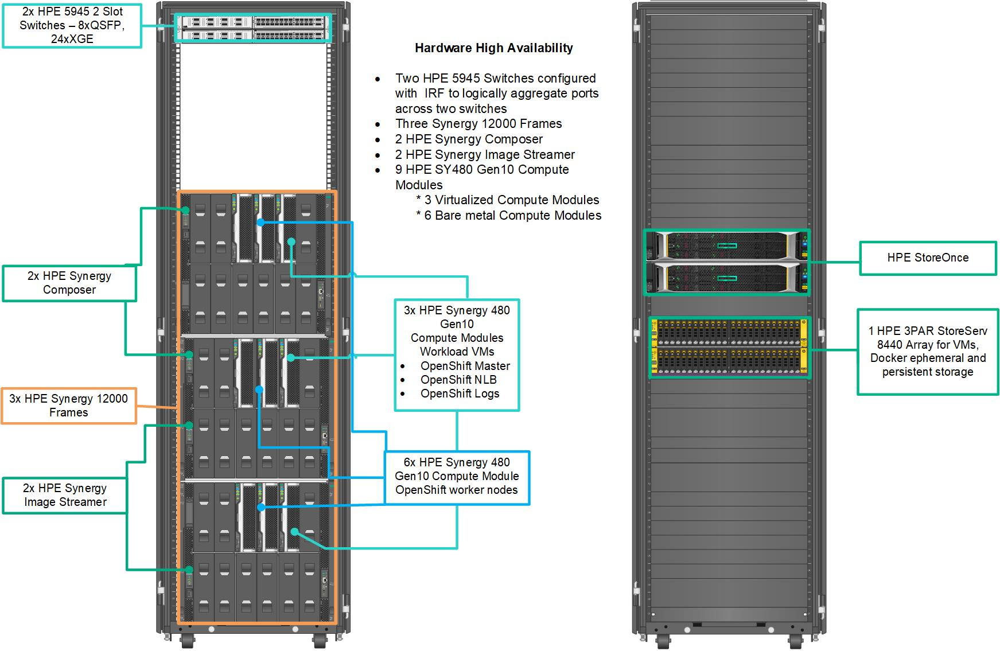

**Figure 6.** Physical layout of the compute within the solution

This configuration is based on the HPE Converged Architecture 750 which
offers an improved time to deployment and tested firmware recipe. That
baseline can be retrieved at,
<http://h17007.www1.hpe.com/us/en/enterprise/integrated-systems/info-library/index.aspx?cat=convergedsystems&subcat=cs750>
. It is recommended that the user installing the environment utilize the
latest available matrix.

The user also has flexibility in customizing the components of Hewlett
Packard Enterprise, throughout this stack per their unique IT and
workload requirements or building with individual components.

Table 3 below highlights the individual components and their
quantities as deployed within the solution.

**Table 3** . Components utilized in the creation of this solution.

| **Component** | **Quantity** | **Description** |
| ---------------- | -------- | ------------------------------- |
| HPE Synergy 12000 Frame | 3 | Three (3) HPE Synergy 12000 Frames house the infrastructure used for the solution |
| HPE Virtual Connect 40Gb SE F8 Module | 2 | A total of two (2) HPE Virtual Connect 40Gb SE F8 Modules provide network connectivity into and out of the frames |
| HPE Synergy 480 Gen10 Compute Module | 9 | Three (3) virtualized management hosts and six (6) bare metal or virtualized hosts for worker nodes |
| HPE FlexFabric 2-Slot Switch | 2 | Each switch contains one (1) each of the HPE 5945 modules listed below |
| HPE 5945 24p SFP+ and 2p QSFP+ Module | 2 | One module per HPE FlexFabric 2-Slot Switch |
| HPE 5945 8-port QSFP+ Module | 2 | One module per HPE FlexFabric 2-Slot Switch |
| HPE 3PAR StoreServ Storage 8440 | 1 | One array for virtual machines, Docker storage and persistent volumes |
| HPE Synergy Composer | 2 | Core configuration and lifecycle management for the Synergy components |
| HPE Synergy Image Streamer | 2 | Provides OS volumes to OpenShift worker nodes |

## Cabling the HPE Synergy 12000 Frame and HPE Virtual Connect 40Gb SE F8 Modules for HPE Synergy

This section shows the physical cabling between frames as well as the
physical connectivity between the switching. It is intended to provide
an understanding of how the infrastructure was interconnected during
testing and a guide for the user on which to base their configuration.
*Figure 7* shows the cabling of the HPE Synergy Interconnects, HPE
Synergy Frame Management, and Intelligent Resilient Fabric (IRF)
connections. These connections handle east-west network communication as
well as management traffic within the solution.

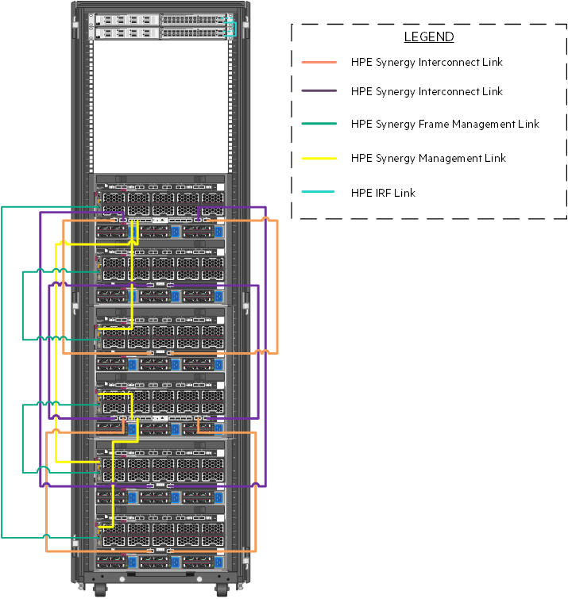

**Figure 7** . Cabling of the management and inter-frame communication
links within the solution.

**Figure 8** shows the cabling of HPE Synergy Frames to the network
switches. The specific networks contained within the bridge aggregation
groups (BAGG) are described in more detail later in this section. At the
lowest level, there are four (4) 40GbE connections dedicated to carry
redundant, production network traffic to the first layer switch where it
is further distributed. iSCSI traffic is separated into two (2) VLANs
and is carried to the first network switch pair over two (2) 40GbE links
per VLAN. Unlike the Ethernet traffic which is distributed between the
switches, each iSCSI VLAN is sent directly to one switch configured with
a pair of access ports.

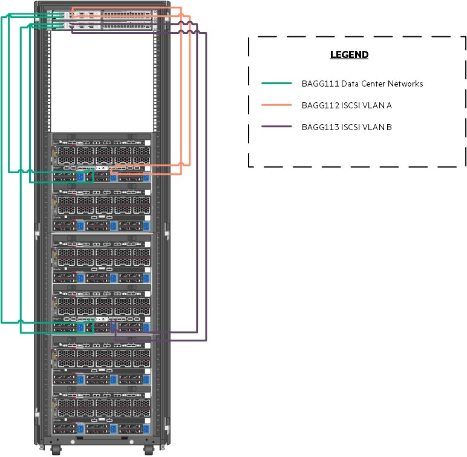

**Figure 8.** Cabling of the HPE Synergy 12000 Frames to the HPE
FlexFabric 5945 switches.

Table 4 explains the cabling of the virtual connect interconnect modules
to the HPE FlexFabric 5945 switching.

**Table 4.** Networks used in this solution

| **Uplink Set** | **Synergy Source** | **Switch Destination** |
| ------------------- | ------------------- | ------------------ |
| Network | Enclosure 1 Port Q3 | FortyGigE1/1/1 |
| Network | Enclosure 1 Port Q4 | FortyGigE2/1/1 | |
| Network | Enclosure 2 Port Q3 | FortyGigE1/1/2 | |
| Network | Enclosure 2 Port Q4 | FortyGigE2/1/2 | |
| Network | iSCSI_SAN_A | Enclosure 1 Port Q5 | FortyGigE1/1/5 |
| Network | Enclosure 1 Port Q6 | FortyGigE1/1/6 | |
| Network | iSCSI_SAN_B | Enclosure 2 Port Q5 | FortyGigE2/1/5 |
| Network | Enclosure 2 Port Q6 | FortyGigE2/1/6 | |

## Configuring the solution switching

The solution described in this document utilizes HPE FlexFabric 5945
switches. Individual port configurations are described elsewhere in this
section. The switches should be configured with an HPE IRF. To
understand the process of configuring IRF, refer to the HPE FlexFabric
5940 Switch Series installation guide at,
<https://support.hpe.com/hpsc/doc/public/display?sp4ts.oid=null&docLocale=en_US&docId=emr_na-c05212026>
. This guide may also be used to understand the initial installation of
switching as well as creation of user accounts and access methods. The
remainder of this section is built with the assumption that the switch
has been installed, configured for IRF, hardened, and accessible over
SSH.

**NOTE**

HPE Synergy facilitates the use of end of row switching to reduce switch
and port counts in the context of the solution. If end of row switching
is chosen, then this section should be used as guidance for how to route
network traffic outside of the HPE Synergy Frames.

### Physical cabling

**Table 5** is a map for source ports to ports on the HPE FlexFabric
5945 switches.

**Table 5.** HPE FlexFabric 5945 port map

| **Source Port** | **Switch Port** |
| --------------- | --------------- |
| 3PAR Controller A TG1 | TenGigE1/2/7 |
| 3PAR Controller A TG2 | TenGigE1/2/8 |
| 3PAR Controller B TG1 | TenGigE2/2/7 |
| 3PAR Controller B TG2 | TenGigE2/2/8 |
| Virtual Connect Frame U30, Q3 | FortyGigE1/1/1 |
| Virtual Connect Frame U30, Q4 | FortyGigE2/1/1 |
| Virtual Connect Frame U30, Q5 | FortyGigE1/1/5 |
| Virtual Connect Frame U30, Q6 | FortyGigE1/1/6 |
| Virtual Connect Frame U40, Q3 | FortyGigE1/1/2 |
| Virtual Connect Frame U40, Q4 | FortyGigE2/1/2 |
| Virtual Connect Frame U40, Q5 | FortyGigE2/1/5 |
| Virtual Connect Frame U40, Q6 | FortyGigE2/1/6 |
| To Upstream Switching | Customer Choice |

It is recommended that the installation user (referred to as the
installer in this document) to logon to the switch post-configuration
and provide a description for each of these ports.

### Network definitions

**Table 6** defines the networks configured using HPE Synergy Composer
in the creation of this solution. These networks should be defined at
both the first layer switch as well as within the composer. This
solution utilizes unique VLANs for the data center and solution
management segments. Actual VLANs and network counts will be determined
by the requirements of your production environment.

**Table 6.** Networks used in this solution

| **Network Function** | **VLAN Number** | **Bridge Aggregation Group** |
| ------------------- | ----------- | ------------------------ |
| Solution_Management | 1193 | 111 |
| Data_Center | 2193 | 111 |
| iSCSI_A | 3193 | 112 |
| iSCSI_B | 3194 | 113 |

The following steps needs to be performed to add these networks:

1) Log on to the switch console over SSH and run the following commands.

```

# sys

# vlan 1193 2193 3193 3194

```

2) For each of these VLANs, perform the following.

```

# interface vlan-interface ####

# name VLAN Name per table above

# description <Add text that describes the purpose of the VLAN>

# quit

```

**NOTE**

It is strongly recommended that you configure a dummy VLAN on the
switches and assign unused ports to that VLAN. The switches should be
configured with separate bridge aggregation groups (BAGGs) for the
different links to the HPE Synergy Frame connections. To configure the
three (3) bridge-aggregation groups and ports as described in the Table
6, run the following commands for the data center and management VLANs.

 ```

# interface Bridge-Aggregation111

# link-aggregation mode dynamic

# description <FrameNameU30>-ICM

# quit

# interface range name <FrameNameU30>-ICM interface
Bridge-Aggregation111

# quit

# interface range FortyGigE 1/1/1 to FortyGigE 1/1/2 FortyGigE 2/1/1 to
FortyGigE 2/1/2

# port link-aggregation group 111

# quit

# interface range name <FrameNameU30>-ICM

# port link-type trunk

# undo port trunk permit vlan 1

# port trunk permit vlan 1193 2193

# quit

```

3) For the VLANs that will carry iSCSI traffic, run the following
commands.

```

# interface Bridge-Aggregation112

# link-aggregation mode dynamic

# description <FrameNameU30>-ICM 3

# quit

# interface range FortyGigE 1/1/5 to FortyGigE 1/1/6

# port link-aggregation group 112

# quit

# interface Bridge-Aggregation 112

# port link-type trunk

# undo port trunk permit vlan 1

# port trunk permit vlan 3193

# quit

# interface Bridge-Aggregation113

# link-aggregation mode dynamic

# description <FrameNameU30>-ICM 6

# quit

# interface range FortyGigE 2/1/5 to FortyGigE 2/1/6

# port link-aggregation group 113

# quit

# interface Bridge-Aggregation 113

# port link-type trunk

# undo port trunk permit vlan 1

# port trunk permit vlan 3194

# quit

```

4) Assign the network ports that will connect to the various HPE 3PAR
StoreServ Storage interfaces with the switches.

```

# interface range TenGigE 1/2/13 to TenGigE 1/2/14

# port access vlan 3193

# quit

# interface range TenGigE 2/2/13 to TenGigE 2/2/14

# port access vlan 3194

# quit

```

5) Place the HPE 3PAR StoreServ Storage management interface into the
management VLAN.

```

# interface TenGigE 1/2/17

# port access vlan 1193

# quit

```

6) Place the replication traffic for the VLAN into the default VLAN or a
VLAN of your choice.

```

# interface TenGigE 1/2/15

# port access vlan 1

# quit

```

7) When configuration of the switches is complete, save the state and
apply it by typing **save** and following the prompts.

## HPE Synergy 480 Gen10 Compute Modules

This section describes the configuration and connectivity of the HPE
Synergy 480 Gen10 Compute Modules used in the creation of this solution.
The HPE Synergy 480 Gen10 Compute Modules, regardless of function, they
are configured identically. *Table 7* describes the individual
components. Server configuration should be based on customer needs and
the configuration used in the creation of this solution may not align
with the requirements of any given production implementation.

**Table 7.** Host configuration

| **Component** | **Quantity** |
| -------------- | ------------- |
| HPE Synergy 480/660 Gen10 Intel Xeon-Gold 6130 (2.1GHz/16-core/125W) FIO Processor Kit | 2 per server |
| HPE 8GB (1x8GB) Single Rank x8 DDR4-2666 CAS-19-19 Registered Smart Memory Kit | 20 per server |
| HPE 16GB (1x16GB) Single Rank x4 DDR4-2666 CAS-19-19 Registered Smart Memory Kit | 4 per server |
| HPE Synergy 3820C 10/20Gb Converged Network Adapter | 1 per server |
| HPE Smart Array P204i-c SR Gen10 12G SAS controller | 1 per server |

### VMware vSphere virtualization hosts

The solution calls for the installation of VMware vSphere (ESXi) on
three (3) HPE Synergy 480 Gen10 Compute Modules (nine (9) if the
implementation will utilize virtual worker nodes). These hosts house the
required management software for the solution installed on virtual
machines which consolidates the infrastructure within the solution stack
to virtual machines as opposed to physical hosts. *Figure 9 below*
highlights the connectivity of these hosts to the primary HPE 3PAR
StoreServ Storage array. Networks that are carried on the individual
bridge aggregation group are shown in *Table 6* of this document.

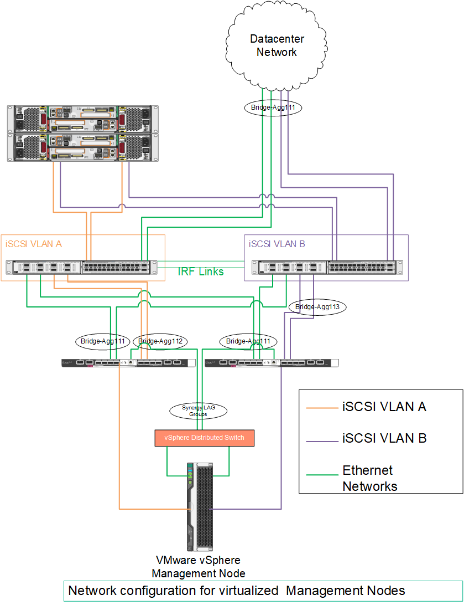

**Figure 9.** VMware vSphere virtualization host network connectivity

Each host is presented with access to a shared 3TB storage volume that
houses the virtual machines used in the solution. *Figure 3* and *Figure
11* in this document explain this relationship.

**NOTE**

If virtual worker nodes are implemented, refer further sections of this
document. The configuration outlined above will be used for the virtual
worker node hosts.

### Bare metal worker nodes

The Six (6) HPE Synergy 480 Gen10 Compute Modules are deployed as Red
Hat OpenShift Container Platform worker nodes and run Red Hat Enterprise
Linux Server 7.6 as their operating system. *Figure 10* highlights the
connectivity of these hosts to the primary HPE 3PAR StoreServ Storage
array. As with the virtualization hosts, refer to *Table 6* in this
document for an explanation of networks carried on each individual
bridge aggregation group.

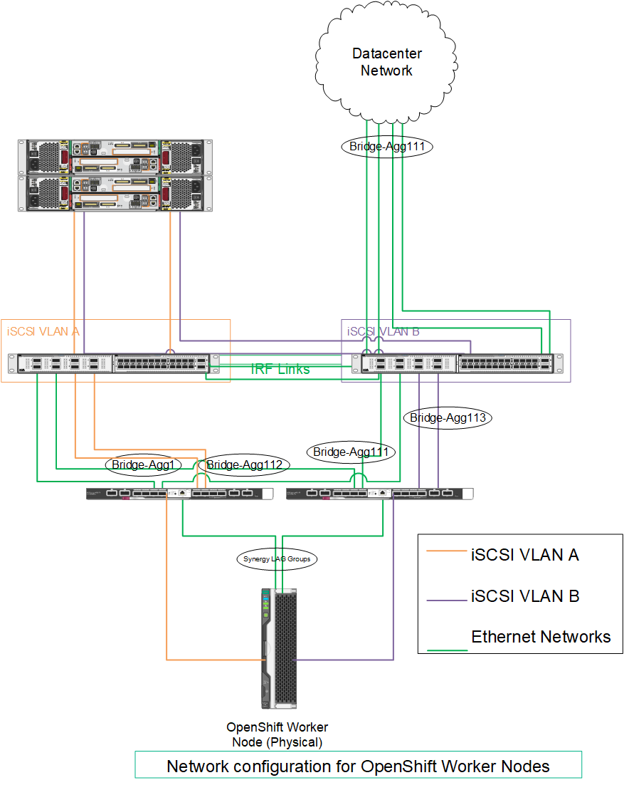

**Figure 10.** Red Hat OpenShift worker node network connectivity

## HPE Synergy Composer

At the core of the management of the Synergy environment is HPE Synergy
Composer. A pair of HPE Synergy Composers are deployed across frames to
provide redundant management of the environment for both initial
deployment and changes over the lifecycle of the solution. HPE Synergy
Composer is used to configure the environment prior to the deployment of
the operating systems and applications.

This section walks the user through the process of installing and
configuring the HPE Synergy Composer.

### Configure the HPE Synergy Composer via VNC

To configure HPE Synergy Composer with the user laptop, follow these
steps:

1) Configure the user laptop physical NIC with the IP address
*192.168.10.2/24*. No gateway is required.

2) Connect a CAT5e cable from the laptop NIC to the laptop port on the
front of a HPE Synergy Composer.

3) Once connected, open a browser and point it to
http://192.168.10.1:5800. This will open the HPE Synergy console on the
user laptop.

4) Once the console comes up, select **Connect** to start HPE OneView
for Synergy.

a. Select **Hardware Setup** and enter the following information
when prompted. Appliance host name:**Fully qualified name of the HPE
Synergy Composer**

b. Address assignment: **Manual**

c. IP address: **Enter an IP address on the management network**

d. Subnet mask:**Enter the subnet mask of the management network**

e. Gateway address: **Enter the gateway for the network**

f. Maintenance IP address 1:**Enter a maintenance IP address on the
management network**

g. Maintenance IP address 2: **Enter a secondary maintenance IP
address on the management network**

h. Preferred DNS server: **Enter the DNS server**

i. IPv6 Address assignment: **Unassign**

**NOTE**

This solution places the HPE Synergy Composers on the management
network. Pre-populating DNS with IP information is recommended.

5) Once all information has been entered click **OK** to proceed. This
will start a hardware discovery process which may take some time to
complete. Once the process has finished, check for issues and correct
them. The HPE Synergy Frame setup and installation guide available at,
<https://www.hpe.com/info/synergy-docs> offers suggestions to fix common
issues.

6) Select the **OneView** menu at the top of the screen and select
**Settings** and then click **Appliance**. Validate that both appliances
are connected and show a green checkmark.

### Configure appliance credentials

To configure appliance credentials, follow these steps:

1) Log in to the **HPE OneView** **for Synergy appliance**.

2) At first login you will be asked to define credentials for the
Administrator user. To do this, accept the **EULA** and in the*HPE
OneView Support* box ensure that *Authorized Service* is **Enabled.**

3) Login as **Administrator** with the password **admin**. You will be
prompted to enter a new password.

### Configure solution firmware

This solution adheres to the firmware recipe specified in the HPE
Converged Solutions 750 specifications which can be found in the CS750
firmware and software compatibility matrix. The solution used the
firmware recipe from June 2018.

1) Select the **OneView** menu and select **Settings.**

2) Under *Appliance* select **Update** **Appliance** and **Update**
**Composer.**

3) Once the update process completes, validate that both composer
modules are connected and there is a green checkmark

### Solution configuration

The user should utilize the HPE Synergy guided setup to complete the
following solution configuration details.

#### NTP

Configure the use of a Network Time Protocol server in the environment.

#### Create additional users

It is recommended that the installer create read-only user and
administrator account with a different username other than
administrator.

#### Firmware

Upload a firmware bundle based on the HPE Converged Solutions 750
recipe. Once the bundle starts uploading you can proceed to additional
steps without disrupting the upload.

#### Create an IP pool on the management network

Follow the guidance to create an IP pool on the management network. This
IP pool will provide IP addresses to management IPs and HPE device iLOs
within the solution. Ensure that the pool is enabled prior to
proceeding.

#### Create an IP pool for the HPE Synergy Image Streamer deployment network

The addresses created in this pool will be used for the iSCSI boot
network of HPE Image Streamer. The HPE Image Streamer targets and
compute module initiators will receive their IP addresses from this
pool.

#### Configure Ethernet networks

As explained in the *Network definition* section of this document, the
solution utilizes at least four (4) network segments. Use the *Create
networks* section of the One View guided setup wizard to define the
networks shown in *Table 8* at a minimum. Your VLAN values will
generally differ from those described below.

**Table 8.** Networks defined within HPE Synergy Composer for this
solution

| **Network Name** | **Type** | **VLAN Number** | **Purpose** |
| ------------ | -------- | ----------- | ----------------------- |
| Management | Ethernet | 1193 | Solution management |
| Data_Center | Ethernet | 2193 | Application, authentication and other user networks |
| ISCSI_VLAN_A | Ethernet | 3193 | ISCSI VLAN A |
| ISCSI_VLAN_B | Ethernet | 3194 | ISCSI VLAN B |

The management network should be associated with the management network
IP pool, which the user specified in the prior step. The user should
create any additional required networks for the solution.

#### Create Logical Interconnect Group

Within composer use the *Guided Setup* to create Logical Interconnect
Group (LIG) with a single uplink set defined. For this solution the
uplink set was named network and carries all outbound networks defined
for the solution. The ports used for outbound connectivity are Enclosure
1, Interconnect Bay 3, Ports Q3 and Q4 and Enclosure 2, Interconnect Bay
6, Ports Q3 and Q4. Each uplink is a 40GbE link.

#### Create enclosure group

The following steps need to be performed to create enclosure group:

1) From the *Guided Setup* choose **Create** **enclosure** **group***.*

2) Provide a name and enter the number of frames.

3) Choose **Use address pool** and utilize the management pool defined
earlier.

4) Use the Logical Interconnect Group from the prior step in the
creation of the enclosure group.

5) Select **Create** when ready.

#### Create logical enclosure

Use the *Guided Setup* to create a logical enclosure making use of all
three (3) enclosures. Select the firmware you uploaded earlier as a
baseline. It can take some time for the firmware to update across the
solution stack. Ensure that firmware is in compliance with the baseline
by selecting **Actions** and then **Update** **Firmware**. Click
**Cancel** to exit.

# Solution storage

The HPE 3PAR StoreServ 8440 Storage used in this solution provides
shared and dedicated storage for a variety of purposes within this
solution including virtual machine hosting, registry storage and
persistent volumes for containers. *Figure 11* shows the cabling of the
HPE 3PAR StoreServ 8440 Storage to the HPE switching utilized in this
solution. Note that this diagram shows the storage and switching in the
same rack to provide clarity. As implemented for this solution, the
switching resided in the HPE Synergy rack. The orange and purple wires
in the Figure 11 represent the separate iSCSI VLANs. In this solution we
have used one HPE 3PAR StoreServ Storage. Optionally two HPE 3PAR
StoreServ Storage can be used to provide replication. Figure 11 shows
the cabling diagram for HPE 3PAR StoreServ Storage.

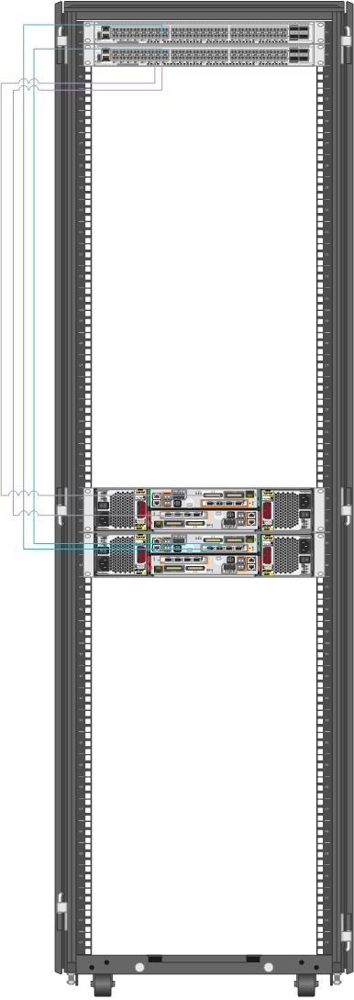

**Figure 11.** Cabling of the HPE 3PAR StoreServ 8440 Storage to the HPE
FlexFabric 5945 switches

Figure 12 describes the logical storage layout used in the solution. An
HPE Synergy Image Streamer volume is used for the hypervisor
installation on the virtualized hosts and also for the operating system
installation on the bare metal worker nodes. The HPE 3PAR StoreServ 8440
Storage provides dedicated and shared volumes for other functions.

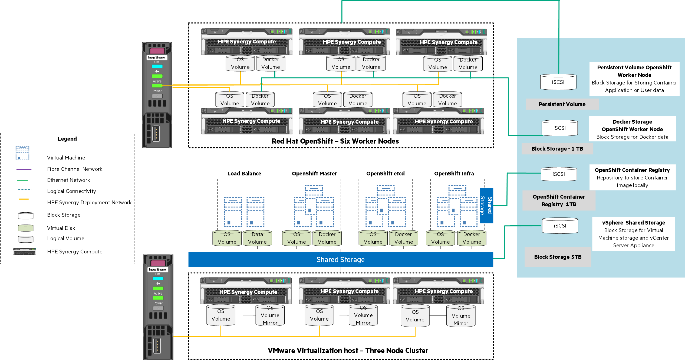

**Figure 12.** Shared storage layout with physical worker nodes

Information about storage volumes/disks is described in *Table 10* *.*
The user may choose to manually create and present these volumes or use
the Ansible resources specified after Table 10.

**NOTE**

It is recommended the user customize these values to suit their
environment.

**Table 10.** Volumes and sources used in this solution

| **Volume/Disk Function** | **Quantity** |**Size** | **Source** | **Hosts** | **Shared/ Dedicated** |
| ------------------------ | -------- | --------- | ---------------- | -------------- | ------------------ |
| Hypervisor | 9 | 40GB per host | HPE Image Streamer | vSphere hosts | Streamed |
| Virtual Machine Hosting and Docker Data | 1 | 3TB | HPE 3PAR StoreServ Storage | vSphere hosts | Shared |
| Persistent Application Data | N | App Specific | HPE 3PAR StoreServ Storage | OpenShift worker nodes | Dedicated |
| OpenShift Container Registry | 1 | 1TB | HPE 3PAR StoreServ Storage | Infrastructure node | Shared |

Prior to defining these volumes, the array must be initialized and
configured. Hewlett Packard Enterprise has provided resources to
initialize and configure the array in the next section.

**NOTE**

The volumes marked as *Dedicated* in *Table 10* should be created and
presented to a single host that will consume the volume. Volumes marked
as *Shared* should be presented to the group of hosts identified in the
*Hosts* column.

## Initializing the HPE 3PAR StoreServ 8440 Storage

This section assumes that the HPE 3PAR StoreServ 8440 Storage was
ordered with a physical service processor or that a virtual service
processor. VM is installed and functioning within the environment and is
available on the same network as HPE Synergy Composer. It also assumes
that a DHCP server is present on the management network. The user should
have the serial number of the storage that is being installed.

**NOTE**

Ensure that information such as user credentials, network access details
and serial numbers referenced below are securely recorded for current
and future reference.

### Service processor networking

To configure the service processor networking, follow these steps:

1) Either log in to a physical service processor or access the console
of a virtual service processor via the virtual console.

2) Log on as **setupusr** without a password.

3) When asked to configure the network, type **Y** and press **Enter**.

4) Confirm the network parameters that were handed to the service
processor by your DHCP server and if correct, type **Y** and then press
**Enter**. Ensure you note the IP address.

5) When prompted, press **Enter** to exit. You will now configure the
service processor (SP). Connect to the SP using the address
**https://<ip_address>/sp/SpSetupWizard.html**, and log on with the
user **setupusr** and no password.

6) At the *Welcome* screen click **Next**.

7) Enter the serial number of your HPE 3PAR StoreServ Storage and select
**Generate SP ID**. Click **Next** when done.

8) On the Configure Service Processor Networking screen give the SP a
hostname, check **Enable DNS Support** and enter the domain name and DNS
server IP. Click **Next** when done.

9) Enter any proxy information for *Remote Support* and click **Next**.

10) Enter the appropriate information in the *System Support
Information* screen and click **Next**.

11) At the *Time and Region* screen select **Automatic** and enter the
**IP address** of your NTP server. Choose the appropriate *Time Zone*
and click **Next**.

12) When prompted, change the passwords and click **Next**.

13) Click **Next** at the summary screen after validating all
information.

14) Remote connectivity will be tested. In the event of a failed test,
ensure that the SP can speak outbound via HTTPS and that the proxy
information entered is correct.

### Storage system

The storage system itself can be configured by following the steps
below.

1) From the SP, select **Launch** next to the ***Storage System Setup
Wizard*** and accept the EULA. Click **Next**.

2) Confirm the serial number of your array and click **Next**.

3) At the *Configure Networking* screen you will need to enter a name
and network information for the array. Click **Next** when done.

4) Select **Copy time options from the Service Processor** and click
**Next**.

5) Create a password for the 3paradm user and click **Next**.

6) Verify the configuration information and click **Next**. This will
initialize and test the array and then add it to the SP. This process
can take an extended amount of time. Once all tests have passed, click
**Finish**.

Once complete, configure the Web Services API and Common Information
Module (CIM).

1) Log on to the array via SSH as the 3paradm user. Use the IP address
set in step 3 of the Storage system section.

2) Run the following command to generate a self-signed certificate.

```

# createcert unified-server -selfsigned -keysize 2048 -days 1095 -CN
<fqdn of 3PAR> -SAN "DNS:<fqdn of 3PAR>, IP:<management IP of
3PAR>"

```

3) Answer **Yes** when prompted to continue creating the certificate.

4) Issue the following commands to start the WSAPI and CIM services.

```

# setcim -https enable

# startcim

# startwsapi

```

5) You can verify that the services are enabled and running by typing
the following commands.

```
# showcim

# showwsapi
```

### Configure the management server

This section assumes that a physical or virtual management server
running Microsoft&reg Windows Server&reg 2012 R2 is available and able
to communicate on the same network as the HPE 3PAR StoreServ storage. If
it is not, the user should create this management VM with the following:

-  Microsoft Windows Server 2012 R2
-  2 vCPU
-  8GB RAM
-  1x 100GB HDD for OS and applications
-  1x 200GB HDD for Media
-  1 Network Interface connected to the management network where the storage resides

The management VM should have Microsoft IIS configured with the web
server role and WebDAV publishing with basic authentication enabled.
Once the role is installed perform the following steps.

1) In **Server Manager** select **Tools** and then Internet Information
Services (IIS) Manager.

2) Select the server name and double-select **MIME Types.**

3) Select **Add** and enter the filename extension .vib as type
application/octet stream.

4) Click **OK.**

5) Repeat this process but substitute the filename extension .iso for
.vib.

6) Close the IIS Manager window.

Next the user will need to create a repository to house the Service Pack
for ProLiant (SPP) and HPE Synergy Release Set hotfix update files
associated with the HPE CA750 recipe.

1) From *File Explorer* navigate to the second HDD and create a folder
named **Media**

2) Within the media folder, create a folder named **SPP.**

3) Copy the SPP and HPE Synergy release set files to this folder.

4) Create a folder under SPP and name the folder Hotfixes. Copy the SPP
and/or HPE Synergy release set hotfix update files to this folder.

5) In *Server Manager*, relaunch Internet Information Services manager
as in Step 1 above.

6) Expand the hostname and then expand Sites.

7) Right-click the default web site and select add virtual directory.
Enter **Media** in the *Alias* field and select the media folder on the
second drive for the physical path. Click **OK** twice when done.

8) From within IIS Manager ensure that the folders exist under default
web site.

9) Select the *Media* folder and then double-select directory browsing
and ensure it is **Enabled.**

10) Select default web site and double-click the**WebDAV Authoring
Rules** icon. Select Enable WebDAV in the *Actions* Pane and then select
*Add Authoring Rule.*

11) Select **All content** and **All users** radio button and then check
the **Read** box under permissions. Click **OK** to commit.

12) WebDAV setting in the Actions pane and in the Property Behavior
section, ensure that the **Allow Anonymous Property Queries** and
**Allow Property Queries of Infinite Depth** are both set to **True**.
Select **Apply**.

13) Select the **Media directory** in the left pane and in the right
pane, double-click the **HTTP Response Headers icon.**

14) Select **Add** in the Actions pane and in the 'name' field enter
**MaxRepoSize**. In the value field, enter the size of the drive that
the Media folder was created on. In the case of this document you would
enter 200G. Click **OK** when done.

15) Select the server name in the left pane and then in the Actions pane
select **Restart** to restart the web server.

16) The next step is to create an external HPE OneView for Synergy
repository. Follow the steps below:

a) Using Google Chrome, log on to the HPE Synergy Composer and navigate
to **OneView -> Settings**

b) Select *Repository* and then select **'+'** to add repository.

c) Name the repo **OneView Repo** and in the web server address field
enter http://<ip_of_webserver>/media/SPP

d) Uncheck the **Requires Authentication** checkbox and select **Add.**

### Install and configure the HPE 3PAR SSMC

1) From within the Windows management station, install the HPE 3PAR
StoreServ Management Console by copying the media to the station and
running the **HPESSMC-*-win64.exe** installer. Follow the onscreen
prompts.

2) Use a web browser to connect to **https://<mgmt_vm_ip>:8443.**

3) Select **Set credential** and enter the**username** and **password**.
Select **Set** when done.

4) Install the HPE 3PAR admin tools by copying the media to the
management server, mounting it and executing
**cli\windows\setup.exe**. Follow the prompts to install. The user
will need to add each array in the solution to the SSMC Administrator
Console.

5) Log on to the console and select Actions and then **Add**.

6) Under System DNS names or IP addresses **enter the IP or name** of
the 3PAR array. The username will be 3paradm and the password is the one
the user created earlier. Select Add.

7) Once the array appears in the **Not Connected** state, select it and
select **Actions** and then**Accept Certificate**. Select **Accept and
cache**. After a moment the array will show in the **Connected** state.

8) Repeat these steps for any additional arrays within the solution.

### Create Common Provisioning Groups (CPGs)

CPGs are required within this solution. By default, HPE 3PAR StoreServ
Storage Arrays create a default set of CPGs.

1) Log on to the array as the 3PAR admin user using the SSMC.

2) Select **3PAR StoreServ -> Show all -> Common Provisioning
Groups.**

3) Select **Create CPG**. Provide a descriptive name and use **RAID6**.
The remaining default parameters are acceptable for this solution.

4) Create a second CPG for snapshots.

# Preparing the deployment environment

This section discusses steps to prepare the environment for hardware
deployment and software installation.

## Edit the OpenShift inventory file

Prior to configuring the compute modules, the installer should retrieve
the required Ansible plays and files from GitHub by running the
following command on the Ansible Engine host and review the inventory
files carefully.

```

# cd /etc/ansible

# git clone
<https://github.com/HewlettPackard/hpe-solutions-openshift.git>

```

This will place the inventory file at
*/etc/ansible/hpe-solutions-openshift
/synergy/scalable/3par-vsphere/iscsi/hosts* *.* Using the examples found
in the sample file, alter the appropriate sections to ensure that the
information within the file accurately reflects the information in the
deployment environment.

Use an editor (vim or nano) to edit the Ansible host file located at /
*etc/ansible/hpe-solutions-openshift/synergy/scalable/3par-vsphere/iscsi/hosts*
.

```

#vim
/etc/ansible/hpe-solutions-openshift/synergy/scalable/3par-vsphere/hosts

```

**NOTE**

The values provided in the variable files, host files or the figures are
for the reference purpose. It is expected that the user updates them to
suit their environment.

## Ansible Vault

Two pre-configured *Ansible Vault file* are provided with this solution,
*secret.yml* and *vault_pass.yml*.

*Secret.yml* consists of sensitive information to support virtualization
host and virtual machine deployment.

*vault_pass.yml* consists of sensitive information to support
prerequisites and deploying Red Hat OpenShift Container Platform.

Run the following commands to edit the vault to match the user's
environment.

```

# ansible-vault edit
/etc/ansible/hpe-solutions-openshift/synergy/scalable/3par-vsphere/iscsi/secret.yml

# ansible-vault edit
/etc/ansible/hpe-solutions-openshift/synergy/scalable/3par-vsphere/iscsi/vault_pass.yml

```

**NOTE**

The default password for the vault is *changeme*.

# Compute module configuration

This section describes the configuration of the compute modules and is
separated into sections that disseminate universal configuration
parameters, options used exclusively for virtualized master nodes, and
options used exclusively for bare metal worker nodes. The required
configuration steps are outlined. These may be in the form of Image
Streamer instructions, pointers to code, or command line options. It is
up to the person who is installing to decide how to reach the desired
end state.

Server Profiles are used to configure the personality of the compute
resources. A Server Profile allows a set of configuration parameters,
including firmware recipe, network and SAN connectivity, BIOS tuning,
boot order configuration, local storage configuration are some of the
entries. These templates are the key to delivering the *"infrastructure
as code"* capabilities of the HPE Synergy platform. For the purpose of
this solution, two templates were created. One template was used to
define virtualized management nodes and the other specified parameters
for OpenShift worker nodes.

**Warning**

During host deployment, ensure that adapter names and functions are
accurately recorded for the installation environment as variations in
the installation procedures may result in different adapter functions
than what is represented in the following sections. This will result in
the failure of some default automated configuration steps.

## VMware vSphere management hosts

The management nodes will be deployed and customized using HPE Synergy
Image Streamer while ensuring that the required storage volumes are
created and attached. This section outlines the steps required to
install the host. At a high level, these steps can be described as
follows:

1) Download the artifacts for *HPE Image Streamer* from the *HPE GitHub
site.*

2) Add the artifact bundles to *HPE Image Streamer.*

3) Create a *Server Profile* with an empty volume.

4) Install the hypervisor.

5) Capture the ESXi base golden image.

6) Delete the empty volume Server Profile.

7) Add ESXi golden image to the deployment plan.

8) Create the HPE 3PAR StoreServ storage volume.

9) Deploy the ESXI hosts using the golden image.

10) Utilize the virtualized hosts.

11) Create the VMware vCenter Server Appliance.

### Download the artifacts for HPE Synergy Image Streamer

VMware ESXi 6.7 artifact bundle for HPE Image Streamer can be downloaded
at,
<https://github.com/HewlettPackard/image-streamer-esxi/blob/v5.0/artifact-bundles/HPE-ESXi-6.7-2019-07-24-v5.0.zip>
. Sample foundation artifact bundles can be downloaded from,
<https://github.com/HewlettPackard/image-streamer-tools/tree/v5.0/foundation/artifact-bundles>
.

**NOTE**

It is recommended to download the artifact bundles in zip format. If the
artifact bundle name consists of "-", " " or any other special
character, it is recommended to rename the artifact bundle and remove
the special characters before executing the playbooks.

### Prepare the vSphere golden image

This section involves the following steps:

1) Upload the ESXi and Foundation artifact bundle for ESXi 6.7 with HPE
OneView 5.0.

2) Extract the artifact bundles.

3) Create a temporary Server Profile to install the hypervisor.

4) Power on the server hardware associated with the temporary server
profile.

These tasks are taken care by the playbook
*prepare_vsphere_image.yml*.

a) Update the vault file (*secret.yml*) to include the credentials used
with HPE OneView and Image Streamer.

b) Update the host file found in the
*/etc/ansible/hpe-solutions-openshift/3par-vsphere/iscsi* directory to
include server hardware details.

c) Update the variable files *main.yml* and *network.yml* found at
*/etc/ansible/hpe-solutions-openshift/3par-vsphere/iscsi/roles/prepare_vsphere_image/vars.*
Sample files are provided below, the installer needs to update the
values to suit their environment.

d) Update the host file found at */etc/ansible/hpe-solutions-openshift/synergy/scalable/3par-vsphere/iscsi.*

```

[vsphere_golden_image]

# "enclosure serial number, server bay number", type=<server
hardware type>

"MXQXXXXXX, bay 3" type="SY 480 Gen10 1"

```

**NOTE**

Before executing the playbook *prepare_vsphere_image.yml*, make sure
the server hardware provided in the host file is powered off and does
not have a Server Profile associated with it.

5) Update the *main.yml* file found at
*/etc/ansible/hpe-solutions-openshift/synergy/scalable/3par-vsphere/iscsi/roles/prepare_vsphere_image/vars*
.

```

# Name and path of the ESXi 6.7 Image streamer artifact bundle.

vsphere_artifact_bundle_name: 'HPE_ESXI_67'

vsphere_artifact_bundle_path:
etc/ansible/hpe-openshift-solutions/synergy/scalable/HPE_ESXI_67.zip

# Name and path of the Foundation artifact bundle for Image streamer
5.0

foundation_artifact_bundle_name: 'HPE_Foundation_Artifacts_5.0'

foundation_artifact_bundle_path:
etc/ansible/hpe-openshift-solutions/synergy/scalable/HPE_Foundation_Artifacts_5.0.zip

# Custom name for the temporary Server Profile

server_profile_name: vsphere_golden_image

```

6) Update the *network.yml* file found at */etc/ansible/hpe-solutions-openshift/synergy/scalable/3par-vsphere/iscsi/roles/prepare_vsphere_image/vars*
. Sample variables from *main.yml* are listed below for reference.

```

deployment_network_name: Deployment

management_network_name: TenNet

datacenter_network_name: TwentyNet

iSCSI_A_network_name: iSCSI_SAN_A

iSCSI_B_network_name: iSCSI_SAN_B

enclosure_group: EG

```

7) Update the *secret.yml* found at
*/etc/ansible/hpe-solutions-openshift/synergy/scalable/3par-vsphere/iscsi*
*.* Sample variables from *main.yml* are listed below for reference.

```

# oneview and image streamer ip address and credentials.

oneview_ip: x.x.x.x

oneview_username: <username>

oneview_password: <password>

imagestreamer_ip: x.x.x.x

```

8) After updating the variable files, execute the following command from
the Ansible Engine.

```

# cd
/etc/ansible/hpe-solutions-openshift/synergy/scalable/3par-vsphere/iscsi

# ansible-playbook -i hosts playbooks/prepare_vsphere_image.yml
--ask-vault-pass

```

### Install the VMware vSphere hypervisor

Once the temporary Server Profile is successfully created and attached
to a server hardware, it is time to install the hypervisor. The steps
below describe the process to be followed to install the hypervisor.

1) From the HPE OneView interface, navigate to Server Profiles and
select **ESXi-empty-volume Server Profile, Select Actions > Launch
Console.**

2) From the Remote Console window, choose **Virtual Drives -> Image
File CD-ROM/DVD** from the iLO options menu bar.

3) Navigate to the VMware ESXi 6.7 .iso file located on the installation
system.

8) Select the **.iso** file and click **Open.**

4) If the server is in the powered off state, power on the server by
selecting **Power** **Switch -> Momentary** Press.

5) During boot, press **F11 Boot Menu** and select **iLO Virtual USB
3: iLO Virtual CD-ROM.**

6) When the VMware ESXi installation media has finished loading, proceed
through the VMware user prompts. For Storage Device, select the
**40GiB** OS volume created on the HPE Image Streamer during Server
Profile creation and **set the root password.**

7) Wait until the vSphere installation is complete. Once the
installation is complete and the host is reachable, proceed with the
next section.

### Capture a vSphere golden image

Once the vSphere installation is complete, the next step is to capture
the vSphere image to create the golden image and deployment plan. The
steps below describes the process to be followed to capture the vSphere
image.

1) Power off the server hardware corresponding to temporary server
profile.

2) Capture the golden image.

3) Create deployment plan.

4) Delete the temporary server profile.

These tasks are handled by the playbook *capture_vsphere_image.yml.*

Update the vault file *(secret.yml)* to include the sensitive
credentials of OneView and Image Streamer, and variable files *main.yml*
found
*/etc/ansible/hpe-solutions-openshift/synergy/scalable/3par-vsphere/iscsi/roles/capture_vphere_image/vars/main.yml*
directory. A sample file is provided below. The installer needs to
update the values to suit their environment.

```

# custom name for Golden Image to be created.

golden_image_name: 'ESXi_GI'

# custom name for Deployment Plan to be created.

deployment_plan_name: 'ESXI_DP'

# Name of the OS volume associated with the temporary Server Profile
created.

os_volume_name: 'OSVolume-4'

```

After updating the variables, execute the following command from the
Ansible Engine.

```

cd
/etc/ansible/hpe-solutions-openshift/synergy/scalable/3par-vsphere/iscsi

ansible-playbook -i hosts playbooks/capture_vsphere_image.yml
--ask-vault-pass

```

### Provision the vSphere hosts

The virtualization hosts are deployed using the golden image created in
the earlier steps. This can be achieved by creating the Server Profiles
with the appropriate deployment plan and the network connections. The
consistency among the virtualization hosts is achieved using the Server
Profile template.

The playbooks *deploy_vsphere_template.yml* and *deploy_vsphere.yml*
located at,
*/etc/ansible/hpe-solutions-openshift/synergy/scalable/3par-vsphere/iscsi/playbooks*
creates the Server Profile template and Server Profile.

To create the Server Profile template and the Server Profile, the
installer should update the vault file (*secret.yml*) to include the
sensitive credentials of HPE OneView and Image Streamer. The host file
to include the server hardware details and variable files *main.yml*
found at
*/etc/ansible/hpe-solutions-openshift/synergy/scalable/3par-vsphere/roles/deploy_vsphere_template/vars*
and
*/etc/ansible/hpe-solutions-openshift/synergy/scalable/3par-vsphere/iscsi/roles/deploy_vsphere/vars*
directory. Sample files are provided below, the user needs to update the
values to suit their environment.

```

# DNS server and gateway IP address for the Management network

dns_ip: 10.0.x.x

gateway: 10.0.x.x

# Subnet mask for the management network

subnet_mask: 255.255.0.0

# Domain name for the management network

domain_name: tennet.local

# Deployment plan created during capture_vsphere_image play execution

deployment_plan_name: ESXI_DP_role

# custom name for Server Profile template to be created

server_profile_template_name: vSphere_template

```

In the hosts file located at
*/etc/ansible/hpe-solutions-openshift/synergy/scalable/3par-vpshere/iscsi*
, under the *vsphere_server_profile_template* and
*vsphere_server_profile* section, add the enclosure serial number with
the bay number of the server hardware, type of the server hardware,
name, IP address and hostname which needs be assigned for the servers
utilized as the virtualization hosts.

```

[vsphere_server_profile_template]

# "enclosure serial number, server bay number", type=<server
hardware type>

"MXQ83603WS, bay 3" type="SY 480 Gen10 1"

[vsphere_server_profile]

# "enclosure serial number, server bay number", type=<server
hardware type> name=<Server Profile name> ip=<vsphere host ip>
hostname=<vsphere hostname>

"MXQ7337JQ, bay 3" type="SY 480 Gen10 4" name="ESXI_1"
ip="10.0.60.20" hostname="vspherehost1"

"MXQ836WS, bay 3" type="SY 480 Gen10 1" name="ESXI_2"
ip="10.0.60.21" hostname="vspherehost2"

"2S1721PK4K, bay 3" type="SY 480 Gen10 4" name="ESXI_3"
ip="10.0.60.22" hostname="vspherehost3"

```

**NOTE**

If utilizing virtual worker nodes, add the hosts intended to be used as
virtualization hosts for the worker nodes under the
*vsphere_server_profile* section in the hosts file.

**WARNING**

Before executing the playbooks *vsphere_server_profile_template.yml*
and *vsphere_server_profile.yml*, make sure the server hardware
provided in the host file is powered off and does not have a Server
Profile associated with it.

Once the host and variable files are updated with the appropriate
values, execute the following commands from the Ansible Engine to create
the Server Profile Template and Server Profile.

```

# cd
/etc/ansible/hpe-solutions-openshift/synergy/scalable/3par-vsphere/iscsi

# ansible-playbook -i hosts playbooks/deploy_vsphere_template.yml
--ask-vault-pass

# ansible-playbook -i hosts playbooks/deploy_vsphere.yml
--ask-vault-pass

```

**NOTE**

Once the Server Profile is created, wait for few minutes for the vSphere
installation to be completed on the servers after which the vSphere
hosts are ready to use.

### VMware vCenter Server Appliance

In this solution, VMware vCenter Server Appliance (vCenter) is used to
manage the virtualized environment. This section illustrates the
deployment of the vCenter. If a vCenter is available in your
environment, the steps in this section can be skipped. However, ensure
that you understand the final layout and requirements of the vCenter as
deployed.

#### Prerequisites

Ensure there is a DNS entry for the vCenter hostname.

#### Procedure

The installation of the vCenter is a two stage process.

-   Deployment
-   Configuration

#### Deploy the appliance

1) From any server in the network server, navigate to the location of
the vCenter iso image file and double-click to open it.

2) Depending on the OS, navigate to the**vcsa-ui-installer/<OS type>**
folder and run the **installer.exe**

3) On the installation window, select **Install** to proceed with the
installation of a new **vCenter Server Appliance**.

4) Accept the **End User License Agreement** and then click **Next**.

5) Select the **Deployment Type** as **vCenter** server with an
**Embedded Platform Service Controller** and click **Next**.

6) Provide the **root credentials** of the vSphere host where the
vCenter is to be installed. Click **Next**.

7) Accept the **SSL certificate** from the selected host.

8) Enter a **unique name** for the vCenter and provide the password in
the Set **root password** field and click **Next**.

9) Based on the environment, provide the **Deployment Size** and the
**Storage Size**. Click **Next**.

10) Select the **Datastore** of the host which needs to be used and
click **Next**.

11) Configure the **network settings** and click **Next** and provide
the values for the following parameter.

a) IP address: **IP address for the vCenter**

b) Domain name: **Domain name** of the management network of the vCenter

c) FQDN: Fully-qualified domain name of the vCenter

d) Subnet mask: Subnet mask

e) DNS server: IP address for the DNS server

12) Click **Finish** to start the installation. The vCenter will be
deployed in the specified host.

13) When Stage 1 is successfully completed, click **Continue** to resume
the Stage 2 installation.

#### Configure vCSA

1) When Stage 2 installation screen is displayed, click **Next** to
begin the configuration process.

2) Specify the **NTP Server** and enable the **SSH access**. Click
**Next**. Enabling SSH is a must to enable smooth execution of Ansible
playbooks.

3) Select the **Create a new SSO domain** option and provide the **SSO
domain name** and a **unique SSO password** then click **Next.**

4) Click **Finish** to finalize the deployment and then click **OK** to
proceed. The setup process is then instantiated.

5) When Stage 2 has been executed successfully, the vCenter deployment
is complete.

#### Accessing the vCSA

To access the appliance, type the address *https:// <vCenter Server
Appliance IP address>:443* in the browser and enter the root
credentials. Choose Login.

## Integrate HPE 3PAR StoreServ Storage to vSphere hosts

This section describes the process of creating hosts and storage volumes
for the virtualization hosts. The steps below describes overview of the
tasks.

1) Create hosts HPE 3PAR StoreServ Storage Management Console.

2) Create virtual volume for the vSphere hosts.

### Creating hosts

1) Login to the *3PAR StoreServ Management Console*. Select **Hosts**
from the dropdown menu as shown in Figure 13.

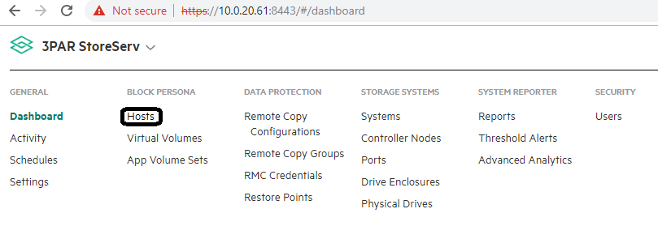

**Figure 13.** Selecting hosts in 3PAR StoreServ dashboard

2) On the *Hosts* page, click on **Create Hosts**

3) In the *Create Host* page, provide appropriate values for the
variables as shown in Figure 14:

a. Name: **<<custom name>>**

b. System: **<<3PAR storage system name>>**

c. Domain: None

d. Host Set: NA

e. Host OS: VMware (ESXi)

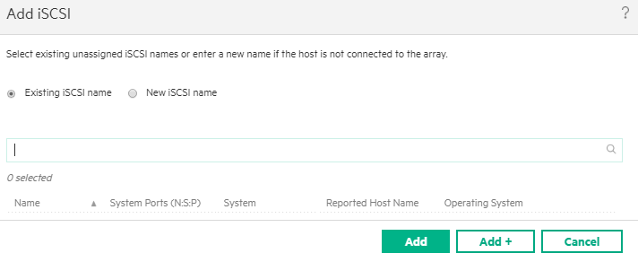

**Figure 14.** Adding iSCSI name to the hosts

4) In the *Paths* section, click **Add iSCSI**. On the *Add iSCSI* page,
provide the vSphere hostnames and IQN and then click **Add**. Repeat
this step for all the vSphere hosts to permit all the vSphere hosts with
access to the volume

5) Once all values have been filled in, click **Create**.

### Creating Virtual Volumes

1) Login to the *3PAR StoreServ Management Console*. From the dropdown
menu, navigate to *Virtual Volumes* as shown in the Figure 15.


**Figure 15.** Selecting hosts in 3PAR StoreServ dashboard

2) Click on **Create** **virtual** **volumes** as shown in Figure 16.

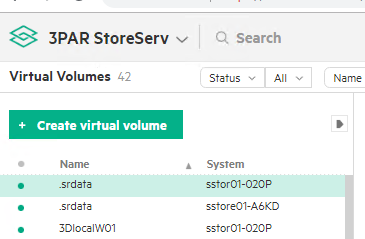

**Figure 16.** Create new virtual volume

3) From the *Create Virtual Volume* page, provide values for the
following fields as shown in Figure 17 and click **Create.**

a. Name: **<custom name for the Volume>**

b. System: **<3PAR storage system name>**

c. Domain: **None**

d. Provisioning: **Thin Provisioned**

e. Dedup: **No**

f. Compression: **No**

g. CPG: **<disk/raid type>**

h. Size: **3TB**

i. Volume Set: **NA**

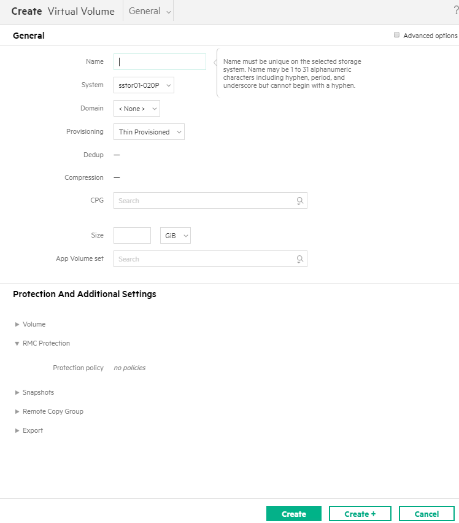

**Figure 17.** Parameters to create new virtual volume

4) Once the Virtual volume has been created, select the **Export**
option in the *Actions* drop down menu as shown in Figure 18.

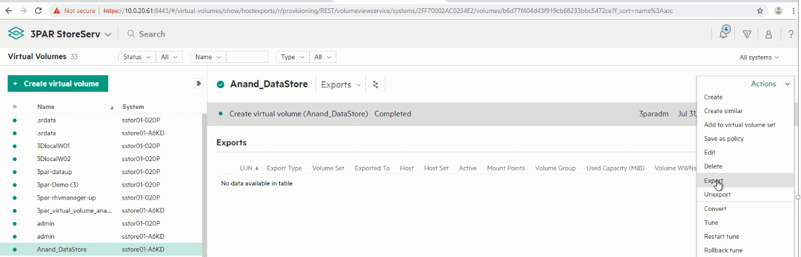

**Figure 18.** Export newly created virtual volume to the hosts

5) From the *Export Virtual Volumes* page, click on **Add** as in Figure
19.

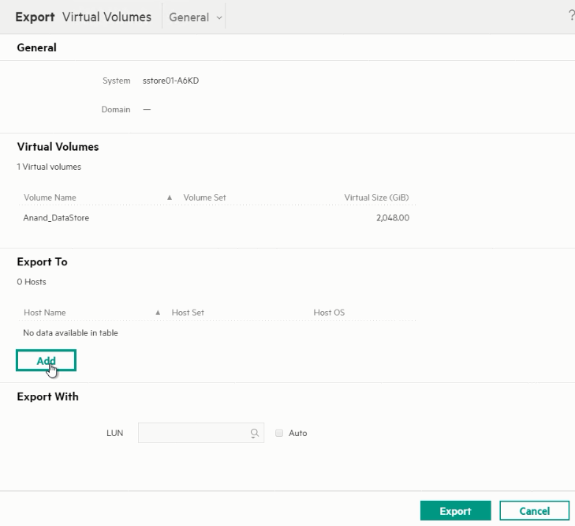

**Figure 19.** Add hosts to export the volume

6) From the *Add* page, select the host to which the virtual volume
needs to be exported and click **Add.**

7) After adding the host, select the *LUN Auto check* box as shown in
Figure 19 above and then click **Export**.

**NOTE**

If utilizing virtual worker node, repeat this section to create a volume
for storing the virtual worker nodes.

# Red Hat OpenShift Container Platform management functions

This section describes the process to deploy virtualized management
functions (masters, etcd, and infrastructure nodes) for Red Hat
OpenShift Container Platform. This section outlines the steps required
to configure virtual masters. At a high level, these steps can be
described as:

1) Create a data center in vCenter.

2) Create a cluster for hosting the ESXi hosts in vCenter.

3) Bring the ESXi hosts into the newly created cluster.

4) Configure VMkernel network adapters for the iSCSI network in vCenter.

5) Create a datastore with the HPE 3PAR StoreServ Storage volume in
vCenter.

6) Create a RHEL 7.6 VM template.

7) Deploy the RHEL 7.6 template to create the management and worker VMs
for the OpenShift installations.

## Prerequisites

1) Ansible Engine should be installed and configured and capable of
communicating with the hosts within this solution.

2) VMware ESXi 6.7 is installed on three HPE Synergy 480 Gen10 Compute
Modules.

3) VMware vCenter Server Appliance is configured and available.

4) DNS entries should exist for all hosts.

5) HPE 3PAR StoreServ Storage has been integrated with vCenter.

## Creating the data center, cluster and adding hosts into cluster in vCenter

A data center is a structure in VMware vCenter which holds the host
clusters, hosts, datastore. To begin with, a data center needs to be
created, followed by the clusters and adding hosts into the clusters.

In order to create the data center, the user will need to edit the vault
file and the variables YAML file. Using an editor, open the file
*/etc/ansible/hpe-solutions-openshift/synergy/scalable/3par-vsphere/iscsi/roles/prepare_vcenter/vars/main.yml*
to provide the names for data center, clusters and provide the vSphere
hostnames. A sample variable file is listed below. User should modify
the file to suit the environment.

In the vault file (*secret.yml*) found at,
*/etc/ansible/hpe-solutions-openshift/synergy/scalable/3par-vsphere/iscsi,*
provide the vCenter and the vSphere host credentials.

```

# vsphere hosts credentials

vsphere_username: <<username>>

vsphere_password: <<password>>

# vcenter hostname/ip address and credentials

vcenter_hostname: x.x.x.x

vcenter_username: <<username>>

vcenter_password: <<password>>

```

**NOTE**

This section assumes all the virtualization hosts have a common username
and password. If otherwise, it is up to the user to add the
virtualization hosts within the appropriate cluster.

Variables for running the play can be found at,
*/etc/ansible/hpe-solutions-openshift/synergy/scalable/3par-vsphere/iscsi/roles/prepare_center/vars/main.yml*
file.

```

# custom name for datacenter to be created.

datacenter_name: datacenter

# custom name of the compute clusters with the ESXi hosts for
Management VMs.

management_cluster_name: management-cluster

# custom name of the compute clusters with the ESXi hosts for worker
VMs, ignore if intended to use physical worker nodes.

worker_cluster_name: worker-cluster

# hostname or IP address of the vsphere hosts utilized for the
management nodes.

vsphere_host_01: 10.0.60.20

vsphere_host_02: 10.0.60.21

vsphere_host_03: 10.0.60.22

# hostname or IP address of vsphere hosts utilized for the virtual
worker nodes.

# Ignore the following section if intended to use physical worker
nodes.

vsphere_host_04: 10.0.60.23

vsphere_host_05: 10.0.60.24

vsphere_host_06: 10.0.60.25

vsphere_host_07: 10.0.60.26

vsphere_host_08: 10.0.60.27

vsphere_host_09: 10.0.60.28

```

Once the variable files are updated with the appropriate values, execute
the following command in the Ansible Engine to create the data center,
clusters and add hosts into respective clusters.

```

# cd
/etc/ansible/hpe-solutions-openshift/synergy/scalable/3par-vsphere/iscsi

# ansible-playbook playbooks/prepre_vcenter.yml --ask-vault-pass

```

**NOTE**

The playbooks are able to support virtual worker nodes along with
management VMs. If physical worker nodes will be used, simply ignore the
variables corresponding to virtual worker nodes.

When virtual worker nodes are used it is advised to thoroughly review
the *main.yml* task files found at,
*/etc/ansible/hpe-solutions-openshift/synergy/scalable/3par-vsphere/iscsi/roles/prepare_vcenter/tasks/main.yml*
as well as
*/etc/ansible/hpe-solutions-openshift/synergy/scalable/3par-vsphere/iscsi/roles/deploy_vm/tasks/main.yml*
before executing the *prepare_vcenter.yml* and *deploy_vm.yml*
playbooks.

## Configuring the networks

Distributed switches need to be configured to handle the vSphere and VM
traffic over the management, data center and iSCSI networks present in
the environment. This section consists of:

- Configuring distributed switches for the data center and iSCSI
networks.
- Migrating from standard switch to distributed switch for management
network.
- Configuring the iSCSI target server.
- Configuring the network port binding for iSCSI networks.

### Configuring distributed switches for the data center and iSCSI networks

1) Log in to vCenter and navigate to **Networking** -> <**datacenter
name**> -> Distributed Switch -> **New Distributed Switch** as shown
in Figure 20.

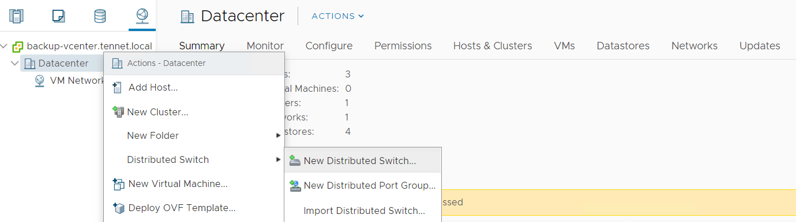

**Figure 20.** Create a new distributed switch.

2) From the new distributed switch page, provide a suitable **Name** for
the switch and click **Next**

3) Select the **version** for the distributed switch as 6.6.0 and click
**Next.**

4) On the configure settings page, provide the following information as
shown in Figure 21 and click **Next.**

5) Number of uplinks (2 uplinks for management networks and 1 uplink
each for the iSCSI networks).

6) Enable the **Network I/O control.**

7) Select the **Create a default port group** option and provide unique
names for the corresponding networks.

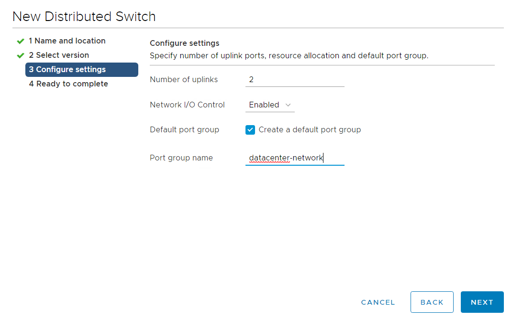

**Figure 21.** Configure settings for the distributed switch

8) Review the configurations as shown in Figure 22 and click **Finish**
to create the distributed switch.

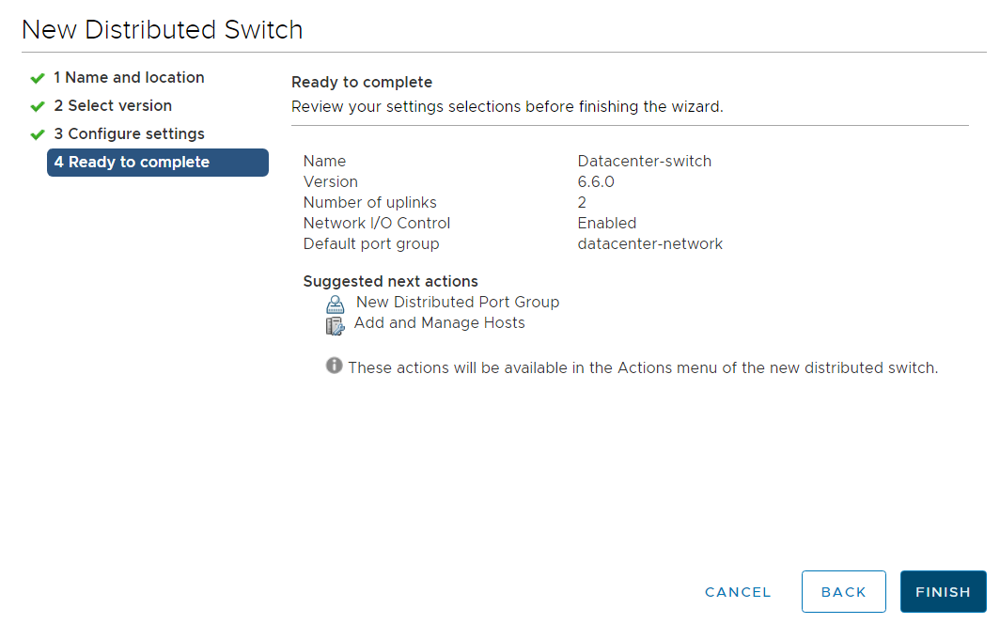

**Figure 22.** Review configurations of the distributed switch

9) After creating the distributed switch, right click on the**switch**
and select the **Add and Manage Hosts** as shown in Figure 23.

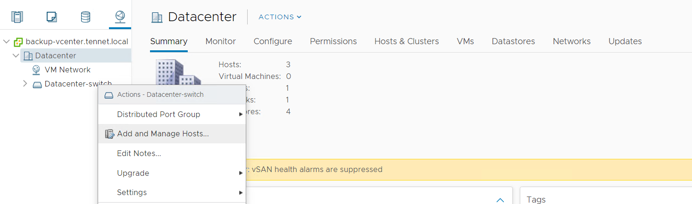

**Figure 23.** Managing hosts associated with the distributed switch

10) In the select task page, select the task as **Add hosts** and click
**Next.**

11) From the select host page, click **'+'** new hosts and select **all
the vSphere hosts** **within the cluster** to be configured with the
distributed switch as shown in Figure 24 and click **OK**.

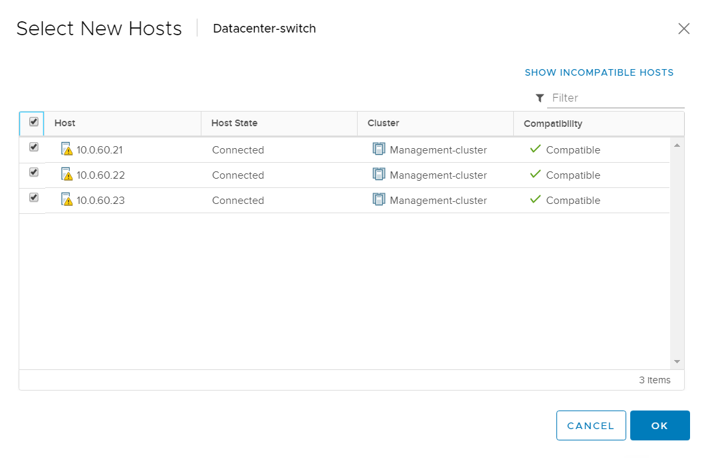

**Figure 24.** Adding hosts to distributed switch

12) Verify if the required hosts are added as shown in Figure 25 and
click **Next**.

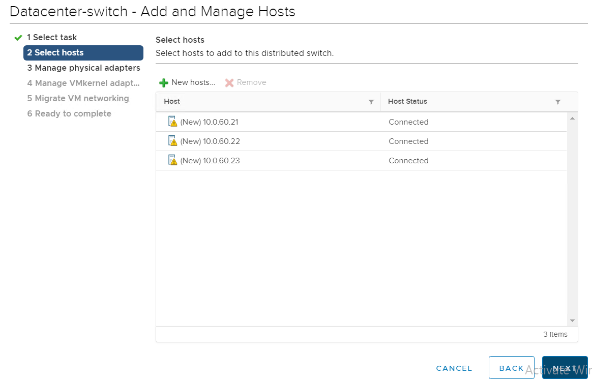

**Figure 25.** Review the hosts added to the distributed switch

13) In the *Manage physical adapters* page, select the **Physical
Network Adapters** in each host for the corresponding network being
configured and click **Assign uplink** as shown in Figure 26.

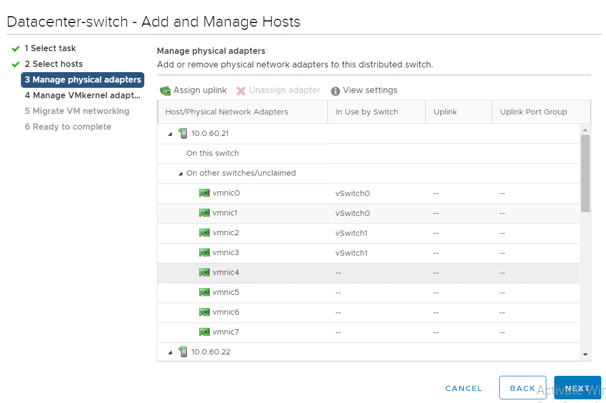

**Figure 26.** Select the physical adapter to be managed

Figure 27 shows the screen to select an uplink to be used.

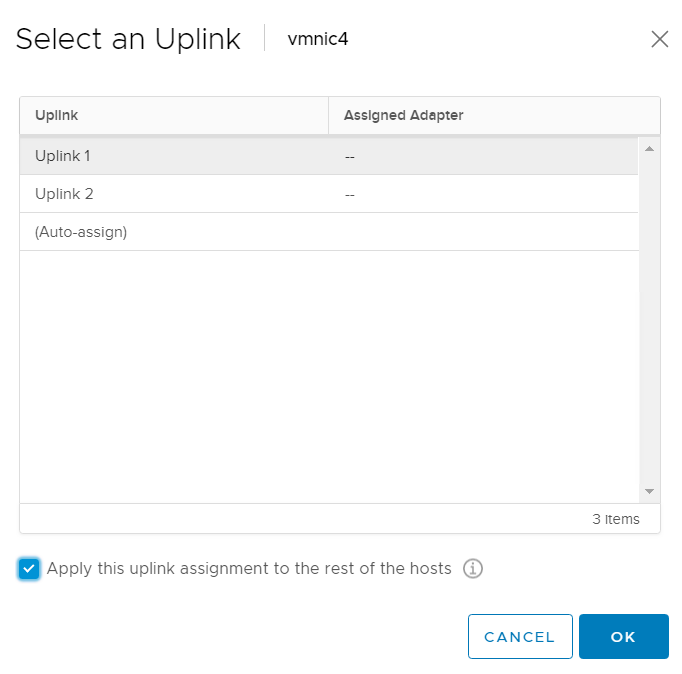

**Figure 27.** Select the physical adapter to be managed by the
distributed switch

14) Choose the *uplink* and select **Apply this uplink assignment to the
rest of the hosts**. Select OK as shown in Figure 28.

15) Once the uplinks are assigned to the physical adapters, select
**Next.**

16) Review the configurations in the manage VMkernel adapters as shown
in Figure 28 and click **Next**.

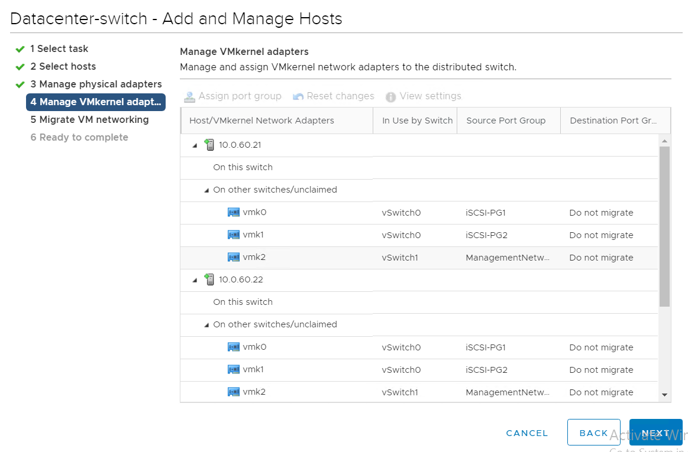

**Figure 28.** Manage VMkernel adapter of the distributed switch

17) Review the configuration in *Migrate VM networking* as shown in
Figure 29 and click **Next**.


**Figure 29.** Migrate VM networking of the distributed switch

18) On the *Ready to complete* page, review the configurations and click
**Finish**.

19) To add a VMkernel adapter to the distributed switches, navigate to
**Networking -> <datacenter name> -> <Distributed switch> -> Add
VMkernel Adapter** as shown in Figure 30.


**Figure 30.** Add VMkernel adapter to the distributed switch

20) Select the hosts to which the configuration needs to be applied as
shown in Figure 31 and click **Next**.


**Figure 31.** Select the hosts managed by the distributed switch

21) In the configure VM kernel adapter page, select the IP settings as
*IPv4* and apply the appropriate services as shown in Figure 32 and
click **Next**. []{#OLE_LINK2} [This should include vMotion and fault
tolerance logging at a minimum.]{#OLE_LINK1}

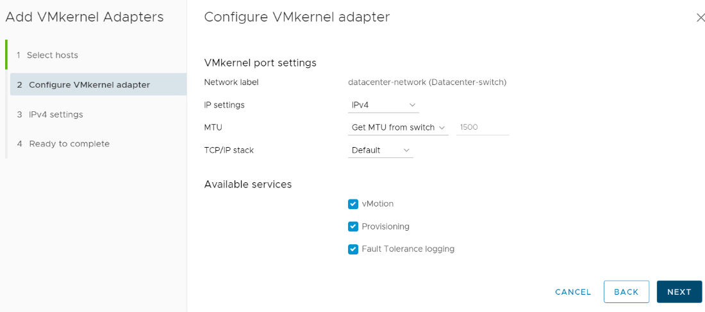

**Figure 32.** Configure VMkernel adapter of the distributed switch

22) On the IPv4 settings page, provide the *network settings*
and*gateway settings* for the all hosts as shown in Figure 33 and click
**Next**.

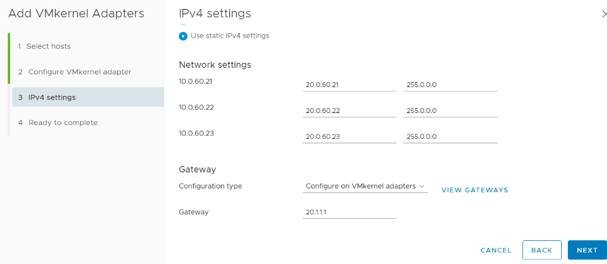

**Figure 33.** Configuring IP address of the VMkernel adapters

23) Review the settings on the *Ready to complete* page and click
**Finish**.

**NOTE**

Repeat the steps in the *Configuring Distributed Switches* section for
each iSCSI network.

### Migrating from a standard vSwitch to a distributed switch on the management network

1) Log in to vCenter and navigate to **Networking -> <datacenter
name> -> Distributed Switch -> New Distributed Switch.**

2) From the *New Distributed Switch* page, provide a suitable name for
the switch and the data center name for the location. Click **Next.**

3) Select the version for the distributed switch as 6.6.0 and click
**Next.**

4) On the configure settings page, provide the following information as
shown in Figure 34 and click **Next.**

a. Set the number of uplinks to **2**.

b. Enable **Network I/O control.**

c. Select the **Create a default port group** option and provide a
unique name for the corresponding networks.

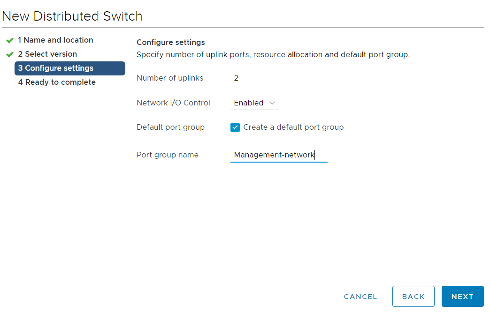

**Figure 34.** Configure settings for the distributed switch

5) View the configurations and click **Finish** to create the
distributed switch.

6) After creating the distributed switch, right click on the switch
and select the **Add and Manage Hosts.**

7) In the select task page, select the task as add hosts and click
**Next.**

8) From the select hosts page, click **+ new hosts** and select the
appropriate vSphere hosts within the cluster to be configured with the
distributed switch as shown in Figure 35 and click **OK.**

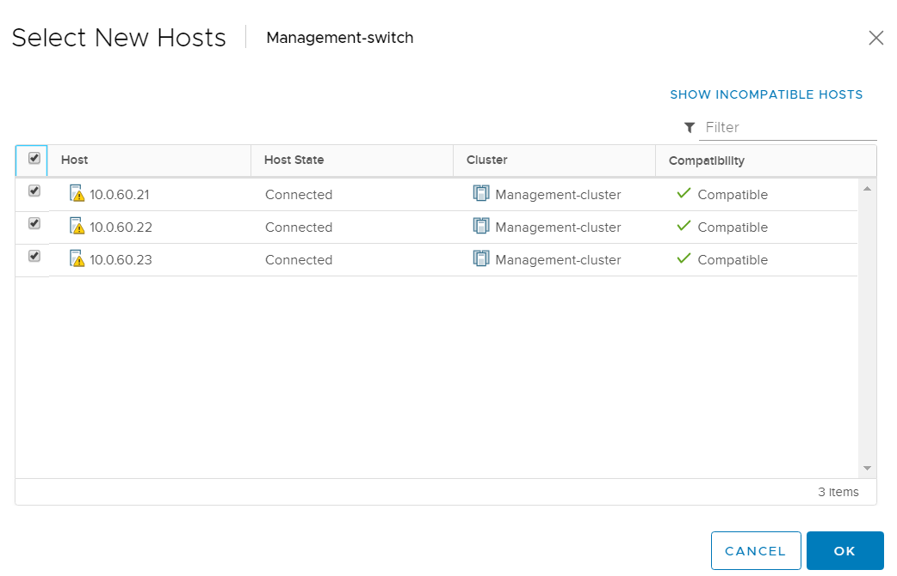

**Figure 35.** Adding hosts to the distributed switch

9) Verify the required hosts are added as shown in Figure 36 and
click **Next.**

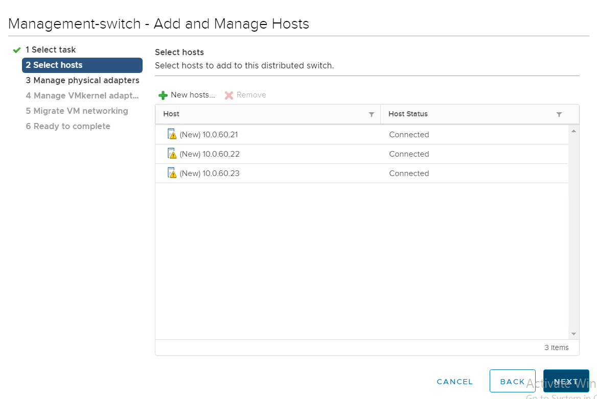

**Figure 36.** Review the hosts added to the distributed switch

10) In the *Manage physical adapters* page, select the **Physical
Network Adapter** in each host for corresponding the network being
configured and click **Assign uplink** as shown in Figure 37.

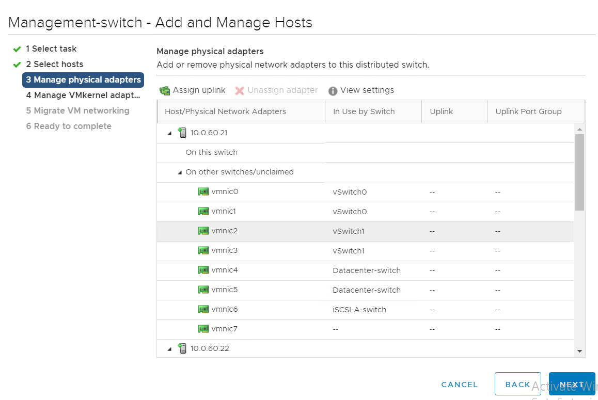

**Figure 37.** Select the physical adapter to be managed

11) Choose the *Uplink* and select **Apply** this uplink assignment to
the rest of the hosts. Select **OK** as shown in Figure 38.

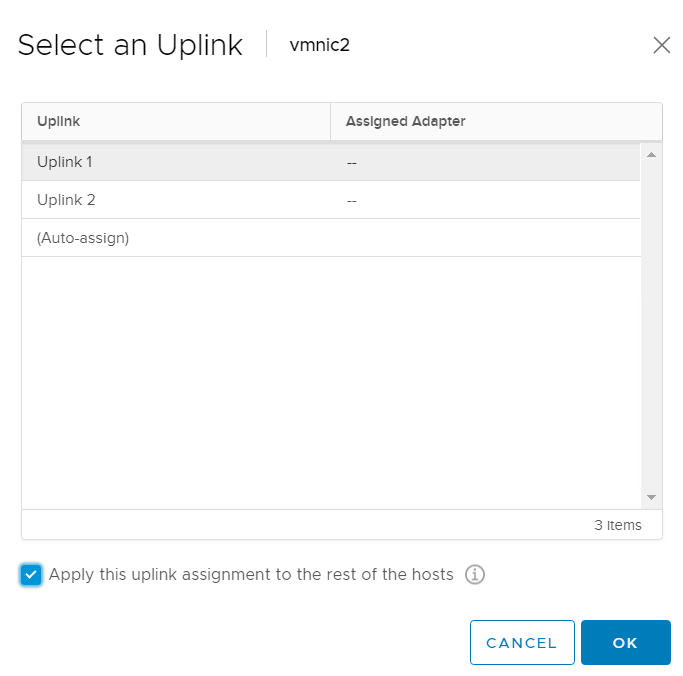

**Figure 38.** Assigning the uplink to the physical adapter

12) Once the uplinks are assigned to the physical network adapters,
select **Next.**

13) In the Manage VMkernel adapters, select the VMkernel to be migrated
and click **Assign port group** shown in Figure 39.

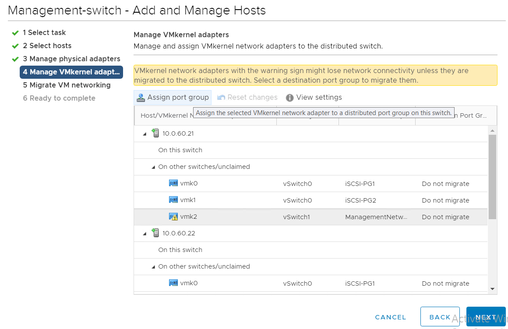

**Figure 39.** Select the VMkernel adapter to be migrated

14) Select the network associated with the VMkernel adapter as in Figure
40 and click **OK**.


**Figure 40.** Assign corresponding network to the VMkernel adapter to
be migrated

15) Review the *VMkernel adapter configurations* as shown in Figure 41
and click **Next.**

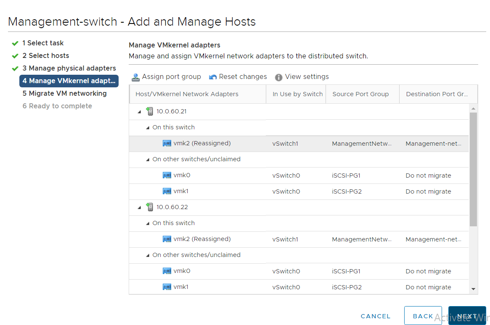

**Figure 41.** Review the VMkernel adapter configurations

16) Review the configuration in **Migrate VM networking** as shown in
Figure 42 and click **Next.**


**Figure 42.** Review the migrate VM networking configurations

17) On the *Ready to complete* page, review the configurations and click
**Finish.**

### Configuring the iSCSI target server

1) Select the vSphere host and navigate to **Configure -> Storage ->
Storage Adapters -> iSCSI Adapter -> Dynamic Discovery.**

2) Click the **"+"** icon as shown in Figure 43 to add the send target
server.

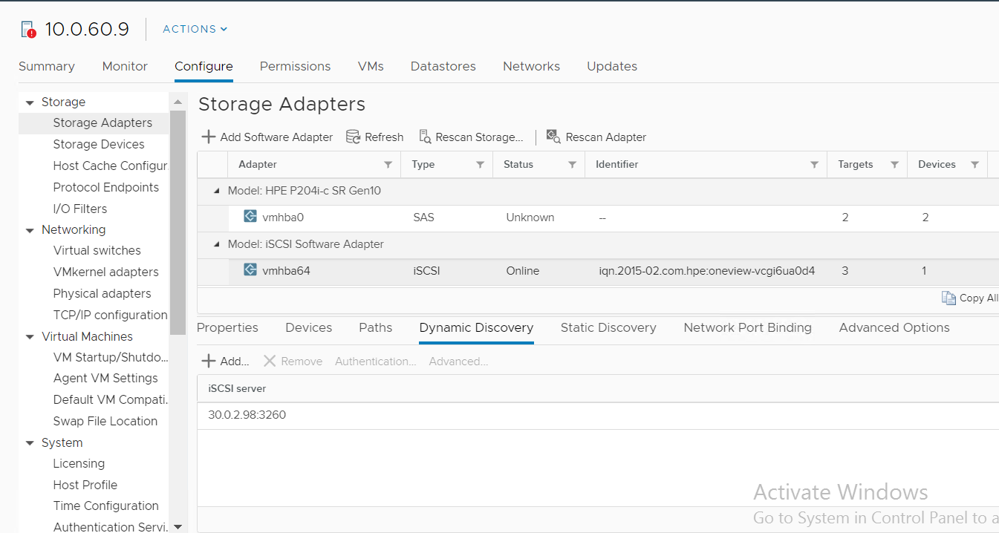

**Figure 43.** Host storage adapters

3) Provide the FQDN / IP address of the server on the first iSCSI
network segment and select the **Inherit authentication settings from
parent** box as shown in Figure 44. Click **OK.**

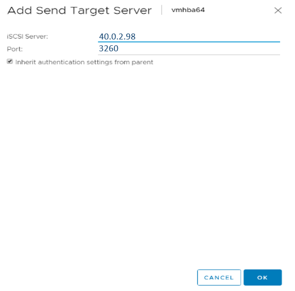

**Figure 44.** Target iSCSI server configuration

4) Repeat the above steps on all hosts to add the iSCSI target servers.

### Configuring the network port binding for iSCSI networks

1) To configure network port binding, navigate to **Configure ->
Storage -> Storage Adapters -> iSCSI Adapter -> Network Port
Binding.**

2) Click **"+"** as shown in Figure 45.

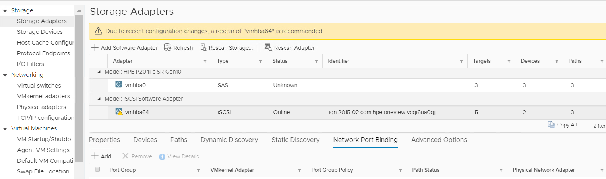

**Figure 45.** Network port binding

**3)** Select the **Port Group** of the iSCSI_A network shown in Figure
46 and click **OK.**

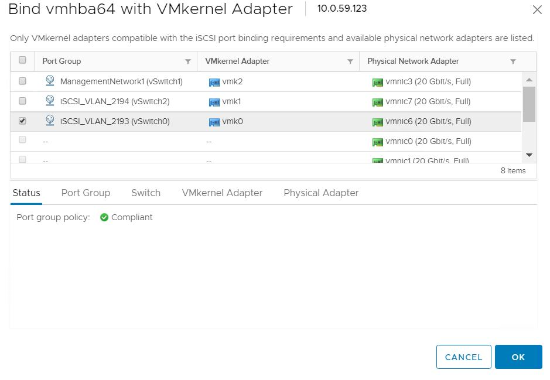

**Figure 46.** Adding iSCSI_A network for network port binding

4) Select the **Port Group** of the iSCSI_B network as shown in
Figure 47 and click **OK.**

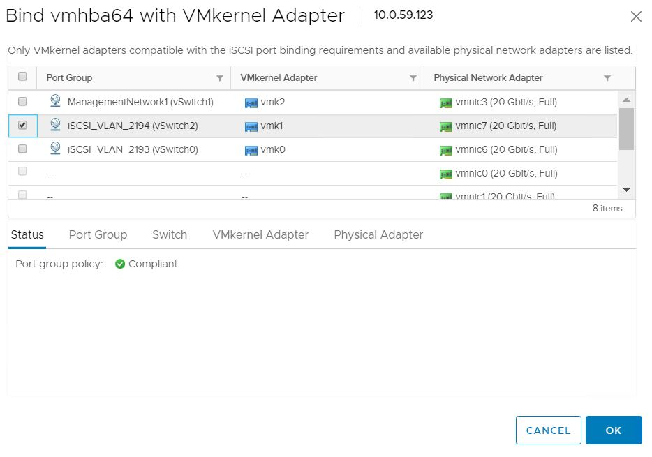

**Figure 47.** Adding iSCSI_B network for network port binding

5) Repeat the steps on all hosts for both iSCSI networks.

HPE 3PAR StoreServ Storage volume in vCenter
--------------------------------------------

A datastore needs to be created in VMware vCenter from the volume carved
out of HPE 3PAR StoreServ Storage to store the VMs. The following steps
describes to create a volume in vCenter.

1) From the vSphere Web Client navigator, right-click the cluster,
select**Storage** from the drop-down menu, and then select **New
Datastore** as shown in Figure 48.

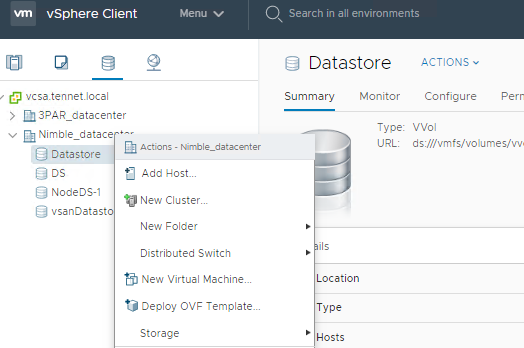

**Figure 48.** Create a datastore in vCenter

2) From the *Type* page, select **VMFS** as the datastore type and click
**Next.**

3) On the *Name and Device* selection page, provide the values requested
and click **Next.**

4) Select a host to view its accessible disk/LUNs. Any of the hosts that
are associated with the HPE 3PAR StoreServ Storage volume may be
selected.

5) Select the **volume** from HPE 3PAR StoreServ Storage.

6) From the VMFS version page, select **VMFS 6** and click **Next.**

7) Specify the details for *Partition configuration* as shown in Figure
49 and click **Next**. By default, the entire free space on the storage
device is allocated. You can customize the space if required, but it is
recommended to use the full space.

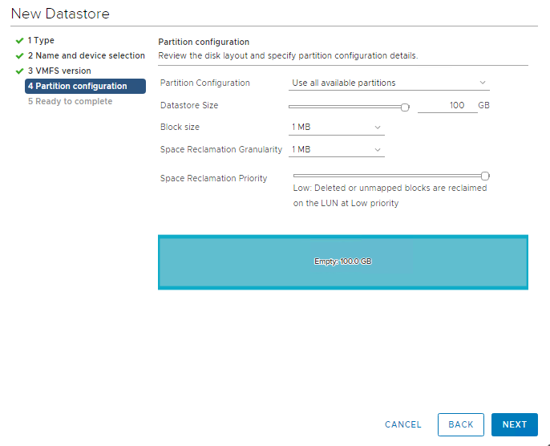

**Figure 49.** Partition configuration screen of the new datastore
within vCenter

8) On the Ready to complete page, review the datastore configuration and
click **Finish.**

**NOTE**

If utilizing virtual worker nodes, repeat this section to create a
datastore to store the worker node virtual machines.

## Creating a RHEL 7.6 VM template

In this solution, a VM template with RHEL 7.6 with VMware tools
installed on it needs to be created. This section explains the steps
that are required in order to create the template. The following steps
describes the overview of the tasks.

1) Create a virtual machine.

2) Install Red Hat Enterprise Linux 7.6 on that virtual machine.

3) Convert the VM to a template.

### Create a Virtual Machine

A virtual machine needs to be created with the following
configurations which will later be utilized to deploy the management and
worker virtual machines required for deploying OpenShift.

1) Log in to vCenter using the Web Client and select an ESXi Host. Right
click to open the **New Virtual Machine** wizard.

2) From *Select a creation type*, select **Create a new virtual
machine**, as illustrated in Figure 50 and then click **Next**.

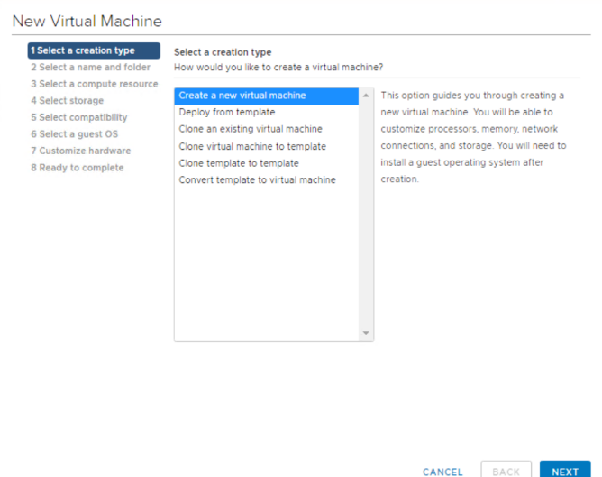

**Figure 50.** Console to create new VM in vCenter

3) Enter a unique name for the VM and select the **Datacenter** to
deploy the VM as illustrated in Figure 51. Click **Next** when done.

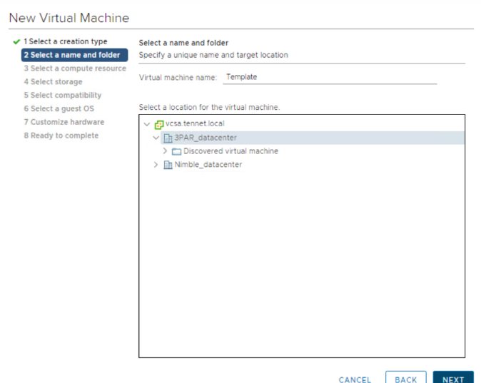

**Figure 51.** Console to provide the name and location for the new VM
in vCenter

4) Select the **Cluster** on which the VM can be deployed. Click
**Next.**

5) Select the **Datastore** on which the VM can be stored as
illustrated in the Figure 52. Click **Next.**

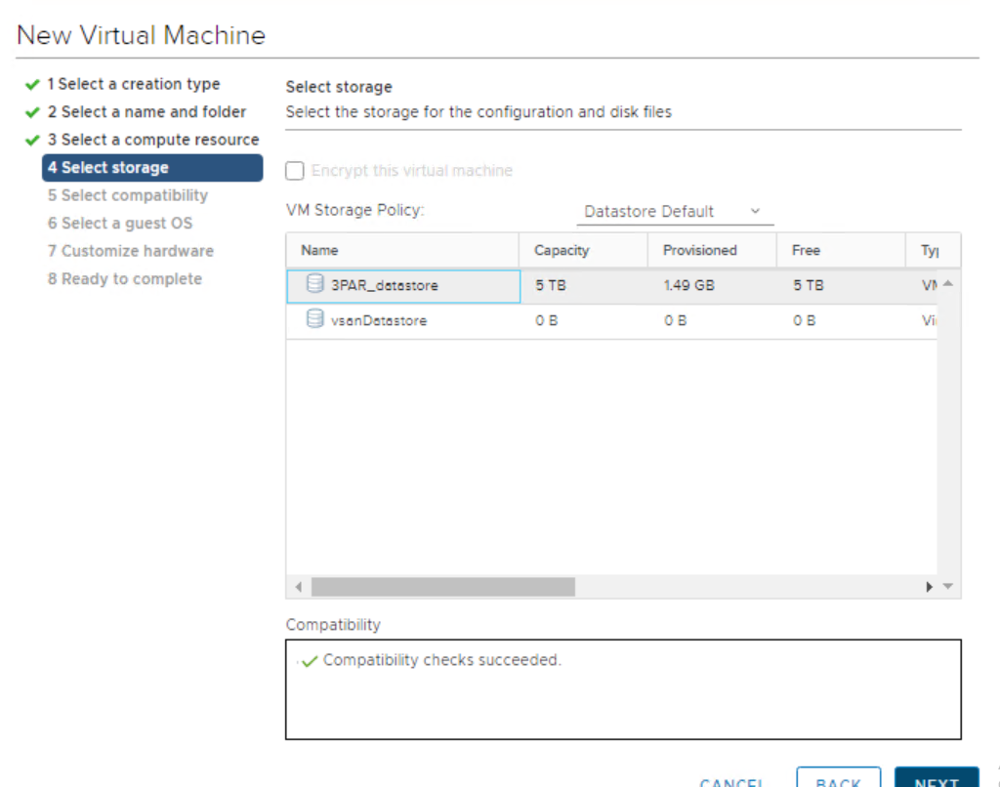

**Figure 52.** Console to provide the Storage configuration for the new
VM in vCenter

6) On the *Select compatibility* page, choose **ESXI 6.7 and later**
as illustrated in the Figure 53, and then click **Next.**

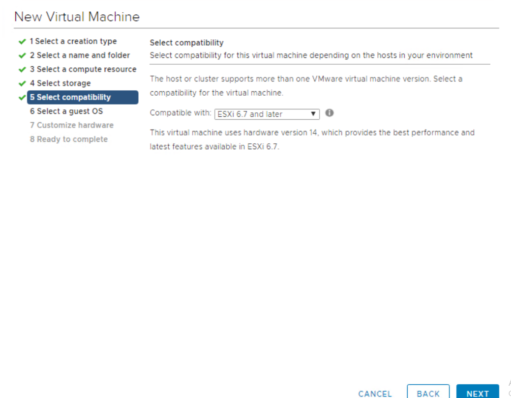

**Figure 53.** Console to provide the compatibility for the new VM in
vCenter

7) On the *Select a guest OS* page, choose the guest OS family
as**Linux** and Guest OS Version as **Red Hat Enterprise Linux 7 (64
bit)** as shown in Figure 54. Select **Next.**

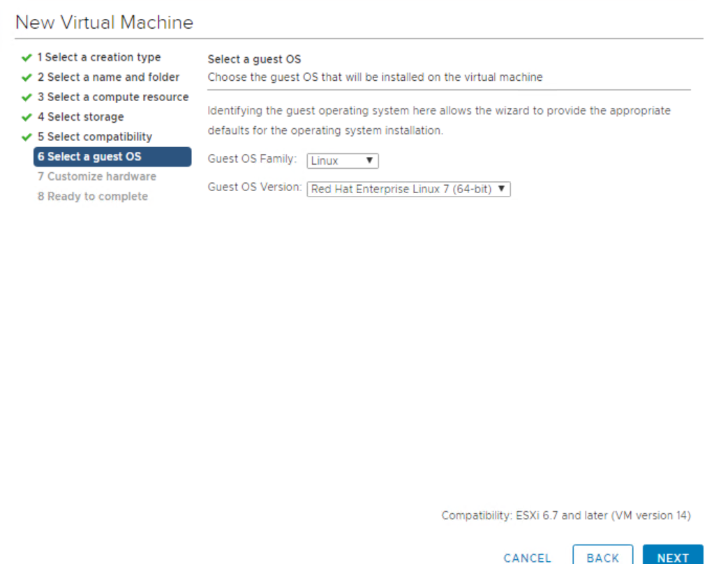

**Figure 54.** Console to provide the guest OS configuration for the VM
in the vCenter

8) At the *Customize hardware* page, configure the virtual hardware with
**4 vCPUs**, **16GB** Memory and two (2) **50GB** **Hard disks**. Attach
the Operating System ISO from the datastore. Select the **Connect
atPower on** option as shown in Figure 55 and then click **Next.**

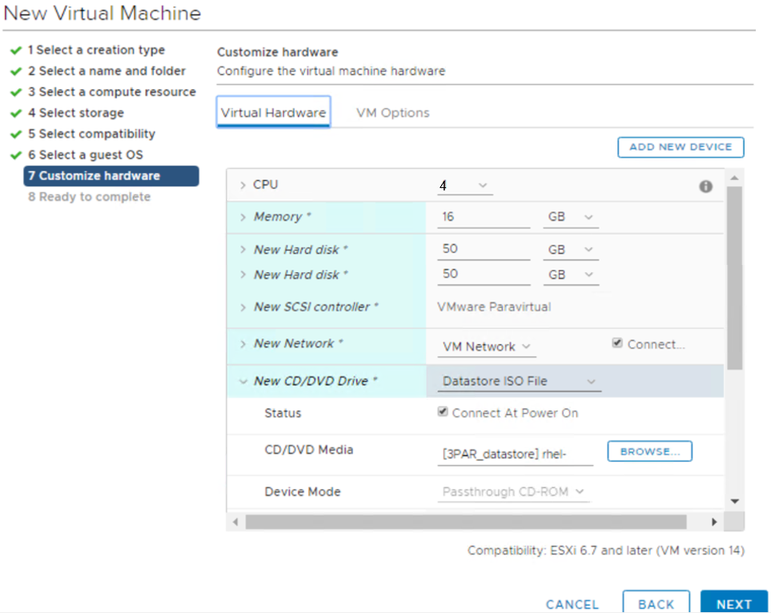

**Figure 55.** Customize the hardware for the VM in vCenter

9) Review the virtual machine configuration before deploying the virtual
machine and click **Finish** to complete the *New Virtual Machine*
wizard.

### RHEL installation

Once the new VM is created, install RHEL 7.6 to complete the creation
procedure. The following steps outline the process of RHEL guest
operating system installation.

1) Launch console of the newly created VM and select **Install Red Hat
Enterprise Linux 7.6.**

2) Select the desired language and click **Continue.**

3) From the *Installation Summary* page, configure the following:

a.  Select **Date & Time** and choose the system location and click
    **Done.**
b.  Select **Keyboard** and choose the language. Click **Done.**
c.  Select **Software** **Selection** and choose the desired software
    configuration. Click **Done.**
d.  Select **Installation Destination** and choose the internal disk.
    Click **Done.**
e.  Select **Network & Hostname**, configure the networking and hostname
    of the virtual machine and enable the network interface. Click
    **Done**.

4) Once the configurations in the *Installation Summary* page is
completed, select **Begin Installation**.

5) Set a root password for the host. Do not configure extra users and
click **Done.**

6) Once the OS installation is complete, reboot the host and wait for
its completion.

7) Once the host is rebooted, login with the root credentials.

8) Register the host, and attach the host to the pools with Red Hat by
running the following commands. You will be prompted for the Red Hat
subscription *username* and *password.*

```

# subscription-manager register

# subscription-manager --attach pool=<pool-id>

```

**NOTE**

Repeat the second command for each pool.

9) Disable all repos and then enable only the required repos by running
the following commands.

```

# subscription-manager repos --disable=*

# subscription-manager repos --enable=rhel-7-server-rpms

# subscription-manager repos --enable=rhel-7-server-extras-rpms

# subscription-manager repos --enable=rhel-7-server-ose-3.11-rpms

# subscription-manager repos --enable=rhel-7-fast-datapath-rpms

```

10) Update and reboot the host by running the following commands.

```

# yum update --y

# reboot

```

11) When the VM finishes rebooting, login at the console or via ssh.
Install VMware tools in the host by running the following commands:

a. Download the VMware tools .zip file from the VMware site at,
<https://my.vmware.com/web/vmware/details?downloadGroup=VMTOOLS1032&productId=742>
.

b. Unzip the VMware tools file, navigate to the vmtools directory and
find the Linux disc image file.

```

unzip <vmware tools zip file>

cd <path to vmtools directory>

```

c. Mount the CD image of VMware tools to this VM by executing the
following commands.

```

mkdir -p /mnt/cd /tmp/vmware

mount -o loop /dev/sr0 /mnt/cd

```

d. Copy the VMware tools archive from the mounted CD to local partition
by executing the following command.

```

cp /mnt/cd/< VMware tools tar.gz filename> /tmp/vmware

```

e. Extract the content of the VMware tools by executing the following
commands.

```

cd /tmp/vmware/

tar zxvf <VMware tools tar.gz filename>

```

f. Uninstall open-vm-tools and ensure dependency packages
*policycoreutils-python* exists by executing the following commands.

```

yum remove open-vm-tools

yum install policycoreutils-python

```

g. Install VMware tools by executing the following commands.

```

cd vmware-tools-distrib/

perl vmware-install.pl -d --f

```

h. Confirm the service is up and running by executing the following
command.

```

systemctl status vmware-tools

```

12) Unregister to the Red Hat subscription using the following command.

```

# subscription-manager unregister

```

### Convert the VM to a template

The following are the steps to convert the VM to a template:

1) Log in to vCenter and select the VM created to be converted to a
template.

2) From **Actions -> Power**, select **Power off** to power off the VM.

3) From *Actions*, select **Template**, and then select **Convert to
Template.**

## Deploy VMs from template

In order to clone from the template and create VMs for OpenShift
deployment, the user will need to edit the variables YAML file. Using an
editor such as Vim or Nano, open the file
*/etc/ansible/hpe-solutions-openshift/synergy/scalable/3par-vsphere/iscsi/roles/deploy_vm/vars/maim.yml*
. The variable file contains information about the VMs, vCenter,
hostnames, IP addresses, memory, and CPU. A sample variable file is
provided below, it is recommended to modify the file to make it suitable
to the installation environment.

```

# Name of the Datacenter

datacenter_name: datacenter

# Name of the compute clusters with the ESXi hosts for Management VMs
management_cluster_name: management-cluster

# Name of the compute clusters with the ESXi hosts for worker VMs

worker_cluster_name: worker-cluster

# Name of the Datastore to store the VMs

management_datastore_name: datastore01

worker_datastore_name: datastore02

# Name of the RHEL 7.6 VM template with VMware tools installed

vmtemplate: rhel

# Disk size in GB/GiB

master_disk: 100

infra_disk: 50

lb_disk: 50

worker_disk: 100

# number of CPUs

master_cpu: 4

infra_cpu: 4

lb_cpu: 4

worker_cpu: 4

# Memory in MB/MiB

master_memory: 16400

infra_memory: 25400

lb_memory: 16400

worker_memory: 16400

# datacenter network IP address of the masters, infra, lb and worker
nodes

master01_ip: 20.0.60.121

master02_ip: 20.0.60.122

master03_ip: 20.0.60.123

infra01_ip: 20.0.60.124

infra02_ip: 20.0.60.125

infra03_ip: 20.0.60.126

lb01_ip: 20.0.60.127

lb02_ip: 20.0.60.128

worker01_ip: 20.0.60.129

worker02_ip: 20.0.60.130

worker03_ip: 20.0.60.131

worker04_ip: 20.0.60.132

worker05_ip: 20.0.60.133

worker06_ip: 20.0.60.134

# iscsi_a network IP address of the masters, infra and worker nodes

master01_ip2: 30.0.60.121

master02_ip2: 30.0.60.122

master03_ip2: 30.0.60.123

infra01_ip2: 30.0.60.124

infra02_ip2: 30.0.60.125

infra03_ip2: 30.0.60.126

worker01_ip2: 30.0.60.129

worker02_ip2: 30.0.60.130

worker03_ip2: 30.0.60.131

worker04_ip2: 30.0.60.132

worker05_ip2: 30.0.60.133

worker06_ip2: 30.0.60.134

# iscsi_b network IP address of the masters, infra and worker nodes

master01_ip3: 40.0.60.121

master02_ip3: 40.0.60.122

master03_ip3: 40.0.60.123

infra01_ip3: 40.0.60.124

infra02_ip3: 40.0.60.125

infra03_ip3: 40.0.60.126

worker01_ip3: 40.0.60.129

worker02_ip3: 40.0.60.130

worker03_ip3: 40.0.60.131

worker04_ip3: 40.0.60.132

worker05_ip3: 40.0.60.133

worker06_ip3: 40.0.60.134

# name of the master, infra, lb and worker nodes < short names, not
the FQDN >

master01_name: master01

master02_name: master02

master03_name: master03

infra01_name: infra01

infra02_name: infra02

infra03_name: infra03

lb01_name: lb02

lb02_name: lb02

worker01_name: worker01

worker02_name: worker02

worker03_name: worker03

worker04_name: worker04

worker05_name: worker05

worker06_name: worker06

# network configuration details for the datacenter network

netmask: 255.0.0.0

gateway: 20.1.1.1

dns_server: 20.1.1.254

domain_name: "twentynet.local"

# netmask for the iSCSI networks

netmask_iscsi_a: 255.255.0.0

netmask_iscsi_b: 255.255.0.0

# Network names for the datacenter/management, iSCSI A and iSCSI B
networks

datacenter_network_name: "VM Network"

iscsi_a_network_name: "iSCSI-A"

iscsi_b_network_name: "iSCSI-B"

```

**NOTE**

The playbook supports virtual worker nodes along with other management
VMs. If physical worker nodes will be used ignore the variables
corresponding to virtual worker nodes. Otherwise, it is advised to
review the main.yml task file found at,
*/etc/ansible/hpe-solutions-openshift/synergy/scalable/3par-vsphere/iscsi/roles/deploy_vm/tasks*
before executing the deploy_vm.yml playbook.

When the user has completed editing the variable file, execute the
following command in the Ansible Engine to deploy all the VMs specified.

```

# ansible-playbook
/etc/ansible/hpe-solutions-openshift/synergy/scalable/3par-vsphere/iscsi/playbooks/deploy_vm.yml

```

After the VMs are created, SSH into each and update their hostnames to
their fully-qualified domain names with the command listed below:

```

# hostnamectl set-hostname <fqdn as hostname of the virtual machine>

```

**NOTE**

This solution is built to deploy Six (6) virtual/physical worker nodes.
It is up to the user to adapt the playbooks in case of
increasing/decreasing the number of worker nodes.

# Deploying worker nodes

The worker nodes will be deployed and customized using HPE Synergy Image
Streamer while ensuring that the required storage volumes are created
and attached. This section outlines the steps required to install the
host. At a high level, these steps can be described as follows:

1) Download the artifacts for HPE Image Streamer from the HPE GitHub
site.

2) Add the artifact bundles to HPE Image Streamer.

3) Build a worker node image.

3) Capture a Golden Image.

4) Copy and edit the OS Build Plan.

5) Create a Deployment Plan.

6) Create the Server Profile template.

7) Deploying the worker nodes.

8) Worker Host configuration.

## Download the artifacts for HPE Synergy Image Streamer

The foundation artifact bundle for HPE OneView 5.0 can be downloaded
from
<https://github.com/HewlettPackard/image-streamer-tools/tree/v5.0/foundation/artifact-bundles>
and Red Hat Enterprise Linux bundles for HPE Image Streamer can be
downloaded from
<https://github.com/HewlettPackard/image-streamer-rhel/tree/v5.0/artifact-bundles>
.

## Add the artifact bundles to HPE Image Streamer

The steps to add the artifact bundles to HPE Image Streamer are as
follows:

1) From the HPE Image Streamer interface, navigate to the artifact
bundles page.

2) From the **Actions** menu, add the downloaded **RHEL artifact
bundle**. If not already present, add the sample foundation bundle.

3) From the **Actions** menu, select **Extract** to extract the
artifacts from each downloaded bundle.

## Prepare the compute module for the installation of the Operating System

The steps to prepare the compute module for the installation of the
Operating System are as follows:

1) Attach a Red Hat Enterprise Linux version 7.6 Server ISO image to the
iLO via Virtual Media, select the **Action** menu and then **Launch
Console**.

2) When the console launches, select **VirtualDrives** and then **Image
File** **CD**-**ROM/DVD**. Browse to the location where your ISO resides
and select it.

## Build a worker node image

In order to create a worker node image, follow the steps below:

1) Create a temporary **Server Profile** and attach it to a host. Adjust
the following settings.

a) Create a **40GB (40960 MB) Image Streamer volume** that will be used
to install RHEL by selecting **HPE-Create Empty volume** from the OS
deployment plan drop-down list.

b) Configure the connections in the following order:

i. Deployment1 - 1GB primary boot

ii. Deployment2 - 1GB secondary boot

iii. Management_A - 2GB

iv. Management_B - 2GB

v. Datacenter_A - 9GB

vi. Datacenter_B - 9GB

vii. ISCSI_A - 8GB

viii. ISCSI_B - 8GB

c) Configure the boot settings:

i. UEFI Optimized for Boot mode

ii. Secure boot disabled

iii. Manage boot order

iv. Primary boot device: Hard disk

2) Once complete, **apply** the profile to a **single host** and select
**Create**.

3) From the *Actions* drop down found on the server profile's OneView
page, select **Launch console**.

4) Attach the RHEL 7.6 image and select *Power Switch* and then
**Momentary Press**.

5) When the screen shown in Figure 56 pops up, select**Install Red Hat
Enterprise Linux 7.6 and** then press ' **e'** on the keyboard.

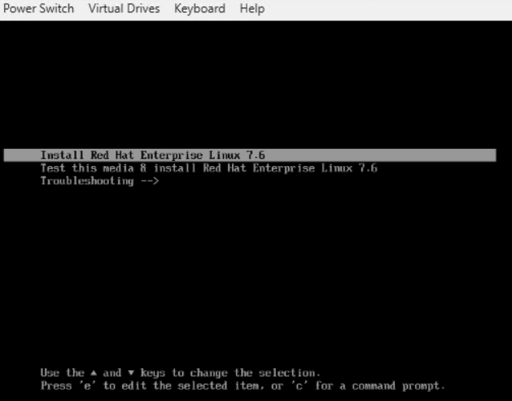

**Figure 56.** Selecting the OS to install

6) Append the following to the install kernel boot parameter as in
Figure 57: **rd.iscsi.ibft=1**

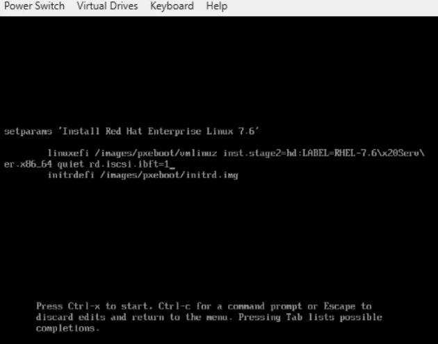

**Figure 57.** Editing the kernel boot parameter

7) Press **Ctrl-x** to continue the boot process.

8) When the user screen appears, ensure you select your local language,
set the date and time, keyboard layout and language support. When done,
select **Installation Destination**.

9) At the *Installation Destinati*on screen, select **Add a disk** and
then choose the 40 GiB volume from HPE Image Streamer as in Figure 58.
Click **Done** once the disk has been selected.


**Figure 58.** Image Streamer volume as seen within the installation
destination screen

10) Under *Other Storage Options*, select**I will configure
partitioning** and then click **Done.**

11) At the *Manual Partitioning* screen, click **Select here to create**
**them automatically**. This will display a new *Manual Partitioning*
screen.

12) Highlight the */boot* partition and on the right side of the page
select **ext4** as the filesystem. Click **Update Settings.**

13) Highlight the */* partition on the right side of the screen and
reduce the *Desired Capacity* to **18 GiB** and then choose **ext4** as
the filesystem. Click **Update Settings.**

14) Highlight the *swap* partition on the right side of the screen,
change Desired Capacity from 3000 MiB to **4096 MiB**. Click **Update
Settings.**

15) Click '**+**' below the list of partitions. For mount point, select
**/var** from the dropdown and leave the *Desired Capacity* blank. This
will allow the /var partition to use all remaining space.

16) At the *Manual Partitioning* screen, highlight the /var partition
and choose **/ext4** for the File System. Click **Update Settings.** The
screen should appear as in Figure 59.

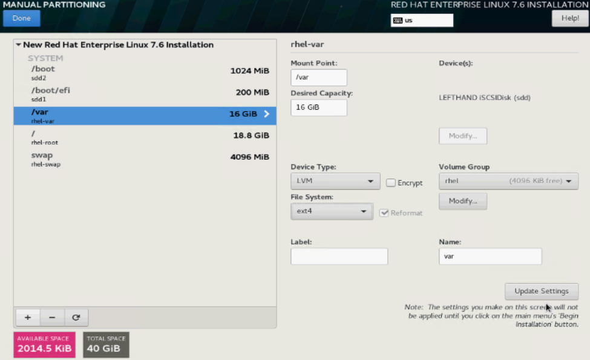

**Figure 59.** Customizing disk partitions

17) Once you have validated the file systems and partition sizes are
correct, click **Done.**

18) When prompted, select **Accept Changes.**

19) Select the *Network & Hostname* link. At the resulting screen,
highlight **Ethernet (ens3f4)** and set it to **'ON'** in the descriptor
screen as in Figure 60. Provide a temporary hostname for the host and
click **Done.**

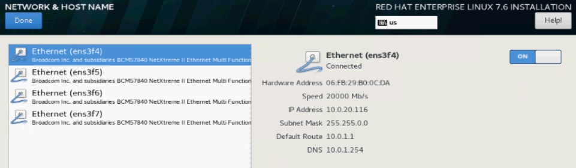

**Figure 60.** Customizing disk partitions

20) Select **Begin Installation**.

21) When prompted, set a root password for the host. Do not configure
extra users and click **Done**.

22) Once the OS installation is complete you can reboot the host.

23) When the host completes rebooting, log on as *root* at the iLO
console.

24) Register the host, and attach the host pool with Red Hat by running
the following command. You will be prompted for the Red Hat subscription
*username* and *password.*

```

# subscription-manager register

# subscription-manager --attach pool=<pool-id>

```

Repeat the command for each pool.

25) Disable all repos and then enable only the required repos by running
the following commands.

```

# subscription-manager repos --disable=*

# subscription-manager repos \\

--enable=rhel-7-server-rpms \\

--enable=rhel-7-server-extras-rpms \\

--enable=rhel-7-server-ose-3.11-rpms \\

--enable=rhel-7-fast-datapath-rpms

```

26) Install teamd by running the following command.

```

# yum install teamd --y

```

27) Update and reboot the host by running the following commands

```

# yum update --y

# reboot

```

28) Once the host has restarted, log on as the root user and open the
appropriate firewall ports by running the following commands.

```

# firewall-cmd --add-port=3260/tcp --permanent

# firewall-cmd --add-port=4789/udp --permanent

# firewall-cmd --add-port=8053/udp --permanent

# firewall-cmd --add-port=8053/tcp --permanent

# firewall-cmd --add-port=443/tcp --permanent

# firewall-cmd --add-port=8443/tcp --permanent

# firewall-cmd --add-port=10250/tcp --permanent

# firewall-cmd --add-port=53/tcp --permanent

# firewall-cmd --add-port=53/udp --permanent

# firewall-cmd --reload

```

29) Verify your settings by running the following command.

```

# firewall-cmd --list-all

```

30) Create the following directories.

```

# mkdir /boot/efi/EFI/HPE

# mkdir --p /boot/efi/EFI/HPE/isdeploy

# mkdir --p /boot/efi/EFI/HPE/isdeploy/scripts

# mkdir --p /boot/efi/EFI/HPE/isdeploy/tmp

# mkdir --p /boot/efi/EFI/HPE/isdeploy/data

```

31) Modify */etc/rc.d/rc.local*. Add the line */boot/efi/EFI/HPE/isdeploy/HPE-ImageStreamer.bash*.

```

# vi /etc/rc.d/rc.local

```

32) Change permission of the *rc.local* file.

```

# chmod 755 /etc/rc.d/rc.local

```

33) Ensure you remove subscriptions from the host and unregister it.
Gracefully shut down the host.

```

# subscription-manager unregister

# shutdown -h now

```

## Capture a golden image from compute module

Utilize the build plan *HPE - Foundation 1.0 - capture OS Volume as
is-2017-03-24* to capture the golden image from the host just created.
To do this, follow these steps:

1) From within the HPE OneView interface, highlight the *Server Profile*
and scroll in the right window until you see the OS volume listed under
OS Deployment. Record the ID of the volume.

2) From the OneView drop down select **OS Deployment Servers** and
launch the *Image Streamer UI* by selecting its IP address.

3) From within the HPE Image Streamer UI, select **Golden Image**
and then **Create** **golden image**. Fill in the information as in the
example in Figure 61 and then click **Create.**

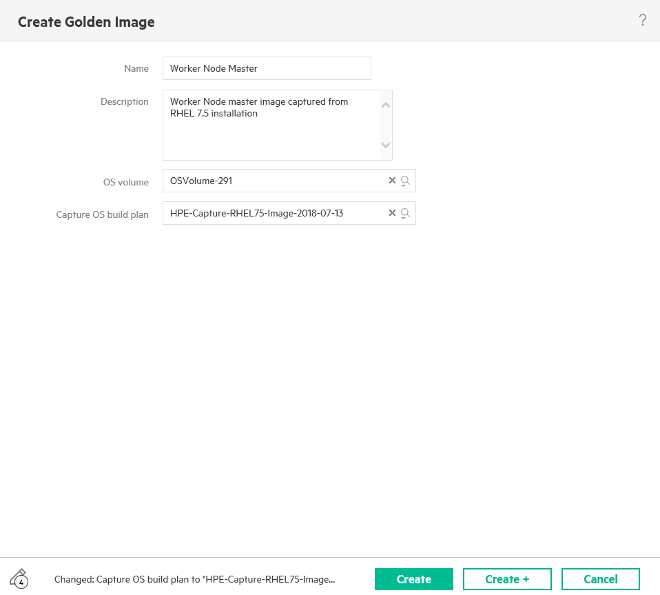

**Figure 61.** Create golden image

4) Once the image has been successfully captured, return to the
OneView interface and delete the Server Profile from the host you used
to capture the image. You can ignore the warning that the volume will be
deleted. This is deleting the original volume that was used to install
the Operating System, but the golden image will remain intact.

## Copy and edit the OS build plan

1) From within the Image Streamer UI, select **OS Build Plans** from the
**Image Streamer** drop-down list.

2) Select the
**HPE-RHEL7-EFI-personalize-and-configure-NIC-teamings-LVM-2019-06-07**
build plan from the Actions menu, select **Copy.**

3) Assign a **name** to the new plan. It is recommended to add the
current date or another unique identifier that will help quickly
identify the copy being used.

4) Under Custom attributes, select **Team1NIC1** and select the **edit
icon**.

5) **Check** the box **Allow no network connection** as shown in Figure
62 and click **OK**.

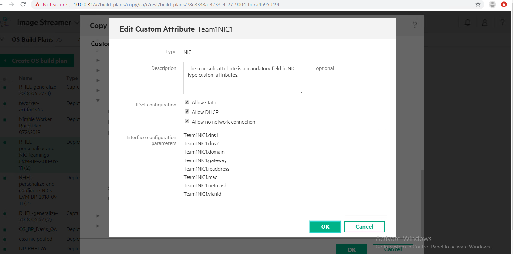

**Figure 62.** Edit custom attribute for OS build plan screen

6) Repeat this process for Team1NIC2.

7) Click **OK** when done.

## Create a deployment plan

The following steps should be used to create a deployment plan that will
be used to deploy the worker nodes.

1) Create a **deployment plan** **f**rom within the Image Streamer
interface by selecting **Image Streamer > Deployment Plans > Create
Deployment Plan** .

2) Assign a name to the deployment plan, provide a description and then
select the OS build plan you created in the prior step as in Figure 63.
This is the build plan the installer created in the prior section, so
the name will be what was chosen at that time.

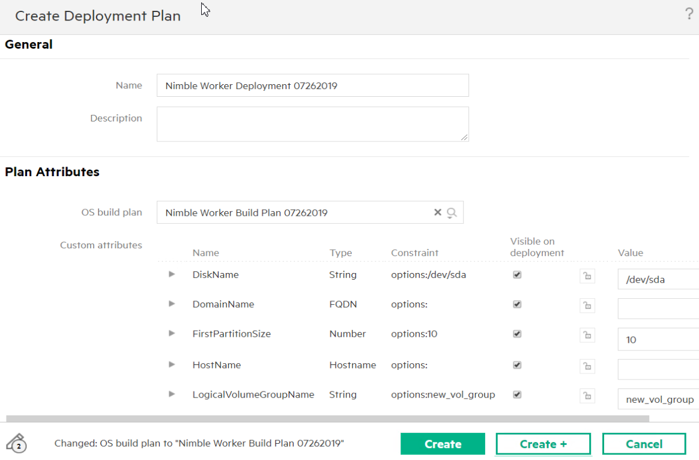

**Figure 63.** Create deployment plan screen from within image streamer

3) In the Golden Image drop-down, select the golden image created in the
**Capture a Golden image from the compute module** section in the golden
image drop-down.

4) Select **Create** to finish creating the deployment plan.

## Create the Server Profile template

1) From the OneView drop-down list, select **Server Profile Templates >
Create Server Profile template** .

2) Assign a name and description to the profile and then select the
appropriate **Server hardware type** *and* **Enclosure group***.*

3) Select the **OS Deployment plan** you created from the drop-down
list.

4) Scroll to *Connections* and add the following connections in order
(you will see two deployment network connections in place prior to
adding these networks). **Click Add+** until the final network is added
and then click **Add** for the final network.

a) Management_a, ethernet, select your management network, 2Gb.

b) Management_b, ethernet, select your management network, 2Gb.

c) Datacenter_a, ethernet, select your dc net, 9Gb.

d) Datacenter_b, ethernet, select your dc net, 9Gb.

e) Iscsi_a, ethernet, iSCSI_SAN_A for the network, 8Gb.

f) Iscsi_b, ethernet, iSCSI_SAN_B, 8Gb.

5) Edit the management connections and set the bandwidth to either 1Gb
or 2Gb as shown in Figure 64.

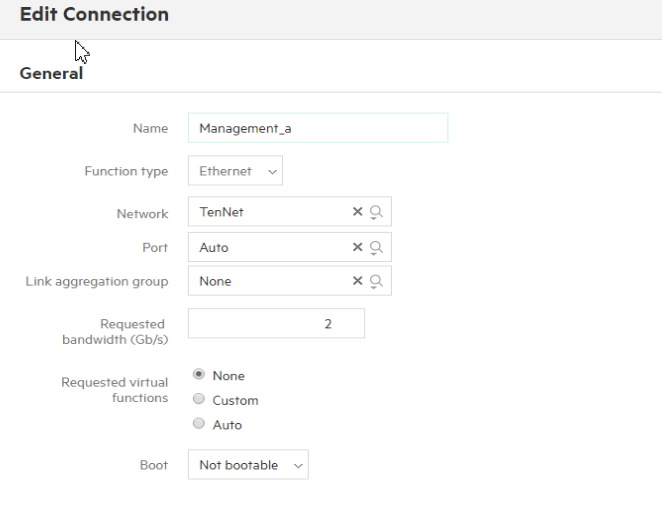

**Figure 64.** Server Profile template edit connection screen

6) Return to the deployment settings and customize the following
settings.

a) Enter a *NewRootPassword* and confirm it.

b) Create a new, non-root user and password.

c) For Team0NIC1 select Management_a and select the radio button
User-specified. Fill in the network information requested.

d) For Team0NIC2 select Management_b and select the radio button
User-specified.

e) For Team1NIC1 select Datacenter_a and select the radio button
User-specified. Fill in the data center network details.

f) For Team0NIC2 select Datacenter_b. and select the radio button
User-specified.

7) Leave *HostName* blank.

8) Fill in any RBSU customizations and then select **Create.**

## Deploying the worker nodes

1) To deploy a new Server Profile from template to the worker node,
navigate to Server Profile from OneView and select **Create profile**.
Ensure that the deployment plan that you created is selected from the
drop-down list in the OS Deployment portion of the Server Profile.

2) Fill in the remaining settings as in *Figure 65*, inserting
appropriate values. For IPv4 address, you should enter management
network and data center network IPs. Enter the *hostname*. When
complete, click **Create.**

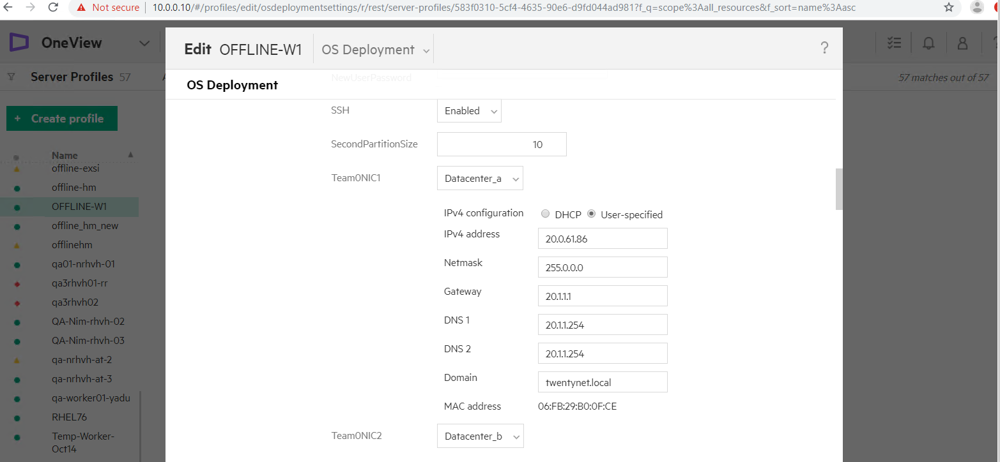

**Figure 65.** OS Deployment section under Server Profile

3) Repeat the steps for all worker nodes and ensure that each node is
*powered on* once the profile is deployed.

## Worker host configuration

The remaining host configuration is handled via Ansible playbooks. The
plays for this section is included in the earlier clone from GitHub.
This section describes the plays within the context of the directory
they are found.

Configuration of the worker nodes is handled by the *nworkers* and
*nworkerconf* configuration roles within the repository. These roles and
the accompanying plays consist of the following files:

Ansible directory root files are:

-   ***hosts*** **-** this file contains the definition of the hosts
    that will be used within the solution as well as variables for
    networking and iSCSI iqn. This is the same file that exists for the
    hypervisor hosts.
-   ***playbooks/nworkers.yaml*** **** - this file is used to run the
    plays that register and update the host as well as to create the
    user who will be responsible for installing OpenShift Container
    Platform.
-   ***playbooks/nworkconf.yaml*** - this file is used to run the plays
    that configure the Docker environment, start services, configure the
    network connections for the host, alter the IQN, and bring up the
    networks.

The user should configure variables within the hosts file and within the
individual variable files (*roles/nworkers/vars/main.yaml* and
*roles/nworkerconf/vars/main.yaml*) on a per role basis prior to running
the play.

### Running the roles

1) From the Ansible Engine host, run the following commands to finalize
the deployment of the worker nodes.

```

# cd
/etc/ansible/hpe-solutions-openshift/synergy/scalable/3par-vsphere/iscsi/

# ansible-playbook --i hosts playbooks/nworkers.yaml ---ask-vault-pass

```

2) Once the play is complete and the hosts are restarted, SSH into one
of the worker nodes and run the following command.

```

# subscription-manager status

```

You should see a return that tells you the status is current.

3) From the Ansible Engine host, run the following command.

```

# ansible-playbook --i hosts playbooks/nworkerconf.yaml
--ask-vault-pass

```

4) Once the play is complete and the hosts are restarted, run the
following commands from the Ansible Engine host.

```

# ping <iscsi A address>

# ping <iscsi B address>

# ping <data center bond IP>

```

5) After the remote hosts reboot, run the following command from the
Ansible Engine host.

```

# ping <management bond IP>

```

# Red Hat OpenShift deployment

This section describes the process to deploy Red Hat OpenShift
version 3.11. Prior to installation, ensure you have internet connection
and access to HPE GitHub site at, <https://github.com/hewlettpackard>

## Prerequisites

In order to utilize the scripts and procedures documented in this
deployment section, the following prerequisites must be met:

1) Ansible Engine should be installed and configured and capable of
communicating with the hosts within this solution.

2) VMware vSphere Virtualization Host is installed on at least three HPE
Synergy 480 Gen10 Compute Modules.

3) vSphere hosts have been configured into a cluster.

4) Storage and networking are configured within hosted engine.

5) DNS entries should exist for all hosts.

6) A user should be created in Active Directory (AD) for authentication
and the user AD values should be known.

**NOTE**

In case htpasswd is used for authentication, an **htpasswd** file should
be created. An htpasswd file can be created using the tool available at,
<http://www.htaccesstools.com/htpasswd-generator/> . Save the file to
*/etc/oshift-hash-pass.htpasswd* and refer this file in the identity
provider section under OpenShift variables in the host file.

```

# openshift_master_identity_providers=[{'name':
'htpasswd_auth', 'login':'true', 'challenge':
'true','kind': 'HTPasswdPasswordIdentityProvider',}]

```

### Generate a Key

1) On the Ansible Engine, run the following command to generate a key.

```

# ssh-keygen -t rsa

This creates a key file at \~/.ssh/id_rsa.pub.

```

2) Copy this SSH public key to /var and change the permission using the
following commands.

```

# cp /root/.ssh/id_rsa.pub /var/id_rsa.pub

# chmod 666 /var/id_rsa.pub

```

The variables for the OpenShift deployment are maintained in the Ansible
inventory file, */etc/ansible/hosts*. Review the sample hosts file
provided in the GitHub repository for this solution located at,
<https://github.com/HewlettPackard/hpe-solutions-openshift/tree/master/synergy>
.

## Authentication

With Red Hat OpenShift Container Platform, master nodes include a
built-in OAuth 2.0 server. Users obtain OAuth access tokens to
authenticate themselves to the API. When a user requests a new OAuth
token, the OAuth server uses the configured identity provider to
determine the identity of the person making the request. It then
determines user identity and then creates an access token for that user,
and returns the token for use.

In this solution, identity provider with OAuth can be implemented with
LDAP or htpasswd. As a best practice, this solution configures the
identity provider during the cluster installation.

### LDAP

LDAP user authentication is the process of validating user credentials
with a directory server such MS Active Directory, OpenLDAP or other
compliant server. LDAP directories are standard technology for storing
user, group and permission information and serving that to applications
in the enterprise.

To implement OAuth using LDAP, a user should be created in Active
Directory (AD) for authentication and the user AD values should be known
and the following line is to be included in the inventory file used for
the Red Hat OpenShift Container Platform installation.

```

# LDAP authentication\
#openshift_master_identity_providers=[{'name':
'my_ldap_provider', 'challenge': 'true', 'login': 'true',
'kind': 'LDAPPasswordIdentityProvider', 'attributes': {'id':
['dn'], 'email': ['mail'], 'name': ['cn'],
'preferredUsername': ['uid']}, 'bindDN': '', 'bindPassword':
'', 'insecure': 'false', 'url':
'ldap://ldap.example.com:389/ou=users,dc=example,dc=com?uid'}]

```

### Htpasswd

htpasswd is used to create and update flat-files that store user
credentials for authentication of HTTP users.

The htpasswd file contains usernames in plain text (unencrypted) and a
hashed (encrypted) password. Each line contains a username and a
password separated by a colon ":". The password is hashed using a
complex algorithm. The htpasswd generator used in this solution uses MD5
encryption algorithm.

In cases where htpasswd is used for authentication:

- An htpasswd file should be created using the tool linked earlier in
the document.

- Save the file to */etc/oshift-hash-pass.htpasswd* and refer this file in the identity provider section under OpenShift variables in the host file.

- Include the following line in the inventory file used for the Red Hat OpenShift Container Platform installation.

```

# htpasswd auth\
openshift_master_identity_providers=[{'name': 'htpasswd_auth',
'login': 'true', 'challenge': 'true', 'kind':
'HTPasswdPasswordIdentityProvider'}]

# Defining htpasswd path\
#openshift_master_htpasswd_file=<path to local pre-generated
htpasswd file>

```

With OAuth, authorization to external applications is easier and it
enables using a single account to authenticate multiple applications
like internal container registry, Jenkins and Prometheus which in turn
makes permission management faster and simpler.

## OpenShift prerequisites
This section covers the prerequisites that should be fulfilled prior to installing Red Hat OpenShift Container Platform.

### Install prerequisites for OpenShift installation on the virtual machines and worker nodes

The plays in this section prepare the hosts for OpenShift installation.
Two Ansible roles *(roles/virtual-host-prepare/ and
roles/physical-host-prepare/)* are available for preparing the
management virtual machines and physical worker nodes.

1) Edit the files *roles/virtual-host-prepare/vars/main.yml* and
*roles/physical-host-prepare/vars/main.yml* in a text editor such as vi
or nano and enter the path to the second disk.

2) For VMs created by running the *deployVM.yml* play, the default
location of the second disk is */dev/vdb* and is already updated in the
variable file available at *roles/virtual-host-prepare/vars/main.yml.*
The line in the file reads as below.

```

*second_disk_vms: /dev/vdb*

```

3) For physical worker nodes created as per the Red Hat OpenShift worker
nodes section, the default location of the second disk is
*/dev/mapper/mpatha* and is already updated in the variable file
available *at roles/physical-host-prepare /vars/main.yml.* The line in
the file reads as below.

```

*second_disk_physical: /dev/mapper/mpatha*

```

**NOTE**

To find pool IDs for the management and worker VMs, execute the
following command and look for *System Type* as **Virtual**.

```

# subscription-manager list --available --matches '*OpenShift*'

```

The host prepare plays are *physical-hostprepare.yml* and
*virtual-hostprepare.yml* are located at,
*/etc/ansible/hpe-solutions-openshift/synergy/scalable/3par-vsphere/iscsi/playbooks*
. They accomplish the following tasks.

1) Disables the firewall for the OpenShift installation. This will be
re-enabled post installation.

2) Creates a user group with password-less sudo rights.

3) Creates a sudo user and adds the user to the password-less sudo
group.

4) Uploads the public SSH key to allow secure access without
credentials.

5) Registers the host using subscription manager.

6) Enables the required repositories.

7) Installs the basic utilities.

8) Performs a yum update to ensure the latest patches and updates are
applied.

9) Installs Red Hat OpenShift related packages.

10) Installs the latest version of Docker which should be at 1.13-94 or
above.

11) Configures Docker local storage.

12) To prepare virtual machines, execute the following command on the
Ansible Engine host.

```

# cd
etc/ansible/hpe-solutions-openshift/synergy/scalable/3par-vsphere/iscsi

# ansible-playbook --i hosts playbooks/virtual-hostprepare.yml
--ask-vault-pass e\@vault_pass.yml

```

13) To prepare physical worker nodes, execute the following command on
the Ansible Engine host.

```

# ansible-playbook --i <path of hosts>/hosts
playbooks/physical-hostprepare.yml --ask-vault-pass

```

**NOTE**

Installation of Red Hat OpenShift Container Platform 3.11 requires
Ansible version 2.6. For deactivating the virtual environment and
installing Ansible 2.6, execute the following commands on the Ansible
Engine.

```
# deactivate

# yum install ansible

```

### OpenShift-Ansible

The following Ansible playbooks deploy Red Hat OpenShift Container
Platform on the machines that have been created and configured by the
previous Ansible playbooks. In order to get the OpenShift-Ansible
playbooks from the *'Red Hat OpenShift Container Platform 3.11'*
repository, run the following command:

```

# yum install openshift-ansible

```

Install OpenShift
-----------------

From the Ansible Engine host, run the *prerequisites.yml*
and*deploycluster.yml* playbooks that are located *in
/usr/ansible/openshift-ansible/playbooks/* on the Ansible host.

1) Run the
*/usr/share/ansible/openshift-ansible/playbooks/prerequsites.yml*
playbook.

```

# ansible-playbook -i
/etc/ansible/hpe-solutions-openshift/synergy/scalable/3par-vsphere/iscsi/hosts
/usr/share/ansible/openshift-ansible/playbooks/prerequisites.yml

```

2) Run the */usr/share/ansible/openshift-ansible/playbooks/deploy_cluster.yml* playbook.

```

# ansible-playbook -i
/etc/ansible/hpe-solutions-openshift/synergy/scalable/3par-vsphere/iscsi/hosts
/usr/share/ansible/openshift-ansible/playbooks/deploy_cluster.yml

```

3) When the deployment is complete, the user may access the OpenShift
webpage, as shown in Figure 66. Use the credentials provided in the
htpasswd file or LDAP. The URL for the webpage is *https://<load
balancer>:8443.*

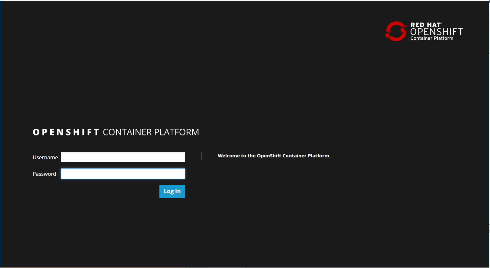

**Figure 66.** OpenShift user interface

# Install 3PAR Docker plugin

This section outlines the installation and validation of the HPE 3PAR
volume plug-in for Docker for OpenShift environment.

## Clone 3PAR Docker plugin repo

Ansible is installed by default on the master nodes within the solution.
This section focuses on cloning repos and running commands from one of
the master nodes. 

1) Choose the master node to use for cloning and
configuring the HPE 3PAR Docker plugin, log on to the system over SSH or
at the console and run the following commands.

```

# cd /etc/ansible

# git clone
<https://github.com/hpe-storage/python-hpedockerplugin/tree/master/ansible_3par_docker_plugin>

```

2) Pull the tagged images *hpestorage/legacyvolumeplugin:3.0" &
"hpestorage/legacyvolumeplugin:3.1* on the master node. To pull these
images, execute the following command on the master node.

```
# docker pull
<registry_server_fqdn>:5000/hpestorage/legacyvolumeplugin:3.1

# docker pull
<registry_server_fqdn>:5000/hpestorage/legacyvolumeplugin:3.0
```

3) The HPE 3PAR Docker volume plugin user deploys a separate etcd cluster
on the master nodes alongside the built-in OpenShift/Kubernetes etcd
instance. This is done to store the Docker and HPE 3PAR volume metadata
in order to prevent tainting the *OpenShift/Kubernetes* *etcd instance*.
The appropriate *etcd* ports have been modified in order to eliminate
conflicts.

4) The user should read the README.md file found at,
<https://github.com/hpe-storage/python-hpedockerplugin/tree/master/ansible_3par_docker_plugin>
and follow the instructions within the file.

5) Edit the HPE 3PAR Docker volume plugin host file using a vi editor to
match your environment.

```
# cd /etc/ansible/ansible_3par_docker_plugin

# vim /etc/ansible/ansible_3par_docker_plugin/hosts
```

6) Create the entries for the master, worker and infrastructure nodes in the
inventory file. A sample input to the inventory file is provided below. It is expected that the installer will need to adapt the file to the installation environment.

```

[masters]

<master1_fqdn>

<master2_fqdn>

<master3_fqdn>

[workers]

<virtualworker1_fqdn>

<virtualworker2_fqdn>

<virtualworker3_fqdn>

<virtualworker4_fqdn>

<virtualworker5_fqdn>

<virtualworker6_fqdn>

[etcd]

<infra1_fqdn>

<infra2_fqdn>

<infra3_fqdn>

```

7) Edit or Create file with the name *plugin_configuration_properties.yml* under in the path */etc/ansible/python-hpedockerplugin/ansible_3par_docker_plugin/properties* using vi or vim editor and update the file with below content:

```
INVENTORY:

DEFAULT:

# Mandatory
Parameters---------------------------------------------------------------

# Specify the port to be used by HPE 3PAR plugin etcd cluster

host_etcd_port_number: 23791

# Plugin Driver - iSCSI

hpedockerplugin_driver:
hpedockerplugin.hpe.hpe_3par_iscsi.HPE3PARISCSIDriver

hpe3par_ip: <3par storage management adapter IP address>

hpe3par_username: <3par storage username>

hpe3par_password: <3par storage password>

hpe3par_cpg: SSD_r6

# Plugin version - Required only in DEFAULT backend

volume_plugin: hpestorage/legacyvolumeplugin:3.0

# Dory installer version - Required for Openshift/Kubernetes setup and
the supported versions are dory_installer_v31, dory_installer_v32

dory_installer_version: dory_installer_v32

# Optional
Parameters----------------------------------------------------------------

logging: DEBUG

3PAR1:

# Mandatory
Parameters------------------------------------------------------------

# Specify the port to be used by HPE 3PAR plugin etcd cluster

host_etcd_port_number: 23791

hpedockerplugin_driver:
hpedockerplugin.hpe.hpe_3par_iscsi.HPE3PARISCSIDriver

hpe3par_ip: <3par FQDN/IP address>

hpe3par_username: <3par username>

hpe3par_password: < 3par password>

hpe3par_cpg: SSD_r6

# Optional
Parameters----------------------------------------------------------------

logging: DEBUG

hpe3par_snapcpg: SSD_r6

```

8) Edit the *etcd_cluster_properties.yml* found at
*/etc/ansible/python-hpedockerplugin/ansible_3par_docker_plugin/properties*
with a text editor such as Vim or Nano and update the file with the following line.

```

etcd_client_port_1: 23791

```

9) Once the required files are updated, run the following command on the
master node to create the etcd cluster and configure the HPE 3PAR Docker
plugin.

```

# ansible-playbook -i /etc/ansible/ansible_3par_docker_plugin/hosts
/etc/ansible/ansible_3par_docker_plugin/install_hpe_3par_volume_driver.yml

```

10) After running the play, restart the OpenShift node services by running the following command.

```

# systemctl restart atomic-openshift-node

```

**NOTE**

**If the status of doryd.service is failed or not running, update doryd
license in** */etc/systemd/system/doryd* **.service file with the
following content.**

```

[Unit]

Description=manage doryd service for HPE 3PAR Volume plugin for Docker

[Service]

Type=simple

ExecStart=/usr/libexec/kubernetes/kubelet-plugins/volume/exec/hpe.com\~hpe/doryd/etc/origin/master/admin.kubeconfig
hpe.com

#ExecStart=/usr/libexec/kubernetes/kubelet-plugins/volume/exec/hpe.com\~hpe/doryd/etc/kubernetes/admin.conf
hpe.com

Restart=on-abort

[Install]

WantedBy=multi-user.target

```

## Activate doryd service

On the master node, execute the following command to reload and activate
the doryd service.

```

# systemctl daemon-reload

# systemctl start doryd.service

```

## Validate the doryd service

To verify if the doryd service is active, login to the master node and
execute the following command. If the result of the command is active,
doryd service is active in the OpenShift environment.

```

# systemctl status doryd.service

```

# Deploy Docker registry with persistent storage

An integrated Docker registry is created along with the OpenShift
installation. This registry pod will be running in the namespace
'default'. Running the following play will check if the Docker registry
is running and, if it is not, it will create an integrated Docker
registry. If the Docker registry is running with an ephemeral volume,
this play will create a PVC and attach the persistent volume to the
registry pod.

1) Execute the following playbook from the Ansible Engine.

```

# ansible-playbook -i
/etc/ansible/hpe-solutions-openshift/synergy/scalable/3par-vsphere/iscsi/hosts
/etc/ansible/hpesolutions-openshift/synergy/scalable/3par-vsphere/iscsi/playbooks/deployment_validation.yaml

```

2) The following message confirms the success of the deployment.

*"Validations are done successfully"*

3) In the case of disconnected installation as covered later in this document,
execute the following playbook from the Ansible Engine.

```

# ansible-playbook -i
/etc/ansible/hpe-solutions-openshift/synergy/scalable/3par-vsphere/iscsi/disconnected/hosts
/etc/ansible/hpesolutions-openshift/synergy/scalable/3par-vsphere/iscsi/disconnected/playbooks/deployment_validation.yaml

```

**NOTE**

If the persistent volume status is not bound, restart the API,
controllers and atomic-openshift-node.service.

```

# master-restart api api

# master-restart controller

# systemctl restart atomic-openshift-node.service

```

# Prometheus cluster monitoring

To enable Prometheus cluster monitoring use the inventory variables and
playbook shown below. This uses persistent storage to record metrics to
a persistent volume and can survive a pod being restarted or recreated.

To configure the Prometheus cluster with persistent storage, follow the
steps below.

1) Add the following parameters to the host file under '[OSEv3:vars]'
section.

```

openshift_cluster_monitoring_operator_install=true

openshift_cluster_monitoring_operator_node_selector={"node-role.kubernetes.io/infra":
"true"}

openshift_cluster_monitoring_operator_prometheus_storage_enabled=true

openshift_cluster_monitoring_operator_alertmanager_storage_enabled=true

openshift_cluster_monitoring_operator_prometheus_storage_capacity=100Gi

openshift_cluster_monitoring_operator_alertmanager_storage_capacity=20Gi

openshift_cluster_monitoring_operator_prometheus_storage_enabled=true

openshift_cluster_monitoring_operator_alertmanager_storage_enabled=true

```

2) Run the following play to install Prometheus monitoring.

```

# ansible-playbook -i hosts
/usr/share/ansible/openshift-ansible/playbooks/openshift-monitoring/config.yml
--ask-vault-pass <-e@vault_pass.yml>

```

**NOTE**

You can also deploy Prometheus cluster monitoring, along with the
OpenShift Container Platform deployment using the
'*deploy_cluster.yml'* play. However, the PVC for the persistent
storage will not be created until the HPE 3PAR Docker plugin is
configured and storage class is created. It is recommended to run the
Prometheus cluster monitoring play separately after installing OpenShift
Container Platform.

# Elasticsearch, Fluentd and Kibana

## Aggregating container logs using Elasticsearch, Fluentd and Kibana

The Elasticsearch + Fluentd + Kibana (EFK) stack should be deployed in
order to aggregate logs from hosts and applications for a range of
OpenShift Container Platform services.

To aggregate container logs using EFK with Persistent Elasticsearch
Storage, follow the steps below:

1) Add the following parameters to the host file under '[OSEv3:vars]'
section.

```

openshift_logging_install_logging=true

openshift_logging_es_pvc_dynamic=true

openshift_logging_es_pvc_size=200Gi

openshift_logging_elasticsearch_storage_type=pvc

openshift_logging_es_pvc_prefix=oc-efk-log

openshift_logging_es_cluster_size=3

openshift_logging_es_nodeselector={"node-role.kubernetes.io/infra":
"true"}

openshift_logging_kibana_nodeselector={"node-role.kubernetes.io/infra":
"true"}

openshift_logging_curator_nodeselector={"node-role.kubernetes.io/infra":
"true"}

openshift_logging_fluentd_nodeselector={"node-role.kubernetes.io/infra":
"true"}

openshift_logging_es_number_of_replicas=3

openshift_logging_es_allow_external=true

openshift_logging_es_hostname=ses.router.tennet.local

openshift_logging_kibana_hostname=kibana.router.tennet.local

```

2) Run the following play to install EFK stack.

```

# ansible-playbook -i hosts
/usr/share/ansible/openshift-ansible/playbooks/openshift-logging/config.yml
--ask-vault-pass <-e@vault_pass.yml>

```

**NOTE**

You can also deploy EFK stack, along with the OpenShift Container
Platform deployment using the *'deploy_cluster.yml'* play. However, the
PVC for the Persistent Elasticsearch Storage will not be created until
HPE 3PAR Docker plugin is configured and storage class is created. It is
recommended to run the EFK stack play separately after installing
OpenShift Container Platform.

# Validate OpenShift deployment

## Command Line validation

1) Log in to the console or ssh into the oshift-fc-master01 virtual
machine and run the *oc get nodes* command to ensure all nodes has
*Ready* status. A sample output is shown below for reference.

```

# oc get nodes

NAME STATUS ROLES AGE VERSION

oshift-fc-worker01.tennet.local Ready compute 18h v1.10.0+b81c8f8

oshift-fc-worker02.tennet.local Ready compute 18h v1.10.0+b81c8f8

oshift-fc-worker03.tennet.local Ready compute 18h v1.10.0+b81c8f8

oshift-fc-worker04.tennet.local Ready compute 18h v1.10.0+b81c8f8

oshift-fc-worker05.tennet.local Ready compute 18h v1.10.0+b81c8f8

oshift-fc-worker06.tennet.local Ready compute 18h v1.10.0+b81c8f8

oshift-fc-infra01.tennet.local Ready infra 18h v1.10.0+b81c8f8

oshift-fc-infra02.tennet.local Ready infra 18h v1.10.0+b81c8f8

oshift-fc-infra03.tennet.local Ready infra 18h v1.10.0+b81c8f8

oshift-fc-master01.tennet.local Ready master 19h v1.10.0+b81c8f8

oshift-fc-master02.tennet.local Ready master 19h v1.10.0+b81c8f8

oshift-fc-master03.tennet.local Ready master 19h v1.10.0+b81c8f8

```

2) Run the *oc get pod* command. This command will display the running
pods in the default project.

```

# oc get pod

NAME READY STATUS RESTARTS AGE

docker-registry-1-2z8q5 1/1 Running 0 22h

registry-console-1-mqdcl 1/1 Running 0 22h

router-1-7zx4m 1/1 Running 0 22h

router-1-gd6jw 1/1 Running 0 22h

router-1-gmkg2 1/1 Running 0 22h

```

## Administrator login and cluster admin role

1) From the master0 node, log in as the default system admin account as
shown below.

```

# oc login -u system:admin

```

2) Once logged in, the system will display the projects that you have
access to. The user should have access to the following projects and can
switch between them.

```

'oc project <projectname>':

app-storage

* default

kube-public

kube-system

management-infra

openshift

openshift-infra

openshift-logging

openshift-node

openshift-sdn

openshift-web-console

test2

Using project "default".

```

## Grant the cluster admin role to a user

While logged in as the system admin, you can assign the cluster
admin role to a user as shown below. This will allow access to the
cluster console.

```

*# oc adm policy add-cluster-role-to-user cluster-admin <username>*

```

**NOTE**

Assigning the cluster-admin role is not required to deploy applications.

## Access OpenShift web console

Login to the following URL with the credentials from the htpasswd file
or LDAP to access the OpenShift web console,
*https://<load_balancer>:8443*. Figure 67 shows the web console of
the OpenShift Container Platform.

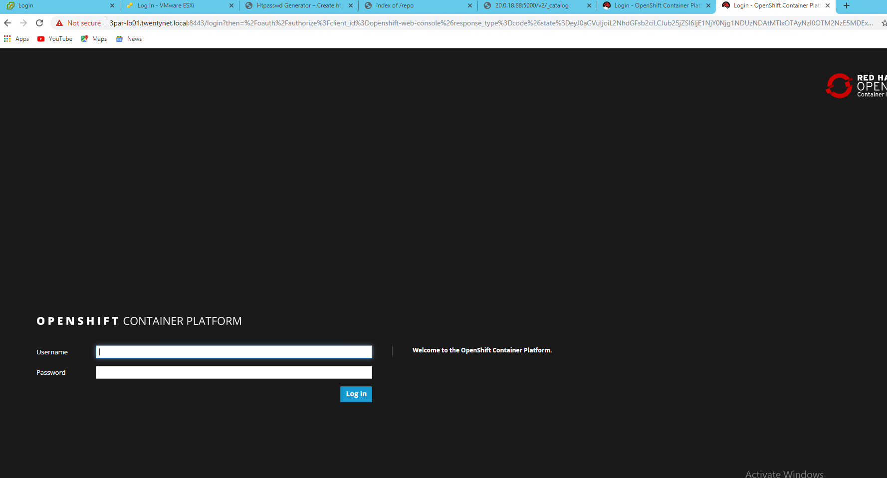

**Figure 67.** OpenShift web console

## Access OpenShift Cluster Console

From the OpenShift Container Platform homepage, select cluster console
from the drop down menu and provide the credentials from the *htpasswd
file* or LDAP to access the cluster console. Figure 68 below shows the
cluster console window.

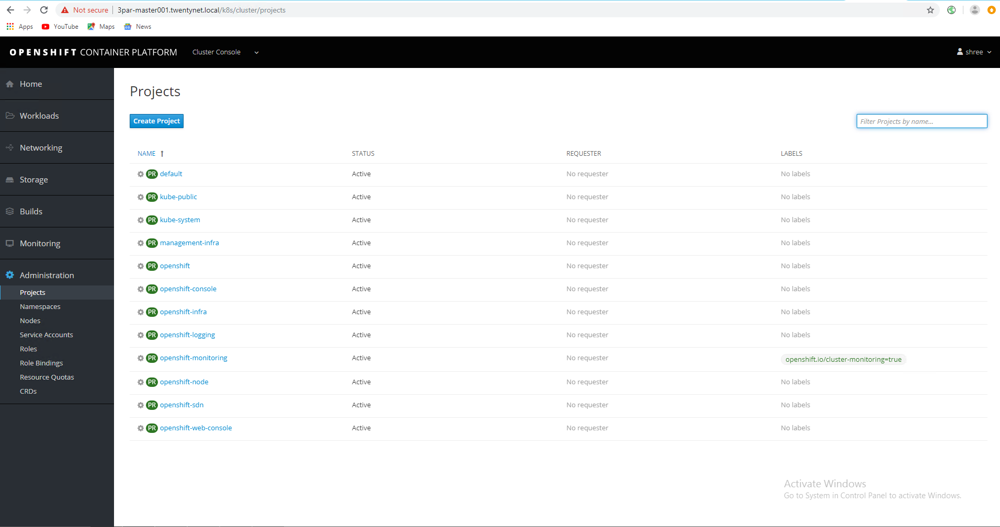

**Figure 68.** OpenShift cluster console

**NOTE**

If the cluster console is not available, restart the web console pod
with below command on the master node.

```

# oc -n openshift-web-console delete pod --all

````

## Validating Prometheus cluster monitoring

After successful installation of Prometheus monitoring, log in to
the Grafana web console using the route which generates a URL for
Grafana, as shown in Figure 69.


**Figure 69.** Grafana route

Select **Log in with OpenShift** to log in to the console using the
OpenShift Container Platform admin login credentials created while
installing OpenShift. Figure 70 shows the home dashboard of the
OpenShift admin.

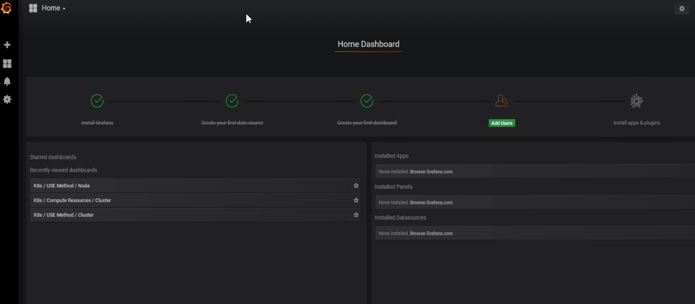

**Figure 70.** Grafana home page

From the left navigation pane, select **Configuration** and then
**Data Sources**. You should see a Prometheus data source as in Figure
71.

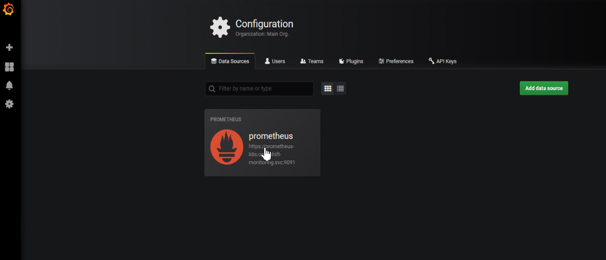

**Figure 71.** Prometheus data source

## Validating Elasticsearch, Fluentd and Kibana

Create a custom dashboard or import a dashboard (.json format) to view
OpenShift statistics.

After successful installation of the EFK stack, log in to the
Kibana web console using the Kibana hostname provided in the host file
accessible at, *https://<kibana hostname>.*

Select **Log in with OpenShift** to log in to the console using the
OpenShift 'admin' login credentials created while installing OpenShift.
Figure 72 shows the login screen.


**Figure 72.** Kibana login

The OpenShift Container Platform logs are viewable from the Kibana
dashboard as in Figure 73.

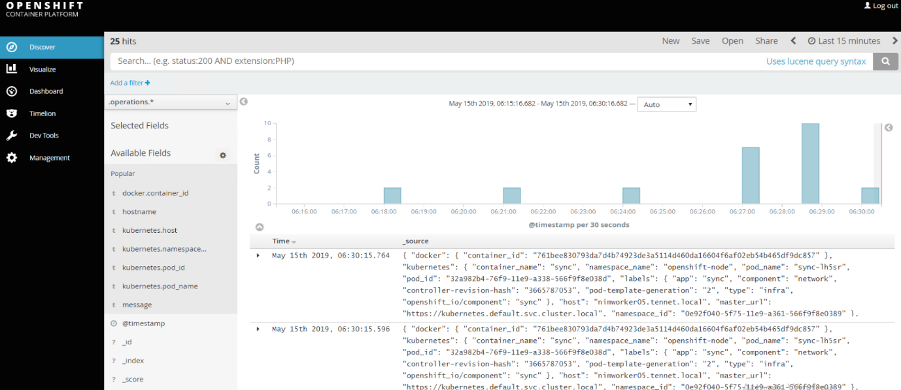

**Figure 73.** Kibana dashboard

# Installing Istio service mesh

## Overview

Istio service mesh simplifies the management of a distributed micro
services architecture, controls the flow of traffic and application
program interface (API) calls between services and allows secure service
communications (security). These include authentication, authorization,
rate limiting and a distributed web application firewall for both
ingress and egress.

## Prerequisites

From the Ansible Engine, run the following commands. These will
configure the master, infrastructure, and worker nodes with the
prerequisites required for the installation of Istio service mesh.

```
# cd /etc/ansible/Openshift-Synergy-RA/synergy/scalable/<vsphere>

# ansible-playbook playbooks/istio_prereqisites.yml
```

## Installing service mesh

Installing the service mesh involves the following tasks:

- Installing the operator.
- Creating and managing a custom resource definition file.

### Installing the operators

The Istio service mesh installation process introduces an operator to
manage the installation of the control plane within the istio-operator
namespace. This operator defines and monitors a custom resource related
to the deployment, update, and deletion of the control plane.

Starting with Red Hat OpenShift Service Mesh 0.12.TechPreview, the user
must install the Jaeger Operator and the Kiali Operator before the Red
Hat OpenShift Service Mesh Operator can install the control plane.

#### Installing the Jaeger Operator

As on-the-ground microservice practitioners are quickly realizing, the
majority of operational problems that arise when moving to a distributed
architecture are ultimately grounded in two areas, networking and
observability. It is simply an order of magnitude larger problem to
network and debug a set of intertwined distributed services versus a
single monolithic application.

Install the Jaeger Operator for the Red Hat OpenShift Service Mesh
Operator in the master nodes which will enable the installation of the
control plane. To do this, SSH into the master node and log in to the
OpenShift with the OpenShift user credentials given in the htpasswd or
LDAP. Once login is successful, execute the following commands to
install Jaeger Operator.

```

# create the project for the jaeger operator

# oc new-project observability

# oc create -n observability -f
<https://raw.githubusercontent.com/jaegertracing/jaeger-operator/v1.13.1/deploy/crds/jaegertracing_v1_jaeger_crd.yaml>

# oc create -n observability -f
<https://raw.githubusercontent.com/jaegertracing/jaeger-operator/v1.13.1/deploy/service_account.yaml>

# oc create -n observability -f
<https://raw.githubusercontent.com/jaegertracing/jaeger-operator/v1.13.1/deploy/role.yaml>

# oc create -n observability -f
<https://raw.githubusercontent.com/jaegertracing/jaeger-operator/v1.13.1/deploy/role_binding.yaml>

# oc create -n observability -f
<https://raw.githubusercontent.com/jaegertracing/jaeger-operator/v1.13.1/deploy/operator.yaml>

```

#### Installing the Kiali Operator

Kiali is an observability console for Istio with service mesh
configuration capabilities. It helps you to understand the structure of
your service mesh by inferring the topology and also provides the health
status of your mesh. Kiali provides detailed metrics, and a basic
Grafana integration is available for advanced queries. Distributed
tracing is provided by integrating Jaeger.

The Kiali Operator for the Red Hat OpenShift Service Mesh Operator must
be installed in the master nodes which allows the installation of the
control plane. Execute the following command on the master node to
install the Kiali Operator.

```

# bash <(curl -L https://git.io/getLatestKialiOperator)
--operator-image-version v1.0.0 --operator-watch-namespace '**'
--accessible-namespaces '**' --operator-install-kiali false

```

#### Installing the Red Hat OpenShift Service Mesh Operator

Create new namespaces from the master node by running the following
commands.

```

# oc new-project istio-operator

# oc new-project istio-system

```

Run the following command from the master node to install the Red Hat
OpenShift Service Mesh Operator.

```
# oc apply -n istio-operator -f
<https://raw.githubusercontent.com/Maistra/istio-operator/maistra-0.12/deploy/servicemesh-operator.yaml>
```

### Verify the Istio Operator installation

There are two methods that can be used to validate that the operator
installed correctly.

The two methods are:

- Validation of Istio Operator installation via the command-line
- Validation of the Istio Operator installation through the console

#### Validation of Istio Operator installation via the command-line

Run this command from the master node to verify that the operator is
installed correctly.

```

# oc get pods -n istio-operator

NAME READY STATUS RESTARTS AGE

istio-operator-5cd6bcf645-fvb57 1/1 Running 0 1h

```

#### Validation of the Istio operator installation through the console

Login to OpenShift web console and select **istio-operator** from **My
Projects** section to view the Istio Operator overview. Figure 74 shows
the Istio Operator within the OpenShift web console.


**Figure 74.** Istio Operator viewed from the OpenShift web console

### Creating a Custom Resource Definition

To deploy the service mesh control plane, the user must deploy a custom
resource. A custom resource enables the introduction of custom APIs into
a Kubernetes project or cluster. Create a custom resource yaml file to
define the project parameters and the object. This example custom
resource yaml file contains all of the supported parameters and deploys
Red Hat OpenShift Service Mesh 0.12.TechPreview images based on Red Hat
Enterprise Linux (RHEL).

1) Execute the following command from the master node to change to the
istio-system namespace.

```

# oc project istio-system

```

2) Using the project "istio-system" on the server
[https://<openshift-master
FQDN>](%20https:/%3copenshift-master%20FQDN%3e) , create a custom
resource definition file named *istio-installation.yaml*.

3) Execute the following command from the master node to deploy the control
plane.

```

# oc create -f istio-installation.yaml -n istio-system

```

4) Execute the following command from the master node to watch the progress
of the pods during the installation process. Figure 75 shows the status
of istio installation.

```

# oc get pods -n istio-system -a

```


**Figure 75.** Status of Istio installation.

5) Log in to the OpenShift web console through the URL
https://<openshift-master FQDN>:8443 to check the pods. Figure 76
shows the Istio pods and their status.

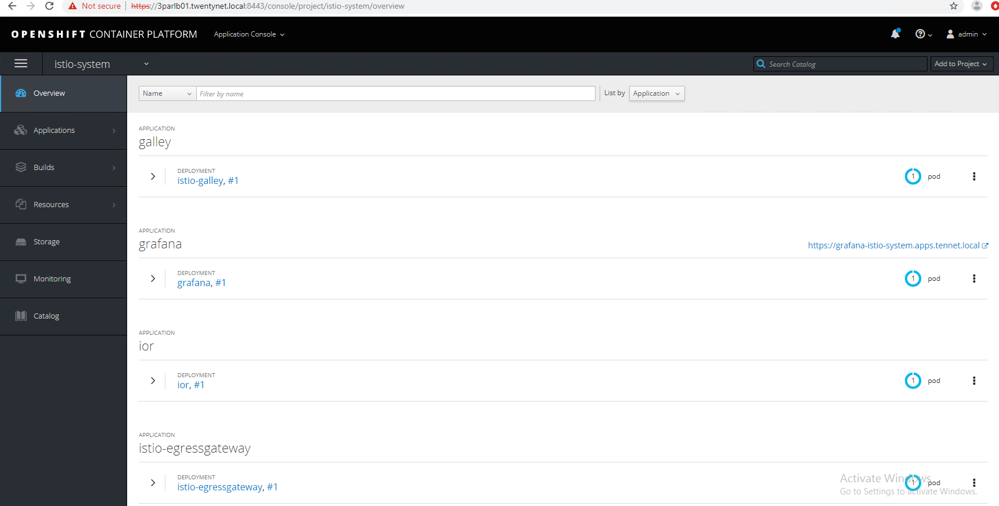

**Figure 76.** OpenShift web console showing Istio pods and their status

## Deploying an application

### Applying the master-config patch

It is necessary to apply the following patch to the master(s) on the
master configuration file */etc/origin/master/master-config.yaml* *to
enable* *MutatingAdmissionWebhook* and *ValidatingAdmissionWebhook*.

The following steps need to be performed in order to apply the patch.

1) Create a directory for Istio as follows.

```

# mkdir <istio directory name>

# cd <istio directory name>

```

2) Execute the following commands from within the Istio directory
created in step 1.

```

# wget
<https://raw.githubusercontent.com/Maistra/openshift-ansible/maistra-0.4/istio/master-config.patch>

```

3) Execute the following command to copy the *master-config.yml* file to
*master-config.yaml.prepatch* which was created during step 2.

```

# cp -p /etc/origin/master/master-config.yaml
/etc/origin/master/master-config.yaml.prepatch

```

4) Execute the following command to apply the patch for services and
copying to *master-config.yaml.*

```

# oc ex config patch /etc/origin/master/master-config.yaml.prepatch -p
"\$(cat ./master-config.patch)" >
/etc/origin/master/master-config.yaml

```

**NOTE**

If you have multiple master nodes, repeat this on each master node.

5) Execute the following command and verify the patch on the master
node. The master-config file should show the webhooks as shown below.

```

# cat /etc/origin/master/master-config.yaml

admissionConfig:

pluginConfig:

\....

\....

MutatingAdmissionWebhook:

configuration:

apiVersion: apiserver.config.k8s.io/v1alpha1

kind: WebhookAdmission

kubeConfigFile: /dev/null

ValidatingAdmissionWebhook:

configuration:

apiVersion: apiserver.config.k8s.io/v1alpha1

kind: WebhookAdmission

kubeConfigFile: /dev/null

```

6) Restart the master(s) by executing the following command.

```
# /usr/local/bin/master-restart api

# /usr/local/bin/master-restart controllers

```

### Installing the Bookinfo application

1) Execute the following command from the master node to create a
project named *bookinfo* for the Bookinfo application.

```
# oc new-project bookinfo
```

2) Update the Security Context Constraints (SCC) by adding the service
account used by bookinfo to the anyuid and privileged SCCs in the
"bookinfo" namespace. Execute following commands in the master node to
update the services.

```

# oc adm policy add-scc-to-user anyuid -z default -n bookinfo

# oc adm policy add-scc-to-user privileged -z default -n bookinfo

```

3) Deploy the Bookinfo application in the "bookinfo" namespace by
applying the *bookinfo.yml* file. Create a file *bookinfo.yml* with the
below content. Execute the following command from the master node to
deploy the Bookinfo application.

```

# oc create --f bookinfo.yml

```

4) To validate the installation, log in to the OpenShift web console
with the URL, https://<openshift-master FQDN>:8443 as shown in Figure
77.

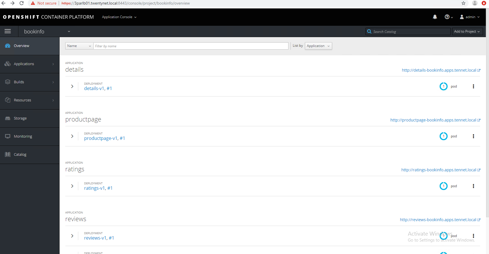

**Figure 77.** Bookinfo installation status within OpenShift web
console.

### Create the routes for the Bookinfo application

5) Create DNS entries in the DNS server with **infrastructure IP address**
for any add-on services utilized in the solution such as Grafana, Kiali,
Prometheus etc. Sample DNS entries are shown in Figure 78.


**Figure 78.** Sample DNS entries for the applications

### Services provided by service mesh

Once the applications are added into the DNS server the application can
be accessed through the OpenShift route. Access services provided by the
service mesh as follows.

1) Login to OpenShift web console. Select the application present within My
Project. To access the routes, click the application URL. Sample routes
for the bookinfo application are shown in Figure 79.

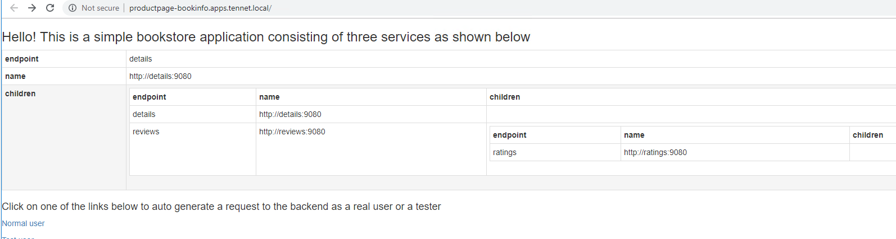

**Figure 79.** Routes in the Istio-system project

Figure 80 shows accessing the Kiali homepage within the OpenShift
web console.

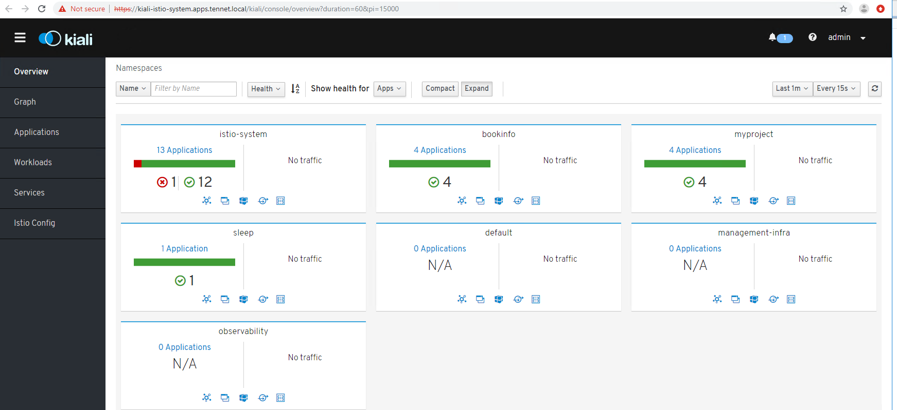

**Figure 80.** Accessing Kiali homepage within OpenShift web console
using service mesh

2) Grafana allows the user to query, visualize, alert on and understand the
metrics, no matter where they are stored. Figure 81 shows accessing the
Grafana homepage within the OpenShift web console using service mesh.

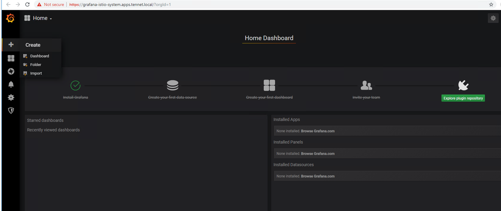

**Figure 81.** Accessing Grafana homepage within OpenShift web console
using service mesh

3) Figure 82 shows accessing Prometheus homepage within OpenShift web
console using service mesh.

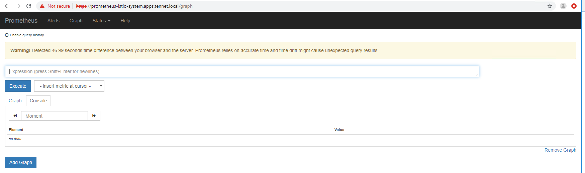

**Figure 82.** Accessing Prometheus homepage within OpenShift web
console using service mesh

# Physical worker node labelling in OpenShift

Kubernetes allows worker nodes to be labeled with the capabilities of
the underlying host. This labelling facilitates enhanced scheduling
capabilities. For example, a node with GPU capabilities that is labeled,
is used to schedule GPU dependent applications, while nodes without the
label could be ignored. Hewlett Packard Enterprise has created examples
of how to utilize the HPE Proliantutils project to perform node
labelling in an automated fashion.

To label the physical worker nodes use the repository located at the HPE
OpenShift Solutions GitHub at
<https://github.com/hewlettpackard/hpe-solutions-openshift> . This
repository contains Ansible plays and scripts to automate installation.

## About the repository

-   **playbooks:** This folder contains the playbook required for
    getting the physical worker node properties and label the node with
    those properties in OpenShift Container Platform 3.11.
-   **roles:** This folder contains two roles listed below:

o *"get-phy-worker-props"* - this will get physical worker node
hardware properties.

o *"node-labels-physical-worker"* - this will label the physical
worker node using the discovered hardware properties.

-   **hosts:** This is the host file which will be used by the Ansible
    Engine to reference hosts during the node labelling process. The
    installer should update this file with their OpenShift Container
    Platform 3.11 environment details.
-   **site.yaml:** This file imports the playbooks
    "*get-node-properties.yaml*" and "*node labels.yaml*" that
    control the workflow for node labelling. The installer should update
    the "*secrets.yml*" file with required information about the
    infrastructure.

## Prerequisites

In order to successfully perform physical worker node labelling on the
OpenShift Container Platform nodes, ensure that the following
prerequisites steps have been met:

1) Red Hat OpenShift Container Platform 3.11 is up and running.

2) All the nodes in the Red Hat OpenShift Container Platform 3.11
deployment are running RHEL 7.6.

3) There is a common username and password across all the iLOs
associated with the physical worker nodes.

4) The Python module named "*ansible*" should be installed on an
Ansible Engine using the following command:

```

# pip install ansible

```

5) Check the version of Python module named "*ansible*" using the
following command.

```

# pip freeze | grep ansible

```

6) Output of this command should give the Python module named
"ansible" version.

```

# ansible==2.8.5

```

7) The installer should install the Python module named "
*proliantutils*" on an Ansible Engine using the following command.

```

# pip install proliantutils

```

8) Then check the version of Python module named "proliantutils" using
the following command.

```

# pip freeze | grep proliantutils

```

9) Output of this command should give the Python module named
"proliantutils" version.

```

# proliantutils==2.9.1

```

## How to use playbooks

Following are the steps to utilize the playbooks:

1) From the Ansible Engine command prompt, browse to the following
directory.

```

# cd
/etc/ansible/hpe-solutions-openshift/synergy/scalable/3par-fc/iscsi/node-labelling

```

2) Update the file named "hosts", which is the inventory file with all
the required information based on your OpenShift set-up.

```

# Provide iLO IPs of all the physical worker node that you want to
label within OCP 3.11

[phy-workers-iloip]

10.0.x.x

# Provide the fully qualified domain name of all the physical worker
nodes that you want to label

[phy-worker-fqdn]

Offline-worker01.twentynet.local

# Provide the fully qualified domain name of the master node within
your OpenShift 3.11 set-up

[master]

offline-m01.twentynet.local ansible_user=root
ansible_ssh_pass=Password!234

```

3) Now update the file named "*secret.yml*", which is the vault file,
with all the required information based on your OpenShift
implementation. Open the "*secret.yml*" using following command.

```

ansible-vault edit secret.yml

```

4) As mentioned in the prerequisites, the installer should set a common
username and password for all iLOs on the physical worker nodes that
need to be labelled. Update only the following fields in the
"secret.yml".

```

# physical worker iLO credentials

ilo_username: username

ilo_password: password

````

5) Run the playbook using the following command.

````

ansible-playbook -i hosts site.yml -e\@secret.yml

```

6) To validate the success of the play, log in to one of the master
nodes using ssh and type the command listed below to get the label of
the physical node.

```

oc get node physicalworker_fully_qualified_domain_name
--show-labels

```

The output of the command should show you the label of the physical
worker node.

```

**NAME STATUS ROLES AGE VERSION LABELS**

physicalworker_FQDN Ready compute 1d v1.11.0+d4cacc0
beta.kubernetes.io/arch=amd64,beta.kubernetes.io/os=linux,boot_mode_uefi=true,cpu_vt=true,kubernetes.io/hostname=offline-worker01.twentynet.local,node-role.kubernetes.io/compute=true,pci_gpu_devices=1

```

# Backup and recovery of OpenShift components

## Data protection for Red Hat OpenShift

Containers have dramatically increased in popularity as organizations
recognize the benefits with respect to both time and resource
efficiency. This explosive growth of container applications overwhelms
traditional data protection approaches. Applying traditional data
protection strategies to containerized applications will not work.

The goals of this solution with regards to data protection are to:

- Highlight the importance of protecting each component within an
OpenShift cluster including persistent volumes in order to restore in
case of corruption or system failures.
- Demonstrate Hewlett Packard Enterprises approach to persistent volume
backup using HPE Recovery Manager Central (RMC) software with the HPE
3PAR StoreServ snapshot feature and HPE StoreOnce.

HPE StoreOnce is used as a backup target for backing up OpenShift
components including persistent volumes. For the backup of the
configuration files, create an HPE StoreOnce NAS share and export it to
the OpenShift nodes. For high availability, the NAS share can be
replicated to a remote HPE StoreOnce.

At a high level, persistent volume protection is accomplished by using
RMC to initiate a crash consistent snapshot at the volume level. Using
the RMC express protect feature, the snapshot is then moved to the HPE
StoreOnce Catalyst store. As it is moved to a backup appliance, data can
be stored for archival purposes as well. In this scenario, there is no
external data mover involved. Either HPE StoreOnce or RMC acts as the
data mover. This reduces the cost and complexity of the solution. HPE
3PAR StoreServ Storage also supports replication of the volume to a
remote array which can be used to reduce the RPO/RTO requirements.
RPO/RTO can be further reduced with peer persistent (active/active)
replication.

**NOTE**

The information in this section is taken from
<https://docs.openshift.com/container-platform/3.11/day_two_guide/environment_backup.html>
. The user can check the latest version of the OpenShift documentation
for any updates to this procedure.

## OpenShift Container Platform components

This section disseminates the components that need to be protected or
backed up within a Red Hat OpenShift Container Platform cluster. Hewlett
Packard Enterprise plans to update this section with new information
over time.

A backup should be taken before any upgrade or modifications. It is
recommended to perform periodic backup to make sure you have the most
recent configuration available in the event of a failure. An OpenShift
Container Platform backup involves taking backup of current state to
external storage at the cluster level. This means creating individual
backups of the master, worker, infrastructure node components, etcd data
base and configurations, and persistent storage.

In Red Hat OpenShift Container Platform, all of the components are
treated as objects and are stored in files. This means that creating a
configuration backup is equivalent to taking file level backups.

### Master node

The master node is responsible for maintaining the desired state of a
cluster. It is recommended to perform a master node backup before you
make any modifications to the OpenShift Container Platform
infrastructure. In high availability environments, make sure to perform
the backup on all master nodes.

### etcd

When you back up etcd, you need to take a backup of the configuration
and data.

etcd configurations are stored in the */etc/etcd* directory on hosts
where etcd instances are running. Unlike other configurations, etcd
configurations are unique across etcd instances. etcd data can be backed
up using the etcd snapshot save command.

### Worker node

The nature of worker nodes is that any specific configuration pertaining
to running pods are replicated over the nodes in case of a failover.
They typically do not contain data that is necessary to run an
environment. Apart from running pods, worker nodes contain certificates,
which are generated during installation, services, authorization files
and more.

### Infrastructure node

OpenShift uses its local registry for storing container images. The
infrastructure node is responsible for hosting the registry and routers.
Registry pods are deployed with a persistent volume from HPE 3PAR
StoreServ Storage. In order to protect the data, it is recommended to
take a snapshot of the volume using HPE RMC and StoreOnce.

The infrastructure node is responsible for hosting the router pods.
These pods are replicated over other nodes in case of a failover. They
typically do not contain data that is necessary to run the environment.

Registry certificates must be backed up from all the infra nodes.

### Persistent storage

Containers were designed to run stateless applications. So in the early
days of containers there was no need for persistent storage. But then
the enterprises started adopting containers at scale and the demand to
run stateful applications within the containers increased. Once
persistent data is present, a need is created for persistent storage.
Backing up and protecting this data becomes very important.

For persistent volume level backups, traditional agent-based backup
software won't work natively with a container orchestrator such as
Kubernetes. Backup schemes need to be consumed as a data protection
service from the underlying container-aware storage such as HPE 3PAR
StoreServ Storage. Using HPE RMC Express Protect Backup, a
crash-consistent snapshot-based persistent volume backup can be taken
directly to HPE StoreOnce.

Using the HPE 3PAR Docker Storage plugin feature, you can create
replicated volumes. The HPE 3PAR StoreServ Storage plugin extends
Docker's volume create command interface via optional parameters in
order to make it possible. The HPE 3PAR StoreServ Storage plugin assumes
that an already working HPE 3PAR Remote Copy setup is present. The
plugin has to be configured with the details of this setup.

# Backup OpenShift node components

To protect the OpenShift nodes, it is recommended to take a backup of
any important configuration files to HPE StoreOnce Storage. Before
backing up the configuration, create a NAS share dedicated as backup
target, as explained in the following section.

1) Log in to the *HPE StoreOnce Administration web GUI* and navigate to
**Data Services > NAS Shares** and then select Create Share as in
Figure 83.

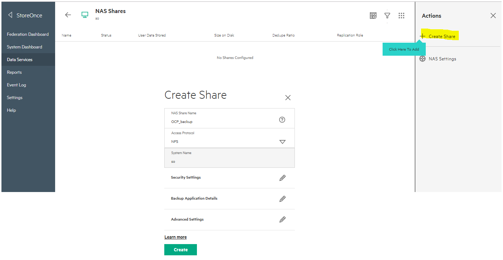

**Figure 83.** Creating a new NAS share in HPE StoreOnce

2) Create a name for the share and then select the access protocol by
selecting NFS. Select the application details (if any), select the data
type as file, and then click Create to finalize.

3) To mount the NAS share, provide access to the servers as in Figure
84.

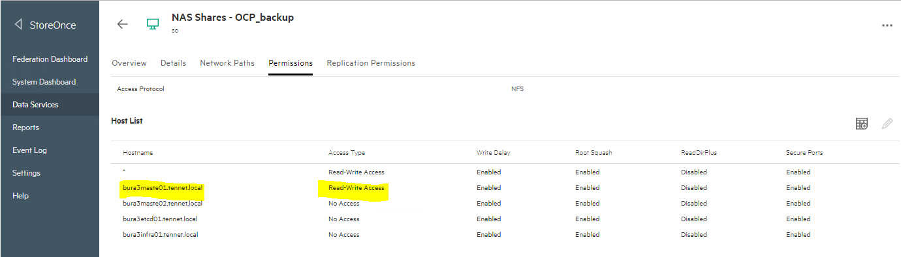.

160) **Figure 84.** HPE StoreOnce NAS share access details

4) Mount the NAS share on any server on the network for demonstrating
that we have mounted it on the master node with the following command.

```

# mount 10.0.20.xx:/nas/OCP_backup /StoreOnce_vol

```

## Master node backup

To create a backup of the important configuration files on the master
node, do the following.

Run the following commands using the mount point created above.

```
# MYBACKUPDIR=/backup/\$(hostname)/\$(date +%Y%m%d)

# mkdir -p \${MYBACKUPDIR}/etc/sysconfig

# cp -r /etc/origin \${MYBACKUPDIR}/etc

# cp -r /etc/sysconfig/ \${MYBACKUPDIR}/etc/sysconfig/

# cp -r /etc/sysconfig/{iptables,docker-*}
\${MYBACKUPDIR}/etc/sysconfig/

# cp -r /etc/dnsmasq* /etc/cni \${MYBACKUPDIR}/etc/

# rpm -qa | sort | sudo tee \$MYBACKUPDIR/packages.txt

# cp -r /etc/docker/certs.d/
\${MYBACKUPDIR}/docker-registry-certs-\$(hostname)

# tar -zcvf /backup/\$(hostname)-\$(date +%Y%m%d).tar.gz \$MYBACKUPDIR
```

## etcd backup

The etcd backup process is comprised of two different procedures. The
two etcd back procedures are:

- etcd configuration backup including the required etcd configuration
and certificates.

- etcd data backup.

### etcd configuration backup

The etcd configuration files to be preserved are all stored in the
*/etc/etcd* directory of the instances where etcd is running. This
includes the etcd configuration file (*/etc/etcd/etcd.conf*) and the
required certificates for cluster communication. Make a backup of the
configurations from all etcd members of the cluster.

```

# mkdir -p \${MYBACKUPDIR}/etcd-config

# cp -R /etc/etcd/ \${MYBACKUPDIR}/etcd-config

```

### etcd data backup

1) Before taking a backup, ensure that the OpenShift Container Platform
API service is running, connectivity with the etcd cluster (port
2379/tcp) is working, and proper certificates are available to connect
to the etcd cluster. To cross-check the above services, run the
following command, using etcd API version V3.

```

# etcdctl2 cluster-health

# etcdctl3 member list

# etcdctl3 endpoint health

```

2) Using the etcd v3 API, take a snapshot from a live member with the
etcdctl3 snapshot command.

```

# mkdir -p \${MYBACKUPDIR}/etcd-data

# etcdctl3 snapshot save <<etcd_snapshot1.db>>

```

3) Create the backup by copying the etcd db directory using the
following command.

```

# cp -r /var/lib/etcd/ \${MYBACKUPDIR}/etcd-data

```

4) Create the tar file as follows.

```

# tar -zcvf /backup/\$(hostname)-\$(date +%Y%m%d).tar.gz \$MYBACKUPDIR

```

5) Copy the tar file to the HPE StoreOnce NAS share mount point at the
master server by running the following command.

```
# scp --aR /backup/\$(hostname)-\$(date +%Y%m%d).tar.gz
<user>@<master>:/StoreOnce_vol 
```

## Worker node backup

To create a backup of the important configuration files on the worker
nodes, run the following commands.

```

# MYBACKUPDIR=/backup/\$(hostname)/\$(date +%Y%m%d)

# sudo mkdir -p \${MYBACKUPDIR}/etc/sysconfig

# sudo cp -r /etc/origin \${MYBACKUPDIR}/etc

# sudo cp -r /etc/sysconfig/atomic-openshift-node
\${MYBACKUPDIR}/etc/sysconfig/

# sudo mkdir -p \${MYBACKUPDIR}/etc/sysconfig

# sudo cp -r /etc/sysconfig/{iptables,docker-*}
\${MYBACKUPDIR}/etc/sysconfig/

# sudo cp -r /etc/dnsmasq* /etc/cni \${MYBACKUPDIR}/etc/

# rpm -qa | sort | sudo tee \$MYBACKUPDIR/packages.txt

# cp -r /etc/docker/certs.d/
\${MYBACKUPDIR}/docker-registry-certs-\$(hostname)

# tar -zcvf /backup/\$(hostname)-\$(date +%Y%m%d).tar.gz \$MYBACKUPDIR

```

Copy the tar file to the HPE StoreOnce NAS share mount point at the
master server with the following command.

```

# sudo scp --aR /backup/\$(hostname)-\$(date +%Y%m%d).tar.gz
<user>@<master>:/StoreOnce_vol

```

## Infrastructure node backup

To create a backup of certificate files and copy it to the appropriate
mount point, run the following commands.

```

# MYBACKUPDIR=/backup/\$(hostname)/\$(date +%Y%m%d)

# mkdir -p \${MYBACKUPDIR}/etc/docker

# cp -R /etc/docker/certs.d \${MYBACKUPDIR}/etc/docker/certs-\$(date
+%Y%m%d)

# tar -zcvf /backup/\$(hostname)-\$(date +%Y%m%d).tar.gz \$MYBACKUPDIR

```

Copy the tar file to the HPE StoreOnce NAS share mount point at the
master server using the following command.

```

# scp --aR /backup/\$(hostname)-\$(date +%Y%m%d).tar.gz
<user>@<master>:/StoreOnce_vol

```

## Ansible playbook for backup

Use the following Ansible play to take backups of master, worker, and
infra nodes and move the data to the HPE StoreOnce NAS share. To
retrieve and run the play, use the following commands.

```

# cd /hpe-solutions-openshift /synergy/scalable/3par-vsphere/iscsi/bura

# ansible-playbook -i hosts site.yaml

```

## Persistent storage

When utilizing the native storage capability to take crash consistent
snapshots of a persistent volume, that volume can be restored to a point
in time snapshot in case the PV is corrupted. This solution makes use of
RMC and HPE 3PAR StoreServ Storage's snapshot capability to take crash
consistent snapshots of persistent volumes. These volumes can be
restored to a point in time either from the array snapshot or from the
Express Protect backup available on the HPE StoreOnce in the event that
the PV is corrupted. Even if the persistent volume is deleted at the
container level, the volume will still be available to restore from RMC.

# HPE 3PAR StoreServ volume express protection

Array-based snapshots and replication provide fast, non-disruptive
point-in-time copies of your data. But snapshots alone cannot deliver
comprehensive backup as they have retention limitations and a dependency
on the underlying storage system. Simply put your snapshots will be lost
if the storage system fails.

The RMC Express Protect feature allows you to back up snapshots directly
from HPE 3PAR StoreServ Storage to HPE StoreOnce. In this case, either
the RMC appliance or the HPE StoreOnce itself will act as a data mover,
reducing the cost and complexity of the architecture.

RMC leverages the snapshot differential technology in HPE 3PAR StoreServ
Storage ensuring that only changed blocks are sent to the StoreOnce
backup system. This reduces both network traffic and storage usage which
lowers costs. Every backup completes at the speed of an incremental data
transfer but is stored as a synthetic full backup. This makes
application recovery faster and more efficient.

## RMC Express Protect

Before you configure Express Protect backup in RMC, you need to add the
HPE 3PAR StoreServ Storage and StoreOnce to RMC. The following are the
steps to add the HPE 3PAR StoreServ Storage and StoreOnce to RMC.

1) Log in to the RMC portal and navigate to the *Recovery Manager
Central* drop-down.

2) On the *Configure* tab, select **Storage Devices**. A list of
available storage devices appears as in Figure 85.

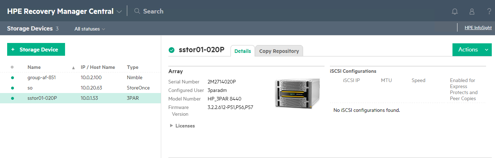

**Figure 85.** HPE Recovery Manager Central - Storage Devices window

3) Click **Storage Device** and select **3PAR** and **StoreOnce** as in
Figure 86.

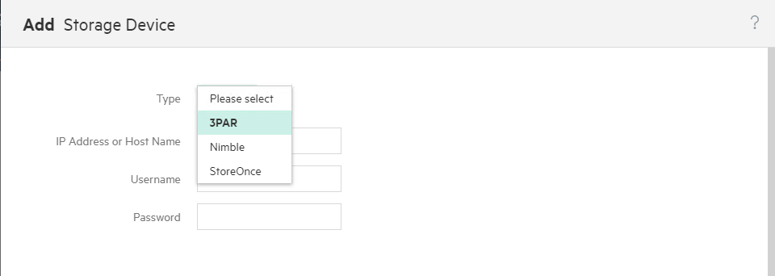

**Figure 86.** Adding storage devices in HPE Recovery Manager Central

4) Navigate to the **Recovery Manager Central** drop down.

5) On the Protect tab, select **Volumes**, a window appears as in Figure
87.


**Figure 87.** HPE Recovery Manager Central - Volume Set window

6) Click *Volume Set*. A new window to create Volume Sets appears as in
Figure 88.


**Figure 88.** HPE Recovery Manager Central - Volume Set creation screen

7) Provide the details of the Volume Set, select the storage system, and
then select the volumes. **Click Add** to create a Volume Set as in
Figure 89. Before protecting the Volume Set, add the copy policies under
the HPE Recovery Manager Central drop down and select the appropriate
snapshot and express protect schedules and HPE StoreOnce repository.
Create the *Copy Policy* based on the business SLA requirement.


**Figure 89.** HPE Recovery Manager Central - Creating Copy Policy

8) Select the **Volume Set** and from the**Actions** drop down list,
select **Add Protection** as in Figure 90.


**Figure 90.** HPE Recovery Manager Central - Adding Protection

9) From the **Add Protection** window, select the previously created
copy policy and click **Select** as in Figure 91.


**Figure 91.** HPE Recovery Manager Central - Selecting Protection
policy

10) Select the **Protect Once** option for the created volume set. From
the Protection Type drop down list, select **Express Protect** as in
Figure 92.


**Figure 92.** HPE Recovery Manager Central - protecting the volume set

11) View the progress/status on the Activities tab under the HPE
Recovery Manager Central drop down as in Figure 93.


**Figure 93.** HPE Recovery Manager Central - Activities window

12) The backup & restore report from HPE StoreOnce Management GUI can be
accessed by navigating to Reports on the home page. Figure 94 shows the
backup/restore report.

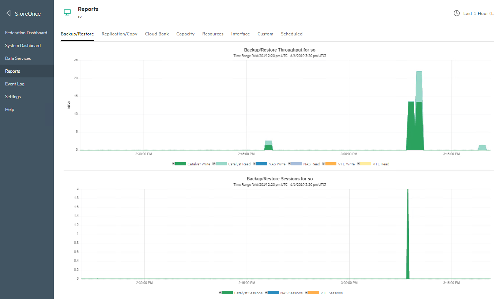

**Figure 94.** HPE StoreOnce backup/restore reports tab

# Restoring OpenShift Container Platform components from a backup

It is important to restore the OpenShift components in case of a system
failure or corruption and to ensure the nodes are in a previous working
state.

## Master node

Restore means recreating the components from the point in time the
backup is available. In the case where a master host is corrupted or
failed due to system error, reinstall the master host, copy the
important configuration files, and then restart the OpenShift services.

If you are restoring to a master that is behind a highly available load
balancer pool, restarting the OpenShift service may cause downtime. Make
sure to remove the master from the pool, restart the service, and then
add it back to the load balancer pool.

If you are recreating a master after a system failure, apply the backup,
reboot, and then add the master to the cluster.

For restoring the master node or only restoring certain files, mount the
NAS backup share from the HPE StoreOnce to the node and copy the
required files to the desired location. When complete, restart the
services. An example appears below:

```

# mount 10.0.20.xx:/nas/OCP_backup /StoreOnce_vol

# tar -xvf /StoreOnce_vol/\$(hostname)-\$(date +%Y%m%d).tar.bz2

# cp /StoreOnce_vol/\$(hostname)/\$(date
+%Y%m%d)/origin/master/master-config.yaml
/etc/origin/master/master-config.yaml

# systemctl restart atomic-openshift-master-api

# systemctl restart atomic-openshift-master-controllers

```

**NOTE**

Restart the server if the IP tables are replaced.

## etcd

If the etcd configuration is corrupted or lost, restore the file from
the backup and restart the service.

If the etcd data is corrupted and you want to restore from the snapshot,
this can be performed on a single etcd node. After that, add the rest of
the etcd nodes to the cluster.

### etcd configuration

If an etcd host has become corrupted and the */etc/etcd/etcd.conf file*
is lost, restore it using the below command.

```

# cp /StoreOnce_vol/backup/\$(hostname)/\$(date
+%Y%m%d)/etcd-config/etcd.conf /etc/etcd/etcd.conf

# restorecon -Rv /etc/etcd/etcd.conf

```

### Restore etcd data

1) Stop all etcd services by removing the etcd pod definition and
rebooting the host.

```

# mkdir -p /etc/origin/node/pods-stopped

# mv /etc/origin/node/pods/* /etc/origin/node/pods-stopped/

# reboot

```

2) To ensure the proper backup is restored, delete the etcd directories.

```

# mv /var/lib/etcd /var/lib/etcd.old

# mkdir /var/lib/etcd

# restorecon -Rv /var/lib/etcd/

```

3) Restore a healthy backup data file to each of the etcd nodes. Perform
this step on all etcd hosts. For restoring etcd v3 data, run the
following commands.

```

# cp -R /StoreOnce_vol/backup/\$(hostname)/\$(date
+%Y%m%d)/etcd-data/* /var/lib/etcd/

# mv /var/lib/etcd/db /var/lib/etcd/member/snap/db

# chcon -R --reference /StoreOnce_vol/backup/\$(hostname)/\$(date
+%Y%m%d)/etcd-data/* /var/lib/etcd/

```

4) Run the etcd service on each host, forcing a new cluster.

```

# mkdir -p /etc/systemd/system/etcd.service.d/

# echo "[Service]" > /etc/systemd/system/etcd.service.d/temp.conf

# echo "ExecStart=" >> /etc/systemd/system/etcd.service.d/temp.conf

# sed -n '/ExecStart/s/"\$/ --force-new-cluster"/p'
/usr/lib/systemd/system/etcd.service \\

>> /etc/systemd/system/etcd.service.d/temp.conf

# systemctl daemon-reload

# master-restart etcd

```

5) Check for health status.

```

# etcdctl2 cluster-health

```

6) Restart the etcd service in cluster mode.

```

# rm -f /etc/systemd/system/etcd.service.d/temp.conf

# systemctl daemon-reload

# master-restart etcd

```

7) Check for health status and the member list:

```

# etcdctl2 cluster-health

# etcdctl2 member list

```

## Worker node

In case a worker node host is corrupted or has failed due to a system
error, reinstall the worker node the way you did initially, copy the
important configuration files, and then restart the OpenShift services.

If you are recreating a worker node after a system failure, apply the
backup, reboot, and then add the worker node to the cluster.

When restoring the worker node or only restoring certain files, mount
the NAS backup share from HPE StoreOnce to the worker node and copy the
files to the desired location and restart the service.

```

# mount 10.0.20.xx:/nas/OCP_backup /StoreOnce_vol

# tar xvjf /StoreOnce_vol/\$(hostname)-\$(date +%Y%m%d).tar.bz2

# cp /StoreOnce_vol/\$(hostname)/\$(date
+%Y%m%d)/etc/origin/node/node-config.yaml
/etc/origin/node/node-config.yaml

# systemctl restart atomic-openshift-node

```

**NOTE**

If you are restoring files to a running worker node, restarting services
may cause downtime.

## Persistent volumes

When utilizing the native storage capability to take crash consistent
snapshots of a persistent volume, that volume can be restored from a
point in time snapshot in case the PV is corrupted. This solution makes
use of RMC and HPE 3PAR StoreServ Storage snapshot capability to take
crash consistent snapshots of persistent volumes. These volumes can be
restored to a point in time either from the array snapshot or from the
express protect backup available on the HPE StoreOnce in the event that
the PV is corrupted. Even if the persistent volume is deleted at the
container level, the volume will still be available to restore from RMC.

**NOTE**

Prior to proceeding with restoring, ensure that the replica set count is
set to zero, for the pods which is using the PV.

To restore the persistent volume (PV) to a point in time, perform the
following tasks.

1) Log in to the **Recovery Manager Central** (RMC) portal.

2) Navigate to the Recovery Manager Central drop down list, and **select
Volumes > Volume Set > Clone / Restore** as in Figure 95.


**Figure 95.** HPE RMC Clone / Restore option for the volume set

3) Once you select the *Clone / Restore* option, a window is displayed.
Select *Restore*. Before you proceed with this step, make sure the
replica count is set to zero using the deployment API object in the
OpenShift console.

**NOTE**

Setting the replica count to zero for the pods causes downtime for the
application.

At the OpenShift console, navigate to *Project*, select**Deployment
Configuration**, select the **down arrow** on the right side to scale
down the replica count, and accept the scale down confirmation as in
Figure 96.


**Figure 96.** RH-OpenShift console scaling down the replica set to zero

Optionally, run the following command to scale down the replica set.

```

# kubectl scale --replicas=0 -f deployment.yaml

```

4) Proceed with the *Restore* from the RMC GUI using the console as in
Figure 97.

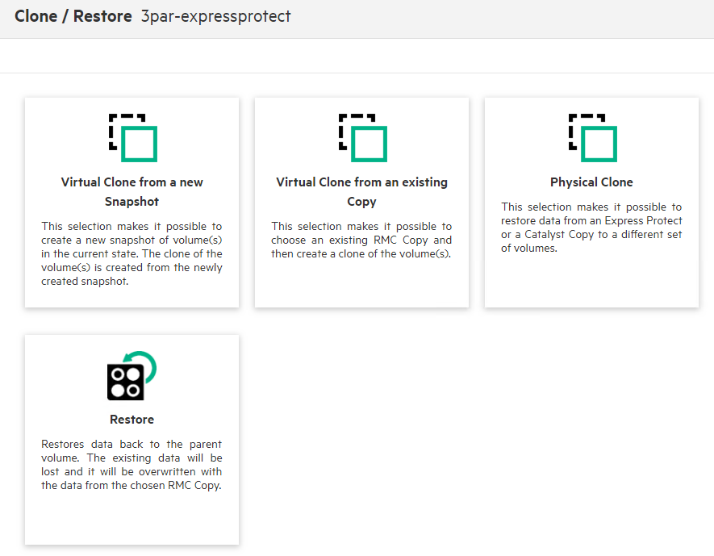

**Figure 97.** Selecting Restore option for the volume set

5) Select the date/time and the backup either from snapshot or from the
express protect backup and click **Next** as in Figure 98.


**Figure 98.** HPE RMC Restore available copies with selected date

6) Select the volume to be restored and click '**Restore**' as in Figure
99.

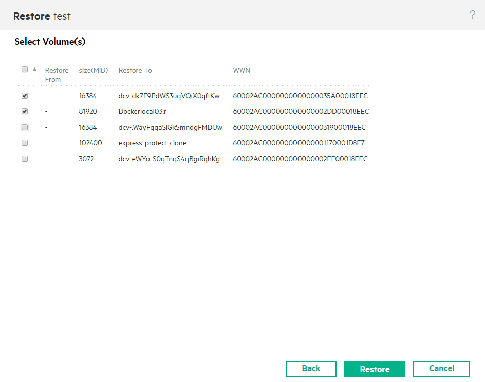

**Figure 99.** Selecting the volume for Restore

This operation overwrites the data on the volume being restored. After
the restore is completed, change the replica count to your choice and
check the PV and the data.

# HPE 3PAR StoreServ Storage replication

## Supported storage replication using the HPE FlexVolume plugin

The HPE 3PAR FlexVolume plugin for Docker supports two storage
replication methods. The two storage replication methods are:

-   Active/Passive replication
-   Peer persistence replication

Both the methods require configuring HPE 3PAR remote copy before
configuring replication between arrays.

## Setting up HPE 3PAR remote copy configurations over IP

Figure 100 presents a high-level flow diagram for configuring HPE 3PAR
remote copy between two HPE 3PAR systems.


**Figure 100.** Setting up HPE 3PAR remote copy configurations over IP

The following steps describes the setup process:

1) The two ports on each HPE 3PAR system are cabled to the switches as
shown in Figure 101.

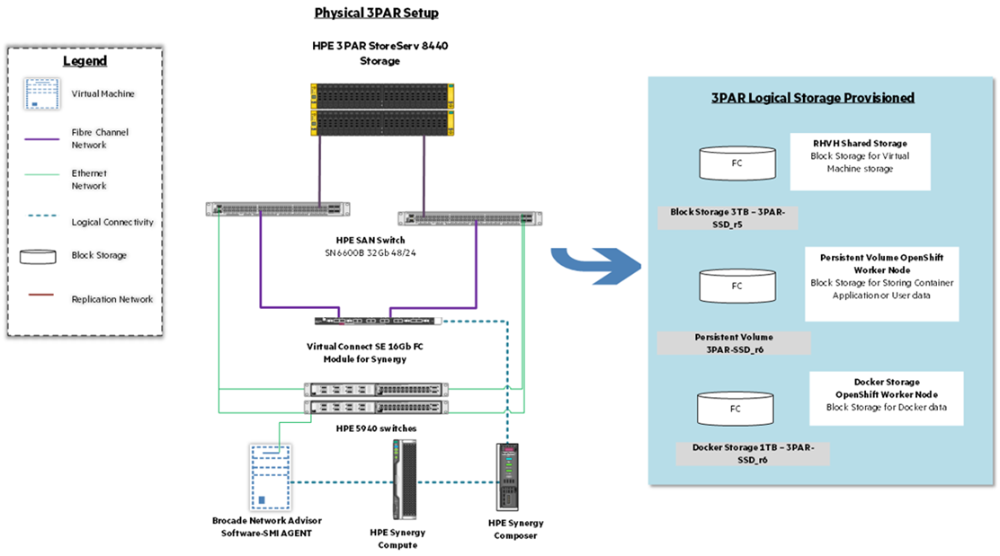

**Figure 101.** Storage connectivity to the switch

2) From the *HPE 3PAR Management Console SSMC*, configure the ports for
RCIP as in Figure 102.

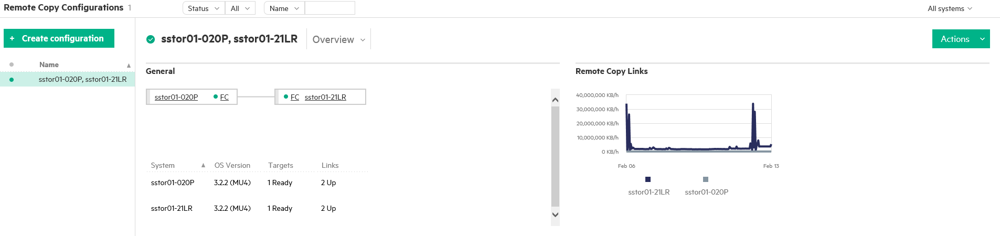

**Figure 102.** RCIP link state

For more information, refer to HPE 3PAR Remote Copy Software,
<https://support.hpe.com/hpsc/doc/public/display?docLocale=en_US&docId=emr_na-a00045719en_us>
.

If you are using the HPE 3PAR volume plugin for Docker V2.1 for
OpenShift configuration, the remote copy process will require manually
creating a new volume using SSMC or CLI on the target HPE 3PAR
replication system for the container persistent volume remote copy. To
do this, follow these steps:

1) Configure two HPE 3PAR systems for remote copy using either the HPE
3PAR CLI or SSMC. For more information, refer to the
<https://support.hpe.com/hpsc/doc/public/display?docLocale=en_US&docId=emr_na-a00045719en_us>
.

2) Once the *Remote Copy Group* has been successfully configured, you
can verify its status through SSMC as shown in Figure 103.

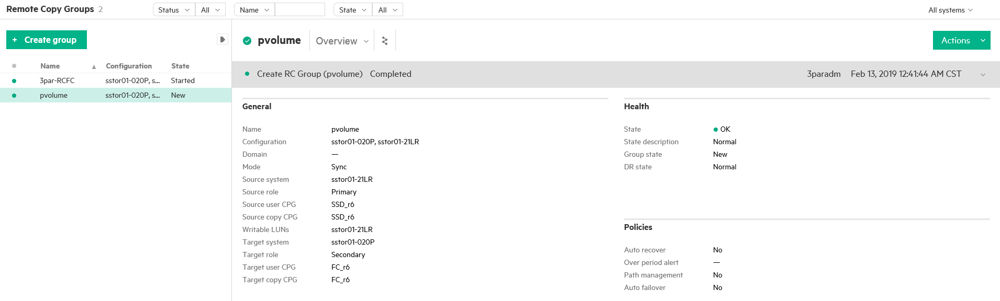

**Figure 103** . Remote copy group

### Active/Passive replication (Disruptive)

With Active/Passive replication, only one array is in an active state
serving the VLUNs of a given replicated volume at any point in time.
With this scenario the remote copy group (RCG) is failed over manually
via the HPE 3PAR Command Line Interface (CLI) to the secondary array at
which point the secondary array becomes active. However, the VLUNs of
the failed over volumes are still not exported by the secondary array to
the host. In order to trigger that, the container/POD running on the
host needs to be restarted.

In order to use Active/Passive replication, the remote copy
configuration must be setup and running between arrays.

Figure 104 showcases the HPE 3PAR StoreServ logical storage volumes that
are recommended for remote copy within the Red Hat OpenShift Platform on
HPE Synergy solution. The persistent volumes, for either all containers
or just for specific container storage, can be secured.

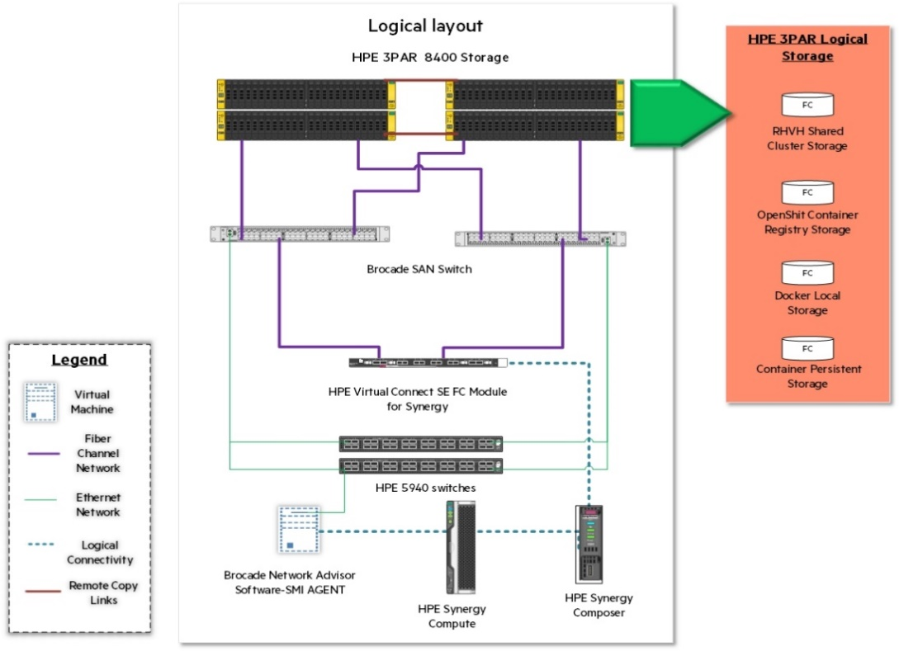

**Figure 104.** Logical layout of the solution stack

### Failover a remote copy group

Currently, there is no native OpenShift command to failover a replicated
volume. This must be done from within the HPE 3PAR CLI or StoreServ
Management Console (SSMC). Use the following steps to failover a volume
from the primary to secondary array using SSMC.

1) In *SSMC*, select **Remote Copy Groups** as in Figure 105.


**Figure 105.** HPE 3PAR SSMC menu

2) Select the group that is to be stopped and then select **Stop** from
the *Actions* menu as in Figure 106.

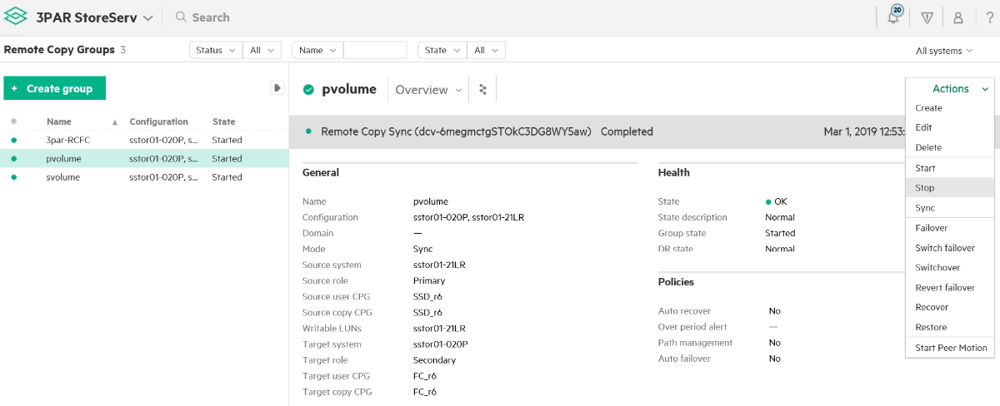

**Figure 106.** Stop remote copy group action

3) A new window opens showing the groups to be stopped. Click**Stop**
and then confirm and select **Yes, stop** as in Figure 107.

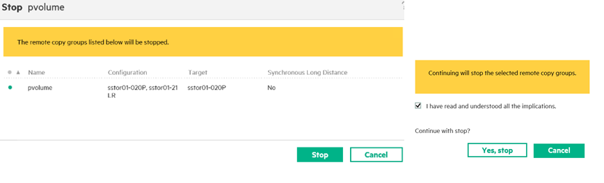

**Figure 107.** Stop remote copy group

4) Once the remote copy group has stopped, proceed with the failover by
selecting **Failover** from the *Actions menu* as in Figure 108.


**Figure 108.** Failover remote copy group

5) A new window opens with an alert as in Figure 109. Click
**Failover**.

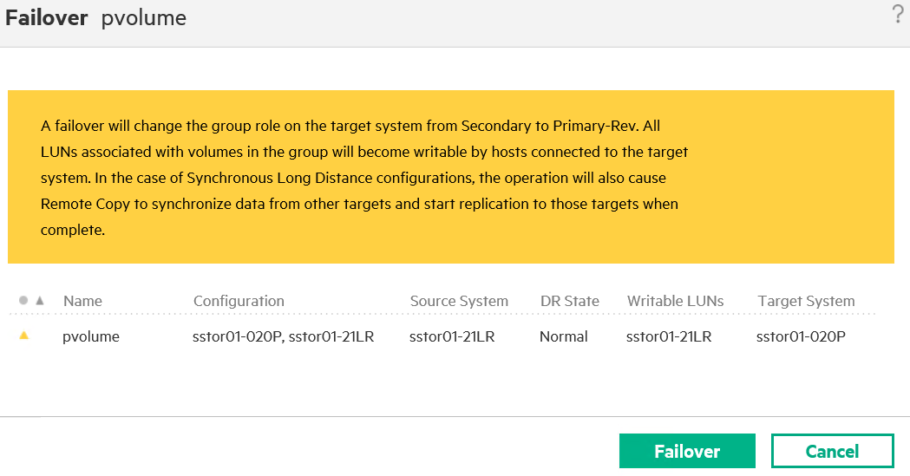

**Figure 109.** Failover remote copy group info

6) Inspecting the relevant Docker volume will show output similar to
that shown in Figure 110.


**Figure 110.** Docker volume inspect

7) Within SSMC, recover the failed remote copy group volume by selecting
**Recover** from the *Actions* menu as in Figure 111.

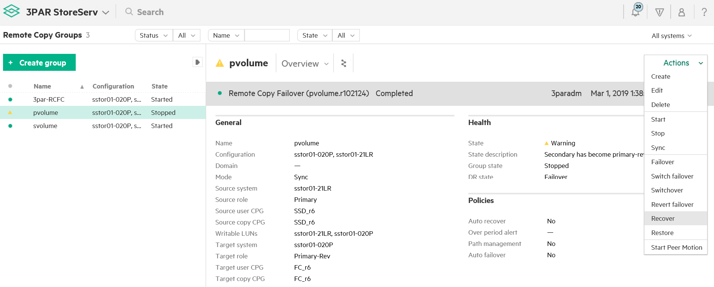

**Figure 111.** Recover remote copy group action

8) A new window opens with the details of the selected action. Select
**Recover** and then agree that you understand the implications before
selecting **Yes**, recover as in Figure 112.


**Figure 112.** Recover remote copy group info and confirmation

9) Ensure the remote copy group is started and inspect the relevant
Docker volume as in Figure 113 below.

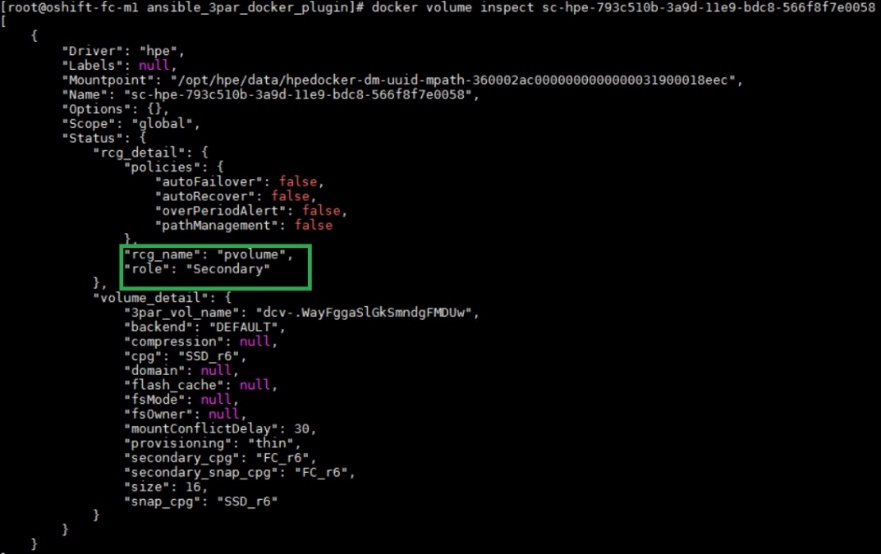

**Figure 113.** Docker volume inspect

10) Verify whether or not the volume is writeable as in Figure 114
below.

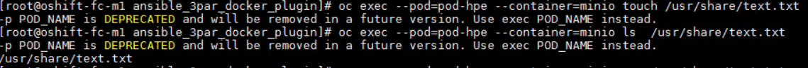

**Figure 114.** Verify that the volume is writeable

At this point, the volume has successfully failed over to the secondary
HPE 3PAR StoreServ Storage array.

### Failback workflow for Active/Passive based replication

Currently, there is no native OpenShift command to fail over a
replicated volume. This must be done from within the HPE 3PAR CLI or
SSMC. This document uses SSMC to fail back a volume from the secondary
array to the primary array. The following steps describes the failback
workflow replication.

1) In *SSMC*, select **Remote Copy Groups** as in Figure 115 below.


**Figure 115.** HPE 3PAR SSMC menu

2) From the *Actions* menu, select **Restore** as in Figure 116 below.

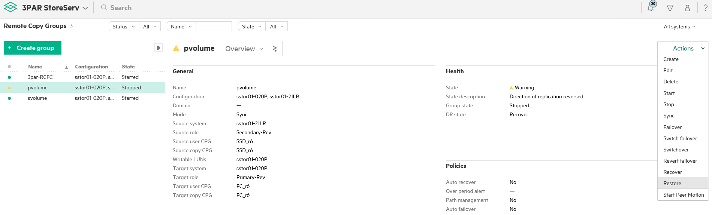

**Figure 116.** Selecting Restore from the action menu

3) A new window opens with the details of the action. Select **Restore**
and then agree that you understand the implications and select **Yes,
restore** as in Figure 117.


**Figure 117.** Recover remote copy group info and confirmation

4) Ensure the remote copy group is started and inspect the relevant
Docker volume. The output should resemble that shown in Figure 118.

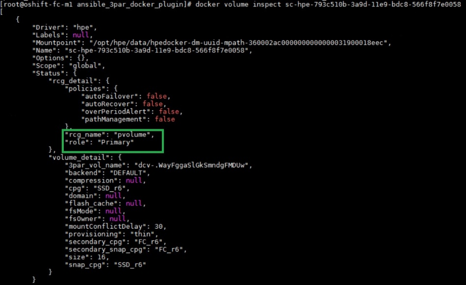

**Figure 118.** Verify persistent volume

The persistent volume has successfully failed back to the primary HPE
3PAR StoreServ Storage array.

### Configuring Active/Passive replication within the HPE 3PAR volume plugin for Docker

Refer to the following document to learn how to configure replication
using the HPE 3PAR volume plugin for Docker at,
<https://github.com/hpe-storage/python-hpedockerplugin/blob/master/docs/active-passive-based-replication.md>
.

### HPE 3PAR Peer Persistence replication (Non-Disruptive)

HPE 3PAR Peer Persistence software enables HPE 3PAR systems located at
metropolitan distances to act as peers to each other. This provides
continuous storage system to the hosts that are connected to them. This
capability allows for the configuration of a high-availability solution
between the two sites or data centers, where failover and failback
remains completely transparent to the hosts and applications running on
those hosts. Compared to the traditional failover models where the hosts
must be restarted upon failover, the peer persistence software allows
hosts to remain online, serving their business applications even when
they switch from their original site to the disaster recovery (DR) site.
This results in an improved recovery time compared to other methods. The
peer persistence software achieves this key enhancement by taking
advantage of the Asymmetric Logical Unit Access (ALUA) capability that
allows paths to a SCSI device to be marked as having different
characteristics.

Using HPE 3PAR Peer Persistence, an OpenShift user mounts the replicated
volume(s) and then the HPE 3PAR Docker plugin creates VLUNs
corresponding to the replicated volume(s) on both of the arrays.
However, the VLUN(s) is served only by the active array with the other
array being on standby mode. When the corresponding RCG is switched over
or the primary array goes down, the secondary array takes over and makes
the VLUN(s) available. After switchover, the active array goes in
standby mode while the formerly secondary array becomes active. Figure
119 presents a logical layout of peer persistence.

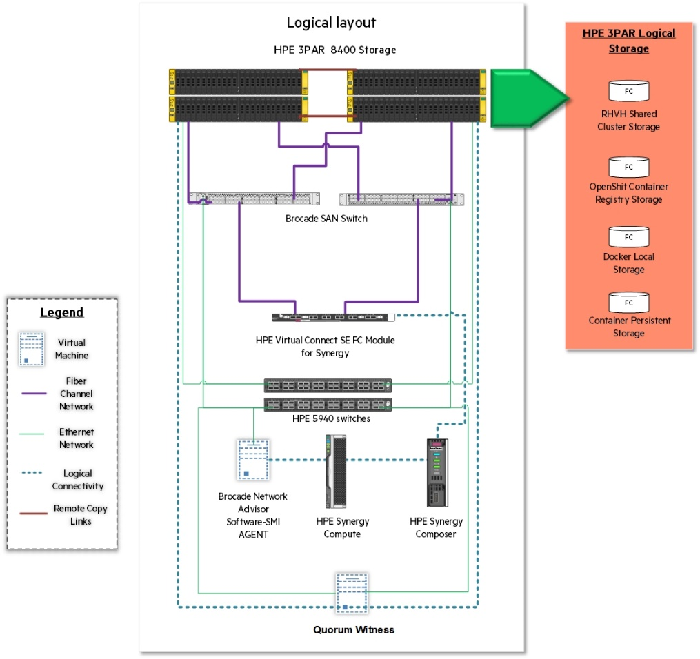

**Figure 119.** **HPE 3PAR** Peer persistence logical layout

In order to use HPE 3PAR Peer Persistence replication, the following
prerequisites should be met.

- Remote copy should be configured, up and running.

- Quorum Witness is running with primary and secondary arrays registered
with it.

- Multipath daemon is running so that non-disruptive seamless mounting
of VLUN(s) on the host is possible.

#### Planned switchover workflow for HPE 3PAR Peer Persistence based replication

In the event of planned maintenance, a manual switchover can be
performed using the steps mentioned below. Currently, there is no native
OpenShift command to failover a replicated volume. Instead, this must be
done from within the HPE 3PAR CLI or SSMC. The following steps use SSMC
to switchover a volume from one array to another.

1) In SSMC, select **Remote Copy** Groups as in Figure 120.


**Figure 120.** HPE 3PAR SSMC menu

2) From the *Actions* menu, select **Switchover** as in Figure 121.

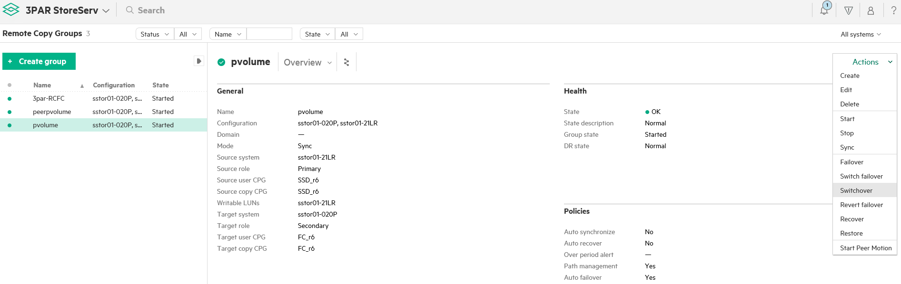

**Figure 121.** Selecting Switchover from action menu

3) A new window opens with the details of the action. Select
**Switchover** and then agree that you understand the implications and
select **Yes**, **switchover** as in Figure 122.


**Figure 122.** Switchover remote copy group information and
confirmation

4) Ensure that the remote copy group is started and inspect the relevant
Docker volume. The output should appear similar to that shown in Figure
123.

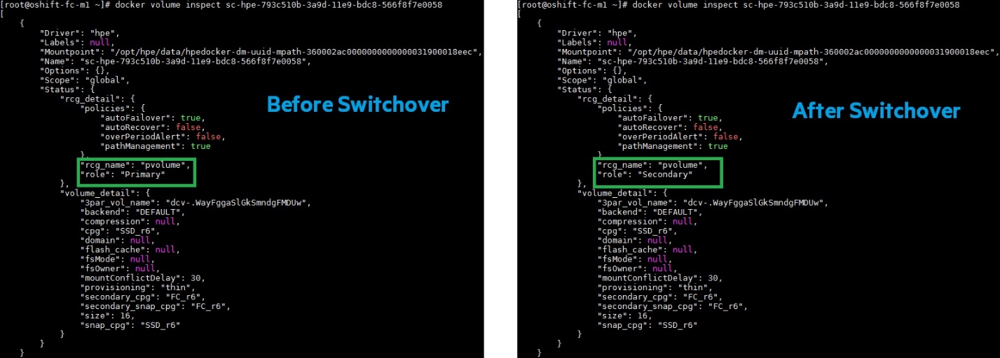

**Figure 123.** Docker volume inspect

5) Verify that the volume connected to the container is writeable as in
Figure 124.

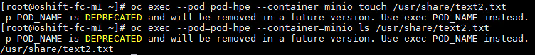

**Figure 124.** Verify persistent volume

### Configuring HPE 3PAR Peer Persistence (Non-Disruptive) replication within the HPE 3PAR volume plugin for Docker

Compared to Active/Passive configuration, the only discriminator with
HPE 3PAR Peer Persistence is the presence of a quorum_witness_ip
sub-field under replication_device field. Refer to the HPE 3PAR Peer
Persistence based replication document at,
<https://github.com/hpe-storage/python-hpedockerplugin/blob/master/docs/peer-persistence-based-replication.md>
in order to learn how to configure replication using the HPE 3PAR volume
plugin for Docker.

# Securing Red Hat OpenShift Container Platform

While IT organizations are turning cloud-native to satisfy market needs,
they additionally face many of the following security challenges while
adhering to essential security principles:

- It is challenging to assess the compliance posture of containers and
Kubernetes environments.

- There is a frequent lack of visibility into container infrastructure
and security incidents at runtime.

- There is a lack of ability to inspect a container's activity after it
is gone.

- As the number of images in the registry increases it becomes more
important to quickly identify critical vulnerabilities within images.

- Keeping track of secrets and credentials exposed by an image, among
thousands of images, is complex and time consuming.

- Identifying if an image is exposing in any blacklisted ports and it is
important to stop a hacker from gaining entry through a back door.

- Tracking the licenses and their types that are used by an image is
complex.

- Performing a compliance check on each container to identify any
violations is critical.

- Regular health checks must be performed on containers.

To address the container security challenges this document proposes
following two solutions to secure and monitor Red Hat OpenShift
Container Platform. The first solution uses the "Kube-bench" utility to
secure and monitor the Red Hat OpenShift Container Platform. For the
second solution, Hewlett Packard Enterprise and Sysdig have collaborated
to secure the solution stack, using the Sysdig cloud deployment model
for Sysdig Secure and Sysdig Monitor.

## Automated deployment of the kube-bench utility on the Red Hat OpenShift Container Platform

This section of the document describes how to assess the security
posture of OpenShift using the automated CIS Kubernetes benchmark with
the kube-bench utility. The kube-bench is a *Go application* that checks
whether Kubernetes is deployed securely by running the checks documented
in the [CIS Kubernetes
benchmark](https://www.cisecurity.org/benchmark/kubernetes/) . It helps
to deliver:

- Faster time to production with Red Hat OpenShift Container Platform.
- Increased operational efficiency with HPE Composable Infrastructure.
- Rapid and automated security checks.
- Simplified compliance for entire solution.

To install kube-bench, use the repository that was cloned from,
https://github.com/hewlettpackard/hpe-
[solutions](https://github.com/hewlettpackard/hpe-solutions-openshift)
-openshift. This repo contains Ansible plays and scripts to automate the
installation and running of kube-bench.

### Contents of the repo

-   **playbooks:** This folder contains the playbooks required for
    kube-bench installation.
-   **roles:** This folder contains a role called "
    **kube-bench-deploy-ocp**" which is responsible for performing the
    actions required for kube-bench integration.
-   **hosts:** This is the host file which will be used by Ansible
    Engine to reference hosts during kube-bench deployment. Update the
    master nodes, worker nodes and infrastructure nodes with the
    complete host names in this file.
-   **site.yaml:** This file will import the playbook
    "*kube-bench-deployment.yaml* " which defines the workflow for
    kube-bench integration.

### Prerequisites

The following prerequisites should be met prior to installation:

- Red Hat OpenShift Container Platform 3.11 should be up and running.
- All the nodes in the Red Hat OpenShift Container Platform 3.11
deployment should have Red Hat Enterprise Linux 7.6 deployed.
- The user has internet connection to clone the public GitHub
repositories for kube-bench and Golang on each node of the OpenShift
Container Platform.

### Custom attributes/variable files and plays

Each playbook has a role associated with it. Each role has a set of
tasks under the "task" folder. This file contains the automated steps
for Golang, kube-bench, running kube-bench and storing results back to
the Ansible Engine node.

```

security-kube-bench/roles/kube-bench-deploy-ocp/tasks/main.yml

```

### Using the playbooks

1) Edit the hosts file to suit the installation environment. In the
hosts file, provide the IP address or Fully Qualified Domain Name (FQDN)
of the master, infrastructure, and worker nodes as in the example in
Figure 125.

```

# cd
/etc/ansible/hpe-solutions-openshift/synergy/scalable/3par-vsphere/fc/security-kube-bench

# vi hosts

```


**Figure 125.** Shows the hosts file entries

2) Once the host file is edited, run the play using the following
command.

```

# ansible-playbook -i hosts site.yml

```

3) Once the playbook has completed, browse the *"/tmp/"* directory on
the Ansible Engine and ensure that all of the log files generated from
each of the masters, workers, and infrastructure nodes specified in the
hosts file are available in the directory. Figure 126 shows an example
directory listing.

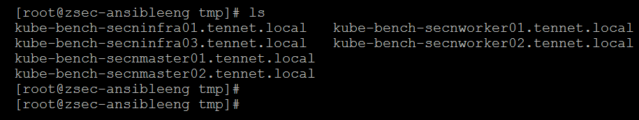

**Figure 126.** Log files on the Ansible Engine

#### Output

The number of log files located under /tmp will be equal to the number
of nodes specified in the hosts file. Each log file lists the details of
the CIS benchmark rules against which each of master, infrastructure,
and worker nodes are tested. Figure 127 provides an example of the log
files.

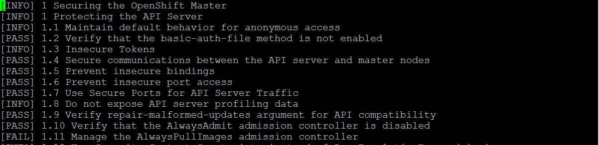

**Figure 127.** Log file example for an OpenShift master node

For each failed test, a set of remediation steps is listed in the logs.
Figure 128 shows an example of remediation steps.


Figure 128. Remediation steps

The end of each log file shows a summary of results as in Figure 129.

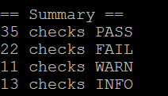

**Figure 129.** Summary of the results

## Automated deployment of the Sysdig agent on the Red Hat OpenShift Container Platform

This section describes how to install Sysdig agents in an automated way
within the context of the solution. Sysdig agents can be installed on a
wide array of Linux hosts. The assumption here is that a user will run
the Sysdig agent as a pod which then enables the Sysdig agent to
automatically detect and monitor Red Hat OpenShift Container Platform.

Hewlett Packard Enterprise used the *Sysdig DaemonSet* to deploy the
Sysdig agents on all of the nodes in the cluster. A DaemonSet ensures
that all OpenShift nodes run a copy of a pod. As nodes are added to the
cluster, pods are added to the newly introduced nodes. As nodes are
removed from the cluster, those pods are in turn garbage collected.
Deleting a DaemonSet will clean up the pods it created. This DaemonSet
internally runs three kinds of daemons on every node:

-   Cluster storage daemon
-   Logs collection daemon
-   Monitoring daemon

Once these daemons are deployed on OpenShift nodes, the Sysdig Monitor
automatically begins monitoring all of the hosts, applications, pods,
and services and automatically connects to the OpenShift API server to
pull relevant metadata about the environment. If licensed, Sysdig Secure
launches with default policies that a user can view and configure to
suit their needs.

- To install Sysdig agents on the Red Hat OpenShift Container Platform
nodes, use the

- repository located at the HPE OpenShift solutions GitHub at,

--   <https://github.com/hewlettpackard/hpe-solutions-openshift> . This
    repository contains

- Ansible plays and scripts to automate installation.

### Contents of the repo

-   **Playbooks:** This folder contains the playbooks required for
    Sysdig agent installation.
-   **Roles:** This folder contains a role called
    "sysdig-agent-deploy-ocp" which is responsible for performing the
    actions required for Sysdig agent integration.
-   **Hosts:** This is the host file which will be used by the Ansible
    Engine to reference hosts during Sysdig agent deployment. Provide
    the OpenShift Container Platform master node complete host name in
    this file.
-   **site.yaml:** In this file, the playbook
    "*sysdig-agent-deployment.yaml*" is imported. This file defines
    the entire workflow for Sysdig integration.

### Prerequisites

In order to successfully deploy Sysdig agents on the OpenShift Container
Platform

nodes, refer to the following prerequisites:

- Red Hat OpenShift Container Platform 3.11 is up and running.

- Worker nodes in the Red Hat OpenShift Container Platform deployment
can be virtual or physical running RHEL 7.6.

- The installation user has SaaS based access to Sysdig Secure and
Sysdig Monitor for the purpose of container security.

- The installation user has admin rights and privileges for Sysdig
Secure and Sysdig Monitor.

- Sysdig agents with version 0.90.3 are deployed on OpenShift Container
Platform.

- The user has a valid access token that is given by Sysdig and is
specific to their credentials on Sysdig Monitor and Sysdig Secure.

- The installation user has updated the kernel to make sure all RHEL
nodes are running the same kernel version. Run the following command to
install kernel headers on master, infrastructure, and worker nodes.

```

# *yum -y install kernel-devel-\$(uname -r)*

```

### Custom attributes/variable files and plays

Each playbook has a role associated with it. Each role has a set of
tasks under the *"task"* folder and variables under the *"var*"
folder. These variable values need to be defined by the user according
to the user's environment before running the plays. Alter the following
files:

-   *sysdig-agent-deploy-ocp/vars/main.yml:* This file will be used
    during Sysdig agent deployment to OpenShift and contains Sysdig
    related variables.
-   *sysdig-agent-deploy-ocp/tasks/main.yml:* This file contains the
    actual Sysdig agent installation steps.
-   *sysdig-agent-deploy-ocp/files/sysdig-agent-configmap.yaml* : This
    file is provided by Sysdig and handles the Sysdig software related
    configurations.
-   *sysdig-agent-deploy-ocp/files/sysdig-agent-daemonset-redhat-openshift.yaml*
    : This file is provided by Sysdig and handles the Sysdig daemon
    related configurations.

### How to use playbooks

This section describes the steps that need to be performed to use the
playbooks. Once the required repository is cloned to the Ansible Engine
host, navigate to following path on the cloned directory.

```

# cd
/etc/ansible/hpe-solutions-openshift/synergy/scalable/3par-vsphere/fc/

security-sysdig

```

Update the variables in the following files:

1) hosts

a. Provide the master node (only 1 master node is required) fully
qualified domain name (FQDN) or IP address under [master]. All the
Sysdig specific files will be copied to this master node.

b. Edit the file *roles/sysdig-agent-deploy-ocp/vars/main.yml*.

Provide a value for the project name for Sysdig integration with
OpenShift under the "*projectname*" variable.

c. Provide the Sysdig access key/token value. This value is retrieved
from the user setting by logging into either Sysdig Secure or Sysdig
Monitor GUI and is found in the "*accesskeyval*" variable.

2) Edit the file*roles/sysdig-agent-deploy-ocp/files/sysdig-agent-configmap.yaml*

a. Enter "OpenShift" as the cluster type.

b. Enter the Sysdig Collector address and port. Check with the Sysdig
team to know which collector is accessible in your environment and over
which port.

c. It is recommended to access Sysdig collector over Secure Socket Layer
(SSL). For both the keys "ssl" and "ssl certificate validate" set the
value as "true".

d. Set the variable related to the underlying Kubernetes deployment that
is OpenShift in this solution to true.

e. Enter the cluster name of the OpenShift cluster.

3) Run the play using following command.

```

# ansible-playbook -i hosts site.yml

```

4) To verify the deployment, log in to the master node that is mentioned
in the hosts file and type the following command.

```

# oc get pods

```

This command will output all Sysdig agent names running on each of the
nodes within your OpenShift cluster as shown in Figure 130. If you see a
pod with a pending status, then there might be a possibility that the
underlying OpenShift node is not functional.


**Figure 130.** Sysdig agents running on OpenShift nodes

5) Check the number of nodes that are currently up and running in the
OpenShift Container Platform deployment using the command "oc get nodes"
as shown in Figure 131.

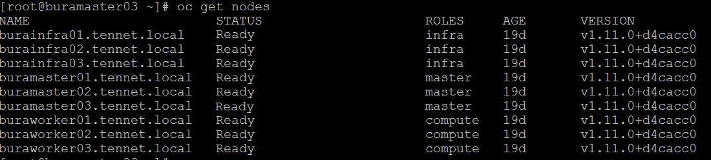

**Figure 131.** OpenShift nodes information

6) From the Sysdig Secure web interface, click on the icon named
***POLICY EVENTS*** and you will see the web interface for the *Policy
Events* tab. On the *Policy Events* tab, click the ***Groupings*** ****
drop-down list and select ***Entire Infrastructure***. The user with
administrative privileges should be able to see all of the OpenShift
nodes as in Figure 132.

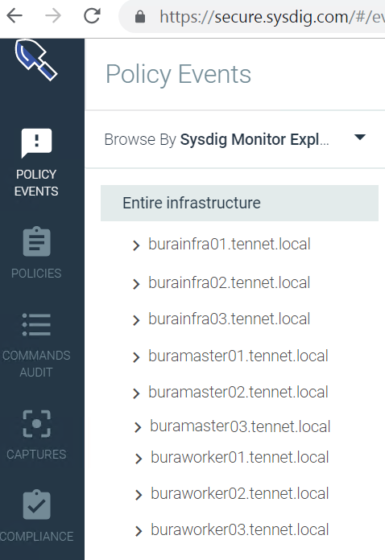

**Figure 132.** OpenShift cluster in Sysdig Secure

7) From the Sysdig Monitor web interface, click on the icon named
**EXPLORE** and you will see the web interface for the **Explore** tab.
On the Explore tab, click the **Data Source** (two rectangles) drop down
menu and select the data source named **Sysdig** **Agents** from the
drop down list. Then open the **Groupings** drop down list and select
**Clusters and Nodes**. The user with administrative privileges should
be able to see all of the OpenShift nodes as in Figure 133.


**Figure 133.** OpenShift cluster in Sysdig Monitor

**NOTE**

For an explanation of host requirements for agent installation, refer to
<https://sysdigdocs.atlassian.net/wiki/spaces/Platform/pages/192151570/Host+Requirements+for+Agent+Installation>
.

**NOTE**

It is recommended to use port 6443 for transferring and receiving data
over Secure Sockets Layer/ Transport Layer Security (SSL/TLS) protocol.
Sysdig agents transfer data to Sysdig Cloud over HTTPS that encrypts and
decrypts the requests as well as the responses that are returned by the
Sysdig Cloud.

**NOTE**

The OpenShift cluster name can be found by using the command "oc config
view" from any master node. 

8) From the Sysdig Monitor web interface, click on the icon
named**EXPLORE**. On the Explore tab, click the **Data Source** (two
rectangles) drop down menu and select the data source named **Sysdig
Agents** from the drop down list. Open the**Groupings** drop down list
and select **Deployment and Pods**. A user with administrative
privileges should be able to see all the agents and their details as
shown in Figure 134.

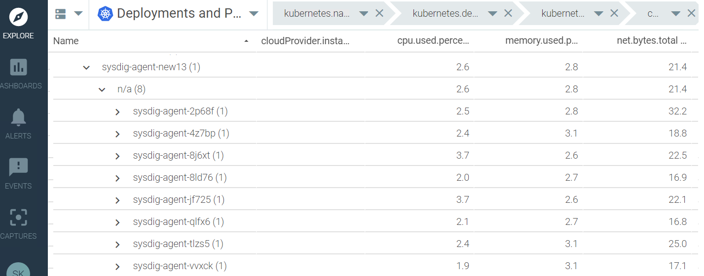

**Figure 134.** Sysdig agents running on the OpenShift cluster

# Ansible OpenShift deployment removal

This Ansible play removes the Red Hat OpenShift 3.11 deployment. It is a
two-step process that requires uninstalling the application followed by
unregistering Red Hat OpenShift components and deleting any deployed
VMs.

## Uninstall OpenShift

To uninstall OpenShift 3.11 from all nodes, run the following command.

```

# ansible-playbook -i
/etc/ansible/hpe-solutions-openshift/synergy/scalable/3par-vsphere/iscsi/hosts
/usr/share/ansible/openshift-ansible/playbooks/adhoc/uninstall.yml

```

## Unregister OpenShift components and delete deployed VMs

To unregister the nodes from Red Hat subscription and to delete the VMs
from VMware vCenter Server Appliance, run the following command.

```

# ansible-playbook -i
/etc/ansible/hpe-solutions-openshift/synergy/scalable/3par-vsphere/iscsi/hosts
/etc/ansible/hpe-solutions-openshift/synergy/scalable/3par-vsphere/iscsi/playbooks/delete_vm.yaml
--ask-vault-pass

```

# Disconnected installation of Red Hat OpenShift Container Platform

## Overview

Some data centers may not have access to the internet for security
reasons. Installing OpenShift Container Platform in these environments
is considered a disconnected installation.

In these air-gapped environments, OpenShift Container Platform software
channels and Red Hat's Docker registry and repositories are not
available via Red Hat's content distribution network. The installer will
download the required software repositories and packages when the user
is able to connect to a valid Red Hat account.

The installer will utilize these repositories & packages whenever they
are required. The user creates customized registry for maintaining a
local registry based on web server repositories and packages. A
disconnected installation ensures the OpenShift Container Platform
software is made available to the relevant servers, then follows the
same installation process as a standard connected installation.

This section describes the steps required to create a Red Hat OpenShift
Container Platform environment running on HPE Synergy and HPE 3PAR
Storage in a disconnected fashion.

It is intended to be used in conjunction with files and Ansible
playbooks found at [https://github.com/hewlettpackard/hpe-solutions-
openshift/tree/master/synergy/scalable/3par-iscsi/disconnected](https://github.com/hewlettpackard/hpe-solutions-%20openshift/tree/master/synergy/scalable/3par-iscsi/disconnected)
.

Figure 135 presents a high-level flow diagram for configuring Red Hat
OpenShift Container Platform in a disconnected fashion.


**Figure 135.** Flow diagram for the disconnected OpenShift installation

## Prerequisites

1) vSphere 6.7 host with appropriate network and storage configurations
within the deployment environment.

2) Red Hat Enterprise Linux 7.6

A repository server which can host Ansible Engine and web server needs
to be configured. The following section describes how to create these
resources.

## Configure a custom Ansible Engine with web server

### Overview

An Ansible Engine is provisioned to enable the users to run the Ansible
playbooks to provision and manage their application and infrastructure.

A web server should be configured to act as a repository server that can
connect to the internet in order to download and sync all of the
required packages/images for a disconnected installation.

Both the Ansible Engine and web server are created on a single VM to
reduce the cost and complexity.

The high-level steps involved in configuring the Ansible Engine/web
server are described below:

1) Create a VM and install RHEL 7.6.

2) Install RHEL 7.6 on the VM.

3) Configure Ansible Engine.

4) Install Python and RHEL.

5) Clone required repositories.

6) Configure the web server.

7) Validate web server creation.

#### Create a VM and install RHEL 7.6

262) The installer must create the Ansible Engine VM with the following
settings.

-   RHEL 7.6
-   4 vCPU
-   16GB RAM
-   1x 250GB HDD
-   1 Network Interface connected to the management network
-   While installing RHEL, the **/** partition must be increased to
    150GB.

#### Configure Ansible Engine

Log in to the Ansible Engine and perform the following steps:

1) Register the server with the Red Hat customer portal using the
following command.

```

# subscription-manager register --username=**<red hat subscription
username>** --password= **<red hat subscription password>**
--auto-attach

```

2) Pull the latest subscription data from the Red Hat subscription
manager using the following command.

```

*#* subscription-manager refresh

```

3) Find an available subscription pool for virtual systems running RHEL
that provides the OpenShift Container Platform channels using the
following command.

```

# subscription-manager list --available --matches '*OpenShift*'

```

4) Attach a pool ID for a subscription that provides OpenShift Container
Platform entitlement.

```

*# subscription-manager attach --pool=<pool_id>*

```

5) Disable all the repositories using the following command.

```

# subscription-manager repos --disable="*"

```

6) Enable rhel-7-server-extras-rpms using the following command.

```

# subscription-manager repos --enable rhel-7-server-extras-rpms

```

**NOTE**

This solution is deployed with **Python 3.6.x** along with **Ansible
2.7.2**.

#### Install Python and Ansible

The following steps should be taken to assist in the installation of
appropriate Python and Ansible versions.

1) Install Python 3.6.x using the following command.

```

# yum -y install rh-python36

```

2) Enable the Python 3.6.x environment using the following command.

```

# scl enable rh-python36 bash

```

3) Create a new virtual environment for deploying this solution.

```

# python3 -m venv *<virtual environment name>*

```

4) Activate the virtual environment.

```

# source **<virtual environment name>/bin/activate**

```

5) Install Ansible 2.7.2 with the following command.

```

# python3 -m pip install ansible==2.7.2

```

#### Clone required repositories

This solution utilizes multiple Python and Ansible repositories. This
section lists the steps to download and install them.

1) Execute the following commands on the Ansible Engine to download the
repositories.

```

# cd /etc/ansible

# git clone --b 3.11
https://github.com/HewlettPackard/hpe-solutions-openshift.git

```

2) oneview-ansible is the Ansible module for HPE OneView which utilizes
the Python SDK to enable infrastructure as a code.

a) Clone the repository found at,
<https://github.com/HewlettPackard/oneview-ansible/> .

b) Navigate to the directory oneview-ansible on the Ansible Engine and
execute the following command.

```

# cd <path to oneview-ansible>

# pip install --r requirements.txt

```

c) Export the path of *oneview-ansible/library* and
*oneview-ansible/library/module_utils* to the environment variables
ANSIBLE_LIBRARY and ANSIBLE_MODULE_UTILS using the following
commands.

```

# export ANSIBLE_LIBRARY=<absolute path to /oneview-ansible/library>

# export ANSIBLE_MODULE_UTILS=<absolute path to
/oneview-ansible/library/module_utils>

```

3) PyVmomi is the Python SDK for the VMware vSphere API that allows
managing ESX, ESXi, and vCenter. Execute the following command in the
Ansible Engine.

```

# pip install pyVmomi

```

#### Configure the web server

The web server creation process is automated using the playbook
*"webserver_creation.yml"* found at
*/etc/ansible/hpe-solutions-openshift/synergy/scalable/3par-vsphere/iscsi/disconnected*
. The playbook accomplishes the following:

1) Enables the following rpms for the webserver:

a) rhel-7-server-rpms

b) rhel-7-server-extras-rpms

c) rhel-7-server-ansible-2.6-rpms

d) rhel-7-server-ose-3.11-rpms

e) rhel-7-fast-datapath-rpms

2) Installs the following required packages for the webserver:

a) yum-utils

b) createrepo

c) docker

d) git

e) httpd

3) Creates repos for each of the above rpms.

4) Moves all repos to the root directory of the webserver and updating
the directory permissions.

5). Applies SELinux policies on the repos directory.

6). Enables and reloads firewall services.

7). Enables and starts the httpd service.

8). Unregisters the host when done.

##### Run the play to create the web server

1) Update the host file and vault file *vault_pass.*yml at
*etc/ansible/hpe-solutions-openshift/synergy/scalable/3par-vsphere/iscsi/disconnected*
. Refer to the sample host file below as a reference.

```

Hosts file

[webserver]

Ansible_engine.tennet.local

```

2) Ensure that the known host file has the entry of the web server to
avoid the prompt for SSH Password while the playbooks are running.
Optionally run the following command to add the web server to known host
file.

```

# ssh-copy-ip root@<webserver_fqdn>

```

3) In the vault file, uncomment the *ansible_ssh_user* and
*ansible_ssh_pass* values before executing the playbooks.

4) Once the host file and the variable files are updated with the
appropriate values, execute the following command from the Ansible
Engine to create a webserver within the Ansible Engine.

```
# cd
etc/ansible/hpe-solutions-openshift/synergy/scalable/3par-vsphere/iscsi/disconnected

# ansible-playbook -i hosts playbooks/webserver_creation.yml
--ask-vault-pass [--e\@vault_pass.yml](mailto:–e@vault_pass.yml)
```

**NOTE**

The playbook *webserver_creation.yml* takes around **3+ hours** to
complete the execution and creating the web server.

#### Validate web server creation

Navigate to the URL https://<<webserver_ip>>/repo, to view the
repos hosted on the web server as in Figure 136.

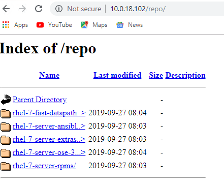

**Figure 136.** Web server contents

# Provision management and worker nodes for the Red Hat OpenShift deployment

For provisioning management and worker nodes, refer to the following sections
listed under online deployment: 
- [Compute Module configuration](#_Compute_Module_configuration) 
- [Red Hat OpenShift Container Platform management functions](#_Red_Hat_OpenShift) 
- [Deploying worker nodes](#_Deploying_worker_nodes) 

Once the management and worker nodes are successfully provisioned, begin with the [Registry
Server](#_Registry_Server)

## Registry server

The purpose of the registry server in case of disconnected environment
is to provide the catalog of images for installing OpenShift Container
Platform.

### Creation of a registry server

The high-level steps involved to configure a registry server are
described below:

1) Create a VM to act as a registry server.

2) Install RHEL 7.6 on the VM.

3) Download the required repositories.

4) Configure the registry server.

The installer must create the VM with the following configurations for
the registry server:

a) 2 vCPU, 16GB memory,

b) 150GB hard disk

c) Network adapter with the data center network.

d) Operating System: Red Hat Enterprise Linux 7.6

## Download repositories

Download the repositories from web server to management nodes (master,
load balancer, and infra), virtual worker nodes, Ansible Engine &
registry server.

The playbook *enabling_repos.yml* found at
*etc/ansible/hpe-solutions-openshift/synergy/scalable/3par-vsphere/iscsi/playbooks*
, downloads all required repositories into all these virtual machines.

1) Update the following YAML files with relevant values as per the setup
details.

- ose.repo

- vault_pass.yml

- Download_packages.yml

2) A sample entry provided below can be referred to in order to make
necessary updates. In the *ose.repo* file, the web server IP address
should be updated as shown in the highlighted section below.

```

**ose.repo** :

[rhel-7-server-rpms]

name=rhel-7-server-rpms

baseurl=http://<**webserver_ipaddress>/** repo/rhel-7-server-rpms

enabled=1

gpgcheck=0

[rhel-7-server-extras-rpms]

name=rhel-7-server-extras-rpms

baseurl=http://<**webserver_ipaddress>**
/repo/rhel-7-server-extras-rpms

enabled=1

gpgcheck=0

[rhel-7-server-ansible-2.6-rpms]

name=rhel-7-server-ansible-2.6-rpms

baseurl=http://<**webserver_ipaddress>**
/repo/rhel-7-server-ansible-2.6-rpms

enabled=1

gpgcheck=0

[rhel-7-server-ose-3.11-rpms]

name=rhel-7-server-ose-3.11-rpms

baseurl=http://<**webserver_ipaddress>**
repo/rhel-7-server-ose-3.11-rpms

enabled=1

gpgcheck=0

[rhel-7-fast-datapath-rpms]

name=rhel-7-fast-datapath-rpms

baseurl=http://<**webserver_ipaddress>**
/repo/rhel-7-fast-datapath-rpms

enabled=1

gpgcheck=0

```

3) In the *download_packages* YAML file**,** update the value for the
field **src** as highlighted below.

```

- hosts:

- webserver

- virtual-nodes

- registry

```

4) **Update the value for the variable *src*** in the following task.

```

- name: copy ose.repo file into remote location

copy:

src: <absolute path_to_/ose.repo>

dest: /etc/yum.repos.d/

```

5) Run the following command from the Ansible Engine, after updating the
variable and task files.

```

# cd
/etc/ansible/hpe-solutions-openshift/synergy/scalable/3par-vsphere/iscsi/

# ansible-playbook --i hosts playbooks/Download_packages.yml
--ask-vault-pass [--e\@vault_pass.yml](mailto:–e@vault_pass.yml)

```

## Configure the registry server

A number of images need to be pulled into the custom registry server in
order to support the Red Hat OpenShift Container Platform installation
in a disconnected environment. This section describes the high-level
steps that needs to be performed in order to get the images required for
the disconnected installation. These include:

1) Install and configure Docker service.

2) Pull the required images into the registry server.

3) Tag images with the registry server.

4) Create a customized registry.

5) Push tagged images into the customized registry.

6) Validate the functionality of the registry server.

### Install and configure Docker service

The Docker service is essential to the functionality of the registry
server. After the repositories are downloaded from the web server into
the OpenShift roles, follow the following steps to install and start the
Docker service:

1) SSH into the registry server.

2) Execute the following command to install Docker service.

```
# yum --y install docker
```

3) Start the Docker service using the following command.

```
# systemctl start docker
```

**NOTE**

It is recommended to pull the latest *3.11.<sub-vers>* images from Red
Hat. Replace **<sub-vers>** with the latest minor-version before
executing the command.

To check the latest minor-version, execute the following command in the
Ansible Engine

```

# rpm -q openshift-ansible

```

### Pull the required images into the Registry Server

The images will be pulled from repositories which are downloaded to the
webserver. The following commands should be executed on registry server.

1) Pull the OpenShift infrastructure related images.

```

# for image in
{apb-base:v3.11.<sub-vers>,apb-tools:v3.11.<sub-vers>,automation-broker-apb:v3.11.<sub-vers>,csi-attacher:v3.11.<sub-vers>,csi-driver-registrar:v3.11.<sub-vers>,csi-livenessprobe:v3.11.<sub-vers>,csi-provisioner:v3.11.<sub-vers>,grafana:v3.11.<sub-vers>,image-inspector:v3.11.<sub-vers>,mariadb-apb:v3.11.<sub-vers>,mediawiki:v3.11.<sub-vers>,mediawiki-apb:v3.11.<sub-vers>,mysql-apb:v3.11.<sub-vers>,ose-ansible:v3.11.<sub-vers>,ose-ansible-service-broker:v3.11.<sub-vers>,ose-cli:v3.11.<sub-vers>,ose-cluster-autoscaler:v3.11.<sub-vers>,ose-cluster-capacity:v3.11.<sub-vers>,ose-cluster-monitoring-operator:v3.11.<sub-vers>,ose-console:v3.11.<sub-vers>,ose-configmap-reloader:v3.11.<sub-vers>,ose-control-plane:v3.11.<sub-vers>,
ose-control-plane:v3.11,ose-deployer:v3.11.<sub-vers>,ose-descheduler:v3.11.<sub-vers>,ose-docker-builder:v3.11.<sub-vers>,ose-docker-registry:v3.11.<sub-vers>,ose-efs-provisioner:v3.11.<sub-vers>,ose-egress-dns-proxy:v3.11.<sub-vers>,ose-egress-http-proxy:v3.11.<sub-vers>,ose-egress-router:v3.11.<sub-vers>,ose-haproxy-router:v3.11.<sub-vers>,ose-hyperkube:v3.11.<sub-vers>,ose-hypershift:v3.11.<sub-vers>,ose-keepalived-ipfailover:v3.11.<sub-vers>,ose-kube-rbac-proxy:v3.11.<sub-vers>,ose-kube-state-metrics:v3.11.<sub-vers>,ose-metrics-server:v3.11.<sub-vers>,ose-node:v3.11.<sub-vers>,ose-node-problem-detector:v3.11.<sub-vers>,ose-operator-lifecycle-manager:v3.11.<sub-vers>,ose-pod:v3.11.<sub-vers>,ose-prometheus-config-reloader:v3.11.<sub-vers>,ose-prometheus-operator:v3.11.<sub-vers>,
ose-prometheus-operator:v3.11,ose-recycler:v3.11.<sub-vers>,ose-service-catalog:v3.11.<sub-vers>,ose-template-service-broker:v3.11.<sub-vers>,ose-web-console:v3.11.<sub-vers>,postgresql-apb:v3.11.<sub-vers>,registry-console:v3.11.<sub-vers>,snapshot-controller:v3.11.<sub-vers>,snapshot-provisioner:v3.11.<sub-vers>};
do

docker pull registry.access.redhat.com/openshift3/\$image

done

```

2) Pull the ectd image.

```

# docker pull registry.access.redhat.com/rhel7/etcd:3.2.22

```

3) Pull the OpenShift services images.

```

# for image in
{metrics-cassandra:v3.11.<sub-vers>,metrics-hawkular-metrics:v3.11.<sub-vers>,metrics-hawkular-openshift-agent:v3.11.<sub-vers>,metrics-heapster:v3.11.<sub-vers>,oauth-proxy:v3.11.<sub-vers>,ose-logging-curator5:v3.11.<sub-vers>,ose-logging-elasticsearch5:v3.11.<sub-vers>,ose-logging-eventrouter:v3.11.<sub-vers>,ose-logging-fluentd:v3.11.<sub-vers>,ose-logging-kibana5:v3.11.<sub-vers>,ose-metrics-schema-installer:v3.11.<sub-vers>,prometheus:v3.11.<sub-vers>,prometheus-alert-buffer:v3.11.<sub-vers>,
image-inspector:v3.11.<sub-vers>,
prometheus-alertmanager:v3.11.<sub-vers>,
prometheus-alert-buffer:v3.11.<sub-vers>,prometheus-node-exporter:v3.11.<sub-vers>};
do

docker pull registry.access.redhat.com/openshift3/\$image

done

```

4) Pull the 3PAR Docker plugin images.

```

# docker pull hpestorage/legacyvolumeplugin:3.1

# docker pull hpestorage/legacyvolumeplugin:3.0

```

### Tag the Images with customized registry server

Tagging the images with the registry server using its fully qualified
domain name along with port number.

1) Tag the OpenShift infrastructure related images with minor version.

```

for image in
{apb-base:v3.11.<sub-vers>,apb-tools:v3.11.<sub-vers>,automation-broker-apb:v3.11.<sub-vers>,csi-attacher:v3.11.<sub-vers>,csi-driver-registrar:v3.11.<sub-vers>,csi-livenessprobe:v3.11.<sub-vers>,csi-provisioner:v3.11.<sub-vers>,grafana:v3.11.<sub-vers>,image-inspector:v3.11.16,mariadb-apb:v3.11.<sub-vers>,mediawiki:v3.11.<sub-vers>,mediawiki-apb:v3.11.<sub-vers>,mysql-apb:v3.11.<sub-vers>,ose-ansible:v3.11.<sub-vers>,ose-ansible-service-broker:v3.11.<sub-vers>,ose-cli:v3.11.<sub-vers>,ose-cluster-autoscaler:v3.11.<sub-vers>,ose-cluster-capacity:v3.11.<sub-vers>,ose-cluster-monitoring-operator:v3.11.<sub-vers>,ose-console:v3.11.<sub-vers>,ose-configmap-reloader:v3.11.<sub-vers>,ose-control-plane:v3.11.<sub-vers>,ose-deployer:v3.11.<sub-vers>,ose-descheduler:v3.11.<sub-vers>,ose-docker-builder:v3.11.<sub-vers>,ose-docker-registry:v3.11.<sub-vers>,ose-efs-provisioner:v3.11.<sub-vers>,ose-egress-dns-proxy:v3.11.<sub-vers>,ose-egress-http-proxy:v3.11.<sub-vers>,ose-egress-router:v3.11.<sub-vers>,ose-haproxy-router:v3.11.<sub-vers>,ose-hyperkube:v3.11.<sub-vers>,ose-hypershift:v3.11.<sub-vers>,ose-keepalived-ipfailover:v3.11.<sub-vers>,ose-kube-rbac-proxy:v3.11.<sub-vers>,ose-kube-state-metrics:v3.11.<sub-vers>,ose-metrics-server:v3.11.<sub-vers>,ose-node:v3.11.<sub-vers>,ose-node-problem-detector:v3.11.<sub-vers>,ose-operator-lifecycle-manager:v3.11.<sub-vers>,ose-pod:v3.11.<sub-vers>,ose-prometheus-config-reloader:v3.11.<sub-vers>,ose-prometheus-operator:v3.11.<sub-vers>,
ose-prometheus-operator:v3.11.12,ose-recycler:v3.11.<sub-vers>,ose-service-catalog:v3.11.<sub-vers>,ose-template-service-broker:v3.11.<sub-vers>,ose-web-console:v3.11.<sub-vers>,postgresql-apb:v3.11.<sub-vers>,registry-console:v3.11.<sub-vers>,snapshot-controller:v3.11.<sub-vers>,snapshot-provisioner:v3.11.<sub-vers>};
do

docker tag registry.access.redhat.com/openshift3/\$image
<registry_server_fqdn>:5000/openshift3/\$image

done

```

2) Tag the OpenShift Infrastructure related images without minor
version.

```

# for image in
{apb-base,apb-tools,automation-broker-apb,csi-attacher,csi-driver-registrar,csi-livenessprobe,csi-provisioner,grafana,mariadb-apb,mediawiki,mediawiki-apb,mysql-apb,ose-ansible,ose-ansible-service-broker,ose-cli,ose-cluster-autoscaler,ose-cluster-capacity,ose-cluster-monitoring-operator,ose-console,ose-configmap-reloader,ose-control-plane,ose-deployer,ose-descheduler,ose-docker-builder,ose-docker-registry,ose-efs-provisioner,ose-egress-dns-proxy,ose-egress-http-proxy,ose-egress-router,ose-haproxy-router,ose-hyperkube,ose-hypershift,ose-keepalived-ipfailover,ose-kube-rbac-proxy,ose-kube-state-metrics,ose-metrics-server,ose-node,ose-node-problem-detector,ose-operator-lifecycle-manager,ose-pod,ose-prometheus-config-reloader,ose-prometheus-operator,ose-recycler,ose-service-catalog,ose-template-service-broker,ose-web-console,postgresql-apb,registry-console,snapshot-controller,snapshot-provisioner};
do

docker tag registry.access.redhat.com/openshift3/\$image:v3.11
<registry_server_fqdn>:5000/openshift3/\$image:v3.11

done

```

3) Tag the etcd images.

```

# docker tag registry.access.redhat.com/rhel7/etcd:3.2.22
<registry_server_fqdn>:5000/rhel7/etcd:3.2.22

```

4) Remove the prometheus-alert-buffer:v3.11.129 image.

```

# prometheus-alert-buffer:v3.11.129 removed image

```

5) Tag the OpenShift services related images with minor version.

```

# for image in
{metrics-cassandra:v3.11.<sub-vers>,metrics-hawkular-metrics:v3.11.<sub-vers>,metrics-hawkular-openshift-agent:v3.11.<sub-vers>,metrics-heapster:v3.11.<sub-vers>,oauth-proxy:v3.11.<sub-vers>,ose-logging-curator5:v3.11.<sub-vers>,ose-logging-elasticsearch5:v3.11.<sub-vers>,ose-logging-eventrouter:v3.11.<sub-vers>,ose-logging-fluentd:v3.11.<sub-vers>,ose-logging-kibana5:v3.11.<sub-vers>,ose-metrics-schema-installer:v3.11.<sub-vers>,prometheus:v3.11.<sub-vers>,prometheus-alert-buffer:v3.11.16,prometheus-alertmanager:v3.11.<sub-vers>,prometheus-node-exporter:v3.11.<sub-vers>};
do

docker tag registry.access.redhat.com/openshift3/\$image
<registry_server_fqdn>:5000/openshift3/\$image

done

```

6) Tag the OpenShift services related images without minor version.

```

# for image in
{metrics-cassandra,metrics-hawkular-metrics,metrics-hawkular-openshift-agent,metrics-heapster,oauth-proxy,ose-logging-curator5,ose-logging-elasticsearch5,ose-logging-eventrouter,ose-logging-fluentd,ose-logging-kibana5,ose-metrics-schema-installer,prometheus,prometheus-alertmanager,prometheus-node-exporter};
do

docker tag
registry.access.redhat.com/openshift3/\$image:v3.11.<sub-vers>
<registry_server_fqdn>:5000/openshift3/\$image:v3.11

done

```

7) Tag the 3PAR Docker plugin related images.

```

# docker tag hpestorage/legacyvolumeplugin:3.1
<registry_server_fqdn>:5000/hpestorage/legacyvolumeplugin:3.1

# docker tag hpestorage/legacyvolumeplugin:3.0
<registry_server_fqdn>:5000/hpestorage/legacyvolumeplugin:3.0

```

### Create a customized registry

Creating a customized registry for pushing all tagged images so that, it
can be used while executing *prepare_hosts and deploy_cluster
playbooks.*

1) Pull the registry image by executing the following command.

```

# docker pull registry

```

2) Add a registry server entry in the */etc/docker/daemon.json*
configuration file.

A sample file is shown below. It is expected that the user update
this file to suit their environment.

```
# vi /etc/docker/daemon.json

{ "insecure-registries" : ["<registry_server_hostname
>:5000"]}
```

3) Restart the Docker service by executing the following command.

```

# systemctl restart docker

```

4) Create a container with the registry image on port 5000.

```

# docker run -dit --restart=always --name docker-registry -p
5000:5000 registry

```

**NOTE**

To validate the registry image, execute the command in the registry
server.

```
# docker ps --a
```

### Push tagged Images into the customized registry

Pushing tagged images into customized registry will be considered for
disconnected OpenShift installation.

1) Push the OpenShift Infrastructure related images with minor version.

```

# for image in
{apb-base:v3.11.<sub-vers>,apb-tools:v3.11.<sub-vers>,automation-broker-apb:v3.11.<sub-vers>,csi-attacher:v3.11.<sub-vers>,csi-driver-registrar:v3.11.<sub-vers>,csi-livenessprobe:v3.11.<sub-vers>,csi-provisioner:v3.11.<sub-vers>,grafana:v3.11.<sub-vers>,image-inspector:v3.11.<sub-vers>,mariadb-apb:v3.11.<sub-vers>,mediawiki:v3.11.<sub-vers>,mediawiki-apb:v3.11.<sub-vers>,mysql-apb:v3.11.<sub-vers>,ose-ansible:v3.11.<sub-vers>,ose-ansible-service-broker:v3.11.<sub-vers>,ose-cli:v3.11.<sub-vers>,ose-cluster-autoscaler:v3.11.<sub-vers>,ose-cluster-capacity:v3.11.<sub-vers>,ose-cluster-monitoring-operator:v3.11.<sub-vers>,ose-console:v3.11.<sub-vers>,ose-configmap-reloader:v3.11.<sub-vers>,ose-control-plane:v3.11.<sub-vers>,ose-deployer:v3.11.<sub-vers>,ose-descheduler:v3.11.<sub-vers>,ose-docker-builder:v3.11.<sub-vers>,ose-docker-registry:v3.11.<sub-vers>,ose-efs-provisioner:v3.11.<sub-vers>,ose-egress-dns-proxy:v3.11.<sub-vers>,ose-egress-http-proxy:v3.11.<sub-vers>,ose-egress-router:v3.11.<sub-vers>,ose-haproxy-router:v3.11.<sub-vers>,ose-hyperkube:v3.11.<sub-vers>,ose-hypershift:v3.11.<sub-vers>,ose-keepalived-ipfailover:v3.11.<sub-vers>,ose-kube-rbac-proxy:v3.11.<sub-vers>,ose-kube-state-metrics:v3.11.<sub-vers>,ose-metrics-server:v3.11.<sub-vers>,ose-node:v3.11.<sub-vers>,ose-node-problem-detector:v3.11.<sub-vers>,ose-operator-lifecycle-manager:v3.11.<sub-vers>,ose-pod:v3.11.<sub-vers>,ose-prometheus-config-reloader:v3.11.<sub-vers>,ose-prometheus-operator:v3.11.<sub-vers>,
ose-prometheus-operator:v3.11.12,ose-recycler:v3.11.<sub-vers>,ose-service-catalog:v3.11.<sub-vers>,ose-template-service-broker:v3.11.<sub-vers>,ose-web-console:v3.11.<sub-vers>,postgresql-apb:v3.11.<sub-vers>,registry-console:v3.11.<sub-vers>,snapshot-controller:v3.11.<sub-vers>,snapshot-provisioner:v3.11.<sub-vers>,
ose-control-plane:v3.11}; do

docker push <registry_server_fqdn>:5000/openshift3/\$image

done

```

2) Push the etcd images with minor version.

```

# docker push <registry_server_fqdn>:5000/rhel7/etcd:3.2.22

```

3) Push the OpenShift services related images with minor version.

```

# for image in
{metrics-cassandra:v3.11.<sub-vers>,metrics-hawkular-metrics:v3.11.<sub-vers>,metrics-hawkular-openshift-agent:v3.11.<sub-vers>,metrics-heapster:v3.11.<sub-vers>,oauth-proxy:v3.11.<sub-vers>,ose-logging-curator5:v3.11.<sub-vers>,ose-logging-elasticsearch5:v3.11.<sub-vers>,ose-logging-eventrouter:v3.11.<sub-vers>,ose-logging-fluentd:v3.11.<sub-vers>,ose-logging-kibana5:v3.11.<sub-vers>,ose-metrics-schema-installer:v3.11.<sub-vers>,prometheus:v3.11.<sub-vers>,prometheus-alert-buffer:v3.11.<sub-vers>,prometheus-alertmanager:v3.11.<sub-vers>,prometheus-node-exporter:v3.11.<sub-vers>};
do

docker push <registry_server_fqdn>:5000/openshift3/\$image

done

```

4) Push the 3PAR Docker storage plugin related images.

```

# docker push
<registry_server_fqdn>:5000/hpestorage/legacyvolumeplugin:3.1

# docker push
<registry_server_fqdn>:5000/hpestorage/legacyvolumeplugin:3.0

```

### Validate the functionality of Registry server

1) Execute the following command on the registry server to validate all
the images are pulled.

```

# curl -X GET http://<registry server FQDN>:5000/v2/_catalog

```

2) On the web browser, load the URL http://<registry_ *server
FQDN>:5000/v2/_catalog* to list all images which were pushed in the
previous section.

The following is a list of images.

**Image List**

```

*{"repositories":["cloudforms46/cfme-httpd-configmap-generator","cloudforms46/cfme-openshift-app","cloudforms46/cfme-openshift-app-ui","cloudforms46/cfme-openshift-embedded-ansible","cloudforms46/cfme-openshift-httpd","cloudforms46/cfme-openshift-memcached","cloudforms46/cfme-openshift-postgresql","hpestorage/legacyvolumeplugin","hpestorage/legacyvolumeplugininstaller","minio/minio","openshift3/apb-base","openshift3/apb-tools","openshift3/automation-broker-apb","openshift3/csi-attacher","openshift3/csi-driver-registrar","openshift3/csi-livenessprobe","openshift3/csi-provisioner","openshift3/grafana","openshift3/mariadb-apb","openshift3/mediawiki","openshift3/mediawiki-apb","openshift3/metrics-cassandra","openshift3/metrics-hawkular-metrics","openshift3/metrics-hawkular-openshift-agent","openshift3/metrics-heapster","openshift3/mysql-apb","openshift3/oauth-proxy","openshift3/ose-ansible","openshift3/ose-ansible-service-broker","openshift3/ose-cli","openshift3/ose-cluster-autoscaler","openshift3/ose-cluster-capacity","openshift3/ose-cluster-monitoring-operator","openshift3/ose-configmap-reloader","openshift3/ose-console","openshift3/ose-control-plane","openshift3/ose-deployer","openshift3/ose-descheduler","openshift3/ose-docker-builder","openshift3/ose-docker-registry","openshift3/ose-efs-provisioner","openshift3/ose-egress-dns-proxy","openshift3/ose-egress-http-proxy","openshift3/ose-egress-router","openshift3/ose-haproxy-router","openshift3/ose-hyperkube","openshift3/ose-hypershift","openshift3/ose-keepalived-ipfailover","openshift3/ose-kube-rbac-proxy","openshift3/ose-kube-state-metrics","openshift3/ose-logging-curator5","openshift3/ose-logging-elasticsearch5","openshift3/ose-logging-eventrouter","openshift3/ose-logging-fluentd","openshift3/ose-logging-kibana5","openshift3/ose-metrics-schema-installer","openshift3/ose-metrics-server","openshift3/ose-node","openshift3/ose-node-problem-detector","openshift3/ose-operator-lifecycle-manager","openshift3/ose-pod","openshift3/ose-prometheus-config-reloader","openshift3/ose-prometheus-operator","openshift3/ose-recycler","openshift3/ose-service-catalog","openshift3/ose-template-service-broker","openshift3/ose-web-console","openshift3/postgresql-apb","openshift3/prometheus","openshift3/prometheus-alertmanager","openshift3/prometheus-node-exporter","openshift3/registry-console","openshift3/snapshot-controller","openshift3/snapshot-provisioner","rhel7/etcd"]}*

```

**NOTE**

If curl is not present in the registry server, install curl using the
following command.

```

# yum --y install curl

```

## Disconnected installation of Red Hat OpenShift Container Platform

This section describes the process to automatically deploy Red Hat
OpenShift Container Platform 3.11. This section is built with the
assumption that the required repository is already cloned and is
available on the Ansible Engine. For more information about cloning the
repositories, see [Download required Python and Ansible
repositories](#_Download_required_Python) .

### Prerequisites

In order to utilize the scripts and procedures documented in this
deployment, the following prerequisites must be met.

1) An Ansible Engine with integrated web server should be installed and
configured and capable of communicating with the hosts within this
solution as per the prior sections.

2) A custom local registry is installed and configured with all the
images required to deploy OpenShift Container Platform.

3) VMware vSphere is installed on at least three (3) HPE Synergy 480
Gen10 Compute Modules.

4) vCenter Server Appliance is set up.

5) Storage and networking are configured within vCenter.

6) Management and worker nodes with RHEL 7.6 are installed and
configured.

7) DNS entries should exist for all hosts.

8) A user should be created in Active Directory (AD) for authentication
and the user's AD values should be known.

In case *htpasswd* is used for authentication, an *htpasswd* file should
be created. *htpasswd* file can be created using the tool available at,
[http://www.htaccesstools.com/htpasswd-generator/.](http://www.htaccesstools.com/htpasswd-generator/)
Save the file to */etc/oshift-hash-pass.htpasswd* and refer this file in
the identity provider section under OpenShift variables in the host
file.

```

# openshift_master_identity_providers=[{'name':
'htpasswd_auth', 'login':'true', 'challenge':
'true','kind': 'HTPasswdPasswordIdentityProvider',}]

```

**NOTE**

For more information on authentication with OAuth, refer to the section
on [authentication](#_Authentication) in this document.

#### Generate a Key

1) On the Ansible Engine host, run the following command to generate a
key.

```
# ssh-keygen -t rsa
```

2) This creates a key file at *\~/.ssh/id_rsa.pub*.

3) Copy this SSH public key to */var* and change the permission using
the following commands.

```

# cp /root/.ssh/id_rsa.pub /var/id_rsa.pub

# chmod 666 /var/id_rsa.pub

```

4) To find pool IDs for the management and worker VMs, execute the
following command and look for *System Type: Virtual*.

```
# subscription-manager list --available --matches '*OpenShift*'
```

### OpenShift prerequisites

#### Install prerequisites for OpenShift installation on the virtual machines and worker nodes

The next play prepares the hosts for OpenShift installation. Two Ansible
roles *(roles/virtual-host-prepare/ and roles/physical-host-prepare/)*
are available for preparing the management virtual machines and physical
worker nodes.

1) Edit the files *roles/virtual-host-prepare/vars/main.yml*
and*roles/physical-host-prepare/vars/main.yml* in a text editor such as
*vi* or *nano* and enter the path to the second disk.

a) For virtual machines created by running the *deployVM.yml* play,
the default location of the second disk is */dev/vdb* and is already
updated in the variable file available at
*roles/virtual-host-prepare/vars/main.yml: second_disk_vms: /dev/vdb.*

b) For physical worker nodes created as per the Red Hat OpenShift
worker nodes section, the default location of the second disk is
*/dev/mapper/mpatha* and is already updated in the variable file
available at *roles/ physical-host-prepare /vars/main.yml:*

c) *second_disk_physical: /dev/mapper/mpatha*

2) The host prepare play accomplishes the following:

a) Disables the firewall for the OpenShift installation. This will be
re-enabled post installation.

b) Creates a user group with password-less sudo rights.

c) Creates a sudo user and adds the user to the password-less sudo
group.

d) Uploads the public SSH key to allow secure access without
credentials.

e) Installs the basic utilities.

f) Performs a yum update to ensure the latest patches and updates are
applied.

g) Installs Red Hat OpenShift related packages.

h) Installs the latest version of Docker which should be at 1.13-94 or
above.

i) Configures Docker local storage.

3) To prepare virtual machines, execute the following command on the
Ansible Engine host.

```

# cd
/etc/ansible/hpe-solutions-openshift/synergy/scalable/3par-vsphere/iscsi/disconnected

# ansible-playbook --i hosts playbooks/virtual-hostprepare.yml
--ask-vault-pass

```

4) To prepare physical worker nodes, execute the following command on
the Ansible Engine host.

```

# cd
/etc/ansible/hpe-solutions-openshift/synergy/scalable/3par-vsphere/iscsi/disconnected

# ansible-playbook --i hosts playbooks/physical-hostprepare.yml
--ask-vault-pass

```

**NOTE**

Installation of Red Hat OpenShift Container Platform 3.11 requires
Ansible version 2.6. For deactivating the virtual environment and
installing Ansible 2.6, execute the following commands.

```

# deactivate

# yum install ansible

```

#### OpenShift-Ansible

The following Ansible playbooks deploy Red Hat OpenShift Container
Platform on the machines that created and configured earlier. In order
to get the OpenShift-Ansible playbooks from the *Red Hat OpenShift
Container Platform 3.11 repository*, run the following command.

```

# yum install openshift-ansible

```

The variables for the OpenShift deployment are maintained in the Ansible
inventory file, for example, */etc/ansible/hosts*. Review the sample
hosts file provided in the GitHub repository for this solution located
at,
<https://github.com/HewlettPackard/hpe-solutions-openshift/tree/master/synergy>
.

### OpenShift inventory file

Prior to deploying the OpenShift Container Platform, the user should
review the sample inventory file located at
*/etc/ansible/hpe-solutions-openshift/synergy/scalable/3par-vpshere/iscsi/disconnected/hosts*
carefully and ensure that the information within the file accurately
reflects the information in their environment.

For the OpenShift Cluster console, ensure the following variables is
present in the OpenShift inventory file.

```
#cluster console

openshift_console_install=true

openshift_console_hostname=<master_fqdn>

openshift_master_default_subdomain=<master_fqdn>

```

### Install OpenShift

From the Ansible host, run the *prerequisites.yml*
and*deploycluster.yml* playbooks that are located at
*/usr/ansible/openshift-ansible/playbooks/* on the Ansible host.

1) Run the
*/usr/share/ansible/openshift-ansible/playbooks/prerequsites.yml*
playbook.

```

# ansible-playbook -i
/etc/ansible/hpe-solutions-openshift/synergy/scalable/3par-vsphere/iscsi/disconnected/hosts
/usr/share/ansible/openshift-ansible/playbooks/prerequisites.yml

```

2) Run the */usr/share/ansible/openshift-ansible/playbooks/deploy_cluster.yml* playbook.

```

# ansible-playbook -i
/etc/ansible/hpe-solutions-openshift/synergy/scalable/3par-vsphere/iscsi/disconnected/hosts
/usr/share/ansible/openshift-ansible/playbooks/deploy_cluster.yml

```

3) When the deployment is complete, the user may access the OpenShift
webpage, shown in Figure 137, using the credentials provided in the
*htpasswd* *file* or the *Active Directory*. The URL for the webpage is
*https://<load balancer>:8443.*


**Figure 137.** OpenShift user interface

# Playbook variables

Table 11 describes the variables used in the role
*Prepare_vsphere_image*.

**Table 11** . Variables used in the role Prepare_vsphere_image.

| **Variable** | **Scope** | **Description** |
| ------------ | ------- | -------------------------- |
| vsphere_artifact_bundle_name | OneView | Name of the ESXi/vSphere artifact bundle |
| vsphere_artifact_bundle_path | OneView | Path to the ESXi/vSphere artifact bundle |
| foundation_artifact_bundle_name | OneView | Name of the foundation artifact bundle |
| foundation_artifact_bundle_path | OneView | Path to the foundation artifact bundle |
| server_profile_name | OneView | Name of the temporary server profile |
| deployment_network_name | OneView | Name of the Image streamer deployment network |
| management_network_name | OneView | Name of the management network |
| datacenter_network_name | OneView | Name of the data center network |
| iSCSI_A_network_name | OneView | Name of the iSCSI network A |
| iSCSI_B_network_name | OneView | Name of the iSCSI network B |
| enclosure_group | OneView | Name of the Enclosure Group |

Table 12 describes the variables used in the role
*Capture_vsphere_image*.

**Table 12** . Variables used in the Capture_vsphere_image.

| **Variable** | **Scope** | **Description** |
| -------------------- | ------- | ------------------------- |
| golden_image_name | OneView | Name of the vSphere golden image |
| deployment_plan_name | OneView | Name of the vSphere deployment plan |
| os_volume_name | OneView | Name of the OS volume associated with the temporary server profile |

Table 13 describes the variables used in the role
*Deploy_vsphere_template*.

**Table 13.** Variables used in the Deploy_vsphere_template.

| **Variable** | **Scope** | **Description** |
| ------------ | --------- | ------------------- |
| dns_ip | OneView | DNS IP address |
| gateway | OneView | Gateway |
| subnet_mask | OneView | Subnet mask of the management network |
| domain_name | OneView | Domain name associated with the management network |
| deployment_plan_name | OneView | Name of the vSphere deployment plan |
| server_profile_template_name | OneView | Name of the server profile template |

Table 14 describes the variables used in the role *Prepare_vcenter*.

**Table 14.** Variables used in the role Prepare_vcenter.

| **Variable** | **Scope** | **Description** |
| ------------- | ------- | --------------------- |
| datacenter_name | vCenter | Name of the datacenter |
| management_cluster_name | vCenter | Name of the management compute cluster |
| worker_cluster_name | vCenter | Name of the worker compute cluster |
| vsphere_host_0x | vCenter | IP address of the vSphere host |

Table 15 describes the variables used in the role *Deploy_vm*.

**Table 15.** Variables used in the role Deploy_vm.

| **Variable** | **Scope** | **Description** |
| ------------ | --------- | ----------------- |
| datacenter_name | vCenter | Name of the datacenter |
| management_cluster_name | vCenter | Name of the management compute cluster |
| worker_cluster_name | vCenter | Name of the worker compute cluster |
| management_datastore_name | vCenter | Name of the management datastore |
| worker_datastore_name | vCenter | Name of the worker datastore |
| < node >_disk | vCenter | Disk size associated with the corresponding nodes -- master, infra, lb, worker |
| < node >_cpu | vCenter | CPU associated with the corresponding nodes -- master, infra, lb, worker |
| < node >_memory | vCenter | Memory associated with the corresponding nodes -- master, infra, lb, worker |
| < node >_name | vCenter | Name of the corresponding nodes --master, infra, lb, worker |
| < node >_ip | vCenter | Management IP address associated with the corresponding nodes -- master, infra, lb, worker |
| < node >_ip2 | vCenter | iSCSI A IP address associated with the corresponding nodes -- master, infra, lb, worker |
| < node >_ip3 | vCenter | iSCSI B IP address associated with the corresponding nodes -- master, infra, lb, worker |
| netmask | vCenter | Netmask associated with the management network |
| gateway | vCenter | Gateway IP address |
| dns_server | vCenter | DNS IP address |
| domain_name | vCenter | Domain name of the management network |
| netmask_iscsi_a | vCenter | Netmask associated with the iSCSI A network |
| netmask_iscsi_b | vCenter | Netmask associated with the iSCSI B network |
| datacenter_network_name | vCenter | Management network name |
| iscsi_a_network_name | vCenter | iSCSI A network name |
| iscsi_b_network_name | vCenter | iSCSI B network name |

Table 16 describes the variables used in the role
*Physical_host_prepare*.

**Table 16.** Variables used in the role Physical_host_prepare.

| **Variable** | **Scope** | **Description** |
| ------------ | --------- | --------------- |
| second_disk_physical | Virtual Machine | Path to secondary disk |

Table 17 describes the variables used in the role
*virtual_host_prepare*.

**Table 17.** Variables used in the role virtual_host_prepare.

| **Variable** | **Scope** | **Description** |
| ------------ | --------- | --------------- |
| second_disk_virtual | Virtual Machine | Path to secondary disk |

Table 18 describes the variables used in the role
*Deployment_validation*.

**Table 18.** Variables used in the role Deployment_validation.

| **Variable** | **Scope** | **Description** |
| ----------- | --------- | -------------------- |
| openshift_logging_es_pvc_storage_class_name | OpenShift | Name of the storage class |
| pvc_name | OpenShift | Name of the persistent volume claim |
| pod_name | OpenShift | Name of the pod |

Table 19 describes the variables used in the role *Security-sysdig*.

**Table 19.** Variables used in the role Security-sysdig.

| **Variable** | **Scope** | **Description** |
| ------------ | --------- | ------------------------ |
| projectname | OpenShift | Name of the project |
| appnamekey | OpenShift | Name of the appkey |
| accesskeyname | OpenShift | Name of the accesskey |
| accesskeyval | OpenShift | Name of the key value|

# Change Tracker

| **Version** **| Release Date** | **Changes** |
| --------------| -------------- | --------------|
| 4.0 | 12/11/2019 | Initial release |

|

# Resources and additional links

- Red Hat, <https://www.redhat.com>

- Red Hat OpenShift Container Platform 3.11 Documentation, <https://docs.openshift.com/container-platform/3.11/welcome/index.html>

- HPE Synergy, <https://www.hpe.com/info/synergy>

- Red Hat OpenShift Container Platform 3.11 Documentation for the disconnected installation, <https://docs.openshift.com/container-platform/3.11/install/disconnected_install.html>

- HPE Solutions for OpenShift GitHub, <https://github.com/hewlettpackard/hpe-solutions-openshift>

- HPE FlexFabric 5945 switching, [https://www.hpe.com/us/en/product-catalog/networking/networking-switches/pip.hpe-flexfabric-5945-switch-series.1009148840.html](https://www.hpe.com/us/en/product-catalog/networking/networking-switches/pip.hpe-flexfabric-5940-switch-series.1009148840.html)

- HPE Workload Aware Security for Linux, <https://h20392.www2.hpe.com/portal/swdepot/displayProductInfo.do?productNumber=WASL>

- HPE Recovery Manager Central, <https://www.hpe.com/in/en/storage/rmc-backup.html>

- HPE StoreOnce Data Protection Backup Appliances, <https://www.hpe.com/in/en/storage/storeonce.html>

To help us improve our documents, please provide feedback at
hpe.com/contact/feedback.

&copy; Copyright 2019 Hewlett Packard Enterprise Development LP. The
information contained herein is subject to change without notice. The
only warranties for Hewlett Packard Enterprise products and services are
set forth in the express warranty statements accompanying such products
and services. Nothing herein should be construed as constituting an
additional warranty. Hewlett Packard Enterprise shall not be liable for
technical or editorial errors or omissions contained herein.

Red Hat is a registered trademark of Red Hat, Inc. in the United States
and other countries. Linux is the registered trademark of Linus Torvalds
in the U.S. and other countries. Intel and Xeon are trademarks of Intel
Corporation in the U.S. and other countries. Microsoft and Windows are
either registered trademarks or trademarks of Microsoft Corporation in
the United States and/or other countries. Ansible and Ansible Engine are
registered trademarks of Ansible, Inc. in the United States and other
countries. VMware, vSphere, vCenter are registered trademark of VMware,
Inc. in the United States and/or other jurisdictions.

OCP 3861, version 4.0, November 2019
