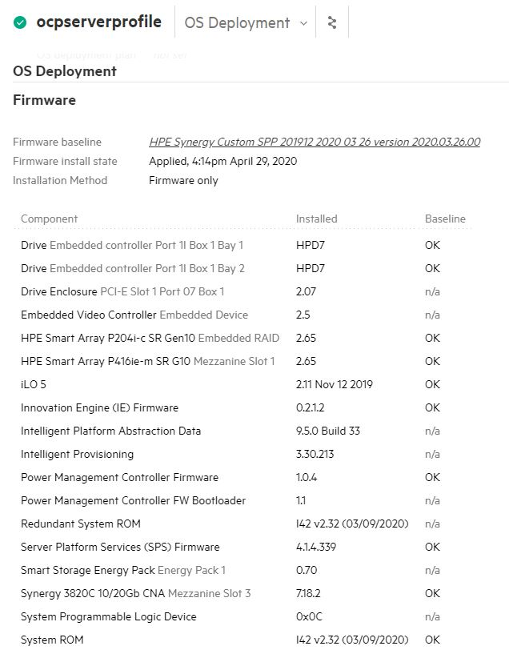

### Role Name: deploy_server_profile

##### Description: 
This role consists of ansible playbooks developed to automate the task of creating and deploying the Server Profile on the Server Hardware in HPE OneView. It also automates the task of applying the firmware updates, iLO and BIOS settings on the Server Hardware. Lastly it automates the task of validating the firmware updates, iLO and BIOS settings available on server hardware are matching with firmware details available in the firmware baseline or firmware bundle and iLO and BIOS settings specified by user are matching with iLO and BIOS settings on the server hardware. These playbooks are meant to be used in conjunction with the deployent guide for **Red Hat OpenShift Container Platform 4.6 on HPE Synergy**

##### Prerequisites
- Ansible engine with Ansible 2.9.x and Python  3.6.x
- **Python module for HPE OneView**: hpOneView is the Python SDK for the OneView API that allows you to manage OneView functionalities. Download the python repository at https://github.com/HewlettPackard/oneview-python.
- **Ansible module for HPE OneView**: OneView-ansible is the Ansible Module for HPE OneView which utilizes the python SDK to enable infrastructure as a code. Download the repository at https://github.com/HewlettPackard/oneview-ansible/.
- **SELINUX**: To create server profile using the automation decsribed here, user should set the value of "SELINUX" to disabled by performing the steps listed below:
		1. Switch to root user account on the Ansible Installer Machine using command "su root"
		   ```
           # su root
           ```
		2. Enter the root password to login as root user
		3. Open the selinux configuration file using the following command: 
		   ```
           # vi /etc/selinux/config
           ```
		4. Change the variable "SELINUX" to "disabled" in the "/etc/selinux/config" file as shown below:
		   ```
           SELINUX=disabled
           ```
		5. Save and exit the config file.
		6. Reboot the system and login as root user and check the status of "SELINUX" using the following command:
		   ```
		   # getenforce
		   ```
		7. Expected output from "getenforce" command is "Disabled"
- After setting the "SELINUX" to disabled and rebooting the Ansible Installer Machine, user should exit from "root" account and login as "non root" user and activate the python3 virtual environment as listed below
  ```
  # cd BASE_DIR/installer
  # source ocp_venv/bin/activate
  ```
  
##### Software requirements 
| Software | Version |
|--|--|
| HPE OneView	| 5 |

##### Input Files
- It is mandatory to update all the inputs  files (inputs.yml, hosts, secret.yml, fw_version_inputs.yml) with appropriate values before running any of the playbooks available in this repository.
	- Input file name: hosts
		1. This file is an inventory of host details
		2. Variables from "hosts" that are required by playbooks under "infrastructure" directory are listed here:
    ```
    # [server_profile_template]
    # [server_profile]
    ```
	- Input file name: inputs.yml
		1. Variables from "inputs.yml" that are required by playbooks under "infrastructure" directory are listed here:
    ```
    # enclosure_group: <Enclosure group name as per OneView> 
    # deployment_network_name: <Deployment network name as per OneView>
    # server_profile_template_name: <Custom name for SPT>
    # fw_bundle_path: <Firmware Bundle file path>
    # fw_bundle_file_name: <Firmware file name with extension>
    ```
	- Input file name: secret.yml
		1. This is an ansible vault file.
		2. Variables from "secret.yml" that are required by playbooks under "infrastructure" directory are listed here. These variables are for OneView access, iLO new user account details and privileges, and BIOS security settings.
		
    ```
    # oneview_ip: x.x.x.x 
    # oneview_username: username
    # oneview_password: password
    # oneview_api_version: 1200
	# ilo_username: <ilo_new_user>
	# ilo_displayname: <ilo_new_user_display_name>
	# ilo_password: <ilo_new_user_password>
	# ilo_user_userConfigPriv: <boolean_true_or_false>
	# ilo_user_iLOConfigPriv: <boolean_true_or_false>
	# ilo_user_loginPriv: <boolean_true_or_false>
	# ilo_user_remoteConsolePriv: <boolean_true_or_false>
	# ilo_user_virtualMediaPriv: <boolean_true_or_false>
	# ilo_user_virtualPowerAndResetPriv: <boolean_true_or_false>
	# ilo_user_hostBIOSConfigPriv: <boolean_true_or_false>
	# ilo_user_hostNICConfigPriv: <boolean_true_or_false>
	# ilo_user_hostStorageConfigPriv: <boolean_true_or_false>
	# bios_ProcAes: <Enabled_or_Disabled>
	# bios_AssetTagProtection: <Unloacked_or_Locked>
	# bios_SecStartBackupImage: <Enabled_or_Disabled>
	# bios_AdvancedMemProtection: <value>
	# bios_F11BootMenu: <Enabled_or_Disabled>
	# bios_Workload Profile: <workload_profile>
    ```
   
    - Input file name: fw_version_inputs.yml
		1. This file contains the version information of the firmware that should be updated on the server hardware.
		2. Variables from "fw_version_inputs.yml" that are required by playbooks under "infrastructure" directory are listed here:
    ```
    # innovationengine: < INNOVATION_ENGINE_VERSION >
    # systemrombios: < SYSTEM_ROM_VERSION >
    # serverplatformservices: < SERVER_PLATFORM_SERVICES >
    # powermanagementcontroller: < POWER_MANAGEMENT_CONTROLLER >
    # ilo5: < iLO_5_VERSION >
    ```
##### Details about the tasks available in this role: 
```
The following variable available in the "inputs.yml" file, inform the playbook from about the name of the firmware bundle iso. This iso name is internally converted to a OneView understandable name by OneView APIs. Details about this variable is available in the "inputs.yml" file.                                fw_bundle_file_name: <Firmware file name with extension>
The iLO and BIOS settings related variables in "secret.yml" informs the server profile template about the settings that need to be configured in the template for the iLO and BIOS.
This playbook has 5 tasks namely "server_profile.yml", "power_cycle_server.yml", "validate_firmware_versions.yml", "validate_bios_settings.yml" and "validate_ilo_settings.yml"
Parameters or facts (OneView Terminology) required to create a Server Profile Template are available in the file "server_profile_template_file.yml". This file gathers the information about various dynamic variables based on the inputs provided by user in the four input files.
Parameters or facts (OneView Terminology) required to create a Server Profile are available in the Server Profile Template and these parameters are derived from the file "server_profile_template_file.yml". This file gathers the information about various dynamic variables based on the inputs provided by user in the four input files.
The task "server_profile.yml" creates the server profile in HPE OneView and deploys the server profile on the HPE Synergy Compute Module.
The task "power_cycle_server.yml", reboot the server after the profile has been applied to ensure BIOS settings that are awiating for reboot have been applied succesfully.
The task "validate_firmware_versions.yml" compares the server version specified in "fw_version_inputs.yml" are matching with the firmware versions available on the HPE Synergy Compute Module.
The task "validate_bios_settings.yml" compares BIOS security settings specified in "secret.yml" with BIOS settings available on the HPE Synergy Compute Module.
The task "validate_ilo_settings.yml" compares iLO settings specified in "secret.yml" with iLO settings available on the HPE Synergy Compute Module

Note: 
- Firmware update and validation tasks will be executed if user has selected "managefw" variable as "true" in "inputs.yml" file while creating the "server profile template".
- iLO settings update and validation tasks will be executed if user has selected "manageilo" variable as "true" in "inputs.yml" file while creating the "server profile template".
- BIOS settings update and validation tasks will be executed if user has selected "manageBios" variable as "true" in "inputs.yml" file while creating the "server profile template".
```

- Execute the following commands on the installer VM to create the Server Profile Template in OneView.
    ```
    # cd BASE_DIR/infrastructure
    # ansible-playbook -i hosts playbooks/deploy_server_profile.yml --ask-vault-pass
    ```
	Note: BASE_DIR is defined and set in installer machine section in deployment guide
- Expected output on successful creation of Server Profile and updation of firmware based on firmware baseline specified by the user.

  

- Expected output after successful firmware validation based on firmware baseline specified by the user in "fw_versions.yml".

  
  
- Expected output in "firmware" section of OneView server profile.

  


- Expected output after successful BIOS security settings validation based on security setting specified in "secret.yml".

  
  
- Expected output after successful iLO settings validation based on iLO setting specified in "secret.yml".
  
  

- Expected output in OneView on successful creation of Server Profile and updation of firmware, BIOS and iLO settings.
  
  
  