---
---

# HPE Deployment Guide for Red Hat OpenShift Container Platform on HPE Synergy with HPE Nimble Storage

# Overview

This document describes the steps required to create a Red Hat OpenShift
Container Platform environment running on HPE Synergy and HPE Nimble
Storage. It is intended to be used in conjunction with files and Ansible
playbooks found at,
<https://github.com/HewlettPackard/hpe-solutions-openshift/tree/master/synergy/scalable/nimble-vsphere>
. It is recommend that the user reviews this document along with
OpenShift 3.11 installation process as described by Red Hat at,
<https://docs.openshift.com/container-platform/3.11/install/> in its
entirety and understand all prerequisites prior to installation.

**NOTE**

Hewlett Packard Enterprise plans to update this document over time with
enhancements to deployment methodologies as well as new software
versions, features, and functions. Check for the latest document at,
<https://github.com/HewlettPackard/hpe-solutions-openshift/tree/master/synergy/scalable/nimble-vsphere>
.

Starting with version 4 of this deployment guide, disconnected
installations are supported using the core plays created by Hewlett
Packard Enterprise. When installing Red Hat OpenShift Container Platform
3.11 in disconnected mode, it is recommended that the installation user
(referred to as the installer in this document) review the*disconnected
installation of Red Hat OpenShift Container Platform* section of this
document and understand all the prerequisites and procedures prior to
the installation.

This document focuses on VMware vSphere as the virtualization layer. To
install Red Hat OpenShift Container Platform with HPE Synergy and HPE
Nimble with *Red Hat Enterprise Virtualization*, refer to the deployment
guide available at;
<https://github.com/HewlettPackard/hpe-solutions-openshift/tree/master/synergy/scalable/nimble-rhvh>
.

## Solution design

Figure 1 describes the minimal configuration of Red Hat OpenShift
Container Platform deployment on HPE Synergy with HPE Nimble. The
OpenShift master and infrastructure nodes as well as the HAProxy load
balancer are all deployed as virtual machines (VMs) to optimize resource
usage and eliminate the need to allocate dedicated physical compute
modules for each individual component.

The three (3) HPE Synergy 480 Gen10 Compute Modules running VMware
vSphere Virtualization provide both high availability (HA) and resources
to support initial workload deployments. As the workload and number of
container pods grow, the user can consider moving some or all of these
services from VMs to bare metal nodes for performance reasons.

Red Hat OpenShift worker nodes are deployed on HPE Synergy 480 Gen10
Compute Modules running Red Hat Enterprise Linux (RHEL) 7.6 to optimize
performance.

Ansible deployment playbooks support a minimum of six (6) physical
worker nodes. However, the design can scale higher as required and this
document is created for a six (6) worker node configuration.

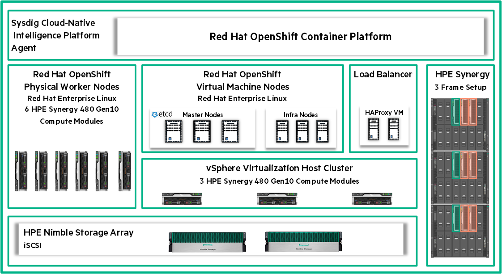

**Figure 1.** Solution layout

**NOTE**

The scripts and reference files provided in this document as examples on
how to build the infrastructure. They are not supported by Hewlett
Packard Enterprise or Red Hat.

It is expected that they will be modified as per the deployment
environment by the user prior to installation.

Figure 2 provides an overview of the layout and data storage design for
this solution. For detailed descriptions on each of the components used
in this solution refer to the sections that follow hereafter.

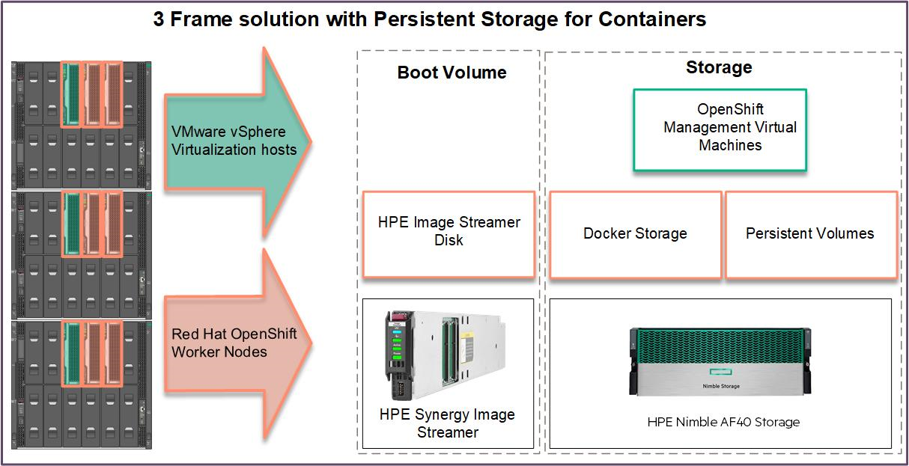

**Figure 2.** Solution design by function and storage type

**NOTE**

Containers and images are created and stored in Docker storage backend.
This is ephemeral and a separate persistent storage is allocated, to
meet the needs of the application(s). For more information, refer to
<https://docs.openshift.com/container-platform/3.11/install/host_preparation.html#configuring-docker-storage>
.

Figure 3 shows the logical design of the solution including volume
attach points and virtual machine locations.

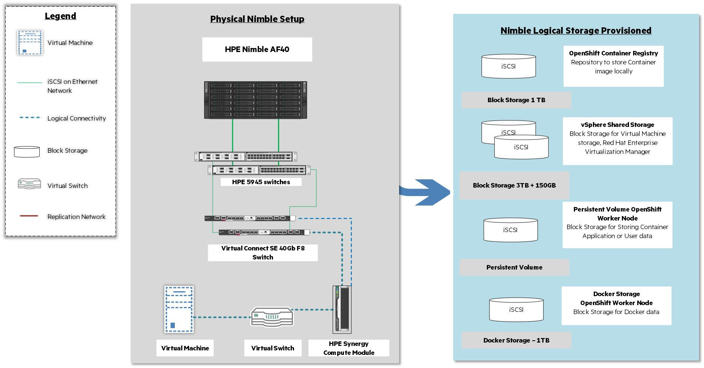

**Figure 3.** Logical layout of the solution stack

There are four networks defined in this solution. The four networks are:

1) **Deployment Network** - This network is specific to the requirements
of HPE Synergy.

2) **Management Network -** This network facilitates the management of
hardware and software interfaced by IT.

3) **Data center Network -** This network is a public access network
used to connect end users to applications.

4) **iSCSI Network -** This network consists of two separate network
segments that provide a redundant path for iSCSI storage traffic within
the solution.

Figure 4 below presents an overview of the physical network layout.

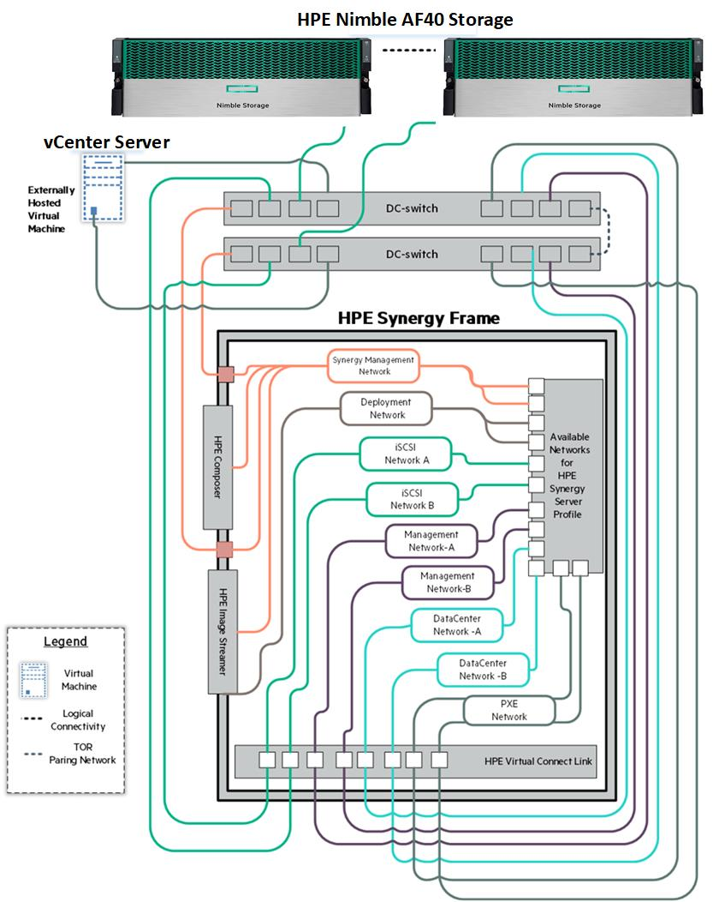

**Figure 4.** Physical network layout within the OpenShift solution

Figure 4 describes the physical network layout within the environment
and includes network utilized by HPE Synergy Image Streamer to deploy
management and worker nodes.

## Solution creation process

Figure 5 shows the flow of the installation process and aligns with this
document. For readability, a high resolution copy of this image is
located in the same folder as this document on GitHub. It is recommended
that the user downloads and reviews this image prior to proceeding.

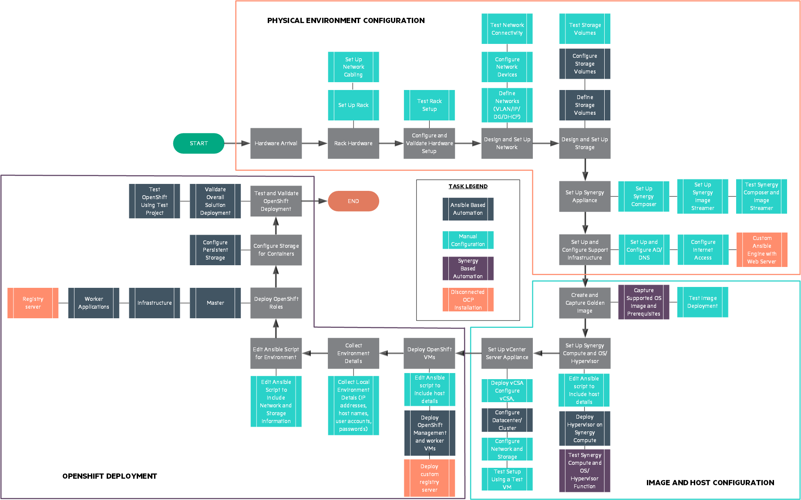

**Figure 5.** Solution creation process

# Sizing details for Red Hat OpenShift Container Platform deployment

Sizing a Red Hat OpenShift Container Platform environment varies
depending on the requirements of the organization and type of
deployment. This section discusses the sizing details for Red Hat
OpenShift Container Platform, host requirements and cluster sizing.

## OpenShift roles sizing details

The following role-based sizing guidance was followed during the
creation of the solution.

### Master nodes

Master nodes should have the following minimums:

-   vCPU -- 4
-   RAM -- 16GB
-   Disk storage

a. /var -- 40GB

b. /usr/local/bin -- 1GB

c. Temporary directory -- 1GB

**NOTE**

For every additional 1000 pods, master nodes should be configured with
an additional 1 vCPU and 1.5GB of RAM.

### Worker nodes

Worker nodes should have the following minimums:

-   vCPU -- 1
-   RAM -- 8GB
-   Disk storage

a. /var -- 15GB

b. /usr/local/bin -- 1GB

c. Temporary directory -- 1GB

**NOTE**

A minimum of 15GB of unallocated space for Docker's storage back end for
running containers is required.

Sizing for worker nodes is ultimately dependent on the container
workloads and their CPU, memory, and disk requirements.

### Infrastructure nodes

When running Elasticsearch, Fluentd and Kibana (EFK) on the
infrastructure nodes, 2 vCPUs and 24GB RAM is recommended for optimal
performance.

### Load balancer

It is recommended to use a commercially available load balancer for
enterprise deployments. This solution was developed using HAProxy, an
open source load balancing solution, with two (2) virtual machines to
serve the function of load balancing. Hewlett Packard Enterprise has
published a separate deployment guide in conjunction with F5 Networks
that documents how to integrate enterprise load balancing into this
solution.

## Red Hat OpenShift Container Platform cluster sizing details

The number of worker nodes in an OpenShift cluster depends on the number
of pods that an organization is planning on deploying. Red Hat OpenShift
Container Platform 3.11 can support the following maximums:

-  A maximum of 2000 nodes per cluster.
-  A maximum of 150,000 pods per cluster.
-  A maximum of 250 pods per node.
-  A maximum pods per CPU core is the number of pods per node.

To determine the number of nodes required in a cluster, estimate the
number of pods the organization is planning on deploying and divide by
the maximum number of pods per node.

For example,

If the organization plans to deploy 5000 pods, then the organization
should deploy a minimum of 20 application nodes with 250 pods per node.

```
(5000 / 250 =20).
```

In the test environment with a default configuration of six (6) physical
worker nodes, the Red Hat OpenShift cluster should be expected to
support 1500 pods.

```
(250 pods x 6 nodes = 1500 pods)
```

For more information about Red Hat OpenShift Container Platform sizing,
refer to Red Hat OpenShift Container Platform product documentation at,
<https://docs.openshift.com/container-platform/3.11/scaling_performance/index.html>
and
<https://access.redhat.com/documentation/en-us/openshift_container_platform/3.11/html-single/scaling_and_performance_guide/index>
.

# Prerequisites

## Software versions

Table 1 describes the versions of important software utilized in the
creation of this solution. The user should ensure that they download or
have access to this software. Also ensure that appropriate subscriptions
and licensing are in place to use within the planned timeframe.

**Table 1.** Major software versions used in solution creation.

| **Component** | **Version** |
| ------------- | ----------- |
| Red Hat Enterprise Linux Server | 7.6 |
| VMware vSphere | 6.7 VMware-ESXi-6.7.0-Update1-11675023-HPE-Gen9plus-670.U1.10.4.0.19-Apr2019 |
| VMware vCenter Server Appliance | 6.7 VMware-VCSA-all-6.7.0-11338176 |
| Red Hat OpenShift Container Platform | 3.11 |
| HPE Nimble Storage Linux Toolkit | * 2.4.x.x |
| Nimble Kube Storage Controller | * 2.4.x.x |

* The latest subversion should be installed.

This document is built with assumptions about services and networks available within the implementation environment. This section discusses those assumptions and, where applicable, provides details on how they should be configured. If a service is optional, it is noted in the description.

### Services

Table 2 disseminates the services utilized in the creation of this
solution and provides a high-level explanation of their function and
whether or not they are required.

**Table 2.** Infrastructure Services in this solution

| **Service | Required/Optional | Description/Notes** |
| ------------- | -------------- | ------------------------- |
| DNS | Required | Provides name resolution on management and data center networks, optionally on iSCSI networks. |
| DHCP | Required | Provides IP address leases on management and usually for data center networks. Optionally used to provide addresses on iSCSI networks. |
| NTP | Required | Required to ensure consistent time across the solution stack. |
| Active Directory/LDAP | Optional | May be used for authentication functions on various networks. This solution utilizes local authentication but instructions are provided to enable LDAP. |

#### DNS

Name services must be in place for management and data center networks.
Once host has become active, ensure that both forward and reverse
lookups are working on the management and data center networks.

The following host entries must be made in the appropriate domains:

-   vSphere virtualization hosts
-   vCenter Server Appliance
-   Management nodes
a. Master nodes
b. Infrastructure nodes
c. Load balancer(s)
-   RHEL worker nodes

#### NTP

A Network Time Protocol (NTP) server should be available to hosts within
the solution environment.

#### User laptop

A laptop system with the ability to connect to the various components
within the solution stack is required.

## Ansible Engine

This document assumes that an RHEL 7.6 server is available within the
deployment environment for utilizing as an Ansible Engine and is
accessible to the user.

Login to the Ansible Engine and perform the following steps:

1) Register the server with the Red Hat customer portal using the
following command.

```

# subscription-manager register --username=**<red hat subscription
username>** --password **=<red hat subscription password>**
--auto-attach

```

2) Pull the latest subscription data from the Red Hat subscription
manager using the following command.

```

# subscription-manager refresh

```

3) Find an available subscription pool for virtual system that provides
the OpenShift Container Platform channels using the following command.

```

# subscription-manager list --available --matches '*OpenShift*'

```

4) Attach a pool ID for a subscription that provides OpenShift Container
Platform.

```

# subscription-manager attach --pool=<pool_id>

```

5) Disable all the repositories using the following command.

```

# subscription-manager repos --disable="*"*

```

6) Enable repositories using the following commands.

```

# subscription-manager repos --enable rhel-7-server-extras-rpms

# subscription-manager repos --enable rhel-7-server-rpms

# subscription-manager repos --enable rhel-7-server-ose-3.11-rpms

# subscription-manager repos --enable rhel-7-server-ansible-2.6-rpms

```

**NOTE**

This solution is developed using Python 3.6.x along with Ansible
2.7.2.

### Install Python and Ansible

The following steps should be taken to assist in the installation of the
appropriate Python and Ansible versions:

1) Install Python 3.6.x using the command.

```

# yum -y install rh-python36

```

2) Enable the Python 3.6.x environment using the command.

```

# scl enable rh-python36 bash

```

3) Create a new virtual environment for deploying this solution.

```

# python3 -m venv **<virtual environment name>**

```

4) Activate the virtual environment using the command.

```

# source <virtual environment name>/bin/activate

```

5) Install Ansible 2.7.2.

```

# python3 -m pip install ansible==2.7.2

```

### Clone required repositories

This solution utilizes multiple Python and Ansible repositories. This
section lists the steps to clone and install the repositories.

1) Execute the following commands on the Ansible Engine host to download
the required repositories.

```

# cd /etc/ansible

# git clone --b 3.11
<https://github.com/HewlettPackard/hpe-solutions-openshift.git>

```

2) oneview-ansible is the Ansible module for HPE OneView which utilizes
the Python SDK to enable infrastructure as a code.

a) Clone the repository found at,
<https://github.com/HewlettPackard/oneview-ansible/> .

b) Navigate to the downloaded repository oneview-ansible on the Ansible
Engine and execute the following commands.

```

# cd <path to oneview-ansible>

# pip install --r requirements.txt

```

c) Export the path of the **oneview-ansible/library** and
**oneview-ansible/library/module_utils** to the environment variables
*ANSIBLE_LIBRARY* and *ANSIBLE_MODULE_UTILS* using the following
commands.

```

# export ANSIBLE_LIBRARY=<absolute path to /oneview-ansible/library>

# export ANSIBLE_MODULE_UTILS=<absolute path to
/oneview-ansible/library/module_utils>

```

3) PyVmomi is the Python SDK for the VMware vSphere API that allows
managing ESX, ESXi, and vCenter. Execute the following command in the
Ansible Engine.

```

# pip install pyVmomi

```

# Physical environment configuration

## Overview

The configuration deployed for this solution is described in greater
detail in this section. At a high level, Hewlett Packard Enterprise and
Red Hat deployed the following:

- Three (3) HPE Synergy 12000 Frames with HPE Virtual Connect SE 40Gb F8 Modules for Synergy.
- Two (2) HPE Synergy Composer.
- Two (2) HPE Synergy Image Streamer.
- Two (2) HPE FlexFabric (FF) 5945 switches.
- One (1) or two (2) HPE Nimble AF40 Storage arrays serving as primary and replicated storage.
- Two (2) HPE SN6600B Fibre Channel switches.
- Nine (9) HPE Synergy 480 Gen10 Compute Modules, with three (3) virtualized hosts running the required Red Hat OpenShift infrastructure and management software and six (6) bare metal hosts dedicated as worker nodes.

**Figure 6** shows the physical configuration of the racks used in this
solution.

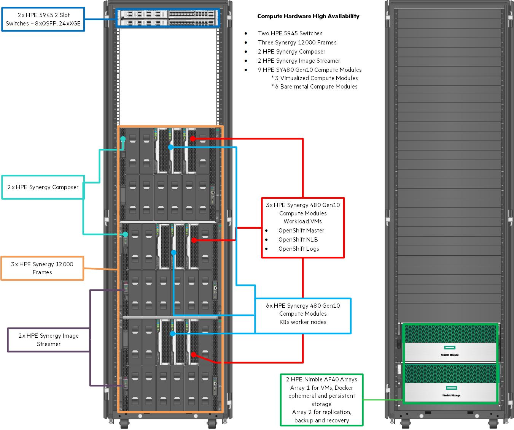

**Figure 6.** Physical layout of the solution

This configuration is based on the design guidance of an HPE Converged
Architecture 750 which offers an improved time to deployment and tested
firmware recipe. That baseline can be retrieved at,
<http://h17007.www1.hpe.com/us/en/enterprise/integrated-systems/info-library/index.aspx?cat=convergedsystems&subcat=cs750>
. It is recommended that the user utilize the latest available matrix.

The user also has flexibility in customizing the Hewlett Packard
Enterprise components throughout this stack per their unique IT and
workload requirements or building with individual components.

**Table 3** below highlights the individual components and their
quantities as deployed within the solution.

**Table 3.** Components utilized in the creation of this solution.

| **Component | Quantity | Description** |
| ---------- | ----------- | -------------- |
| HPE Synergy 12000 Frame | 3 | Three (3) HPE Synergy 12000 Frames house the infrastructure used for the solution |
| HPE Virtual Connect 40Gb SE F8 Module | 2 | A total of two (2) HPE Virtual Connect 40Gb SE F8 Modules provide network connectivity into and out of the frames |
| HPE Synergy 480 Gen10 Compute Module | 9 | Three (3) virtualized management hosts and six (6) bare metal or virtualized hosts for worker nodes |
| HPE FlexFabric 2-Slot Switch | 2 | Each switch contains one (1) each of the HPE 5945 modules listed below |
| HPE 5945 24p SFP+ and 2p QSFP+ Module | 2 | One module per HPEFlexFabric 2-Slot Switch |
| HPE 5945 8-port QSFP+ Module | 2 | One module per HPE FlexFabric 2-Slot Switch |
| HPE Nimble Storage AF40 | 1 | One array for virtual machines, Docker storage and persistent volumes |
| HPE Nimble Storage AF40 | 1 | One array for remote replication as outlined in the Backup and Recovery Guide |
| HPE Synergy Composer | 2 | Core configuration and lifecycle management for the Synergy components |
| HPE Synergy Image Streamer | 2 | Provides OS volumes to OpenShift worker nodes |

## Cabling the HPE Synergy 12000 Frame and HPE Virtual Connect 40Gb SE F8 Modules for HPE Synergy

This section shows the physical cabling between frames as well as the
physical connectivity between the switching. It is intended to provide
an understanding of how the infrastructure was interconnected during
testing and a guide for the user to base their configuration. **Figure
7** shows the cabling of the HPE Synergy Interconnects, HPE Synergy
Frame Management, and Intelligent Resilient Fabric (IRF) connections.
These connections handle east-west network communication as well as
management traffic within the solution.


**Figure 7.** Cabling of the management and inter-frame communication
links within the solution

**Figure 8** shows the cabling of HPE Synergy Frames to the network
switches. The specific networks contained within the bridge-aggregation
groups (BAGG) are described in more detail later in this section. At the
lowest level, there are four (4) 40GbE connections dedicated to carrying
redundant, production network traffic to the first layer switch where it
is further distributed.

iSCSI traffic is separated into two (2) VLANs and is carried to the
first network switch pair over two (2) 40GbE links per VLAN. Unlike the
Ethernet traffic which is distributed between the switches, each iSCSI
VLAN is sent directly to one switch configured with a pair of access
ports.

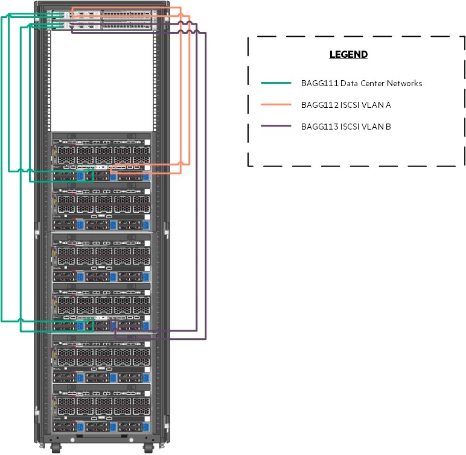

**Figure 8.** Cabling of the HPE Synergy interconnects to the HPE
FlexFabric 5945 switches

Table 4 explains the cabling of the Virtual Connect interconnect modules
to the HPE FlexFabric 5945 switching.

**Table 4.** Networks used in this solution.

| **Uplink Set** | **Synergy Source** | **Switch Destination** |
| ------------------- | ------------------- | ------------------ |
| Network | Enclosure 1 Port Q3 | FortyGigE1/1/1 |
| Enclosure 1 Port Q4 | FortyGigE2/1/1 | |
| Enclosure 2 Port Q3 | FortyGigE1/1/2 | |
| Enclosure 2 Port Q4 | FortyGigE2/1/2 | |
| iSCSI_SAN_A | Enclosure 1 Port Q5 | FortyGigE1/1/5 |
| Enclosure 1 Port Q6 | FortyGigE1/1/6 | |
| iSCSI_SAN_B | Enclosure 2 Port Q5 | FortyGigE2/1/5 |
| Enclosure 2 Port Q6 | FortyGigE2/1/6 | |
| Uplink Set | Synergy Source | Switch Destination |

## Configuring the solution switching

The solution described in this document utilized HPE FlexFabric 5945
switches. The HPE FlexFabric 5945 switches are configured as per the
configuration parameters below. Individual port configurations are
described elsewhere in this section. The switches should be configured
with an HPE Intelligent Resilient Framework (IRF). To understand the
process of configuring IRF, refer to the HPE FlexFabric 5945 Switch
Series installation guide at,
<https://support.hpe.com/hpsc/doc/public/display?sp4ts.oid=null&docLocale=en_US&docId=emr_na-c05212026>
. This guide may also be used to understand the initial installation of
switching as well as creation of user accounts and access methods. The
remainder of this section is built with the assumption that the switch
has been installed, configured for IRF, hardened, and is accessible over
SSH.

**NOTE**

HPE Synergy facilitates the use of end of row switching to reduce switch
and port counts in the context of the solution. If end of row switching
is chosen, then this section should be used as guidance for how to route
network traffic outside of the HPE Synergy Frames.

### Physical cabling

Table 5 is a map of source ports to ports on the HPE FlexFabric 5945
switches.

**Table 5.** HPE FlexFabric 5945 port map

| **Source Port** | **Switch Port** |
| --------------- | --------------- |
| Nimble Management Port Eth1 | TenGigE1/2/17 |
| Nimble Controller A TG1 | TenGigE1/2/13 |
| Nimble Controller A TG2 | TenGigE2/2/13 |
| Nimble Controller B TG1 | TenGigE1/2/14 |
| Nimble Controller B TG2 | TenGigE2/2/14 |
| Nimble Replication Port Eth2 | TenGigE1/2/15 |
| Virtual Connect Frame U30, Q3 | FortyGigE1/1/1 |
| Virtual Connect Frame U30, Q4 | FortyGigE2/1/1 |
| Virtual Connect Frame U30, Q5 | FortyGigE1/1/5 |
| Virtual Connect Frame U30, Q6 | FortyGigE1/1/6 |
| Virtual Connect Frame U40, Q3 | FortyGigE1/1/2 |
| Virtual Connect Frame U40, Q4 | FortyGigE2/1/2 |
| Virtual Connect Frame U40, Q5 | FortyGigE2/1/5 |
| Virtual Connect Frame U40, Q6 | FortyGigE2/1/6 |
| To Upstream Switching | Customer Choice |

It is recommended that the installer log on to the switch
post-configuration and provide a description for each of these ports.

### Network definitions

**Table 6** defines the networks configured using HPE Synergy Composer
in the creation of this solution. These networks should be defined at
both the first layer switch as well as within the composer. This
solution utilizes unique VLANs for the data center and solution
management segments. Actual VLANs and network counts will be determined
by the requirements of your production environment.

**Table 6.** Networks used in this solution.

| **Network Function** | **VLAN Number** | **Bridge Aggregation Group** |
| ------------------- | ----------- |------------------------ |
| Solution_Management | 1193 | 111 |
| Data_Center | 2193 | 111 |
| iSCSI_A | 3193 | 112 |
| iSCSI_B | 3194 | 113 |

1) To add these networks to the switch, log on to the switch console
over SSH and run the following commands.

```

# sys

# vlan 1193 2193 3193 3194

```

2) For each of these VLANs, perform the following steps.

```

# interface vlan-interface ####

# name VLAN Name per table above

# description Add text that describes the purpose of the VLAN

# quit

```

**NOTE**

It is strongly recommended that you configure a dummy VLAN on the
switches and assign unused ports to that VLAN. The switches should be
configured with separate bridge aggregation groups (BAGGs) for the
different links to the HPE Synergy Frame connections. To configure the
three (3) bridge-aggregation groups and ports as described in the Table
6, run the following commands for the data center and management VLANs.

```

# interface Bridge-Aggregation111

# link-aggregation mode dynamic

# description <FrameNameU30>-ICM

# quit

# interface range name <FrameNameU30>-ICM interface
Bridge-Aggregation111

# quit

# interface range FortyGigE 1/1/1 to FortyGigE 1/1/2 FortyGigE 2/1/1 to
FortyGigE 2/1/2

# port link-aggregation group 111

# quit

# interface range name <FrameNameU30>-ICM

# port link-type trunk

# undo port trunk permit vlan 1

# port trunk permit vlan 1193 2193

# quit

```

3) For the VLANs that will carry iSCSI traffic, run the following
commands.

```

# interface Bridge-Aggregation112

# link-aggregation mode dynamic

# description <FrameNameU30>-ICM 3

# quit

# interface range FortyGigE 1/1/5 to FortyGigE 1/1/6

# port link-aggregation group 112

# quit

# interface Bridge-Aggregation 112

# port link-type trunk

# undo port trunk permit vlan 1

# port trunk permit vlan 3193

# quit

# interface Bridge-Aggregation113

# link-aggregation mode dynamic

# description <FrameNameU30>-ICM 6

# quit

# interface range FortyGigE 2/1/5 to FortyGigE 2/1/6

# port link-aggregation group 113

# quit

# interface Bridge-Aggregation 113

# port link-type trunk

# undo port trunk permit vlan 1

# port trunk permit vlan 3194

# quit

```

4) Assign the network ports that will connect the various HPE Nimble
Storage interfaces with the switches.

```

# interface range TenGigE 1/2/13 to TenGigE 1/2/14

# port access vlan 3193

# quit

# interface range TenGigE 2/2/13 to TenGigE 2/2/14

# port access vlan 3194

# quit

```

5) Place the HPE Nimble Storage management interface into the management
VLAN.

```

# interface TenGigE 1/2/17

# port access vlan 1193

# quit

```

6) Place the replication traffic for the VLAN into the default VLAN or a
VLAN of your choice.

```

# interface TenGigE 1/2/15

# port access vlan 1

# quit

```

7) When configuration of the switches is complete, save the state and
apply it by typing **save** and following the prompts.

## HPE Synergy 480 Gen10 Compute Modules

This section describes the connectivity of the HPE Synergy 480 Gen10
Compute Modules used in the creation of this solution. The HPE Synergy
480 Gen10 Compute Modules, regardless of function, they are configured
identically. Table 7 describes the individual components. Server
configuration should be based on customer needs and the configuration
used in the creation of this solution may not align with the
requirements of any given production implementation.

**Table 7.** Host configuration.

| **Component** | **Quantity** |
| ------------- | --------------------- |
| HPE Synergy 480/660 Gen10 Intel Xeon-Gold 6130 (2.1GHz/16-core/125W) FIO Processor Kit | 2 per server |
| HPE 16GB (1x 16GB) Single Rank x4 DDR4-2666 CAS-19-19 Registered Smart Memory Kit | 24 per server |
| HPE Synergy 3820C 10/20Gb Converged Network Adapter | 1 per server |
| HPE Smart Array P204i-c SR Gen10 12G SAS controller | 1 per server |
| HPE 1.92TB SATA 6GB Mixed Use SFF (2.5in) 3yr Warranty Digitally Signed Firmware SSD | 2 per management host |

**NOTE**

Memory, local disk and CPU configurations are customer configurable and should be aligned to workloads. Configurations listed in this document are for example purposes only. 

### VMware vSphere virtualization hosts

The solution calls for the installation of VMware vSphere virtualization
hosts (ESXi) on three (3) HPE Synergy 480 Gen10 Compute Modules. These
hosts house the required management software for the solution installed
on virtual machines which consolidates the infrastructure within the
solution stack to virtual machines as opposed to physical hosts. Figure
9 below highlights the connectivity of these hosts to the primary HPE
Nimble Storage array. Networks that are carried on the individual
bridge-aggregation group are shown in Table 6 of this document.

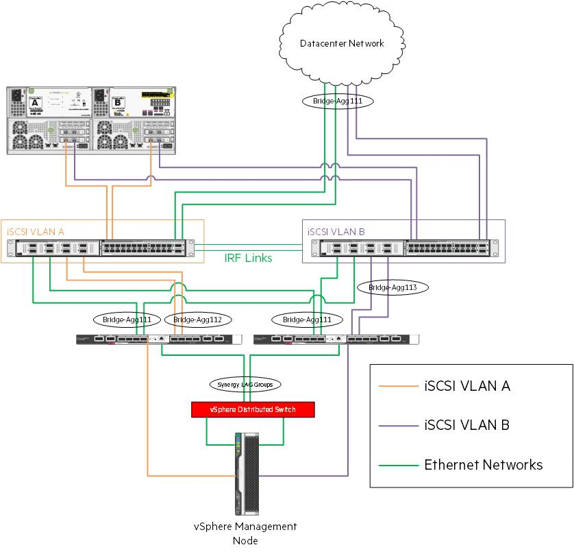

**Figure 9.** VMware vSphere virtualization host network connectivity

Each host is presented with access to a shared 3TB storage volume that
houses the virtual machines used in the solution. Figure 3 and Figure 11
in this document explain this relationship.

**NOTE**

If virtual worker nodes are implemented, refer to further sections of
this document. The configuration outlined above will be used for the
virtual worker node hosts.

### Bare metal worker nodes

Six (6) HPE Synergy 480 Gen10 Compute Modules are deployed as Red Hat
OpenShift Container Platform worker nodes and run Red Hat Enterprise
Linux Server 7.6 as their operating system. *Figure 10* highlights the
connectivity of these hosts to the primary HPE Nimble Storage. As with
the virtualization hosts, refer to *Table 6* in this document for an
explanation of networks carried on each individual bridge-aggregation
group.

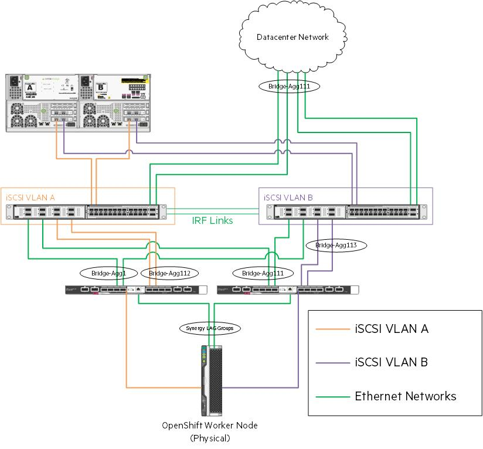

**Figure 10.** Red Hat OpenShift worker node network connectivity

## HPE Synergy Composer

At the core of the management of the HPE Synergy environment is HPE
Synergy Composer. A pair of HPE Synergy Composers are deployed across
frames to provide redundant management of the environment for both
initial deployment and changes over the lifecycle of the solution. HPE
Synergy Composer is used to configure the environment prior to the
deployment of the operating systems and applications.

This section walks the installer through the process of installing and
configuring the HPE Synergy Composer.

### Configure the HPE Synergy Composer via VNC

To configure **HPE Synergy Composer** with the user laptop, follow these
steps:

1) Configure the user laptop physical NIC with the IP address
*192.168.10.2/24.* No gateway is required.

2) Connect a **CAT5e cable** from the laptop NIC to the port on the
front of a HPE Synergy Composer.

3) Once connected, open a browser and point it to
*http://192.168.10.1:5800.* This will open the HPE Synergy console on
the user laptop.

4) Once the console comes up, select **Connect** to start HPE OneView
for Synergy.

5) Select **Hardware Setup** and enter the following information when
prompted. Note that this solution places the HPE Synergy Composers on
the management network. It is recommended to pre-populate DNS with IP
information found as follows:

a. Appliance host name: Enter **a fully qualified name of the HPE
Synergy Composer.**

b. Address assignment: **Manual**

c. IP address: **Enter an IP address on the management network**.

d. Subnet mask: **Enter the subnet mask of the management network**.

e. Gateway address: **Enter the gateway for the network**.

f. Maintenance IP address 1: **Enter a maintenance IP address on the
management** network.

g. Maintenance IP address 2: **Enter a secondary maintenance IP**
address on the management network.

h. **Preferred DNS server:** **Enter the DNS server.**

i. **IPv6 Address assignment**: **Unassign**

6) Once you have entered all information, click **OK** to proceed. This
will start a hardware discovery process which may take some time to
complete. Once the process has finished, check for issues and correct
them. The HPE Synergy Frame setup and installation guide available at,
<http://www.hpe.com/info/synergy-docs> offers suggestions to fix common
issues.

7) Select the **OneView** menu at the top of the screen and select
**Settings** and then click **Appliance**. Validate that both appliances
are connected and show a green checkmark.

### Configure appliance credentials

1) Log in to the **HPE OneView for Synergy appliance.**

2) At first login, you will be asked to define credentials for the
administrator user. To do this, **accept the** EULA and in the HPE
OneView support box, ensure that *Authorized Service* is **Enabled.**

3) Log in as **Administrator** with the **password** as **admin**. You
will be prompted to enter a **new password.**

### Configure solution firmware

This solution adheres to the firmware recipe specified with the HPE
Converged Solutions 750 specifications which can be found at found the
CS750 firmware and software compatibility matrix. The solution used the
latest firmware recipe available as of September 2019 including HPE
OneView for Synergy 5.0. To configure the solution firmware, follow
these steps:

1) Select the **OneView menu** and select **Settings.**

2) Under Appliance, select **Update Appliance** and **update Composer.**

3) Once the update process completes, validate that both composer
modules are connected and there is a **green** **checkmark.**

### Solution configuration

The user should utilize the Synergy guided setup to complete the
following solution configuration details.

#### NTP

Configure the use of a Network Time Protocol server in the environment.

#### Create additional users

It is recommended that you create read-only user and administrator
account with a different username other than administrator.

#### Firmware

Upload a firmware bundle based on the HPE Converged Solutions 750
recipe. Once the bundle starts uploading, proceed to additional steps
without disrupting the upload.

#### Create an IP pool on the management network

Follow the guidance to create an IP pool on the management network. This
IP pool will provide IP addresses to management IPs and HPE device iLOs
within the solution. Ensure that the pool is enabled prior to
proceeding.

#### Configure Ethernet networks

As explained in the network configuration section of this document, the
solution utilizes at least four (4) network segments. Use the *Create
networks* section of the OneView guided setup wizard to define the
networks shown in Table 8 at a minimum. Your VLAN values will generally
differ from those described below.

**Table 8.** Networks defined within HPE Synergy Composer for this
solution.

| **Network Name** | **Type** | **VLAN Number** | **Purpose** |
| ------------ | -------- | ----------- | ---------------------- |
| Management | Ethernet | 1193 | Solution management |
| Data_Center | Ethernet | 2193 | Application, authentication and other user networks |
| ISCSI_VLAN_A | Ethernet | 3193 | ISCSI VLAN A |
| ISCSI_VLAN_B | Ethernet | 3194 | ISCSI VLAN B |

The management network should be associated with the management network
IP pool, which the user specified in the prior step. The user should
create any additional required networks for the solution.

#### Create logical interconnect group

Within composer, use the *guided setup* to create logical interconnect
group (LIG) with three (3) uplink sets defined. For this solution, the
uplink sets were named *Network, iSCSI_SAN_A,* and *iSCSI_SAN_B*.
The iSCSI uplink sets carry the respective iSCSI VLANs. The uplink set
"Network" carries all other networks defined for the solution. Table 9
below defines the ports used to carry the uplink sets.

**Table 9.** Networks used in this solution

| **Uplink set** | **Synergy source** |
| -------------- | ------------------ |
| Network | Enclosure 1, Bay 3, Port Q3 |
| Enclosure 1, Bay 3, Port Q4 | |
| Enclosure 2, Bay 6, Port Q3 | |
| Enclosure 2, Bay 6, Port Q4 | |
| iSCSI_SAN_A | Enclosure 1, Bay 3, Port Q5 |
| Enclosure 1, Bay 3, Port Q6 | |
| iSCSI_SAN_B | Enclosure 2, Bay 6, Port Q5 |
| Enclosure 2, Bay 6, Port Q6 |

#### Create enclosure group

1) From the *OneView Guided Setup*, select Create **enclosure group.**

2) Provide a **name** and enter the **number of frames**.

3) Select **Use address pool** and utilize the **management pool**
defined earlier.

4) Use the logical interconnect group from the prior step in the
creation of the enclosure group.

5) Select **Create** when ready.

#### Create logical enclosure

Use the *guided setup* to create a logical enclosure making use of all
three (3) enclosures. Select the firmware you uploaded earlier as a
baseline. It can take some time for the firmware to update across the
solution stack. Ensure that firmware is in compliance with the baseline
by selecting **Actions** and then **Update** **Firmware**. Click
**Cancel** to exit.

## Solution storage

An HPE Nimble Storage AF40 array provides shared and dedicated storage
for a variety of purposes within this solution. Figure 11 shows the
cabling of the HPE Nimble Storage AF40 to the HPE switching utilized in
this solution. This diagram shows the storage and switching in the same
rack to provide clarity. As implemented for this solution, the switching
resided in the HPE Synergy rack. The orange and purple wires in the
Figure 11 represent the separate iSCSI VLANs. This figure represents two
HPE Nimble Storage arrays which were implemented to provide replication.
In a real-world implementation, these arrays will be in separate
physical locations (two separate data centers, separate buildings,
separate sections of the same data center) to maximize redundancy and
minimize failure points.

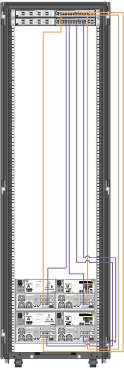

**Figure 11.** Cabling of the HPE Nimble Storage arrays to the HPE
FlexFabric 5945 switches

Figure 12a describes the logical storage layout used for physical worker
node deployments. HPE Synergy Image streamer volume is used for the
Operating System installation on the virtualized nodes as well as the
bare metal worker nodes. The HPE Nimble Storage AF40 provides dedicated
and shared volumes as outlined in Figure 12a.

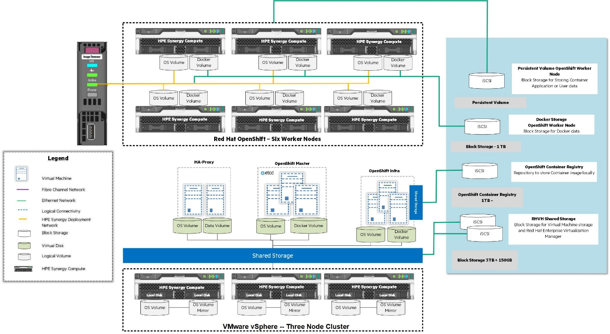

**Figure 12a.** Shared storage layout with physical worker nodes

Figure 12b provides the same view but focuses on virtual worker nodes.

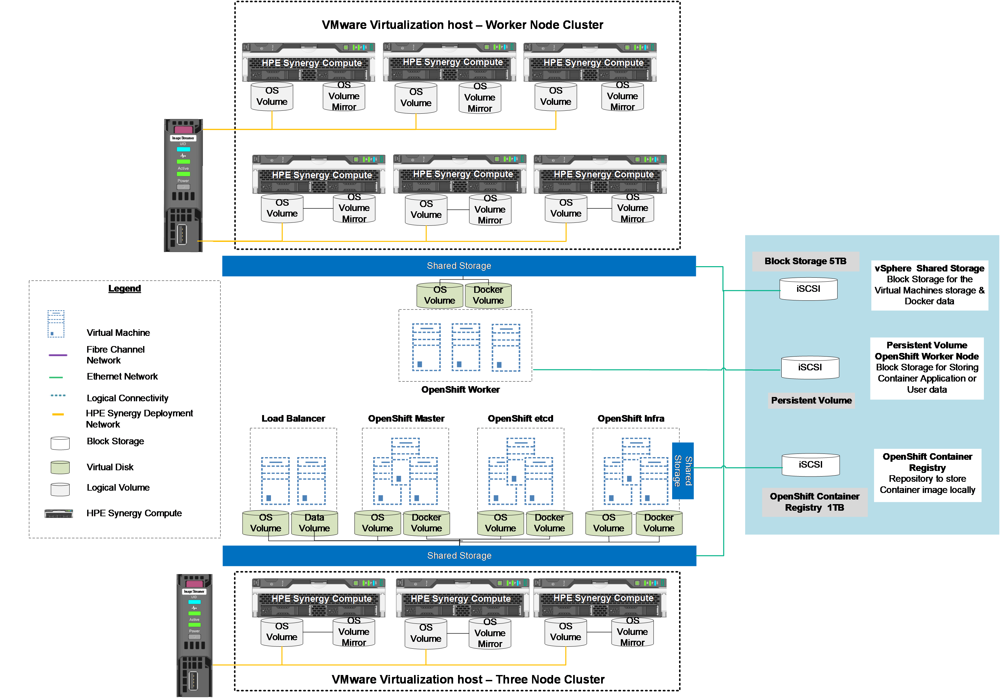

**Figure 12b.** Shared storage layout with virtual worker nodes

The HPE Nimble Storage AF40 used as the primary storage target, is
mapped to the HPE FF 5945 switching as described in Table 10. The
replication storage would be deployed in the same fashion, but generally
on separate switching in a separate physical location such as a remote
data center, a separate building on a campus, or in the same data center
on unique power feeds in a separate rack. All switch ports are
configured as access ports so the VLANs are untagged (see switch
configuration section earlier in this document). The redundant array is
implemented in a separate location with the same physical configuration.

**Table 10.** HPE Nimble Storage AF40 port mapping

| **HPE Nimble Storage AF40 Port** | **VLAN Number** | **Switch Port** |
| --------------------------- | ----------- | ------------- |
| Management Port Eth1, Controller A | 1193 | TenGigE1/2/17 |
| Management Port Eth1, Controller B | 1193 | TenGigE2/2/17 |
| Controller A TG1 | 3193 | TenGigE1/2/13 |
| Controller A TG2 | 3194 | TenGigE2/2/13 |
| Controller B TG1 | 3193 | TenGigE1/2/14 |
| Controller B TG2 | 3194 | TenGigE2/2/14 |
| Replication Port Eth2 | Default | TenGigE1/2/15 |

Information about storage volumes/disks is described in Table 11. The
user may choose to manually create and present these volumes or use the
Ansible resources specified after Table 11.

**NOTE**

It is recommended the user customize these values to suit their
environment.

**Table 11.** Volumes and sources used in this solution.

| **Volume/Disk Function | Quantity | Size | Source | Hosts | Shared/Dedicated** |
| ---------------------- | -------- | -------------- | ------------ | ------------- | -------- |
| Hypervisor | 9 | 40GB+ per host | HPE Image Streamer | ESXi hosts | Streamed |
| Virtual Machine Hosting and Docker Data | 1 | 3TB | HPE Nimble Storage | ESXi hosts | Shared |
| Persistent Application Data | N | App Specific | HPE Nimble Storage | OpenShift worker nodes | Dedicated |
| OpenShift Container Registry | 1 | 1TB | HPE Nimble Storage | Infrastructure node | Shared |

Prior to defining these volumes, you must initialize and configure the
array. Hewlett Packard Enterprise has provided resources to automate the
initialization and configuration of the array. Refer to the [Utilizing
Ansinimble](#_Utilizing_Ansinimble) section for information about
utilizing Ansinimble to automate the configuration of array parameters.

**NOTE**

The volumes marked as *"Dedicated"* in *Table 10* should be created and
presented to a single host that will consume the volume. Volumes marked
as *"Shared"* should be presented to the group of hosts identified in
the *"Hosts"* column.

# Preparing the deployment environment

This section discusses steps that need to be taken to prepare the
environment for hardware deployment and software installation.

## Edit the OpenShift inventory file

Prior to configuring the compute modules, the installer should retrieve
the required Ansible plays and files from GitHub by running the
following command on the Ansible Engine host and review the inventory
files carefully.

```

# cd /etc/ansible

# git clone
<https://github.com/HewlettPackard/hpe-solutions-openshift.git>

```

This will place the inventory file at
*/etc/ansible/hpe-solutions-openshift
/synergy/scalable/nimble-vsphere/hosts* *.* Using the examples found in
the sample file, alter the appropriate sections to ensure that the
information within the file accurately reflects the information in the
deployment environment.

Use an editor such as Vim or Nano to edit the Ansible host file located at
*/etc/ansible/hpe-solutions-openshift/synergy/scalable/nimble-vsphere/hosts*
.

```

#vim
/etc/ansible/hpe-solutions-openshift/synergy/scalable/nimble-vsphere/hosts

```

**NOTE**

The values provided in the variable files, host files or the figures are
for the reference purpose. It is expected that the user updates them to
suit their environment.

## Ansible Vault

Two pre-configured *Ansible Vault file* are provided with this solution,
*secret.yml* and *vault_pass.yml*.

-   *Secret.yml* consists of sensitive information to support
    virtualization host and virtual machine deployment.
-   *vault_pass.yml* consists of sensitive information to support
    prerequisites and deploying Red Hat OpenShift Container Platform.

Run the following commands to edit the vault to match the user's
environment.

```

# ansible-vault edit
/etc/ansible/hpe-solutions-openshift/synergy/scalable/nimble-vsphere/secret.yml

# ansible-vault edit
/etc/ansible/hpe-solutions-openshift/synergy/scalable/nimble-vsphere/vault_pass.yml

```

**NOTE**

The default password for the vault is *changeme.*

# Compute module configuration

This section describes the configuration of the compute modules and is
separated into sections that disseminate universal configuration
parameters, options used exclusively for virtualized master nodes, and
options used exclusively for bare metal worker nodes. The required
configuration steps are outlined. These may be in the form of Image
Streamer instructions, pointers to code, or command line options. It is
up to the installer to decide how to reach the desired end state.

Server Profiles are used to configure the personality of the compute
resources. A Server Profile allows a set of configuration parameters,
including firmware recipe, network and SAN connectivity, BIOS tuning,
boot order configuration, local storage configuration, and more to be
templatized. These templates are the key to delivering the
"infrastructure as code" capabilities of the HPE Synergy platform. For
the purpose of this solution, two templates were created. One template
was used to define virtualized management nodes and the other specified
parameters for OpenShift worker nodes.

**Warning**

During host deployment, ensure that adapter names and functions are
accurately recorded for the installation environment as variations in
the installation procedures may result in different adapter functions
than what is represented in the following sections. This will result in
the failure of some default automated configuration steps.

## VMware vSphere management hosts

The management nodes will be deployed and customized using HPE Synergy
Image Streamer while ensuring that the required storage volumes are
created and attached. This section outlines the steps required to
install the host. At a high-level, these steps can be described as
follows:

1) Download the artifacts for HPE Synergy Image Streamer from the HPE
GitHub site.

2) Prepare the vSphere golden image.

3) Install the VMware vSphere hypervisor.

4) Capture vSphere golden image.

5) Delete the empty volume Server Profile.

6) Add ESXi golden image to the deployment plan.

7) Create the HPE Nimble Storage volume.

8) Deploy the ESXI hosts using the golden image.

9) Utilize the virtualized hosts.

10) Create the VMware vCenter Server Appliance.

### Download the artifacts for HPE Synergy Image Streamer

VMware ESXi 6.7 artifact bundle for HPE Image Streamer 5 can be
downloaded at,
<https://github.com/HewlettPackard/image-streamer-esxi/blob/v5.0/artifact-bundles/HPE-ESXi-6.7-2019-07-24-v5.0.zip>
.

Sample foundation artifact bundles can be downloaded from,
<https://github.com/HewlettPackard/image-streamer-tools/tree/v5.0/foundation/artifact-bundles>
.

**NOTE**

It is recommended to download the artifact bundles in zip format. If the
artifact bundle name consists of "-", " " or any other special
character, it is recommended to rename the artifact bundle before
executing the playbooks.

### Prepare the vSphere golden image

This section involves the following steps:

- Upload the ESXi and Foundation artifact bundle for ESXi 6.7 with OneView 5.0.

- Extract the artifact bundles.

- Create a temporary Server Profile to install the hypervisor.

- Power on the server hardware associated with the temporary server profile.

These tasks are taken care by the playbook
*prepare_vsphere_image.yml.*

1) Update the vault file (*secret.yml*) to include the credentials used
with OneView and Image Streamer.

2) Update the host file found
*/etc/ansible/hpe-solutions-openshift/nimble-vsphere* directory to
include server hardware details

3) Update the variable files main.yml and network.yml found at
*/etc/ansible/hpe-solutions-openshift/nimble-vsphere/roles/prepare_vsphere_image/vars*
. Sample files are provided below. The installer needs to update the
values to suit their environment.

4) Update the host file found at
*/etc/ansible/hpe-solutions-openshift/synergy/scalable/nimble-vsphere.*

```

[vsphere_golden_image]

# "enclosure serial number, server bay number", type=<server
hardware type>

"MXQXXXXXX, bay 3" type="SY 480 Gen10 1"

```

**NOTE**

Before executing the playbook *prepare_vsphere_image.yml*, make sure
the server hardware provided in the host file is powered off and does
not have a Server Profile associated with it.

5) Update the *main.yml* file found at
*/etc/ansible/hpe-solutions-openshift/synergy/scalable/nimble-vsphere/roles/prepare_vsphere_image/vars.*
Sample variables from main.yml are listed below or reference.

```

# Name and path of the ESXi 6.7 Image streamer artifact bundle.

vsphere_artifact_bundle_name: 'HPE_ESXI_67'

vsphere_artifact_bundle_path:
etc/ansible/hpe-openshift-solutions/synergy/scalable/HPE_ESXI_67.zip

# Name and path of the Foundation artifact bundle for Image streamer
5.0

foundation_artifact_bundle_name: 'HPE_Foundation_Artifacts_5.0'

foundation_artifact_bundle_path:
etc/ansible/hpe-openshift-solutions/synergy/scalable/HPE_Foundation_Artifacts_5.0.zip

# Custom name for the temporary server profile

server_profile_name: vsphere_golden_image

```

6) Update the *network.yml* file found at
*/etc/ansible/hpe-solutions-openshift/synergy/scalable/nimble-vsphere/roles/prepare_vsphere_image/vars.*
Sample variables from *main.yml* are listed below or reference.

```

deployment_network_name: Deployment

management_network_name: TenNet

datacenter_network_name: TwentyNet

iSCSI_A_network_name: iSCSI_SAN_A

iSCSI_B_network_name: iSCSI_SAN_B

enclosure_group: EG

```

7) Update the *secret.yml* found at
*/etc/ansible/hpe-solutions-openshift/synergy/scalable/nimble-vsphere.*

```

# oneview and image streamer ip address and credentials.

oneview_ip: x.x.x.x

oneview_username: <username>

oneview_password: <password>

imagestreamer_ip: x.x.x.x

```

8) After updating the variable files, execute the following command from
the Ansible Engine.

```

# cd
/etc/ansible/hpe-solutions-openshift/synergy/scalable/nimble-vsphere

@ ansible-playbook -i hosts playbooks/prepare_vsphere_image.yml
--ask-vault-pass

```

### Install the VMware ESXi hypervisor

Once the temporary server profile is successfully created and attached
to a server hardware, it is time to install the hypervisor. The steps
below describe the process to be followed to install the hypervisor:

1) From the HPE OneView interface, navigate to Server Profiles and
select ESXi-empty-volume Server Profile, Select **Actions > Launch
Console.**

2) From the Remote Console window, choose**Virtual Drives -> Image File
CD-ROM/DVD** from the **iLO options** menu bar.

3) Navigate to the VMware ESXi 6.7 .iso file located on the installation
system.

3) Select the .iso file and click **Open**.

4) If the server is in the powered off state, power on the server by
selecting **Power Switch -> Momentary Press.**

5) During boot, press **F11** boot menu and select iLO Virtual USB 3:
iLO Virtual CD-ROM.

6) When the VMware ESXi installation media has finished loading, proceed
through the VMware user prompts. For storage device, select the 40GiB OS
volume created on the HPE Image Streamer during server profile creation
and set the root password**.**

7) Wait until the vSphere installation is complete. Once the
installation is complete and the host is reachable, proceed with the
next section.

### Capture a vSphere golden image

Once the vSphere installation is complete, the next step is to capture
the vSphere image to create the golden image and deployment plan. This
section involves the following steps:

1) Power off the server hardware corresponding to temporary server
profile.

2) Capture the golden image.

3) Create deployment plan.

4) Delete the temporary server profile.

These tasks are handled by the playbook *capture_vsphere_image.yml.*

5) Update the vault file (*secret.yml*) to include the sensitive
credentials of OneView and Image Streamer, and variable files main.yml
found
*/etc/ansible/hpe-solutions-openshift/synergy/scalable/nimble-vsphere/roles/capture_vphere_image/vars/main.yml*
directory. A sample file is provided below, the user needs to update the
values to suit their environment.

```

# custom name for Golden Image to be created.

golden_image_name: 'ESXi_GI'

# custom name for Deployment Plan to be created.

deployment_plan_name: 'ESXI_DP'

# Name of the OS volume associated with the temporary server profile
created.

os_volume_name: 'OSVolume-4'

```

6) After updating the variables, execute the following command in the
Ansible Engine.

```

cd /etc/ansible/hpe-solutions-openshift/synergy/scalable/nimble-vsphere

ansible-playbook -i hosts playbooks/capture_vsphere_image.yml
--ask-vault-pass

```

### Provision the vSphere hosts

The virtualization hosts are deployed using the golden image created in
the earlier steps. This can be achieved by creating the Server Profiles
with the appropriate deployment plan and the network connections. The
consistency among the virtualization hosts is achieved using the Server
Profile template.

The playbook *deploy_vsphere_template.yml* and *deploy_vsphere.yml*,
located at,
*/etc/ansible/hpe-solutions-openshift/synergy/scalable/nimble-vsphere/playbooks*

creates the Server Profile template and Server Profile.

To create the Server Profile template and the Server Profile, the user
should update the vault file (*secret.yml*) to include the sensitive
credentials of OneView and Image Streamer. The host file to include the
server hardware details and variable files *main.yml* found
at*nimble-vsphere/roles/deploy_vsphere_template/vars* and
*nimble-vsphere/roles/deploy_vsphere/vars* directory. Sample files are
provided below, the user needs to update the values to suit their
environment.

```

# DNS server and gateway IP address for the Management network.

dns_ip: 10.0.x.x

gateway: 10.0.x.x

# Subnet mask for the management network.

subnet_mask: 255.255.0.0

# Domain name for the management network.

domain_name: tennet.local

# Deployment plan created during capture_vsphere_image play
execution.

deployment_plan_name: ESXI_DP_role

# custom name for server profile template to be created.

server_profile_template_name: vSphere_template

```

In the hosts file located at
*/etc/ansible/hpe-solutions-openshift/synergy/scalable/nimble-vpshere* ,
under the *vsphere_server_profile_template* and
*vsphere_server_profile* section, add the enclosure serial number with
the bay number of the server hardware, type of the server hardware,
name, IP address, and hostname which needs be assigned for the servers
utilized as the virtualization hosts.

```

[vsphere_server_profile_template]

# "enclosure serial number, server bay number", type=<server
hardware type>

"MXQ83603WS, bay 3" type="SY 480 Gen10 1"

[vsphere_server_profile]

# "enclosure serial number, server bay number", type=<server
hardware type> name=<server profile name> ip=<vsphere host ip>
hostname=<vsphere hostname>

"MXQ7337JQ, bay 3" type="SY 480 Gen10 4" name="ESXI_1"
ip="10.0.60.20" hostname="vspherehost1"

"MXQ836WS, bay 3" type="SY 480 Gen10 1" name="ESXI_2"
ip="10.0.60.21" hostname="vspherehost2"

"2S1721PK4K, bay 3" type="SY 480 Gen10 4" name="ESXI_3"
ip="10.0.60.22" hostname="vspherehost3"

```

**NOTE**

If utilizing virtual worker nodes, add the hosts intended to be used as
virtualization hosts for the worker nodes under the
*vsphere_server_profile* section in the hosts file.

**WARNING**

Before executing the playbook *vsphere_server_profile_template.yml*
and *vsphere_server_profile.yml*, make sure the server hardware
provided in the host file is powered off and does not have a server
profile associated with it.

Once the host and variable files are updated with the appropriate
values, execute the following commands from the Ansible Engine to create
the Server Profile template and Server Profile.

```

# cd
/etc/ansible/hpe-solutions-openshift/synergy/scalable/nimble-vsphere

# ansible-playbook -i hosts playbooks/deploy_vsphere_template.yml
--ask-vault-pass

# ansible-playbook -i hosts playbooks/deploy_vsphere.yml
--ask-vault-pass

```

### VMware vCenter Server Appliance

In this solution, VMware vCenter Server Appliance (vCenter) is used to
manage the virtualized environment. This section illustrates the
deployment of the vCenter. If a vCenter is available in your
environment, then skip this step.

#### Pre-requisites

DNS entry of the vCenter hostname.

#### Procedure

The installation of the vCenter is a two-stage process. The two-stage
process are:

-   Deployment
-   Configuration

#### Deploy the appliance

1) From any server in the network, navigate to the location of the
vCenter iso image file and double-click to open it.

2) Depending on the OS, navigate to the **vcsa-ui-installer/<OS
type>** folder and run the file Installer.exe.

3) On the installation window, select **Install** to proceed with the
installation of a new **vCenter Server Appliance**.

4) Accept the **End User License Agreement** and then click **Next.**

5) Select the *Deployment Type* as **vCenter server** with an Embedded
Platform Service Controller and click **Next.**

6) Provide the root credentials of the vSphere host where the vCenter is
to be installed. Click **Next.**

7) Accept the SSL certificate from the selected **host** **.**

8) Enter a unique name for the vCenter and provide the password in the
*Set root password field* and click **Next.**

9) Based on your environment, enter the **Deployment Size** and the
**Storage Size**. Click **Next.**

10) Select the **Datastore** of the host which needs to be used and
click **Next.**

11) Configure the network settings and click **Next.** Provide the
values for the following parameters:

a) **IP address:** IP address for the vCenter.

b) **Domain name:** Domain name of the management network of the
vCenter.

c) **FQDN:** Fully-qualified domain name of the vCenter.

d) **Subnet mask:** Subnet mask.

e) **DNS server:** IP address for the DNS server.

12) Click **Finish** to start the installation. The vCenter will be
deployed on the specified host.

13) When Stage 1 is successfully completed, click **Continue** to resume
the Stage 2 installation.

#### Configure vCSA

1) When the Stage 2 installation screen is displayed, click **Next** to
begin the configuration process.

2) Specify the NTP Server and enable the SSH access. Click **Next**.
Enabling SSH is a must to enable smooth execution of the Ansible
playbooks.

3) Select the **Create a new SSO domain** option and provide the SSO
domain name and a unique SSO password then click **Next.**

4) Click **Finish** to finalize the deployment and then click **OK** to
proceed. The setup process is then instantiated.

5) When Stage 2 has been executed successfully, the vCenter deployment
is complete.

#### Accessing the vCSA

To access the appliance, type the address *https:// <vCenter Server
Appliance IP address>:443* in the browser and log in using the root
credentials.

## Integrate HPE Nimble Storage with vSphere hosts

### Overview of the tasks

1) Create initiator groups in the HPE Nimble Storage management console.

2) Create a volume for the ESXi hosts.

### Create initiator groups in the HPE Nimble Storage management console

The initiator group allows connecting volumes directly to the IQNs of
the iSCSI adapters. From the HPE Nimble Storage management console,
initiator groups should be created with the IQNs of each of the ESXi
hosts. Initiator groups can be created by following the steps outlined
below:

1) Log in to the HPE Nimble Storage management console.

2) Navigate to **Manage -> Data Access** as shown in Figure 13.

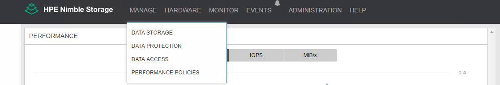

**Figure 13.** Data access option within the HPE Nimble Storage
management console

3) Click **"+"** icon on the initiator groups screen as shown in Figure
14.

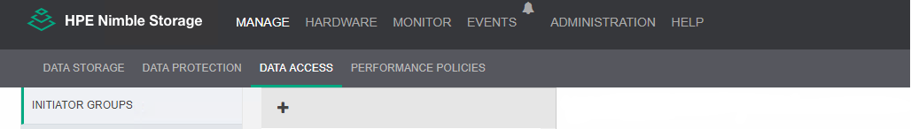

**Figure 14.** Create an initiator group within the HPE Nimble Storage
management console

4) On the *Create Initiator Group* page, **enter the details** for the
following parameters as shown in Figure 15:

a. **Name:** < Name of the initiator group >

b. **Subnets:** From the drop-down menu, select **Use selected subnets**
and add the selected data subnets.

c. **Initiators:** Add the name and IQNs of all the initiators (vSphere
hosts), and click **Create.**

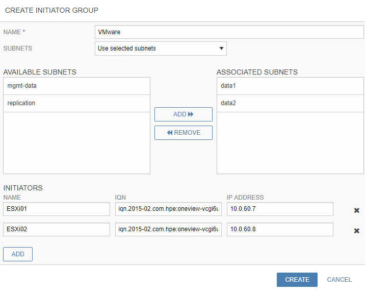

**Figure 15.** Input parameters for creating the initiator group

**NOTE**

IQNs can be found in the Server Profile of the ESXi hosts in HPE
OneView. If hosts are already added into the cluster of vCenter, IQNs
can be found at **Host > Configuration > Storage Adapter > Highlight
your iSCSI Software Adapter > Details** .

### Create a volume for the ESXi hosts in HPE Nimble Storage management console

Once the initiator group is created, perform the following to provision
a new volume to store the management virtual machines. A minimum volume
size of 3TB is recommended to host the management nodes.

1) From the HPE Nimble Storage management console, navigate to **MANAGE
-> DATA STORAGE** as shown in Figure 16.


**Figure 16.** Data storage option within the HPE Nimble Storage
management console

2) Click **"+" icon** as shown in Figure 17 to create a new volume.

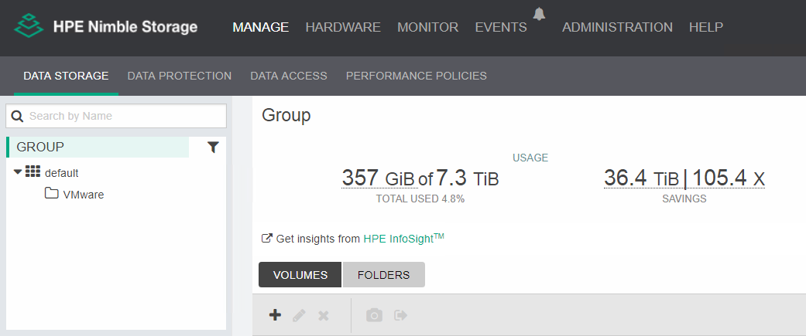

**Figure 17.** Create a volume within HPE Nimble Storage management
console

3) Provide the values to the following parameters for creating a volume.
Sample values for the parameters are listed in Figure 18:

a. Name: **< Name for the Volume >**

b. Location: **< Desired location of the Volume >**

c. Performance policy: < **Assign a performance policy for the
volume>**

d. Size: As per the need of user environment ( **3TB recommended**).

e. Protection policy: **Assign a protection policy as required.**

f. Access: Assign the **initiator group for the vSphere hosts** created
earlier.

g. CHAP Account: Assign the **CHAP account** and select the **Allow
Multiple Initiator** access box.

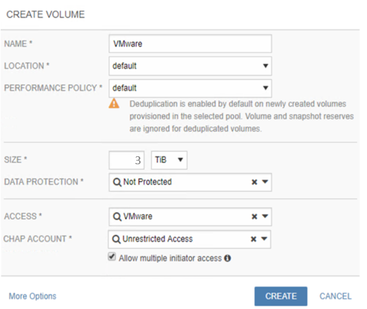

**Figure 18.** Parameters for creating volume in the HPE Nimble Storage
management console

4) Click **Create** to complete the volume creation.

**NOTE**

If utilizing virtual worker nodes, it is recommended to create another
volume with a size based on the installation environment. 1TB is the
minimum recommended size.

# Red Hat OpenShift Container Platform management functions

This section describes the process to deploy virtualized management
functions (masters, etcd, and infrastructure nodes) for OpenShift. This
section outlines the steps required to configure virtual masters. At a
high-level, these steps can be described as:

1) Create a data center in vCenter.

2) Create a cluster for hosting the ESXi hosts in vCenter.

3) Bring the ESXi hosts into the newly created cluster.

4) Configure VMkernel network adapters for the iSCSI network in vCenter.

5) Create a datastore with the HPE Nimble Storage volume in vCenter.

6) Create a RHEL 7.6 VM template.

7) Deploy the RHEL 7.6 template to create the management and worker VMs
for the OpenShift installations.

## Prerequisites

1) Ansible Engine should be installed and configured and capable of
communicating with the hosts within this solution.

2) VMware ESXi 6.7 is installed on at least three HPE Synergy 480 Gen10
Compute Modules.

3) A VMware vCenter Server Appliance is configured and available.

4) DNS entries should exist for all hosts.

5) HPE Nimble Storage has been integrated with vCenter.

## Creating the data center, cluster and adding hosts into cluster in vCenter

A data center is a structure in VMware vCenter which holds the host
clusters, hosts, datastore. To begin with, a data center needs to be
created, followed by the clusters and adding hosts into the clusters.

In order to create the data center, the user will need to edit the vault
file and the variables YAML file. Using an editor, open the file
*/etc/ansible/hpe-solutions-openshift/synergy/scalable/nimble-vsphere/roles/prepare_vcenter/vars/main.yml*
to provide the names for data center, clusters and vSphere hostnames. A
sample variable file is listed below. User should modify the file to
suit the environment.

In the vault file (*secret.yml*) found at
*/etc/ansible/hpe-solutions-openshift/synergy/scalable/nimble-vsphere* ,
provide the vCenter and the vSphere host credentials.

```

# vsphere hosts credentials

vsphere_username: <username>

vsphere_password: <password>

# vcenter hostname/ip address and credentials

vcenter_hostname: x.x.x.x

vcenter_username: <username>

vcenter_password: <password>

```

**NOTE**

This section assumes all virtualization hosts have a common username and
password. If different usernames and passwords are used, it is up to the
installer to add the virtualization hosts within the appropriate
cluster.

Variables for running the play can be found at,
*/etc/ansible/hpe-solutions-openshift/synergy/scalable/nimble-vsphere/roles/prepare_center/vars/main.yml*
file.

```

# custom name for datacenter to be created.

datacenter_name: datacenter

# custom name of the compute clusters with the ESXi hosts for
Management VMs.

management_cluster_name: management-cluster

# custom name of the compute clusters with the ESXi hosts for worker
VMs, ignore if intended to use physical worker nodes.

worker_cluster_name: worker-cluster

# hostname or IP address of the vsphere hosts utilized for the
management nodes.

vsphere_host_01: 10.0.60.20

vsphere_host_02: 10.0.60.21

vsphere_host_03: 10.0.60.22

# hostname or IP address of vsphere hosts utilized for the virtual
worker nodes.

# Ignore the below section if intended to use physical worker nodes.

vsphere_host_04: 10.0.60.23

vsphere_host_05: 10.0.60.24

vsphere_host_06: 10.0.60.25

vsphere_host_07: 10.0.60.26

vsphere_host_08: 10.0.60.27

vsphere_host_09: 10.0.60.28

```

Once the variable files are updated with the appropriate values, execute
the following command from the Ansible Engine to create the data center,
clusters and to add hosts into the respective clusters.

```

# cd
/etc/ansible/hpe-solutions-openshift/synergy/scalable/nimble-vsphere

# ansible-playbook playbooks/prepre_vcenter.yml --ask-vault-pass

```

**NOTE**

The playbooks are supported to create virtual worker nodes along with
other management VMs. If intended to use physical worker nodes, ignore
the variables corresponding to virtual worker nodes.

When virtual worker nodes are used it is advised to thoroughly review
the *main.yml* task files found at
*/etc/ansible/hpe-solutions-openshift/synergy/scalable/nimble-vsphere/roles/prepare_vcenter/tasks*
*as well as*
*/etc/ansible/hpe-solutions-openshift/synergy/scalable/nimble-vsphere/roles/deploy_vm/tasks*
before executing the *prepare_vcenter.yml* and *deploy_vm.yml*
playbooks.

## Configuring the networks

Distributed switches need to be configured to handle the vSphere and VM
traffic over the management, data center, and iSCSI networks present in
the environment. This section consists of:

- Configuring distributed switches for the data center and iSCSI
networks.

- Migrating from a standard switch to a distributed switch for
management network.

- Configuring the iSCSI target server.

- Configuring the network port binding for iSCSI networks.

### Configuring distributed switches for the data center and iSCSI networks

1) Log in to vCenter and navigate to **Networking -> <datacenter
name> -> Distributed Switch -> New Distributed Switch** as shown in
Figure 19.


**Figure 19.** Create a new distributed switch

2) From the *New Distributed Switch* page, provide a suitable **Name**
for the switch and click **Next.**

3) Select the *version* for the distributed switch as *6.6.0* and click
**Next.**

4) On the *Configure settings* page, provide the following information
as shown in Figure 20 and click **Next**:

a. Number of uplinks (2 uplinks for management networks and 1 uplink
each for the iSCSI networks).

b. Enable **Network I/O control.**

c. Select the **Create a default port group** option and provide unique
names for the corresponding networks.


**Figure 20.** Configure settings for the distributed switch

5) Review the configurations as shown in Figure 21 and click **Finish**
to create the distributed switch.


**Figure 21.** Review configuration details of the distributed switch

6) After creating the distributed switch, right click on the switch and
select the **Add and Manage Hosts** as shown in Figure 22.


**Figure 22.** Managing hosts associated with the distributed switch

7) In the select task page, select the task as **Add hosts** and click
**Next**.

8) From the select host page, click **+** new hosts and select all the
vSphere hosts within the cluster to be configured with the distributed
switch as shown in Figure 23 and click **OK**.

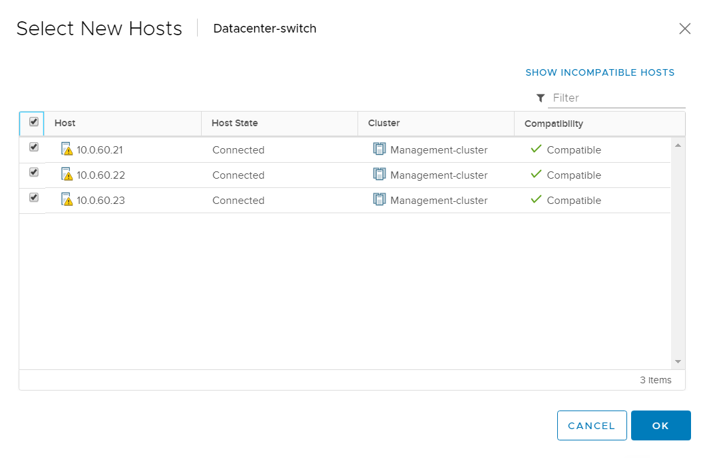

**Figure 23.** Adding hosts to the distributed switch

9) Verify if the required hosts are added as shown in Figure 24 and
click **Next**.


**Figure 24.** Review the hosts added to the distributed switch

10) In the *Manage Physical Adapters* page, select the **Physical
Network Adapters** in each host for the corresponding network being
configured and click **Assign uplink** as shown in Figure 25.


**Figure 25.** Select the physical adapter to be managed by the
distributed switch

11) Choose the *uplink* and select **Apply this uplink assignment to the
rest of the hosts**. Select **OK** as shown in Figure 26.

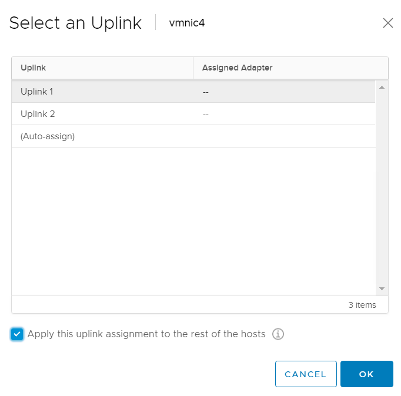

**Figure 26.** Assign an uplink to the physical adapter

12) Once the uplinks are assigned to the physical adapters, select
**Next.**

13) Review the configurations in the *Manage VMkernel adapters* as shown
in Figure 27 and click **Next**.


**Figure 27.** Manage VMkernel adapters of the distributed switch

14) Review the configuration in *Migrate VM networking* as shown in
Figure 28 and click **Next**.


**Figure 28.** Migrate VM networking of the distributed switch

15) On the *Ready to complete* page, review the configurations and click
**Finish**.

16) To add VMkernel adapter to the distributed switch, navigate to
**Networking -> <datacenter name> -> <Distributed Switch> -> Add
VMkernel Adapter** as shown in Figure 29.


**Figure 29.** Add a VMkernel adapter to the distributed switch

17) Select the hosts to which the configuration needs to be applied as
shown in Figure 30 and click **Next**.


**Figure 30.** Select the hosts managed by the distributed switch

18) In the configure *VM kernel adapter* page, select the IP settings as
*IPv4* and apply the appropriate services as shown in Figure 31 and then
click **Next**. This should include *vMotion* and *Fault Tolerance
logging* at a minimum.

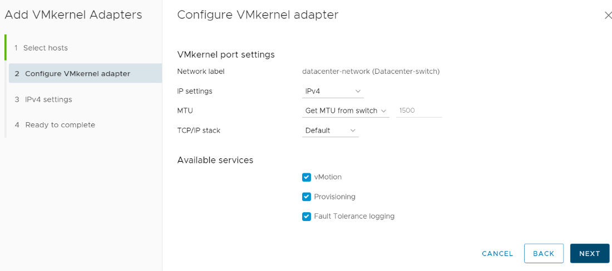

**Figure 31.** Configure VMkernel adapter page

19) In the IPv4 settings page, provide the *network settings* and
*gateway settings* for the all the hosts as shown in Figure 32 and click
**Next**.


**Figure 32.** Configuring IP address of the VMkernel adapters

20) Review the settings in the *Ready to complete* page and click
**Finish**.

**NOTE**

Repeat the above section of *Configuring Distributed Switches* for all
the iSCSI networks.

### Migrating from standard switch to distributed switch for management network

1) Log in to vCenter and navigate to **Networking** ***->*
*<datacenter name>* *->* *Distributed Switch* *->* *New Distributed
Switch*** .

2) From the *New Distributed Switch* page, provide a suitable **Name**
for the switch and the**datacenter** name for the location. Click
**Next**.

3) Select the version for the distributed switch as **6.6.0** and click
**Next**.

4) On the *Configure settings* page, provide the following information
as shown in Figure 33 and click **Next**:

a. Set the number of **uplinks** to **2.**

**b.** Enable **Network I/O control.**

c. Select the **Create a default port group** option and provide a
unique name for the corresponding networks.

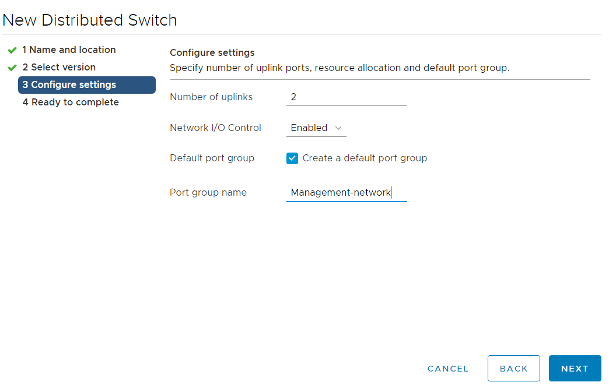

**Figure 33.** Configure settings for the distributed switch

5) Review the configurations and click **Finish** to create the
distributed switch.

6) After creating the distributed switch, right click on the switch and
select the **Add and Manage Hosts.**

7) On the *Select Task* page, select the task as **Add** **hosts** and
click **Next** .

8) From the select hosts page, click **+** **new hosts** and select all
the vSphere hosts within the cluster to be configured with the
distributed switch as shown in Figure 34 and click **OK**.

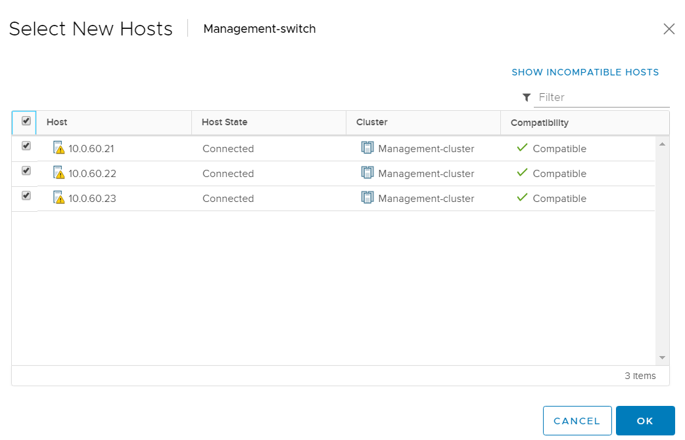

**Figure 34.** Adding hosts to the distributed switch

9) Verify the required hosts are added as shown in Figure 35 and click
**Next**.


**Figure 35.** Review the hosts added to the distributed switch

10) In the *Manage Physical Adapters* page, select the **Physical
Network Adapter** in each host for corresponding the network being
configured and click **Assign uplink** as shown in Figures 36. Click
**Next**.

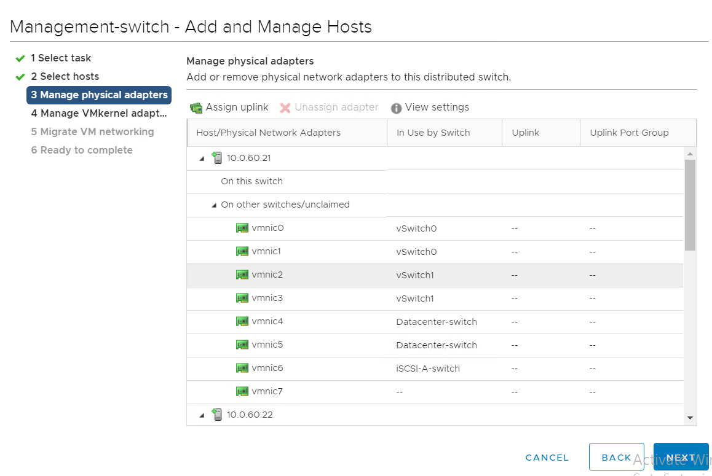

**Figure 36.** Select the physical adapter to be managed

11) Choose the *Uplink* and select **Apply this uplink assignment to the
rest of the hosts**. Select **OK** as shown in Figure 37.

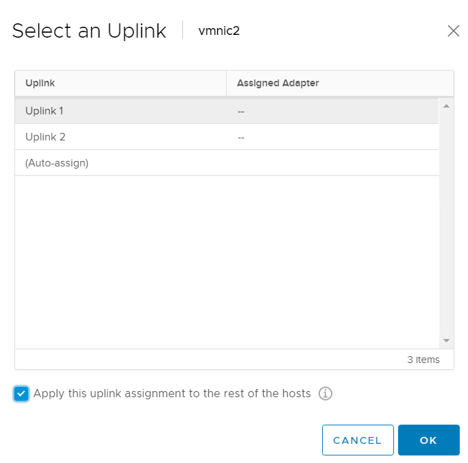

**Figure 37.** Assigning the uplink to the physical adapter

12) Once the uplinks are assigned to the physical network adapters,
select **Next**.

13) In the *Manage VMkernel adapters*, select the VMkernel to be
migrated and click **Assign port group** as shown in Figure 38.

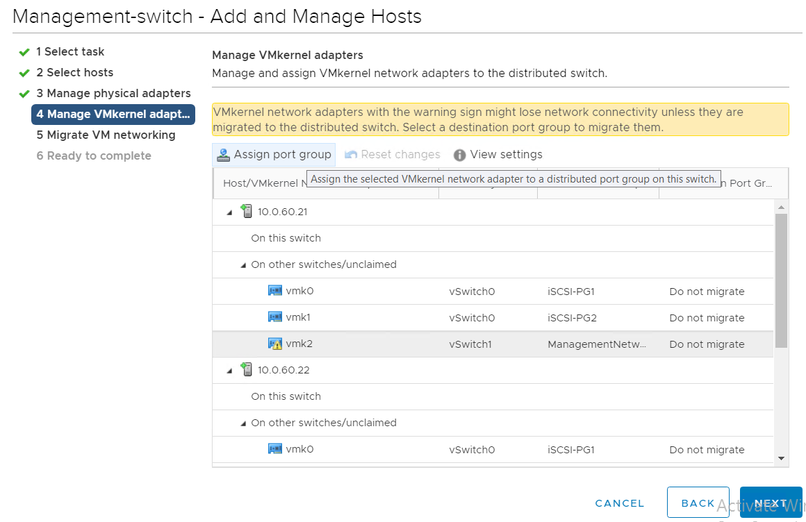

**Figure 38.** Select the VMkernel adapter to be migrated

14) Select the network associated with the VMkernel adapter which was
selected in step 13 and click **OK.**


**Figure 39.** Assign corresponding network to the VMkernel adapter to
be migrated

15) Review the VMkernel adapter configurations performed in step 13 and
14, as shown in Figure 40 and click **Next**.

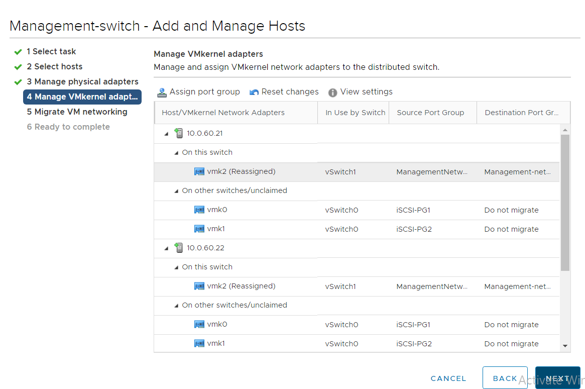

**Figure 40.** Review the VMkernel adapter configurations

16) Review the configuration in *Migrate VM networking* as shown in
Figure 41 and click **Next**.

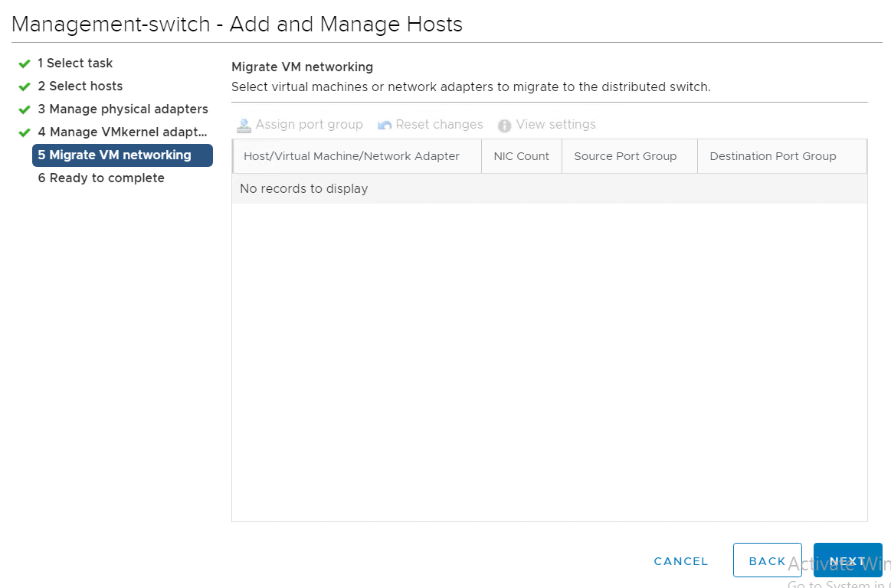

**Figure 41.** Review the migrate VM networking configurations

17) In the *Ready to complete* page, review the configurations and click
**Finish**.

### Configuring the iSCSI target server

1) Select the vSphere host and navigate to **Configure -> Storage ->
Storage Adapters -> iSCSI Adapter -> Dynamic Discovery** .

2) Click the "**+ Add...**" icon as shown in Figure 42 to add the HPE
Nimble Storage discovery IP address.

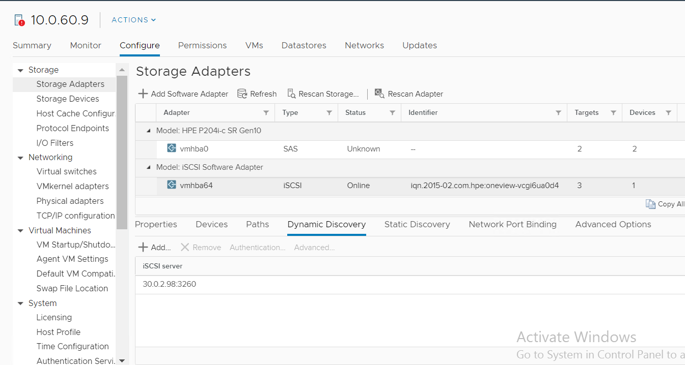

**Figure 42.** Host storage adapters

3) Provide the *Discovery IP address* of HPE Nimble Storage system along
with the port number and select the **Inherit authentication settings
from parent** box as shown in Figure 43. Click **OK**.

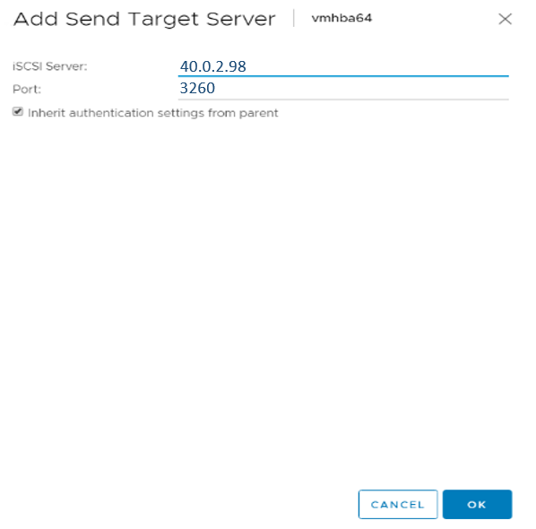

**Figure 43.** Target iSCSI server configuration

4) Repeat the above steps in all hosts to add all the iSCSI target
servers from the HPE Nimble Storage.

### Configuring the network port binding for iSCSI networks

1) To configure *Network Port Binding*, navigate to **Configure ->
Storage -> Storage Adapters -> iSCSI Adapter -> Network Port
Binding** **.**

2) Click **"+ Add Storage Adapter** **"** as shown in Figure 44.


**Figure 44.** Network port binding

3) Select the *Port Group* of the iSCSI A network shown in Figure 45 and
click **OK**.

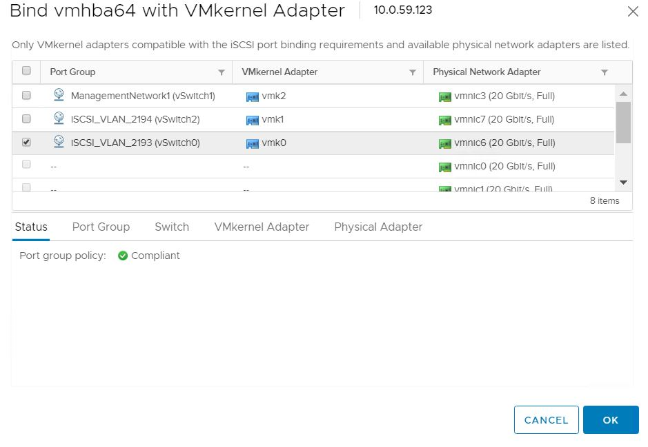

**Figure 45.** Adding iSCSI_A network for network port binding

4) Select *Port Group* of the iSCSI B network as shown in Figure 46 and
click **OK**.

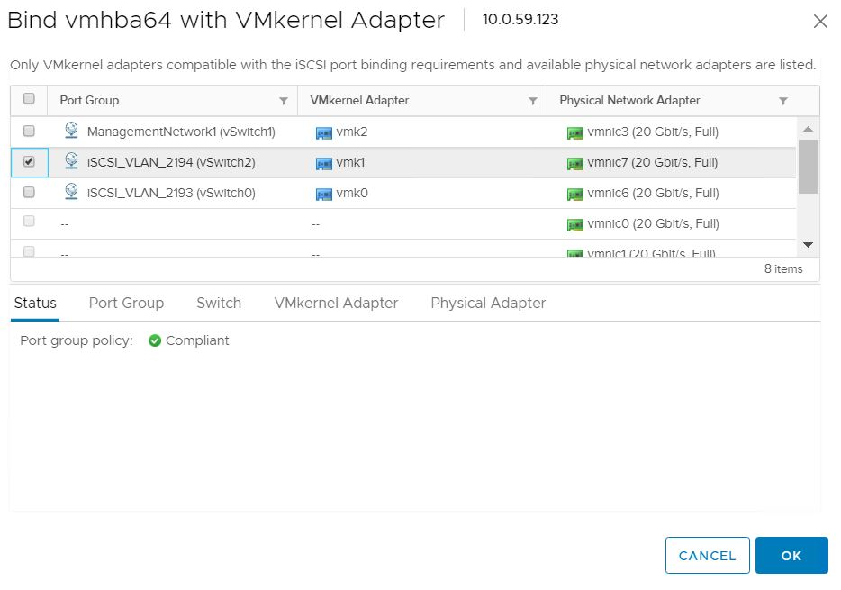

**Figure 46.** Adding iSCSI_B network for network port binding

5) Repeat the steps on all hosts for both iSCSI.

## Adding a datastore using the HPE Nimble Storage volume in vCenter

A datastore needs to be created in VMware vCenter from the volume carved
out of HPE Nimble Storage to store the VMs. The following steps create a
datastore on the HPE Nimble Storage:

1) From the *vSphere Web Client* navigator, right-click the cluster,
select **Storage** from the drop-down menu, and then select **New
Datastore** as shown in Figure 47.

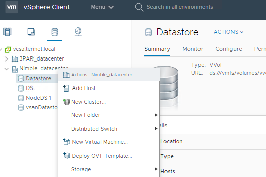

**Figure 47.** Create a datastore in vCenter

2) On the *Type* page, select **VMFS** as the Datastore type and click
**Next**.

3) On the *Name and Device selection* page, provide the values requested
and click **Next**.

4) Select a host to view its accessible disk/LUNs. Any of the hosts that
are associated with the HPE Nimble Storage volume may be selected and
click **Next**.

5) Select the **Volume** from HPE Nimble Storage and click **Next**.

6) From the *VMFS* *version* page, select *VMFS* *6* and click **Next**.

7) Specify details for *Partition* *configuration* as shown in Figure 48
and click **Next**. By default, the entire free space on the storage
device is allocated. You can customize the space if required.

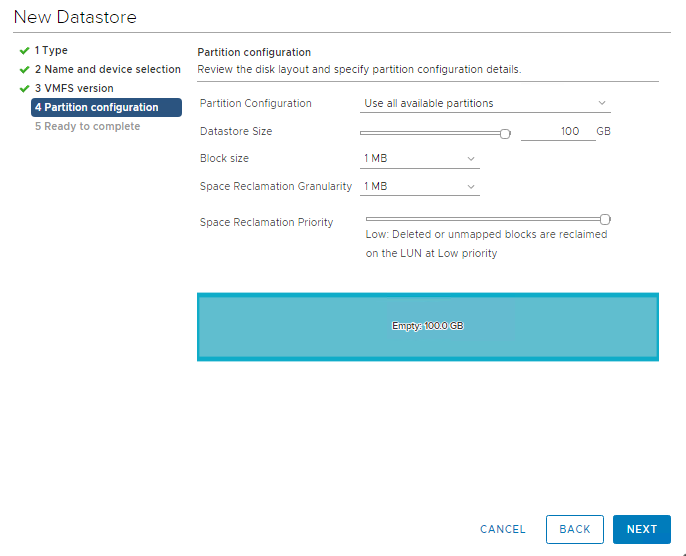

**Figure 48.** Partition configuration screen of the new datastore
within vCenter

8) On the *Ready to complete* page, review the datastore configuration
and click **Finish**.

**NOTE**

If utilizing virtual worker nodes, repeat this section to create a
datastore to store the worker node virtual machines.

## Creating a RHEL 7.6 VM template

In this solution, a VM template with RHEL 7.6 with VMware tools
installed on it needs to be created. The below steps describes the
tasks, that are required to create the template.

1) Create a virtual machine.

2) Install Red Hat Enterprise Linux 7.6 on that virtual machine.

3) Convert the VM to a template.

### Create a virtual machine

1) Log in to vCenter using the *Web Client* and select an ESXi host.
Right-click to open the **New Virtual Machine** Wizard.

2) From *Select a creation type*, select **Create a new virtual
machine**, as illustrated in Figure 49 and click **Next**.

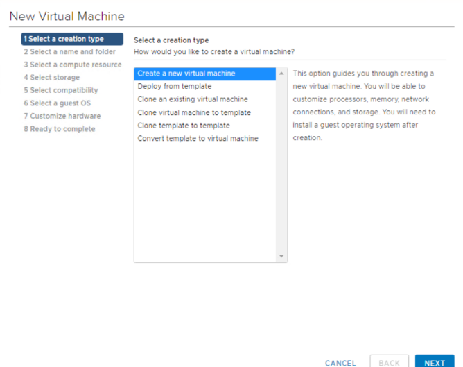

**Figure 49.** Console to create new virtual machine in vCenter

3) Enter a unique **Virtual machine name** and select the**Datacenter**
to deploy the VM as shown in Figure 50. Click **Next**.

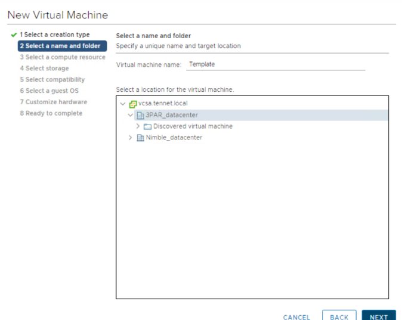

**Figure 50.** Name and location for the new virtual machine in vCenter

4) Select the **Cluster** on which the VM can be deployed. Click
**Next**.

5) Select the **Datastore** on which the VM can be stored as shown in
the Figure 51 Click **Next**.

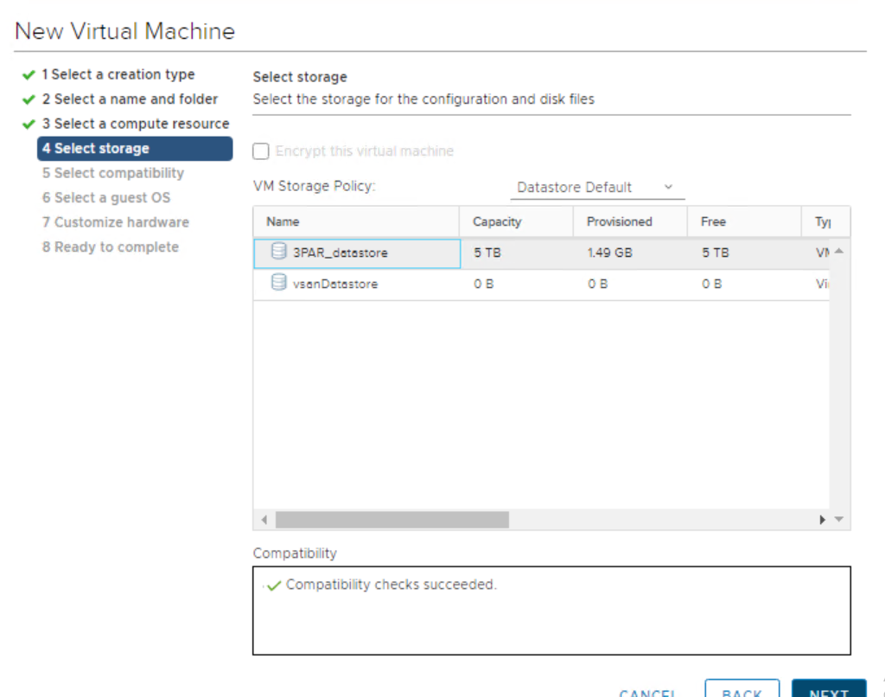

**Figure 51.** Storage selection for the new VM in vCenter

6) On the *Select compatibility* page, choose**ESXI 6.7 and later** as
shown in Figure 52 and then click **Next**.

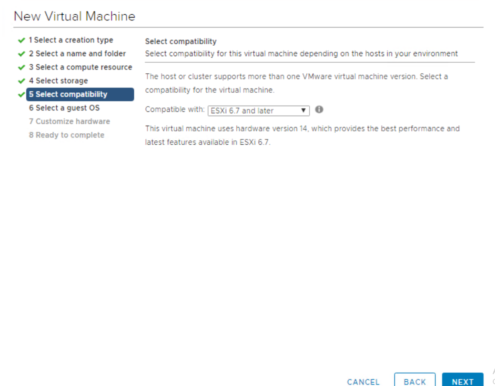

**Figure 52.** VM compatibility screen

7) On the *Select a guest OS* page, choose the*Guest OS family* as
**Linux** and*Guest OS Version* as **Red Hat Enterprise Linux 7 (64
bit)** as shown in Figure 53 and select **Next**.

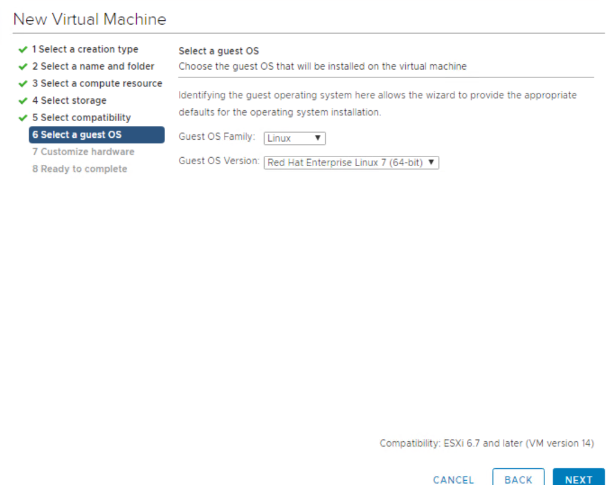

**Figure 53.** Guest OS selection

8) At the *Customize hardware* page, configure the virtual hardware with
**4 vCPUs**, **16GBMemory** and two (2) **50GB** **Hard disks**. Attach
the Operating System ISO from the datastore. Select the **Connect at**
**Power on** option as shown in Figure 54 and then click **Next.**

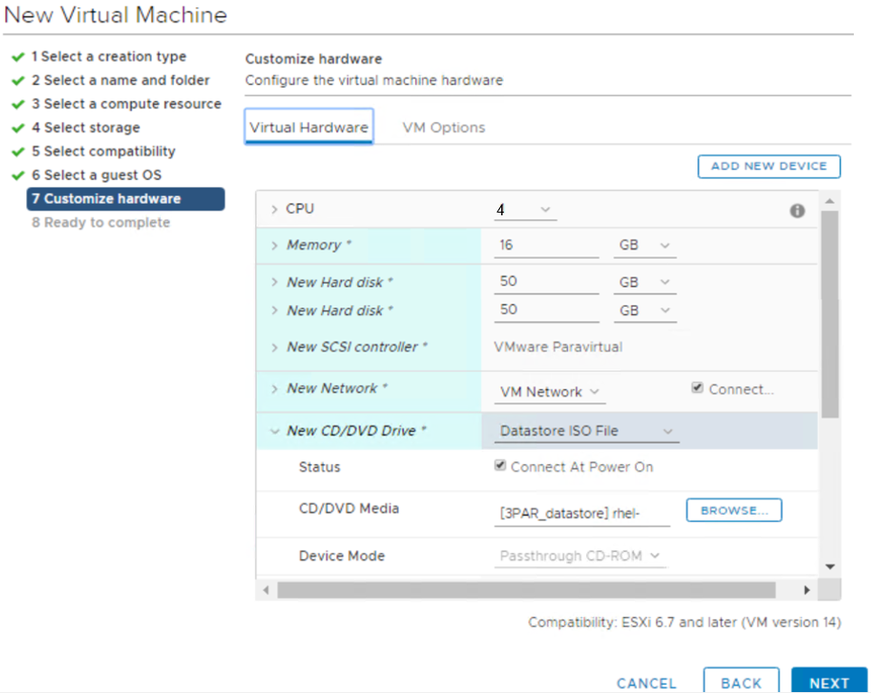

**Figure 54.** Customize the hardware for the VM in vCenter

9) On the *Ready to complete* page, review the virtual machine
configuration before deploying the virtual machine and click **Finish**
to complete the *New Virtual Machine* wizard.

## RHEL installation

Once the new VM is created, install RHEL 7.6 to complete the creation
procedure. The following steps outline the process of RHEL guest
operating system installation:

1) Launch console of the newly created VM and select **Install Red Hat
Enterprise Linux 7.6.**

2) Select the desired language and click **Continue.**

3) From the *Installation Summary* page, configure the following:

a.  Select **Date & Time** and choose the system location and click
    **Done.**
b.  Select **Keyboard** and choose the language. Click **Done.**
c.  Select **Software** **Selection** and choose the desired software
    configuration. Click **Done.**
d.  Select **Installation Destination** and choose the internal disk.
    Click **Done.**
e.  Select **Network & Hostname**, configure the networking and hostname
    of the virtual machine and enable the network interface. Click
    **Done**.

4) Once the configurations in the *Installation Summary* page is
completed, select **Begin Installation**.

5) Set a root password for the host. Do not configure extra users and
click **Done.**

6) Once the OS installation is complete, reboot the host and wait for
its completion.

7) Once the host is rebooted, login with the root credentials.

8) Register the host, and attach the host to the pools with Red Hat by
running the following commands. You will be prompted for the Red Hat
subscription *username* and *password.*

```

# subscription-manager register

# subscription-manager --attach pool=<pool-id>

```

**NOTE**

Repeat the second command for each pool.

9) Disable all repos and then enable only the required repos by running
the following commands.

```

# subscription-manager repos --disable=*

# subscription-manager repos --enable=rhel-7-server-rpms

# subscription-manager repos --enable=rhel-7-server-extras-rpms

# subscription-manager repos --enable=rhel-7-server-ose-3.11-rpms

# subscription-manager repos --enable=rhel-7-fast-datapath-rpms

```

10) Update and reboot the host by running the following commands.

```

# yum update --y

# reboot

```

11) When the VM finishes rebooting, login at the console or via ssh.
Install VMware tools in the host by running the following commands.

a. Download the VMware tools .zip file from the VMware site at,
<https://my.vmware.com/web/vmware/details?downloadGroup=VMTOOLS1032&productId=742>
.

b. Unzip the VMware tools file, navigate to the vmtools directory and
find the linux disc image file.

```

unzip <vmware tools zip file>

cd <path to vmtools directory>

```

c. Mount the CD image of VMware tools to this VM by executing the
following commands.

```

mkdir -p /mnt/cd /tmp/vmware

mount -o loop /dev/sr0 /mnt/cd

```

d. Copy the VMware tools archive from the mounted CD to local partition
by executing the following command.

```

cp /mnt/cd/< VMware tools tar.gz filename> /tmp/vmware

```

e. Extract the content of the VMware tools by executing the following
commands.

```

cd /tmp/vmware/

tar zxvf <VMware tools tar.gz filename>

```

f. Uninstall open-vm-tools and ensure dependency packages
*policycoreutils-python* exists by executing the following commands.

```

yum remove open-vm-tools

yum install policycoreutils-python

```

g. Install VMware tools by executing the following commands.

```

cd vmware-tools-distrib/

perl vmware-install.pl -d --f

```

h. Confirm the service is up and running by executing the following
command.

```

systemctl status vmware-tools

```

12) Unregister to the Red Hat subscription using the following command.

```

# subscription-manager unregister

```

### Convert the VM to a template

The following steps needs to be performed to convert the VM to a
template.

1) Log in to vCenter and select the VM created to be converted to a
template.

2) From **Actions -> Power**, select **Power off** to power off the VM.

3) From *Actions*, select **Template**, and then select **Convert to
Template.**

## Deploy VMs from the template

In order to clone from the template and create VMs for OpenShift
deployment, the user will need to edit the variables YAML file. Using an
editor such as Vim or Nano, open the file
*/etc/ansible/hpe-solutions-openshift/synergy/scalable/nimble-vsphere/roles/deploy_vm/vars/maim.yml.*
The variable file contains information about the VMs, vCenter,
hostnames, IP addresses, memory, and CPU. A sample variable file is
provided below. It is recommended to modify the file to make it suitable
to the installation environment.

```

# Name of the Datacenter

datacenter_name: datacenter

# Name of the compute clusters with the ESXi hosts for Management VMs
management_cluster_name: management-cluster

# Name of the compute clusters with the ESXi hosts for worker VMs

worker_cluster_name: worker-cluster

# Name of the Datastore to store the VMs

management_datastore_name: datastore01

worker_datastore_name: datastore02

# Name of the RHEL 7.6 VM template with VMware tools installed

vmtemplate: rhel

# Disk size in GB/GiB

master_disk: 100

infra_disk: 50

lb_disk: 50

worker_disk: 100

# number of CPUs

master_cpu: 4

infra_cpu: 4

lb_cpu: 4

worker_cpu: 4

# Memory in MB/MiB

master_memory: 16400

infra_memory: 25400

lb_memory: 16400

worker_memory: 16400

# datacenter network IP address of the masters, infra, lb and worker
nodes

master01_ip: 20.0.60.121

master02_ip: 20.0.60.122

master03_ip: 20.0.60.123

infra01_ip: 20.0.60.124

infra02_ip: 20.0.60.125

infra03_ip: 20.0.60.126

lb01_ip: 20.0.60.127

lb02_ip: 20.0.60.128

worker01_ip: 20.0.60.129

worker02_ip: 20.0.60.130

worker03_ip: 20.0.60.131

worker04_ip: 20.0.60.132

worker05_ip: 20.0.60.133

worker06_ip: 20.0.60.134

# iscsi_a network IP address of the masters, infra and worker nodes

master01_ip2: 30.0.60.121

master02_ip2: 30.0.60.122

master03_ip2: 30.0.60.123

infra01_ip2: 30.0.60.124

infra02_ip2: 30.0.60.125

infra03_ip2: 30.0.60.126

worker01_ip2: 30.0.60.129

worker02_ip2: 30.0.60.130

worker03_ip2: 30.0.60.131

worker04_ip2: 30.0.60.132

worker05_ip2: 30.0.60.133

worker06_ip2: 30.0.60.134

# iscsi_b network IP address of the masters, infra and worker nodes

master01_ip3: 40.0.60.121

master02_ip3: 40.0.60.122

master03_ip3: 40.0.60.123

infra01_ip3: 40.0.60.124

infra02_ip3: 40.0.60.125

infra03_ip3: 40.0.60.126

worker01_ip3: 40.0.60.129

worker02_ip3: 40.0.60.130

worker03_ip3: 40.0.60.131

worker04_ip3: 40.0.60.132

worker05_ip3: 40.0.60.133

worker06_ip3: 40.0.60.134

# name of the master, infra, lb and worker nodes < short names, not
the FQDN >

master01_name: master01

master02_name: master02

master03_name: master03

infra01_name: infra01

infra02_name: infra02

infra03_name: infra03

lb01_name: lb02

lb02_name: lb02

worker01_name: worker01

worker02_name: worker02

worker03_name: worker03

worker04_name: worker04

worker05_name: worker05

worker06_name: worker06

# network configuration details for the datacenter network

netmask: 255.0.0.0

gateway: 20.1.1.1

dns_server: 20.1.1.254

domain_name: "twentynet.local"

# netmask for the iSCSI networks

netmask_iscsi_a: 255.255.0.0

netmask_iscsi_b: 255.255.0.0

# Network names for the datacenter/management, iSCSI A and iSCSI B
networks

datacenter_network_name: "VM Network"

iscsi_a_network_name: "iSCSI-A"

iscsi_b_network_name: "iSCSI-B"

```

**NOTE**

The playbook supports virtual worker nodes along with other management
VMs. If physical worker nodes will be used, ignore the variables
corresponding to virtual worker nodes. Otherwise, it is advised to
review the *main.yml* task file found at
*/etc/ansible/hpe-solutions-openshift/synergy/scalable/nimble-vsphere/roles/deploy_vm/tasks*
before executing the *deploy_vm* playbook.

When the user has completed editing the variable file, execute the
following command in the Ansible Engine to deploy all the VMs specified.

```

# ansible-playbook
/etc/ansible/hpe-solutions-openshift/synergy/scalable/nimble-vsphere/playbooks/deploy_vm.yml

```

After the VMs are created, SSH into each and update their hostnames to
their fully-qualified domain names with the command listed below.

```

# hostnamectl set-hostname <fqdn as hostname of the virtual machine>

```

**NOTE**

This solution is built to deploy six (6) virtual/physical worker nodes.
It is up to the installer to adapt the playbooks to support a different
number of worker nodes.

# Deploying worker nodes

The worker nodes will be deployed and customized using HPE Synergy Image
Streamer while ensuring that the required storage volumes are created
and attached. This section outlines the steps required to install the
host. At a high-level, these steps can be described as:

1) Download the artifacts for HPE Image Streamer from the HPE GitHub
site.

2) Add the artifact bundles to HPE Image Streamer.

3) Build a worker node image.

4) Capture a golden image.

5) Copy and edit the OS build plan.

6) Create a deployment plan.

7) Create the Server Profile template.

8) Deploying the worker nodes.

9) Worker host configuration.

## Download the artifacts for HPE Synergy Image Streamer

The foundation artifact bundle for HPE OneView 5.0 can be downloaded
from,
<https://github.com/HewlettPackard/image-streamer-tools/tree/v5.0/foundation/artifact-bundles>
and Red Hat Enterprise Linux bundles for HPE Image Streamer can be
downloaded from,
<https://github.com/HewlettPackard/image-streamer-rhel/tree/v5.0/artifact-bundles>
.

## Add the artifact bundles to HPE Image Streamer

The following steps needs to be performed to add the artifact bundles to
HPE Image Streamer.

1) From the HPE Image Streamer interface, navigate to the artifact
bundles page.

2) From the **Actions** menu, add the downloaded **RHEL artifact
bundle**. If not already present, add the sample foundation bundle.

3) From the **Actions** menu, select **Extract** to extract the
artifacts from each downloaded bundle.

### Prepare the compute module for the installation of the Operating System

The following steps needs to be performed to prepare the compute module
for the installation of the Operating System.

1) Attach a Red Hat Enterprise Linux version 7.6 Server ISO image to the
iLO via Virtual Media, select the **Action** menu and then **Launch
Console**.

2) When the console launches, select **VirtualDrives** and then **Image
File** **CD**-**ROM/DVD**. Browse to the location where your ISO resides
and select it.

## Build a worker node image

In order to create a worker node image, follow the steps below:

1) Create a temporary **Server Profile** and attach it to a host. Adjust
the following settings.

a. Create a **40GB (40960 MB) Image Streamer volume** that will be used
to install RHEL by selecting **HPE-Create Empty volume** from the OS
deployment plan drop-down list.

b. Configure the connections in the following order:

i. Deployment1 - 1GB primary boot

ii. Deployment2 - 1GB secondary boot

iii. Management_A - 2GB

iv. Management_B - 2GB

v. Datacenter_A - 9GB

vi. Datacenter_B - 9GB

vii. ISCSI_A - 8GB

viii. ISCSI_B - 8GB

c. Configure the boot settings:

i. UEFI Optimized for Boot mode

ii. Secure boot disabled

iii. Manage boot order

iv. Primary boot device: Hard disk

2) Once complete, **apply** the profile to a **single host** and select
**Create**.

3) From the *Actions* drop down found on the Server Profile's OneView
page, select **Launch console**.

4) Attach the RHEL 7.6 image and select *Power Switch* and then
**Momentary Press**.

5) When the screen shown in Figure 55 pops up, select **Install Red Hat
Enterprise Linux 7.6** **and** then press '**e'** on the keyboard.


**Figure 55.** Selecting the OS to install

6) Append the following to the install kernel boot parameter to include
**rd.iscsi.ibft=1** as in Figure 56.


**Figure 56.** Editing the kernel boot parameter

7) Press **Ctrl-x** to continue the boot process.

8) When the user screen appears, ensure you select your local language,
set the date and time, keyboard layout and language support. When done,
select **Installation Destination**.

9) At the *Installation Destination* screen, select **Add a disk** and
then choose the 40GiB volume from HPE Image Streamer as in Figure 57.
Click **Done** after you have chosen this disk.


**Figure 57.** Image Streamer volume as seen within the installation
destination screen

10) Under *Other Storage Options*, select**I will configure
partitioning** and then click **Done.**

11) At the *Manual Partitioning* screen, click **Select here to create**
**them automatically**. This will display a new *Manual Partitioning*
screen.

12) Highlight the */boot* partition and on the right side of the page
select **ext4** as the filesystem. Click **Update Settings.**

13) Highlight the */* partition on the right side of the screen and
reduce the *Desired Capacity* to **18 GiB** and then choose **ext4** as
the filesystem. Click **Update Settings.**

14) Highlight the *swap* partition on the right side of the screen,
change *Desired Capacity* from 3000 MiB to **4096 MiB** . Click **Update
Settings.**

15) Click '**+**' below for the list of partitions. For mount point,
select **/var** from the dropdown and leave the *Desired Capacity*
blank. This will allow the /var partition to use all remaining space.

16) At the *Manual Partitioning* screen, highlight the /var partition
and choose **/ext4** for the *File System*. Click **Update Settings.**
The screen should appear as in Figure 58.


**Figure 58.** Customizing disk partitions

17) Once you have validated the file systems and partition sizes are
correct, Click **Done**.

18) When prompted, select **Accept Changes**.

19) Select the *Network & Hostname* link. At the resulting screen,
highlight **Ethernet (ens3f4)** and set it to ' **ON**' as in Figure 59.
Provide a temporary hostname for the host and click **Done**.

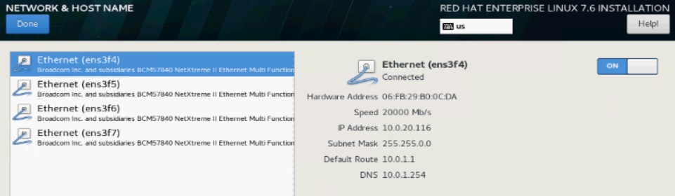

**Figure 59.** Configuring networking

20) Select **Begin Installation**.

21) When prompted, set a root password for the host. Do not configure
extra users and click **Done**.

22) Once the OS installation is complete you can reboot the host.

23) When the host completes rebooting, log on as *root* at the iLO
console.

24) Register the host, and attach the host pool with Red Hat by running
the following command. You will be prompted for the Red Hat subscription
*username* and *password.*

```

# subscription-manager register

# subscription-manager --attach pool=<pool-id>

```

Repeat the command for each pool.

25) Disable all repos and then enable only the required repos by running
the following commands.

```

# subscription-manager repos --disable=*

# subscription-manager repos \\

--enable=rhel-7-server-rpms \\

--enable=rhel-7-server-extras-rpms \\

--enable=rhel-7-server-ose-3.11-rpms \\

--enable=rhel-7-fast-datapath-rpms

```

26) Install teamd by running the following command.

```

# yum install teamd --y

```

27) Update and reboot the host by running the following commands

```

# yum update --y

# reboot

```

28) Once the host has restarted, log on as the root user and open the
appropriate firewall ports by running the following commands.

```

# firewall-cmd --add-port=3260/tcp --permanent

# firewall-cmd --add-port=4789/udp --permanent

# firewall-cmd --add-port=8053/udp --permanent

# firewall-cmd --add-port=8053/tcp --permanent

# firewall-cmd --add-port=443/tcp --permanent

# firewall-cmd --add-port=8443/tcp --permanent

# firewall-cmd --add-port=10250/tcp --permanent

# firewall-cmd --add-port=53/tcp --permanent

# firewall-cmd --add-port=53/udp --permanent

# firewall-cmd --reload

```

29) Verify your settings by running the following command.

```

# firewall-cmd --list-all

```

30) Create the following directories.

```

# mkdir /boot/efi/EFI/HPE

# mkdir --p /boot/efi/EFI/HPE/isdeploy

# mkdir --p /boot/efi/EFI/HPE/isdeploy/scripts

# mkdir --p /boot/efi/EFI/HPE/isdeploy/tmp

# mkdir --p /boot/efi/EFI/HPE/isdeploy/data

```

31) Modify /etc/rc.d/rc.local. Add the line sh
*/boot/efi/EFI/HPE/isdeploy/HPE-ImageStreamer.bash* as below.

```

# vi /etc/rc.d/rc.local

```

32) Change permission of the rc.local file.

```

# chmod 755 /etc/rc.d/rc.local

```

33) Ensure you remove subscriptions from the host and unregister it.
Gracefully shut down the host

```

# subscription-manager unregister

# shutdown -h now

```

## Capture a golden image from compute module

Utilize the build plan *HPE - Foundation 1.0 - capture OS Volume as
is-2017-03-24* to capture the golden image from the host just created.
To do this, follow these steps:

1) From within the HPE OneView interface, highlight the *Server Profile*
and scroll in the right window until you see the OS volume listed under
OS Deployment. Record the ID of the volume.

2) From the OneView drop down select **OS Deployment Servers** and
launch the *Image Streamer UI* by selecting its IP address.

3) From within the HPE Image Streamer UI, select **Golden Image**
and then **Create** **golden image**. Fill in the information as in the
example in Figure 60 and then click **Create.**

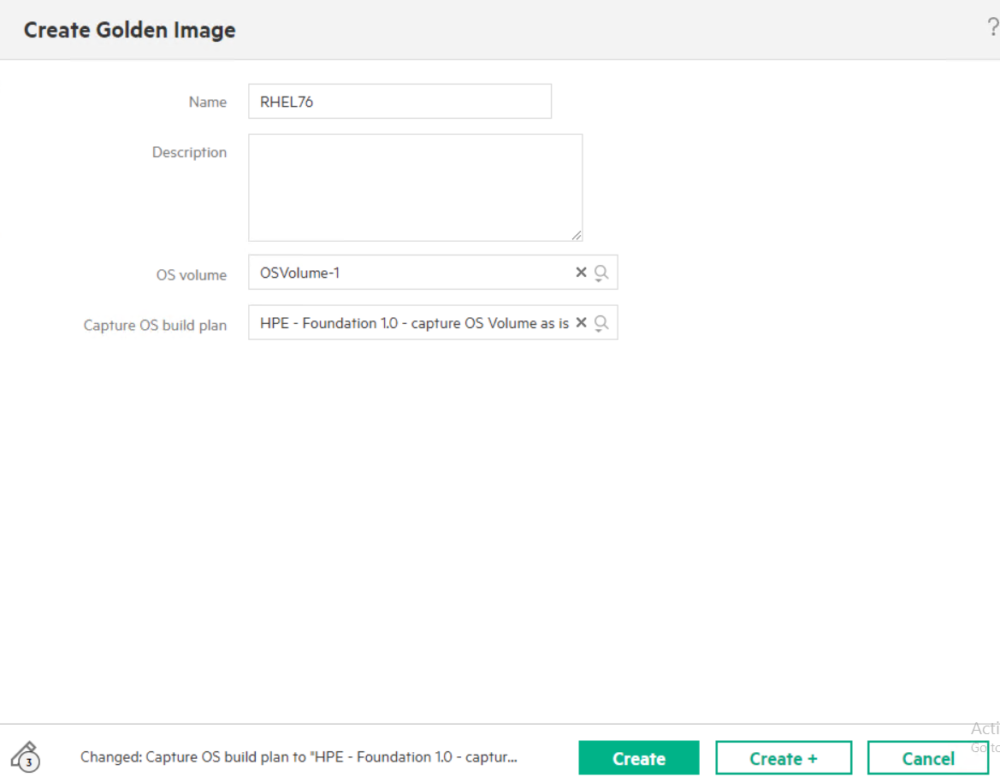

**Figure 60.** Capture screen for golden images

4) Once the image has been successfully captured, return to the OneView
interface and delete the Server Profile from the host you used to
capture the image. You can ignore the warning that the volume will be
deleted. This is deleting the original volume that was used to install
the Operating System, but the golden image will remain intact.

## Copy and edit the OS build plan

1) From within the Image Streamer UI, select **OS Build Plans** from the
**Image Streamer** drop-down list.

2) Select the
**HPE-RHEL7-EFI-personalize-and-configure-NIC-teamings-LVM-2019-06-07**
build plan from the *Actions* menu, select **Copy.**

3) Assign a **name** to the new plan. It is recommended to add the
current date or another unique identifier that will help quickly
identify the copy being used.

4) Under *Custom* attributes, select **Team1NIC1** and select the **edit
icon**.

5) **Check** the box **Allow no network connection** and click **OK**.

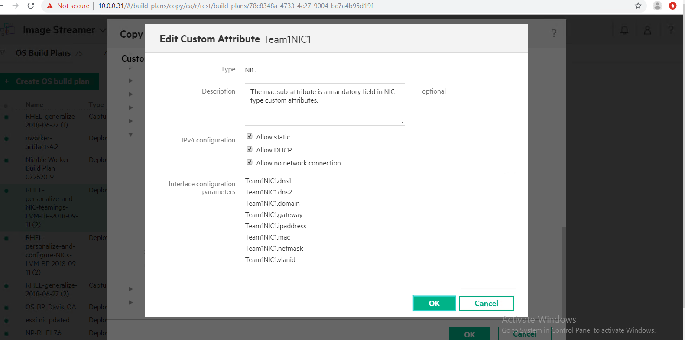

**Figure 61.** Edit custom attributes for OS build plan screen

6) Repeat this process for Team1NIC2.

7) Click **OK** when done.

## Create a deployment plan

The following steps should be used to create a deployment plan that will
be used to deploy the worker nodes.

1) Create a **Deployment Plan** from within the Image Streamer interface
by selecting **Image Streamer > Deployment Plans > Create Deployment
Plan** .

2) Assign a name to the *Deployment Plan*, provide a description and
then select the *OS Build Plan* you created in the prior step as in
Figure 62. This is the build plan the installer created in the prior
section, so the name will be what was chosen at that time.

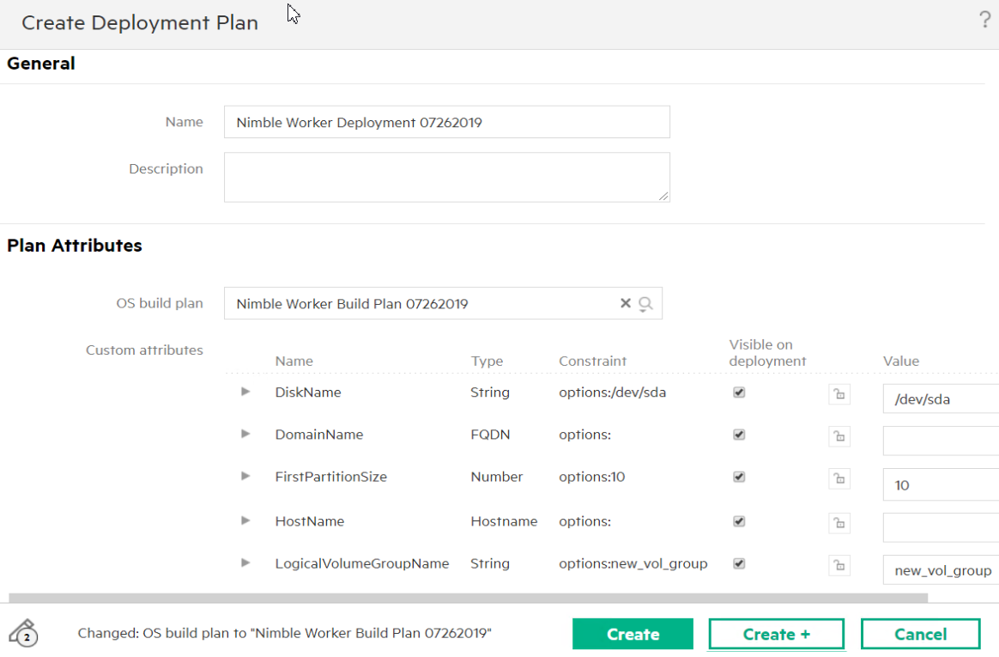

**Figure 62.** Create deployment plan screen from within image streamer

3) In the *Golden Image* drop-down, select the golden image created in
the **"Capture a Golden image from the compute module"**.

4) Select **Create** to finish creating the deployment plan.

## Create the Server Profile template

The following steps needs to be performed to create the Server Profile
template.

1) From the OneView drop-down list, select **Server Profile Templates >
Create Server Profile template** .

2) Assign a name and description to the profile and then select the
appropriate **Server hardware type** *and* **Enclosure group***.*

3) Select the **OS Deployment plan** you created from the drop-down
list.

4) Scroll to *Connections* and add the following connections in order
(you will see two deployment network connections in place prior to
adding these networks). **Click Add+** until the final network is added
and then click **Add** for the final network.

a) Management_a, Ethernet, select your management network, 2Gb.

b) Management_b, Ethernet, select your management network, 2Gb.

c) Datacenter_a, Eethernet, select your dc net, 9Gb.

d) Datacenter_b, Ethernet, select your dc net, 9Gb.

e) Iscsi_a, Ethernet, iSCSI_SAN_A for the network, 8Gb.

f) Iscsi_b, Ethernet, iSCSI_SAN_B, 8Gb.

5) Edit the management connections and set the bandwidth to either 1Gb
or 2Gb as shown in Figure 63.

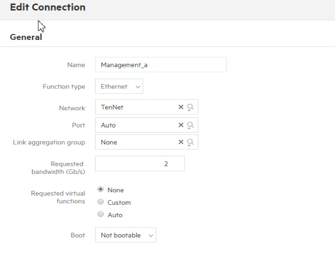

**Figure 63.** Server Profile template edit connection screen

6) Return to the deployment settings and customize the following
settings:

a. Enter a **NewRootPassword** and confirm it.

b. Create a **new, non-root user and password.**

c. For Team0NIC1 select **Management_a** and select the radio button
User-specified. Fill in the network information requested.

d. For Team0NIC2 select **Management_b** and select the radio button
User-specified.

e. For Team1NIC1 select **Datacenter_a** and select the radio button
User-specified. Fill in the Datacenter network details.

f. For Team0NIC2 select **Datacenter_b.** and select the radio button
User-specified.

7) Leave *HostName* blank.

8) Fill in any RBSU customizations and then select **Create.**

## Deploying the worker nodes

The following are the steps to deploy a new Server Profile from the
template to the worker node.

1) Navigate to server profile from OneView and select **Create
profile**. Ensure that the deployment plan that you created is selected
from the drop-down list in the *OS Deployment portion* of the server
profile.

2) Fill in the remaining settings as in Figure 64, inserting
appropriate values. For IPv4 address, you should enter management
network and data center network IPs. Enter the *hostname*, when
complete, click **Create.**

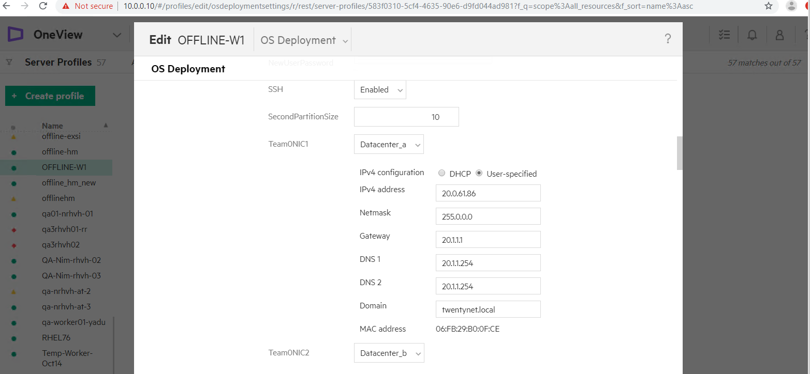

**Figure 64.** Server profile for the worker nodes

3) Repeat the steps for all worker nodes and ensure that each node is
powered on once the profile is deployed.

## Worker node configuration

The remaining host configuration is handled via Ansible playbooks. The
plays for this section is included in the earlier clone from GitHub.
This section describes the plays within the context of the directory
they are found.

Configuration of the worker nodes is handled by the "nworkers" (Nimble
worker nodes) and "nworkerconf" (Nimble worker) configuration roles
within the repository. These roles and the accompanying plays consist of
the following files.

Ansible directory root consists of:

1) ***Hosts*** - this file contains the definition of the hosts that
will be used within the solution as well as variables for networking and
iSCSI iqn. This is the same file that exists for the hypervisor hosts.

2) ***playbooks/nworkers.yaml*** - this file is used to run the plays
that register and update the host as well as to create user, who will be
responsible for installing OpenShift Container Platform.

3) ***playbooks/nworkconf.yaml*** - this file is used to run the plays
that configure the Docker environment, start services, configure the
network connections for the host, alter the IQN, and bring up the
networks.

The user should configure variables within the hosts file and within the
individual variable files (*roles/nworkers/vars/main.yaml* and
*roles/nworkerconf/vars/main.yaml*) on a per role basis prior to running
the play.

### Running the roles

1) From the Ansible Engine host, run the following commands to finalize
the deployment of the worker nodes.

```

# cd
/etc/ansible/hpe-solutions-openshift/synergy/scalable/nimble-vsphere/

# ansible-playbook --i hosts playbooks/nworkers.yaml ---ask-vault-pass

```

2) Once the play is complete and the hosts are restarted, SSH into one
of the worker nodes and run the following command.

```

# subscription-manager status

```

You should see a return that tells you the status is current.

3) From the Ansible Engine host, run the following command.

```
# ansible-playbook --i hosts playbooks/nworkerconf.yaml
--ask-vault-pass
```

4) Once the play is complete and the hosts are restarted, run the
following commands from the Ansible Engine host.

```

# ping <iscsi A address>

# ping <iscsi B address>

# ping <data center bond IP>

```

5) After the remote hosts reboot, run the following command from the
Ansible Engine host.

```

# ping <management bond IP>

```

# Red Hat OpenShift deployment

This section describes the process to deploy Red Hat OpenShift Container
Platform 3.11. Prior to installation, ensure you have internet access
and are able to reach the Hewlett Packard Enterprise GitHub site at,
<https://github.com/hewlettpackard> . To validate internet connectivity,
run the following command on the Ansible Engine.

```

# curl github.com

```

## Prerequisites

In order to utilize the scripts and procedures documented in this
deployment section, the following perquisites must be met:

1) Ansible Engine should be installed and configured and capable of
communicating with the hosts within this solution.

2) VMware vSphere virtualization host is installed on at least three (3)
HPE Synergy 480 Gen10 Compute Modules.

3) vSphere hosts have been configured into a cluster.

4) Storage and networking are configured within hosted engine.

5) DNS entries should exist for all hosts.

6) A user should be created in Active Directory (AD) for authentication
and the user AD values should be known.

**NOTE**

In case htpasswd is used for authentication, an **htpasswd** file should
be created. htpasswd file can be created using the tool available at,
<http://www.htaccesstools.com/htpasswd-generator/> . Save the file to
*/etc/oshift-hash-pass.htpasswd* and refer this file in the identity
provider section under OCP variables in the host file.

```

# openshift_master_identity_providers=[{'name':
'htpasswd_auth', 'login':'true', 'challenge':
'true','kind': 'HTPasswdPasswordIdentityProvider',}]

```

### Generate a Key

1) On the Ansible Engine host, run the following command to generate a
key.

```

# ssh-keygen -t rsa

This creates a key file at \~/.ssh/id_rsa.pub.

```

2) Copy this SSH public key to /var and change the permission using the
following commands.

```

# cp /root/.ssh/id_rsa.pub /var/id_rsa.pub

# chmod 666 /var/id_rsa.pub

```

## Authentication

With Red Hat OpenShift Container Platform, master nodes include a
built-in OAuth 2.0 server. Users obtain OAuth access tokens to
authenticate themselves to the API. When a user requests a new OAuth
token, the OAuth server uses the configured identity provider to
determine the identity of the person making the request. It then
determines user identity and creates an access token for that user, and
returns the token for use.

In this solution, identity provider with OAuth can be implemented with
LDAP or htpasswd. As a best practice, this solution configures the
identity provider during the cluster installation.

### LDAP

LDAP user authentication is the process of validating user credentials
with a directory server such MS Active Directory, OpenLDAP or other
compliant server. LDAP directories are standard technology for storing
user, group and permission information and serving that to applications
in the enterprise.

To implement OAuth using LDAP, a user should be created in Active
Directory (AD) for authentication and the user AD values should be known
and the following line is to be included in the inventory file used for
the Red Hat OpenShift Container Platform installation.

```

# LDAP authentication\
#openshift_master_identity_providers=[{'name':
'my_ldap_provider', 'challenge': 'true', 'login': 'true',
'kind': 'LDAPPasswordIdentityProvider', 'attributes': {'id':
['dn'], 'email': ['mail'], 'name': ['cn'],
'preferredUsername': ['uid']}, 'bindDN': '', 'bindPassword':
'', 'insecure': 'false', 'url':
'ldap://ldap.example.com:389/ou=users,dc=example,dc=com?uid'}]

```

### Htpasswd

htpasswd is used to create and update the flat files and used to store
user credentials for authentication of HTTP users.

The htpasswd file contains usernames in plain text (unencrypted) and a
hashed (encrypted) password for each user. Each line contains a username
and a password separated by a colon ":". The password is hashed using
a complex algorithm. The htpasswd generator used in this solution uses
MD5 encryption algorithm.

htpasswd is used for authentication and the following steps tells how to
create the htpasswd file.

- An htpasswd file should be created. htpasswd file can be created using
the tool available at
[http://www.htaccesstools.com/htpasswd-generator/.](http://www.htaccesstools.com/htpasswd-generator/)

- Save the file to */etc/oshift-hash-pass.htpasswd* and refer to this file in the identity provider section under OpenShift variables in     the host file.

- Include the following line in the inventory used for the Red Hat OpenShift Container Platform installation.

```

# htpasswd auth\
openshift_master_identity_providers=[{'name': 'htpasswd_auth',
'login': 'true', 'challenge': 'true', 'kind':
'HTPasswdPasswordIdentityProvider'}]

# Defining htpasswd path\
#openshift_master_htpasswd_file=<path to local pre-generated
htpasswd file>

```

With OAuth, authorization to external application is easier and it
enables using a single account to authenticate multiple applications
like internal container registry, Jenkins, Prometheus etc, which in turn
makes permission management faster and better.

## OpenShift prerequisites

### Install prerequisites for OpenShift installation on the virtual machines and worker nodes

The plays in this section prepare the hosts for OpenShift installation.
Two Ansible roles *(roles/virtual-host-prepare/ and
roles/physical-host-prepare/)* are available for preparing the
management virtual machines and physical worker nodes.

1) Edit the files *roles/virtual-host-prepare/vars/main.yml* and
*roles/physical-host-prepare/vars/main.yml* in a text editor such as vi
or nano and enter the path to the second disk.

2) For VMs created by running the *deployVM.yml* play, the default
location of the second disk is */dev/vdb* and is already updated in the
variable file available at, *roles/virtual-host-prepare/vars/main.yml.*
The line in the file reads as below.

```

*second_disk_vms: /dev/vdb*

```

3) For *physical worker nodes* created as per the Red Hat OpenShift
worker nodes section, the default location of the second disk is
*/dev/mapper/mpatha* and is already updated in the variable file
available *at roles/physical-host-prepare /vars/main.yml.* The line in
the file reads as below.

```

*second_disk_physical: /dev/mapper/mpatha*

```

**NOTE**

To find pool ids for the management and worker VMs, execute the
following command and look for *System Type: Virtual*

```

# subscription-manager list --available --matches '*OpenShift*'

```

The host prepare plays are *physical-hostprepare.yml* and
*virtual-hostprepare.yml* and are located at
*/etc/ansible/hpe-solutions-openshift/synergy/scalable/nimble-vsphere/playbooks*
. They accomplish the following:

1) Disable the firewall for the OpenShift installation. This will be
re-enabled post installation.

2) Create a user group with password-less sudo rights.

3) Create a sudo user and add the user to the password-less sudo group.

4) Upload the public SSH key to allow secure access without credentials.

5) Register the hosts using subscription manager.

6) Enable the required repositories.

7) Install the basic utilities.

8) Perform a yum update to ensure the latest patches and updates are
applied.

9) Install Red Hat OpenShift related packages.

10) Install the latest version of Docker which should be at 1.13-94 or
above.

11) Configures Docker local storage.

12) To prepare virtual machines, execute the following command on the
Ansible Engine host.

```

# cd
/etc/ansible/hpe-solutions-openshift/synergy/scalable/nimble-vsphere/

# ansible-playbook --i hosts playbooks/virtual-hostprepare.yml
--ask-vault-pass

```

To prepare physical worker nodes, execute the following command on the
Ansible Engine host.

```

# cd
/etc/ansible/hpe-solutions-openshift/synergy/scalable/nimble-vsphere/

# ansible-playbook --i hosts playbooks/physical-hostprepare.yml
--ask-vault-pass

```

**NOTE**

Installation of Red Hat OpenShift Container Platform 3.11 requires
Ansible version 2.6. The Ansible 2.7 implementation must be deactivated
prior to installing. To deactivate the virtual environment and
installing Ansible 2.6, execute the following commands:

```

# deactivate

# yum install ansible

```

### OpenShift-Ansible

The following Ansible playbooks deploy Red Hat OpenShift Container
Platform on the machines that have been created and configured by the
previous Ansible playbooks. In order to get the OpenShift-Ansible
playbooks from the 'Red Hat OpenShift Container Platform 3.11'
repository, run the following command:

```

# yum install openshift-ansible

```

The variables for the OpenShift deployment are maintained in the Ansible
inventory file, for example*, /etc/ansible/hosts*. Review the sample
hosts file provided in the GitHub repository for this solution located
at,
<https://github.com/HewlettPackard/hpe-solutions-openshift/tree/master/synergy>
.

## Install OpenShift

From the Ansible host, run the *prerequisites.yml*
and*deploycluster.yml* playbooks that are located in
*/usr/ansible/openshift-ansible/playbooks/* on the Ansible host.

1) Run the
*/usr/share/ansible/openshift-ansible/playbooks/prerequsites.yml*
playbook.

```

# ansible-playbook -i
/etc/ansible/hpe-solutions-openshift/synergy/scalable/nimble-vsphere/hosts
/usr/share/ansible/openshift-ansible/playbooks/prerequisites.yml

```

2) Run the
*/usr/share/ansible/openshift-ansible/playbooks/deploy_cluster.yml*
playbook.

```

# ansible-playbook -i
/etc/ansible/hpe-solutions-openshift/synergy/scalable/nimble-vsphere/hosts
/usr/share/ansible/openshift-ansible/playbooks/deploy_cluster.yml

```

3) When the deployment is complete, the user may access the OpenShift
webpage, as shown in Figure 65, using the credentials provided in the
htpasswd file or the Active Directory. The URL for the webpage is
*https://<load balancer>:8443.*


**Figure 65.** OpenShift web console login screen

# Install the Nimble Storage Linux Toolkit on the OpenShift nodes

The latest version of Nimble Storage Linux Toolkit is 3.x. However, the
user should use the NLT version 2.4.x.x to implement this solution. If
Ansinimble has been used to automate the installation of the array(s) in
the environment, this section is not required. If the user is not using
Ansinimble, ensure that the Nimble Storage Linux Toolkit has been copied
to each worker, infrastructure, and master node and perform the
following steps to install NLT on them.

1) Log in via SSH or at the iLO console of each node and run the
following commands.

```

# cd <location_where_nlt_user_was_copied>

# chmod +x nlt_user_2.4.#.#

# ./nlt_user_2.4.#.# --silent-mode --docker --accept-eula
--flexvolume

```

2) Run the following commands from nltadm where the IP address is the IP
of the management adapter on the HPE Nimble Storage group.

```

# nltadm --group --add --ip-address #.#.#.# --username admin
--password 'Password'

# nltadm --group --verify --ip-address #.#.#.#

```

3) In order to discover the FlexVolume driver, restart the OpenShift
kubelet after installing NLT using the following command.

```

# systemctl restart atomic-openshift-node

```

**WARNING**

In order to avoid any certificate corruption in HPE Nimble Storage,
uninstall NLT before re-installing OpenShift nodes. *multipathd* should
be re-installed after any upgrade/re-install of OpenShift to ensure the
correct multipath.conf file is being used. Uninstall NLT using the
following commands.

```

# cd /tmp and # nlt_uninstall

```

# Install the HPE Nimble Kube Storage Controller:

1) On a master node, verify that you are logged on as a user with the
system:admin role by running the following command.

```

# oc whoami --c

default/masternodename.example.domain:8443/system:admin

```

2) Clone the example specification files from the Nimble Storage GitHub
by running the following command.

```

# git clone <https://github.com/nimblestorage/container-examples>

```

3) Run the following commands to deploy the HPE Nimble Kube Storage
Controller.

```

# cd container-examples/NLT/OpenShift/ocp311

# oc create -f dep-kube-storage-controller.yaml

```

4) To validate the installation of the HPE Nimble Kube Storage
Controller run the following.

```

# oc get deploy --namespace kube-system

NAME DESIRED CURRENT UP-TO-DATE AVAILABLE AGE

kube-storage-controller 1 1 1 1 3s

```

# Deploy Docker Registry with persistent storage

An integrated Docker Registry is created along with the OpenShift
installation. This Registry pod will be running in the namespace
'default'. Running the following play will check if the Docker Registry
is running and, if it is not, will create an integrated Docker Registry.
If the Docker Registry is running with an ephemeral volume this play
will create a PVC and attach the persistent volume to the Registry pod.

1) Execute the following playbook in Ansible Engine.

```

# ansible-playbook -i
/etc/ansible/hpe-solutions-openshift/synergy/scalable/nimble-vsphere/hosts
/etc/ansible/hpesolutions-openshift/synergy/scalable/nimble-vsphere/playbooks/deployment_validation.yaml

```

2) The following message confirms the success of the deployment.

```
"Validations are done successfully".
```

In the case of a disconnected installation, execute the following playbook from the
Ansible Engine. See the section around deploying using a disconnected
method at the end of this document.

```

# ansible-playbook -i
/etc/ansible/hpe-solutions-openshift/synergy/scalable/nimble-vsphere/disconnected/hosts
/etc/ansible/hpesolutions-openshift/synergy/scalable/nimble-vsphere/disconnected/playbooks/deployment_validation.yaml

```

**NOTE**

If the persistent volume status is not bound, restart the API,
Controllers and Atomic-openshift-node.service using the following
commands.

```

# master-restart api api

# master-restart controller

# systemctl restart atomic-openshift-node.service

```

## Validate persistent volume configuration

There are a couple of YAML files in the repository to create a
StorageClass, persistent volume claims and an example deployment. Note
that the different API versions and annotations needed for the different
versions of OpenShift.

1) Create an application optimized StorageClass by running the following
command.

```

# oc create -f sc-transactionaldb.yaml

storageclass "transactionaldb" created

```

2) Create a persistent volume claim from the StorageClass by running the
following command.

```

# oc create -f pvc-mariadb.yaml

persistentvolumeclaim "mariadb-claim" created

```

3) Create a deployment with a persistent volume claim reference by
running the following command.

```

# oc create -f dep-mariadb.yaml

secret "mariadb" created

deployment "mariadb" created

service "mariadb" created

```

4) Create a default StorageClass for "classless" persistent volume
claims as below. To observe the created resources by run the following.

```

# oc get deploy,storageclass,pvc,pv

NAME DESIRED CURRENT UP-TO-DATE AVAILABLE AGE

deploy/mariadb 1 1 1 1 45s

NAME TYPE

general (default) hpe.com/nimble

transactionaldb hpe.com/nimble

NAME STATUS VOLUME CAPACITY ACCESSMODES AGE

pvc/default-claim Bound general 32Gi RWO 12s

pvc/mariadb-claim Bound transactionaldb 16Gi RWO 1m

NAME CAPACITY ACCESS RECLAIMPOLICY STATUS CLAIM AGE

pv/general 32Gi RWO Delete Bound default-claim 9s

pv/transactionaldb 16Gi RWO Delete Bound mariadb-claim 1m

```

**NOTE**

If the persistent volume status is not bound, restart the API,
Controllers and Atomic-openshift-node.service.

```

# master-restart api api

# master-restart controller

# systemctl restart atomic-openshift-node.service

```

# Ansible OpenShift deployment removal

This Ansible play removes the Red Hat OpenShift 3.11 deployment. It is a
two-step process that requires uninstalling the application followed by
unregistering Red Hat OpenShift components and deleting any deployed
VMs.

## Uninstall OpenShift

To uninstall OpenShift 3.11 from all nodes run the following command.

```

# ansible-playbook -i
/etc/ansible/hpe-solutions-openshift/synergy/scalable/nimble-vsphere/hosts
/usr/share/ansible/openshift-ansible/playbooks/adhoc/uninstall.yml

```

## Unregister OpenShift components and delete deployed VMs

To unregister the nodes from Red Hat Subscription and to delete the VMs
from VMware vCenter Server Appliance, run the following command.

```

# ansible-playbook -i
/etc/ansible/hpe-solutions-openshift/synergy/scalable/nimble-vsphere/hosts
/etc/ansible/hpe-solutions-openshift/synergy/scalable/nimble-vsphere/playbooks/delete_vm.yaml
--ask-vault-pass

```

# Prometheus cluster monitoring

To enable Prometheus cluster monitoring use the inventory variables and
playbook shown below. This uses persistent storage to record metrics to
a persistent volume and can survive a pod being restarted or recreated.

To configure the Prometheus cluster with persistent storage, follow the
steps below:

1) Add the following parameters to the host file under '[OSEv3:vars]'
section.

```

openshift_cluster_monitoring_operator_install=true

openshift_cluster_monitoring_operator_node_selector={"node-role.kubernetes.io/infra":
"true"}

openshift_cluster_monitoring_operator_prometheus_storage_enabled=true

openshift_cluster_monitoring_operator_alertmanager_storage_enabled=true

openshift_cluster_monitoring_operator_prometheus_storage_capacity=100Gi

openshift_cluster_monitoring_operator_alertmanager_storage_capacity=20Gi

openshift_cluster_monitoring_operator_prometheus_storage_enabled=true

openshift_cluster_monitoring_operator_alertmanager_storage_enabled=true

```

2) Run the following play to install Prometheus monitoring.

```

# ansible-playbook -i
/etc/ansible/hpe-solutions-openshift/synergy/scalable/nimble-vsphere/hosts
/usr/share/ansible/openshift-ansible/playbooks/openshift-monitoring/config.yml
--ask-vault-pass -e\@vault_pass.yml

```

**NOTE**

You can also deploy Prometheus cluster monitoring along with the
OpenShift deployment using the '*deploy_cluster.yml'* play. However,
the PVC for the Persistent Storage will not be created until the Nimble
Docker plugin is configured and a storage class is created. It is thus
strongly recommended to run the Prometheus cluster monitoring play
separately after installing OpenShift.

# Elasticsearch, Fluentd and Kibana

## Aggregating container logs using Elasticsearch, Fluentd and Kibana

The Elasticsearch + Fluentd + Kibana (EFK) stack should be deployed in
order to aggregate logs from hosts and applications for a range of
OpenShift Container Platform services.

To aggregate container logs using EFK with Persistent Elasticsearch
Storage, follow the steps below.

1) Add the following parameters to the host file under '[OSEv3:vars]'
section.

```

openshift_logging_install_logging=true

openshift_logging_es_pvc_dynamic=true

openshift_logging_es_pvc_size=200Gi

openshift_logging_elasticsearch_storage_type=pvc

openshift_logging_es_pvc_prefix=oc-efk-log

openshift_logging_es_cluster_size=3

openshift_logging_es_nodeselector={"node-role.kubernetes.io/infra":
"true"}

openshift_logging_kibana_nodeselector={"node-role.kubernetes.io/infra":
"true"}

openshift_logging_curator_nodeselector={"node-role.kubernetes.io/infra":
"true"}

openshift_logging_fluentd_nodeselector={"node-role.kubernetes.io/infra":
"true"}

openshift_logging_es_number_of_replicas=3

openshift_logging_es_allow_external=true

openshift_logging_es_hostname=ses.router.tennet.local

openshift_logging_kibana_hostname=kibana.router.tennet.local

```

2) Run the following play to install EFK stack.

``` # ansible-playbook -i
/etc/ansible/hpe-solutions-openshift/synergy/scalable/nimble-vsphere/hosts
/usr/share/ansible/openshift-ansible/playbooks/openshift-logging/config.yml
--ask-vault-pass <-e@vault_pass.yml>

```

**NOTE**

You can also deploy EFK stack, along with the OpenShift deployment using
the '*deploy_cluster.yml*' play. However, the PVC for the Persistent
Elasticsearch Storage will not be created until Nimble Docker plugin is
configured and storage class is created. It is recommended to run the
EFK stack play separately after installing OpenShift.

# Validate OpenShift deployment

## Command Line validation

1) Log in to the console or SSH into master node virtual machine and run
the *oc get nodes* command to ensure all nodes has *Ready* status. A
sample output is shown below for reference.

```

# oc get nodes

NAME STATUS ROLES AGE VERSION

nworker01.tennet.local Ready compute 18h v1.10.0+b81c8f8

nworker02.tennet.local Ready compute 18h v1.10.0+b81c8f8

nworker03.tennet.local Ready compute 18h v1.10.0+b81c8f8

ninfra01.tennet.local Ready infra 18h v1.10.0+b81c8f8

ninfra02.tennet.local Ready infra 18h v1.10.0+b81c8f8

ninfra03.tennet.local Ready infra 18h v1.10.0+b81c8f8

nmaster01.tennet.local Ready master 19h v1.10.0+b81c8f8

nmaster02.tennet.local Ready master 19h v1.10.0+b81c8f8

nmaster03.tennet.local Ready master 19h v1.10.0+b81c8f8

```

2) Run the *oc get pod* command to view the running pods. This command
will display the running pods in the default project.

```

# oc get pod

NAME READY STATUS RESTARTS AGE

docker-registry-1-2z8q5 1/1 Running 0 22h

registry-console-1-mqdcl 1/1 Running 0 22h

router-1-7zx4m 1/1 Running 0 22h

router-1-gd6jw 1/1 Running 0 22h

router-1-gmkg2 1/1 Running 0 22h

```

## Grant admin role to user

1) From the master node, log in as the default system admin account as
shown below.

```

# oc login -u system:admin

```

2) Once logged in, the system displays the projects that you have
access to. You have access to the following projects and can switch
between them.

```

# *oc project <projectname>*

app-storage

* default

kube-public

kube-system

management-infra

openshift

openshift-infra

openshift-logging

openshift-node

openshift-sdn

openshift-web-console

test2

```

3) While logged in as the system administrator, assign the cluster admin
role to a user as shown below.

```

# oc adm policy add-cluster-role-to-user cluster-admin <username>

```

**NOTE**

Assigning the cluster-admin role is not required to deploy applications.

## Access the OpenShift web Console

Login to the following URL with the credentials from either
the*htpasswd* file or LDAP to access the OpenShift web console at,
*https://<load_balancer>:8443*. Figure 66 shows the web console.

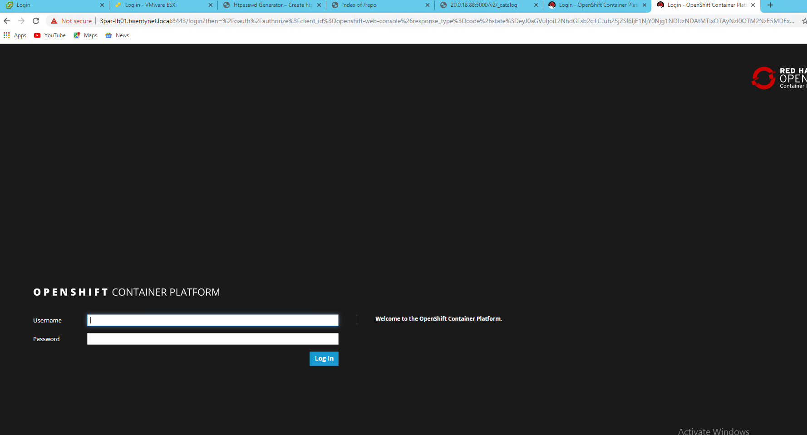

**Figure 66.** OpenShift web console login screen

## Access OpenShift Cluster Console

From the OpenShift Container Platform homepage, select cluster console
from the drop-down menu and provide the credentials from the *htpasswd
file* or LDAP to access the cluster console. Figure 67 below shows the
cluster console window.

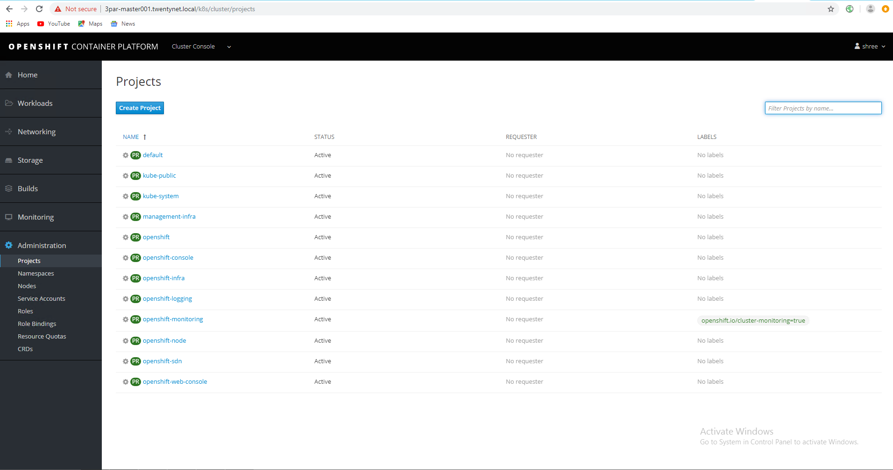

**Figure 67.** OpenShift Container Platform cluster console

**NOTE**

If the cluster console is not available, restart the web console pod
with below command on the master node.

```

# oc -n openshift-web-console delete pod --all

````

## Validating Prometheus cluster monitoring

After successful installation of Prometheus monitoring, log in to
Grafana web console using the route which generates an URL for Grafana,
as shown in Figure 68.

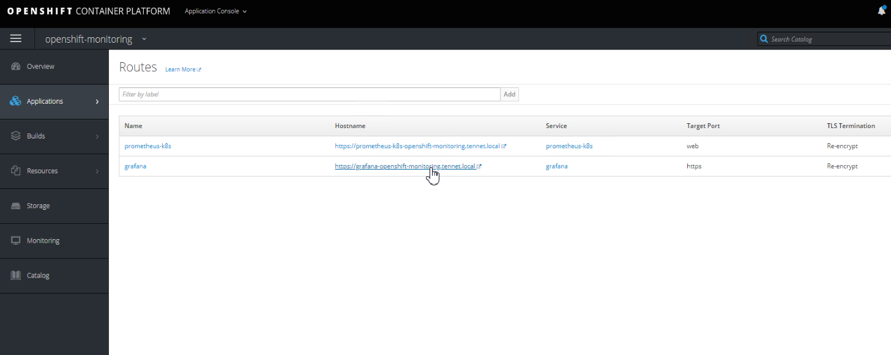

**Figure 68.** Grafana route

Select **Log in with OpenShift** to log in to the console using the
OpenShift admin login credentials created while installing OpenShift.
Figure 69 shows the home dashboard of the OpenShift admin.

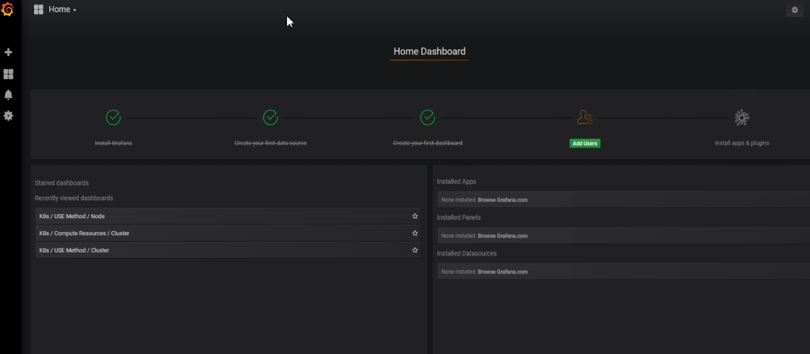

**Figure 69.** Grafana home page

From the left navigation pane, select **Configuration** and then **Data
Sources** as in Figure 70. Verify, if Prometheus data source is
configured.


**Figure 70.** Prometheus data source

## Validating Elasticsearch, Fluentd and Kibana

1) Create a custom dashboard or import a dashboard (.json format) to
view OpenShift statistics.

2) After successful installation of the EFK stack, log in to the Kibana
web console using the Kibana hostname provided in the host file,
accessible at, *https://<kibana hostname>*.

3) Select **Log in with OpenShift** as in Figure 71 to log in to the
console using the OpenShift 'admin' login credentials created while
installing OpenShift.

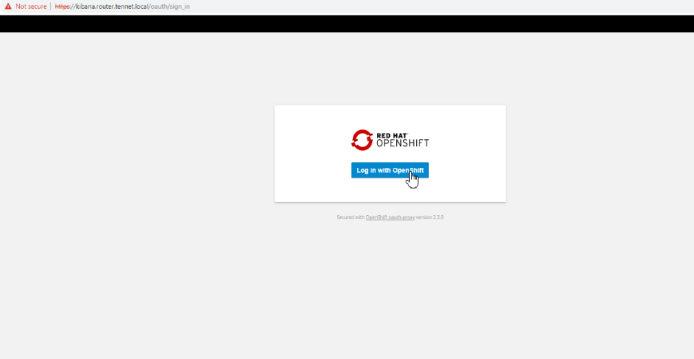

**Figure 71.** Kibana login

4) The OpenShift Container Platform logs are viewable from the Kibana
dashboard as in Figure 72.


**Figure 72.** Kibana dashboard

# Installing Istio service mesh

## Overview

Istio service mesh simplifies the management of a distributed micro
services architecture, controls the flow of traffic and application
program interface (API) calls between services and allows secure service
communications (security). These include authentication, authorization,
rate limiting and a distributed web application firewall for both
ingress and egress.

## Prerequisites

From the Ansible Engine, run the following commands. These will
configure the master, infrastructure, and worker nodes with the
prerequisites required for the installation of Istio service mesh.

```

# cd
/etc/ansible/hpe-solutions-openshift/synergy/scalable/nimble-vsphere

# ansible-playbook playbooks/istio_prereqisites.yml

```

## Installing service mesh

Installing the service mesh involves the following tasks:

1) Installing the operator.

2) Creating and managing a Custom Resource Definition (CRD) file.

### Installing the operators

The Istio service mesh installation process introduces an operator to
manage the installation of the control plane within the istio-operator
namespace. This operator defines and monitors a custom resource related
to the deployment, update, and deletion of the control plane.

Starting with Red Hat OpenShift Service Mesh 0.12.TechPreview, the user
must install the Jaeger Operator and the Kiali Operator before the Red
Hat OpenShift Service Mesh Operator can install the control plane.

#### Installing the Jaeger Operator

As on-the-ground microservice practitioners are quickly realizing, the
majority of operational problems that arise when moving to a distributed
architecture are ultimately grounded in two areas: *networking and
observability*. It is simply an order of magnitude larger problem to
network and debug a set of intertwined distributed services versus a
single monolithic application.

Install the Jaeger Operator for the Red Hat OpenShift Service Mesh
Operator in the master nodes, which will enable the installation of the
control plane. To do this, SSH into the master node and log in to the
OpenShift with the OpenShift user credentials given in the htpasswd or
LDAP. Once login is successful, execute the following commands to
install Jaeger Operator.

```

# create the project for the jaeger operator

# oc new-project observability

# oc create -n observability -f
<https://raw.githubusercontent.com/jaegertracing/jaeger-operator/v1.13.1/deploy/crds/jaegertracing_v1_jaeger_crd.yaml>

# oc create -n observability -f
<https://raw.githubusercontent.com/jaegertracing/jaeger-operator/v1.13.1/deploy/service_account.yaml>

# oc create -n observability -f
<https://raw.githubusercontent.com/jaegertracing/jaeger-operator/v1.13.1/deploy/role.yaml>

# oc create -n observability -f
<https://raw.githubusercontent.com/jaegertracing/jaeger-operator/v1.13.1/deploy/role_binding.yaml>

# oc create -n observability -f
<https://raw.githubusercontent.com/jaegertracing/jaeger-operator/v1.13.1/deploy/operator.yaml>

```

#### Installing the Kiali Operator

Kiali is an observability console for Istio with service mesh
configuration capabilities. It helps you to understand the structure of
your service mesh by inferring the topology and also provides the health
status of your mesh. Kiali provides detailed metrics, and a basic
Grafana integration is available for advanced queries. Distributed
tracing is provided by integrating Jaeger.

The Kiali Operator for the Red Hat OpenShift Service Mesh Operator must
be installed in the master nodes, which allows the installation of
control plane. Execute the following command on the master node to
install the Kiali Operator.

```

# bash <(curl -L https://git.io/getLatestKialiOperator)
--operator-image-version v1.0.0 --operator-watch-namespace '**'
--accessible-namespaces '**' --operator-install-kiali false

```

#### Installing the Red Hat OpenShift Service Mesh Operator

Create new namespaces from the master node by running the following
commands.

```

# oc new-project istio-operator

# oc new-project istio-system

```

Run the following command from the master node to install the Red Hat
OpenShift Service Mesh Operator.

```

# oc apply -n istio-operator -f
<https://raw.githubusercontent.com/Maistra/istio-operator/maistra-0.12/deploy/servicemesh-operator.yaml>

```

### Verify the Istio Operator installation

There are two methods that can be used to validate that the operator
installed correctly. The two methods are:

#### 1) Validation of Istio Operator installation via the command-line

#### 2) Validation of Istio Operator installation through the console

#### Validation of Istio Operator installation via the command-line

Run this command from the master node to verify that the operator is
installed correctly.

```

# oc get pods -n istio-operator

NAME READY STATUS RESTARTS AGE

istio-operator-5cd6bcf645-fvb57 1/1 Running 0 1h

```

#### Validation of Istio Operator installation through the console

Login to OpenShift web console and select **istio-operator** from **My
Projects** section to view the Istio Operator overview. Figure 73 shows
the Istio Operator within the OpenShift web console.


**Figure 73.** Istio Operator viewed from the OpenShift web console

### Creating a custom resource definition

To deploy the service mesh control plane, the user must deploy a custom
resource. A custom resource enables the introduction of custom APIs into
a Kubernetes project or cluster. Create a custom resource yaml file to
define the project parameters and the object. This example custom
resource yaml file contains all of the supported parameters and deploys
Red Hat OpenShift Service Mesh 0.12.TechPreview images based on Red Hat
Enterprise Linux (RHEL).

1) Execute the following command from the master node to change to the
istio-system namespace.

```

# oc project istio-system

```

2) Now using the project "istio-system" on the server
https://<openshift-master FQDN>, create a custom resource definition
file named *istio-installation.yaml*.

3) Execute the following command from the master node to deploy the control
plane.

```

# oc create -f istio-installation.yaml -n istio-system

```

4) Execute the following command from the master node to watch the progress
of the pods during the installation process. Figure 74 shows the status
of istio installation.

```

# oc get pods -n istio-system -a

```

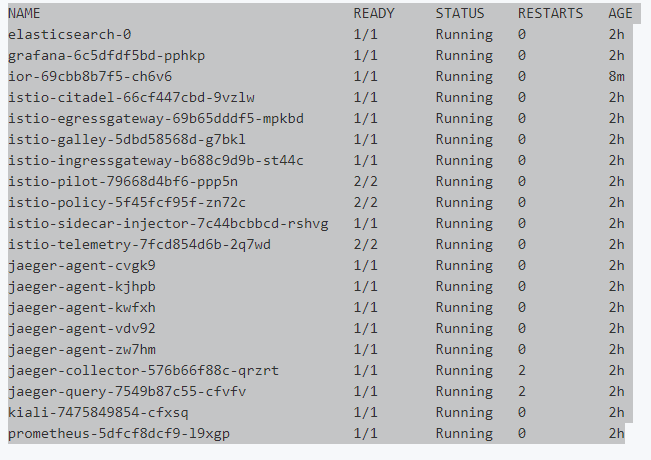

**Figure 74.** Status of Istio installation

5) Log in to the OpenShift web console through the URL
https://<openshift-master FQDN>:8443 to check the pods. Figure 75
shows the Istio pods and their status.


**Figure 75.** OpenShift web console showing Istio pods and their status

## Deploying an application

### Applying the master-config patch

It is necessary to apply the following patch to the master(s) on the
master configuration file */etc/origin/master/master-config.yaml* *to
enable* *MutatingAdmissionWebhook* and *ValidatingAdmissionWebhook*.

The following steps need to be performed in order to apply the patch.

1) Create a directory for Istio as follows.

```

# mkdir <istio directory name>

# cd <istio directory name>

```

2) Execute the following commands from within the Istio directory
created in step 1.

```

# wget
<https://raw.githubusercontent.com/Maistra/openshift-ansible/maistra-0.4/istio/master-config.patch>

```

3) Execute the following command to copy the *master-config.yml* file to
*master-config.yaml.prepatch* which was created during step 2.

```

# cp -p /etc/origin/master/master-config.yaml
/etc/origin/master/master-config.yaml.prepatch

```

4) Execute the following command to apply the patch for services and
copying to *master-config.yaml.*

```

# oc ex config patch /etc/origin/master/master-config.yaml.prepatch -p
"$(cat ./master-config.patch)" >
/etc/origin/master/master-config.yaml

```

**NOTE**

Repeat this on each master node.

5) Execute the following command and verify the patch on the master
node. The master-config file should show the webhooks as shown below.

```

# cat /etc/origin/master/master-config.yaml

admissionConfig:

pluginConfig:

....

....

MutatingAdmissionWebhook:

configuration:

apiVersion: apiserver.config.k8s.io/v1alpha1

kind: WebhookAdmission

kubeConfigFile: /dev/null

ValidatingAdmissionWebhook:

configuration:

apiVersion: apiserver.config.k8s.io/v1alpha1

kind: WebhookAdmission

kubeConfigFile: /dev/null

```

6) Restart the master(s) by executing the following command.

```

# /usr/local/bin/master-restart api

# /usr/local/bin/master-restart controllers

```

### Installing the Bookinfo application

1) Execute the following command from the master node to create a
project named *bookinfo* for the Bookinfo application.

```

# oc new-project bookinfo

```

2) Update the Security Context Constraints (SCC) by adding the service
account used by Bookinfo to the anyuid and privileged SCCs in the
"bookinfo" namespace. Execute following commands in the master node to
update the services.

```

# oc adm policy add-scc-to-user anyuid -z default -n bookinfo

# oc adm policy add-scc-to-user privileged -z default -n bookinfo

```

3) Deploy the Bookinfo application in the "bookinfo" namespace by
applying the *bookinfo.yml* file. Create a file *bookinfo.yml* with the
following content. Execute the following command from the master node to
deploy the bookinfo application.

```

# oc create --f bookinfo.yml

```

4) To validate the installation, log in to the OpenShift web console
with the URL https://<openshift-master FQDN>:8443 as shown in Figure
76.


**Figure 76.** Bookinfo installation status within OpenShift web console

### Create the routes for the Bookinfo application

Create DNS entries in the DNS server with **infrastructure IP address**
for any add-on services utilized in the solution such as Grafana, Kiali,
Prometheus etc. Sample DNS entries are shown in Figure 77.

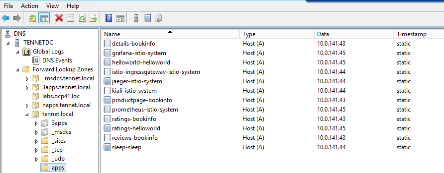

**Figure 77.** Sample DNS entries for the applications

### Services provided by the service mesh

Once the applications are added into the DNS server the application can
be accessed through the OpenShift route. Access services provided by the
service mesh as follows.

Login to OpenShift web console. Select the application present within
*My Project*. To access the routes, click the application URL. Sample
routes for the Bookinfo application are shown in Figure 78.


**Figure 78.** Routes in the Istio-system project

Figure 79 shows accessing the Kiali homepage within the OpenShift
web console.


**Figure 79.** Accessing Kiali homepage within OpenShift web console
using service mesh

Grafana allows the user to query, visualize, send alerts and understand
the metrics no matter where they are stored. Figure 80 shows accessing
the Grafana homepage within the OpenShift web console using service
mesh.

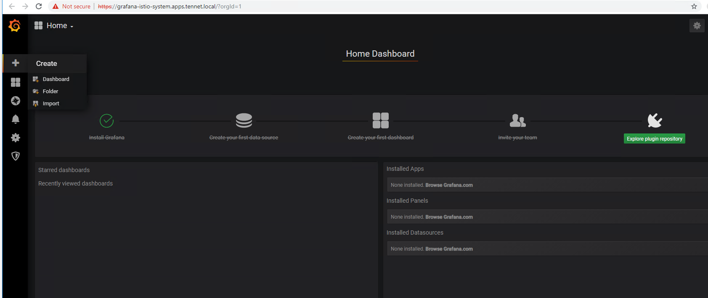

**Figure 80.** Accessing Grafana homepage within OpenShift web console
using service mesh

Figure 81 shows accessing the Prometheus homepage within the
OpenShift web console using service mesh.


**Figure 81.** Accessing Prometheus homepage within OpenShift web
console using service mesh

# Physical worker node labelling in OpenShift

Kubernetes allows worker nodes to be labeled with the capabilities of
the underlying host. This labelling facilitates enhanced scheduling
capabilities. For example, a node with GPU capabilities that is labeled,
is used to schedule GPU dependent applications, while nodes without the
label could be ignored. Hewlett Packard Enterprise has created examples
of how to utilize the HPE proliantutils project to perform node
labelling in an automated fashion.

To label the physical worker nodes use the repository located at the HPE
OpenShift Solutions GitHub at,
<https://github.com/hewlettpackard/hpe-solutions-openshift> . This
repository contains Ansible plays and scripts to automate installation.

## About the repository

-   **playbooks:** This folder contains the playbook required for
    getting the physical worker node properties and label the node with
    those properties in OpenShift Container Platform 3.11.
-   **roles:** This folder contains two roles listed below:

o *"get-phy-worker-props"* - this will get physical worker node
hardware properties.

o *"node-labels-physical-worker"* - this will label the physical
worker node using the discovered hardware properties.

- **hosts:** This is the host file which will be used by the Ansible
Engine to reference hosts during the node labelling process. The
installer should update this file with their OpenShift Container
Platform 3.11 environment details.

-   **site.yaml:** This file imports the playbooks
    "*get-node-properties.yaml*" and "*node labels.yaml*" that
    control the workflow for node labelling. The installer should update
    the *secrets.yml* file with required information about the
    infrastructure.

## Prerequisites

In order to successfully perform physical worker node labelling on the
OpenShift Container Platform nodes, ensure that the following
prerequisites steps have been met.

1) Red Hat OpenShift 3.11 should be up and running.

2) All the nodes in the Red Hat OpenShift Container Platform 3.11
deployment are running RHEL 7.6.

3) There is a common username and password across all the iLOs
associated with physical worker nodes.

4) The Python module named "*ansible*" should be installed on Ansible
Engine using the following command.

```

# pip install ansible

```

5) Check the version of Python module named "*ansible*" using the
following command.

```

# pip freeze | grep ansible

```

6) Output of this command should give the Python module named
"ansible" version.

```

# ansible==2.8.5

```

7) The installer should install the Python module named "
*proliantutils*" on an Ansible Engine using the following command.

```

# pip install proliantutils

```

8) Then check the version of Python module named "*proliantutils*"
using the following command.

```

# pip freeze | grep proliantutils

```

9) Output of this command should give the Python module named "
*proliantutils*" version as follows.

```

# proliantutils==2.9.1

```

## How to use the playbooks

Follow these steps to utilize the playbooks:

1) From the Ansible Engine command prompt, change to the following
directory.

```

# cd
/etc/ansible/hpe-solutions-openshift/synergy/scalable/nimble-vsphere/node-labelling

```

2) Update the file named "hosts", which is the inventory file, with the
required information based on your OpenShift implementation. An example
appears below.

```

# Provide iLO IPs of all the physical worker node that you want to
label within OpenShift 3.11

[phy-workers-iloip]

10.0.x.x

# Provide the fully qualified domain name of all the physical worker
nodes that you want to label

[phy-worker-fqdn]

Offline-worker01.twentynet.local

# Provide the fully qualified domain name of the master node within
your OpenShift 3.11 set-up

[master]

offline-m01.twentynet.local ansible_user=root
ansible_ssh_pass=Password!234

```

3) Update the vault file named *secret.yml* with the required
information based on your OpenShift implementation. Open the "
*secret.yml*" using the following command.

```

ansible-vault edit secret.yml

```

4) As mentioned in the prerequisites, the installer should set a common
username and password for all iLOs on the physical worker nodes that
need to be labeled. Update only the following fields in the
*secret.yml*.

```

# physical worker iLO credentials

ilo_username: username

ilo_password: password

```

5) Run the playbook using the following command.

```

ansible-playbook -i hosts site.yml -e\@secret.yml

```

6) To validate the success of the play, log on to one of the master
nodes using ssh and type the command listed below to get the label of
the physical node.

```

oc get node physicalworker_fully_qualified_domain_name
--show-labels

```

The output of the command should show you the label of the physical
worker node.

```

NAME STATUS ROLES AGE VERSION LABELS

physicalworker_FQDN Ready compute 1d v1.11.0+d4cacc0
beta.kubernetes.io/arch=amd64,beta.kubernetes.io/os=linux,boot_mode_uefi=true,cpu_vt=true,kubernetes.io/hostname=offline-worker01.twentynet.local,node-role.kubernetes.io/compute=true,pci_gpu_devices=1

```

# Backup and recovery of Red Hat OpenShift Container Platform components

## Data protection for Red Hat OpenShift Container Platform

Containers have dramatically increased in popularity as organizations
recognize the benefits with respect to both time and resource
efficiency. This explosive growth of container applications overwhelms
traditional data protection approaches. Applying traditional data
protection strategies to containerized applications will not work.

The goals of this solution with regards to data protection are to:

1) Highlight the importance of protecting each component within an
OpenShift cluster including persistent volumes in order to restore in
case of corruption or system failures.

2) Demonstrate Hewlett Packard Enterprises approach to protect and
restore critical data using HPE Nimble Storage.

For the purpose of this solution, Hewlett Packard Enterprise recommends
the use of an iSCSI volume exported from HPE Nimble Storage to any
server on the network. For demonstration purposes it has been mounted to
a master node. Configuration backups will be copied to this volume. The
volume is protected using an HPE Nimble Storage data protection plan.
Persistent volumes are created using the HPE Nimble Storage data
protection. With the HPE Nimble Storage data protection, a periodic
snapshot can be taken and then replicated to the remote HPE Nimble
Storage Array.

**Note**

The information in this section is taken from
<https://docs.openshift.com/container-platform/3.11/day_two_guide/environment_backup.html>
. The user can check the latest version of the OpenShift documentation
for any updates to this procedure.

## OpenShift Container Platform components

This section disseminates the components that need to be protected or
backed up within a Red Hat OpenShift cluster. Hewlett Packard Enterprise
plans to update this section with new information over time.

A backup should always be taken before any upgrade or modifications are
made to the cluster. It is also recommended to perform periodic backups
to make sure the most recent configuration is available in the event of
a failure. An OpenShift backup involves capturing the current state to
external storage at the cluster level. This means creating individual
backups of the master, worker, and infrastructure node components, etcd
data base and configurations, and persistent storage.

With Red Hat OpenShift Container Platform, all of the components are
treated as objects and are stored in files. This means that creating a
configuration backup is equivalent to taking file level backups.

## Master node

The master node is responsible for maintaining the desired state of a
cluster. It is recommended to perform a master node backup before you
make any modifications to the OpenShift infrastructure. In high
availability environments, make sure to perform the backup on all master
nodes.

## etcd

When you backup etcd, you need to take a backup of the configuration and
data.

etcd configurations are stored in the */etc/etcd* directory, where etcd
instances are running. Unlike other configurations, etcd configurations
are unique across etcd instances. etcd data can be backed up using the
etcd snapshot save command.

## Worker node

The nature of worker nodes is that any specific configuration pertaining
to running pods are replicated over the nodes in case of a failover, and
they typically do not contain data that is necessary to run an
environment. Apart from running pods, worker nodes contain certificates
that are generated during installation, services, authorization files
and more.

## Infrastructure node

OpenShift uses its local registry for storing container images. The
infrastructure node is responsible for hosting the registry and routers.
Registry pods are deployed with a persistent volume from HPE Nimble
Storage. In order to protect the data, it is recommended to take a
snapshot of the volume and protect it by replicating it to a remote HPE
Nimble Storage Array or to an HPE Cloud Volumes using a Nimble Storage
protection plan. Registry certificates must be backed up from all the
infra nodes.

## Persistent storage

Containers were designed to run stateless applications, so in the
beginning there was no need for persistent storage. But as enterprises
started adopting containers and the desire to containerize apps that
where persistent data increased, the need for persistent storage arose.
Backing up and protecting the data that comes from these applications
becomes very important. For persistent volume level backups, traditional
agent-based backup software won't work natively with a container
orchestrator such as Red Hat OpenShift Container Platform. Backup
schemes need to be consumed as a data protection service from the
underlying container-aware storage infrastructure such as HPE Nimble
Storage.

## Backup OpenShift node components

In order to protect the OpenShift components, it is recommended to take
a backup of important configurations to a Nimble volume and replicate to
a remote HPE Nimble Storage Array.

Before initiating a backup of the configuration files, a dedicated
volume should be created to serve as a backup target as explained below:

1) Log in to the *HPE Nimble Storage Administration* web GUI and
navigate to **MANAGE DATA STORAGE** and then click **+** to create the
new volume as shown in Figure 82.


**Figure 82.** Creating a new volume in HPE Nimble Storage

2) Name the volume, select the **PERFORMANCE POLICY** for backup
repository, select the **DATA PROTECTION** plan and give access to the
OpenShift node where to mount the volume as in Figure 83. In this
solution it is mounted on one of the master servers. **It** is
recommended to configure restricted access using a CHAP account.

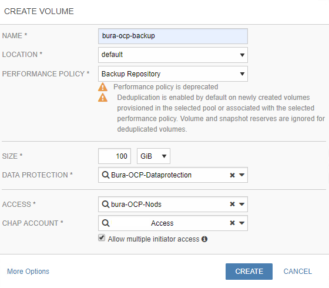

**Figure 83.** HPE Nimble volume creation

3) Discover the newly created volume on the servers using the following
commands.

```

# iscsiadm -m discovery -t sendtargets -p <nimble discover ip>

# iscsiadm -m node -T <target iqn> -p <nimble target ip> --login

```

4) Create a filesystem and mount the filesystem on the master node.

```

# fdisk </dev/mapper/mpathx>

# mkfs.ext4 </dev/mapper/mpathx1>

# mount </dev/mapper/mpathx1> nimble_vol

```

### Master node backup

Run the following commands to create a configuration backup of all the
important files and copy them to the previously created mount point.

```

# MYBACKUPDIR=/backup/$(hostname)/$(date +%Y%m%d)

# mkdir -p ${MYBACKUPDIR}/etc/sysconfig

# cp -r /etc/origin ${MYBACKUPDIR}/etc

# cp -r /etc/sysconfig/ ${MYBACKUPDIR}/etc/sysconfig/

# cp -r /etc/sysconfig/{iptables,docker-*}
${MYBACKUPDIR}/etc/sysconfig/

# cp -r /etc/dnsmasq* /etc/cni ${MYBACKUPDIR}/etc/

# rpm -qa | sort | sudo tee $MYBACKUPDIR/packages.txt

# cp -r /etc/docker/certs.d/
${MYBACKUPDIR}/docker-registry-certs-$(hostname)

# tar -zcvf /backup/$(hostname)-$(date +%Y%m%d).tar.gz $MYBACKUPDIR

```

Copy the tar file to the Nimble volume mount point at the master server
/nimble_vol by running the following command.

```

# scp --aR /backup/$(hostname)-$(date +%Y%m%d).tar.gz
<user>@<master>:/nimble_vol

```

### etcd backup

The etcd backup process is comprised of two different procedures, etcd
configuration backup, including the required etcd configuration and
certificates and etcd data backup.

#### etcd configuration backup

The etcd configuration files to be preserved are stored in the
*/etc/etcd* directory of the instances where etcd is running. This
includes the etcd configuration file *(/etc/etcd/etcd.conf*) and the
required certificates for cluster communication. Backup the
configuration from all etcd members of the cluster using the following
commands.

```

# MYBACKUPDIR=/backup/$(hostname)/$(date +%Y%m%d)

# mkdir -p ${MYBACKUPDIR}/etcd-config-$(date +%Y%m%d)

# cp -R /etc/etcd/ ${MYBACKUPDIR}/etcd-config-$(date +%Y%m%d)

```

#### etcd data backup

1) Before backing up, ensure that the OpenShift Container Platform API
service is running, connectivity with the etcd cluster (port 2379/tcp)
is working and proper certificates to connect to the etcd cluster exist.
To validate the above listed services, run the following commands, using
the etcd API version V3.

```

# etcdctl2 cluster-health

# etcdctl3 member list

# etcdctl3 endpoint health

```

2) Using the etcd v3 API, take a snapshot from a live member with the
etcdctl3 snapshot command.

```

# mkdir -p ${MYBACKUPDIR}/etcd-data-$(date +%Y%m%d)

# etcdctl3 snapshot save <etcd_snapshot1.db>

```

3) Create the backup by copying the etcd db directory using the
following commands.

```

# cp -r /var/lib/etcd/ ${MYBACKUPDIR}/etcd-data-$(date +%Y%m%d)

# tar -zcvf /backup/$(hostname)-$(date +%Y%m%d).tar.gz $MYBACKUPDIR

```

4) Copy the tar file to the HPE Nimble Storage volume mounted at
/nimble_vol.

```

# scp --aR /backup/$(hostname)-$(date +%Y%m%d).tar.gz
<user>@<master>:/nimble_vol

```

### Worker node backup

Create a worker node configuration backup of all the important
configuration files to above created mount point by running the
following commands.

```

# MYBACKUPDIR=/backup/$(hostname)/$(date +%Y%m%d)

# mkdir -p ${MYBACKUPDIR}/etc/sysconfig

# cp -r /etc/origin ${MYBACKUPDIR}/etc

# cp -r /etc/sysconfig/atomic-openshift-node
${MYBACKUPDIR}/etc/sysconfig/

# mkdir -p ${MYBACKUPDIR}/etc/sysconfig

# cp -r /etc/sysconfig/{iptables,docker-*}
${MYBACKUPDIR}/etc/sysconfig/

# cp -r /etc/dnsmasq* /etc/cni ${MYBACKUPDIR}/etc/

# rpm -qa | sort | sudo tee $MYBACKUPDIR/packages.txt

# cp -r /etc/docker/certs.d/
${MYBACKUPDIR}/docker-registry-certs-$(hostname)

# tar -zcvf /backup/$(hostname)-$(date +%Y%m%d).tar.gz $MYBACKUPDIR

```

Copy the tar file to the Nimble volume mounted directory at
/nimble_vol.

```

# scp --aR /backup/$(hostname)-$(date +%Y%m%d).tar.gz
<user>@<master>:/nimble_vol

```

### Infrastructure node backup

OpenShift makes use of the infrastructure nodes to host the registry
pods. Registry pods are assigned to a persistent volume from HPE Nimble
Storage. In order to protect the volume, a storage admin has to
configure a protection plan in HPE Nimble Storage in such a way that it
will trigger a periodic snapshot and then replicate that snapshot to a
remote HPE Nimble Storage.

Apart from the persistent volume, there are certain certificates that
need to be backed up from the infrastructure nodes. In order to create a
backup of these certificates, execute the following commands.

```

# MYBACKUPDIR=/backup/$(hostname)/$(date +%Y%m%d)

# mkdir -p ${MYBACKUPDIR}/etc/docker

# cp -R /etc/docker/certs.d ${MYBACKUPDIR}/etc/docker/certs-$(date
+%Y%m%d)

# tar -zcvf /backup/$(hostname)-$(date +%Y%m%d).tar.gz $MYBACKUPDIR

```

Copy the resulting tar file to the HPE Nimble Storage volume mounted at
/nimble_vol using the following command.

```

# scp --aR /backup/$(hostname)-$(date +%Y%m%d).tar.gz
<user>@<master>:/nimble_vol

```

### Ansible playbook for backup

Run the following commands and execute the Ansible play to take the
master, worker, and infra node backups and move the data to the HPE
Nimble Storage volume. The user needs to edit the inventory variables to
suit the environment.

```

# cd
etc/ansible/hpe-solutions-openshift/synergy/scalable/nimble-vsphere/bura

# ansible-playbook -i hosts site.yaml

```

## Container data backup using HPE Nimble Storage

When the persistent volume (PV) gets created dynamically, it may be
attached to any host in the cluster at any given time with different
mount points. Also, having a backup agent hogging the mount path on the
host will lead to unpredictable behavior and most certainly failed
backups. Backup schemes need to be consumed as a data protection service
from the underlying container aware storage infrastructure. HPE Nimble
Storage provides these data protection service for Red Hat OpenShift by
making use of Docker volume plugin and Kubernetes FlexVolume driver.
This backup will be crash consistent. Consult specific product
documentation for the procedure to take application consistent backup.

### StorageClass

A StorageClass provides a way for administrators to describe the
"classes" of storage they offer. The storageclass provisioner determines
what volume plugin is used for provisioning persistent volumes.
StorageClasses use provisioners that are specific to the storage
platform provider to give Kubernetes access to the physical media being
used.

Storageclasses allow a cluster administrator to define named classes
with certain attributes, such as which provisioner to use, default
persistent volume plugin parameters, protection template, performance
policy, folder and so on.

### Create StorageClass resources

Create a StorageClass with the use of a protection template, performance
policy, and a folder as shown below.

### Protection templates

1) From the *Nimble Management* home page navigate to the **MANAGE** tab
and select **DATA PROTECTION**. Filter by **Protection Template** and
then click **"+"** as in Figure 84.

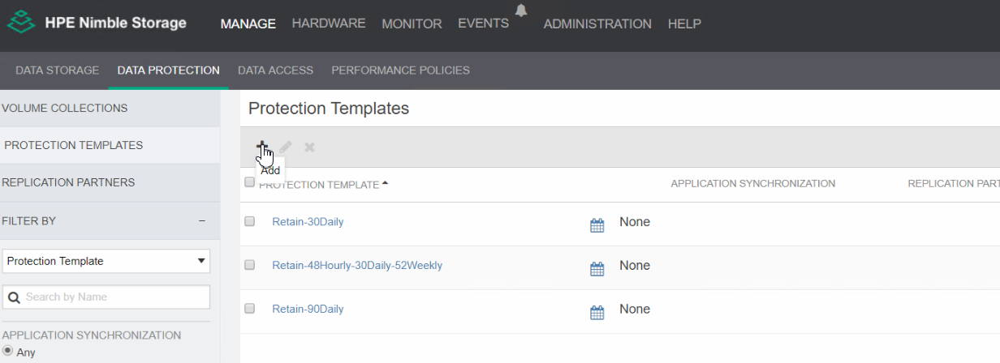

**Figure 84.** Add a protection template

2) Give a name to the protection template and provide the requested
details as in Figure 85.

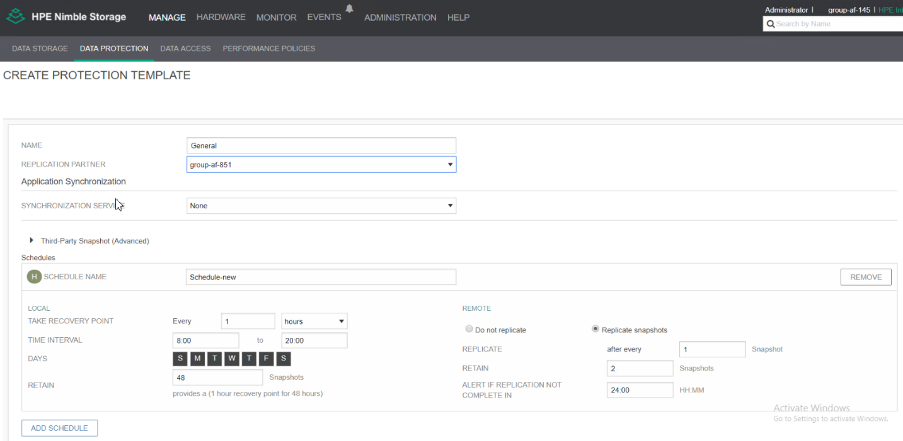

**Figure 85.** Protection template details

3) The newly created protection template will be listed under the
*Protection Template* tab as in Figure 86.

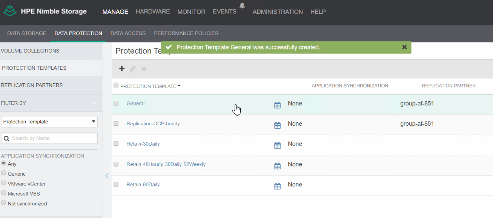

**Figure 86.** A newly created protection template in context

### Performance policies

While *Performance Policies* aren't related to data protection, they are
highly relevant when creating distinguished Storage Classes which is
part of the exercise below. NimbleOS ships a set of pre-defined
performance policies that are refined based on performance data,
gathered on HPE InfoSight and analyzed by Hewlett Packard Enterprise
data scientists. Performance policies provide a set of defaults such as
block size, compression, deduplication, and the type of behavior to
adopt when the volume runs out of space.

Log in to the *HPE Nimble Storage Administration* web GUI and navigate
to *MANAGE, PERFORMANCE POLICIES* and click " **+**" to create a new
performance policy as shown in Figure 87.

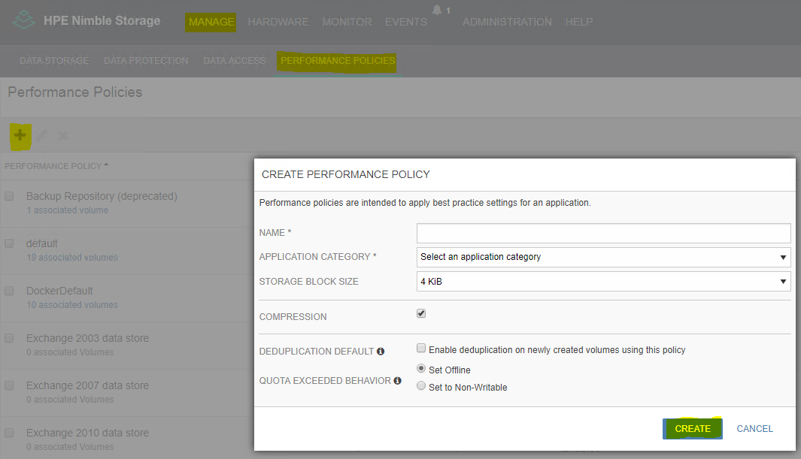

**Figure 87.** HPE Nimble Storage performance policies

### Folders

NimbleOS provides a very simple construct to compartmentalize storage
resources with regard to performance and capacity. Storage
administrators can create a folder and control the parameters that will
be related to the resources. The folder may also be confined to a
certain pool of storage in the Nimble group, such as hybrid flash or
all-flash. The folder will be referenced in the StorageClass to
distinguish the different data types to further help refine the
characteristics needed for the application. Figure 88 shows a view of
the *Folders* screen. When the container requests a
PersistentVolumeClaim (PVC), it will use this Storage Class and create
the storage volume. This enables the protection plan to schedule the
snapshot and replicate the volume to a remote HPE Nimble Storage.

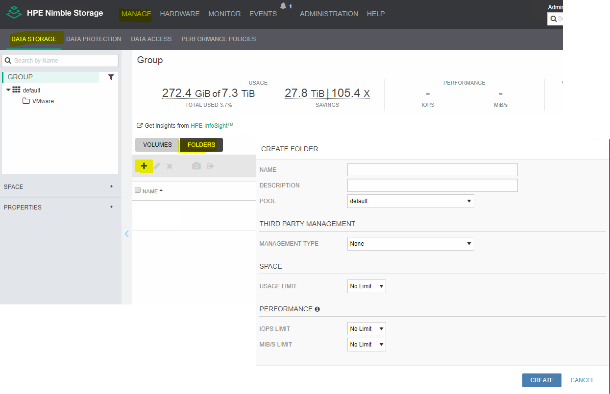

**Figure 88.** HPE Nimble Storage folders

### How to use StorageClasses

StorageClasses are the foundation of dynamic provisioning, allowing
cluster administrators to define abstractions for the underlying storage
platform. Users simply refer to a StorageClass by name in the PVC using
the "StorageClassName" parameter. Following are the examples of
StorageClass and PVC used in testing.

StorageClass example.

```

kind: StorageClass

apiVersion: storage.k8s.io/v1beta1

metadata:

name: general-sc

annotations:

storageclass.beta.kubernetes.io/is-default-class: "true"

provisioner: hpe.com/nimble

parameters:

description: "Volume provisioned from default StorageClass"

fsMode: "0770"

protectionTemplate: General

perfPolicy: General

folder: General

```

The following is an example for PVC.

```

apiVersion: v1

kind: PersistentVolumeClaim

metadata:

name: general-pvc

namespace: backup-plan

spec:

accessModes:

- ReadWriteOnce

resources:

requests:

storage: 100Gi

storageClassName: general-sc

```

The following is an example from the Reference Configuration
environment.

```

# oc get sc

NAME PROVISIONER AGE

general (default) hpe.com/nimble 6d

transactionaldb hpe.com/nimble 6d

# oc describe sc general

Name: general

IsDefaultClass: Yes

Annotations: storageclass.beta.kubernetes.io/is-default-class=true

Provisioner: hpe.com/nimble

Parameters: description=Volume provisioned by HPE Nimble Storage Kube
Storage Controller from default StorageClass,fsMode=0770

AllowVolumeExpansion: <unset>

MountOptions: <none>

ReclaimPolicy: Delete

VolumeBindingMode: Immediate

Events: <none>

# oc get pvc

NAME STATUS VOLUME CAPACITY ACCESS MODES STORAGECLASS AGE

default-claim Bound general-9818c044-7d47-11e9-84f4-566f57580060 32Gi
RWO general 6d

# oc describe pvc default-claim

Name: default-claim

Namespace: default

StorageClass: general

Status: Bound

Volume: general-9818c044-7d47-11e9-84f4-566f57580060

Labels: <none>

Annotations: pv.kubernetes.io/bind-completed=yes

pv.kubernetes.io/bound-by-controller=yes

volume.beta.kubernetes.io/storage-provisioner=hpe.com/nimble

Finalizers: [kubernetes.io/pvc-protection]

Capacity: 32Gi

Access Modes: RWO

Events: <none>

```

## Restore OpenShift components from a backup

Restore means recreating the components from the point in time the
backup is available. It is important to restore the OpenShift Container
Platform (OpenShift) components in case of system failure or corruption
and to ensure the nodes are in a previous working state.

### Master node

When a master host is corrupted or failed due to system error, reinstall
the master host, copy the important configuration files, and then
restart the OpenShift services.

If restoring to a master that is behind a highly available load balancer
pool, restarting OpenShift service may cause downtime. Make sure you
remove the master from the pool, restart the service, and then add it
back to the load balancer pool.

If you are recreating a master after the system failure, apply the
backup, reboot, and then add the master to the cluster.

To restore the master node or files, mount the backup volume from HPE
Nimble Storage to the node and copy the required files to the desired
location and then restart the service. The following steps illustrates
restoring sample files.

```

# mount /dev/mapper/mpathx /nimble_vol

# tar xvjf /nimble_vol/$(hostname)-$(date +%Y%m%d).tar.bz2

# cp /nimble_vol/$(hostname)/$(date
+%Y%m%d)/etc/origin/master/master-config.yaml
/etc/origin/master/master-config.yaml

# systemctl restart atomic-openshift-master-api

# systemctl restart atomic-openshift-master-controllers

```

**NOTE**

Restart the server if the IP tables are replaced.

### etcd

If the etcd configuration is corrupted or lost, restore the file from
backup and restart the service. If the etcd data is corrupted and you
want to restore from the snapshot, this can be performed on a single
etcd node. After that, add the rest of the etcd nodes to the cluster.

#### etcd configuration

If an etcd host has become corrupted and the */etc/etcd/etcd.conf* file
is lost, restore it using the following commands.

```

# cp /nimble_vol/$(hostname)/$(date +%Y%m%d)/etcd-config/etcd.conf
/etc/etcd/etcd.conf

# restorecon -Rv /etc/etcd/etcd.conf

```

#### etcd data

To restore etcd data, do the following:

1) Stop all etcd services by removing the etcd pod definition and
rebooting the host.

```

# mkdir -p /etc/origin/node/pods-stopped

# mv /etc/origin/node/pods/* /etc/origin/node/pods-stopped/

# reboot

```

2) To ensure the proper backup is restored, delete the etcd directories.

```

# mv /var/lib/etcd /var/lib/etcd.old

# mkdir /var/lib/etcd

# restorecon -Rv /var/lib/etcd/

```

3) Restore a healthy backup data file to each of the etcd nodes. Perform
this step on all etcd hosts. For etcd v3 data, use the following
commands.

```

# cp -R /nimble_vol/$(hostname)/$(date +%Y%m%d)/etcd-data/*
/var/lib/etcd/

# mv /var/lib/etcd/db /var/lib/etcd/member/snap/db

# chcon -R --reference /nimble_vol/$(hostname)/$(date
+%Y%m%d)/etcd-data/* /var/lib/etcd/

```

4) Run the etcd service on each host, forcing a new cluster.

```

# mkdir -p /etc/systemd/system/etcd.service.d/

# echo "[Service]" > /etc/systemd/system/etcd.service.d/temp.conf

# echo "ExecStart=" >> /etc/systemd/system/etcd.service.d/temp.conf

# sed -n '/ExecStart/s/"$/ --force-new-cluster"/p'
/usr/lib/systemd/system/etcd.service \\

>> /etc/systemd/system/etcd.service.d/temp.conf

# systemctl daemon-reload

# master-restart etcd

```

5) Check the health status.

```

# etcdctl2 cluster-health

```

6) Restart the etcd service in cluster mode.

```

# rm -f /etc/systemd/system/etcd.service.d/temp.conf

# systemctl daemon-reload

# master-restart etcd

```

7) Check the health status and the member list.

```

# etcdctl2 cluster-health

# etcdctl2 member list

```

### Worker node

When a worker node has become corrupted or has failed due to a system
error, reinstall the worker node the way you did initially, copy the
important configuration files, and then restart the OpenShift services.
If you are recreating a worker node after the system failure, apply the
backup, reboot, and then add the worker to the cluster.

To restore the worker node or only certain files, mount the backup
volume from HPE Nimble Storage to the node and copy the required files
to the desired location and restart the service.

To restore the worker node or any other backed up files, mount the
backup volume from HPE Nimble Storage to the node and copy the required
files to the desired location and restart the service. The following
steps illustrates restoring sample files.

```

# mount /dev/mapper/mpathx /nimble_vol

# tar xvjf /nimble_vol/$(hostname)-$(date +%Y%m%d).tar.bz2

# cp /nimble_vol/$(hostname)/$(date
+%Y%m%d)/etc/origin/node/node-config.yaml
/etc/origin/node/node-config.yaml

# systemctl restart atomic-openshift-node

```

**NOTE**

If restoring a running worker node, restarting services may cause
downtime on that node.

### Restoring a persistent volume

Persistent volumes can be restored from a snapshot or a replicated copy
to a point in time copy using the storage capabilities within HPE Nimble
Storage.

To restore a persistent volume to a point in time, navigate to the HPE
Nimble Storage, data storage GUI and do the following:

1) Select the volume that belongs to the particular persistent volume,
and then navigate to *DATA PROTECTION* tab. Select the point in time
snapshot to restore. Before proceeding with this step, make sure the
replica count is set to zero using the deployment API object in the
OpenShift console.

**NOTE**

This causes downtime for the application.

2) From the OpenShift console, navigate to the project then to
deployment configuration and select the arrow down to scale down the
replica count to 0. Accept the confirmation as in Figure 89.


**Figure 89.** OpenShift console scaling down the replica set to zero

Alternatively, the following command can be run to scale down the
replica set.

```

# kubectl scale --replicas=0 -f deployment.yaml

```

3) Locate the snapshot that will be used as in Figure 90.

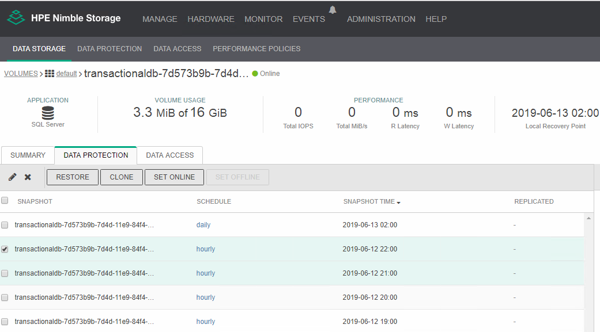

**Figure 90.** HPE Nimble Volume data protection - restore tab

4) Proceed with the restore from the HPE Nimble Storage and raise the
replica count back to 1. This will restore the data.

5) After the volume has been restored, set the replica count back to the
number appropriate for the configuration.

It is possible to clone the snapshot and mount it to a different
deployment and then recover the files from cloned snapshots into the
running containers. The following are the steps to clone the snapshot.

1) Create a separate proxy deployment depending on the use case.

2) Use a clone of the PVC and specify which snapshot to clone the PVC
from and create a PVC.

3) Attach the PVC to the proxy deployment.

4) Copy files out and into containers using cp and rsync.

5) Remove the volume from the proxy deployment and delete it.

For more details about how to clone the snapshot to a different proxy
deployment, refer to
<https://community.hpe.com/t5/HPE-Storage-Tech-Insiders/Data-Protection-for-Containers-Part-II-Restore/ba-p/7019117#.XQiGbIgzY2w>
.

# Red Hat OpenShift Container Platform security

While IT organizations are turning cloud-native to satisfy market needs,
they additionally face many of the following security challenges while
adhering to essential security principles.

- It is challenging to assess the compliance posture of containers and
Kubernetes environments.

- There is a frequent lack of visibility into container infrastructure
and security incidents at runtime.

- There is a lack of ability to inspect a container's activity after it
stops.

- As the number of images in the registry increases, it becomes more
important to quickly identify critical vulnerabilities within images.

- Keeping track of secrets and credentials exposed by an image, among
thousands of images is complex and time consuming.

- Identifying if an image is exposing in any blacklisted ports and it is
important to stop a hacker from gaining entry through a back door.

- Tracking the licenses and their types that are used by an image is
complex.

- Performing a compliance check on each container to identify any
violations is critical.

- Regular health checks must be performed on containers.

To address the container security challenges this document proposes
following two solutions to secure and monitor Red Hat OpenShift
Container Platform. The first solution uses the "kube-bench" utility to
secure and monitor the Red Hat OpenShift Container Platform. For the
second solution, Hewlett Packard Enterprise and Sysdig have collaborated
to secure the solution stack using the Sysdig cloud deployment model for
Sysdig Secure and Sysdig Monitor.

## Automated deployment of the kube-bench utility on the Red Hat OpenShift Container Platform

This section of the document describes how to assess the security
posture of OpenShift using the automated CIS Kubernetes benchmark with
the kube-bench utility. The kube-bench is a *Go application* that checks
whether Kubernetes is deployed securely by running the checks documented
in the [CIS Kubernetes
benchmark](https://www.cisecurity.org/benchmark/kubernetes/) . It helps
to deliver:

- Faster time to production with Red Hat OpenShift Container Platform.
- Increased operational efficiency with HPE Composable Infrastructure.
-   Rapid and automated security checks.
-   Simplified compliance for entire solution.

To install kube-bench, use the repository that was cloned from,
<https://github.com/hewlettpackard/hpe-solutions-openshift> . This repo
contains Ansible plays and scripts to automate the installation and
running of kube-bench.

### Contents of the repo

-   **playbooks:** This folder contains the playbooks required for
    kube-bench installation.
-   **roles:** This folder contains a role called "
    **kube-bench-deploy-ocp**" which is responsible for performing the
    actions required for kube-bench integration.
-   **hosts:** This is the host file which will be used by Ansible
    Engine to reference hosts during kube-bench deployment. Update the
    master nodes, worker nodes, and infrastructure nodes with the
    complete host names in this file.
-   **site.yaml:** This file will import the playbook
    "*kube-bench-deployment.yaml* " which defines the workflow for
    kube-bench integration.

### Prerequisites

The following prerequisites should be met prior to installation:

- Red Hat OpenShift Container Platform 3.11 is up and running.

- All the nodes in the Red Hat OpenShift Container Platform 3.11
deployment should have Red Hat Enterprise Linux 7.6 deployed.

- The user has access to the internet to clone the public GitHub
repositories for kube-bench and golang on each node of the OpenShift
Container Platform.

### Custom attributes/variable files and plays

Each playbook has a role associated with it. Each role has a set of
tasks under the "task" folder. This file contains the automated steps
for golang, kube-bench, running kube-bench and storing results back to
the Ansible Engine node.

```
security-kube-bench/roles/kube-bench-deploy-ocp/tasks/main.yml
```

### Using the playbooks

1) Edit the hosts file to suit the environment. In the hosts file
provide the IP or Fully Qualified Domain Name of the master,
infrastructure, and worker nodes. An example is shown in Figure 91.

```

# cd etc/ansible/hpe-solutions-openshift/synergy/scalable/
nimble-vsphere/security-kube-bench

# vi hosts

```

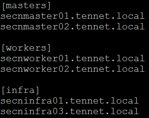

**Figure 91.** Shows the hosts file entries

2) Once the host file is edited, run the play using the following
command.

```

# ansible-playbook -i hosts site.yml

```

3) Once the playbook has completed, browse the *"/tmp/"* directory on
the Ansible Engine and ensure that all of the log files generated from
each of the masters, workers, and infrastructure nodes specified in the
hosts file are available in the directory. Figure 92 shows an example
directory listing.

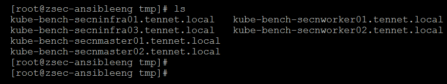

**Figure 92.** Log files on the Ansible Engine

##### Output

Depending on the number of nodes specified by the user in the hosts
file, the same number of log files should be generated. Each log file
lists the details of the CIS benchmark rules against which each of
master, infrastructure, and worker node is tested. View the log files
using the following command.

```

#vi /tmp/<filename>

```

Figure 93 shows the log file for one of the master nodes.


**Figure 93.** Log files for a master node

For each of the failed tests, a set of remediation steps are described
in the logs as in Figure 94.

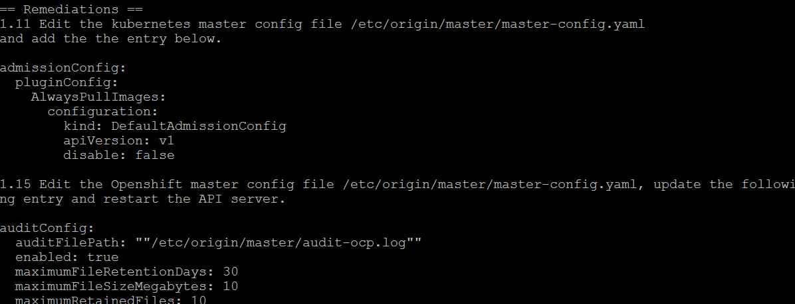

**Figure 94.** Remediation steps

The end of the log file shows a summary of results as shown in Figure
95.

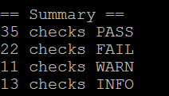

**Figure 95.** Summary of the results

## Automated deployment of the Sysdig agent on the Red Hat OpenShift Container Platform

This section describes how to install Sysdig agents in an automated way
within the context of the solution. Sysdig agents can be installed on a
wide array of Linux hosts. The assumption here is that a user will run
the Sysdig agent as a pod which then enables the Sysdig agent to
automatically detect and monitor Red Hat OpenShift Container Platform.

Hewlett Packard Enterprise used the Sysdig DaemonSet to deploy the
Sysdig agents on all of the nodes in the cluster. A DaemonSet ensures
that all OpenShift nodes run a copy of a pod. As nodes are added to the
cluster, pods are added to the newly introduced nodes. As nodes are
removed from the cluster, those pods are in turn garbage collected.
Deleting a DaemonSet will clean up the pods it created. This DaemonSet
internally runs three kinds of daemons on every node:

-   Cluster storage daemon
-   Logs collection daemon
-   Monitoring daemon

Once these daemons are deployed on OpenShift nodes, the Sysdig Monitor
automatically begins monitoring all of the hosts, applications, pods,
and services and automatically connects to the OpenShift API server to
pull relevant metadata about the environment. If licensed, Sysdig Secure
launches with default policies that a user can view and configure to
suit their needs.

To install Sysdig agents on the Red Hat OpenShift Container Platform
nodes, use the

repository located at the HPE OpenShift Solutions GitHub at,

<https://github.com/hewlettpackard/hpe-solutions-openshift> . This
repository contains

Ansible plays and scripts to automate installation.

### Contents of the repo

-   **Playbooks:** This folder contains the playbooks required for
    Sysdig agent installation.
-   **Roles:** This folder contains a role called
    "sysdig-agent-deploy-ocp" which is responsible for performing the
    actions required for Sysdig agent integration.
-   **Hosts:** This is the host file which will be used by the Ansible
    Engine to reference hosts during Sysdig agent deployment. Provide
    the OpenShift Container Platform master node complete host name in
    this file.
-   **site.yaml:** In this file, the playbook
    "*sysdig-agent-deployment.yaml*" is imported. This file defines
    the entire workflow for Sysdig integration.

### Prerequisites

In order to successfully deploy Sysdig agents on the OpenShift Container
Platform

nodes, refer to the following prerequisites:

- Red Hat OpenShift Container Platform 3.11 is up and running.

- Worker nodes in the Red Hat OpenShift Container Platform deployment
can be virtual or physical running RHEL 7.6.

- The installation user has SaaS based access to Sysdig Secure and
Sysdig Monitor for the purpose of container security.

- The installation user has admin rights and privileges for Sysdig
Secure and Sysdig Monitor.

- Sysdig agents with version 0.90.3 are deployed on Red Hat OpenShift
Container Platform.

- The user has a valid access token that is given by Sysdig and is
specific to their credentials on Sysdig Monitor and Sysdig Secure.

- The installation user has updated the kernel to make sure all RHEL
nodes are running the same kernel version. Run the following command to
install kernel headers on master, infrastructure, and worker nodes.

```

*yum -y install kernel-devel-$(uname -r)*

```

### Custom attributes/variable files and plays

Each playbook has a role associated with it. Each role has a set of
tasks under the *"task"* folder and variables under the *"var*"
folder. These variable values need to be defined by the user according
to the user's environment before running the plays. Alter the following
files:

-   *sysdig-agent-deploy-ocp/vars/main.yml:* This file will be used
    during Sysdig agent deployment to OpenShift and contains Sysdig
    related variables.
-   *sysdig-agent-deploy-ocp/tasks/main.yml:* This file contains the
    actual Sysdig agent installation steps.
-   *sysdig-agent-deploy-ocp/files/sysdig-agent-configmap.yaml* : This
    file is provided by Sysdig and handles the Sysdig software related
    configurations.
-   *sysdig-agent-deploy-ocp/files/sysdig-agent-daemonset-redhat-openshift.yaml*
    : This file is provided by Sysdig and handles the Sysdig daemon
    related configurations.

### How to use playbooks

This section describes the steps that need to be performed to use the
playbooks. Once the required repository is cloned to the Ansible Engine
host, navigate to following path on the cloned directory.

```

# cd
/etc/ansible/hpe-solutions-openshift/synergy/scalable/nimble-vsphere/

security-sysdig

```

Update the variables in the following files:

1) hosts

a. Provide the master node (only 1 master node is required) fully
qualified domain name (FQDN) or IP address under [master]. All the
Sysdig specific files will be copied to this master node.

b. Edit the file *roles/sysdig-agent-deploy-ocp/vars/main.yml*.

c. Provide a value for the project name for Sysdig integration with
OpenShift under the "*projectname*" variable.

d. Provide the Sysdig access *key/token* value. This value is retrieved
from the user setting by logging into either Sysdig Secure or Sysdig
Monitor GUI and is found in the "*accesskeyval*" variable.

2) Edit the
file*roles/sysdig-agent-deploy-ocp/files/sysdig-agent-configmap.yaml*

a. Enter "OpenShift" as the cluster type.

b. Enter the Sysdig collector address and port. Check with the Sysdig
team to know which collector is accessible in your environment and over
which port.

c. It is recommended to access Sysdig collector over Secure Socket Layer
(SSL). For both the keys "ssl" and "ssl certificate validate" set the
value as "true".

d. Set the variable related to the underlying Kubernetes deployment that
is OpenShift in this solution to true.

e. Enter the cluster name of the OpenShift cluster.

3) Run the play using following command.

```

# ansible-playbook -i hosts site.yml

```

4) To verify the deployment, log in to the master node that is mentioned
in the hosts file and type the following command.

```

# oc get pods

```

This command will output all the Sysdig agent names running on each of
the nodes within your OpenShift cluster as shown in Figure 96. If you
see a pod with a pending status, then there might be a possibility that
the underlying OpenShift node is not functional.

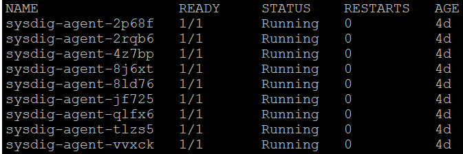


**Figure 96.** Sysdig agents running on OpenShift nodes

5) Check the number of nodes that are currently up and running in the
OpenShift Container Platform deployment using the command "oc get nodes"
as shown in Figure 97.


**Figure 97.** OpenShift nodes information

6) From the Sysdig Secure web interface, click on the icon named
***POLICY EVENTS*** and you will see the web interface for the *Policy
Events* tab. On the *Policy Events* tab, click the ***Groupings*** ****
drop-down list and select ***Entire Infrastructure***. The user with
administrative privileges should be able to see all of the OpenShift
nodes as in Figure 98.

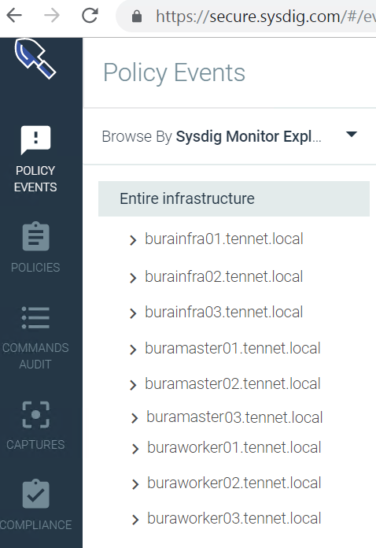

**Figure 98.** OpenShift cluster in Sysdig Secure

7) From the Sysdig Monitor web interface, click on the icon named
**EXPLORE** and you will see the web interface for the **Explore** tab.
On the Explore tab, click the **Data Source** (two rectangles) drop-down
menu and select the data source named **Sysdig** **Agents** from the
drop-down list. Then open the **Groupings** drop-down list and select
**Clusters and Nodes**. The user with administrative privileges should
be able to see all of the OpenShift nodes as in Figure 99.

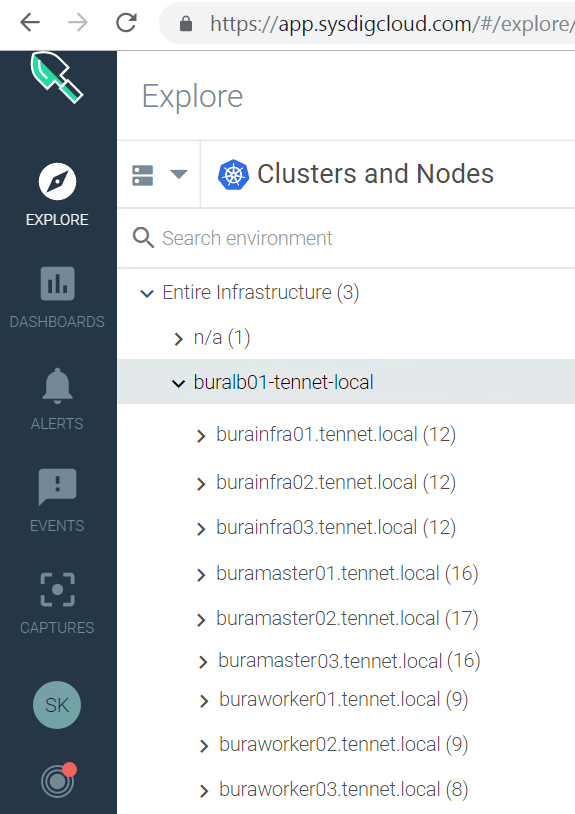

**Figure 99.** OpenShift cluster in Sysdig Monitor

**NOTE**

For an explanation of host requirements for Agent Installation, refer to
<https://sysdigdocs.atlassian.net/wiki/spaces/Platform/pages/192151570/Host+Requirements+for+Agent+Installation>
.

**NOTE**

It is recommended to use port 6443 for transferring and receiving data
over Secure Sockets Layer / Transport Layer Security (SSL/TLS) protocol.
Sysdig agents transfer data to Sysdig Cloud over HTTPS that encrypts and
decrypts the requests as well as the responses that are returned by the
Sysdig Cloud.

**NOTE**

The OpenShift cluster name can be found by using the command *"oc config
view"* from any master node.

8) From the Sysdig Monitor web interface, click on the icon
named**EXPLORE**. On the *Explore* tab, click the **Data Source** (two
rectangles) drop-down menu and select the data source named **Sysdig
Agents** from the drop-down list. Open the**Groupings** drop-down list
and select **Deployment and Pods**. A user with administrative
privileges should be able to see all the agents and their details as
shown in Figure 100.

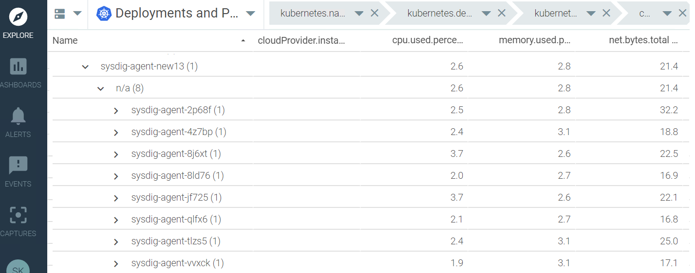

**Figure 100.** Sysdig agents running on the OpenShift cluster

# Utilizing Ansinimble

This section provides a high-level overview of utilizing Ansinimble.
Detailed examples and documentation about Ansinimble are available at,
<https://github.com/NimbleStorage/ansinimble> .

## Prerequisites

1) Make sure your Ansible server has Python 3 installed and the Ansible
Engine running is using Python 3. If this is not the case, refer to the
document from Red Hat on installing Python 3 at,
<https://developers.redhat.com/blog/2018/08/13/install-python3-rhel/> .

2) To check the Python version used by Ansible Engine, run the following
command.

```

# ansible --version |grep 'python version'

# python version = 3.6.3 (default, Jan 9 2018, 10:19:07) [GCC 4.8.5
20150623 (Red Hat 4.8.5-11)]

```

JMESPath path needs to be installed on the Ansible host. Refer to
<http://jmespath.org/> for more information.

3) All target hosts (worker nodes) should be added to the known_hosts
file.

## Tasks

### Download the Ansinimble role

Run the following command on the Ansible Engine host to download the
Ansinimble role.

```

# ansible-galaxy install NimbleStorage.Ansinimble

```

This role is deployed to the location
*/root/.ansible/roles/NimbleStorage.Ansinimble*.

### Create an inventory file

Run the following command on the Ansible Engine host to create an
inventory file.

```

# cd /root/.ansible/roles/NimbleStorage.Ansinimble

# touch hosts

```

The following example host file consists of the worker nodes which will
be connected to the Nimble Arrays as well as the Ansible Engine host
defined under *ansible_host*.

```

#[ansible_host]

localhost anisble_ssh_user=root ansible_ssh_pass=<Your password>
*

#[worker nodes]

nworker01.tennet.local anisble_ssh_user=root ansible_ssh_pass=<Your
password> *

nworker02.tennet.local anisble_ssh_user=root ansible_ssh_pass=<Your
password> *

nworker03.tennet.local anisble_ssh_user=root ansible_ssh_pass=<Your
password> *

```

### Edit the variable file

*defaults/main.yml* is the variable file for the entire Ansinimble role.
The user should update the file to meet the needs of the environment.

## Array setup

1) Download the Nimble Windows Toolkit (NLT) from HPE InfoSight and
install it on the installers laptop or another device connected to the
management network where the array resides.

2) With the laptop connected to the same switch as the Nimble Array, use
the tool to discover the array.

3) Record the serial number for the array.

4) The Ansible playbook for Nimble Array setup uses variables defined in
default/main.yml under the section 'nimble_array_config:'. Copy this
file outside of the role structure and create a new variable file for
your project with what you need.

5) Run the following command to configure the array from an initial
state over the network.

```

# ansible-playbook --i hosts -e nimble_array_serial=<Nimble Array
Serial Number> sample_array_setup.yml

```

This play needs to be run against both arrays in a redundant
configuration. In such a scenario, the nimble_array_config value for
both arrays should be edited.

## Install NLT on the target hosts and configure the group

Target hosts (worker nodes) should have the Nimble Linux Tool (NLT) kit
installed and configured against the upstream array.

1) Download the NLT from <https://infosight.hpe.com> and copy it to the
/tmp directory on the Ansible Engine host.

2) Make the following changes to the default/main.yml file if NLT needs
to be installed.

```

nimble_group_options:

ip-address: 10.0.2.95

username: admin

# Store the password with Ansible Vault.

nimble_group_password: admin

```

3) Run the following command to install NLT on the master, infra, and
worker nodes.

```

# ansible-playbook --I hosts -e
nimble_linux_toolkit_bundle=/tmp/nlt_user_2.4.1.13 -e
nimble_linux_toolkit_protocol=iscsi sample_install.yml

```

# Disconnected installation of Red Hat OpenShift Container Platform

## Overview

This document describes the steps required to create Red Hat OpenShift
Container Platform environment running on HPE Synergy and HPE Nimble
Storage in a disconnected fashion. It is intended to be used in
conjunction with files and Ansible playbooks found at,
[https://github.com/hewlettpackard/hpe-solutions-
openshift/tree/master/synergy/scalable/nimble-vsphere/disconnected](https://github.com/hewlettpackard/hpe-solutions-%20openshift/tree/master/synergy/scalable/nimble-vsphere/disconnected)
.

Some data center may not have access to the Internet, even via proxy
servers due to security reasons. Installing Red Hat OpenShift Container
Platform in these environments is considered as disconnected
installation. In these air gapped environments, OpenShift Container
Platform software channels and Red Hat's Docker registry and
repositories are not available via Red Hat's content distribution
network. The user will download required software repositories, packages
when the user is connected to user's Red Hat account and will disconnect
once this task is done. The user will utilize these repositories &
packages whenever they are required. The user creates customized
registry for maintaining a local registry based on web server
repositories and packages. A disconnected installation ensures the
OpenShift Container Platform software is made available to the relevant
servers, then follows the same installation process as a standard
connected installation.

Figure 101 presents a high-level flow diagram for configuring Red Hat
OpenShift Container Platform in a disconnected fashion.


**Figure 101.** Overview of the disconnected OpenShift installation

## Prerequisites

1) vSphere 6.7 host with appropriate network and storage configurations
within the deployment environment.

2) Red Hat Enterprise Linux 7.6.

**NOTE**

A repository server which can host Ansible Engine and web server needs
to be configured. The following section describes how to create these
resources.

## Configure a custom Ansible Engine with web server

### Overview

An Ansible Engine is provisioned to enable the users to run the Ansible
playbooks to provision and manage their application and infrastructure.

A web server should be configured to act as a repository server that can
connect to the internet in order to download and sync all of the
required packages/images for a disconnected installation.

Both the Ansible Engine and web server are created on a single VM to
reduce the cost and complexity.

The high-level steps involved in configuring the Ansible Engine/web
server are described below:

1) Create a VM and install RHEL 7.6.

2) Install RHEL 7.6 on the VM.

3) Configure Ansible Engine.

4) Install Python and RHEL.

5) Clone required repositories.

6) Configure the web server.

7) Validate web server creation.

#### Create a VM and install RHEL 7.6

The installer must create the Ansible Engine VM with the following
settings.

-  RHEL 7.6
-  4 vCPU
-  16GB RAM
-  1x 250GB HDD
-  1x network interface connected to the management network
-   While installing RHEL, the **/** partition must be increased to
    150GB.

#### Configure Ansible Engine

Log in to the Ansible Engine and perform the following steps:

1) Register the server with the Red Hat customer portal using the
following command.

```
# subscription-manager register --username=**<red hat subscription
username>** --password= **<red hat subscription password>**
--auto-attach
```

2) Pull the latest subscription data from the Red Hat subscription
manager using the following command.

```

*#* subscription-manager refresh

```

3) Find an available subscription pool for virtual systems running RHEL
that provides the OpenShift Container Platform channels using the
following command.

```

# subscription-manager list --available --matches '*OpenShift*'

```

4) Attach a pool ID for a subscription that provides OpenShift Container
Platform entitlement.

```

*# subscription-manager attach --pool=<pool_id>*

```

5) Disable all the repositories using the following command.

```

# subscription-manager repos --disable="*"

```

6) Enable rhel-7-server-extras-rpms using the following command.

```

# subscription-manager repos --enable rhel-7-server-extras-rpms

```

**NOTE**

This solution is deployed with **Python 3.6.x** along with **Ansible
2.7.2**.

#### Install Python and Ansible

The following steps should be taken to assist in the installation of
appropriate Python and Ansible versions.

1) Install Python 3.6.x using the following command.

```

# yum -y install rh-python36

```

2) Enable the Python 3.6.x environment using the following command.

```

# scl enable rh-python36 bash

```

3) Create a new virtual environment for deploying this solution.

```

# python3 -m venv *<virtual environment name>*

```

4) Activate the virtual environment.

```

# source **<virtual environment name>/bin/activate**

```

5) Install Ansible 2.7.2 with the following command.

```

# python3 -m pip install ansible==2.7.2

```

#### Clone required repositories

This solution utilizes multiple Python and Ansible repositories. This
section lists the steps to download and install them.

1) Execute the following commands on the Ansible Engine to download the
repositories.

```

# cd /etc/ansible

# git clone --b 3.11
https://github.com/HewlettPackard/hpe-solutions-openshift.git

```

2) oneview-ansible is the Ansible module for HPE OneView which utilizes
the Python SDK to enable infrastructure as a code.

a) Clone the repository found at,
<https://github.com/HewlettPackard/oneview-ansible/> .

b) Navigate to the directory oneview-ansible on the Ansible Engine and
execute the following command.

```

# cd <path to oneview-ansible>

# pip install --r requirements.txt

```

c) Export the path of *oneview-ansible/library* and
*oneview-ansible/library/module_utils* to the environment variables
ANSIBLE_LIBRARY and ANSIBLE_MODULE_UTILS using the following
commands.

```

# export ANSIBLE_LIBRARY=<absolute path to /oneview-ansible/library>

# export ANSIBLE_MODULE_UTILS=<absolute path to
/oneview-ansible/library/module_utils>

```

3) PyVmomi is the Python SDK for the VMware vSphere API that allows
managing ESX, ESXi, and vCenter. Execute the following command in the
Ansible Engine.

```

# pip install pyVmomi

```

#### Configure the web server

The web server creation process is automated using the playbook
*"webserver_creation.yml"* found at
*/etc/ansible/hpe-solutions-openshift/synergy/scalable/nimble-vsphere/disconnected*
. The playbook accomplishes the following:

1) Enables the following rpms for the webserver:

a) rhel-7-server-rpms

b) rhel-7-server-extras-rpms

c) rhel-7-server-ansible-2.6-rpms

d) rhel-7-server-ose-3.11-rpms

e) rhel-7-fast-datapath-rpms

2) Installs the following required packages for the webserver:

a) yum-utils

b) createrepo

c) docker

d) git

e) httpd

3) Creates repos for each of the above rpms.

4) Moves all repos to the root directory of the webserver and update the
directory permissions.

5) Applies SELinux policies on the repos directory.

6) Enables and reloads firewall services.

7) Enables and starts the httpd service.

8) Unregisters the host when done.

##### Run the play to create the web server

1. Update the host file and vault file *vault_pass.*yml at /
*etc/ansible/hpe-solutions-openshift/synergy/scalable/nimble-vsphere/disconnected*
. Refer to the sample host file below as a reference.

```

Hosts file

[webserver]

Ansible_engine.tennet.local

```

2. Ensure that the known host file has the entry to the web server to
avoid the prompt for SSH Password while the playbooks are running.
Optionally run the following command to add the web server to known host
file.

```

# ssh-copy-ip root@<webserver_fqdn>

```

3. In the vault file, uncomment the *ansible_ssh_user* and
*ansible_ssh_pass* values before executing the playbooks.

4. Once the host file and the variable files are updated with the
appropriate values, execute the following command from the Ansible
Engine to create a webserver within the Ansible Engine.

```

# cd
etc/ansible/hpe-solutions-openshift/synergy/scalable/nimble-vsphere/disconnected

# ansible-playbook -i hosts playbooks/webserver_creation.yml
--ask-vault-pass [--e\@vault_pass.yml](mailto:–e@vault_pass.yml)

```

**NOTE**

The playbook *webserver_creation.yml* takes around **3+ hours** to
complete the execution and creating the web server.

#### Validate Web Server creation

Navigate to the URL https://<<webserver_ip>>/repo to view the repos
hosted on the web server as in Figure 102.

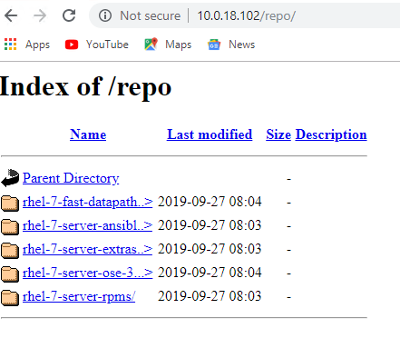

**Figure 102.** Webserver contents

## Provision management and worker nodes for the Red Hat OpenShift deployment

For provisioning the management and worker nodes, refer these sections
listed under online deployment - [Compute Module
configuration](#_Compute_Module_configuration), [Red Hat OpenShift
Container Platform management functions](#_Red_Hat_OpenShift) and
[Deploying worker nodes](#_Deploying_worker_nodes). Once the management
and worker nodes are successfully provisioned, begin with the [Registry
Server](#_Registry_Server)

## Registry server

The purpose of the registry server in case of disconnected environment
is to provide the catalog of images for installing OpenShift Container
Platform.

### Creation of a registry server

The high-level steps involved to configure a registry server are
described below:

1) Create a VM to act as a registry server.

2) Install RHEL 7.6 on the VM.

3) Download the required repositories.

4) Configure the registry server.

The installer must create a VM with the following configurations for the
registry server:

a) 2 vCPU, 16GB memory,

b) 150GB hard disk

c) Network adapter with the data center network.

d) Operating System: Red Hat Enterprise Linux 7.6

## Download repositories

Download the repositories from web server to management nodes (master,
load balancer, and infra), virtual worker nodes, Ansible Engine &
registry server.

The playbook *enabling_repos.yml* found at /
*etc/ansible/hpe-solutions-openshift/synergy/scalable/nimble-vsphere/playbooks*
, download all required repositories into all these virtual machines.

1) Update the following YAML files with relevant values as per the setup
details.

a) ose.repo

b) vault_pass.yml

c) Download_packages.yml

2) A sample entry provided below can be referred to in order to make
necessary updates. In the *ose.repo* file, the web server IP address
should be updated as shown in the highlighted section below.

```

**ose.repo** :

[rhel-7-server-rpms]

name=rhel-7-server-rpms

baseurl=http://<**webserver_ipaddress>/** repo/rhel-7-server-rpms

enabled=1

gpgcheck=0

[rhel-7-server-extras-rpms]

name=rhel-7-server-extras-rpms

baseurl=http://<**webserver_ipaddress>**
/repo/rhel-7-server-extras-rpms

enabled=1

gpgcheck=0

[rhel-7-server-ansible-2.6-rpms]

name=rhel-7-server-ansible-2.6-rpms

baseurl=http://<**webserver_ipaddress>**
/repo/rhel-7-server-ansible-2.6-rpms

enabled=1

gpgcheck=0

[rhel-7-server-ose-3.11-rpms]

name=rhel-7-server-ose-3.11-rpms

baseurl=http://<**webserver_ipaddress>**
repo/rhel-7-server-ose-3.11-rpms

enabled=1

gpgcheck=0

[rhel-7-fast-datapath-rpms]

name=rhel-7-fast-datapath-rpms

baseurl=http://<**webserver_ipaddress>**
/repo/rhel-7-fast-datapath-rpms

enabled=1

gpgcheck=0

```

3) In the *download_packages* YAML file**,** update the value for the
field **src** as highlighted below.

```

- hosts:

- webserver

- virtual-nodes

- registry

```

4) Update the value for the variable *src* in the following task.

```

- name: copy ose.repo file into remote location

copy:

src: <absolute path_to_/ose.repo>

dest: /etc/yum.repos.d/

```

5) Run the following command from the Ansible Engine, after updating the
variable and task files.

```

# cd
/etc/ansible/hpe-solutions-openshift/synergy/scalable/nimble-vsphere/

# ansible-playbook --i hosts playbooks/Download_packages.yml
--ask-vault-pass [--e\@vault_pass.yml](mailto:–e@vault_pass.yml)

```

## Configure the registry server

A number of images need to be pulled into the custom registry server in
order to support the Red Hat OpenShift Container Platform installation
in a disconnected environment. This section describes the high-level
steps that needs to be performed in order to get the images required for
the disconnected installation. These include:

1) Install and configure Docker service.

2) Pull the required images into the registry server.

3) Tag images with the registry server.

4) Create a customized registry.

5) Push tagged images into the customized registry.

6) Validate the functionality of the registry server.

### Install and configure Docker service

The Docker service is essential to the functionality of the registry
server. After the repositories are downloaded from the web server into
the OpenShift roles, follow the following steps to install and start the
Docker service:

1) SSH into the registry server.

2) Execute the following command to install Docker service.

```

# yum --y install docker

```

3) Start the Docker service using the following command.

```

# systemctl start docker

```

**NOTE**

It is recommended to pull the latest *3.11.<sub-vers>* images from Red
Hat. Replace **<sub-vers>** with the latest minor-version before
executing the command.

To check the latest minor-version, execute the following command in the
Ansible Engine

```

# rpm -q openshift-ansible

```

### Pull the required images into the registry server

The images will be pulled from repositories which are downloaded to the
webserver. The following commands should be executed on registry server.

1) Pull the OpenShift Infrastructure related images.

```

# for image in
{apb-base:v3.11.<sub-vers>,apb-tools:v3.11.<sub-vers>,automation-broker-apb:v3.11.<sub-vers>,csi-attacher:v3.11.<sub-vers>,csi-driver-registrar:v3.11.<sub-vers>,csi-livenessprobe:v3.11.<sub-vers>,csi-provisioner:v3.11.<sub-vers>,grafana:v3.11.<sub-vers>,image-inspector:v3.11.<sub-vers>,mariadb-apb:v3.11.<sub-vers>,mediawiki:v3.11.<sub-vers>,mediawiki-apb:v3.11.<sub-vers>,mysql-apb:v3.11.<sub-vers>,ose-ansible:v3.11.<sub-vers>,ose-ansible-service-broker:v3.11.<sub-vers>,ose-cli:v3.11.<sub-vers>,ose-cluster-autoscaler:v3.11.<sub-vers>,ose-cluster-capacity:v3.11.<sub-vers>,ose-cluster-monitoring-operator:v3.11.<sub-vers>,ose-console:v3.11.<sub-vers>,ose-configmap-reloader:v3.11.<sub-vers>,ose-control-plane:v3.11.<sub-vers>,
ose-control-plane:v3.11,ose-deployer:v3.11.<sub-vers>,ose-descheduler:v3.11.<sub-vers>,ose-docker-builder:v3.11.<sub-vers>,ose-docker-registry:v3.11.<sub-vers>,ose-efs-provisioner:v3.11.<sub-vers>,ose-egress-dns-proxy:v3.11.<sub-vers>,ose-egress-http-proxy:v3.11.<sub-vers>,ose-egress-router:v3.11.<sub-vers>,ose-haproxy-router:v3.11.<sub-vers>,ose-hyperkube:v3.11.<sub-vers>,ose-hypershift:v3.11.<sub-vers>,ose-keepalived-ipfailover:v3.11.<sub-vers>,ose-kube-rbac-proxy:v3.11.<sub-vers>,ose-kube-state-metrics:v3.11.<sub-vers>,ose-metrics-server:v3.11.<sub-vers>,ose-node:v3.11.<sub-vers>,ose-node-problem-detector:v3.11.<sub-vers>,ose-operator-lifecycle-manager:v3.11.<sub-vers>,ose-pod:v3.11.<sub-vers>,ose-prometheus-config-reloader:v3.11.<sub-vers>,ose-prometheus-operator:v3.11.<sub-vers>,
ose-prometheus-operator:v3.11,ose-recycler:v3.11.<sub-vers>,ose-service-catalog:v3.11.<sub-vers>,ose-template-service-broker:v3.11.<sub-vers>,ose-web-console:v3.11.<sub-vers>,postgresql-apb:v3.11.<sub-vers>,registry-console:v3.11.<sub-vers>,snapshot-controller:v3.11.<sub-vers>,snapshot-provisioner:v3.11.<sub-vers>};
do

docker pull registry.access.redhat.com/openshift3/$image

done

```

2) Pull the ectd image.

```

# docker pull registry.access.redhat.com/rhel7/etcd:3.2.22

```

3) Pull the OpenShift services images.

```

# for image in
{metrics-cassandra:v3.11.<sub-vers>,metrics-hawkular-metrics:v3.11.<sub-vers>,metrics-hawkular-openshift-agent:v3.11.<sub-vers>,metrics-heapster:v3.11.<sub-vers>,oauth-proxy:v3.11.<sub-vers>,ose-logging-curator5:v3.11.<sub-vers>,ose-logging-elasticsearch5:v3.11.<sub-vers>,ose-logging-eventrouter:v3.11.<sub-vers>,ose-logging-fluentd:v3.11.<sub-vers>,ose-logging-kibana5:v3.11.<sub-vers>,ose-metrics-schema-installer:v3.11.<sub-vers>,prometheus:v3.11.<sub-vers>,prometheus-alert-buffer:v3.11.<sub-vers>,
image-inspector:v3.11.<sub-vers>,
prometheus-alertmanager:v3.11.<sub-vers>,
prometheus-alert-buffer:v3.11.<sub-vers>,prometheus-node-exporter:v3.11.<sub-vers>};
do

docker pull registry.access.redhat.com/openshift3/$image

done

```

4) Pull the Nimble kube storage controller image.

```

# docker pull docker.io/nimblestorage/kube-storage-controller:2.5.0

```

### Tag the Images with customized registry server

Tagging the images with the registry server using its fully qualified
domain name along with port number.

1) Tag the OpenShift Infrastructure related images with minor version.

```

for image in
{apb-base:v3.11.<sub-vers>,apb-tools:v3.11.<sub-vers>,automation-broker-apb:v3.11.<sub-vers>,csi-attacher:v3.11.<sub-vers>,csi-driver-registrar:v3.11.<sub-vers>,csi-livenessprobe:v3.11.<sub-vers>,csi-provisioner:v3.11.<sub-vers>,grafana:v3.11.<sub-vers>,image-inspector:v3.11.16,mariadb-apb:v3.11.<sub-vers>,mediawiki:v3.11.<sub-vers>,mediawiki-apb:v3.11.<sub-vers>,mysql-apb:v3.11.<sub-vers>,ose-ansible:v3.11.<sub-vers>,ose-ansible-service-broker:v3.11.<sub-vers>,ose-cli:v3.11.<sub-vers>,ose-cluster-autoscaler:v3.11.<sub-vers>,ose-cluster-capacity:v3.11.<sub-vers>,ose-cluster-monitoring-operator:v3.11.<sub-vers>,ose-console:v3.11.<sub-vers>,ose-configmap-reloader:v3.11.<sub-vers>,ose-control-plane:v3.11.<sub-vers>,ose-deployer:v3.11.<sub-vers>,ose-descheduler:v3.11.<sub-vers>,ose-docker-builder:v3.11.<sub-vers>,ose-docker-registry:v3.11.<sub-vers>,ose-efs-provisioner:v3.11.<sub-vers>,ose-egress-dns-proxy:v3.11.<sub-vers>,ose-egress-http-proxy:v3.11.<sub-vers>,ose-egress-router:v3.11.<sub-vers>,ose-haproxy-router:v3.11.<sub-vers>,ose-hyperkube:v3.11.<sub-vers>,ose-hypershift:v3.11.<sub-vers>,ose-keepalived-ipfailover:v3.11.<sub-vers>,ose-kube-rbac-proxy:v3.11.<sub-vers>,ose-kube-state-metrics:v3.11.<sub-vers>,ose-metrics-server:v3.11.<sub-vers>,ose-node:v3.11.<sub-vers>,ose-node-problem-detector:v3.11.<sub-vers>,ose-operator-lifecycle-manager:v3.11.<sub-vers>,ose-pod:v3.11.<sub-vers>,ose-prometheus-config-reloader:v3.11.<sub-vers>,ose-prometheus-operator:v3.11.<sub-vers>,
ose-prometheus-operator:v3.11.12,ose-recycler:v3.11.<sub-vers>,ose-service-catalog:v3.11.<sub-vers>,ose-template-service-broker:v3.11.<sub-vers>,ose-web-console:v3.11.<sub-vers>,postgresql-apb:v3.11.<sub-vers>,registry-console:v3.11.<sub-vers>,snapshot-controller:v3.11.<sub-vers>,snapshot-provisioner:v3.11.<sub-vers>};
do

docker tag registry.access.redhat.com/openshift3/$image
<registry_server_fqdn>:5000/openshift3/$image

done

```

2) Tag the OpenShift infrastructure related images without minor
version.

```

# for image in
{apb-base,apb-tools,automation-broker-apb,csi-attacher,csi-driver-registrar,csi-livenessprobe,csi-provisioner,grafana,mariadb-apb,mediawiki,mediawiki-apb,mysql-apb,ose-ansible,ose-ansible-service-broker,ose-cli,ose-cluster-autoscaler,ose-cluster-capacity,ose-cluster-monitoring-operator,ose-console,ose-configmap-reloader,ose-control-plane,ose-deployer,ose-descheduler,ose-docker-builder,ose-docker-registry,ose-efs-provisioner,ose-egress-dns-proxy,ose-egress-http-proxy,ose-egress-router,ose-haproxy-router,ose-hyperkube,ose-hypershift,ose-keepalived-ipfailover,ose-kube-rbac-proxy,ose-kube-state-metrics,ose-metrics-server,ose-node,ose-node-problem-detector,ose-operator-lifecycle-manager,ose-pod,ose-prometheus-config-reloader,ose-prometheus-operator,ose-recycler,ose-service-catalog,ose-template-service-broker,ose-web-console,postgresql-apb,registry-console,snapshot-controller,snapshot-provisioner};
do

docker tag registry.access.redhat.com/openshift3/$image:v3.11
<registry_server_fqdn>:5000/openshift3/$image:v3.11

done

```

3) Tag the etcd images.

```

# docker tag registry.access.redhat.com/rhel7/etcd:3.2.22
<registry_server_fqdn>:5000/rhel7/etcd:3.2.22

```

4) Remove the prometheus-alert-buffer:v3.11.129 image.

```

# prometheus-alert-buffer:v3.11.129 removed image

```

5) Tag the OpenShift services related images with minor version.

```

# for image in
{metrics-cassandra:v3.11.<sub-vers>,metrics-hawkular-metrics:v3.11.<sub-vers>,metrics-hawkular-openshift-agent:v3.11.<sub-vers>,metrics-heapster:v3.11.<sub-vers>,oauth-proxy:v3.11.<sub-vers>,ose-logging-curator5:v3.11.<sub-vers>,ose-logging-elasticsearch5:v3.11.<sub-vers>,ose-logging-eventrouter:v3.11.<sub-vers>,ose-logging-fluentd:v3.11.<sub-vers>,ose-logging-kibana5:v3.11.<sub-vers>,ose-metrics-schema-installer:v3.11.<sub-vers>,prometheus:v3.11.<sub-vers>,prometheus-alert-buffer:v3.11.16,prometheus-alertmanager:v3.11.<sub-vers>,prometheus-node-exporter:v3.11.<sub-vers>};
do

docker tag registry.access.redhat.com/openshift3/$image
<registry_server_fqdn>:5000/openshift3/$image

done

```

6) Tag the OpenShift services related images without minor version.

```

# for image in
{metrics-cassandra,metrics-hawkular-metrics,metrics-hawkular-openshift-agent,metrics-heapster,oauth-proxy,ose-logging-curator5,ose-logging-elasticsearch5,ose-logging-eventrouter,ose-logging-fluentd,ose-logging-kibana5,ose-metrics-schema-installer,prometheus,prometheus-alertmanager,prometheus-node-exporter};
do

docker tag
registry.access.redhat.com/openshift3/$image:v3.11.<sub-vers>
<registry_server_fqdn>:5000/openshift3/$image:v3.11

done

```

7) Tag the Nimble kube storage controller image.

```

# docker tag docker.io/nimblestorage/kube-storage-controller:2.5.0
<registry_server_fqdn>:5000/docker.io/nimblestorage/kube-storage-controller:2.5.0

```

### Create a customized registry

Creating a customized registry for pushing all tagged images so that, it
can be used while executing *prepare_hosts* *and* *deploy_cluster
playbooks.*

1) Pull the registry image by executing the following command.

```

# docker pull registry

```

2) Add a registry server entry in the */etc/docker/daemon.json*
configuration file.

A sample file is shown below. It is expected that the user update
this file to suit their environment.

```

# vi /etc/docker/daemon.json

{ "insecure-registries" : ["<registry_server_hostname
>:5000"]}

```

3) Restart the Docker service by executing the following command.

```

# systemctl restart docker

```

4) Create a container with the registry image on port 5000.

```

# docker run -dit --restart=always --name docker-registry -p
5000:5000 registry

```

**NOTE**

To validate the registry image, execute the command in the registry
server.

```

# docker ps --a

```

### Push tagged Images into the customized registry

Pushing tagged images into customized registry will be considered for
disconnected OpenShift installation.

1) Push the OpenShift infrastructure related images with minor version.

```

# for image in
{apb-base:v3.11.<sub-vers>,apb-tools:v3.11.<sub-vers>,automation-broker-apb:v3.11.<sub-vers>,csi-attacher:v3.11.<sub-vers>,csi-driver-registrar:v3.11.<sub-vers>,csi-livenessprobe:v3.11.<sub-vers>,csi-provisioner:v3.11.<sub-vers>,grafana:v3.11.<sub-vers>,image-inspector:v3.11.<sub-vers>,mariadb-apb:v3.11.<sub-vers>,mediawiki:v3.11.<sub-vers>,mediawiki-apb:v3.11.<sub-vers>,mysql-apb:v3.11.<sub-vers>,ose-ansible:v3.11.<sub-vers>,ose-ansible-service-broker:v3.11.<sub-vers>,ose-cli:v3.11.<sub-vers>,ose-cluster-autoscaler:v3.11.<sub-vers>,ose-cluster-capacity:v3.11.<sub-vers>,ose-cluster-monitoring-operator:v3.11.<sub-vers>,ose-console:v3.11.<sub-vers>,ose-configmap-reloader:v3.11.<sub-vers>,ose-control-plane:v3.11.<sub-vers>,ose-deployer:v3.11.<sub-vers>,ose-descheduler:v3.11.<sub-vers>,ose-docker-builder:v3.11.<sub-vers>,ose-docker-registry:v3.11.<sub-vers>,ose-efs-provisioner:v3.11.<sub-vers>,ose-egress-dns-proxy:v3.11.<sub-vers>,ose-egress-http-proxy:v3.11.<sub-vers>,ose-egress-router:v3.11.<sub-vers>,ose-haproxy-router:v3.11.<sub-vers>,ose-hyperkube:v3.11.<sub-vers>,ose-hypershift:v3.11.<sub-vers>,ose-keepalived-ipfailover:v3.11.<sub-vers>,ose-kube-rbac-proxy:v3.11.<sub-vers>,ose-kube-state-metrics:v3.11.<sub-vers>,ose-metrics-server:v3.11.<sub-vers>,ose-node:v3.11.<sub-vers>,ose-node-problem-detector:v3.11.<sub-vers>,ose-operator-lifecycle-manager:v3.11.<sub-vers>,ose-pod:v3.11.<sub-vers>,ose-prometheus-config-reloader:v3.11.<sub-vers>,ose-prometheus-operator:v3.11.<sub-vers>,
ose-prometheus-operator:v3.11.12,ose-recycler:v3.11.<sub-vers>,ose-service-catalog:v3.11.<sub-vers>,ose-template-service-broker:v3.11.<sub-vers>,ose-web-console:v3.11.<sub-vers>,postgresql-apb:v3.11.<sub-vers>,registry-console:v3.11.<sub-vers>,snapshot-controller:v3.11.<sub-vers>,snapshot-provisioner:v3.11.<sub-vers>,
ose-control-plane:v3.11}; do

docker push <registry_server_fqdn>:5000/openshift3/$image

done

```

2) Push the etcd images with minor version.

```

# docker push <registry_server_fqdn>:5000/rhel7/etcd:3.2.22

```

3) Push the OpenShift services related images with minor version.

```

# for image in
{metrics-cassandra:v3.11.<sub-vers>,metrics-hawkular-metrics:v3.11.<sub-vers>,metrics-hawkular-openshift-agent:v3.11.<sub-vers>,metrics-heapster:v3.11.<sub-vers>,oauth-proxy:v3.11.<sub-vers>,ose-logging-curator5:v3.11.<sub-vers>,ose-logging-elasticsearch5:v3.11.<sub-vers>,ose-logging-eventrouter:v3.11.<sub-vers>,ose-logging-fluentd:v3.11.<sub-vers>,ose-logging-kibana5:v3.11.<sub-vers>,ose-metrics-schema-installer:v3.11.<sub-vers>,prometheus:v3.11.<sub-vers>,prometheus-alert-buffer:v3.11.<sub-vers>,prometheus-alertmanager:v3.11.<sub-vers>,prometheus-node-exporter:v3.11.<sub-vers>};
do

docker push <registry_server_fqdn>:5000/openshift3/$image

done

```

4) Push the Nimble kube storage controller image.

```

# docker push
<registry_server_fqdn>:5000/docker.io/nimblestorage/kube-storage-controller:2.5.0

```

### Validate the functionality of registry server

1) Execute the following command on the registry server to validate all
the images are pulled.

```

# curl -X GET http://<registry server FQDN>:5000/v2/_catalog

```

2) On the web browser, load the URL *http://<registry* *_server
FQDN>:5000/v2/_catalog* to list all images which were pushed in the
previous section.

**NOTE**

Replace the variable <registry_server FQDN> with the actual registry
server FQDN.

The following is a list of images.

```

*{"repositories":["cloudforms46/cfme-httpd-configmap-generator","cloudforms46/cfme-openshift-app","cloudforms46/cfme-openshift-app-ui","cloudforms46/cfme-openshift-embedded-ansible","cloudforms46/cfme-openshift-httpd","cloudforms46/cfme-openshift-memcached","cloudforms46/cfme-openshift-postgresql","hpestorage/legacyvolumeplugin","hpestorage/legacyvolumeplugininstaller","minio/minio","openshift3/apb-base","openshift3/apb-tools","openshift3/automation-broker-apb","openshift3/csi-attacher","openshift3/csi-driver-registrar","openshift3/csi-livenessprobe","openshift3/csi-provisioner","openshift3/grafana","openshift3/mariadb-apb","openshift3/mediawiki","openshift3/mediawiki-apb","openshift3/metrics-cassandra","openshift3/metrics-hawkular-metrics","openshift3/metrics-hawkular-openshift-agent","openshift3/metrics-heapster","openshift3/mysql-apb","openshift3/oauth-proxy","openshift3/ose-ansible","openshift3/ose-ansible-service-broker","openshift3/ose-cli","openshift3/ose-cluster-autoscaler","openshift3/ose-cluster-capacity","openshift3/ose-cluster-monitoring-operator","openshift3/ose-configmap-reloader","openshift3/ose-console","openshift3/ose-control-plane","openshift3/ose-deployer","openshift3/ose-descheduler","openshift3/ose-docker-builder","openshift3/ose-docker-registry","openshift3/ose-efs-provisioner","openshift3/ose-egress-dns-proxy","openshift3/ose-egress-http-proxy","openshift3/ose-egress-router","openshift3/ose-haproxy-router","openshift3/ose-hyperkube","openshift3/ose-hypershift","openshift3/ose-keepalived-ipfailover","openshift3/ose-kube-rbac-proxy","openshift3/ose-kube-state-metrics","openshift3/ose-logging-curator5","openshift3/ose-logging-elasticsearch5","openshift3/ose-logging-eventrouter","openshift3/ose-logging-fluentd","openshift3/ose-logging-kibana5","openshift3/ose-metrics-schema-installer","openshift3/ose-metrics-server","openshift3/ose-node","openshift3/ose-node-problem-detector","openshift3/ose-operator-lifecycle-manager","openshift3/ose-pod","openshift3/ose-prometheus-config-reloader","openshift3/ose-prometheus-operator","openshift3/ose-recycler","openshift3/ose-service-catalog","openshift3/ose-template-service-broker","openshift3/ose-web-console","openshift3/postgresql-apb","openshift3/prometheus","openshift3/prometheus-alertmanager","openshift3/prometheus-node-exporter","openshift3/registry-console","openshift3/snapshot-controller","openshift3/snapshot-provisioner","rhel7/etcd"]}*

```

**NOTE**

If curl is not present in the registry server, install curl using the
following command.

```

# yum --y install curl

```

## Disconnected installation of Red Hat OpenShift Container Platform

This section describes the process to automatically deploy Red Hat
OpenShift Container Platform 3.11. This section is built with the
assumption that the required repository is already cloned and is
available on the Ansible Engine. For more information about cloning the
repositories, see [Clone required
repositories](#_Clone_required_repositories)

### Prerequisites

In order to utilize the scripts and procedures documented in this
deployment, the following prerequisites must be met.

1) An Ansible Engine with integrated web server should be installed and
configured and capable of communicating with the hosts within this
solution as per the prior sections.

2) A custom local registry is installed and configured with all the
images required to deploy OpenShift Container Platform.

3) VMware vSphere is installed on at least three (3) HPE Synergy 480
Gen10 Compute Modules.

4) vCenter Server Appliance is set up.

5) Storage and networking are configured within vCenter.

6) Management and worker nodes with RHEL 7.6 are installed and
configured.

7) DNS entries should exist for all hosts.

8) A user should be created in Active Directory (AD) for authentication
and the user's AD values should be known.

In case *htpasswd* is used for authentication, an *htpasswd* file should
be created. *htpasswd* file can be created using the tool available at,
<http://www.htaccesstools.com/htpasswd-generator/> . Save the file to
*/etc/oshift-hash-pass.htpasswd* and refer this file in the identity
provider section under OpenShift variables in the host file.

```

# openshift_master_identity_providers=[{'name':
'htpasswd_auth', 'login':'true', 'challenge':
'true','kind': 'HTPasswdPasswordIdentityProvider',}]

```

**NOTE**

For more information on authentication with OAuth, refer to the section
on [authentication](#_Authentication) in this document.

#### Generate a Key

1) On the Ansible Engine host, run the following command to generate a
key.

```

# ssh-keygen -t rsa

```

2) This creates a key file at *\~/.ssh/id_rsa.pub*.

3) Copy this SSH public key to */var* and change the permission using
the following commands.

```

# cp /root/.ssh/id_rsa.pub /var/id_rsa.pub

# chmod 666 /var/id_rsa.pub

```

4) To find pool ids for the management and worker VMs, execute the
following command and look for *System Type: Virtual*.

```

# subscription-manager list --available --matches '*OpenShift*'

```

### OpenShift prerequisites

#### Install prerequisites for OpenShift installation on the virtual machines and worker nodes

Next play prepares the hosts for OpenShift installation. Two Ansible
roles*(roles/virtual-host-prepare/* *and*
*roles/physical-host-prepare/)* are available for preparing the
management virtual machines and physical worker nodes.

1) Edit the files *roles/virtual-host-prepare/vars/main.yml* and
*roles/physical-host-prepare/vars/main.yml* in a text editor such as vi
or nano and enter the path to the second disk.

- For virtual machines created by running the *deployVM.yml* play,
the default location of the second disk is */dev/vdb* and is already
updated in the variable file available at,
*roles/virtual-host-prepare/vars/main.yml:*

*second_disk_vms: /dev/vdb*

- For physical worker nodes created as per the Red Hat OpenShift Worker
Nodes section, the default location of the second disk is
*/dev/mapper/mpatha* and is already updated in the variable file
available at *roles/ physical-host-prepare /vars/main.yml:*

*second_disk_physical: /dev/mapper/mpatha*

2) The host prepare play accomplishes the following:

a. Disables the firewall for the OpenShift installation. This will be
re-enabled post-installation.

b. Creates a user group with password-less sudo rights.

c. Creates a sudo user and adds the user to the password-less sudo
group.

d. Uploads the public SSH key to allow secure access without
credentials.

e. Installs the basic utilities.

f. Performs a yum update to ensure the latest patches and updates are
applied.

g. Installs Red Hat OpenShift related packages.

h. Installs the latest version of Docker which should be at 1.13-94 or
above.

i. Configures Docker local storage.

3) To prepare virtual machines, execute the following command on the
Ansible Engine.

```

# cd
/etc/ansible/hpe-solutions-openshift/synergy/scalable/nimble-iscsi/disconnected

# ansible-playbook --i hosts playbooks/virtual-hostprepare.yml
--ask-vault-pass

```

4) To prepare physical worker nodes, execute the following command on
the Ansible Engine.

```

# cd
/etc/ansible/hpe-solutions-openshift/synergy/scalable/nimble-iscsi/disconnected

# ansible-playbook --i hosts playbooks/physical-hostprepare.yml
--ask-vault-pass

```

**NOTE**

Installation of Red Hat OpenShift Container Platform 3.11 requires
Ansible version 2.6. For deactivating the virtual environment and
installing Ansible 2.6, execute the following commands:

```

# deactivate

# yum install ansible

```

#### OpenShift-Ansible

The following Ansible playbooks deploy Red Hat OpenShift Container
Platform on the machines that have been created and configured by the
previous Ansible playbooks. In order to get the OpenShift-Ansible
playbooks from the *Red Hat OpenShift Container Platform 3.11*
repository, run the following command.

```

# yum install openshift-ansible

```

The variables for the OpenShift deployment are maintained in the Ansible
inventory file, for example, */etc/ansible/hosts*. Review the sample
hosts file provided in the GitHub repository for this solution located
at,
<https://github.com/HewlettPackard/hpe-solutions-openshift/tree/master/synergy>
.

#### OpenShift inventory file

Prior to deploying the OpenShift Container Platform, the user should
review the sample inventory file located at /
*etc/ansible/hpe-solutions-openshift/synergy/scalable/nimble-vpshere/disconnected/hosts*
carefully and ensure that the information within the file accurately
reflects the information in their environment.

For the OpenShift Cluster console, ensure the following variables is
present in the OpenShift inventory file.

```

#cluster console

openshift_console_install=true

openshift_master_cluster_hostname=<master_fqdn>

openshift_console_hostname=<master_fqdn>

openshift_master_default_subdomain=<master_fqdn>

```

### Install OpenShift

From the Ansible Engine, run the prerequisites.yml and deploycluster.yml
playbooks that are located in
*/usr/ansible/openshift-ansible/playbooks/* on the Ansible host.

1) Run the
*/usr/share/ansible/openshift-ansible/playbooks/prerequsites.yml*
playbook.

```

# ansible-playbook -i
/etc/ansible/hpe-solutions-openshift/synergy/scalable/nimble-vsphere/hosts
/usr/share/ansible/openshift-ansible/playbooks/prerequisites.yml

```

2) Run the
*/usr/share/ansible/openshift-ansible/playbooks/deploy_cluster.yml*
playbook.

```

# ansible-playbook -i
/etc/ansible/hpe-solutions-openshift/synergy/scalable/nimble-vsphere/hosts
/usr/share/ansible/openshift-ansible/playbooks/deploy_cluster.yml

```

3) When the deployment is complete, the user may access the OpenShift
webpage, shown in Figure 103, using the credentials provided in the
htpasswd file or the Active Directory. The URL for the webpage is
*https://<load balancer>:8443.*


**Figure 103.** OpenShift web console login screen

# Playbook variables

This section covers the description of the variables utilized in the
Ansible playbooks provided along with this deployment guide.

Table 12 describes the variables used in the role
*Prepare_vsphere_image*.

**Table 12.** Variables used in the role Prepare_vsphere_image.

| **Variable** | **Scope** | **Description** |
| --------------- | ------- | ------------------ |
| vsphere_artifact_bundle_name | OneView | Name of the ESXi/vSphere artifact bundle |
| vsphere_artifact_bundle_path | OneView | Path to the ESXi/vSphere artifact bundle |
| foundation_artifact_bundle_name | OneView | Name of the foundation artifact bundle |
| foundation_artifact_bundle_path | OneView | Path to the foundation artifact bundle |
| server_profile_name | OneView | Name of the temporary server profile |
| deployment_network_name | OneView | Name of the Image streamer deployment network |
| management_network_name | OneView | Name of the management network |
| datacenter_network_name | OneView | Name of the datacenter network |
| iSCSI_A_network_name | OneView | Name of the iSCSI network A |
| iSCSI_B_network_name | OneView | Name of the iSCSI network B |
| enclosure_group | OneView | Name of the Enclosure Group |

Table 13 describes the variables used in the role
*Capture_vsphere_image*.

**Table 13.** Variables used in the Capture_vsphere_image.

| **Variable** | **Scope** | **Description** |
| ------------ | ------- | ----------------- |
| golden_image_name | OneView | Name of the vSphere golden image |
| deployment_plan_name | OneView | Name of the vSphere Deployment plan |
| os_volume_name | OneView | Name of the OS volume associated with the temporary server profile |

Table 14 describes the variables used in the role
*Deploy_vsphere_template*.

**Table 14.** Variables used in the Deploy_vsphere_template.

| **Variable** | **Scope** | **Description** |
| ------------ | --------- | --------------- |
| dns_ip | OneView | DNS IP address |
| gateway | OneView | Gateway |
| subnet_mask | OneView | Subnet mask of the management network |
| domain_name | OneView | Domain name associated with the management network |
| deployment_plan_name | OneView | Name of the vSphere deployment plan |
| server_profile_template_name | OneView | Name of the server profile template |

Table 15 describes the variables used in the role *Prepare_vcenter*.

**Table 15.** Variables used in the role Prepare_vcenter.

| **Variable** | **Scope** | **Description** |
| ------------ | ------- | ----------------- |
| datacenter_name | vCenter | Name of the datacenter |
| management_cluster_name | vCenter | Name of the management compute cluster |
| worker_cluster_name | vCenter | Name of the worker compute cluster |
| vsphere_host_0x | vCenter | IP address of the vSphere host |

Table 16 describes the variables used in the role *Deploy_vm*.

**Table 16.** Variables used in the role Deploy_vm.

| **Variable** | **Scope** | **Description** |
| ------------ | ------- | --------------------------- |
| datacenter_name | vCenter | Name of the datacenter |
| management_cluster_name | vCenter | Name of the management compute cluster |
| worker_cluster_name | vCenter | Name of the worker compute cluster |
| management_datastore_name | vCenter | Name of the management datastore |
| worker_datastore_name | vCenter | Name of the worker datastore |
| < node >_disk | vCenter | Disk size associated with the corresponding nodes -- master, infra, lb, worker |
| < node >_cpu | vCenter | CPU associated with the corresponding nodes -- master, infra, lb, worker |
| < node >_memory | vCenter | Memory associated with the corresponding nodes -- master, infra, lb, worker |
| < node >_name | vCenter | Name of the corresponding nodes -- master, infra, lb, worker |
| < node >_ip | vCenter | Management IP address associated with the corresponding nodes -- master, infra, lb, worker |
| < node >_ip2 | vCenter | iSCSI A IP address associated with the corresponding nodes -- master, infra, lb, worker |
| < node >_ip3 | vCenter | iSCSI B IP address associated with the corresponding nodes -- master, infra, lb, worker |
| netmask | vCenter | Netmask associated with the management network |
| gateway | vCenter | Gateway IP address |
| dns_server | vCenter | DNS IP address |
| domain_name | vCenter | Domain name of the management network |
| netmask_iscsi_a | vCenter | Netmask associated with the iSCSI A network |
| netmask_iscsi_b | vCenter | Netmask associated with the iSCSI B network |
| datacenter_network_name | vCenter | Management network name |
| iscsi_a_network_name | vCenter | iSCSI A network name |
| iscsi_b_network_name | vCenter | iSCSI B network name |

Table 17 describes the variables used in the role
*Physical_host_prepare*.

**Table 17.** Variables used in the role Physical_host_prepare.

| **Variable** | **Scope** | **Description** |
| ------------ | --------- | --------------- |
| second_disk_physical | Virtual Machine | Path to secondary disk |

Table 18 describes the variables used in the role
*virtual_host_prepare*.

**Table 18.** Variables used in the role virtual_host_prepare.

| **Variable** | **Scope** | **Description** |
| ------------ | --------- | --------------- |
| second_disk_virtual | Virtual Machine | Path to secondary disk |

Table 19 describes the variables used in the role
*Deployment_validation*.

**Table 19.** Variables used in the role Deployment_validation.
| **Variable** | **Scope** | **Description** |
| --------- | --------- | -------------------- |
| openshift_logging_es_pvc_storage_class_name | OpenShift | Name of the Storage Class |
| pvc_name | OpenShift | Name of the persistent volume claim |
| pod_name | OpenShift | Name of the pod |

Table 20 describes the variables used in the role *Security-sysdig*.

**Table 20.** Variables used in the role Security-sysdig.

| **Variable** | **Scope** | **Description** |
| ------------- | --------- | ------------------------ |
| projectname | OpenShift | Name of the project |
| appnamekey | OpenShift | Name of the appkey |
| accesskeyname | OpenShift | Name of the accesskey |
| accesskeyval | OpenShift | Name of the accesskeyvalue |

# Resources and additional links

Red Hat, <https://www.redhat.com>

Red Hat OpenShift Container Platform 3.11 Documentation,
<https://docs.openshift.com/container-platform/3.11/welcome/index.html>

HPE Synergy, <https://www.hpe.com/info/synergy>

Red Hat OpenShift Container Platform 3.11 Documentation for the
disconnected installation,
<https://docs.openshift.com/container-platform/3.11/install/disconnected_install.html>

HPE Nimble Storage, <https://www.hpe.com/us/en/storage/nimble.html>

HPE Solutions for OpenShift GitHub,
<https://github.com/hewlettpackard/hpe-solutions-openshift>

HPE FlexFabric 5945 switching,
[https://www.hpe.com/us/en/product-catalog/networking/networking-switches/pip.hpe-flexfabric-5945-switch-series.1009148840.html](https://www.hpe.com/us/en/product-catalog/networking/networking-switches/pip.hpe-flexfabric-5940-switch-series.1009148840.html)

HPE Workload Aware Security for Linux,
<https://h20392.www2.hpe.com/portal/swdepot/displayProductInfo.do?productNumber=WASL>

HPE Recovery Manager Central,

<https://www.hpe.com/in/en/storage/rmc-backup.html>

HPE StoreOnce Data Protection Backup Appliances,

<https://www.hpe.com/in/en/storage/storeonce.html>

To help us improve our documents, please provide feedback at
hpe.com/contact/feedback.

# Change Tracker

| **Version | Release Date | Changes** |
| ------- | ------------- | --------------- |
| 4.0 | 12/11/2019 | Initial release |

&copy; Copyright 2019 Hewlett Packard Enterprise Development LP. The
information contained herein is subject to change without notice. The
only warranties for Hewlett Packard Enterprise products and services are
set forth in the express warranty statements accompanying such products
and services. Nothing herein should be construed as constituting an
additional warranty. Hewlett Packard Enterprise shall not be liable for
technical or editorial errors or omissions contained herein.

Red Hat is a registered trademark of Red Hat, Inc. in the United States
and other countries. Linux is the registered trademark of Linus Torvalds
in the U.S. and other countries. Intel and Xeon are trademarks of Intel
Corporation in the U.S. and other countries. Microsoft and Windows are
either registered trademarks or trademarks of Microsoft Corporation in
the United States and/or other countries. Ansible and Ansible Engine are
registered trademarks of Ansible, Inc. in the United States and other
countries. VMware, vSphere, vCenter are registered trademark of VMware,
Inc. in the United States and/or other jurisdictions.

OCP 3865, version 4.0, December 2019
